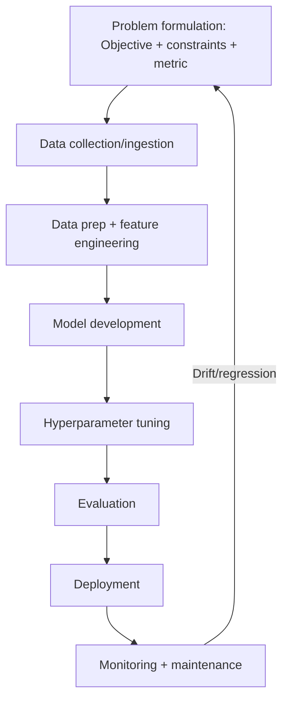

## PART I: MACHINE LEARNING FUNDAMENTALS

This section covers core ML concepts that form the foundation of the exam. Understanding these fundamentals is critical for answering both direct conceptual questions and scenario-based questions.

### Table of Contents

- [1.0 ML PROJECT LIFECYCLE + PROBLEM FRAMING](#10-ml-project-lifecycle--problem-framing-high-yield)
- [1.1 ALGORITHM CLASSIFICATION](#11-algorithm-classification)
- [1.2 SUPERVISED LEARNING](#12-supervised-learning)
- [1.3 UNSUPERVISED LEARNING](#13-unsupervised-learning)
- [1.4 NEURAL NETWORKS](#14-neural-networks)
- [1.5 MODEL PROBLEMS AND DIAGNOSTICS](#15-model-problems-and-diagnostics)
- [1.6 EVALUATION METRICS](#16-evaluation-metrics)
- [1.7 FEATURE ENGINEERING](#17-feature-engineering)
- [1.8 DATA SPLITTING](#18-data-splitting)
- [1.9 EXPLORATORY DATA ANALYSIS (EDA) BASICS](#19-exploratory-data-analysis-eda-basics-often-tested)
- [1.10 COMMON DATA SCIENCE PITFALLS](#110-common-data-science-pitfalls)

### Official docs (high-signal starting points)

- **Google ML Crash Course**: <a href="https://developers.google.com/machine-learning/crash-course">https://developers.google.com/machine-learning/crash-course</a>
- **ML Glossary**: <a href="https://developers.google.com/machine-learning/glossary">https://developers.google.com/machine-learning/glossary</a>
- **Data Preparation & Feature Engineering**: <a href="https://developers.google.com/machine-learning/data-prep">https://developers.google.com/machine-learning/data-prep</a>
- **Problem Framing**: <a href="https://developers.google.com/machine-learning/problem-framing">https://developers.google.com/machine-learning/problem-framing</a>
- **Clustering**: <a href="https://developers.google.com/machine-learning/clustering">https://developers.google.com/machine-learning/clustering</a>
- **Recommendation Systems**: <a href="https://developers.google.com/machine-learning/recommendation">https://developers.google.com/machine-learning/recommendation</a>
- **Testing & Debugging ML Models**: <a href="https://developers.google.com/machine-learning/testing-debugging">https://developers.google.com/machine-learning/testing-debugging</a>

### 1.0 ML PROJECT LIFECYCLE + PROBLEM FRAMING (high-yield)

Many exam questions are really about the **workflow** and **framing**, not the model.

#### Typical ML workflow (conceptual)

**Project scoping**: Decide if ML-based solution is appropriate; define success criteria and requirements

**Data Processing**:

- **Data ingestion & collection**: Gather data from various sources (logs, databases, APIs, sensors, user feedback)
- **Data preparation (ETL) & feature engineering**: Clean/preprocess raw data; handle missing values, normalization, joins; create new features; output curated training dataset

**Modeling**:

- **Model training & experimentation**: Train models iteratively; try different algorithms/architectures; tune hyperparameters; evaluate on validation set; track best model/version
- **Model evaluation & validation**: Thorough performance assessment; ensure business requirements met; check for overfitting, bias; additional testing on hold-out data or trial with real users

**Deployment**: Deploy trained model to production (API service, embedded in app, edge devices); set up inference infrastructure (compute environment for predictions)

**Monitoring & observability**: Continuously monitor:

- Operational metrics (latency, throughput, errors)
- Predictive performance on real data
- Input distribution vs training (drift detection)
- Error rates (via feedback)
- Signs of drift

**Maintenance & continuous improvement**: Based on monitoring and new needs:

- Collect new data (especially error cases)
- Retrain with updated data
- Adjust features
- Formulate new model if needed
- **Loops back** to earlier stages

**Key points**:

- **Not strictly linear**: Iterative cycle (CD4ML - Continuous Delivery for Machine Learning)
- **ML flywheel**: Ongoing cycle of improvement (data → model → deployment → monitoring → back to data)
- **Automation goal**: Shorten cycle, make as automated as possible (continuous delivery for ML)

**EXAM TIP:** The “primary goal” of ML is **making predictions / classifications** (not data collection).  
**EXAM TIP:** The “first step” is almost always **problem formulation + data collection** (you can’t tune/train without data).  
**EXAM TIP:** The “final step” for real systems is **monitoring and maintenance** (not just evaluation).

#### Common pitfall: poor framing

A very common failure mode is framing the wrong problem or using the wrong success metric.

**EXAM TIP:** Revisit framing throughout the lifecycle because constraints, data availability, and stakeholder goals change.

#### Roles in problem framing (exam-style simplification)

- **Product Manager / Business owner**: owns the business problem and success criteria (KPIs)
- **ML Engineer**: translates business challenge into an ML use case (problem type + measurable objective), and designs the production system
- **Data Scientist**: prototypes and validates modeling approaches; works with features/metrics; often produces notebooks

**EXAM TIP:** “Evaluate if ML is feasible and frame measurable ML objective” → typically **ML Engineer** (in exam scenarios), partnering with PM/stakeholders.  
**EXAM TIP:** “Interpret outputs vs business KPIs for non-technical stakeholders” → often **Business Analyst** / PM, with ML support.

### 1.1 ALGORITHM CLASSIFICATION

#### Parametric vs Non-Parametric Algorithms

Parametric algorithms have a fixed number of parameters that are learned from the training data. The model structure is predetermined, and once trained, the original training data is not needed for predictions.

- **Parametric Examples**: Linear Regression, Logistic Regression, Neural Networks (including DNNs), Naive Bayes, Linear SVM

Non-parametric algorithms do not assume a fixed model structure. The model complexity can grow with the amount of training data, and they often need to retain the training data for making predictions.

- **Non-Parametric Examples**: K-Nearest Neighbors (KNN), Decision Trees, Random Forest, SVM with RBF kernel, DBSCAN

**COMMON TRAP:** Neural Networks are **PARAMETRIC**, not non-parametric.

#### Lazy vs Eager Learning

This classification relates to when the algorithm does most of its computational work.

- **Lazy Learning (Instance-Based)**: The algorithm stores the training data and delays all computation until prediction time. K-Nearest Neighbors (KNN) is the classic example — it stores all training points and only calculates distances when a new prediction is needed.
- **Eager Learning**: The algorithm builds a model during the training phase and discards the training data afterward. Examples include Decision Trees, Neural Networks, Logistic Regression, and most other algorithms.

**EXAM TIP:** When asked about lazy learning, the answer is almost always **KNN**.

#### Ensemble Methods

Ensemble methods combine multiple models to achieve better performance than any single model. Understanding what IS and IS NOT an ensemble method is important for the exam.

| Method                   | Type                | Description                                                                |
| ------------------------ | ------------------- | -------------------------------------------------------------------------- |
| Random Forest            | Ensemble (Bagging)  | Multiple decision trees trained on bootstrap samples, predictions averaged |
| XGBoost                  | Ensemble (Boosting) | Sequential trees where each corrects errors of previous                    |
| Gradient Boosting        | Ensemble (Boosting) | Sequential additive ensemble of weak learners                              |
| AdaBoost                 | Ensemble (Boosting) | Weights misclassified examples higher in subsequent iterations             |
| Decision Tree            | NOT Ensemble        | Single tree - this is a base learner, not an ensemble                      |
| DCN (Deep Cross Network) | NOT Ensemble        | Single deep learning architecture                                          |

**COMMON TRAP:** A single Decision Tree is **NOT** an ensemble method. Random Forest (many trees) **IS** an ensemble.

### 1.2 SUPERVISED LEARNING

#### Classification Tasks

Classification predicts discrete class labels. The exam tests both the concepts and the technical implementation details.

##### Binary Classification

Predicts one of two classes (yes/no, spam/not-spam, fraud/legitimate). The output layer uses a sigmoid activation function that produces a probability between 0 and 1.

- **Activation**: Sigmoid \( \sigma(z) = 1/(1+e^{-z}) \)
- **Loss Function**: Binary Cross-Entropy (also called Log Loss)
- **Threshold**: Default 0.5, but can be adjusted based on precision/recall requirements

##### Multi-Class Classification

Predicts one of K mutually exclusive classes. Each example belongs to exactly ONE class.

- **Activation**: Softmax (outputs probabilities that sum to 1)

##### Loss Function Selection for Multi-Class

The choice of loss function depends on how your labels are encoded:

| Label Format                     | Loss Function                    | Example                          |
| -------------------------------- | -------------------------------- | -------------------------------- |
| One-hot encoded `[0,1,0]`        | Categorical Cross-Entropy        | Labels preprocessed to vectors   |
| Integer labels `(0, 1, 2)`       | Sparse Categorical Cross-Entropy | Raw integer class labels         |
| String labels (`'cat'`, `'dog'`) | Sparse Categorical Cross-Entropy | After label encoding to integers |

**EXAM TIP:** Labels are integers or strings (driver_license, passport, credit_card)? → Use **Sparse Categorical Cross-Entropy**.  
**EXAM TIP:** Labels are one-hot encoded vectors? → Use **Categorical Cross-Entropy**.

##### Multi-Label Classification

Each example can belong to MULTIPLE classes simultaneously (e.g., a movie can be both 'action' and 'comedy').

- **Activation**: Independent Sigmoid for each label
- **Loss Function**: Binary Cross-Entropy per label

#### Regression Tasks

Regression predicts continuous numeric values.

##### Linear Regression

- **Formula**: \(y = \beta_0 + \beta_1x_1 + \beta_2x_2 + \dots + \beta_nx_n + \epsilon\)

**Why Mean Squared Error (MSE)?**

Linear regression minimizes MSE, which comes from **Maximum Likelihood Estimation (MLE)** under the assumption that errors follow a **normal distribution**:

1. **Data generation process**: We assume \(y = X\theta + \epsilon\), where \(\epsilon \sim \mathcal{N}(0, \sigma^2)\)
2. **Likelihood**: The probability of observing data given parameters is maximized when MSE is minimized
3. **Result**: Minimizing MSE is equivalent to finding the parameters that maximize the probability of observing the data

**COMMON TRAP:** MSE is NOT chosen because it's differentiable or penalizes large errors. It's chosen because it's the optimal loss function under the Gaussian noise assumption.

**Key Assumptions of Linear Regression**:

Linear regression is only effective when certain assumptions are validated. These assumptions originate from the **data generation process** we assume when modeling:

**Assumption #1: Linearity**

- **What it means**: The relationship between features \(X\) and target \(y\) is linear
- **Origin**: We model \(y = X\theta + \epsilon\), which inherently assumes linearity
- **Violation**: Non-linear relationships (e.g., exponential, polynomial) cannot be captured
- **Detection**: Plot residuals vs. predicted values; look for patterns
- **Fix**: Transform features (log, polynomial), use non-linear models, or add interaction terms

**Assumption #2: Normal Distribution of Errors**

- **What it means**: Error terms \(\epsilon\) follow a normal distribution with zero mean: \(\epsilon \sim \mathcal{N}(0, \sigma^2)\)
- **Origin**:
  - **Central Limit Theorem**: Errors are the sum of many unmodeled factors, which tend toward normal distribution
  - **Statistical inference**: OLS estimators are linear functions of errors; normality enables hypothesis testing and confidence intervals
- **Violation**: Skewed or heavy-tailed error distributions affect statistical tests
- **Detection**:
  - Histogram/KDE plot of residuals
  - Q-Q plot of residuals (should follow diagonal line)
- **Fix**: Transform response variable (log, Box-Cox), use robust regression methods

**Assumption #3: Homoscedasticity (Constant Variance)**

- **What it means**: Error variance is constant across all levels of \(X\): \(\text{Var}(\epsilon_i) = \sigma^2\) for all \(i\)
- **Origin**: In the data generation process, we sample errors from the same distribution \(\mathcal{N}(0, \sigma^2)\) for all observations
- **Violation (Heteroscedasticity)**: Variance changes with \(X\) (e.g., larger errors for larger predictions)
- **Consequences**:
  - **Biased estimates**: OLS estimators are biased
  - **Inefficient estimates**: Larger standard errors than optimal
  - **Invalid inferences**: t-tests and confidence intervals become unreliable
- **Detection**:
  - Scatter plot of residuals vs. predicted values (should show constant spread)
  - Look for funnel shapes or patterns
- **Fix**:
  - Transform response variable (log, Box-Cox)
  - **Weighted Least Squares (WLS)**: Weight observations by inverse variance
  - Use robust standard errors (Huber-White)

**Assumption #4: No Autocorrelation (Independence of Errors)**

- **What it means**: Error terms are independent: \(\text{Cov}(\epsilon_i, \epsilon_j) = 0\) for \(i \neq j\)
- **Origin**: In the data generation process, we sample each error independently from the same distribution
- **Violation**: Errors are correlated (common in time series data)
- **Consequences**:
  - Standard errors are underestimated
  - Invalid statistical tests
- **Detection**:
  - **Domain knowledge**: Time series data often has autocorrelation
  - **Lag-based features**: Add lagged dependent variables; if coefficients are significant, autocorrelation exists
  - **Durbin-Watson test**: Statistical test for autocorrelation
- **Fix**:
  - **Time series models**: Use ARIMA, AR models that explicitly model autocorrelation
  - **Add lag features**: Include lagged values of dependent variable as features
  - **Generalized Least Squares (GLS)**: Accounts for correlation structure

**Assumption #5: No Multicollinearity**

- **What it means**: Independent variables are not highly correlated with each other
- **Origin**: When features are linearly dependent, the model cannot distinguish individual effects
- **Violation**: High correlation between features (e.g., height and weight, income and education)
- **Consequences**:
  - **Numerical instability**: Coefficient estimates become unstable
  - **Interpretation difficulty**: Cannot determine individual effect of each variable
  - **Inflated standard errors**: Makes coefficients appear insignificant
- **Detection**:
  - **Scatter plots**: Visual inspection of feature correlations
  - **Variance Inflation Factor (VIF)**:
    - Regress each feature against all other features
    - Calculate \(R^2_i\) for each feature
    - Compute \(\text{VIF}\_i = 1/(1-R^2_i)\)
    - **Rule of thumb**: VIF > 5 indicates multicollinearity
- **Fix**:
  - **Remove redundant features**: Drop highly correlated features
  - **L2 Regularization (Ridge)**: Shrinks coefficients, handles multicollinearity
  - **Principal Component Analysis (PCA)**: Transform to orthogonal components (loses interpretability)
  - **Feature engineering**: Combine correlated features into single feature

**EXAM TIP:** Questions about "assumptions violated" → check for **non-linearity** (residual plots), **heteroscedasticity** (funnel-shaped residuals), **autocorrelation** (time series), or **multicollinearity** (VIF > 5).

**EXAM TIP:** "Standard errors seem too small" → likely **autocorrelation** (time series) or **heteroscedasticity**.

**EXAM TIP:** "Cannot interpret individual feature effects" → likely **multicollinearity** → use **Ridge regression** or remove redundant features.

##### Regularization

Regularization adds a penalty term to prevent overfitting. Understanding the difference between L1 and L2 is critical:

| Type        | Penalty                   | Effect                                      | Use Case                                                 |
| ----------- | ------------------------- | ------------------------------------------- | -------------------------------------------------------- |
| L1 (Lasso)  | `λ Σ abs(βᵢ)`             | Drives coefficients to exactly ZERO         | Feature selection - removes irrelevant features entirely |
| L2 (Ridge)  | `λ Σ βᵢ²`                 | Shrinks coefficients but keeps all features | Handles multicollinearity, keeps all features            |
| Elastic Net | `λ₁ Σ abs(βᵢ) + λ₂ Σ βᵢ²` | Combination of both                         | When you want some sparsity with stability               |

**EXAM TIP:** If asked to remove non-informative features while keeping original features, use **L1** (not PCA). PCA transforms features and loses the originals.

#### Time Series Forecasting

Time series data has a temporal ordering that must be respected during model development.

- **ARIMA**: AutoRegressive Integrated Moving Average. Captures autocorrelation patterns.
- **BigQuery ML ARIMA_PLUS**: Google's auto-tuned version that handles seasonality, holidays, and trend automatically. This is often the 'minimum effort' answer for time series questions.

**COMMON TRAP:** Always split time series data by **TIME**, not randomly. Random splits cause data leakage because future data leaks into the training set.

**EXAM TIP:** For demand forecasting with structured data in BigQuery and 'minimum effort' requirement, the answer is usually BigQuery ML ARIMA_PLUS.

#### When NOT to Use Machine Learning

Not every problem requires ML. Some problems are better solved with traditional algorithms:

- Optimization problems with known constraints → Linear programming, shortest path algorithms
- Rule-based decisions with clear logic → Business rules engines
- Simple calculations → Direct formulas

**EXAM TIP:** Example: 'Optimize shuttle route with known stops and capacity constraints' → This is an optimization problem, use shortest path algorithm, NOT ML.

#### Benefits of ML Over Rule-Based Systems

When SHOULD you use ML instead of traditional rules-based approaches?

- **Rule-based limitation**: Can only match exact keywords or patterns
- **ML advantage**: Can identify PROBLEMATIC PHRASES and contextual meaning
- **Example**: Spam detection with 200K keywords → ML can detect new spam patterns and phrases not in the keyword list

**EXAM TIP:** Anti-spam with keyword list → ML benefit is identifying problematic PHRASES (not just longer keyword lists or faster matching).

### 1.3 UNSUPERVISED LEARNING

#### Clustering

Clustering groups similar data points without labeled examples.

##### K-Means

Iteratively assigns points to K cluster centroids and updates centroids until convergence.

- **Choosing K**: Elbow method (plot inertia vs K) or Silhouette score
- **BigQuery ML**: Can AUTO-OPTIMIZE the number of clusters - useful when you don't know how many segments exist
- **Use Cases**: Customer segmentation, anomaly detection (points far from centroids), node placement optimization

**EXAM TIP:** Customer segmentation with unknown number of clusters → BigQuery ML K-Means with auto-optimize.  
**EXAM TIP:** Fraud detection without labels → K-Means (outliers = potential fraud).

#### Unlabeled incident data (anomaly detection first)

When you don’t have labels for failures/incidents (e.g., predictive maintenance):

- **Good first step**: Build a baseline (often a **time-series forecast**) and alert on large residuals/deviations
- **Why**: Works without labels and gives you a practical triage signal

**EXAM TIP:** Predictive maintenance with no labeled incidents → forecast normal behavior and alert on deviations (anomaly detection).

##### DBSCAN

Density-based clustering that finds arbitrary-shaped clusters and identifies outliers as noise.

- **Parameters**: eps (neighborhood radius), min_samples (minimum points for core)
- **Advantage**: No need to specify K, handles non-spherical clusters

#### Dimensionality Reduction

##### PCA (Principal Component Analysis)

Linear transformation that projects data onto directions of maximum variance.

- **Use Cases**: Reduce correlated features, visualization, noise reduction
- **Important**: PCA TRANSFORMS the original features - you lose interpretability of original features

**COMMON TRAP:** PCA creates new transformed features. If the question asks to keep original features while removing non-informative ones, use L1 regularization instead.

**Pitfall: PCA for visualization**

- **Problem**: PCA is designed for dimensionality reduction, not visualization
- **Issue**: 2D PCA visualization only useful if first 2 components capture **most variance** (e.g., >80-90%)
- **Detection**: Plot cumulative explained variance (CEV) - if first 2 components explain <70% variance, visualization is misleading
- **Solution**: Use t-SNE or UMAP for visualization when PCA variance explained is low

**Pitfall: PCA assumes linear relationships**

- **Problem**: PCA finds linear subspaces; fails on non-linear data
- **Example**: Data conforms to curved low-dimensional manifold (e.g., spiral, circle)
- **Solution**: **KernelPCA** - uses kernel trick to project to high-dimensional space where data becomes linear, then applies PCA
- **Tradeoff**: KernelPCA is slower (quadratic in number of data points vs cubic in dimensions for PCA)

**EXAM TIP:** "Reduce dimensionality of large dataset" → PCA is the classic answer (but it transforms features).  
**EXAM TIP:** "Visualize high-dimensional data" → Check cumulative explained variance first; if <80%, use t-SNE/UMAP instead of PCA.  
**EXAM TIP:** "Non-linear dimensionality reduction" → **KernelPCA** (not standard PCA).

#### Similarity and Recommendations

##### Cosine Similarity

Measures the angle between two vectors. Range is [-1, 1] where 1 means identical direction.

- **Formula**: \( \cos(\theta) = (A\cdot B)/(\|A\|\times\|B\|) \)
- **Use Cases**: Document similarity, product affinity, recommendation systems

##### Word2Vec Embeddings

Neural network-based word embeddings that capture semantic relationships.

- **Use Case**: Article recommendations based on content similarity - encode articles as vectors, find similar vectors

**EXAM TIP:** Recommend similar articles → Word2Vec embeddings + vector similarity (cosine similarity).

##### Matrix Factorization

Decomposes a matrix into lower-rank matrices to find latent factors.

- **Use Cases**: Collaborative filtering, product recommendations, works well with sparse data
- **BigQuery ML**: MATRIX_FACTORIZATION model type supported

### 1.4 NEURAL NETWORKS

#### CNN (Convolutional Neural Networks)

Specialized architecture for grid-like data (images, video frames). Uses convolution operations to detect local patterns.

- **Key Components**: Convolution layers (with kernels/filters), Pooling layers (Max/Average), Stride, Padding
- **Use Cases**: Image classification, object detection, defect detection, signature recognition

##### Hardware Requirements for CNN

| Scenario                                         | Hardware Choice         | Reason                                      |
| ------------------------------------------------ | ----------------------- | ------------------------------------------- |
| CNN code without Estimator/tf.distribute wrapper | GPU                     | TPU requires Estimator API or tf.distribute |
| CNN with Estimator wrapper                       | GPU or TPU              | TPU-compatible code                         |
| Standard TensorFlow with Estimator               | TPU preferred for scale | Optimal for TF at scale                     |
| PyTorch                                          | GPU                     | TPU support limited for PyTorch             |

**COMMON TRAP:** CNN code that hasn't been wrapped in Estimator or tf.distribute CANNOT use TPU directly. Use GPU.

**EXAM TIP:** Easiest way to use GPU: Deep Learning VM (DLVM) with GPU and all libraries pre-installed.

#### Object Detection

- **TensorFlow Object Detection API**: Pre-built models for detecting and localizing objects in images/video
- **Models Available**: SSD (fast), Faster R-CNN (accurate), YOLO, EfficientDet
- **Output**: Bounding boxes with class labels and confidence scores

**EXAM TIP:** Detect obstacles from vehicle camera → TensorFlow Object Detection API.

#### Image Segmentation (Semantic / Instance)

Segmentation predicts a label per pixel (and can capture **shape/area** of regions).

- **Use Case**: Leaf disease rust spots where size/shape indicates severity
- **Why not classification**: Classification only predicts presence/absence per image, not boundaries

**EXAM TIP:** Need boundaries/size of regions (spots/lesions) → **segmentation**, not plain classification.

#### RNN / LSTM / GRU

For sequential data where order and temporal dependencies matter (text, time series, inventory).

- **LSTM**: Long Short-Term Memory. Gates (forget, input, output) + cell state solve vanishing gradient problem.
- **GRU**: Gated Recurrent Unit. Simplified LSTM with fewer parameters.

##### When to Use RNN/LSTM

- **Use Cases**: Inventory prediction with region, past demand, and seasonal trends; demand forecasting; stock prediction; text generation
- **Key Indicator**: Data has temporal dependencies - today's value depends on past values
- **NOT CNN**: CNN is for spatial patterns (images), not temporal sequences

**EXAM TIP:** Inventory prediction using region, location, past demand, seasonal trends → RNN/LSTM (not CNN).

#### Graph Neural Networks (GNNs)

**When to use GNNs**: When data has **interdependencies or connections** between entities that are not easily captured by fixed grids (images) or sequences (text).

**Key insight**: Traditional ML assumes **independent data points**. Graph data has **connected entities** where relationships matter.

**Common use cases**:

- **E-commerce recommendations**: Users and products form a graph; learn from user-product interactions
- **Social network analysis**: Detect fake accounts based on connection patterns (node classification)
- **Knowledge graphs**: Wikipedia articles connected by hyperlinks; recommend related articles
- **Fraud detection**: Cardholders and merchants form a graph; detect anomalous patterns
- **Document classification**: Words/phrases as nodes, co-occurrences as edges (graph-level classification)

**Three types of graph tasks**:

1. **Node-level tasks**: Predict labels/attributes for individual nodes
   - Example: Classify users as fake/legitimate in social network
2. **Edge-level tasks**: Predict existence or properties of edges (relationships)
   - Example: Recommend friends (predict if edge should exist between two users)
3. **Graph-level tasks**: Classify/regress entire graphs
   - Example: Classify research papers based on graph structure of concepts

**Challenges with graph data**:

1. **Irregular shapes**: Graphs vary in number of nodes and neighbors per node (unlike fixed-size images/sequences)
2. **Interdependence**: Nodes are connected; traditional ML assumes independence
3. **Permutation invariance**: No natural ordering of nodes; model must produce same output regardless of node order

**Graph Convolutional Networks (GCNs)**:

- **Most widely used GNN architecture**
- **Core idea**: Aggregate information from a node's **local neighborhood** (similar to CNN convolution on spatial patches)
- **Operation**: Combine node's own features with features of neighboring nodes
- **Normalization**: Normalize by node degrees to handle varying numbers of neighbors
- **Formula**: Uses symmetric normalization: \( \frac{1}{\sqrt{\deg(i)}\sqrt{\deg(j)}} \) to balance influence

**Key concepts**:

- **Node embeddings**: Low-dimensional vectors capturing node's position and neighborhood structure
- **Neighborhood aggregation**: Collect information from connected nodes
- **Graph representation**:
  - **Adjacency matrix**: O(N²) storage, sparse (wasteful)
  - **COO format** (coordinate list): O(E) storage, only stores edges (efficient)

**EXAM TIP:** "Data with connections/interdependencies between entities" → Consider **Graph Neural Networks** (GNNs).  
**EXAM TIP:** "Recommend products based on user-product interactions" → **Graph-based approach** with GNNs.  
**EXAM TIP:** "Detect fake accounts in social network" → **Node classification** task using GNNs.

**Note**: GNNs are typically more expensive to train than traditional approaches but can lead to more robust models when relationships matter.

#### High Cardinality Categorical Features

When dealing with categorical features with many unique values (10K+), standard one-hot encoding becomes impractical.

| Cardinality | Solution                          | Example                       |
| ----------- | --------------------------------- | ----------------------------- |
| < 1,000     | Standard one-hot encoding         | Countries, product categories |
| 1K - 100K   | One-hot HASH BUCKETS              | ZIP codes, user IDs           |
| > 100K      | Learned embeddings or pre-trained | Words in vocabulary           |

**EXAM TIP:** 100K unique words in NLP model → Use pre-trained word embeddings (not one-hot, not integer encoding).  
**EXAM TIP:** 10K+ categories → One-hot hash buckets (hashing trick).

### 1.5 MODEL PROBLEMS AND DIAGNOSTICS

#### Overfitting vs Underfitting vs Data Leakage

| Symptom                                              | Diagnosis                                   | Solutions                                                                    |
| ---------------------------------------------------- | ------------------------------------------- | ---------------------------------------------------------------------------- |
| High training accuracy, LOW validation/test accuracy | OVERFITTING (high variance)                 | More data, regularization (L1/L2), dropout, early stopping, simpler model    |
| LOW accuracy on BOTH training and validation         | UNDERFITTING (high bias)                    | More complex model, more features, longer training, less regularization      |
| 99% accuracy achieved with minimal effort, no tuning | DATA LEAKAGE                                | Check for features correlated with target, check for future data in training |
| Training converges but tests unsatisfactory          | OVERFITTING                                 | Regularization, decrease learning rate, early stopping                       |
| Great test performance, poor production performance  | Training-test overlap OR time-based leakage | Fix data split methodology                                                   |

**COMMON TRAP:** 99% AUC with no hyperparameter tuning = DATA LEAKAGE, not just overfitting. Look for target leakage or improper data splits.

**EXAM TIP:** Time-series classification with “99% AUC after a few runs” → assume **leakage** first:

- Check for **future information** in features (labels leaking into predictors)
- Ensure **time-based split** (not random split)
- Remove/repair features that are highly correlated _because they encode the target/future_

#### Data Drift (Distribution Shift)

When input data distribution changes over time, model performance degrades even though the model hasn't changed.

- **Symptoms**: Model accuracy steadily declines over months; model worked well initially but now performs poorly
- **Cause**: Production data no longer matches training data distribution (e.g., market changes, user behavior shifts)
- **Solution**: Set up ALARMS to track skew and retrain the model when drift is detected

| Issue                                         | Diagnosis    | Solution                             |
| --------------------------------------------- | ------------ | ------------------------------------ |
| Accuracy declining over time, model unchanged | DATA DRIFT   | Set up skew alarms + retrain         |
| 99% accuracy with no effort                   | DATA LEAKAGE | Check for correlated/future features |
| High train, low test accuracy                 | OVERFITTING  | Regularization, dropout              |

**EXAM TIP:** DNN deployed 6 months ago, performance degraded, input distribution changed → Set up skew alarms + retrain.  
**COMMON TRAP:** Feature selection does NOT fix data drift. You need to retrain on new data.

##### Solving Overfitting

When asked how to address overfitting, the exam often expects hyperparameter tuning:

**EXAM TIP:** Best answer for overfitting: Run a hyperparameter tuning job on AI Platform to optimize L2 regularization and dropout parameters.

#### Bias-Variance Tradeoff

- **Bias**: Error from overly simplistic assumptions. High bias = underfitting.
- **Variance**: Error from sensitivity to training data fluctuations. High variance = overfitting.

**EXAM TIP:** When asked 'minimize bias AND what other factor?' → The answer is VARIANCE.

#### Sanity check: does a DNN add value?

When you need a generic test that a DNN has enough capacity / is appropriate for the task:

- Train a **simple baseline** (e.g., linear / logistic regression)
- Verify the DNN **outperforms** the baseline on validation data

**EXAM TIP:** If a DNN doesn’t beat a linear baseline, either the DNN is misconfigured/underfitting or the problem may not require a DNN.

#### Class Imbalance

When one class is much rarer than others (e.g., 1% fraud), models struggle to learn the minority class.

| Technique                         | Method                                                       | When to Use                   |
| --------------------------------- | ------------------------------------------------------------ | ----------------------------- |
| Downsample majority + upweighting | Remove majority class samples, increase their weight in loss | Very large dataset            |
| Oversample minority               | Duplicate minority class examples (e.g., 10x)                | Smaller dataset               |
| SMOTE                             | Generate synthetic minority examples                         | When duplicates aren't enough |
| Class weights                     | Adjust loss function weights                                 | Built into most frameworks    |

**EXAM TIP:** 1% fraud detection → Valid answers: Oversample fraudulent 10x OR Downsample legitimate with upweighting. Both are correct approaches.  
**COMMON TRAP:** DON'T just 'remove negative examples until equal' - this loses too much information.

**COMMON TRAP:** Oversampling means duplicating minority examples (or SMOTE). Do **not** “multiply the transaction amount by 10” — that changes the feature values and corrupts the data.

#### Subgroup performance / fairness (often tested)

Sometimes performance is good overall but poor on a subgroup (e.g., certain languages, crowded-traffic scenes, minority demographics).

- **Diagnosis**: Data imbalance or mismatch for that subgroup
- **Fixes when you cannot collect more data**:
  - Reweight examples (higher weight for subgroup / minority)
  - Oversample minority / subgroup
  - Add fairness-aware regularization (e.g., MinDiff) to reduce disparity across groups

**EXAM TIP:** Poor performance on one subgroup and can’t collect more data → **reweight/oversample** that subgroup and retrain.

#### Gradient Optimization Issues

- **Symptom**: Gradient optimization has difficulty moving weights to a good solution
- **Cause**: Features with very different ranges (e.g., age 0-100, salary 0-1,000,000)
- **Solution**: NORMALIZATION - scale features to similar ranges

**EXAM TIP:** Different feature ranges causing gradient issues → Apply normalization.

#### Loss Oscillation During Training

When the loss oscillates instead of smoothly decreasing during batch training:

- **Symptom**: Loss values bounce up and down instead of converging
- **Cause**: Learning rate is too high - taking steps that are too large
- **Solution**: LOWER the learning rate hyperparameter

**EXAM TIP:** Loss oscillating during neural network training → Lower the learning rate.

### 1.6 EVALUATION METRICS

#### Classification Metrics

| Metric               | Formula              | When to Use                           | Example Scenario                     |
| -------------------- | -------------------- | ------------------------------------- | ------------------------------------ |
| Accuracy             | (TP+TN)/(All)        | Balanced classes ONLY                 | Equal spam/not-spam                  |
| Precision            | TP/(TP+FP)           | False positives are costly            | Spam filter (don't block good email) |
| Recall (Sensitivity) | TP/(TP+FN)           | False negatives are costly            | Cancer screening, fraud detection    |
| F1 Score             | 2×(P×R)/(P+R)        | Balance precision and recall          | General classification               |
| ROC-AUC              | Area under ROC curve | Compare models, threshold-independent | Model selection                      |
| PR-AUC               | Area under PR curve  | Imbalanced data                       | Rare event detection                 |

##### Special Properties of ROC-AUC

- **Scale Invariant**: Not affected by scaling of predictions
- **Threshold Invariant**: Evaluates across all possible thresholds

**EXAM TIP:** Metric that is both scale-invariant AND threshold-invariant → ROC-AUC.

#### Imbalanced data: “accuracy” can be misleading

If one class dominates (e.g., 90% renewals / 10% cancellations), a naive baseline (“always predict majority”) can beat a model that looks great on the minority class.

**EXAM TIP:** Always compare against the **majority-class baseline** and use **precision/recall/F1/PR-AUC** for imbalanced tasks (not accuracy alone).

##### Recall Definition (Frequently Tested)

Recall answers: "Of all the ACTUAL positive cases, what percentage did we correctly identify?"

**EXAM TIP:** "What percentage of actual spam was correctly identified?" → RECALL (TP/(TP+FN))

#### Metrics for Specific Use Cases

##### Content Moderation Metrics

When building models to flag content for human review (e.g., offensive comments):

- **Best Metric**: Precision and recall on a sample of messages FLAGGED BY THE MODEL
- **Why**: Measures how well the model identifies content that actually needs review

**EXAM TIP:** Content moderation model effectiveness → Precision/recall on sample of flagged messages.

##### Business Metrics for ML Models

| Scenario                   | Best Metric                                   |
| -------------------------- | --------------------------------------------- |
| Gaming matchmaking quality | User participation (battles per day per user) |
| Recommendation engine      | Click-through rate, conversion rate           |
| Churn prediction           | Retention rate improvement                    |
| Fraud detection            | Dollar amount of fraud prevented              |

**EXAM TIP:** Gaming team assignment model → Track user participation (games played per day).

#### Model interpretability (business-facing)

Interpretability tools help connect predictions to business decisions:

- **Local explanations**: why _this specific prediction_ happened (e.g., SHAP/LIME/attributions)
- **Goal**: make outputs actionable and auditable for stakeholders

**EXAM TIP:** Interpretability is about linking predictions to business objectives and trust—not about data preprocessing or architecture design.

#### Precision-Recall Tradeoff

You can trade off precision and recall by adjusting the classification threshold:

| Threshold Change   | Precision | Recall    | Effect                                          |
| ------------------ | --------- | --------- | ----------------------------------------------- |
| Increase threshold | INCREASES | DECREASES | Fewer positive predictions, more confident      |
| Decrease threshold | DECREASES | INCREASES | More positive predictions, catch more positives |

**EXAM TIP:** To INCREASE precision → DECREASE recall (raise the threshold).  
**EXAM TIP:** Medical staff dissatisfied despite high accuracy → Threshold probably too high, missing cases (low recall).

#### Regression Metrics

| Metric         | Formula               | Properties                               |
| -------------- | --------------------- | ---------------------------------------- |
| MAE            | `Mean(abs(y-ŷ))`      | Same units as target, robust to outliers |
| MSE            | `Mean((y-ŷ)²)`        | Penalizes large errors more heavily      |
| RMSE           | `√MSE`                | Same units as target                     |
| R² (R-squared) | `1 - (SS_res/SS_tot)` | Proportion of variance explained, 0-1    |

##### Anscombe's Quartet

Four datasets with identical summary statistics (mean, variance, correlation, R²) but very different distributions.

- **Lesson**: A good R² does NOT guarantee a good model. Always visualize your data.
- **Problems it reveals**: Non-linear relationships, outliers skewing results, clustered data

**EXAM TIP:** Good R² but poor results → Check for non-linearity, outliers, or Anscombe's Quartet issues.

### 1.7 FEATURE ENGINEERING

#### Handling Missing Values

The approach depends on whether the missingness itself carries information:

| Scenario                                  | Best Approach                                             |
| ----------------------------------------- | --------------------------------------------------------- |
| Missing completely at random, small %     | Delete rows with missing values                           |
| Numeric feature missing                   | Impute with mean or median                                |
| Categorical feature missing               | Impute with most frequent (mode)                          |
| Missing categorical WITH predictive power | Add new 'MISSING' class + create binary indicator feature |
| Complex missing patterns                  | Train separate model to predict missing values            |

**EXAM TIP:** Categorical feature A has predictive power but is sometimes missing → Add missing class + binary indicator.

**EXAM TIP:** Important numeric feature is missing and you can't drop rows → consider **model-based imputation** (e.g., regression to estimate missing values) rather than filling with zero.

### 1.8 DATA SPLITTING

#### The RAND() Bug in BigQuery

**WRONG Approach:**

`CREATE TABLE train AS SELECT * FROM data WHERE RAND() <= 0.8;`  
`CREATE TABLE test AS SELECT * FROM data WHERE RAND() <= 0.2;`

**Problem:** RAND() generates a NEW random number for each query. The same record might get RAND()=0.15 in the first query (included in train) and RAND()=0.18 in the second query (also included in test). Records appear in BOTH sets!

**CORRECT Approaches:**

- Use MOD on a hash: `WHERE MOD(FARM_FINGERPRINT(id), 10) < 8` for train
- Store random value first: Add a random_value column, then filter on that stored value

**COMMON TRAP:** Using RAND() in separate queries = overlapping train/test sets. This causes inflated performance metrics.

#### Time Series Data Splitting

- **WRONG**: Random split - future data leaks into training set
- **CORRECT**: Split by TIME - train on past data, validate/test on future data

**EXAM TIP:** Time series model works well in testing but poorly in production → Likely caused by random split instead of time-based split.

#### Group leakage (author/user/document leakage)

If multiple examples come from the same source entity (author, user, device, document), you must split by that **group** to avoid leakage.

- **Correct**: Assign authors/users to train/test/eval (80/10/10 by _authors_, then include all their texts)
- **Wrong**: Randomly split sentences/paragraphs across splits (leaks writing style/identity)

**Common scenarios**:

- **Image captioning**: Same image can have multiple captions → split by **image**, not by caption
- **Medical imaging**: Multiple views of same patient → split by **patient**, not by image
- **User behavior**: Multiple actions from same user → split by **user**, not by action

**Solution: GroupShuffleSplit** (sklearn):

- Groups all instances by grouping criteria (e.g., image_id, patient_id, user_id)
- Randomly assigns entire groups to train/test sets
- Prevents group leakage

**EXAM TIP:** NLP "political affiliation by author" → split by **author**, not by sentence/text chunk.  
**EXAM TIP:** Image captioning with multiple captions per image → use **GroupShuffleSplit** by image_id to prevent leakage.

#### Test Dataset Maintenance

When your product evolves, your test set should evolve too:

- **New products released**: EXTEND the test dataset with new product images
- **NOT**: Keep test set unchanged (won't evaluate new products)
- **NOT**: Replace test set entirely (lose ability to compare with historical performance)

**EXAM TIP:** New products added → Extend test dataset with new examples.

### 1.9 EXPLORATORY DATA ANALYSIS (EDA) BASICS (often tested)

EDA is for quickly understanding data quality and relationships before modeling.

- **Correlation matrix**: summarizes linear relationships between variables
- **Scatter plot**: visual check of relationship + anomalies/outliers
- **Box plot**: distribution + outlier detection

**EXAM TIP:** Need quick visuals + correlation stats on GCP → use **Vertex AI Workbench notebooks** (pandas/seaborn).  
**EXAM TIP:** Need a shareable, filterable stakeholder dashboard on BigQuery → **Looker Studio** (not TensorBoard).

#### Data quality dimensions (common definitions)

- **Accuracy**: correctness of values (are they right?)
- **Completeness**: missingness rate (% missing)
- **Consistency**: do values follow expected formats/rules across sources/time?
- **Duplication**: repeated records that bias training/evaluation

**EXAM TIP:** "Completeness metric" → missing data percentage.

#### Descriptive statistics (central tendency + spread + shape)

- **Central tendency**: mean / median / mode
- **Spread**: variance / standard deviation / IQR
- **Shape**: skewness (skewness coefficient), kurtosis

**EXAM TIP:** "Spread of a dataset" → variance (or standard deviation).  
**EXAM TIP:** "Skewness in distribution" → skewness coefficient.

#### Central Limit Theorem (CLT)

Even if the underlying distribution is not normal, the distribution of the sample mean tends toward normal as sample size grows.

**EXAM TIP:** CLT is a probability/distribution concept; it explains why normal approximations often work for large samples.

#### Hypothesis testing (what it is)

Used to assess whether an observed effect is statistically significant (e.g., A/B test outcomes).

**EXAM TIP:** Hypothesis tests evaluate significance; they do not "tune" models directly.

#### Normalization Techniques

| Technique                 | Method                   | When to Use                            |
| ------------------------- | ------------------------ | -------------------------------------- |
| Min-Max Scaling           | Scale to [0,1] or [-1,1] | Bounded data, neural networks          |
| Z-Score (Standardization) | (x - μ) / σ              | Unbounded data, assumes roughly normal |
| Log Scaling               | log(x)                   | Highly skewed distributions            |
| Feature Clipping          | Cap values at min/max    | Remove outliers                        |

**COMMON TRAP:** z-test is a statistical TEST, not a normalization technique. z-score IS normalization.

#### One-hot encoding across train/test

One-hot encoding must be fit on the training categories and applied consistently:

- If a category is **absent in test**, that column is just all zeros (this is fine)
- If an **unseen category appears in serving**, use an "unknown" bucket / hashing / embeddings

**EXAM TIP:** One-hot encode train and test consistently (don't reshuffle the split just because a category is missing in one subset).

#### Feature Engineering Techniques

- **Feature Cross**: Combine categorical features (e.g., [country × language]). Creates interaction features. For TABULAR data, not CNN.
- **Bucketization**: Convert continuous variable into categorical bins (e.g., age → age_group)
- **BigQuery ML**: QUANTILE_BUCKETIZE function creates equal-frequency buckets

**COMMON TRAP:** Feature Cross is for TABULAR data feature engineering, NOT for CNN. CNN uses convolution kernels.

##### Location-Based Feature Engineering

For models predicting outcomes based on geographic location:

- **Best Practice**: Feature cross of latitude × longitude, followed by BINNING
- **Why binning**: Raw lat/long coordinates are too granular; binning creates meaningful geographic regions
- **Output**: Use the direct target (e.g., profit) rather than intermediate values (revenue, expenses)

**EXAM TIP:** Predict profit by location → Feature cross lat×long + binning as features, profit as single output.  
**COMMON TRAP:** Don't use revenue AND expenses as separate outputs when profit is the actual target.

### 1.10 COMMON DATA SCIENCE PITFALLS

This section covers non-obvious pitfalls that can significantly impact model quality and reliability.

#### Pitfall #1: Decision Trees and Diagonal Boundaries

**Problem**: Decision trees create **perpendicular splits** (parallel to feature axes). If data has a **diagonal decision boundary**, trees require many splits to approximate it.

**Detection**:

- Visualize decision tree splits - if thresholds are very close together, tree is struggling
- Run PCA on features, fit tree on PCA projections
- If tree depth **significantly decreases** on PCA data, original data likely has diagonal separation

**Solution**:

- Use algorithms better suited for diagonal boundaries (logistic regression, SVM, neural networks)
- Or engineer features that align with perpendicular splits

**EXAM TIP:** Decision tree with many close thresholds → likely diagonal boundary → consider linear models or feature engineering.

#### Pitfall #2: Euclidean Distance with Correlated Features

**Problem**: Euclidean distance assumes **independent axes**. If features are correlated, Euclidean distance produces misleading results.

**Example**: Two points equidistant by Euclidean distance, but one lies within data distribution (should be closer).

**Solution**: **Mahalanobis Distance**

- Accounts for data distribution and feature correlations
- Steps: (1) Transform to uncorrelated variables, (2) Scale to unit variance, (3) Compute Euclidean distance in transformed space
- Formula accounts for covariance matrix

**Use cases**:

- **Outlier detection**: Better identifies outliers in high-dimensional correlated data
- **kNN variant**: Use Mahalanobis distance instead of Euclidean for correlated features

**EXAM TIP:** "Distance metric for correlated features" → **Mahalanobis distance** (not Euclidean).

#### Pitfall #3: Correlation ≠ Predictiveness

**Problem**: Correlation measures **symmetric linear association**, but:

- Associations can be **asymmetric** (date → month is easy, month → date is impossible)
- Correlation ignores **non-linear relationships**
- Correlation doesn't work on **categorical data**

**Solution**: **Predictive Power Score (PPS)**

- Measures **directional predictive power** (asymmetric: PPS(A→B) ≠ PPS(B→A))
- Works with **categorical and numerical** data
- Captures **linear and non-linear** relationships
- Uses decision tree to predict target, compares to baseline (F1 for classification, MAE for regression)

**When to use**:

- **Correlation**: General monotonic trend between variables
- **PPS**: Predictive power of a feature toward an outcome

**Pearson vs Spearman correlation**:

- **Pearson**: Only measures **linear** relationships
- **Spearman**: Measures **monotonic** relationships (linear + non-linear monotonic)
- Use Spearman for non-linear but monotonic relationships

**EXAM TIP:** "Measure how well feature X predicts outcome Y" → **Predictive Power Score** (not correlation).  
**EXAM TIP:** "Non-linear monotonic relationship" → **Spearman correlation** (not Pearson).

#### Pitfall #4: Summary Statistics Can Mislead

**Problem**: Summary statistics lose essential information. Multiple different distributions can have identical statistics.

**Examples**:

- **Anscombe's Quartet**: Four datasets with identical mean, variance, correlation, R² but very different distributions
- **Box plots**: Two different distributions can have identical box plots (same min, Q1, median, Q3, max)

**Solution**:

- **Always visualize** underlying data distribution
- Use **violin plots** or **KDE plots** alongside box plots
- **Raincloud plots**: Combine box plots + strip plots + KDE plots

**EXAM TIP:** "Good R² but poor model performance" → Check for non-linearity, outliers, or Anscombe's Quartet issues (visualize data).

#### Pitfall #5: Multivariate Covariate Shift

**Problem**: Univariate covariate shift detection (comparing individual feature distributions) misses **multivariate covariate shift**.

**Multivariate covariate shift**:

- Individual feature distributions remain the same: P(X₁) and P(X₂) unchanged
- But **joint distribution changes**: P(X₁, X₂) changes
- Univariate methods (Bhattacharyya distance, KS test) will miss this

**Detection methods**:

1. **Visual inspection**: For 2-3 features, scatter plots can reveal joint distribution changes
2. **Data reconstruction**:
   - Train **Autoencoder** (or PCA) on training data
   - Measure reconstruction error on production data
   - High reconstruction error → distribution has changed
   - **Advantage**: Works on **unlabeled data** (no need for immediate labels)

**Baseline approach**:

- Establish baseline reconstruction error on first week of production data
- Compare future weeks to baseline
- Large increase → covariate shift detected

**EXAM TIP:** "Individual features look same but model performance drops" → **Multivariate covariate shift** → Use **Autoencoder reconstruction error** to detect.

**EXAM TIP:** "Detect covariate shift without labels" → **Autoencoder reconstruction error** (works on unlabeled data).
