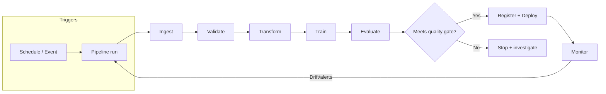

## PART IV: PIPELINES & ARCHITECTURE

### Table of Contents

- [4.0 WHY PIPELINES (AUTOMATION) MATTER](#40-why-pipelines-automation-matter)
  - [4.0.1 Data preparation & processing system basics](#401-data-preparation--processing-system-basics-exam-level)
  - [4.0.2 OPERATING DATA PIPELINES IN PRODUCTION](#402-operating-data-pipelines-in-production-test-style)
- [4.1 EVENT-DRIVEN TRAINING](#41-event-driven-training)
- [4.2 PREPROCESSING AT PREDICTION TIME](#42-preprocessing-at-prediction-time)
- [4.3 ARCHITECTURE PATTERNS](#43-architecture-patterns)
- [4.4 KUBEFLOW PIPELINES](#44-kubeflow-pipelines)
- [4.5 PIPELINE ORCHESTRATION OPTIONS](#45-pipeline-orchestration-options)
  - [4.5.1 PROMOTING A MODEL ARTIFACT TO PRODUCTION](#451-promoting-a-model-artifact-to-production-staging-first)
- [4.6 DATA PIPELINES](#46-data-pipelines)
- [4.7 MODEL MONITORING](#47-model-monitoring)
- [4.8 RESOURCE ORGANIZATION](#48-resource-organization)
- [4.9 CI/CD FOR ML](#49-cicd-for-ml)
- [4.10 PRODUCTION READINESS CHECKS (MLOps)](#410-production-readiness-checks-mlops)
- [4.11 CONTINUOUS TRAINING (CT) PATTERN](#411-continuous-training-ct-pattern)

### Official docs (high-signal starting points)

- **Vertex AI Pipelines**: [Vertex AI Pipelines Introduction](https://cloud.google.com/vertex-ai/docs/pipelines/introduction)
- Kubeflow Pipelines SDK: [kubeflow.org/docs/components/pipelines](https://www.kubeflow.org/docs/components/pipelines/)
- **Cloud Composer** (managed Airflow): [cloud.google.com/composer/docs](https://cloud.google.com/composer/docs)
- **Dataflow**: [cloud.google.com/dataflow/docs](https://cloud.google.com/dataflow/docs)
- **Dataproc**: [cloud.google.com/dataproc/docs](https://cloud.google.com/dataproc/docs)
- **Cloud Data Fusion**: [cloud.google.com/data-fusion/docs](https://cloud.google.com/data-fusion/docs)
- **Pub/Sub**: [cloud.google.com/pubsub/docs](https://cloud.google.com/pubsub/docs)
- **Cloud Functions**: [cloud.google.com/functions/docs](https://cloud.google.com/functions/docs)
- **Cloud Monitoring**: [cloud.google.com/monitoring/docs](https://cloud.google.com/monitoring/docs)
- **Cloud Logging**: [cloud.google.com/logging/docs](https://cloud.google.com/logging/docs)
- **Cloud Build** (CI/CD): [cloud.google.com/build/docs](https://cloud.google.com/build/docs)
- MLOps Best Practices: [MLOps Continuous Delivery](https://cloud.google.com/architecture/mlops-continuous-delivery-and-automation-pipelines-in-machine-learning)

### 4.0 WHY PIPELINES (AUTOMATION) MATTER

Automating ingestion, preprocessing, training, evaluation, and deployment reduces manual effort and improves reliability.

- **Primary benefit**: Less manual work + faster iteration + fewer human errors
- **Orchestration**: Scheduling/triggering runs and managing dependencies (DAGs)
- **Logging/monitoring**: Detect pipeline failures and bottlenecks early
- **Version control**: Reproducibility of pipeline code/config and rollbacks

**EXAM TIP:** Pipeline automation/orchestration is about streamlining the **end-to-end workflow**, not making data "random" or changing model accuracy.

#### MLOps: Background and Foundations

**What is MLOps?**: Machine Learning Operations (MLOps) is about integrating ML models into real-world software systems. It's where machine learning meets software engineering, DevOps, and data engineering.

**Key realization**: The ML model itself is only a **small part** of a production ML system. The surrounding infrastructure (data pipelines, feature engineering, serving infrastructure, monitoring, etc.) is much larger and more complex.

**Why MLOps matters**:

- **Models degrade over time**: Real-world conditions change (user behavior, data drift, concept drift)
- **Production requirements**: Must run continuously (24/7), handle evolving data, meet latency/throughput requirements
- **Without MLOps**: Manual, brittle processes lead to slow iteration, error-prone deployments, stale models in production

**MLOps vs DevOps**:

| Aspect          | Traditional Software             | ML Systems                                                         |
| --------------- | -------------------------------- | ------------------------------------------------------------------ |
| **Development** | Deterministic                    | Experimental, data-driven                                          |
| **Versioning**  | Code only                        | Code + data + models                                               |
| **Testing**     | Functional correctness           | Functional + data validation + model performance                   |
| **Deployment**  | Code push                        | Multi-step pipeline (retraining, validation, deployment)           |
| **Performance** | Code/infrastructure issues       | Model quality degradation (drift)                                  |
| **Monitoring**  | Service health (latency, errors) | Service health + model predictions (distribution shifts, accuracy) |
| **Lifecycle**   | Linear                           | Cyclical (feedback loops back to data collection)                  |

**MLOps = DevOps + data + models**

**System-level concerns in production ML**:

1. **Latency and throughput**:

   - **Latency**: Time from input to prediction (critical for user-facing apps)
   - **Throughput**: Predictions per unit time (critical for high-volume tasks)
   - **Trade-offs**: Model accuracy vs speed (simpler models, quantization, batch processing, caching)

2. **Data and concept drift**:

   - **Data drift**: Changes in input data distribution (e.g., summer photos → winter photos)
   - **Concept drift**: Changes in input-output relationship (e.g., pre-pandemic vs post-pandemic churn signals)
   - **Handling**: Monitoring (statistical tests, distribution tracking), thresholds/alerts, periodic retraining, online learning (with caution)

3. **Feedback loops**:

   - Model's predictions influence future input data (e.g., recommendation systems showing certain content → users click → skewed data)
   - **Managing**: Explore-exploit trade-off, debiasing training data, simulations/A/B tests, breaking the loop periodically

4. **Reproducibility**:
   - Ability to recreate model results reliably
   - **Requirements**: Version control (code, data, models), containerization (Docker), tests for data/models, fixed random seeds
   - **Why important**: Debugging, consistency across environments, collaboration

**EXAM TIP:** Questions about "model performance degrading over time" → think **data drift** or **concept drift** → solution is **monitoring + retraining**.  
**EXAM TIP:** Questions about "recreating results" or "consistency across environments" → think **reproducibility** → solution is **version control + containerization + tests**.

#### 4.0.3 The Machine Learning System Lifecycle (Detailed)

**Overview**: The ML lifecycle consists of interconnected stages: **Scoping → Data → Modeling → Deployment → Monitoring**. Each stage requires specific engineering practices and tooling for production readiness.

**Key insight**: "Developing ML models starts with engineering data." Data quality issues are more frequent causes of failure in production ML than algorithm issues. MLOps pays significant attention to data monitoring, validation, and versioning.

**1. Data Pipelines**

**Why data pipelines matter**: In ML, the quality and management of your data are often more important than the specific modeling algorithm. Production ML systems need robust data pipelines to reliably feed data into model training and inference.

**Key aspects**:

**A. Data Ingestion**:

- Getting raw data from various sources into your system/development environment
- **Batch ingestion**: Periodically importing a dump or running a daily job
- **Streaming ingestion**: Real-time processing of incoming events
- **GCP tools**: Cloud Storage (batch), Pub/Sub (streaming), Dataflow (processing)

**B. Data Storage**:

- Once ingested, data needs to be stored (often in both raw form and processed form)
- **Data lakes**: Low-cost storage for raw, unstructured/semi-structured data (Cloud Storage, AWS S3, on-prem HDFS)
- **Data warehouses**: Optimized for analytical queries (BigQuery)
- **Feature stores**: Centralized database of precomputed features for training and online inference
  - Ensures consistency between offline training data and online serving data
  - Examples: Vertex AI Feature Store, Feast, Tecton

**C. Data Processing (ETL)**:

- Raw data often needs heavy processing to become useful for modeling
- Includes: joining multiple data sources, cleaning, normalizing features, encoding categorical variables, creating new features
- **ETL pipeline**: Extract-Transform-Load pipeline
- **Tools**: Apache Spark, Dataflow, Dataproc, plain Python scripts with Pandas (depending on scale)
- **Output**: Curated dataset ready for model training

**D. Data Labeling and Annotation**:

- For supervised ML problems requiring labels (ground truth)
- **Process**: Obtain labels for data (naturally collected or human annotation)
- **Production systems**: Include labeling pipeline using internal teams or crowd-sourcing
- **Continuous labeling**: Label new data on ongoing basis

**E. Data Versioning and Metadata**:

- **Critical**: Track which data was used to train which model
- Data changes over time (new records appended, corrections applied)
- Need to know which version of dataset X was used for reproducibility, auditing, model comparison
- **Metadata logging**: Timestamps of data extraction, checksums of files, number of records
- **Tools**: DVC (Data Version Control), MLflow, custom solutions

**F. Offline vs Online Pipelines**:

| Aspect          | Offline Pipelines (Training) | Online Pipelines (Serving)               |
| --------------- | ---------------------------- | ---------------------------------------- |
| **Purpose**     | Create training datasets     | Compute features for real-time inference |
| **Latency**     | Can be heavy (hours)         | Must be lightweight and low-latency      |
| **Scale**       | Large batches                | Single user request                      |
| **Consistency** | Must match online pipeline   | Must match offline pipeline              |

**Challenge**: **Training/serving skew** - offline and online pipelines diverge, causing model to behave differently in production than in training.

**Solutions**:

- Use shared feature store
- Derive training data by simulating online computations
- Ensure consistent preprocessing logic

**EXAM TIP:** Questions about "data pipeline reliability" → think **ingestion, storage, processing, labeling, versioning**. Questions about "training/serving inconsistency" → think **shared feature store** or **simulate online computations**.

**2. Model Training and Experimentation**

**Context**: Training happens offline (research or batch environment), not directly in live production system. Production training management is more rigorous than ad-hoc experiments.

**Key considerations**:

**A. Experiment Tracking**:

- Track multiple approaches: different model architectures, features, hyperparameter settings
- **Record**:
  - Which code version produced the model
  - Which data subset was used
  - What hyperparameters were set
  - Evaluation metrics (accuracy, loss, AUC, etc.)
- **Benefits**: Answer questions like "which training run gave us 0.85 AUC?" or "did adding feature X improve accuracy?"
- **Tools**: MLflow, Weights & Biases, TensorBoard, Vertex AI Experiments

**B. Selecting a Winner & Model Validation**:

- Through experimentation, candidate model performs best on validation metric
- **Before production**: More rigorous evaluation
  - **Fresh hold-out test set**: Not seen during experimentation (unbiased estimate)
  - **Domain-specific evaluation**: Clinician review, edge case testing
  - **Ethical and bias review**: In some organizations
- **Best practice**: Establish baseline metrics and acceptance criteria at project start (e.g., "need at least 5% improvement")

**C. Training Pipeline Automation**:

- **Automate training process** as pipeline for repeatability and schedulability
- **Script sequence**: Fetch latest data → preprocess → train model → evaluate metrics → (optionally) push model to registry if good
- **Tools**: CI systems, custom scripts, Vertex AI Pipelines, Kubeflow Pipelines
- **Benefits**: Easy retriggering (e.g., "train new model every week with latest data")
- **Continuous retraining**: Automated training becomes especially important

**D. Resource Management**:

- Training modern ML models (especially deep learning) is computationally intensive
- **Leverage**: Cloud VMs with GPUs/TPUs, distributed computing clusters
- **Efficiency**: Right hardware, parallelize jobs, distributed training for large datasets/models
- **Cost optimization**: Spot instances, auto-scaling, Docker images for portability

**E. Hyperparameter Tuning**:

- **Automate**: Grid search, random search, Bayesian optimization
- **Results**: Fed back into experiment tracking system
- **Caution**: Don't over-tune to validation set (avoid subtle overfitting)
- **Best practice**: Final evaluation on truly blind test after tuning

**F. Collaboration and Reproducibility**:

- **Code version control**: Git for associating experiments with specific code commits
- **Feature branches**: Different model ideas
- **Environment management**: requirements.txt/pip, Conda, Docker
- **Goal**: If someone else re-runs training code, they get same result

**Output of training phase**:

- Trained model artifact (.pkl, SavedModel, ONNX, etc.)
- Accompanying metadata (training code version, data version, metrics)
- Confidence that model is ready to provide value

**EXAM TIP:** Questions about "tracking experiments" → think **experiment tracking tools** (MLflow, W&B). Questions about "reproducibility" → think **version control + environment management + fixed random seeds**.

**3. Model Deployment and Inference**

**Deployment**: Model is taken out of training environment and integrated into production system to serve predictions to end-users or other systems.

**Deployment patterns**:

- **Online real-time services**: API endpoints
- **Offline batch processing**: Scheduled jobs
- **Edge deployment**: End-user devices

**Key aspects**:

**A. Packaging the Model**:

- Trained model artifact needs to be packaged for production
- **Same environment**: Direct serialization (pickle, joblib, .h5, .pt)
- **Different environment**: Export to standardized format (ONNX) for cross-language support
- **Best practice**: Store versioned model artifact in Model Registry
- **Model Registry**: Database of models with versions and metadata (not every logged model, only models of interest)

**B. Deployment as a Service (Online Inference)**:

- **Common approach**: Deploy model as microservice behind API
- **Implementation**: Flask or FastAPI application that loads model on startup, exposes `/predict` endpoint
- **Input/Output**: Receives feature inputs (JSON), returns predictions (classification label or score) in real-time
- **Containerization**: Docker for consistency, run on server or Kubernetes cluster
- **Protocols**: RESTful APIs or gRPC
- **Scalability**: Multiple replicas, load balancer
- **Cloud platforms**: Amazon SageMaker, Azure ML, Vertex AI (automate endpoint creation)
- **Key metrics**: Latency and throughput (optimize with appropriate hardware, quantization if needed)

**C. Batch Inference**:

- **Use case**: Not every ML deployment is live API
- **Example**: Customer segmentation model runs once a week over all customer records, stores results in database
- **Implementation**: Scheduled job that loads model, processes large dataset, writes outputs
- **Scale**: Can use big data frameworks
- **Latency**: Not strict, but worry about throughput (efficiently process millions of records)
- **Advantage**: Use full power of distributed computing, don't keep service running 24/7

**D. Edge and Mobile Deployment**:

- **Constraint**: Limited compute, power, no direct update unless user updates app
- **Techniques**: Model compression (pruning, quantization), specialized runtimes
- **Example**: Voice assistant model on smart speaker (small and efficient)

**E. Integrating with Larger System**:

- **Beyond model code**: Integration with existing systems
- **Example**: Fraud detection model service called by transaction processing system
- **Considerations**:
  - Application logic outside model
  - Fallback or manual override (if model service down, default to safe behavior)
  - Escalation to human review (if model not confident)

**F. Canary Releases and A/B Testing**:

| Aspect      | Canary Deployment                   | A/B Testing                             |
| ----------- | ----------------------------------- | --------------------------------------- |
| **Focus**   | Risk reduction and stability        | Optimization and feature effectiveness  |
| **Metrics** | Operational (errors, performance)   | User behavior (conversions, engagement) |
| **Group**   | Small, representative               | Statistically significant, balanced     |
| **Use**     | Identify issues before full rollout | Compare business metrics                |

**Canary deployment**:

- Send small percentage of traffic to new model
- Compare behavior/outputs/performance with old model
- If good (no errors, better metrics), gradually increase traffic

**A/B testing**:

- Portion of users get predictions from new model, others from control (old model)
- Compare business metrics (e.g., recommendation system: clicks, conversions)
- Can be online (real-time) or offline (analyze logs)

**Note**: Canary deployment can precede A/B test (ensure new version is stable before experimental setting)

**G. Scaling and Reliability**:

- **Horizontal scaling**: Running N replicas (Kubernetes auto-scaling)
- **Reliability practices**:
  - **Health checks**: Service reports if model is loaded and functioning
  - **Logging**: Requests and responses (sampling for analysis)
  - **Alerting**: Error rates or latency spikes → notify on-call engineers
- **Monitoring**: Both system level (latency, throughput) and application level (model loading failures, weird outputs)

**H. Model Registry & CI/CD Integration**:

- **Model registry**: Central repository storing and managing different versions of ML models
- **When model trained and approved**: Register in model registry with version number (e.g., "FraudModel v1.3")
- **Deployment**: Pull model from registry
- **CI/CD integration**: Once tests passed and model approved, CI pipeline automatically builds Docker image, deploys to staging
- **Governance**: Track which version is in staging vs production, know exact model binary running in production

**Success criteria**: Latency, throughput, reliability (uptime, error handling). Model accuracy in lab isn't enough if it takes 10 seconds to respond or crashes often.

**EXAM TIP:** Questions about "deploying model as API" → think **FastAPI/Flask + Docker + Kubernetes**. Questions about "safe model rollout" → think **canary deployment** or **A/B testing**. Questions about "model versioning" → think **Model Registry**.

**4. Monitoring and Observability**

**Critical phase**: After deployment, ML model needs continuous monitoring. This is where much of ongoing work in ML in production lies.

**Three categories**:

**A. Operational Monitoring**:

- **Traditional aspect**: Ensure service is up and responding
- **Key metrics**:
  - Latency (response time)
  - Throughput (requests per second)
  - Error rates (HTTP 5xx errors)
  - Resource usage (CPU, memory, GPU utilization)
- **Tools**: Prometheus/Grafana, CloudWatch, Cloud Monitoring
- **Alerts**: Set up for anomalies (latency spikes, service down)
- **Logging**: Log calls to model (input features and outputs) for debugging and analysis (with sampling and privacy considerations)

**B. Data Quality and Drift Monitoring**:

- **Unique ML challenge**: Ensure input data remains within bounds of what model knows
- **Data drift**: Distribution of input data changes over time
  - **Example**: Image classification model trained on daytime images, now getting night-time images (pixel distribution changes)
- **Concept drift**: Relationship between input and output changes
  - **Example**: Spam filter's definition of spam changes as spammers adopt new techniques
- **Monitoring approach**: Statistical checks on incoming data
  - Track mean/standard deviation of numeric features
  - Track frequency of categories
  - Compare against training data
- **Advanced metrics**: Population stability index (PSI), KL divergence
- **Significant deviation**: Could indicate drift

**C. Model Performance Monitoring**:

**Challenge**: Often don't immediately know "right answer" for each prediction in production.

**Approaches**:

**1. Proxy Metrics**:

- **Classification**: Monitor confidence scores distribution
  - If model suddenly very unsure (lower confidence) or too sure (extreme probabilities), something might be off
- **Prediction rate**: Monitor rate of positive predictions
  - **Example**: Fraud model historically predicted 15% as fraud, now flagging 55% → red flag
- **Regression**: Monitor range of outputs
  - **Example**: Price prediction suddenly negative or extremely large → issue

**2. Ground Truth Feedback**:

- **Eventual ground truth**: Some systems get true outcomes later
  - **Example**: Recommendation system (user clicks = ground truth), credit scoring (user defaulted = ground truth, but long delay)
- **Close the loop**: When true outcomes available, measure model's actual accuracy on recent data
- **Periodic back-testing**: Take sample of past predictions and outcomes, compute metrics (accuracy, precision/recall), track over time
- **Drop in metrics**: Indicates performance degradation (drift or model staleness)

**3. Shadow Models**:

- **Advanced setup**: Deploy shadow model (new version running alongside old, not impacting decisions)
- **Purpose**: Compare outputs to current model
- **Use case**: New model version in shadow gets live traffic inputs, compare predictions
- **Benefit**: Highlight cases where they disagree, analyze if new model would do better or worse

**4. Business Metrics**:

- **Ultimate measure**: If ML model is core to product, performance shows up in business KPIs
- **Example**: Recommendation model gets worse → drop in engagement (click-through rate, watch time)
- **Challenge**: Metrics are noisy, affected by many factors
- **Best practice**: Work with product owners to define success in production, track relevant KPIs

**Key insight**: Model performance ≠ business performance. Model with slightly lower accuracy might perform better in business terms if more aligned with real goal or user experience.

**D. Alerting and Response**:

- **Policies**: What to do when something is off
- **Examples**:
  - Data drift crosses threshold → automatically retrain (if possible) or alert engineer
  - Model accuracy falls below threshold → roll back to previous model version
- **Automatic rollback**: Some systems implement (e.g., if new model's metric is 5% worse than old, revert traffic)
- **Manual intervention**: Many organizations still rely on (automated decisions can be tricky if monitoring metric is noisy)
- **Runbook**: Operations team should have procedures for issues
  - Model sends too many alerts → retrain on fresh data or check data pipeline
  - Service latency degrades → scale out or optimize code

**Why monitoring is crucial**:

- **High-stakes domain**: Medical diagnosis - if data changes (new sensor equipment) and model predictions become less accurate, serious consequences if not detected
- **Less critical domain**: Ad click prediction - failing to monitor means serving suboptimal model for months, losing significant revenue

**Summary**: Monitoring "closes the loop" in ML lifecycle. Feeds information from live system back to development process. Ensures model continues to do what you expect, provides signals for when to refresh or improve it.

**EXAM TIP:** Questions about "monitoring ML systems" → think **operational monitoring + drift monitoring + model performance monitoring**. Questions about "data drift" → think **statistical checks on input distribution**. Questions about "concept drift" → think **relationship between input and output changes**.

**5. Hands-On: Training to API (FastAPI + Docker)**

**Goal**: Simulate taking a trained model from Jupyter notebook to web service.

**Steps**:

1. **Train and serialize model** (offline, in notebook/script)
2. **Write FastAPI application** that loads model and defines prediction endpoint
3. **Run API server** and test with sample inputs
4. **Containerize app** with Docker (for reproducibility and deployment)

**Example: Iris Classification Model**:

```python
# train.py - Train and save model
from sklearn.ensemble import RandomForestClassifier
from sklearn.datasets import load_iris
import joblib

iris = load_iris()
X, y = iris.data, iris.target

model = RandomForestClassifier(n_estimators=50)
model.fit(X, y)

joblib.dump(model, 'iris_model.pkl')
```

```python
# app.py - FastAPI inference service
from fastapi import FastAPI
from pydantic import BaseModel
import joblib
from sklearn.datasets import load_iris

app = FastAPI()
model = joblib.load('iris_model.pkl')
iris = load_iris()

class IrisFeatures(BaseModel):
    sepal_length: float
    sepal_width: float
    petal_length: float
    petal_width: float

@app.get("/health")
def health():
    return {"status": "healthy"}

@app.post("/predict")
def predict(features: IrisFeatures):
    input_array = [[features.sepal_length, features.sepal_width,
                    features.petal_length, features.petal_width]]
    prediction = model.predict(input_array)[0]
    probabilities = model.predict_proba(input_array)[0]

    return {
        "species": iris.target_names[prediction],
        "confidence": round(float(max(probabilities)), 3)
    }
```

```dockerfile
# Dockerfile
FROM python:3.11-slim
WORKDIR /app
COPY app.py iris_model.pkl requirements.txt .
RUN pip install -r requirements.txt
EXPOSE 80
CMD ["uvicorn", "app:app", "--host", "0.0.0.0", "--port", "80"]
```

**Key production considerations**:

- Model serialization (reproducibility)
- Separated training and serving
- API with well-defined contract (Pydantic schema)
- Easy scaling (multiple containers)
- Health check endpoint
- Input validation

**In full MLOps setup**: CI/CD pipeline picks up new model version from registry, deploys new service version (staging first, then production).

**EXAM TIP:** Questions about "deploying model as API" → think **FastAPI/Flask + Docker + container orchestration**. Questions about "model serving" → think **API endpoint + model loading + input validation**.

#### 4.0.4 Reproducibility and Versioning in ML Systems

**Overview**: Reproducibility means you can repeat an experiment or process and get the same results. In ML, this is critical for trust, collaboration, debugging, and compliance. Reproducibility ties closely with versioning—to reproduce an experiment, you need to know exactly which code, data, and parameters were used.

**Key insight**: "If it isn't reproducible, it's not science." In MLOps, if it isn't reproducible, it won't be robust in production. Reproducibility turns ML from a one-off art into an engineering discipline.

**Why Reproducibility Matters**:

**A. Debugging and Error Tracking**:

- If model performance suddenly drops or discrepancy between offline and online behavior, reproducing training process exactly helps pinpoint cause
- **Questions to answer**: Was it a code change? New library version? Different random seed?
- **Without reproducibility**: Effectively chasing a moving target

**B. Collaboration**:

- One engineer might want to rerun another's experiment to verify results or build on it
- **Goal**: Reproducing someone's work should be as easy as pulling code and data and running a script
- **Reality without reproducibility**: "What environment did you use?" guessing game

**C. Regulations and Compliance**:

- Industries like healthcare, finance, autonomous vehicles need to prove how model was built and that it behaves consistently
- **Example**: Bank showing regulators exact training procedure for credit risk model
- **Challenge scenarios**: If model decision is challenged (bias accusations), need to recreate how decision came to be

**D. Continuity**:

- Personnel changes happen—original author might leave company
- **With reproducibility**: Next person can pick up where they left off
- **Without reproducibility**: Organizations risk losing "knowledge" locked in model

**E. Production Issues**:

- Models retrained periodically—if new version performs worse, reproducibility helps compare runs
- **Rollback**: If need to roll back to previous model, should ideally retrain it (if data changed) or have exact artifact
- **Versioning**: Allows fetching exact model version when needed

**Challenges to Reproducibility**:

1. **Randomness**: ML outcome depends on randomness (initial weights, random train-test split). Two runs with same code/data could yield slightly different models if not controlled.

2. **Data Versioning**: Data is large—can't just throw dataset into Git easily. Data may update over time. Need to version both code and data.

3. **Environment Matters**: Library versions, hardware (floating-point precision differences on different GPUs), OS. If training code relies on system-specific behavior, that's a reproducibility risk.

4. **Moving Pieces**: ML models and pipelines have many components (hyperparameters, feature pipelines, preprocessing steps). Easy to have "experiments" not fully tracked (manual tweaks in notebook, forgotten).

**Best Practices for Reproducibility and Versioning**:

**A. Ensure Deterministic Processes**:

- **Set random seeds**: `np.random.seed(0)`, `random.seed(0)`, TensorFlow/PyTorch seed settings
- **Note**: Some parallel or GPU operations inherently non-deterministic (race conditions, reduced precision)
- **Bit-for-bit identical**: Might require sacrificing performance (frameworks have "deterministic" mode, slower)
- **Practical approach**: Reproducibility within tolerance often enough (similar performance and outputs, not bit-identical)
- **Control sources**: Data shuffling order, weight initialization, etc.
- **Multiple threads**: Order of execution could vary. Fix seeds and use single thread for critical parts.
- **Rule of thumb**: If someone runs training pipeline twice on same machine, should yield effectively same model (or metrics)

**B. Version Control for Code**:

- **Non-negotiable**: All code (data preparation scripts, model training code) should be in Git
- **Every experiment**: Should tie to Git commit or tag
- **Include Git commit hash**: In model's metadata (allows tracing back from model to code)
- **Code versioning**: Well-understood in software engineering; ML extends rigor to other artifacts

**C. Version Data**:

- **Minimum**: Save snapshot or reference to exact data used for training
- **Challenge**: Training data in database constantly changing—might need to snapshot it
- **Tool**: DVC (Data Version Control) extends Git workflows to data and models
  - Doesn't store actual data in Git, but stores hashes/references
  - Data files versioned externally (cloud storage) while tying into Git commits
  - **Example**: Track `train.csv`—DVC records hash of file (or pointer to cloud object)
  - **Later**: Can reproduce exact file even if large
- **DVC**: "Git-like experience to organize your data, models, and experiments"

**D. Test for Reproducibility**:

- **Process**: Verify reproducibility after training
- **Quick test**: Load model, run on known test input, see if results as expected
- **Ensures**: Model file not corrupted, environment can produce same outputs
- **Retrain test**: Retrain model with same data (different random seed or benign change), ensure metrics in same ballpark
- **Wild differences**: Indicate bug or unstable training process
- **Critical models**: Might have "reproducibility test" in CI (re-run old training job on archive data)

**E. Track Experiments and Metadata**:

- **Tool**: Experiment tracker (MLflow, Weights & Biases)
- **When training script executes**, log:
  - Unique run ID
  - Parameters used (hyperparameters, training epochs, etc.)
  - Metrics (accuracy, loss over epochs, etc.)
  - Code version (Git hash)
  - Data version (DVC data hash or dataset ID)
  - Model artifact or reference to it
  - Environment info (library versions)
- **Result**: Record of each experiment
- **Best run**: If run #42 was best and became production, anyone can inspect run #42's details and reproduce it
- **MLflow concepts**:
  - **Experiment**: Named collection of runs
  - **Run**: Single execution of ML workflow within specific experiment (encapsulates code, parameters, metrics, artifacts)

**F. Version Model Artifacts**:

- **Every production model**: Give it version number or ID, register in model registry
- **Tool**: MLflow Model Registry provides central place to manage models with versions and stages (e.g., "v1-staging", "v1-production")
- **Model registry entry contains**:
  - Model artifact
  - Metadata (who created it, when)
  - References to experiment or code
  - **Lineage**: Which run (with which parameters and data) produced that model
- **Benefits**: Even if deploy model v5 today, can still fetch model v3 if needed, know exactly what each version is

**G. Data and Model Lineage Logging**:

- **When model trained**: Log references to exact data
- **Examples**:
  - Data lake with partitions: Note which partition or timestamp
  - Database query: Include query or data checksum in log
- **Advanced setups**: Data lineage tools (track data provenance through pipelines)
- **Most setups**: Record "used file X of size Y bytes, with checksum Z" is great
- **DVC**: DVC commit ID acts as the link

**H. Environment Management**:

- **Capture software environment**:
  - **requirements.txt** or **environment.yml** (Conda) to pin library versions
  - **Avoid floating dependencies**: Don't say "pandas" without version (update could change behavior)
- **Containerize if possible**: Docker image as exact snapshot of environment (version Docker images: `my-train-env:v1`)
- **If not containers**: Use virtual environments to isolate dependencies
- **Infrastructure as code**: Script cloud instances or specific hardware (even infrastructure differences like GPU capabilities less likely to creep in)

**Trade-offs**:

- **Absolute reproducibility (bit-for-bit)**: Sometimes unnecessarily strict
- **Practical approach**: Care that performance or behavior is reproducible within tolerance, not exact weights
- **Example**: Training deep net gives 0.859 accuracy one time, 0.851 next time—effectively same in usefulness
- **Problem indicator**: 0.88 one time, 0.80 another with supposedly same setup—indicates problem
- **Business perspective**: Consistency of quality matters, not bit-for-bit identical
- **If can achieve bit-for-bit easily**: Do it (simplifies debugging), but be aware of sources of nondeterminism

**Key Principle**: "If it's not logged or versioned, it didn't happen."

**Teams often adopt**:

- Checklists or automation to enforce (e.g., training script automatically logs to MLflow so you can't forget)
- Discipline and culture as much as tools
- Habit: "Did I commit that code? Did I tag the data version? Am I logging the runs?"

**Hands-On Examples**:

**1. PyTorch Model Training Loop and Model Persistence**:

```python
import torch
import torch.nn as nn
import torch.optim as optim

# Set seed for reproducibility
torch.manual_seed(0)

# Define simple neural network
class Net(nn.Module):
    def __init__(self):
        super(Net, self).__init__()
        self.fc1 = nn.Linear(10, 5)
        self.fc2 = nn.Linear(5, 1)

    def forward(self, x):
        x = torch.relu(self.fc1(x))
        x = self.fc2(x)
        return x

# Create model instance
model = Net()
criterion = nn.MSELoss()
optimizer = optim.SGD(model.parameters(), lr=0.01)

# Dummy data (in practice, use DataLoader)
X = torch.randn(100, 10)
y = torch.randn(100, 1)

# Training loop
for epoch in range(5):
    optimizer.zero_grad()
    outputs = model(X)
    loss = criterion(outputs, y)
    loss.backward()
    optimizer.step()
    print(f'Epoch {epoch+1}, Loss: {loss.item():.4f}')

# Save model weights
torch.save(model.state_dict(), 'model_weights.pth')

# Load model
model2 = Net()
model2.load_state_dict(torch.load('model_weights.pth'))
model2.eval()  # Set to evaluation mode

# Save checkpoint (for resuming training)
checkpoint = {
    'epoch': 5,
    'model_state_dict': model.state_dict(),
    'optimizer_state_dict': optimizer.state_dict(),
    'loss': loss.item(),
}
torch.save(checkpoint, 'checkpoint.pth')
```

**Key points**:

- Set `torch.manual_seed(0)` for reproducibility
- Save `state_dict()` (recommended, contains model parameters)
- Can also save entire model, but saving state dict + code to define class is more version-proof
- Checkpoint contains everything to resume training (model weights, optimizer state, epoch, loss)

**2. Git + DVC for Version Control**:

**Setup**:

```bash
# Initialize Git and DVC
git init
dvc init

# Add DVC config to Git
git add .dvc .gitignore
git commit -m "Initialize DVC"

# Track dataset with DVC
dvc add data.csv
# Creates data.csv.dvc (tracked by Git)
# Adds data.csv to .gitignore

# Set up DVC remote (e.g., cloud storage)
dvc remote add -d myremote s3://bucket/path
# Or local: dvc remote add -d myremote /path/to/remote

# Push dataset to remote
dvc push

# Pull dataset (on another machine)
dvc pull

# Update dataset
# Modify data.csv
dvc add data.csv  # Updates .dvc file with new hash
git add data.csv.dvc
git commit -m "Update dataset"
dvc push

# Restore older version
git checkout <old-commit-hash>
dvc checkout  # Restores data.csv from that commit
```

**DVC workflow**:

- DVC stores hashes/references in `.dvc` files (tracked by Git)
- Actual data stored externally (cloud storage, local remote)
- `data.csv.dvc` contains hash and size of data file
- When commit changes, DVC file hash changes
- Can restore older versions using Git + DVC checkout

**3. MLflow for Experiment Tracking**:

```python
import mlflow
import mlflow.sklearn
from sklearn.ensemble import RandomForestClassifier
from sklearn.svm import SVC
from sklearn.metrics import accuracy_score, log_loss
from sklearn.datasets import load_iris
from sklearn.model_selection import train_test_split

# Load data
iris = load_iris()
X_train, X_test, y_train, y_test = train_test_split(
    iris.data, iris.target, test_size=0.2, random_state=42
)

# Set experiment name
mlflow.set_experiment("Iris_Classification_Comparison")

# Train and track multiple models
models = {
    "RandomForest": RandomForestClassifier(n_estimators=100),
    "SVC": SVC(probability=True),
}

for model_name, model in models.items():
    with mlflow.start_run(run_name=model_name):
        # Train model
        model.fit(X_train, y_train)

        # Predictions
        y_pred = model.predict(X_test)
        y_pred_proba = model.predict_proba(X_test)

        # Calculate metrics
        accuracy = accuracy_score(y_test, y_pred)
        log_loss_score = log_loss(y_test, y_pred_proba)

        # Log parameters and metrics
        mlflow.log_params({
            "n_estimators": 100 if model_name == "RandomForest" else None,
            "model_type": model_name
        })
        mlflow.log_metrics({
            "accuracy": accuracy,
            "log_loss": log_loss_score
        })

        # Log model
        mlflow.sklearn.log_model(model, "model")

# Register best model
best_run_id = "..."  # From MLflow UI or logged output
mlflow.register_model(
    f"runs:/{best_run_id}/model",
    "IrisBestModel"
)

# Load registered model for inference
model = mlflow.sklearn.load_model("models:/IrisBestModel/latest")
# Or specific version: "models:/IrisBestModel/1"

# Save model to local directory
mlflow.sklearn.save_model(
    mlflow.sklearn.load_model("models:/IrisBestModel/1"),
    "model_dir"
)
```

**MLflow features**:

- **Experiment tracking**: Log parameters, metrics, models
- **Model registry**: Register models with versions and stages
- **UI**: Browse experiments, compare runs, visualize metrics
- **Model loading**: Load registered models by name and version
- **Lineage**: Track which run produced which model

**4. Weights & Biases (W&B) for Reproducible ML**:

**W&B Philosophy**: "The developer-first MLOps platform" - cloud-based, focused on experiment tracking, dataset/model versioning, and collaboration. Central thesis: highest-leverage activity in ML is the cycle of training → tracking → comparing → deciding what to try next.

**MLflow vs W&B Comparison**:

| Feature / Aspect        | MLflow                                     | Weights & Biases (W&B)                                            |
| ----------------------- | ------------------------------------------ | ----------------------------------------------------------------- |
| **Nature**              | Open-source, self-hosted (local or server) | Cloud-first, hosted (free & paid tiers)                           |
| **Experiment Tracking** | Logs parameters, metrics, artifacts        | Similar but with richer visualizations                            |
| **UI**                  | Basic web UI, simple plots                 | Advanced dashboard with interactive charts                        |
| **Collaboration**       | Limited                                    | Strong: team dashboards, reporting                                |
| **Artifacts Storage**   | Local (default)                            | Hosted (or external bucket with integration)                      |
| **Ease of Use**         | Simple Python API, more manual config      | User-friendly, lots of integrations (PyTorch, Keras, HuggingFace) |
| **Offline Use**         | Fully possible (local logging + UI)        | Offline possible, but main strength is online                     |
| **Best For**            | Local/enterprise setups, custom infra      | Fast setup, collaboration, visualization-heavy workflows          |

**Why W&B if you know MLflow?**:

- **Managed vs self-hosted**: W&B offers fully managed SaaS; MLflow usually needs tracking server
- **Richer visualizations**: W&B offers better dashboards and collaboration out of the box
- **Seamless integration**: Artifact storage and model registry integrated seamlessly
- **Team-oriented**: Easy sharing and reporting

**Core takeaway**: W&B cuts infra overhead and boosts collaboration/visualization, while MLflow is leaner but self-managed. Choice depends on use case.

**W&B Key Concepts**:

- **Project**: Groups runs together (similar to MLflow "Experiment")
- **Run**: Single execution of ML workflow within project
- **Artifacts**: Versioned, cloud-backed folders for datasets, models, etc.
- **Registry**: Centralized, curated space for candidate artifacts (production/staging)
- **Lineage**: Visual graph showing data → preprocessing → training → model flow

**A. Dataset Versioning with W&B Artifacts**:

```python
import wandb
import pandas as pd
from sklearn.datasets import fetch_california_housing

# Initialize run
run = wandb.init(
    project="house-price-prediction",
    job_type="upload-dataset"
)

# Fetch and save data
housing = fetch_california_housing()
df = pd.DataFrame(housing.data, columns=housing.feature_names)
df['target'] = housing.target
df.to_csv('california_housing.csv', index=False)

# Create artifact
artifact = wandb.Artifact(
    name='california-housing-raw',
    type='dataset',
    description='Raw California housing dataset'
)
artifact.add_file('california_housing.csv')

# Log artifact (creates version v0, aliased as 'latest')
run.log_artifact(artifact)
run.finish()
```

**B. Experiment Tracking with scikit-learn Integration**:

```python
import wandb
from sklearn.ensemble import RandomForestRegressor
from sklearn.model_selection import train_test_split
from sklearn.metrics import mean_squared_error, r2_score

# Initialize run with config
run = wandb.init(
    project="house-price-prediction",
    job_type="train",
    config={
        "n_estimators": 100,
        "max_depth": 10,
        "random_state": 42
    },
    tags=["random-forest", "regression"]
)

# Use dataset artifact (declares dependency, downloads data)
artifact = run.use_artifact('california-housing-raw:latest')
artifact_dir = artifact.download()
df = pd.read_csv(f'{artifact_dir}/california_housing.csv')

# Prepare data
X = df.drop('target', axis=1)
y = df['target']
X_train, X_test, y_train, y_test = train_test_split(
    X, y, test_size=0.2, random_state=42
)

# Train model
model = RandomForestRegressor(**wandb.config)
model.fit(X_train, y_train)

# Evaluate and log metrics
y_pred = model.predict(X_test)
mse = mean_squared_error(y_test, y_pred)
r2 = r2_score(y_test, y_pred)

wandb.log({
    "mse": mse,
    "r2": r2
})

# Auto-log sklearn visualizations
wandb.sklearn.plot_regressor(
    model, X_train, X_test, y_train, y_test,
    model_name="RandomForest"
)

# Save and version model
import joblib
joblib.dump(model, 'model.joblib')

model_artifact = wandb.Artifact(
    name='house-price-rf-regressor',
    type='model',
    metadata={'mse': mse, 'r2': r2}
)
model_artifact.add_file('model.joblib')
run.log_artifact(model_artifact)

run.finish()
```

**C. Multi-Stage Data Pipeline with Artifacts**:

```python
# Stage 1: Data Ingestion
run1 = wandb.init(project="sales-forecasting", job_type="ingest-data")
# Fetch raw data, save to CSV
raw_artifact = wandb.Artifact('raw-sales-data', type='dataset')
raw_artifact.add_file('raw_sales.csv')
run1.log_artifact(raw_artifact)
run1.finish()

# Stage 2: Data Preprocessing
run2 = wandb.init(project="sales-forecasting", job_type="preprocess-data")
# Use raw artifact
raw_artifact = run2.use_artifact('raw-sales-data:latest')
artifact_dir = raw_artifact.download()
df = pd.read_csv(f'{artifact_dir}/raw_sales.csv')

# Preprocess (clean, aggregate, split)
# ... preprocessing code ...
train_df.to_csv('train.csv', index=False)
val_df.to_csv('validation.csv', index=False)

# Log processed artifact
processed_artifact = wandb.Artifact('processed-sales-data', type='processed_dataset')
processed_artifact.add_file('train.csv')
processed_artifact.add_file('validation.csv')
run2.log_artifact(processed_artifact)
run2.finish()
```

**Lineage Graph**: W&B automatically creates visual graph showing `raw-sales-data` → `preprocess-data` run → `processed-sales-data`. Provides audit trail: "How was this model created?"

**D. PyTorch Integration with Gradient Tracking**:

```python
import torch
import torch.nn as nn
import wandb

# Define LSTM model
class LSTMModel(nn.Module):
    def __init__(self, input_size, hidden_size, num_layers):
        super().__init__()
        self.lstm = nn.LSTM(input_size, hidden_size, num_layers, batch_first=True)
        self.fc = nn.Linear(hidden_size, 1)

    def forward(self, x):
        lstm_out, _ = self.lstm(x)
        return self.fc(lstm_out[:, -1, :])

# Initialize run
run = wandb.init(
    project="sales-forecasting",
    job_type="train",
    config={
        "learning_rate": 0.001,
        "epochs": 50,
        "hidden_size": 64,
        "num_layers": 2
    }
)

# Use processed data artifact
artifact = run.use_artifact('processed-sales-data:latest')
artifact_dir = artifact.download()
train_df = pd.read_csv(f'{artifact_dir}/train.csv')
val_df = pd.read_csv(f'{artifact_dir}/validation.csv')

# Create model, loss, optimizer
model = LSTMModel(1, wandb.config.hidden_size, wandb.config.num_layers)
criterion = nn.MSELoss()
optimizer = torch.optim.Adam(model.parameters(), lr=wandb.config.learning_rate)

# Watch model (automatically tracks gradients and parameters)
wandb.watch(model, log_freq=100)

# Training loop
best_loss = float('inf')
for epoch in range(wandb.config.epochs):
    # Training phase
    model.train()
    train_losses = []
    for batch in train_loader:
        optimizer.zero_grad()
        # Reinitialize LSTM hidden state
        hidden = None
        pred = model(batch['sequence'].unsqueeze(-1))
        loss = criterion(pred, batch['target'])
        loss.backward()
        optimizer.step()
        train_losses.append(loss.item())

    avg_train_loss = np.mean(train_losses)

    # Validation phase
    model.eval()
    val_losses = []
    with torch.no_grad():
        for batch in val_loader:
            hidden = None
            pred = model(batch['sequence'].unsqueeze(-1))
            loss = criterion(pred, batch['target'])
            val_losses.append(loss.item())

    avg_val_loss = np.mean(val_losses)

    # Log metrics
    wandb.log({
        "epoch": epoch,
        "train_loss": avg_train_loss,
        "val_loss": avg_val_loss
    })

    # Save best model checkpoint
    if avg_val_loss < best_loss:
        best_loss = avg_val_loss
        checkpoint = {
            'model_state_dict': model.state_dict(),
            'scaler': scaler,  # If using StandardScaler
            'config': wandb.config
        }
        torch.save(checkpoint, 'best_model_bundle.pth')

        # Version model artifact
        model_artifact = wandb.Artifact(
            name='sales-forecasting-lstm',
            type='model',
            metadata={'epoch': epoch, 'val_loss': avg_val_loss}
        )
        model_artifact.add_file('best_model_bundle.pth')
        run.log_artifact(model_artifact, aliases=['best', f'epoch_{epoch}'])

run.finish()
```

**Key W&B PyTorch Features**:

- **wandb.watch()**: Automatically logs gradients and parameters (histograms), model topology
- **Gradient monitoring**: Detect vanishing/exploding gradients, identify unstable training
- **Checkpoint versioning**: Save model checkpoints as artifacts with aliases (`best`, `epoch_N`)
- **Lineage tracking**: See if new data version introduced in run

**E. Model Registry**:

**Purpose**: Centralized, curated space for candidate artifacts (only few models are candidates for production/staging, not all artifacts).

**Workflow**:

1. **Create registry** in W&B UI (Registry option in sidebar)
2. **Link model to registry**: On artifact page, click "Link to Registry"
3. **Assign aliases**: `staging`, `production`, `latest` (pointers for deployment scripts)
4. **Programmatic access**: `wandb.use_artifact('registry-name/model-name:staging')`

**Benefits**:

- Decouple production/staging systems from rapid experimentation iteration
- Deployment scripts pull by alias, not hardcoded version numbers
- Clear promotion path: experiment → staging → production

**F. Complete Workflow Summary**:

1. **Version dataset**: Create artifact, log to W&B
2. **Track training**: Use dataset artifact, log parameters/metrics, version model
3. **Lineage graph**: Visual audit trail (data → preprocessing → training → model)
4. **Register model**: Link best model to registry with aliases
5. **Deploy**: Pull model from registry by alias

**Key Advantages of W&B**:

- **Interactive UI**: Rich dashboards, visualizations, comparison tools
- **Automatic lineage**: Visual graph created automatically from artifact usage
- **Deep learning focus**: Gradient tracking, parameter histograms, model topology
- **Collaboration**: Team dashboards, reporting, easy sharing
- **Managed service**: No infrastructure overhead (vs self-hosted MLflow)

**EXAM TIP:** Questions about "reproducibility" → think **random seeds + version control + environment management**. Questions about "data versioning" → think **DVC** (doesn't store data in Git, stores hashes/references) or **W&B Artifacts** (versioned cloud-backed folders). Questions about "experiment tracking" → think **MLflow** (self-hosted, flexible) or **Weights & Biases** (cloud-first, rich visualizations, collaboration). Questions about "model registry" → think **versioned models with metadata and lineage**. Questions about "gradient tracking in deep learning" → think **wandb.watch()** for automatic gradient/parameter logging.



### 4.0.1 Data preparation & processing system basics (exam-level)

These show up as "data systems design" questions:

- **Data ingestion**: Collect/acquire data from sources into your platform
- **Data transformation**: Convert/clean data into analysis-ready formats (ETL/ELT)
- **Data warehousing**: Central store for analytics (in GCP this is typically **BigQuery**)
- **Data governance**: Policies/standards for how data is managed/used (security, access, compliance)

**EXAM TIP:** "Data warehousing" → storing/managing data for analytics (BigQuery in GCP).

#### Data lake vs data warehouse

- **Data lake**: low-cost storage for raw, unstructured/semi-structured data (GCP: **Cloud Storage**)
- **Data warehouse**: optimized for analytical queries (GCP: **BigQuery**)

**EXAM TIP:** "Data lake advantage" → low storage cost for raw data (not optimized for transactions).

### 4.0.2 OPERATING DATA PIPELINES IN PRODUCTION (Test-style)

#### Reliability of pipeline changes

- **CI/CD**: automated tests + controlled releases reduce deployment risk
- **Version control**: track changes, support rollback
- **Data validation tests**: ensure pipeline changes don’t break data quality

**EXAM TIP:** Reliability of deployed pipeline changes → **CI/CD + version control + validation tests**.

#### Monitoring, logging, and alerting

- **Cloud Monitoring**: pipeline health/performance metrics + alert policies
- **Cloud Logging**: centralized logs for debugging and audits
- **Error Reporting**: error aggregation and alerting for runtime exceptions

**EXAM TIP:** “Monitor pipeline status/performance” → **Cloud Monitoring**.  
**EXAM TIP:** “Collect/analyze/visualize pipeline logs” → **Cloud Logging**.  
**EXAM TIP:** “Real-time error tracking/alerting” → **Error Reporting**.

#### Scheduling and config automation

- **Cloud Scheduler**: cron-style scheduling for pipeline tasks
- **Cloud Tasks**: asynchronous task queue (retries/backoff for jobs)

**EXAM TIP:** "Run pipeline tasks on a schedule" → **Cloud Scheduler**.

### 4.1 EVENT-DRIVEN TRAINING

Automatically trigger model retraining when new data arrives.

#### Cloud Storage → Pub/Sub → Cloud Function Pattern

1. Data pipeline saves cleaned data to Cloud Storage bucket
2. Cloud Storage trigger sends message to Pub/Sub topic when new file arrives
3. Cloud Function is triggered by Pub/Sub message
4. Cloud Function starts training job on GKE/Vertex AI

**EXAM TIP:** Auto-retrain when new data available → Cloud Storage trigger → Pub/Sub → Cloud Function.  
**COMMON TRAP:** DON'T use App Engine polling or Cloud Scheduler checking timestamps.

### 4.2 PREPROCESSING AT PREDICTION TIME

When you need to apply the same preprocessing at training and prediction time for high-throughput online prediction:

#### Architecture Pattern

1. Incoming requests sent to Pub/Sub topic
2. Cloud Function triggered by Pub/Sub
3. Cloud Function implements preprocessing logic
4. Cloud Function calls AI Platform for prediction
5. Results written to outbound Pub/Sub queue

**EXAM TIP:** High-throughput online prediction with preprocessing → Pub/Sub → Cloud Function → AI Platform.

### 4.3 ARCHITECTURE PATTERNS

#### Support Ticket Enrichment Architecture

For serverless ML system to enrich support tickets with metadata before assigning to agents:

| Prediction Task                      | Endpoint                   | Reason                       |
| ------------------------------------ | -------------------------- | ---------------------------- |
| Priority classification (custom)     | AI Platform                | Custom trained model         |
| Resolution time regression           | AI Platform                | Custom trained model         |
| Sentiment analysis (no domain terms) | Cloud Natural Language API | Pre-trained, general purpose |

**EXAM TIP:** Classification + Regression → AI Platform. General sentiment → Cloud NL API.

#### Call Center Audio Pipeline

For analyzing customer calls with PII protection and SQL analytics interface:

- **Requirements**: Speech transcription, PII detection/removal, regional data compliance, SQL interface
- **Processing (Box 1)**: Dataflow - integrates Speech-to-Text API + Cloud DLP API
- **Analytics (Box 2)**: BigQuery - SQL ANSI-2011 compliant, regional data storage

**EXAM TIP:** Audio processing + PII protection + SQL interface → Dataflow + BigQuery.

### 4.4 KUBEFLOW PIPELINES

#### Experiments

Kubeflow experiments let you organize multiple pipeline runs for comparison.

- **Purpose**: Compare metrics across different model architectures in single dashboard
- **Use Case**: Testing multiple Keras architectures, tracking results centrally

**EXAM TIP:** Compare multiple model architectures in one dashboard → Kubeflow Pipeline experiments.

#### BigQuery Component

Query BigQuery as a step in your Kubeflow pipeline.

- **Easiest Method**: Find BigQuery Query Component in Kubeflow Pipelines GitHub repo, copy URL, load into pipeline

**EXAM TIP:** Query BigQuery in Kubeflow (easiest way) → Load BigQuery Query Component from GitHub.

#### Integrating Custom Python Code

- func_to_container_op: Convert Python functions directly to pipeline components
- ContainerOp: Create component from existing container
- load_component_from_file: Load component from YAML definition

**EXAM TIP:** Quickly integrate Python code into Kubeflow → func_to_container_op.

#### Reliability for transient failures (retries/backoff)

If a pipeline step depends on an unstable third-party API:

- Configure **retries with exponential backoff** at the component level (KFP)

**EXAM TIP:** Intermittent failures → set `retry_limit` + backoff (more robust than “just add CPUs”).

#### PySpark in Kubeflow

- **Method**: Add ContainerOp that spins up Dataproc cluster, runs transformation, saves to Cloud Storage

**EXAM TIP:** PySpark transformation in Kubeflow pipeline → ContainerOp with Dataproc.

### 4.5 PIPELINE ORCHESTRATION OPTIONS

| Service                     | Type                    | Best For                                 |
| --------------------------- | ----------------------- | ---------------------------------------- |
| Vertex AI Pipelines         | Managed, KFP-compatible | GCP-native, minimal management           |
| Kubeflow Pipelines          | Self-managed K8s        | Multi-cloud, full control                |
| Cloud Composer              | Managed Airflow         | Complex DAGs, cross-system orchestration |
| Cloud Functions + Scheduler | Serverless              | Simple scheduled jobs                    |
| BigQuery scheduled queries  | Serverless              | SQL-based retraining (BQML)              |

**EXAM TIP:** Multi-step ML workflow with minimal cluster management → Vertex AI Pipelines with Kubeflow SDK.

**EXAM TIP:** If the answer choices mention **Apache Airflow** for orchestration, the GCP-managed equivalent is **Cloud Composer**.

### 4.5.1 PROMOTING A MODEL ARTIFACT TO PRODUCTION (staging first)

Common pattern when a pipeline produces a model artifact in Cloud Storage and you need to test before production:

- Create a **new model version** (staging candidate)
- **Deploy to a test/staging environment** (endpoint) and validate (offline eval + smoke tests)
- Only after validation, promote/roll out to production (traffic split / full cutover)

**EXAM TIP:** Don’t deploy straight to prod. Validate in a test environment first, then promote.

### 4.6 DATA PIPELINES

| Service           | Code Required      | Best For                       |
| ----------------- | ------------------ | ------------------------------ |
| Dataflow          | Yes (Python/Java)  | Streaming/batch ETL at scale   |
| Dataproc          | Yes (Spark/Hadoop) | Existing Spark jobs, big data  |
| Cloud Data Fusion | NO - GUI           | Codeless ETL, data integration |
| Dataprep          | NO - GUI           | Data cleaning and wrangling    |

**EXAM TIP:** Codeless ETL with visual interface → Cloud Data Fusion.  
**EXAM TIP:** Data cleaning and correction → Dataprep.

**EXAM TIP:** Managed Apache Spark on Google Cloud → **Dataproc**.  
**EXAM TIP:** “ETL pipelines” in Google Cloud → **Dataflow** is the default managed answer (Beam).

#### Dataflow autoscaling

Dataflow can automatically add/remove workers based on the workload.

**EXAM TIP:** “Automatically adjust resources based on workload” → Dataflow **autoscaling**.

#### Pub/Sub delivery semantics

Pub/Sub provides **at-least-once** delivery (you may see duplicates).

**EXAM TIP:** At-least-once delivery means subscribers must be idempotent / de-duplicate.

#### Streaming windows (definition)

A **window** groups stream events into time-based buckets for aggregation (e.g., per minute/hour).

**EXAM TIP:** “Window in streaming pipeline” → time-based segmentation of the stream.

#### Batch processing at scale (high throughput)

- **Batch**: high-throughput processing of large datasets (not low-latency)
- **Streaming**: low-latency continuous processing

**EXAM TIP:** “Key benefit of batch processing” → high-throughput data processing.

#### Distributed computing concepts (why/how)

- **Goal**: speed up processing/training via parallelism
- **Fault tolerance**: data replication, checkpointing, retries
- **MapReduce**: split work into chunks and process in parallel

**EXAM TIP:** Fault tolerance technique → data replication.  
**EXAM TIP:** MapReduce purpose → divide into smaller sub-tasks and run in parallel.

#### Real-time ingestion into BigQuery

For app/user events that must land in BigQuery in near real-time:

- **Pattern**: App → **Pub/Sub** → **Dataflow (streaming)** → **BigQuery**
- **Why**: Pub/Sub handles ingestion + buffering; Dataflow does streaming ETL and writes to BigQuery reliably

**EXAM TIP:** “Real-time ingestion into BigQuery” from apps/events → **Pub/Sub + Dataflow streaming → BigQuery**.

### 4.7 MODEL MONITORING

#### Monitoring Approaches

| Approach                                | Cost   | Best For                              |
| --------------------------------------- | ------ | ------------------------------------- |
| Weekly BigQuery query on success metric | Low    | Simple monitoring, cost-sensitive     |
| Continuous Evaluation (mAP)             | Medium | Ongoing performance tracking          |
| Vertex AI Model Monitoring              | Higher | Feature drift/skew detection at scale |

Consider business requirements. If you need to minimize cost and have clear success metrics stored in BigQuery, a scheduled query is often sufficient.

**EXAM TIP:** Monitor model performance, minimize cost → Weekly BigQuery query (not Vertex AI Monitoring).

### 4.8 RESOURCE ORGANIZATION

#### Large Teams (50+ Data Scientists)

- **Challenge**: Organizing jobs, models, versions across many users
- **Solution**: Use LABELS to organize resources into descriptive categories
- **Implementation**: Apply labels to created resources, users filter by labels

**EXAM TIP:** 50+ data scientists organizing resources → Labels (not separate projects for each user).

### 4.9 CI/CD FOR ML

#### Automated Unit Testing on Code Push

Automatically run unit tests when code is pushed to a repository:

- **Tools**: Cloud Build + Cloud Source Repositories
- **Pattern**: Push to dev branch → Cloud Build trigger → Run unit tests
- **Use Case**: Testing Kubeflow Pipeline components that require custom libraries

**EXAM TIP:** Automate unit tests on push to development branch → Cloud Build trigger.  
**COMMON TRAP:** Don't use Cloud Logging sink + Cloud Function for this.

#### Automated Retraining on Code Changes

- **Tools**: Cloud Build + Cloud Source Repositories
- **Pattern**: Push code → Trigger Cloud Build → Run training job
- **Use Case**: Benchmark new architectures automatically when code changes

**EXAM TIP:** Version control + auto-retrain on code change → Cloud Build + Cloud Source Repositories.

### 4.10 PRODUCTION READINESS CHECKS (MLOps)

When features/data, model code, and infra are "done", a key remaining readiness check is operational:

- **Monitoring**: Track live model performance + data drift/skew and alerting

**EXAM TIP:** "Additional readiness check" after model + infra are tested → **ensure model performance is monitored**.

#### Model Monitoring Job Configuration

When setting up model monitoring to detect prediction drift:

| Configuration                | Recommended? | Reason                              |
| ---------------------------- | ------------ | ----------------------------------- |
| 10% sampling, every 24 hours | YES          | Balanced coverage and cost          |
| 90% sampling, every 24 hours | NO           | Too expensive, unnecessary coverage |
| 10% sampling, every hour     | NO           | Too frequent for most use cases     |
| Continuous retraining daily  | NO           | Addresses symptom, not detection    |

**EXAM TIP:** Prevent prediction drift → Model monitoring job with 10% sampling every 24 hours.  
**COMMON TRAP:** Don't use 90% sampling - it's wasteful.

### 4.11 CONTINUOUS TRAINING (CT) PATTERN

Automatically retrain when new ground truth arrives, but only promote the model if it meets a quality gate.

**EXAM TIP:** “Retrain automatically on new verified labels and only deploy if thresholds are met” → **Continuous Training (CT)** with evaluation gate.

#### Cost-aware labeling and retraining cadence

If labels are expensive and you don’t want to label at a fixed cadence:

- **Step 1**: Detect **skew/drift** first (training vs serving feature distribution)
- **Step 2**: Only when skew is detected, **sample** recent serving data for labeling/evaluation
- **Step 3**: Retrain when performance drops or drift is confirmed

**EXAM TIP:** Minimize labeling cost → run skew/drift checks frequently, label **only when skew is detected** (not "label every N weeks").
