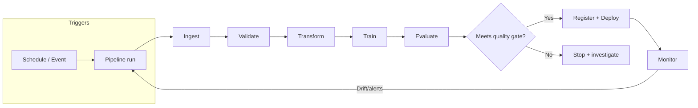

## PART IV: PIPELINES & ARCHITECTURE

### Table of Contents

- [4.0 WHY PIPELINES (AUTOMATION) MATTER](#40-why-pipelines-automation-matter)
  - [4.0.1 Data preparation & processing system basics](#401-data-preparation--processing-system-basics-exam-level)
  - [4.0.2 OPERATING DATA PIPELINES IN PRODUCTION](#402-operating-data-pipelines-in-production-test-style)
- [4.1 EVENT-DRIVEN TRAINING](#41-event-driven-training)
- [4.2 PREPROCESSING AT PREDICTION TIME](#42-preprocessing-at-prediction-time)
- [4.3 ARCHITECTURE PATTERNS](#43-architecture-patterns)
- [4.4 KUBEFLOW PIPELINES](#44-kubeflow-pipelines)
- [4.5 PIPELINE ORCHESTRATION OPTIONS](#45-pipeline-orchestration-options)
  - [4.5.1 PROMOTING A MODEL ARTIFACT TO PRODUCTION](#451-promoting-a-model-artifact-to-production-staging-first)
- [4.6 DATA PIPELINES](#46-data-pipelines)
- [4.7 MODEL MONITORING](#47-model-monitoring)
- [4.8 RESOURCE ORGANIZATION](#48-resource-organization)
- [4.9 CI/CD FOR ML](#49-cicd-for-ml)
- [4.10 PRODUCTION READINESS CHECKS (MLOps)](#410-production-readiness-checks-mlops)
- [4.11 CONTINUOUS TRAINING (CT) PATTERN](#411-continuous-training-ct-pattern)

### Official docs (high-signal starting points)

- **Vertex AI Pipelines**: [Vertex AI Pipelines Introduction](https://cloud.google.com/vertex-ai/docs/pipelines/introduction)
- Kubeflow Pipelines SDK: [kubeflow.org/docs/components/pipelines](https://www.kubeflow.org/docs/components/pipelines/)
- **Cloud Composer** (managed Airflow): [cloud.google.com/composer/docs](https://cloud.google.com/composer/docs)
- **Dataflow**: [cloud.google.com/dataflow/docs](https://cloud.google.com/dataflow/docs)
- **Dataproc**: [cloud.google.com/dataproc/docs](https://cloud.google.com/dataproc/docs)
- **Cloud Data Fusion**: [cloud.google.com/data-fusion/docs](https://cloud.google.com/data-fusion/docs)
- **Pub/Sub**: [cloud.google.com/pubsub/docs](https://cloud.google.com/pubsub/docs)
- **Cloud Functions**: [cloud.google.com/functions/docs](https://cloud.google.com/functions/docs)
- **Cloud Monitoring**: [cloud.google.com/monitoring/docs](https://cloud.google.com/monitoring/docs)
- **Cloud Logging**: [cloud.google.com/logging/docs](https://cloud.google.com/logging/docs)
- **Cloud Build** (CI/CD): [cloud.google.com/build/docs](https://cloud.google.com/build/docs)
- MLOps Best Practices: [MLOps Continuous Delivery](https://cloud.google.com/architecture/mlops-continuous-delivery-and-automation-pipelines-in-machine-learning)

### 4.0 WHY PIPELINES (AUTOMATION) MATTER

Automating ingestion, preprocessing, training, evaluation, and deployment reduces manual effort and improves reliability.

- **Primary benefit**: Less manual work + faster iteration + fewer human errors
- **Orchestration**: Scheduling/triggering runs and managing dependencies (DAGs)
- **Logging/monitoring**: Detect pipeline failures and bottlenecks early
- **Version control**: Reproducibility of pipeline code/config and rollbacks

**EXAM TIP:** Pipeline automation/orchestration is about streamlining the **end-to-end workflow**, not making data "random" or changing model accuracy.

#### MLOps: Background and Foundations

**What is MLOps?**: Machine Learning Operations (MLOps) is about integrating ML models into real-world software systems. It's where machine learning meets software engineering, DevOps, and data engineering.

**Key realization**: The ML model itself is only a **small part** of a production ML system. The surrounding infrastructure (data pipelines, feature engineering, serving infrastructure, monitoring, etc.) is much larger and more complex.

**Why MLOps matters**:

- **Models degrade over time**: Real-world conditions change (user behavior, data drift, concept drift)
- **Production requirements**: Must run continuously (24/7), handle evolving data, meet latency/throughput requirements
- **Without MLOps**: Manual, brittle processes lead to slow iteration, error-prone deployments, stale models in production

**MLOps vs DevOps**:

| Aspect | Traditional Software | ML Systems |
|--------|---------------------|------------|
| **Development** | Deterministic | Experimental, data-driven |
| **Versioning** | Code only | Code + data + models |
| **Testing** | Functional correctness | Functional + data validation + model performance |
| **Deployment** | Code push | Multi-step pipeline (retraining, validation, deployment) |
| **Performance** | Code/infrastructure issues | Model quality degradation (drift) |
| **Monitoring** | Service health (latency, errors) | Service health + model predictions (distribution shifts, accuracy) |
| **Lifecycle** | Linear | Cyclical (feedback loops back to data collection) |

**MLOps = DevOps + data + models**

**System-level concerns in production ML**:

1. **Latency and throughput**:
   - **Latency**: Time from input to prediction (critical for user-facing apps)
   - **Throughput**: Predictions per unit time (critical for high-volume tasks)
   - **Trade-offs**: Model accuracy vs speed (simpler models, quantization, batch processing, caching)

2. **Data and concept drift**:
   - **Data drift**: Changes in input data distribution (e.g., summer photos → winter photos)
   - **Concept drift**: Changes in input-output relationship (e.g., pre-pandemic vs post-pandemic churn signals)
   - **Handling**: Monitoring (statistical tests, distribution tracking), thresholds/alerts, periodic retraining, online learning (with caution)

3. **Feedback loops**:
   - Model's predictions influence future input data (e.g., recommendation systems showing certain content → users click → skewed data)
   - **Managing**: Explore-exploit trade-off, debiasing training data, simulations/A/B tests, breaking the loop periodically

4. **Reproducibility**:
   - Ability to recreate model results reliably
   - **Requirements**: Version control (code, data, models), containerization (Docker), tests for data/models, fixed random seeds
   - **Why important**: Debugging, consistency across environments, collaboration

**EXAM TIP:** Questions about "model performance degrading over time" → think **data drift** or **concept drift** → solution is **monitoring + retraining**.  
**EXAM TIP:** Questions about "recreating results" or "consistency across environments" → think **reproducibility** → solution is **version control + containerization + tests**.

### 4.0.1 Data preparation & processing system basics (exam-level)

These show up as "data systems design" questions:

- **Data ingestion**: Collect/acquire data from sources into your platform
- **Data transformation**: Convert/clean data into analysis-ready formats (ETL/ELT)
- **Data warehousing**: Central store for analytics (in GCP this is typically **BigQuery**)
- **Data governance**: Policies/standards for how data is managed/used (security, access, compliance)

**EXAM TIP:** "Data warehousing" → storing/managing data for analytics (BigQuery in GCP).

#### Data lake vs data warehouse

- **Data lake**: low-cost storage for raw, unstructured/semi-structured data (GCP: **Cloud Storage**)
- **Data warehouse**: optimized for analytical queries (GCP: **BigQuery**)

**EXAM TIP:** "Data lake advantage" → low storage cost for raw data (not optimized for transactions).

### 4.0.2 OPERATING DATA PIPELINES IN PRODUCTION (Test-style)

#### Reliability of pipeline changes

- **CI/CD**: automated tests + controlled releases reduce deployment risk
- **Version control**: track changes, support rollback
- **Data validation tests**: ensure pipeline changes don’t break data quality

**EXAM TIP:** Reliability of deployed pipeline changes → **CI/CD + version control + validation tests**.

#### Monitoring, logging, and alerting

- **Cloud Monitoring**: pipeline health/performance metrics + alert policies
- **Cloud Logging**: centralized logs for debugging and audits
- **Error Reporting**: error aggregation and alerting for runtime exceptions

**EXAM TIP:** “Monitor pipeline status/performance” → **Cloud Monitoring**.  
**EXAM TIP:** “Collect/analyze/visualize pipeline logs” → **Cloud Logging**.  
**EXAM TIP:** “Real-time error tracking/alerting” → **Error Reporting**.

#### Scheduling and config automation

- **Cloud Scheduler**: cron-style scheduling for pipeline tasks
- **Cloud Tasks**: asynchronous task queue (retries/backoff for jobs)

**EXAM TIP:** "Run pipeline tasks on a schedule" → **Cloud Scheduler**.

### 4.1 EVENT-DRIVEN TRAINING

Automatically trigger model retraining when new data arrives.

#### Cloud Storage → Pub/Sub → Cloud Function Pattern

1. Data pipeline saves cleaned data to Cloud Storage bucket
2. Cloud Storage trigger sends message to Pub/Sub topic when new file arrives
3. Cloud Function is triggered by Pub/Sub message
4. Cloud Function starts training job on GKE/Vertex AI

**EXAM TIP:** Auto-retrain when new data available → Cloud Storage trigger → Pub/Sub → Cloud Function.  
**COMMON TRAP:** DON'T use App Engine polling or Cloud Scheduler checking timestamps.

### 4.2 PREPROCESSING AT PREDICTION TIME

When you need to apply the same preprocessing at training and prediction time for high-throughput online prediction:

#### Architecture Pattern

1. Incoming requests sent to Pub/Sub topic
2. Cloud Function triggered by Pub/Sub
3. Cloud Function implements preprocessing logic
4. Cloud Function calls AI Platform for prediction
5. Results written to outbound Pub/Sub queue

**EXAM TIP:** High-throughput online prediction with preprocessing → Pub/Sub → Cloud Function → AI Platform.

### 4.3 ARCHITECTURE PATTERNS

#### Support Ticket Enrichment Architecture

For serverless ML system to enrich support tickets with metadata before assigning to agents:

| Prediction Task                      | Endpoint                   | Reason                       |
| ------------------------------------ | -------------------------- | ---------------------------- |
| Priority classification (custom)     | AI Platform                | Custom trained model         |
| Resolution time regression           | AI Platform                | Custom trained model         |
| Sentiment analysis (no domain terms) | Cloud Natural Language API | Pre-trained, general purpose |

**EXAM TIP:** Classification + Regression → AI Platform. General sentiment → Cloud NL API.

#### Call Center Audio Pipeline

For analyzing customer calls with PII protection and SQL analytics interface:

- **Requirements**: Speech transcription, PII detection/removal, regional data compliance, SQL interface
- **Processing (Box 1)**: Dataflow - integrates Speech-to-Text API + Cloud DLP API
- **Analytics (Box 2)**: BigQuery - SQL ANSI-2011 compliant, regional data storage

**EXAM TIP:** Audio processing + PII protection + SQL interface → Dataflow + BigQuery.

### 4.4 KUBEFLOW PIPELINES

#### Experiments

Kubeflow experiments let you organize multiple pipeline runs for comparison.

- **Purpose**: Compare metrics across different model architectures in single dashboard
- **Use Case**: Testing multiple Keras architectures, tracking results centrally

**EXAM TIP:** Compare multiple model architectures in one dashboard → Kubeflow Pipeline experiments.

#### BigQuery Component

Query BigQuery as a step in your Kubeflow pipeline.

- **Easiest Method**: Find BigQuery Query Component in Kubeflow Pipelines GitHub repo, copy URL, load into pipeline

**EXAM TIP:** Query BigQuery in Kubeflow (easiest way) → Load BigQuery Query Component from GitHub.

#### Integrating Custom Python Code

- func_to_container_op: Convert Python functions directly to pipeline components
- ContainerOp: Create component from existing container
- load_component_from_file: Load component from YAML definition

**EXAM TIP:** Quickly integrate Python code into Kubeflow → func_to_container_op.

#### Reliability for transient failures (retries/backoff)

If a pipeline step depends on an unstable third-party API:

- Configure **retries with exponential backoff** at the component level (KFP)

**EXAM TIP:** Intermittent failures → set `retry_limit` + backoff (more robust than “just add CPUs”).

#### PySpark in Kubeflow

- **Method**: Add ContainerOp that spins up Dataproc cluster, runs transformation, saves to Cloud Storage

**EXAM TIP:** PySpark transformation in Kubeflow pipeline → ContainerOp with Dataproc.

### 4.5 PIPELINE ORCHESTRATION OPTIONS

| Service                     | Type                    | Best For                                 |
| --------------------------- | ----------------------- | ---------------------------------------- |
| Vertex AI Pipelines         | Managed, KFP-compatible | GCP-native, minimal management           |
| Kubeflow Pipelines          | Self-managed K8s        | Multi-cloud, full control                |
| Cloud Composer              | Managed Airflow         | Complex DAGs, cross-system orchestration |
| Cloud Functions + Scheduler | Serverless              | Simple scheduled jobs                    |
| BigQuery scheduled queries  | Serverless              | SQL-based retraining (BQML)              |

**EXAM TIP:** Multi-step ML workflow with minimal cluster management → Vertex AI Pipelines with Kubeflow SDK.

**EXAM TIP:** If the answer choices mention **Apache Airflow** for orchestration, the GCP-managed equivalent is **Cloud Composer**.

### 4.5.1 PROMOTING A MODEL ARTIFACT TO PRODUCTION (staging first)

Common pattern when a pipeline produces a model artifact in Cloud Storage and you need to test before production:

- Create a **new model version** (staging candidate)
- **Deploy to a test/staging environment** (endpoint) and validate (offline eval + smoke tests)
- Only after validation, promote/roll out to production (traffic split / full cutover)

**EXAM TIP:** Don’t deploy straight to prod. Validate in a test environment first, then promote.

### 4.6 DATA PIPELINES

| Service           | Code Required      | Best For                       |
| ----------------- | ------------------ | ------------------------------ |
| Dataflow          | Yes (Python/Java)  | Streaming/batch ETL at scale   |
| Dataproc          | Yes (Spark/Hadoop) | Existing Spark jobs, big data  |
| Cloud Data Fusion | NO - GUI           | Codeless ETL, data integration |
| Dataprep          | NO - GUI           | Data cleaning and wrangling    |

**EXAM TIP:** Codeless ETL with visual interface → Cloud Data Fusion.  
**EXAM TIP:** Data cleaning and correction → Dataprep.

**EXAM TIP:** Managed Apache Spark on Google Cloud → **Dataproc**.  
**EXAM TIP:** “ETL pipelines” in Google Cloud → **Dataflow** is the default managed answer (Beam).

#### Dataflow autoscaling

Dataflow can automatically add/remove workers based on the workload.

**EXAM TIP:** “Automatically adjust resources based on workload” → Dataflow **autoscaling**.

#### Pub/Sub delivery semantics

Pub/Sub provides **at-least-once** delivery (you may see duplicates).

**EXAM TIP:** At-least-once delivery means subscribers must be idempotent / de-duplicate.

#### Streaming windows (definition)

A **window** groups stream events into time-based buckets for aggregation (e.g., per minute/hour).

**EXAM TIP:** “Window in streaming pipeline” → time-based segmentation of the stream.

#### Batch processing at scale (high throughput)

- **Batch**: high-throughput processing of large datasets (not low-latency)
- **Streaming**: low-latency continuous processing

**EXAM TIP:** “Key benefit of batch processing” → high-throughput data processing.

#### Distributed computing concepts (why/how)

- **Goal**: speed up processing/training via parallelism
- **Fault tolerance**: data replication, checkpointing, retries
- **MapReduce**: split work into chunks and process in parallel

**EXAM TIP:** Fault tolerance technique → data replication.  
**EXAM TIP:** MapReduce purpose → divide into smaller sub-tasks and run in parallel.

#### Real-time ingestion into BigQuery

For app/user events that must land in BigQuery in near real-time:

- **Pattern**: App → **Pub/Sub** → **Dataflow (streaming)** → **BigQuery**
- **Why**: Pub/Sub handles ingestion + buffering; Dataflow does streaming ETL and writes to BigQuery reliably

**EXAM TIP:** “Real-time ingestion into BigQuery” from apps/events → **Pub/Sub + Dataflow streaming → BigQuery**.

### 4.7 MODEL MONITORING

#### Monitoring Approaches

| Approach                                | Cost   | Best For                              |
| --------------------------------------- | ------ | ------------------------------------- |
| Weekly BigQuery query on success metric | Low    | Simple monitoring, cost-sensitive     |
| Continuous Evaluation (mAP)             | Medium | Ongoing performance tracking          |
| Vertex AI Model Monitoring              | Higher | Feature drift/skew detection at scale |

Consider business requirements. If you need to minimize cost and have clear success metrics stored in BigQuery, a scheduled query is often sufficient.

**EXAM TIP:** Monitor model performance, minimize cost → Weekly BigQuery query (not Vertex AI Monitoring).

### 4.8 RESOURCE ORGANIZATION

#### Large Teams (50+ Data Scientists)

- **Challenge**: Organizing jobs, models, versions across many users
- **Solution**: Use LABELS to organize resources into descriptive categories
- **Implementation**: Apply labels to created resources, users filter by labels

**EXAM TIP:** 50+ data scientists organizing resources → Labels (not separate projects for each user).

### 4.9 CI/CD FOR ML

#### Automated Unit Testing on Code Push

Automatically run unit tests when code is pushed to a repository:

- **Tools**: Cloud Build + Cloud Source Repositories
- **Pattern**: Push to dev branch → Cloud Build trigger → Run unit tests
- **Use Case**: Testing Kubeflow Pipeline components that require custom libraries

**EXAM TIP:** Automate unit tests on push to development branch → Cloud Build trigger.  
**COMMON TRAP:** Don't use Cloud Logging sink + Cloud Function for this.

#### Automated Retraining on Code Changes

- **Tools**: Cloud Build + Cloud Source Repositories
- **Pattern**: Push code → Trigger Cloud Build → Run training job
- **Use Case**: Benchmark new architectures automatically when code changes

**EXAM TIP:** Version control + auto-retrain on code change → Cloud Build + Cloud Source Repositories.

### 4.10 PRODUCTION READINESS CHECKS (MLOps)

When features/data, model code, and infra are "done", a key remaining readiness check is operational:

- **Monitoring**: Track live model performance + data drift/skew and alerting

**EXAM TIP:** "Additional readiness check" after model + infra are tested → **ensure model performance is monitored**.

#### Model Monitoring Job Configuration

When setting up model monitoring to detect prediction drift:

| Configuration                | Recommended? | Reason                              |
| ---------------------------- | ------------ | ----------------------------------- |
| 10% sampling, every 24 hours | YES          | Balanced coverage and cost          |
| 90% sampling, every 24 hours | NO           | Too expensive, unnecessary coverage |
| 10% sampling, every hour     | NO           | Too frequent for most use cases     |
| Continuous retraining daily  | NO           | Addresses symptom, not detection    |

**EXAM TIP:** Prevent prediction drift → Model monitoring job with 10% sampling every 24 hours.  
**COMMON TRAP:** Don't use 90% sampling - it's wasteful.

### 4.11 CONTINUOUS TRAINING (CT) PATTERN

Automatically retrain when new ground truth arrives, but only promote the model if it meets a quality gate.

**EXAM TIP:** “Retrain automatically on new verified labels and only deploy if thresholds are met” → **Continuous Training (CT)** with evaluation gate.

#### Cost-aware labeling and retraining cadence

If labels are expensive and you don’t want to label at a fixed cadence:

- **Step 1**: Detect **skew/drift** first (training vs serving feature distribution)
- **Step 2**: Only when skew is detected, **sample** recent serving data for labeling/evaluation
- **Step 3**: Retrain when performance drops or drift is confirmed

**EXAM TIP:** Minimize labeling cost → run skew/drift checks frequently, label **only when skew is detected** (not "label every N weeks").
