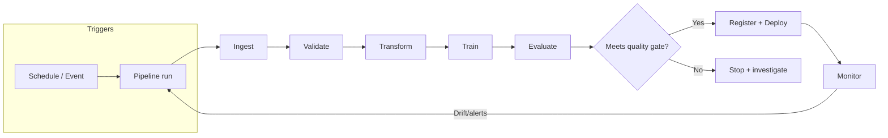

## PART IV: PIPELINES & ARCHITECTURE

### Table of Contents

- [4.0 WHY PIPELINES (AUTOMATION) MATTER](#40-why-pipelines-automation-matter)
  - [4.0.1 Data preparation & processing system basics](#401-data-preparation--processing-system-basics-exam-level)
  - [4.0.2 OPERATING DATA PIPELINES IN PRODUCTION](#402-operating-data-pipelines-in-production-test-style)
- [4.1 EVENT-DRIVEN TRAINING](#41-event-driven-training)
- [4.2 PREPROCESSING AT PREDICTION TIME](#42-preprocessing-at-prediction-time)
- [4.3 ARCHITECTURE PATTERNS](#43-architecture-patterns)
- [4.4 KUBEFLOW PIPELINES](#44-kubeflow-pipelines)
- [4.5 PIPELINE ORCHESTRATION OPTIONS](#45-pipeline-orchestration-options)
  - [4.5.1 PROMOTING A MODEL ARTIFACT TO PRODUCTION](#451-promoting-a-model-artifact-to-production-staging-first)
- [4.6 DATA PIPELINES](#46-data-pipelines)
- [4.7 MODEL MONITORING](#47-model-monitoring)
- [4.8 RESOURCE ORGANIZATION](#48-resource-organization)
- [4.9 CI/CD FOR ML](#49-cicd-for-ml)
- [4.10 PRODUCTION READINESS CHECKS (MLOps)](#410-production-readiness-checks-mlops)
- [4.11 CONTINUOUS TRAINING (CT) PATTERN](#411-continuous-training-ct-pattern)

### Official docs (high-signal starting points)

- **Vertex AI Pipelines**: [Vertex AI Pipelines Introduction](https://cloud.google.com/vertex-ai/docs/pipelines/introduction)
- Kubeflow Pipelines SDK: [kubeflow.org/docs/components/pipelines](https://www.kubeflow.org/docs/components/pipelines/)
- **Cloud Composer** (managed Airflow): [cloud.google.com/composer/docs](https://cloud.google.com/composer/docs)
- **Dataflow**: [cloud.google.com/dataflow/docs](https://cloud.google.com/dataflow/docs)
- **Dataproc**: [cloud.google.com/dataproc/docs](https://cloud.google.com/dataproc/docs)
- **Cloud Data Fusion**: [cloud.google.com/data-fusion/docs](https://cloud.google.com/data-fusion/docs)
- **Pub/Sub**: [cloud.google.com/pubsub/docs](https://cloud.google.com/pubsub/docs)
- **Cloud Functions**: [cloud.google.com/functions/docs](https://cloud.google.com/functions/docs)
- **Cloud Monitoring**: [cloud.google.com/monitoring/docs](https://cloud.google.com/monitoring/docs)
- **Cloud Logging**: [cloud.google.com/logging/docs](https://cloud.google.com/logging/docs)
- **Cloud Build** (CI/CD): [cloud.google.com/build/docs](https://cloud.google.com/build/docs)
- MLOps Best Practices: [MLOps Continuous Delivery](https://cloud.google.com/architecture/mlops-continuous-delivery-and-automation-pipelines-in-machine-learning)

### 4.0 WHY PIPELINES (AUTOMATION) MATTER

Automating ingestion, preprocessing, training, evaluation, and deployment reduces manual effort and improves reliability.

- **Primary benefit**: Less manual work + faster iteration + fewer human errors
- **Orchestration**: Scheduling/triggering runs and managing dependencies (DAGs)
- **Logging/monitoring**: Detect pipeline failures and bottlenecks early
- **Version control**: Reproducibility of pipeline code/config and rollbacks

**EXAM TIP:** Pipeline automation/orchestration is about streamlining the **end-to-end workflow**, not making data "random" or changing model accuracy.

#### MLOps: Background and Foundations

**What is MLOps?**: Machine Learning Operations (MLOps) is about integrating ML models into real-world software systems. It's where machine learning meets software engineering, DevOps, and data engineering.

**Key realization**: The ML model itself is only a **small part** of a production ML system. The surrounding infrastructure (data pipelines, feature engineering, serving infrastructure, monitoring, etc.) is much larger and more complex.

**Why MLOps matters**:

- **Models degrade over time**: Real-world conditions change (user behavior, data drift, concept drift)
- **Production requirements**: Must run continuously (24/7), handle evolving data, meet latency/throughput requirements
- **Without MLOps**: Manual, brittle processes lead to slow iteration, error-prone deployments, stale models in production

**MLOps vs DevOps**:

| Aspect          | Traditional Software             | ML Systems                                                         |
| --------------- | -------------------------------- | ------------------------------------------------------------------ |
| **Development** | Deterministic                    | Experimental, data-driven                                          |
| **Versioning**  | Code only                        | Code + data + models                                               |
| **Testing**     | Functional correctness           | Functional + data validation + model performance                   |
| **Deployment**  | Code push                        | Multi-step pipeline (retraining, validation, deployment)           |
| **Performance** | Code/infrastructure issues       | Model quality degradation (drift)                                  |
| **Monitoring**  | Service health (latency, errors) | Service health + model predictions (distribution shifts, accuracy) |
| **Lifecycle**   | Linear                           | Cyclical (feedback loops back to data collection)                  |

**MLOps = DevOps + data + models**

**System-level concerns in production ML**:

1. **Latency and throughput**:

   - **Latency**: Time from input to prediction (critical for user-facing apps)
   - **Throughput**: Predictions per unit time (critical for high-volume tasks)
   - **Trade-offs**: Model accuracy vs speed (simpler models, quantization, batch processing, caching)

2. **Data and concept drift**:

   - **Data drift**: Changes in input data distribution (e.g., summer photos → winter photos)
   - **Concept drift**: Changes in input-output relationship (e.g., pre-pandemic vs post-pandemic churn signals)
   - **Handling**: Monitoring (statistical tests, distribution tracking), thresholds/alerts, periodic retraining, online learning (with caution)

3. **Feedback loops**:

   - Model's predictions influence future input data (e.g., recommendation systems showing certain content → users click → skewed data)
   - **Managing**: Explore-exploit trade-off, debiasing training data, simulations/A/B tests, breaking the loop periodically

4. **Reproducibility**:
   - Ability to recreate model results reliably
   - **Requirements**: Version control (code, data, models), containerization (Docker), tests for data/models, fixed random seeds
   - **Why important**: Debugging, consistency across environments, collaboration

**EXAM TIP:** Questions about "model performance degrading over time" → think **data drift** or **concept drift** → solution is **monitoring + retraining**.  
**EXAM TIP:** Questions about "recreating results" or "consistency across environments" → think **reproducibility** → solution is **version control + containerization + tests**.

#### 4.0.3 The Machine Learning System Lifecycle (Detailed)

**Overview**: The ML lifecycle consists of interconnected stages: **Scoping → Data → Modeling → Deployment → Monitoring**. Each stage requires specific engineering practices and tooling for production readiness.

**Key insight**: "Developing ML models starts with engineering data." Data quality issues are more frequent causes of failure in production ML than algorithm issues. MLOps pays significant attention to data monitoring, validation, and versioning.

**1. Data Pipelines**

**Why data pipelines matter**: In ML, the quality and management of your data are often more important than the specific modeling algorithm. Production ML systems need robust data pipelines to reliably feed data into model training and inference.

**Key insight**: "In enterprise MLOps, models are commodities, but data pipelines are assets." The cleverest model architecture is worthless if fed unreliable data. Choices made for data have profound downstream consequences on performance, scalability, and reliability of entire ML system.

**Key aspects**:

**A. Data Sources**:

Production ML systems interact with data from several origins:

**1. User Input Data**:

- Data explicitly provided by users (text in search bar, uploaded images, form submissions)
- **Notoriously unreliable**: Users are lazy; if possible to input unformatted/raw data, they will
- **Requires**: Heavy-duty validation and robust error handling
- **Example**: Search queries, image uploads, form submissions

**2. System-Generated Data (Logs)**:

- Applications and infrastructure generate massive volume of logs
- **Records**: Significant events, system states (memory usage), service calls, model predictions
- **Characteristics**: Often noisy, but invaluable for debugging, monitoring system health, ML system visibility
- **Processing**: Can be processed in batches (daily/weekly) or real-time for monitoring/alerting
- **Example**: Application logs, infrastructure metrics, model prediction logs

**3. Internal Databases**:

- Where enterprises typically derive most value
- **Sources**: Inventory, CRM, user accounts, financial transactions
- **Characteristics**: Highly structured, follows relational model
- **Use case**: Feature engineering, ensuring recommendations match inventory
- **Example**: Customer database, product catalog, transaction history

**4. Third-Party Data**:

- Data acquired from external vendors
- **Types**: Demographic information, social media activity, purchasing habits
- **Power**: Can bootstrap models like recommender systems
- **Challenge**: Availability increasingly constrained by privacy regulations
- **Example**: Demographic data, social media feeds, market research data

**B. Data Formats**:

The format you choose for storage is a critical architectural decision impacting storage costs, access speed, and ease of use.

**1. Text vs Binary**:

| Aspect          | Text Formats (JSON, CSV)                   | Binary Formats (Parquet)                             |
| --------------- | ------------------------------------------ | ---------------------------------------------------- |
| **Readability** | Human-readable (can open in text editor)   | Not human-readable (requires schema)                 |
| **Storage**     | Verbose, consumes more space               | Compact, efficient (e.g., 14 MB CSV → 6 MB Parquet)  |
| **Use case**    | Debugging, configuration, data interchange | Large-scale analytical workloads (industry standard) |
| **Example**     | JSON: 7 bytes for "1000000"                | Binary: 4 bytes for integer 1000000                  |

**Text formats**:

- **JSON**: Ubiquitous due to simplicity and flexibility, represents structured and unstructured data
- **CSV**: Simple, human-readable, easy to debug
- **Cost**: Verbose, significantly more storage space

**Binary formats**:

- **Parquet**: Designed for machine consumption, far more compact and efficient
- **Requirement**: Program must know exact schema and layout to interpret bytes
- **Space savings**: Dramatic (e.g., 14 MB CSV → 6 MB Parquet)
- **Industry standard**: For large-scale analytical workloads

**2. Row-Major vs Column-Major**:

This distinction is critical for ML engineers—directly relates to how we access data for training and analysis.

| Aspect             | Row-Major (CSV)                                    | Column-Major (Parquet)                                  |
| ------------------ | -------------------------------------------------- | ------------------------------------------------------- |
| **Layout**         | Consecutive elements of row stored together        | Consecutive elements of column stored together          |
| **Optimized for**  | Write-heavy workloads, adding complete records     | Analytical queries (calculating mean of single feature) |
| **Access pattern** | Retrieving entire samples (all data for user ID)   | Reading single column as contiguous block               |
| **Performance**    | Slower for analytical queries (jump around memory) | Faster for analytical queries (cache-friendly)          |

**Row-major format**:

- **Layout**: Consecutive elements of row stored next to each other (reading table line by line)
- **Optimized for**: Write-heavy workloads, frequently adding new complete records
- **Efficient for**: Retrieving entire samples at once (all data for specific user ID)

**Column-major format**:

- **Layout**: Consecutive elements of column stored next to each other
- **Optimized for**: Analytical queries common in ML
- **Example**: Calculating mean of single feature across millions of samples
  - Column-major: Read one column as single contiguous block (extremely efficient, cache-friendly)
  - Row-major: Jump around memory, reading small piece from each row (significantly slower)
- **Performance**: Orders of magnitude faster for columnar operations

**Pandas DataFrame example**:

- **Built around column-major DataFrame**
- **Iterating by column**: ~2 microseconds (fast, contiguous memory)
- **Iterating by row**: ~38 microseconds (~20x slower, non-contiguous memory)
- **Reason**: Processors more efficient with contiguous blocks of memory
- **Not a flaw**: Direct consequence of column-major data model

**D. Data Ingestion**:

- Getting raw data from various sources into your system/development environment
- **Batch ingestion**: Periodically importing a dump or running a daily job
- **Streaming ingestion**: Real-time processing of incoming events
- **GCP tools**: Cloud Storage (batch), Pub/Sub (streaming), Dataflow (processing)

**E. Data Storage**:

- Once ingested, data needs to be stored (often in both raw form and processed form)
- **Data lakes**: Low-cost storage for raw, unstructured/semi-structured data (Cloud Storage, AWS S3, on-prem HDFS)
- **Data warehouses**: Optimized for analytical queries (BigQuery)
- **Feature stores**: Centralized database of precomputed features for training and online inference
  - Ensures consistency between offline training data and online serving data
  - Examples: Vertex AI Feature Store, Feast, Tecton

**C. Data Processing (ETL/ELT)**:

**ETL in ML Workflows**:

ETL stands for **Extract, Transform, Load**. It describes the pipeline of getting data from sources, processing it into usable form, and loading it into storage/system for use. ETL is often the first stage of preparing data for model training or inference.

**1. Extract**:

- **Pull data** from various sources (databases, APIs, files, etc.)
- **ML sources**: Application databases, logs, third-party datasets, user-provided data
- **Validation**: Check for malformed records during extraction
- **Early rejection**: Reject or quarantine data that doesn't meet expectations as early as possible
- **Example**: Filter out records with missing required fields, log/notify about bad data
- **Benefit**: Early validation prevents propagating errors downstream

**2. Transform**:

- **Core processing step**: Data cleaned and converted into desired format
- **Operations**:
  - Merging multiple sources
  - Handling missing values
  - Standardizing formats (categorical labels consistent across sources)
  - Deduplicating records
  - Aggregating or summarizing data
  - Deriving new features
- **ML-specific**: Feature engineering (turning raw data into features models can consume)
  - **Examples**: Raw timestamps → day-of-week, time-since-last-event
  - Encoding categorical variables as one-hot vectors
  - Normalizing numeric fields
- **Hefty part**: Most data wrangling happens here

**3. Load**:

- **Load transformed data** into target destination
- **Targets**: Data warehouse, relational database, distributed storage, cloud storage, analytical database
- **ML pipelines**: Could mean:
  - Writing cleaned dataset for training (CSV/Parquet file, data warehouse table)
  - Loading features into feature store
  - Loading into production databases for serving
- **Considerations**:
  - **Frequency**: How often to load (batch schedule or streaming)
  - **Format**: What format to use
  - **Example**: Load aggregated features daily into warehouse table that training job will read

**ETL vs ELT**:

**ELT (Extract, Load, Transform)** is a variant where raw data is first loaded into storage (often data lake) before transformation.

| Aspect              | ETL                                       | ELT                                                          |
| ------------------- | ----------------------------------------- | ------------------------------------------------------------ |
| **Order**           | Extract → Transform → Load                | Extract → Load → Transform                                   |
| **Processing**      | Transform before loading                  | Load raw data, transform later                               |
| **Storage**         | Transformed data in warehouse             | Raw data in data lake                                        |
| **Flexibility**     | Less flexible (transform defined upfront) | More flexible (redefine transformations later)               |
| **Ingestion speed** | Slower (processing upfront)               | Faster (minimal processing upfront)                          |
| **Downside**        | Less flexible                             | Data swamp (sifting through massive lake can be inefficient) |

**ELT popularity**: Rise of inexpensive storage and scalable compute. Organizations dump all raw data into data lake (S3, HDFS) immediately, transform later when needed.

**Advantages of ELT**:

- Quick ingestion (minimal processing upfront)
- Flexibility to redefine transformations later

**Disadvantages of ELT**:

- If store everything raw, face cost/complexity of sifting through "data swamp"
- As data volume grows, scanning massive lake for each query can be inefficient

**Hybrid approach**: Balance fast data acquisition (ELT style) with upfront processing (ETL style) to keep data usable.

**Common ML pattern**:

- Do some light cleaning upon extraction (avoid garbage data accumulation)
- Load into lake/warehouse
- Do heavier feature engineering transformations in later pipeline stages before model training

**Example: ETL for ML**:

E-commerce recommendation model:

- **Extract**: Production databases (orders, user info, product catalog)
- **Transform**: Join tables, clean inactive users/test orders, aggregate purchase history per user, encode product categories
- **Load**: Transformed feature set (user features and labels) into data warehouse table or saved as file
- **Training**: ML training job reads prepared data

**If ELT instead**: Dump all raw logs/databases into data lake, ML pipeline transforms raw data on-the-fly each time (more flexible, but possibly slower).

**Hybrid**: Some ETL to create intermediate features, then ELT of those into warehouse and further transformations.

**Note on Streaming**:

- **ETL traditionally**: Batch processing (periodic loads)
- **Streaming data**: Real-time feeding into online model
- **Similar principles**: "get data → process → use data" remains, just with low latency
- **Tools**: Kafka for extraction, real-time transforms, etc.
- **Coverage**: Will touch on streaming in context of feature stores and orchestration in future chapters

**Hands-On: Building Data Pipelines (Hybrid ETL/ELT Example)**:

**Objective**: Simulate a basic ML data pipeline demonstrating hybrid ETL/ELT approach with data generation, validation, feature engineering, and storage in multiple formats.

**Pipeline Structure**:

**Stage 1: ETL Sub-Pipeline (E → T → L)**:

**1. Extract Phase I**:

- Pull data from heterogeneous sources:
  - **Internal databases**: SQLite `customers.db` (customer master data)
  - **Finance systems**: `sales.csv` (transactional sales data)
  - **Activity tracking**: `events.json` (behavioral event data)
- Functions: `extract_sales_csv()`, `extract_events_json()`, `extract_customers_sqlite()`
- Bring heterogeneous data into common format (pandas DataFrames)

**2. Validation Phase**:

- **validate_sales()**:
  - Column checks, type casting (IDs → int, amounts → numeric, timestamps → datetime)
  - Drop invalid rows (missing key fields)
  - Sanitize amounts (negative/zero → NaN, cap extreme outliers)
  - Fill missing amounts (customer-level median, then global median)
  - Deduplication (keep latest timestamp per sale_id)
- **validate_events()**:
  - Column checks, type casting
  - Drop invalid rows, deduplication
- **validate_customers()**:
  - Column checks, type casting
  - Drop invalid rows, deduplication

**3. Transform Phase I**:

- **Feature engineering for churn prediction**:
  - **Time windows**: Observation window (e.g., 200 days) and label window (e.g., 60 days)
  - **RFM features**:
    - **Recency**: Days since last purchase (cutoff - last_purchase_date)
    - **Frequency**: Count of purchases in observation window
    - **Monetary**: Sum of amounts, average amount, max amount
  - **Inter-purchase gap**: Mean days between consecutive purchases
  - **Tenure**: Days since customer signup
  - **Demographics**: Country, city
  - **Label**: Churn (1 if no future purchase in label window, 0 otherwise)
- **Leakage safety**: All features computed from observation window (before cutoff), label from label window (after cutoff)
- **Output**: Feature table (row per customer) with engineered features and labels

**4. Load Phase I**:

- **Save transformed data** in multiple formats:
  - CSV (human-readable, debugging)
  - Parquet (compact, efficient, analytical queries)
  - JSON (interchange, API responses)
- **Documentation**:
  - Data dictionary (explaining each feature column)
  - Run metadata (timestamp, random seed, parameters, row counts)
  - QA report (unique customers, churn rate, date ranges)

**Stage 2: ELT Sub-Pipeline (E → L → T)**:

**5. Extract Phase II**:

- **Fetch intermediate dataset** from storage (simulating ML team fetching from data team's storage)
- Can use any format (CSV, Parquet, JSON) depending on needs
- **Purpose**: Handle missing values (NaNs from customers with no purchases)

**6. Load Phase II**:

- **Save fetched data** before transformation (ELT pattern: load raw first)
- Ensures data available for future use without re-extraction

**7. Transform Phase II**:

- **scikit-learn Pipeline** for preprocessing:
  - **Split data**: Train/validation split (80/20) with stratification
  - **Detect column types**: Numeric vs categorical (from training data only)
  - **Numeric pipeline**:
    - Impute missing values with column mean
    - Standardize features (mean 0, variance 1)
  - **Categorical pipeline**:
    - Impute missing categories with most frequent
    - One-hot encode categories
  - **ColumnTransformer**: Apply appropriate pipeline to each column type
  - **Leakage safety**: Fit preprocessor on training only, transform validation
- **Output**: Processed train/validation DataFrames ready for modeling

**Key Implementation Patterns**:

```python
# Extract from multiple sources
def extract_sales_csv():
    df = pd.read_csv('sales.csv')
    return df

def extract_customers_sqlite():
    conn = sqlite3.connect('customers.db')
    df = pd.read_sql('SELECT * FROM customers', conn)
    conn.close()
    return df

# Validate and clean
def validate_sales(df):
    # Type casting, sanitization, imputation, deduplication
    return cleaned_df

# Transform (feature engineering)
def transform_features(sales, customers, cutoff, obs_days, label_days):
    # RFM features, time-based features, leakage-safe labels
    return features_df, daily_obs, sales_obs

# Load (save in multiple formats)
def dump_outputs(feats, sales_obs, daily_obs, cutoff, obs_days, label_days):
    feats.to_csv('features.csv')
    feats.to_parquet('features.parquet')
    feats.to_json('features.json', orient='records', indent=2)
    # Save metadata, data dictionary, QA report

# ELT: Extract → Load → Transform
# Extract intermediate data
df = pd.read_parquet('features.parquet')

# Load (save copy)
df_copy = df.copy()
df_copy.to_parquet('features_copy.parquet')

# Transform (scikit-learn pipeline)
from sklearn.pipeline import Pipeline
from sklearn.compose import ColumnTransformer
from sklearn.preprocessing import StandardScaler, OneHotEncoder
from sklearn.impute import SimpleImputer

numeric_pipeline = Pipeline([
    ('imputer', SimpleImputer(strategy='mean')),
    ('scaler', StandardScaler())
])

categorical_pipeline = Pipeline([
    ('imputer', SimpleImputer(strategy='most_frequent')),
    ('onehot', OneHotEncoder(sparse_output=False, handle_unknown='ignore'))
])

preprocessor = ColumnTransformer([
    ('numeric', numeric_pipeline, numeric_cols),
    ('categorical', categorical_pipeline, categorical_cols)
])

X_train_processed = preprocessor.fit_transform(X_train)
X_valid_processed = preprocessor.transform(X_valid)
```

**Key Takeaways**:

- **Hybrid approach**: ETL for initial processing, ELT for flexible downstream transformations
- **Multiple formats**: Save in CSV (debugging), Parquet (efficiency), JSON (interchange)
- **Leakage prevention**: Strict separation of observation and label windows, fit preprocessor on training only
- **Validation**: Early validation prevents propagating errors downstream
- **Documentation**: Data dictionary, metadata, QA reports for traceability
- **Reproducibility**: Random seeds, timestamps, parameter logging

**EXAM TIP:** Questions about "ETL vs ELT" → think **ETL** (transform before load, less flexible but cleaner) vs **ELT** (load raw first, transform later, more flexible but can create data swamp). Questions about "data format choice" → think **text formats** (human-readable, debugging) vs **binary formats** (compact, efficient, industry standard for analytics). Questions about "row vs column storage" → think **row-major** (write-heavy, retrieve entire samples) vs **column-major** (analytical queries, calculate mean of feature, much faster). Questions about "data pipeline structure" → think **Extract → Validate → Transform → Load** (ETL) or **Extract → Load → Transform** (ELT).

**G. Sampling Strategies**:

**Why sampling matters**: In many cases, we cannot or do not use all available data. Perhaps data is too large (training on trillions of records isn't feasible), or obtaining labels is costly, so we label a subset, or we intentionally down-sample for quicker experimentation. Good sampling can make model development efficient and ensure the model generalizes, while poor sampling can mislead your results.

**Sampling occurs in many stages**:

- Choosing what real-world data to collect for building your dataset
- Selecting a subset of available data for labeling or training (especially when you have more data than you can feasibly use)
- Splitting data into training/validation/testing sets
- Sampling data during training for each batch (in stochastic gradient descent, for example)
- Sampling in monitoring (e.g., logging only a fraction of predictions for analysis)

**Types of Sampling**:

**1. Non-Probability Sampling**:

Not strictly based on random chance but uses some subjective or practical criteria to pick data.

**A. Convenience Sampling**:

- Selecting data that is easiest to obtain
- **Example**: Using the first 10,000 records from a log because they're readily at hand, or using a dataset collected from one accessible source (like one city or one user group)
- **Implications**: High risk of bias since the sample may not represent the overall population
- **Use case**: Popular because it's convenient, but can skew results (e.g., model trained on data from single city may not generalize to other regions)

**B. Snowball Sampling**:

- Using existing sample data to recruit further data
- **Example**: Social networks or graphs—you have data on some users, then include their friends, then friends-of-friends, and so on
- **Implications**: Can be helpful to gather relevant data when you don't have direct access, but can over-represent tightly connected communities and miss out on isolated samples

**C. Judgment (Purposive) Sampling**:

- Relying on experts to hand-pick what data to include
- **Example**: Domain expert might select "important" cases to train on
- **Implications**: Can incorporate valuable domain knowledge, but it's subjective and can reflect the expert's biases

**D. Quota Sampling**:

- Ensures certain predefined quantities or a fraction of different sub-groups
- **Example**: Include exactly 100 samples of each class in a classification problem, or maintain a specific count or certain ratio of categories
- **Implications**: Guarantees representation of all groups, but the selection within each group might still be non-random (usually convenience-based within each quota)
- **Risk**: Can introduce bias if the population within each quota is not homogeneous

**Non-probability sampling**: Often a starting point (especially in early prototyping or when data access is limited). However, models built on non-random samples may not be reliable. If you use these methods, be aware of the biases.

**2. Probability (Random) Sampling Methods**:

Probabilistic sampling methods are less prone to bias than non-probabilistic methods, owing to the inherent randomness in their selection strategy.

**A. Simple Random Sampling**:

- Each data point has an equal chance of being selected
- **Example**: Shuffling your dataset and picking a subset
- **Works well**: If your data is homogeneous or you truly have no prior knowledge of important groupings
- **Problem**: Can be problematic if there are rare but important subgroups; you might, by chance, pick too few of them
- **Example issue**: Dataset of transactions with 2% fraud. A simple random sample of 1,000 might contain around 20 fraud cases. If you happen to get 5 or 50 by random fluctuation, your sample's fraud rate would skew

**B. Weighted Sampling**:

- A form of random sampling where each sample is given a weight (probability) for selection
- **Allows**: Oversampling certain cases or undersampling others in a controlled way
- **Example**: Weight rare classes higher so they appear more in the sample
- **Tools**: `random.choices` in Python allows weighted sampling
- **Use cases**: Combat class imbalance (oversampling minority class), emphasize recent data more than older data
- **Note**: Concept of sample weights during model training is related but distinct—weighted sampling picks more of some data to include, whereas sample weights let you include all data but give some examples more importance in the loss function

**C. Stratified Sampling**:

- Divide the population into strata (groups) and sample from each group separately to ensure representation
- **Example**: For an imbalanced classification, stratify by class label so that your sample has the same class proportions as the full dataset (or ensure each class gets enough representation)
- **Benefits**: Greatly reduces variance between subgroup representation
- **Recommendation**: Generally recommended for creating train/test splits when class distributions are important
- **Drawback**: Need to know the important grouping variables upfront, and if some groups are very small or hard to stratify (e.g., continuous variables), it might not be applicable

**D. Reservoir Sampling**:

- Algorithm for sampling from streaming data of unknown size, ensuring each item has an equal probability of being included
- **Use case**: Continuous stream (say, user clicks) and you want to maintain a random sample of fixed size (like the last 1,000 clicks, but in a random sense, not just the latest)
- **Benefit**: Allows you to sample from a stream without storing it all, which is crucial in production streaming pipelines

**E. Importance Sampling**:

- More advanced technique often used in statistical estimation and reinforcement learning
- **Concept**: You want to evaluate or train on a distribution that is different from where your data came from by re-weighting samples
- **Use case**: In ML pipelines, can be used to bias the sampling towards informative cases while still correcting for that bias during estimation
- **Example**: In reinforcement learning, you might sample episodes from a behavior policy but want to evaluate a target policy. Importance sampling provides a way to correct for the difference

**Practical Implications of Sampling Choices**:

- **Always ask**: "Does my sample reflect the real-world distribution relevant to the model's deployment?"
- **Use stratification**: When splitting datasets by class, time, or other key criteria. Most ML libraries (scikit-learn's `train_test_split` for example) have stratified split options for classification problems
- **Sampling bias**: Can creep in from many sources. Even an ostensibly random sample can be biased if your data source is incomplete
- **Downsampling for experiments**: When downsampling for quicker experiments (common practice), do it carefully. It's fine to take, say, 10% of data to prototype, but keep it random or stratified. Always test the final model on the full distribution if possible
- **Big data tip**: If you have an extremely large dataset, instead of training on all of it, you might take a well-stratified sample to train initial models (for speed) and then possibly gradually increase data size. Sometimes a model saturates performance with far less than the total available data

**Key principle**: Sampling is both a necessity and a potential pitfall. It's integral to how we create manageable training sets and evaluation splits. The guiding principle is to ensure your sampling strategy is aligned with the problem's needs and does not inadvertently introduce bias.

**H. Data Design: Class Imbalance**:

**Class imbalance is the norm in production ML**: Most interesting problems involve detecting rare events—fraudulent transactions, customer churn, equipment failure, or disease diagnosis. The vast majority of your data will belong to the "normal" or negative class.

**Challenges for model training**:

**1. Insufficient signal**: With very few examples of the minority class, the model does not usually have enough information to learn its distinguishing patterns.

**2. Degenerate solutions**: It's easy for a model to achieve high accuracy by adopting a simple heuristic: always predict the majority class. In a dataset where only 0.1% of cases are fraudulent, this strategy yields 99.9% accuracy, a local minimum that can be difficult for optimization algorithms to escape.

**👉 For this reason, accuracy alone is not a reliable metric for datasets with class imbalance. Metrics such as recall and F1 score provide a more informative evaluation in such cases.**

**3. Asymmetric error costs**: The business impact of a misclassification is rarely symmetrical. A false negative (missing a fraudulent transaction) is often far more costly than a false positive (flagging a legitimate transaction for review). Standard loss functions treat all errors equally, leading to models that are not optimized for the business problem.

**Techniques to Address Class Imbalance**:

**1. Data-Level Methods (Resampling)**:

These methods modify the data distribution itself.

**A. Undersampling**:

- **Removing samples** from the majority class
- **Simple approach**: Random removal
- **Sophisticated techniques**: Tomek links remove the majority-class samples that are close to minority-class samples, helping to clarify the decision boundary
- **Risk**: Discarding potentially useful information

**B. Oversampling**:

- **Adding more samples** to the minority class
- **Simple method**: Random duplication (but can lead to overfitting)
- **Advanced technique**: SMOTE (Synthetic Minority Oversampling Technique), which creates new synthetic samples by interpolating between existing minority class samples
- **Effectiveness**: Generally most effective on low-dimensional, tabular data
- **Note**: There has been some criticism towards SMOTE

**2. Algorithm-Level Methods (Cost-Sensitive Learning)**:

These methods modify the learning algorithm to be more robust to imbalance, keeping the original data distribution intact. This is often the preferred approach for modern deep learning models.

**A. Class Weights**:

- **Most common approach**: Assign a weight to each class in the loss function that is inversely proportional to its frequency
- **Effect**: Forces the model to "pay more attention" to getting the rare examples correct
- **Implementation**: `class_weight="balanced"` in scikit-learn, or manual weights

**B. Focal Loss**:

- **More advanced modification** of the standard cross-entropy loss
- **Concept**: Dynamically down-weights the loss for well-classified examples, allowing the model to focus its efforts on hard-to-classify examples, which often belong to the minority class
- **Formula**: `FL(p_t) = -α_t(1 - p_t)^γ log(p_t)`
  - `α_t`: Inverse of class frequency (handles class imbalance)
  - `γ` (gamma): Focusing parameter (down-weights easy examples)
  - `p_t`: Predicted probability for the true class
- **Benefits**:
  - Reduces contribution of confident predictions
  - Higher γ → more downweighing of easy examples
  - Addresses both class imbalance and hard example focus
- **Use case**: Particularly effective for imbalanced datasets where rare classes matter most

**EXAM TIP:** Questions about "class imbalance" → think **accuracy is misleading** (use recall, F1, ROC-AUC instead), **data-level methods** (undersampling, oversampling, SMOTE) vs **algorithm-level methods** (class weights, focal loss). Questions about "sampling strategies" → think **probability sampling** (random, stratified, weighted) vs **non-probability sampling** (convenience, snowball, judgment, quota). Always use **stratified splits** for imbalanced classification problems.

**I. Data Leakage**:

**Definition**: Data leakage occurs when information from outside the training data (often from the future or from the test set) leaks into the features used to train a model. In simpler terms, it's when your model accidentally gets a sneak peek at data it shouldn't have during training, leading to overly optimistic performance and likely catastrophic failure in production.

**Why data leakage is dangerous**:

- **A leaked feature** can make a model seem extremely accurate during training/validation, because it's indirectly using the answer!
- **When deployed**, that information isn't available (or is ill-gotten), so the model fails unexpectedly
- **Leakage can be subtle** and is often discovered only after deployment, when the model behaves too well on historical data but poorly on new data

**Common Causes of Data Leakage**:

**1. Train/Test Contamination**:

- **Most straightforward leakage**: Somehow, data from the test set gets into the training set
- **Causes**: Dataset split isn't truly random or independent
- **Example**: If the data are time-dependent and you randomly shuffle, some future info might end up in training. Or if there are duplicates, the same entity might appear in the train and test
- **Prevention**:
  - Always perform rigorous deduplication before splitting your data
  - Perform the split before applying any preprocessing steps (scaling, encoding, feature engineering)
  - Ensure that there is no overlap between the splits
  - For time-series data, respect the temporal order: models should only be trained on past data and evaluated on future data
  - For datasets with non-independent observations (e.g., multiple entries per user), split by unique entities so that all records of an individual belong exclusively to one set

**2. Leaking Through Preprocessing**:

- **Subtle form**: If you normalize or impute data using the combined statistics of train+test
- **Example**: Scaling features to 0-1 using the min and max of the entire dataset (including test) leaks knowledge of the test distribution into the train
- **Another example**: If you do PCA on the entire dataset before splitting, the PCA components are influenced by test data variance
- **Prevention**:
  - Always fit preprocessing only on the training set, then apply it to validation/test
  - This is exactly why scikit-learn's `Pipeline` (and similar constructs) are valuable—they ensure that any fitted transforms (like scalers) are fit on training data only
  - Perform operations like scaling, encoding, feature selection inside the training pipeline
  - Do not use global stats. For instance, use the training mean/STD for normalization of test data, not the global mean

**3. Using Target-Derived Features**:

- **Common mistake** in feature engineering
- **Example**: Predicting whether a user will churn next month, and you accidentally include a feature like "number of logins in next month" which obviously includes the outcome
- **Less obvious**: You include a summary that was computed including the target period
- **Prevention**: Think carefully. Any feature that wouldn't be available at prediction time (or that uses information from the future relative to prediction) is a leakage risk. In pipelines, ensure that features are computed only from past data for the prediction timestamp. Feature stores often help here by doing point-in-time correct joins

**4. Time-Series Leakage**:

- **When data is time-dependent**, leakage can occur if future information is used
- **Common cause**: Not respecting chronological order
- **Example**: If predicting stock prices, you must not randomly shuffle the data during cross-validation, or you'll train on data from 2021 to predict 2020
- **Another scenario**: Features that accumulate over time can leak if not careful. Imagine a feature "total sales to date": if you compute it for each record up to the current date, that's fine. But if you accidentally compute it using the full dataset, the later entries will have totals including future sales
- **Prevention**:
  - Use temporal splits (train on past, validate on later periods)
  - If you compute cumulative features, ensure you cut off at the right timestamp for each training instance

**5. Leakage Through Data Collection/Labeling Process**:

- **Sometimes, the way data is collected** can introduce leakage
- **Famous example**: Medical ML model predicting disease from X-ray images that seemed extremely accurate, but later found out that many "disease" images had a certain marker or scanner type that only the patients with that disease used; the model was picking up on the marker, not the disease itself
- **Another case**: COVID-19 prediction model leaked because positive cases often came from certain hospitals (the model learned hospital origin, not actual patient data)
- **Prevention**:
  - Scrutinize how labels are generated
  - Ensure that nothing in the features is inadvertently a proxy for the label
  - If necessary, do data cleaning to remove or randomize such identifiers
  - When splitting, stratify in a way that avoids easy proxies (like ensuring both train and test have data from all sources, if possible)

**6. Human Leakage in Feature Engineering**:

- **When a domain expert**, in constructing features, uses knowledge of the target
- **Example**: Building a credit risk model, an engineer might think to include whether the customer eventually defaulted as a feature, which is obviously the target itself, but perhaps encoded differently
- **Prevention**: It sounds silly, but it can happen in less blatant ways (like "account status at end of quarter" as a feature while trying to predict default in that quarter)

**Data leakage can happen at any stage**: Data gathering, sampling, splitting, preprocessing, and feature engineering. Therefore, monitoring and testing for leakage are crucial throughout the ML lifecycle.

**Detecting and Preventing Leakage**:

**1. Holdout Validation**:

- Always evaluate your model on data that was held out from any stage of training or feature creation
- If performance drops drastically from training to holdout, suspect possible leakage or overfitting
- Consistent methodology (like proper cross-validation) will surface if something is too good to be true

**2. Feature Importance Analysis**:

- Compute feature importances (for tree models) or use permutation importance on the validation set
- If a particular feature is overwhelmingly important, inspect it; could it be leaking info?
- Sometimes, a leaked feature is like a "cheat code" the model uses. For instance, if a feature accidentally leaks, the model will latch onto it with, say, 10x or more importance than other features
- Domain knowledge helps here—check if any feature wouldn't realistically be available at prediction time

**3. Null Models and Sanity Checks**:

- Intentionally shuffle labels or use a time-shifted validation (e.g., predict last year from the previous year's model)
- If your pipeline has leakage, a model might oddly still perform well even when it shouldn't, because it's using the leaked structure rather than the true signal
- **Example**: Train on 2020 data, then test on 2019 (effectively backward in time, which should be nonsensical). Ideally, the performance should drop to random; if it doesn't, some time-leakage might be present

**4. Ablation Studies**:

- Systematically remove suspicious features or groups of features from your model and observe the impact on performance
- If removing a feature like `scan_machine_id` causes performance to plummet from, say, 99% to 60%, you have likely found a leak

**Quick Checklist**:

- ✅ Perform train/val/test split early and never peek at test in any way (don't tune on it, don't fit on it)
- ✅ When scaling or encoding, fit on train only
- ✅ If oversampling (for imbalance), do it after splitting, not before (to avoid having oversampled points leak into the test)
- ✅ For time series, use a time-based split; do not randomly shuffle across time
- ✅ Label encoding of categorical data should be fitted only on the training set—especially for encodings based on statistics, like target encoding
- ✅ If using cross-validation, ensure the folds are split on entire groups if needed (e.g., group K-fold by user to avoid the same user in multiple folds)

**A Simple, Ideal and Leakage-Safe ML Pipeline**:

**Key rule**: "Scale and normalize your data after splitting to avoid data leakage. Use statistics from only the train split, instead of the entire data, to scale your features and handle missing values."

**In MLOps**: Automated checks for leakage are valuable. Some feature store frameworks ensure point-in-time correctness (i.e., when creating training data, they join features in a way that a given training example's features are only from prior timestamps). You can also build pipeline tests: for instance, train a model on what should be "impossible" scenarios (like predicting the past from the future) to see if it performs oddly well, indicating leakage.

**Key takeaway**: Always imagine yourself at the moment of making a live prediction: only use data that would be available at that moment. Any data that comes later or from outside the training scope is off-limits for training. If in doubt, leave it out, or consult a teammate: "Is this feature leaking the target?". It's better to have a slightly less informed model than one that cheats and then fails in production.

**EXAM TIP:** Questions about "data leakage" → think **train/test contamination**, **preprocessing leakage** (fit on train only), **target-derived features**, **time-series leakage** (temporal order), **data collection artifacts**. Questions about "preventing leakage" → think **split early**, **fit preprocessing on train only**, **point-in-time correctness**, **feature importance analysis**, **ablation studies**.

**J. Feature Stores at Scale (Feast)**:

**What is a Feature Store**: A feature store is a centralized data store and management system for ML features. Feast is a popular open source feature store.

**Why Feature Stores**:

In a production ML system, you might have many models using overlapping features. If each pipeline computes features independently, you get duplication, inconsistency, and maintenance headaches.

**A feature store creates**:

- **Single source of truth**: Compute feature X once and use it everywhere
- **Online lookup**: Your serving code can query features by key with low latency
- **Consistency**: Ensures the model in production uses the exact same logic and values as were used in training (avoiding training-serving skew)
- **Point-in-time correctness**: Mechanisms to ensure no leakage from future data in feature computation

**Benefits**:

- Avoids recomputing features on the fly in production requests (which could be too slow or inconsistent)
- Provides storage for feature values in two forms:
  - **Offline store**: For training (historical feature data)
  - **Online store**: For real-time lookup of the latest feature values for serving predictions

**Feast Architecture (Brief)**:

Feast decouples feature computation and storage. We define features in a feature repository.

**Key Concepts**:

**1. Entity**:

- The primary key of a feature
- Entities have value types
- **Example**: `customer_id` is an entity

**2. Feature View**:

- A definition of a group of features (with a certain schema and entity) and how to get their data
- Includes the data source for computing the feature
- **Example**: `customer_stats` FeatureView contains features like `total_purchases`, `avg_order_value`, etc., all tied to the `customer_id` entity

**3. Offline Store**:

- Where historical feature data is stored
- **Feast supports**: BigQuery, Redshift, file system, etc., as an offline store
- Used for generating training datasets

**4. Online Store**:

- A fast key-value store for serving features to models
- **Feast supports**: Redis, DynamoDB, etc., as online stores
- Used for real-time feature lookups during inference

**5. Feature Service**:

- Groupings of features for convenience in retrieval
- Allows you to bundle multiple FeatureViews together

**How Feast Works**:

- **Define features in code**: Features are defined in a feature repository (YAML + Python)
- **Materialize to stores**: Feast allows you to materialize features to both offline and online stores
- **Point-in-time correctness**: When you do a training dataset generation, Feast does a point-in-time join—if you give it entity primary keys and timestamps and labels, it will fetch feature values as of that timestamp (so it doesn't use data from after the prediction time)
- **Consistency**: Feature definitions (transformations, sources) are in one place. If you update how a feature is computed, you update it in Feast and recompute. Both offline and online will reflect that

**Hands-On: Feast-Backed ML Data Pipeline**:

**Objective**: Simulate a compact end-to-end feature pipeline using Pandas, NumPy, Scikit-learn, and Feast.

**Key Steps**:

**1. Repository & Configuration Bootstrap**:

- Create a Feast repo (`feast_telco_repo`)
- Configure Feast with:
  - **Offline store**: `type: file` (Feast reads Parquet/CSV from disk)
  - **Online store**: SQLite DB for quick demo serving
  - **Registry file**: To track applied objects

**2. Data Sources & Feature Definitions**:

- Fetch dataset (e.g., Telco customer churn dataset)
- Perform basic cleaning operations
- Define features of interest (numerical and categorical)
- Simulate timestamps:
  - `feature_ts`: When features were available
  - `label_ts`: `feature_ts + 30 days` (prediction horizon)
  - `created_at`: `feature_ts + 5 minutes` (ingestion lag)
- **Principle**: Separation of feature time and label time is the foundation for point-in-time correctness

**3. Label Encoding for Feast**:

- Feast's Int64 fields can't store raw strings, so create an encoded copy for storage
- Keep the original strings for model training later
- **Important**: This encoding is not used by the model. The model uses sklearn's OneHotEncoder after splitting. Hence, no leakage.

**4. Persist Feature & Label Tables**:

- Create two artifacts:
  - `telco_features.parquet` → Input features for Feast's offline store
  - `entity_labels.parquet` → Labels + timestamps for ML training
- Enables Feast to do its time-travel join (`get_historical_features()`), ensuring:
  - Training data uses only past features
  - No data leakage from the future

**5. Define Feast Objects**:

```python
# Entity: Primary key
customer = Entity(
    name="customer_id",
    join_keys=["customer_id"],
    value_type=ValueType.STRING
)

# FileSource: Where to find raw feature data
source = FileSource(
    path="data/telco_features.parquet",
    timestamp_field="event_timestamp",
    created_timestamp_column="created_at"
)

# Schema: Feature fields and their data types
schema = Schema([
    Field(name="total_charges", dtype=Float32),
    Field(name="monthly_charges", dtype=Float32),
    # ... more features
])

# FeatureView: Logical grouping of features
customer_stats = FeatureView(
    name="customer_stats",
    entities=[customer],
    ttl=timedelta(days=365),
    schema=schema,
    source=source,
    online=True
)

# FeatureStore: Manage interaction with Feast repo
store = FeatureStore(repo_path="feast_telco_repo")
store.apply([customer, customer_stats])
```

**6. Retrieve Point-in-Time Features and Temporal Splitting**:

```python
# entity_df: Table with (customer_id, event_timestamp, label)
entity_df = pd.DataFrame({
    "customer_id": df["customer_id"],
    "event_timestamp": df["label_ts"],
    "label": df["churn"]
})

# get_historical_features(): Point-in-time join
training_df = store.get_historical_features(
    entity_df=entity_df,
    features=["customer_stats:total_charges", "customer_stats:monthly_charges", ...]
).to_df()

# Temporal split (not random!)
timestamps = training_df["event_timestamp"].sort_values()
split_idx_70 = int(len(timestamps) * 0.7)
split_idx_85 = int(len(timestamps) * 0.85)

train_df = training_df[training_df["event_timestamp"] <= timestamps.iloc[split_idx_70]]
valid_df = training_df[(training_df["event_timestamp"] > timestamps.iloc[split_idx_70]) &
                       (training_df["event_timestamp"] <= timestamps.iloc[split_idx_85])]
test_df = training_df[training_df["event_timestamp"] > timestamps.iloc[split_idx_85]]
```

**7. Preprocessing + Model Pipeline**:

```python
from sklearn.pipeline import Pipeline
from sklearn.compose import ColumnTransformer
from sklearn.preprocessing import StandardScaler, OneHotEncoder
from sklearn.impute import SimpleImputer
from sklearn.linear_model import LogisticRegression

# Numeric pipeline
numeric_pipeline = Pipeline([
    ("imputer", SimpleImputer(strategy="mean")),
    ("scaler", StandardScaler())
])

# Categorical pipeline
categorical_pipeline = Pipeline([
    ("imputer", SimpleImputer(strategy="most_frequent")),
    ("onehot", OneHotEncoder(handle_unknown="ignore"))
])

# ColumnTransformer
preprocessor = ColumnTransformer([
    ("numeric", numeric_pipeline, numeric_cols),
    ("categorical", categorical_pipeline, categorical_cols)
])

# Full pipeline
pipeline = Pipeline([
    ("preprocessor", preprocessor),
    ("classifier", LogisticRegression(class_weight="balanced"))
])

# Fit on training only (no leakage)
pipeline.fit(X_train, y_train)
```

**8. Materialize to Online & Feature Lookup**:

```python
# Materialization: Load feature data from offline source into online store
store.materialize_incremental(end_date=datetime.now())

# Feature Service: Group features for convenience
bundle = FeatureService(
    name="customer_bundle",
    features=[customer_stats]
)

# Online lookup (serving-style query)
online_features = store.get_online_features(
    entity_rows=[{"customer_id": "123"}, {"customer_id": "456"}],
    features=bundle
).to_dict()
```

**Key Takeaways from Feast Demo**:

- **Point-in-time correctness**: Feast ensures features available at training time are the same as those that would have been available in production
- **Temporal splits**: Use chronological splits (not random) to mimic the real world
- **Leakage prevention**: Strict separation of feature time and label time
- **Training-serving consistency**: Online lookups use the same FeatureView/Service as offline training
- **Single source of truth**: Feature definitions in one place, used everywhere

**EXAM TIP:** Questions about "feature stores" → think **single source of truth**, **offline store** (training) vs **online store** (serving), **point-in-time correctness**, **training-serving consistency**. Questions about "Feast" → think **Entity** (primary key), **FeatureView** (group of features), **get_historical_features()** (point-in-time join), **materialize** (load to online store).

**G. Data Labeling and Annotation**:

- For supervised ML problems requiring labels (ground truth)
- **Process**: Obtain labels for data (naturally collected or human annotation)
- **Production systems**: Include labeling pipeline using internal teams or crowd-sourcing
- **Continuous labeling**: Label new data on ongoing basis

**H. Data Versioning and Metadata**:

- **Critical**: Track which data was used to train which model
- Data changes over time (new records appended, corrections applied)
- Need to know which version of dataset X was used for reproducibility, auditing, model comparison
- **Metadata logging**: Timestamps of data extraction, checksums of files, number of records
- **Tools**: DVC (Data Version Control), MLflow, custom solutions

**I. Offline vs Online Pipelines**:

| Aspect          | Offline Pipelines (Training) | Online Pipelines (Serving)               |
| --------------- | ---------------------------- | ---------------------------------------- |
| **Purpose**     | Create training datasets     | Compute features for real-time inference |
| **Latency**     | Can be heavy (hours)         | Must be lightweight and low-latency      |
| **Scale**       | Large batches                | Single user request                      |
| **Consistency** | Must match online pipeline   | Must match offline pipeline              |

**Challenge**: **Training/serving skew** - offline and online pipelines diverge, causing model to behave differently in production than in training.

**Solutions**:

- Use shared feature store
- Derive training data by simulating online computations
- Ensure consistent preprocessing logic

**EXAM TIP:** Questions about "data pipeline reliability" → think **ingestion, storage, processing, labeling, versioning**. Questions about "training/serving inconsistency" → think **shared feature store** or **simulate online computations**.

**J. Distributed Data Processing with Apache Spark**:

**Why Spark**: As data volumes grow, single-machine tools (Pandas, NumPy) may start to falter. Apache Spark is a distributed computing engine widely used for big data processing. It plays a significant role in many MLOps pipelines where data is large or needs to be processed in parallel.

**What is Spark**:

- **Cluster computing framework** that provides an API for distributed data structures (RDDs, DataFrames) and operations on them
- **Written in Scala** but provides bindings for Python (PySpark), Java, R, etc.
- **Two key aspects** for ML pipelines:
  - **DataFrame API**: Similar concept to pandas DataFrame, but distributed
  - **Spark MLlib**: Includes its own pipeline and machine learning algorithms that can run in a distributed manner

**Spark DataFrame**:

- **Conceptually**: Like a table distributed across a cluster
- **Operations**: SQL-like operations, filter, join, group, etc., automatically parallelized
- **Under the hood**: Built on RDDs but provides optimizations through the Catalyst query optimizer
- **Code similarity**: Looks similar to Pandas code, but Spark can run on very large dataset spread across different machines
- **Execution**: Spark partitions the data and runs tasks on each partition in parallel. The data is not all loaded into one memory (each worker holds a chunk)

**Spark for ETL in ML**:

- **Heavy lifting**: A lot of data engineering pipelines use Spark to do:
  - Reading from data lakes
  - Joining large tables
  - Computing features like aggregations
- **Output**: Can output result to storage (maybe writing a Parquet file), which is then used by model training
- **Alternative**: Can use Spark to directly train models on large data via MLlib

**Spark MLlib and Pipelines**:

- **MLlib**: Library of machine learning algorithms in Spark
- **Pipeline class**: Analogous to scikit-learn's Pipeline
- **Components**:
  - `Imputer` (for missing values)
  - `VectorAssembler` (to combine features into a vector)
  - Algorithms like `LinearRegression` in a distributed form
- **Example Spark ML Pipeline**:

```python
from pyspark.sql import SparkSession
from pyspark.ml import Pipeline
from pyspark.ml.feature import Imputer, VectorAssembler
from pyspark.ml.regression import LinearRegression
from pyspark.ml.evaluation import RegressionEvaluator

# Spark session
spark = SparkSession.builder \
    .appName("SimpleSparkMLPipeline") \
    .master("local[*]") \
    .config("spark.driver.memory", "4g") \
    .getOrCreate()

# Generate synthetic data (time-indexed regression dataset)
start_ts = F.unix_timestamp(F.lit("2024-01-01 00:00:00"))
df = spark.range(10000) \
    .withColumn("ts", start_ts + (col("id") * 60)) \
    .withColumn("ds", F.from_unixtime(col("ts")).cast("timestamp")) \
    .withColumn("feature_a", F.randn(seed=42)) \
    .withColumn("feature_b", F.rand(seed=1337) * 10.0) \
    .withColumn("y", 2.0*col("feature_a") + 0.3*col("feature_b") + F.randn(seed=7)*0.5) \
    .drop("ts")

# Temporal split
train = df.filter(col("ds") < "2024-06-01")
test = df.filter(col("ds") >= "2024-06-01")

# Derive calendar feature
train = train.withColumn("hour", F.hour(col("ds")).cast("double"))
test = test.withColumn("hour", F.hour(col("ds")).cast("double"))

# Define pipeline stages
imputer = Imputer(
    inputCols=["hour", "feature_a", "feature_b"],
    outputCols=["hour_imp", "feature_a_imp", "feature_b_imp"]
)

assembler = VectorAssembler(
    inputCols=["hour_imp", "feature_a_imp", "feature_b_imp"],
    outputCols="features"
)

lr = LinearRegression(labelCol="y", featuresCol="features")

# Create and fit pipeline
pipeline = Pipeline(stages=[imputer, assembler, lr])
model = pipeline.fit(train)

# Evaluate
predictions = model.transform(test)
evaluator = RegressionEvaluator(metricName="r2")
r2 = evaluator.evaluate(predictions)

spark.stop()
```

**Key points**:

- **Imputer inside pipeline**: Fit on train only (no leakage)
- **Distributed execution**: Operations run across partitions in parallel
- **Similar to scikit-learn**: Conceptually similar, but distributed

**When to Use Spark**:

| Scenario                                                                    | Tool Choice                | Reason                                                                               |
| --------------------------------------------------------------------------- | -------------------------- | ------------------------------------------------------------------------------------ |
| **Data fits in memory** (< few million rows, < GB)                          | **Pandas + scikit-learn**  | Best, simplest, fastest (less overhead, negligible startup delays)                   |
| **Tens of billions of records** or naturally distributed data               | **Spark**                  | Handles datasets that don't fit in memory, distributes across cluster                |
| **Feature warehouse**                                                       | **Spark or warehouse SQL** | Better than dumping all data to single machine                                       |
| **Example**: 1 billion events in Parquet on HDFS, compute features per user | **Spark**                  | Pandas would fail; Spark can group by user and compute aggregates in distributed way |

**Spark vs Pandas Comparison**:

| Aspect                  | Pandas                                                                          | Spark                                                                              |
| ----------------------- | ------------------------------------------------------------------------------- | ---------------------------------------------------------------------------------- |
| **Optimization**        | In-memory, single-node workloads                                                | Distributed computing framework                                                    |
| **Best for**            | Small to medium datasets that fit in RAM                                        | Datasets much larger than memory                                                   |
| **Overhead**            | Very low overhead                                                               | Orchestration overhead (JVM startup, task scheduling, shuffle management)          |
| **Execution**           | Eager (all-in-memory)                                                           | Lazy evaluation, partitioned execution                                             |
| **Local machine**       | Usually faster for simple operations, even on tens/hundreds of millions of rows | Slower due to overhead, but doesn't crash                                          |
| **Cluster environment** | Cannot handle                                                                   | Scales across clusters, ideal for massive aggregations, joins, pipelines           |
| **Memory**              | Must hold full table (and intermediates) in RAM → crash risk                    | Spreads table across partitions, processes independently, spills to disk if needed |
| **Result**              | Returns full dataset                                                            | Only returns final small answer (e.g., count())                                    |

**Key Insight**:

- **Pandas**: Eager, all-in-memory (easy to crash at high N)
- **Spark**: Partitioned, lazy, spill-friendly (finishes on same machine)
- **Why Spark succeeds**: Never tries to materialize all N rows on driver. Each partition processed independently. If RAM is tight, Spark spills partitions to disk. Result returned to Python is not the full dataset.

**Example**: At N=100,000,000:

- **Pandas**: Allocates entire dataset in driver's RAM at once → OOM (Out of Memory)
- **Spark**: Partitions the work, processes independently, only returns final count → succeeds

**Note**: Spark still executes the entire job across all rows and all partitions. But instead of sending the full dataset to the driver (like `collect()` would), Spark only ships the final small result (`count()`). So Spark doesn't "cheat" or "sample." It runs the complete operation exactly as specified, just returns less data to Python.

**Spark Limitations**:

- **Not magic**: Network and I/O can become bottlenecks
- **Works best**: With algorithms that can be parallelized easily (most linear models, tree ensembles, etc., but not all)
- **Debugging**: Can be harder due to distributed nature. One should be comfortable with logs to diagnose performance issues

**Summary**: Apache Spark extends pipelines to big data scale, letting teams implement distributed ETL and even modeling. In an MLOps context, being comfortable with Spark means you can create pipelines that leverage the distributed nature of Spark, a typical necessity in production where data is huge.

**Key takeaway**: Use it when needed—for many MLOps tasks, small data tools suffice, but when you hit the big data realm or need the power of parallel processing, Spark (or similar frameworks) becomes indispensable.

**EXAM TIP:** Questions about "big data processing" → think **Apache Spark** (distributed, handles datasets larger than memory). Questions about "when to use Spark vs Pandas" → think **Pandas** (small/medium data, fits in RAM) vs **Spark** (billions of records, distributed, cluster). Questions about "Spark execution" → think **lazy evaluation**, **partitioned execution**, **spill to disk** (doesn't crash like Pandas).

**K. Orchestration and Workflow Management**:

**Why Orchestration**: Building a pipeline is one thing; running it reliably on schedule or in response to events is another. Workflow orchestration tools are designed to manage complex pipelines with multiple steps, dependencies, and scheduling needs.

**What is a DAG**:

- **DAG (Directed Acyclic Graph)**: Data structure most workflow orchestrators use to represent pipelines
- **Nodes**: Tasks (fetching data, processing it, training a model, deploying it)
- **Edges**: Dependencies (for example, training depends on processing, which depends on fetching)
- **Directed**: Tasks must follow the defined order
- **Acyclic**: No loops that would cause infinite runs
- **Natural fit**: For pipelines where some steps run sequentially while others can run in parallel if they don't depend on each other

**Pipeline Orchestration with Prefect**:

**Prefect**: An orchestration tool (open source, with a Cloud/Enterprise version) designed to feel more Pythonic and flexible than older DAG-based systems like Airflow.

**Key Features**:

**1. Flows & Tasks**:

- Turn Python functions into tasks using decorators
- Group them inside flows
- Dependencies are inferred from how you call them

**2. Dynamic Workflows**:

- Can use standard Python control flow (if, for, etc.) inside a flow
- More flexible than static DAG definitions

**3. Execution Backends**:

- Prefect tasks/flows can run locally, on Dask, in Docker containers, or on Kubernetes
- Depends on how workers are deployed

**4. Agent/Worker Model**:

- A worker polls a work pool for scheduled flow runs and executes them
- Makes it easy to run flows across different environments without leaving a terminal open

**Example Prefect Pipeline**:

```python
from prefect import flow, task
from prefect.tasks import task_input_hash
from datetime import timedelta

@task(retries=3, retry_delay_seconds=5, cache_key_fn=task_input_hash, cache_expiration=timedelta(hours=1))
def fetch_data():
    """Fetch raw data from source"""
    # Simulate data fetching
    return {"data": "raw_data"}

@task(retries=2)
def process_data(raw_data):
    """Process and clean data"""
    # Simulate processing
    return {"processed": "clean_data"}

@task
def train_model(processed_data):
    """Train ML model"""
    # Simulate training
    return {"model": "trained_model"}

@flow(name="ml_pipeline")
def ml_pipeline():
    """Main pipeline flow"""
    raw_data = fetch_data()
    processed_data = process_data(raw_data)
    model = train_model(processed_data)
    return model

if __name__ == "__main__":
    ml_pipeline()
```

**Key Points**:

- **@task decorator**: Makes each function retriable, monitorable, and observable
- **@flow decorator**: Groups tasks together
- **Dependency graph**: Inferred from function calls (`process_data(raw)` depends on `fetch_data()`)
- **Prefect builds DAG implicitly**: You just write Python

**Running Prefect Flows**:

**Development/Testing**:

- Can simply run like a Python script: `python filename.py`
- Executes immediately in the current process (good for local dev)

**Scheduled Runs**:

- Use an agent process that polls Prefect's server for scheduled flows
- Executes them (possibly spawning new processes or containers per flow run)

**Scheduling in Prefect**:

**1. Cron Schedules**:

- Traditional, predictable time-based runs
- **Example**: `0 2 * * *` for 2 AM every day

**2. Interval Schedules**:

- Run every N seconds/minutes
- **Example**: `interval: 30` for every 30 seconds

**3. Event-Driven Triggers**:

- Run when something happens (e.g., file arrives in S3, webhook fired, upstream job finishes)
- Prefect Automations/Webhooks can launch flows directly

**Monitoring and UI**:

- **Prefect UI**: See flow runs, tasks, logs, etc.
- **More modern-looking** and easier to set up than older tools
- **Prefect Cloud**: Hosted UI
- **Prefect Server** (open source): Run a couple of services for it

**Best Practices for Scheduling** (Regardless of Tool):

**1. Use Cron/Time Schedules Judiciously**:

- If pipeline needs to run at regular interval (daily retraining, hourly data sync, etc.), configure a schedule that gives some buffer
- **Example**: If you need daily data that's available by 1 AM, maybe schedule your job at 3 AM to be safe
- **Be mindful of time zones**

**2. Event-Driven Triggers**:

- Some pipelines should run on events (e.g., when a new data file arrives, or when the upstream pipeline finishes)
- **Benefits**: Don't run jobs when not needed
- **Example**: Instead of running every hour to check for new data, use an event (like a cloud storage pub/sub notification or a webhook) to trigger the pipeline when data arrives
- **Note**: Implementing that might require integration with external systems

**3. Retries and Idempotence**:

- **Always configure retries** for tasks that are prone to transient failures (network calls, database queries, etc.)
- **Make pipeline tasks idempotent** whenever possible
- **Idempotent**: If they run twice with the same inputs, the effect is the same (or at least not harmful)
- **Benefit**: If a task fails midway and it partially completed something before failure, a retry won't break things

**4. Production vs Development Environments**:

- **Good practice**: Have separate environments for dev/test pipelines vs production
- **For Prefect**: Might use different projects or namespaces
- **Prevents**: Tests from colliding with real runs

**5. Immutable Infrastructure for Pipelines**:

- **Containerize the pipeline code** so that wherever it runs, it uses the same environment
- **Especially important for ML**: Where you have specific library versions
- **Can run tasks in Docker containers**: Avoids "it worked on my laptop" issues

**6. Documentation**:

- **Document your pipelines**: What each does, the schedule, and upstream/downstream data
- **Orchestrators usually allow adding descriptions**: This becomes useful for the future

**Using these strategies** ensures the pipeline runs reliably and issues are caught early, which is crucial in orchestrating ML systems.

**GCP Orchestration Tools**:

| Tool                    | Type             | Use Case                                               |
| ----------------------- | ---------------- | ------------------------------------------------------ |
| **Vertex AI Pipelines** | Managed Kubeflow | Multi-step ML workflow with minimal cluster management |
| **Kubeflow Pipelines**  | Self-managed K8s | Multi-cloud, full control                              |
| **Cloud Composer**      | Managed Airflow  | Complex DAGs, cross-system orchestration               |

**EXAM TIP:** Questions about "workflow orchestration" → think **DAG** (Directed Acyclic Graph), **scheduling** (cron, interval, event-driven), **retries and idempotence**, **separate environments**. Questions about "GCP orchestration" → think **Vertex AI Pipelines** (managed Kubeflow), **Cloud Composer** (managed Airflow). Questions about "Prefect" → think **Pythonic**, **dynamic workflows**, **implicit DAGs**, **agent/worker model**.

**2. Model Training and Experimentation**

**Context**: Training happens offline (research or batch environment), not directly in live production system. Production training management is more rigorous than ad-hoc experiments.

**Key insight**: In production (e.g., a web service or mobile app), considerations like inference latency, throughput, memory footprint, and scalability become as important as raw predictive performance. A model that's 1% more accurate but twice as slow, too large or complex for the deployment environment, may be a poor choice in practice.

**Famous example**: Netflix Prize competition—the winning solution was an ensemble of many algorithms that achieved a 10% improvement in accuracy, yet Netflix never deployed it, since it was too complex and impractical to run at scale. Instead, a simpler approach that was easier to maintain and faster to serve users was preferred.

**Key considerations**:

**A. Model Development Fundamentals**:

**Tips for Selecting and Starting a Model**:

**1. Avoid the "State-of-the-Art" Trap**:

- Don't assume the newest or most complex model is the best solution for your problem
- Cutting-edge research models often show marginal gains on academic benchmarks at the cost of huge increases in complexity
- Such models may be slow, require enormous data, or be difficult to implement
- **Always ask**: Do I really need a billion-parameter Transformer, or would a simpler approach suffice?
- Often, tried-and-true methods are easier to deploy and plenty effective for the task at hand
- Use SOTA models judiciously, and evaluate if their benefits truly justify the added complexity in a production setting

**2. Start with the Simplest Model**:

- **Guiding principle**: Simple is better than complex
- Begin with a simple, interpretable model (e.g., linear regression or a small decision tree) as a baseline
- **Benefits**:
  - Easier to debug and deploy
  - Quick reality check on your pipeline
  - If a logistic regression yields reasonable accuracy, it confirms your features contain signal
- **Baseline provides benchmark**: Any more complex model should beat its performance to be worth the effort
- **Helps catch problems early**: If even a simple model performs far worse than expected (or worse than random chance), or conversely performs suspiciously well, it usually signals underlying data issues or flaws in the pipeline

**3. Avoid Bias in Model Comparisons**:

- When trying multiple algorithms, be fair in comparison
- **Problem**: It's easy to spend more time tuning the model you're most excited about or personally prefer, leading to a biased assessment
- **Solution**: Give each model equal attention and tuning effort to make objective, data-driven decisions
- **Ensure comparable conditions**: Use the same training/validation splits and evaluation metrics, and enough trials for each model type
- Only then draw conclusions about which model family works best

**4. Consider Present vs. Future Performance**:

- The best model today may not be the best tomorrow as data grows or changes
- **Some algorithms scale better** with more data. For instance, a small dataset might favor a decision tree or SVM, but with 100x more data, a neural network might overtake in accuracy
- **Plot learning curves**: Model performance vs. training set size. If a model's curve plateaus quickly, but another model's performance keeps improving with more data, the other model may win in the long run
- **Consider adaptability**: Will the model need to update frequently? If so, a model that can incrementally learn (online learning) or that trains faster might be preferable, even if its immediate accuracy is slightly lower
- **Example**: A company found that a collaborative-filtering recommender outperformed a neural network offline, but the neural net could learn from new data on the fly in production, quickly surpassing the static collaborative filter after deployment

**5. Evaluate Trade-offs**:

Different models have different strengths and weaknesses, and you often must balance trade-offs:

- **Accuracy vs. Latency**: More complex models (e.g., deep neural nets or large ensembles) often yield higher accuracy but at the cost of slower inference. In a task like real-time fraud detection, a slightly less accurate model that can run in a few milliseconds might be preferable over a heavy model that takes seconds
- **Accuracy vs. Memory Size**: Some models can be large in memory. If deploying to a memory-constrained environment (mobile app, IoT device), a smaller model is necessary
- **Accuracy vs. Interpretability**: Simpler models (linear models, small trees) are usually more interpretable than complex ones (deep nets, boosted trees). If you need to explain predictions to users or regulators, you might choose a more interpretable model, even at some cost to accuracy
- **Precision vs. Recall**: Some models can be tuned to emphasize one over the other. Depending on the application, you might favor one. For instance, in medical screening, false negatives (missing a diagnosis) are worse than false positives, so you prefer a model that catches as many positives as possible
- **Understand Model Assumptions**: Every model makes implicit or explicit assumptions about the data. For example:
  - Linear regression assumes a roughly linear relationship
  - Naive Bayes assumes feature independence
  - Many neural network training methods assume data are IID (independent and identically distributed)
  - If these assumptions are badly violated, the model may perform poorly
  - Match the model to the problem. Knowing the assumptions can also guide feature engineering (e.g., if a model expects normally distributed features, you might log-transform skewed data)

**Summary**: Keep it simple and purposeful. Begin with a basic, well-understood approach; use it to establish baselines and identify if the problem is well-framed. Only add complexity (more advanced models or additional components) when necessary and justified by evidence (like persistent performance gaps).

**Four Phases of Model Development and Deployment**:

A successful strategy is to iterate in stages, from simplest to more complex solutions. An ML system often evolves through distinct phases of maturity:

**Phase 1: Before ML (Use Heuristics or Simple Rules)**:

- If it's the first time tackling a problem, try a non-ML baseline
- **Could be**: A hard-coded rule or heuristic
- **Example**: If building a movie recommender, a phase 1 solution might be "recommend the top-10 popular movies to everyone"
- **Surprisingly often**: Such a heuristic provides a reasonable starting point
- **Martin Zinkevich's famous Rules of ML**: If you think ML can give a 100% boost, a simple heuristic might give 50%
- **Benefits**: Extremely fast to implement and set a floor performance to beat
- **Key principle**: If a complex model can't outperform a naive baseline, either ML isn't adding value or there's a bug

**Phase 2: The Simplest ML Model**:

- Once a heuristic baseline is in place (or if heuristics obviously fall short), develop a simple ML model next
- **Use**: A straightforward algorithm like logistic regression, a basic decision tree, or k-nearest neighbors
- **Goal**: Validate the ML pipeline end-to-end:
  - Can we train on historical data and get sensible predictions?
  - Are the features informative?
  - Does the model generalize to validation data better than the heuristic?
- **Purpose**: Proving that ML is viable for the problem. It also produces an initial deployable model
- **Early deployment**: Simple models are easier to integrate and serve, so you can even consider deploying this to gather feedback
- **In MLOps**: Early deployment of a simple model is encouraged to test all pipelines (data collection, monitoring, etc.) before investing heavily in tuning a complex model

**Phase 3: Optimizing the Simple Model**:

- Once the basic model is working, there's usually a lot of room for improvement without fundamentally changing the algorithm
- **Focus areas**:
  - **Feature engineering**: Creation and modification of features
  - **Hyperparameter tuning**: Systematically search for better hyperparameters (covered in detail below)
  - **Objective function tweaks**: Maybe optimize a different metric or add penalties to address specific goals (like class imbalance, fairness, etc.)
  - **Ensembles of simple models**: Combining multiple models. For instance, training several decision trees and averaging (a random forest) or combining logistic regression with a small neural net. Ensembles often boost performance (they reduce variance by averaging out individual model errors). In production, however, ensembles are less common due to added complexity, but a modest ensemble of, say, a few diverse models can still be manageable and beneficial if it significantly improves scores for a mission-critical metric
  - **More data**: Augmenting the training dataset or collect more samples if possible. Feeding more data to the same model can improve performance, especially if the model was data-hungry (learning curves can inform this)
- **High returns**: Phase 3 is often where you get high returns on investment—you're leveraging the simpler model, which is easy to train and understand, and squeezing out all performance from it
- **Many systems stop here**: A well-engineered logistic regression or gradient boosted tree might meet all requirements after enough tuning and data updates

**Phase 4: Complex Models**:

- Only after exhausting simpler approaches (and if needed) should you move to fundamentally more complex models
- **Might mean**: Deep neural networks, transformer architectures, etc., depending on the problem domain
- **Requirements**: Complex models typically require more data and computational resources and may introduce new engineering challenges (distributed training, specialized hardware, longer inference times, etc.)
- **Decision to enter Phase 4**: Should be driven by clear evidence that further improvements are needed and can't be obtained by improving Phase 3 solutions
- **Example**: If even after extensive tuning your best model's accuracy is still insufficient for the application, or if error analysis indicates the model lacks the capacity to learn certain patterns, that justifies trying a more expressive model
- **In Phase 4**: You might experiment with architectures, add additional network layers, try pretrained models or transfer learning, etc.
- **Important**: Remember all the Phase 3 lessons though—as you incorporate complex models, continue to apply feature engineering, tuning, and ensembling as appropriate

**Iterate and Use Baselines**:

- At each phase, use the previous phase's best model as a baseline to measure improvement
- **Trade-off consideration**: If a Phase 4 deep model only improves metrics by a tiny amount but is significantly slower, you might reconsider if the trade-off is worth it
- **Often**: A Phase 3 optimized simple model paired with some clever compression or ensembling might meet the target without needing an extremely complex solution

**This phased approach aligns with MLOps best practices** because it encourages incremental progress and continuous validation. By Phase 4, you also usually have the full infrastructure in place (since you likely deployed the simpler model or at least simulated deployment), so integrating a complex model is easier.

**B. Debugging Model Training**:

Even with a solid experimental process, you'll inevitably face scenarios where a model just doesn't train well or gives bizarre outputs. Effective debugging in ML is a skill on its own.

**Unlike traditional software**: Where you have deterministic code to step through, ML involves stochastic processes, large datasets, and architectures that can fail in subtle ways.

**Common Failure Modes and Debugging Tips**:

**1. Bugs in the Implementation**:

- The model code might have an error. Maybe the loss is computed wrong, or a tensor operation does not do what you think
- **Unit testing**: Parts of the model on small examples (where you can manually compute the expected output) is helpful
- **Reference implementation**: If there is a reference implementation (like in literature or another framework), compare outputs of each layer to pinpoint where it diverges

**2. Poor Choice of Hyperparameters**:

- A model might be perfectly capable for the task, but simply won't converge or will underfit because of bad hyperparameters
- **Solution**: Systematic tuning or using known good defaults from similar problems (covered in detail below)

**3. Data Problems**:

- Garbage in, garbage out. If the training data is flawed, the model will be too
- **Sanity checks**: Always perform sanity checks on data: basic stats, visualize some examples, ensure that the target isn't trivially correlated with an ID or time stamp or other artifact
- **If performance is strangely good or bad**: Revisit the data preprocessing pipeline

**4. Feature Issues**:

- **Too many features**: Can cause overfitting or slow training
- **Too few or wrong features**: Can limit performance
- **Check feature importance**: For models that allow it, or try ablation (remove a feature and see if performance drops, to identify which features actually matter)
- **Beware**: Features that are dynamically unavailable in production (e.g., using a feature that is only present after an event that you're trying to predict, a form of data leakage into the future)

**5. High Bias vs. High Variance**:

- If your model is underperforming, it's useful to determine whether it's a high bias problem (underfitting) or a high variance problem (overfitting)
- **High bias**: Suggests you need a more complex model or better features
- **High variance**: Suggests you need more regularization, more data, or a simpler model

**Tried-and-True Debugging Techniques** (some advocated by experienced practitioners, including Andrej Karpathy):

- **Start simple (again) & unit test the model**: Gradually add complexity
- **Use a consistent random seed**: For reproducibility
- **Monitor training metrics closely**: Watch for anomalies
- **Check intermediate outputs and gradients**: For neural networks
- **Use debugging tools and frameworks**: Different for different use cases

**Business Logic and Objective**:

- Sometimes the model is doing fine on the metric you set, but maybe the metric itself is not capturing the business objective
- **Example**: You optimized accuracy, but the real need was high recall on a certain class. That might not be a bug in the model, but a misalignment in development
- **Always verify**: That your offline evaluation aligns with what you care about in production

**Summary**: Debugging an ML model involves a combination of software debugging (fixing code issues) and scientific debugging (diagnosing why the learning algorithm isn't achieving desired results). By systematically tracking experiments and applying these debugging strategies, you can iterate on model development in a reliable way.

**C. Experiment Tracking**:

- Track multiple approaches: different model architectures, features, hyperparameter settings
- **Record**:
  - Which code version produced the model
  - Which data subset was used
  - What hyperparameters were set
  - Evaluation metrics (accuracy, loss, AUC, etc.)
- **Benefits**: Answer questions like "which training run gave us 0.85 AUC?" or "did adding feature X improve accuracy?"
- **Tools**: MLflow, Weights & Biases, TensorBoard, Vertex AI Experiments

**B. Selecting a Winner & Model Validation**:

- Through experimentation, candidate model performs best on validation metric
- **Before production**: More rigorous evaluation
  - **Fresh hold-out test set**: Not seen during experimentation (unbiased estimate)
  - **Domain-specific evaluation**: Clinician review, edge case testing
  - **Ethical and bias review**: In some organizations
- **Best practice**: Establish baseline metrics and acceptance criteria at project start (e.g., "need at least 5% improvement")

**C. Training Pipeline Automation**:

- **Automate training process** as pipeline for repeatability and schedulability
- **Script sequence**: Fetch latest data → preprocess → train model → evaluate metrics → (optionally) push model to registry if good
- **Tools**: CI systems, custom scripts, Vertex AI Pipelines, Kubeflow Pipelines
- **Benefits**: Easy retriggering (e.g., "train new model every week with latest data")
- **Continuous retraining**: Automated training becomes especially important

**D. Resource Management**:

- Training modern ML models (especially deep learning) is computationally intensive
- **Leverage**: Cloud VMs with GPUs/TPUs, distributed computing clusters
- **Efficiency**: Right hardware, parallelize jobs, distributed training for large datasets/models
- **Cost optimization**: Spot instances, auto-scaling, Docker images for portability

**E. Hyperparameter Optimization (HPO)**:

**What are Hyperparameters**: Hyperparameters are the knobs you set before training, for example, learning rate, number of layers, tree depth, regularization strength, batch size, etc. They can dramatically affect performance. A poor hyperparameter choice might make an otherwise powerful model perform terribly, whereas a good choice can yield state-of-the-art results.

**Unlike model parameters** (learned during training), hyperparameters are typically chosen via experimentation and tuning.

**Why HPO Matters**:

- **Example**: Consider a simple neural network. If the learning rate is too high, training will diverge; too low, and the network will train too slowly or get stuck in a local minimum
- **Another example**: Consider a Random Forest. If you don't set enough trees or allow enough depth, it might underfit; too many, and it could overfit or waste computation
- **Key insight**: Well-tuned hyperparameters can even allow a "weaker" model to beat a "stronger" model with bad hyperparameters. Thus, investing time in hyperparameter tuning often gives high returns

**Manual vs. Automated Tuning**:

- **Early stages**: You might manually try a few values (especially if you have intuition, like "maybe a smaller learning rate will stabilize training")
- **Problem**: Manual tuning is tedious, and you might miss the optimum, especially when hyperparameters interact in non-intuitive ways
- **Solution**: It's usually more efficient to use algorithmic search methods

**Hyperparameter Search Methods**:

**1. Grid Search**:

- **Definition**: Define a discrete grid of values for each hyperparameter and train a model for each combination
- **Characteristics**: Exhaustive but can blow up combinatorially if you have many hyperparameters
- **Feasible when**: The dimension is low and you have a rough idea of reasonable ranges
- **Example**: If you have 3 hyperparameters with 5 values each, that's 5³ = 125 combinations to try

**2. Random Search**:

- **Definition**: Rather than every combination, sample hyperparameters randomly from distributions
- **Research finding**: Random search is more effective than grid search if you have a limited budget, especially when only a few of the hyperparameters really matter
- **Benefit**: It explores more combinations in higher-dimensional spaces
- **Example**: You might run, say, 50 random configurations
- **Result**: Often gives a good chance of finding near-optimal regions

**3. Bayesian Optimization**:

- **Definition**: Techniques like Gaussian process optimization or Tree-structured Parzen estimators model the hyperparameter space to guess promising new points to try based on past results
- **Benefit**: Can find the optimum in fewer runs by guiding the search intelligently
- **Cost**: More complex implementation
- **Use case**: When you have limited compute budget and want to maximize efficiency

**4. Evolutionary/Genetic Algorithms**:

- **Definition**: Treat hyperparameter sets as individuals and evolve a population (mutation/crossover) to optimize the metric
- **Use case**: Complex search spaces with many hyperparameters

**5. Grid/Random + Subsequent Zoom**:

- **Practical approach**: Do a coarse search (random or grid) over a wide range, identify a promising region of hyperparameters, then do a finer search in that region (zoom in)
- **Many practitioners use**: This two-stage approach

**Modern tools and cloud platforms** allow running many experiments in parallel for tuning. If you have the compute, you can spin up multiple training jobs with different settings.

**Practical Tips for HPO**:

**1. Choose Sensible Ranges**:

- Before launching a search, do some research or use prior knowledge to set the range for each hyperparameter
- **Example**: Learning rate typically ranges from 1e-5 to 1e-1, not 0 to 1000

**2. Metric for Evaluation**:

- Use a validation set (not the test set) or cross-validation to evaluate each hyperparameter setting
- **Critical**: Never tune directly on the test set, as that would leak test info and you'll overfit to the test split

**3. Number of Trials**:

- If your model training is fast (minutes or less), you can afford hundreds of trials
- If training is very slow (hours), you'll be limited
- **Solution**: Consider shorter proxy tasks or smaller models just for tuning to narrow down ranges

**4. Record Everything**:

- Log the hyperparameters and results of each trial, for reproducibility and revisiting, if needed
- **Tools**: MLflow, W&B, Vertex AI Experiments

**5. Beware of Randomness**:

- If training has high variance (different runs with the same hyperparameters yield different results due to random initialization, etc.), you might need to increase training determinism during HPO
- **Otherwise**: The search might be noisy

**Example: Hyperparameter Tuning with scikit-learn**:

```python
from sklearn.model_selection import RandomizedSearchCV, StratifiedKFold
from sklearn.ensemble import RandomForestClassifier
from sklearn.metrics import roc_auc_score, classification_report
import scipy.stats as st

# Load data
X, y = load_breast_cancer(return_X_y=True)

# Held-out test split
X_train, X_test, y_train, y_test = train_test_split(
    X, y, test_size=0.2, random_state=42, stratify=y
)

# Base estimator
rf = RandomForestClassifier(n_jobs=-1, random_state=42)

# Parameter distributions
param_distributions = {
    "n_estimators": st.randint(100, 600),
    "max_depth": st.randint(3, 21),
    "max_features": st.uniform(0.3, 0.7),  # Uniform(0.3, 1.0)
    "min_samples_split": st.randint(2, 11),
    "min_samples_leaf": st.randint(1, 5),
    "bootstrap": [True, False],
    "class_weight": [None, "balanced"]
}

# Cross-validation
cv = StratifiedKFold(n_splits=5, shuffle=True, random_state=42)

# Randomized search
random_search = RandomizedSearchCV(
    estimator=rf,
    param_distributions=param_distributions,
    n_iter=40,
    scoring="roc_auc",
    cv=cv,
    random_state=42,
    n_jobs=-1,
    refit=True,
    return_train_score=True
)

# Run search
random_search.fit(X_train, y_train)

# Get best model
best_model = random_search.best_estimator_

# Threshold tuning via out-of-fold (OOF) predictions
from sklearn.model_selection import cross_val_predict
from sklearn.metrics import roc_curve

def find_optimal_threshold(y_true, y_proba):
    fpr, tpr, thresholds = roc_curve(y_true, y_proba)
    youden_j = tpr - fpr
    optimal_idx = np.argmax(youden_j)
    return thresholds[optimal_idx]

# Get OOF predictions (safe: scikit-learn clones estimator)
oof_proba = cross_val_predict(
    best_model, X_train, y_train, cv=cv, method="predict_proba"
)[:, 1]

optimal_threshold = find_optimal_threshold(y_train, oof_proba)

# Final evaluation on held-out test set
test_proba = best_model.predict_proba(X_test)[:, 1]
test_pred = (test_proba >= optimal_threshold).astype(int)

test_auc = roc_auc_score(y_test, test_proba)
test_accuracy = accuracy_score(y_test, test_pred)
```

**Key Points**:

- **RandomizedSearchCV**: More efficient than GridSearchCV for high-dimensional spaces
- **Cross-validation**: Uses StratifiedKFold for robust evaluation
- **Threshold tuning**: Uses out-of-fold predictions (safe, no leakage)
- **Final evaluation**: On held-out test set (never used in tuning)

**Avoiding Overfitting in Hyperparameter Tuning**:

**The Problem**: If you run a massive search on a fixed validation set, you might, by chance, end up overfitting to that validation set (because you effectively tried many "models" on it).

**Understanding**: Think of hyperparameter tuning as trying lots of different models:

- Each different combination of hyperparameters is effectively a new model
- If you try many combinations (say, hundreds or thousands), some will look great just by chance on your validation set, even if they wouldn't generalize
- The search procedure becomes biased toward the quirks or noise that might accidentally creep in

**This isn't the same** as literally training the model on validation data, but the effect is similar: the best validation score becomes slightly optimistic compared to true generalization.

**Why we keep a final test set untouched**: That test set is never used in training or tuning. It gives an unbiased estimate of generalization after all model choices are locked in.

**Strategies to Reduce Overfitting in HPO**:

**1. Use Cross-Validation for HPO Scoring**:

- Instead of a single validation split, average across folds
- **Benefit**: Reduces variance → less risk of picking a model that just "got lucky" on one split
- **Example**: StratifiedKFold with 5 folds (already doing this in the example above)

**2. Nested Cross-Validation**:

- **Outer CV loop**: Splits data into train/test folds
- **Inner CV loop**: Does hyperparameter tuning
- **Performance**: Averaged across outer test folds
- **Benefit**: Gives an unbiased estimate
- **Cost**: Computationally very heavy

**3. Simply Be Aware**:

- Acknowledge that the performance on the validation set that guided HPO may be a bit optimistic
- The final held-out test set still gives a fair check

**Soft AutoML vs. Hard AutoML**:

**Soft AutoML**: The process we described (tuning hyperparameters) is sometimes called "soft AutoML". It's automating one aspect of model building.

**Hard AutoML**: Goes further, attempting to automate even the model architecture design or feature engineering. This includes:

- **Neural architecture search (NAS)**: Tries different network architectures automatically
- **Feature selection algorithms**: Pick the best subset of features automatically

**Characteristics**:

- Computationally expensive but powerful
- **Example**: Google's AutoML and related research have produced architectures like "EfficientNet" by doing extensive searches in architecture space

**Reality**: While full AutoML (press a button, get a complete model pipeline) is an appealing idea, in practice, it often requires significant compute and may not capture all the domain knowledge a human can inject.

**Best Trade-off**: In many cases, manual exploration guided by human intuition combined with automated hyperparameter tuning offers the best trade-off.

**F. Fine-Tuning and Transfer Learning**:

**What is Fine-Tuning**: A powerful optimization technique is to leverage pre-trained models and fine-tune them on your task. Fine-tuning is a subtype of transfer learning and is especially prevalent in deep learning for computer vision and natural language processing.

**Why Fine-Tuning Works**:

- **Pre-trained models have learned general patterns**: Edges and textures in images; syntax and semantic structures in language—that are relevant to many tasks
- **Fine-tuning adapts these general features** to the specifics of your task
- **It's like starting a new problem with a head start**: Because a lot of low-level learning is already done

**Examples**:

- **Vision**: Models like ResNet or EfficientNet pre-trained on ImageNet have learned rich feature representations. Instead of training a CNN from scratch on your image dataset, you can take a pre-trained network and fine-tune it (or even just use it as a fixed feature extractor). This often yields better performance with much less data and compute
- **NLP**: Large language models (BERT, GPT, etc.) are pre-trained on vast corpora. Fine-tuning them on a specific text classification or QA task has become the standard because it dramatically boosts performance compared to training from zero

**Typical Transfer Learning + Fine-Tuning Pipeline**:

**1. Start from a Pre-Trained Model**:

- **Example**: ResNet pre-trained on ImageNet, or BERT pre-trained on large corpora

**2. Adapt the Output Layer(s)**:

- Replace the classifier head to match your task (e.g., 1000 → 10 classes, or a sentiment head with 2 outputs)

**3. Freeze Most Layers at First**:

- Train only the new head (or top few layers). This lets the new classifier align without disturbing the rich pre-trained representations
- **Steps 1–3 = Transfer Learning** (feature extraction mode)

**4. Unfreeze Some or All Layers Gradually**:

- Do it with a much smaller learning rate, so the backbone weights are fine-tuned gently for the new task
- **Steps 4–5 = Fine-Tuning**

**5. Monitor Validation Performance**:

- Because the base model already learned good features, you usually need only a few epochs to adapt

**Example: Fine-Tuning BERT for Sentiment Classification**:

```python
from transformers import AutoTokenizer, AutoModelForSequenceClassification, Trainer, TrainingArguments
from transformers import DataCollatorWithPadding
from datasets import load_dataset
import evaluate

# Load dataset (SST-2: sentiment positive/negative)
dataset = load_dataset("glue", "sst2")

# Load tokenizer and model (small, fast BERT variant)
tokenizer = AutoTokenizer.from_pretrained("distilbert-base-uncased")
model = AutoModelForSequenceClassification.from_pretrained(
    "distilbert-base-uncased",
    num_labels=2
)

# Tokenize dataset
def tokenize_fn(examples):
    return tokenizer(examples["sentence"], truncation=True)

tokenized_dataset = dataset.map(tokenize_fn, batched=True, remove_columns=["sentence", "idx"])

# Phase 1: Transfer Learning (Freeze base, train head only)
for param in model.base_model.parameters():
    param.requires_grad = False  # Freeze DistilBERT base

# Training arguments (phase 1: head-only)
training_args_phase1 = TrainingArguments(
    output_dir="sst2-distilbert",
    learning_rate=5e-4,  # Relatively high LR for small head
    per_device_train_batch_size=32,
    per_device_eval_batch_size=64,
    num_train_epochs=1,
    eval_strategy="epoch",
    logging_steps=50,
    fp16=torch.cuda.is_available(),
    seed=42
)

# Build Trainer (phase 1)
trainer_phase1 = Trainer(
    model=model,
    args=training_args_phase1,
    train_dataset=tokenized_dataset["train"].select(range(8000)),
    eval_dataset=tokenized_dataset["validation"],
    data_collator=DataCollatorWithPadding(tokenizer=tokenizer),
    compute_metrics=lambda eval_pred: {"accuracy": evaluate.load("accuracy").compute(
        predictions=np.argmax(eval_pred.predictions, axis=1),
        references=eval_pred.label_ids
    )["accuracy"]}
)

# Train (phase 1): Optimizes only classification head
trainer_phase1.train()

# Phase 2: Fine-Tuning (Selectively unfreeze top layers)
# Freeze everything again
for param in model.parameters():
    param.requires_grad = False

# Unfreeze top 2 transformer layers only
for name, param in model.named_parameters():
    if "transformer.layer.4" in name or "transformer.layer.5" in name:
        param.requires_grad = True

# Training arguments (phase 2: fine-tune with smaller LR)
training_args_phase2 = TrainingArguments(
    **training_args_phase1.to_dict(),
    learning_rate=2e-5  # Much smaller LR when unfreezing transformer layers
)

# Rebuild Trainer (phase 2)
trainer_phase2 = Trainer(
    model=model,
    args=training_args_phase2,
    train_dataset=tokenized_dataset["train"].select(range(8000)),
    eval_dataset=tokenized_dataset["validation"],
    data_collator=DataCollatorWithPadding(tokenizer=tokenizer),
    compute_metrics=lambda eval_pred: {"accuracy": evaluate.load("accuracy").compute(
        predictions=np.argmax(eval_pred.predictions, axis=1),
        references=eval_pred.label_ids
    )["accuracy"]}
)

# Train (phase 2): Updates unfrozen transformer layers + head
trainer_phase2.train()

# Final evaluation
trainer_phase2.evaluate()
```

**Key Points**:

- **Hybrid approach**: Phase 1 is head-only training (transfer learning in feature-extraction style). Phase 2 is selective unfreezing (fine-tuning)
- **Benefits**: With fine-tuning, it's not unusual to see that within one or two epochs, the model reaches good accuracies, since most features were already learned
- **Jump-start**: This can be the difference between success and failure when data is limited

**Best Practices for Fine-Tuning**:

**1. Selective Unfreezing**:

- You don't always need to unfreeze all layers. You can get substantive results by only training the final few or selective layers compared to full fine-tuning
- **If dataset is small**: Training fewer parameters reduces the overfitting risk

**2. Gradual Unfreezing**:

- When unfreezing, unfreeze gradually (layer by layer, starting from the top) and monitor to see if it helps
- **Technique**: Called gradual unfreezing

**3. Discriminative Fine-Tuning**:

- When layers are unfrozen, you don't have to use the same learning rate across the model
- **Earlier layers**: Get a smaller learning rate (protects lower-level features like embeddings)
- **Later layers and classifier head**: Get a higher learning rate (allows higher layers to adapt more quickly)

**4. Much Smaller Learning Rate**:

- Always use a much smaller learning rate when fine-tuning the pre-trained backbone
- **Reason**: Avoids overwriting the useful knowledge encoded during pre-training

**5. Early Stopping**:

- Often used in fine-tuning because it's easy to overfit the small dataset
- **As soon as validation performance degrades**: Stop

**6. Data Augmentation and Regularization**:

- Can also help if fine-tuning data is limited

**Why Fine-Tuning Matters**: Fine-tuning is a big reason why machine learning engineering has moved towards using pre-trained foundation models as a starting point. It can save huge amounts of training time (why train from scratch for days if you can fine-tune in an hour?) and can dramatically improve performance, especially in low-data regimes.

**Optimizing Other Pipeline Elements Beyond Models**:

While our focus has been on general HPO (previous section) and model weights (fine-tuning), note that optimization can also target:

- **Feature engineering hyperparameters**: e.g., the number of clusters if you're using k-means for feature extraction, or the window size in a time-series feature. These can also be tuned via search
- **Training process hyperparameters**: like batch size, learning rate schedule, optimizer type (SGD vs Adam), and number of training epochs. These all affect the outcome and can be included in an HPO search
- **Objective function tweaks**: sometimes optimizing a slightly different loss (adding a term for precision/recall trade-off, or using a proxy loss that's easier to optimize) can yield better real metrics

**G. Model Compression**:

**What is Model Compression**: Model compression refers to a set of techniques designed to reduce the computational footprint of a model, typically its size and/or its inference time, while preserving as much performance as possible.

**Why Compress**: The models that score highest on accuracy benchmarks are not always the models that make it to production. They may be too slow or too large.

**Benefits**:

- **Smaller model**: Easier to deploy (especially on edge devices or at scale)
- **Often cheaper to run**: Smaller models use less CPU/GPU, meaning you can serve more requests per machine

**When to Consider Model Compression**:

- Your model is too slow for real-time requirements (inference latency must be low)
- Your model is too large for the target environment (e.g., cannot fit into memory on a mobile device)
- You want to reduce cloud serving costs (smaller models use less CPU/GPU)
- You want to deploy on resource-constrained hardware (IoT sensors, etc., where smaller models are necessary)

**Note**: Always measure baseline performance and requirements. If a model already meets latency/memory targets, you might not need compression. But often, especially with deep learning, some compression is very beneficial.

**Four Major Compression Techniques**:

1. **Pruning** (covered in detail below)
2. **Knowledge Distillation** (covered below)
3. **Low-Rank Factorization** (covered below)
4. **Quantization** (covered below)

**These approaches can be used standalone or in combination**. Often, you might apply multiple: e.g., prune a model and then quantize it for maximum gain. The goal is to strike a good balance between model size/speed and accuracy.

**General Compression Pipeline**:

1. Train baseline model (often large)
2. Apply the compression method
3. Fine-tune if needed:
   - For pruning: definitely fine-tune
   - For distillation: the student training itself is the fine-tuning
   - For SVD factorization: might fine-tune after replacing layers
   - For quantization: might be needed depending on the scenario
4. Measure the accuracy drop vs. baseline
5. Finally, you get a model that is optimized for real-world tasks

**H. Pruning**:

**What is Pruning**: Pruning involves removing parts of a model that are deemed unnecessary. Typically, this is achieved by setting some weights to zero or removing entire neurons/filters.

**The Idea**: Many parameters in an over-parameterized model have little effect on the output; by pruning them away, we can compress the model.

**Types of Pruning**:

**1. Unstructured Pruning**:

- **Definition**: Remove individual weights. For example, zero out all weights below a certain magnitude. The result is a sparse weight matrix
- **Benefit**: Can reduce the number of nonzero parameters
- **Speedup**: Depends on whether your hardware/framework can exploit sparsity (sparse matrix multiplies)
- **Reality**: Many hardware and BLAS (basic linear algebra subprograms) libraries are not fully optimized for arbitrary sparsity, so unstructured pruning yields memory savings and maybe some speed if properly implemented, but not always a big speedup unless sparsity is very high

**2. Structured Pruning**:

- **Definition**: Remove whole neurons, filters, or channels. For example, remove entire convolutional filters in a CNN, or entire hidden units in an FC layer
- **Benefit**: Directly reduces the layer dimensions and leads to smaller, denser layers that are faster
- **Example**: Pruning 2 of 64 convolutional filters means the next layer's input is 62 instead of 64 channels
- **Physical removal**: You can physically remove those filters from the model architecture. This gives actual speedups on standard hardware because you end up with smaller matrices

**How to Decide What to Prune**:

**Magnitude-Based Pruning** (simplest and widely used):

- **Criterion**: Weight magnitude—the assumption is that weights with very small absolute values contribute less, so zeroing them out has minimal effect on outputs
- **Other criteria**: Prune weights that cause the least increase in loss (this can be measured by a Taylor expansion or something), or iterative methods that prune and retrain and measure impact

**Iterative Pruning** (popular strategy):

- **Don't prune everything at once**. Instead:
  1. Prune a little (say 10% of weights)
  2. Fine-tune the model (retrain on data to recover some lost accuracy)
  3. Prune more
  4. Repeat
- **Benefit**: This alternation of prune → fine-tune often yields better final accuracy for a given sparsity than one-shot pruning

**Example: Unstructured Pruning with PyTorch**:

```python
import torch
import torch.nn as nn
import torch.nn.utils.prune as prune
import torchvision
import torchvision.transforms as transforms

# Define model (simple MLP)
class MLP(nn.Module):
    def __init__(self):
        super().__init__()
        self.fc1 = nn.Linear(784, 256)
        self.fc2 = nn.Linear(256, 128)
        self.fc3 = nn.Linear(128, 10)

    def forward(self, x):
        x = x.view(-1, 784)
        x = torch.relu(self.fc1(x))
        x = torch.relu(self.fc2(x))
        return self.fc3(x)

# Train baseline model (omitted for brevity)
model = MLP()
# ... training code ...

# Global unstructured pruning (80% sparsity)
parameters_to_prune = [
    (model.fc1, 'weight'),
    (model.fc2, 'weight'),
    (model.fc3, 'weight')
]

prune.global_unstructured(
    parameters_to_prune,
    pruning_method=prune.L1Unstructured,
    amount=0.80  # Prune 80% of weights
)

# Immediate accuracy check (before recovery)
test_accuracy_before = evaluate(model, test_loader)

# Optional: Brief fine-tuning
optimizer_ft = torch.optim.Adam(model.parameters(), lr=5e-4)
# ... train for 1 epoch ...

test_accuracy_after = evaluate(model, test_loader)

# Make pruning permanent
for module, name in parameters_to_prune:
    prune.remove(module, name)
```

**Key Observations**:

- **Reparam & prune.remove**: Pruning initially adds a mask (`weight = weight_orig * mask`). `prune.remove` writes the masked result back into weight and deletes the auxiliary tensors
- **Accuracy dynamics**: Expect a drop right after pruning; brief fine-tuning usually recovers a chunk of performance or even might surpass baseline in specific cases
- **High sparsity achievable**: Research has shown you can prune 80-90% of weights from some deep networks (making them 10-20% of their original size) with only a small drop in accuracy, especially if you fine-tune after pruning
- **Pushing to extremes**: May eventually drop accuracy noticeably

**Example: Structured Pruning**:

```python
# Structured pruning on fc2 (remove 30% of output neurons)
prune.ln_structured(
    model.fc2,
    name="weight",
    amount=0.30,
    n=2,  # L2 norm
    dim=0  # Prune along output dimension
)
```

**Lottery Ticket Hypothesis**:

- **Interesting research**: Within a large network, there exists a small subnetwork (a "winning ticket") that, if trained from scratch, could reach the same accuracy
- **Practical implication**: Sometimes you can prune a network and then retrain from scratch that pruned architecture to get similar results, which is appealing for deployment (you could train a smaller model from the get-go)
- **Challenge**: Finding those subnetworks a priori is hard; hence, iterative prune-and-fine-tune remains a common approach

**Important Caveat**: Pruning, by itself, does not reduce memory footprint or make inference faster, because the tensors remain the same size and most deep-learning libraries still use dense matrix multiplications.

**To Actually Gain Speed and Memory Improvements**:

**1. Structured Pruning + Layer Compaction**:

- Rebuild layers with fewer neurons/channels after pruning (e.g., `fc2: 256→128` becomes `256→90`)
- **Example**: After structured pruning on `fc2`, rebuild layers `fc2` and `fc3` as per the new number of neurons

**2. Sparse-Aware Kernels**:

- Run inference with libraries/hardware that skip zeros (e.g., cuSPARSE, NVIDIA Ampere 2:4 structured sparsity)

**3. Sparse Storage Techniques**:

- **CSR format**: Compressed Sparse Row format for sparse matrices effectively reduces memory usage
- **Example**: For unstructured pruning, utilize CSR format to reduce memory

**Example: Layer Compaction After Structured Pruning**:

```python
# After structured pruning on fc2, rebuild layers
# Original: fc2: 256→128, fc3: 128→10
# After pruning 30%: fc2: 256→90 (approximately)

# Rebuild fc2 and fc3 with new dimensions
model.fc2 = nn.Linear(256, 90)  # Adjusted for pruned neurons
model.fc3 = nn.Linear(90, 10)   # Adjusted for new fc2 output
```

**Summary**: Pruning can be of several types (unstructured vs structured), and to achieve true compression, we need to perform several more operations, like layer compaction and shape adjustment, post-pruning. Layer compaction and model architecture surgery implementations can vary greatly depending on the layers modified by structured pruning.

**I. Knowledge Distillation**:

**What is Knowledge Distillation**: Knowledge Distillation (KD) is a technique where a large, complex model (teacher) transfers its knowledge to a smaller model (student).

**The Concept**: A small model can be trained not just on the original data labels, but on the soft predictions of the large model, thereby learning to mimic the large model's function.

**Why This Works**:

- **Teacher model's output probabilities** often contain richer information than the one-hot labels
- **Example**: If class A is 10 times more likely than class B according to the teacher, that gives the student a hint about class B being the second-best option
- **"Dark knowledge"**: This helps the student learn the teacher's decision boundaries more faithfully than it would just from ground truth one-hot labels

**Benefits**:

- **Student can be much smaller** yet achieve performance close to that of the teacher
- **Can distill an ensemble** of models into one student (the teacher can be a group of models whose outputs are averaged, and the student learns from that)
- **Distillation sometimes even improves accuracy** on the student compared to training it normally on the dataset (the teacher acts as a smoother, providing a better training signal)

**Trade-offs**:

- **Upfront cost**: You have to train the large teacher model first. In some cases, training the teacher is expensive, but you might already have one (e.g., use an existing public model as a teacher)
- **Student usually cannot exceed teacher's accuracy**: There are some cases in which it might, if the teacher's knowledge helps generalization, but generally, the teacher is typically the upper bound
- **Resource constraints**: In a resource-constrained environment, it may not be feasible to train a large teacher model in the first place

**Response-Based Knowledge Distillation** (most common technique):

**Workflow Pipeline**:

1. **Train the teacher model** on your training data (standard training)
2. **Freeze the teacher** (or keep it fixed) and train the student model
3. **Student's training objective** is a combination of:
   - **Standard loss** against the true labels (e.g., cross-entropy with ground truth). This ensures the student still learns the actual task
   - **Distillation loss** that makes the student's output distribution match the teacher's output distribution. Typically, this is done with the Kullback-Leibler divergence (KL divergence) between the softmax outputs of teacher and student
4. **Temperature in distillation**: Often, the teacher's softmax outputs are taken at a higher "temperature". The idea is to soften the probability distribution (the teacher might be very confident in one class, which gives almost 0/1 probabilities; by using a temperature > 1 in softmax, we get a softer distribution that retains the rank of confidences but not as peaked). The student also uses the same temperature in its softmax for the loss calculation

**KL Divergence**:

- **Formula**: `KL(P||Q) = Σ P(x) * log(P(x) / Q(x))`
- **Measures**: How much information is lost when using distribution Q to approximate distribution P
- **If P and Q identical**: KL divergence = 0 (zero loss of information)
- **The more dissimilar**: The greater the KL divergence

**Example: Knowledge Distillation with PyTorch**:

```python
import torch
import torch.nn as nn
import torch.nn.functional as F

# Define models
class TeacherNet(nn.Module):
    # Simple CNN (larger model)
    def __init__(self):
        super().__init__()
        self.conv1 = nn.Conv2d(1, 32, 3, 1)
        self.conv2 = nn.Conv2d(32, 64, 3, 1)
        self.fc1 = nn.Linear(9216, 128)
        self.fc2 = nn.Linear(128, 10)

    def forward(self, x):
        x = F.relu(self.conv1(x))
        x = F.relu(self.conv2(x))
        x = x.view(-1, 9216)
        x = F.relu(self.fc1(x))
        return self.fc2(x)

class StudentNet(nn.Module):
    # Tiny MLP (smaller model)
    def __init__(self):
        super().__init__()
        self.fc1 = nn.Linear(784, 64)
        self.fc2 = nn.Linear(64, 10)

    def forward(self, x):
        x = x.view(-1, 784)
        x = F.relu(self.fc1(x))
        return self.fc2(x)

# Train teacher (omitted for brevity)
teacher = TeacherNet()
# ... training code ...

# Freeze teacher
teacher.eval()
for param in teacher.parameters():
    param.requires_grad = False

# KD student setup
student = StudentNet()
optimizer = torch.optim.Adam(student.parameters(), lr=1e-3)

# KD hyperparameters
T = 5.0  # Temperature (softens teacher's outputs)
ALPHA = 0.5  # Mixing weight (between teacher guidance and true labels)
epochs = 3

# Train student with KD
student.train()
for epoch in range(epochs):
    for batch_idx, (data, target) in enumerate(train_loader):
        optimizer.zero_grad()

        # Get teacher's predictions (soft targets)
        with torch.no_grad():
            teacher_logits = teacher(data)
            teacher_probs = F.softmax(teacher_logits / T, dim=1)

        # Student predictions
        student_logits = student(data)
        student_probs = F.softmax(student_logits / T, dim=1)

        # Hard loss (cross-entropy with true labels)
        hard_loss = F.cross_entropy(student_logits, target)

        # KD loss (KL divergence between softened distributions)
        kd_loss = F.kl_div(
            F.log_softmax(student_logits / T, dim=1),
            teacher_probs,
            reduction='batchmean'
        ) * (T ** 2)  # T^2 factor to restore gradient strength

        # Combined loss
        loss = ALPHA * hard_loss + (1 - ALPHA) * kd_loss

        loss.backward()
        optimizer.step()
```

**Key Notes on KD Choices**:

- **Temperature T**: Softens teacher distributions; larger T exposes "dark knowledge" (relative class similarities)
- **Mix ALPHA**: Balances ground-truth supervision (stability) vs distillation (teacher guidance)
- **T² factor**: Standard, so the overall KD gradient magnitude doesn't shrink when dividing logits by T
  - **Intuition**: Divide the logits by T to get useful soft targets. But that weakens gradients. Multiply by T² to restore gradient strength. Net result: soft labels with the right learning signal strength

**J. Low-Rank Factorization**:

**What is Low-Rank Factorization**: Many weight matrices in a neural network (especially in fully connected layers or embedding layers) are highly redundant. Their rank can be much lower than their dimension.

**The Concept**: Low-rank factorization exploits this by approximating weight matrices with products of smaller matrices (which implies lower effective rank).

**Quick Note**: In linear algebra, the "rank" of a matrix refers to the maximum number of linearly independent rows (or columns) in that matrix.

**How It Works**:

- **Example**: If you have a weight matrix W of size m × n that is low rank, you can find matrices A (m × r) and B (r × n) such that W ≈ A \* B and r << min(m, n)
- **Compression**: This factorization compresses the storage and time complexity from m*n to r*(m+n), which for small r is big savings, and it multiplies faster

**SVD (Singular Value Decomposition)**:

- **Classic way**: To find the best low-rank approximation of a matrix
- **Gives**: Singular values, and you can truncate small ones to get a rank-k approximation
- **Common approach**:
  1. Take a trained model's weight matrix
  2. Do SVD
  3. Keep top k singular values/vectors
  4. Reconstruct to get a smaller matrix product

**SVD Decomposition**:

- **Decompose matrix** into three simpler matrices: U, S, and V, such that the original matrix can be reconstructed as the product of these three matrices
- **k denotes the rank**: Typically kept smaller than the original dimensionality (d) of the data
- **Trade-off**: The choice of rank k directly linked to the trade-off between dimensionality reduction and preservation of information. The higher the rank (k), more the information preserved

**Algebraic Example**:

**Step 1: Perform SVD**:

Suppose we have a fully connected layer with a weight matrix W ∈ R^(1000×1000). If we suspect that W is approximately low-rank (say, rank ≈ 100), we can use SVD:

W = U S V^T

where:

- U ∈ R^(1000×1000) is orthogonal
- S ∈ R^(1000×1000) is diagonal (singular values)
- V ∈ R^(1000×1000) is orthogonal

**Step 2: Truncate to rank-k approximation**:

Keep only the top k = 100 singular values and vectors:

- U₁ = U[:, :100]
- S₁ = diag(σ₁, ..., σ₁₀₀)
- V₁ = V[:, :100]

Then: W ≈ U₁ S₁ V₁^T

**Step 3: Reparameterize**:

Instead of keeping S₁ explicitly, we can "split" it between U₁ and V₁:

- A = U₁ S₁^(1/2) ∈ R^(1000×100)
- B = S₁^(1/2) V₁^T ∈ R^(100×1000)

Thus: W ≈ A B

**Step 4: Replace with Two Layers**:

The original layer was a single linear map: x ↦ Wx, W ∈ R^(1000×1000), x ∈ R^1000

We now replace it with two consecutive linear layers:

- **Layer 1**: x ↦ Bx, shape 1000 → 100
- **Layer 2**: h ↦ Ah, shape 100 → 1000

So the transformation is: x ↦ (AB)x ≈ Wx

**Benefits**:

**Storage reduction**:

- **Original**: 1000 × 1000 = 1,000,000 parameters
- **After factorization**: 1000 × 100 + 100 × 1000 = 200,000 parameters
- **That's a 5x reduction** in parameters while approximately preserving the function of the original layer

**Fine-tuning**: You would likely then fine-tune the model a bit after such a replacement to recover any lost accuracy due to approximation.

**When It Works Best**:

- **Low-rank or close to low-rank matrices**: Many neural networks have some layers that are low-rank
- **Redundancy or over-parameterization**: Especially if there's a lot of redundancy or the network was over-parameterized
- **Word embedding matrices**: Used in NLP often have a lot of redundancy, maybe only a few hundred dimensions of the 1000 are really significant
- **Intermediate layers**: Might not use all their capacity

**Example: Low-Rank Factorization with PyTorch**:

```python
import torch
import torch.nn as nn
import torch.nn.functional as F

class LowRankLinear(nn.Module):
    """Replaces one Linear(out, in) with two layers in → k then k → out"""
    def __init__(self, original_layer, rank_k):
        super().__init__()
        out, in_dim = original_layer.weight.shape
        k = min(rank_k, out, in_dim)  # Clamp rank

        # Get original weights and bias
        W = original_layer.weight.clone()
        b = original_layer.bias.clone() if original_layer.bias is not None else None

        # Compute truncated SVD
        U, S, Vh = torch.linalg.svd(W, full_matrices=False)

        # Keep top-k components
        Uk = U[:, :k]
        Sk = S[:k]
        Vhk = Vh[:k, :]

        # Build factors A and B
        sqrt_Sk = torch.sqrt(Sk)
        A = Uk @ torch.diag(sqrt_Sk)  # (out, k)
        B = torch.diag(sqrt_Sk) @ Vhk  # (k, in)

        # Create factorized layers
        self.l1 = nn.Linear(in_dim, k, bias=False)
        self.l2 = nn.Linear(k, out, bias=(b is not None))

        # Initialize
        self.l1.weight.data = B
        if b is not None:
            self.l2.bias.data = b
        self.l2.weight.data = A

    def forward(self, x):
        return self.l2(self.l1(x))

# Usage: Replace fc2 with low-rank version
model = MyModel()  # Original model
model.fc2 = LowRankLinear(model.fc2, rank_k=50)  # Replace with rank-50 approximation
```

**Key Notes**:

- **Bias handling**: Only one bias (at the end layer), not both layers. This is because:
  - Original: y = Wx + b
  - Factorized: y = A(Bx) + b = (AB)x + b
  - If we added bias to both: y = A(Bx + b₁) + b₂ = (AB)x + (Ab₁ + b₂), which doesn't match unless specially adjusted
- **Rank selection**: The challenge is choosing the rank r: too low and you hurt accuracy; too high and you don't compress much
- **Energy threshold method**: Pick k such that the top-k singular values explain, say, 90–95% of the total energy:
  - Σᵢ₌₁ᵏ σᵢ² / Σᵢ₌₁ʳ σᵢ² ≥ 0.90
  - where σᵢ = singular values from SVD of W, r = min(out, in) = maximum possible rank
- **Effectiveness**: Particularly effective if you know a layer is a bottleneck and it does not need full rank. But might be less effective if the layer is inherently high-rank (like final layers that separate many classes might need full rank)

**K. Quantization**:

**What is Quantization**: Quantization reduces the precision of the numbers used to represent the model's parameters (and sometimes activations). Most deep learning models are trained in 32-bit floating point (FP32).

**Quantization converts them to**:

- 16-bit floats (FP16)
- 8-bit integers (INT8)
- Or even lower (like 4-bit or 1-bit for extreme cases)

**Primary Benefits**:

- **Memory reduction**: An 8-bit number is 4x smaller than a 32-bit number. So model size roughly quarters if you go from FP32 to INT8. Memory bandwidth and storage requirements drop similarly
- **Faster computation**: Operations on smaller data types can be done in parallel or with specialized hardware (many CPUs and GPUs have instructions for fast INT8 or mixed precision ops)
- **Energy consumption**: Using INT8 can also reduce energy consumption—important for on-device inference

**Trade-off**: Quantization can introduce error, since you're approximating continuous (or high-precision) values with coarse discrete values. The trick is to do it in a way that minimally impacts accuracy.

**Post-Training Quantization** (most common way):

**Workflow**:

1. **Train the model** as we typically would
2. **Change the data type** of model parameters
3. **Evaluate** the model's weights and activations on a representative dataset and determine the most suitable precision to represent them

**Example: Post-Training Quantization with PyTorch**:

```python
import torch
import torch.nn as nn
import torch.quantization

# Define model (simple MLP)
class MLP(nn.Module):
    def __init__(self):
        super().__init__()
        self.fc1 = nn.Linear(784, 256)
        self.fc2 = nn.Linear(256, 128)
        self.fc3 = nn.Linear(128, 10)

    def forward(self, x):
        x = x.view(-1, 784)
        x = F.relu(self.fc1(x))
        x = F.relu(self.fc2(x))
        return self.fc3(x)

# FP32 baseline
model_fp32 = MLP()
model_fp32.eval()

# Dynamic post-training quantization (PTQ)
# Only nn.Linear layers are quantized
# Weights stored as INT8
# Activations dynamically quantized/dequantized at runtime (per-batch)
quantized_model = torch.quantization.quantize_dynamic(
    model_fp32,
    {nn.Linear},  # Only quantize Linear layers
    dtype=torch.qint8
)

# Test input
test_input = torch.randn(1, 784)

# Compare FP32 vs INT8 outputs
with torch.no_grad():
    fp32_output = model_fp32(test_input)
    int8_output = quantized_model(test_input)

    mse = torch.mean((fp32_output.float() - int8_output.float()) ** 2)
    max_abs = torch.max(torch.abs(fp32_output.float() - int8_output.float()))

    print(f"MSE: {mse:.6f}")
    print(f"Max absolute difference: {max_abs:.6f}")

# Save and compare file sizes
torch.save(model_fp32.state_dict(), "model_fp32.pth")
torch.save(quantized_model.state_dict(), "model_int8.pth")
# INT8 model will be significantly smaller
```

**Key Points**:

- **Dynamic quantization**: Activations are dynamically quantized/dequantized at runtime (per-batch), hence "dynamic"
- **Weights**: Stored as INT8
- **Quantized model is modified**: `model_fp32` remains unchanged
- **Quality check**: Expect small but non-zero differences between FP32 and INT8 outputs

**When Quantization is Beneficial**:

- **Especially beneficial on CPU and edge devices**: On GPU, 16-bit (FP16) is used for faster training, but for inference, INT8 on GPU is also possible (tensor cores support it on newer GPUs)
- **Mobile (ARM CPUs, etc.)**: INT8 is usually much faster than float
- **Last step in optimization**: Often is the last or second last step in optimizing a model for deployment: after you've done everything else, just quantize, then fine-tune (may/may not be needed), and deploy

**L. Open Neural Network Exchange (ONNX)**:

**What is ONNX**: ONNX (Open Neural Network Exchange) provides a framework-agnostic intermediate representation (IR) for neural networks so that models trained in one framework (say PyTorch or TensorFlow) can be consumed, optimized, and executed in another environment or runtime.

**Goal**: Reduce friction between experimentation, optimization, and deployment across frameworks and heterogeneous hardware.

**ONNX as an Intermediate Representation (IR)**:

**Think of ONNX as a common language** for neural network models. Each framework (PyTorch, TensorFlow, etc.) has its own way of describing models internally, but ONNX provides a neutral "translator" format so that models can move across frameworks and hardware.

**Model Format**:

An ONNX model is basically a saved computation graph. The graph has:

- **Nodes**: Operations like Conv, MatMul, ReLU
- **Edges**: How data flows between operations
- **Initializers**: Stored constants like weights and biases
- **Value info**: Metadata about tensor shapes and data types

**Example**: If PyTorch says "this layer is a convolution with 64 filters, stride 2", ONNX records it in a framework-independent and standardized way.

**Operator Standardization**:

- **ONNX defines a standard set of operators**: Conv, BatchNorm, Add, etc.
- **Framework exporters** map their native ops to these standard ones
- **If a framework has something unusual**: Exporters either replace it with a sequence of known ops, or insert a custom op as a placeholder
- **Result**: Most models can be represented in ONNX without losing meaning

**Shape Inference & Checking**:

- **When you export**: Sometimes shape info is missing (like batch size = "dynamic")
- **ONNX can infer missing shapes** by tracing how tensors flow through the graph
- **Helps with**:
  - Validating model consistency (e.g., dimensions match)
  - Preparing the graph for optimizations and kernel selection

**Graph-Level Optimizations**:

Before running the model, ONNX applies graph clean-up and fusions to make execution faster. Examples:

- **Constant folding**: Pre-compute values that never change (e.g., if a layer multiplies by a fixed tensor, do it once ahead of time)
- **Operator fusion**: Merge operators that can be run as one kernel (Conv + BatchNorm is often fused into a single optimized kernel)
- **Dead node elimination**: Remove unused parts of the graph
- **Layout transformations**: Reorder data for hardware efficiency
- **Dropout/identity removal**: Strip no-op layers (common in inference)

**In ONNX Runtime, these optimizations are categorized as**:

- **Basic**: Constant folding, dead node removal
- **Extended**: Operator fusions, shape simplifications
- **Layout**: Optimizations related to data format for GPUs/CPUs

**Goal**: Less overhead, fewer memory copies, faster execution.

**ONNX Runtime: Execution Engine & Execution Providers**:

**High-Level Flow**:

1. **Load the ONNX model** into an in-memory graph representation
2. **Apply graph optimizations** (as above) to produce an "optimized" graph
3. **Partition the graph** into subgraphs based on supported hardware capabilities: assign nodes to different execution providers (EPs) in a greedy or prioritized manner
4. **Dispatch each subgraph** to its EP for execution (with memory allocations, kernel binding, etc.)
5. **Memory management, thread scheduling, I/O binding, and synchronization** occur across subgraphs and between EPs

**Note**: This flow happens under the hood automatically once you load a model into ONNX Runtime with chosen EPs. You don't have to manually partition the graph or bind kernels unless you're doing advanced customization.

**This architecture lets you mix**: e.g., a GPU execution provider for heavy convolution layers, and fall back to CPU for unsupported ops.

**Execution Providers (EPs)**:

An EP is a plugin or module that knows how to run a subset of ONNX operators on a specific device or backend. EPs provide:

- **Kernel implementations**
- **Memory allocators and buffer management**
- **A "capability" interface** to query which nodes or subgraphs this EP can handle
- **Logic to partition the graph** (i.e., which nodes to assign to this EP)

**Some Key EPs**:

- **CPUExecutionProvider** (default): The fallback EP for everything not handled by others, often leveraging optimized CPU libraries
- **CUDAExecutionProvider**: GPU execution via CUDA kernels
- **TensorRTExecutionProvider**: Passes subgraphs to NVIDIA's TensorRT engine for optimized inference (better kernel selection, low-level scheduling)
- **nGraphExecutionProvider, OpenVINO, XNNPACK, etc.**: For specialized hardware or focus cases

**EP Features**: A good EP may also support mixed precision (FP16, INT8), graph caching, plugin ops, or fallback behaviors. For example, the TensorRT EP is often used with configuration options (workspace size, enabling FP16) and caching to speed initialization.

**EP Assignment**: ONNX Runtime assigns nodes to EPs in a greedy, prioritized fashion: EPs are ranked in a priority list, and ONNX Runtime tries to assign the largest possible contiguous subgraphs to the highest-priority EP first, falling back to lower-priority ones.

**Trade-offs and Risks**:

**Working with ONNX/ORT is powerful, but not entirely frictionless**:

- **Not all framework ops map cleanly**: Converters may substitute "fallback" patterns, sometimes less efficient or semantically approximated
- **Greedy EP assignment is heuristic**: Sometimes the partitioning may split operations suboptimally, causing extra data copying or context switches
- **EPs differ in coverage**: Some operations may only run on CPU, forcing fallback even though GPU would be faster if a custom kernel existed
- **Startup time**: The graph optimization steps and EP initialization (especially engines like TensorRT) incur non-trivial startup time
- **Numeric drift**: Using FP16 or INT8 precision helps performance but may cause small numeric drift. You need calibration and possibly a fallback for sensitive operations
- **Data type support**: Not all EPs support all data types; combining mixed-precision and fallback may introduce inconsistencies
- **Custom operations**: If your model uses custom operations not in ONNX, you'll need to register custom ops or fallback to other mechanisms (e.g., plugging in custom EP support). This adds engineering burden
- **Upgrading ONNX Runtime**: May break custom operator implementations unless they are maintained carefully

**Example: ONNX Export and Inference**:

```python
import torch
import onnx
import onnxruntime as ort
import numpy as np

def export_pytorch_to_onnx(model, dummy_input, output_path, dynamic_batch=True):
    """Convert PyTorch model to ONNX format"""
    model.eval()  # Switch to evaluation mode

    # Export
    dynamic_axes = {'input': {0: 'batch_size'}} if dynamic_batch else None
    torch.onnx.export(
        model,
        dummy_input,
        output_path,
        input_names=['input'],
        output_names=['output'],
        dynamic_axes=dynamic_axes,
        opset_version=11
    )

    # Load and validate ONNX model
    onnx_model = onnx.load(output_path)
    onnx.checker.check_model(onnx_model)

    # Run shape inference
    onnx_model = onnx.shape_inference.infer_shapes(onnx_model)
    onnx.save(onnx_model, output_path)

def run_onnx_inference(onnx_path, input_data, providers=['CPUExecutionProvider']):
    """Run inference with ONNX Runtime"""
    # Create session options
    sess_options = ort.SessionOptions()

    # Load model with execution providers
    session = ort.InferenceSession(onnx_path, sess_options, providers=providers)

    # Print providers being used
    print(f"Execution providers: {session.get_providers()}")

    # Get input name
    input_name = session.get_inputs()[0].name

    # Run inference
    outputs = session.run(None, {input_name: input_data})
    return outputs

# Main execution
# Create dummy input (single RGB image: batch=1, channels=3, height=256, width=256)
dummy_input = torch.randn(1, 3, 256, 256)

# Load PyTorch model
model = torch.load("Demo_model.pth")
model.eval()

# Export to ONNX
export_pytorch_to_onnx(model, dummy_input, "demo.onnx", dynamic_batch=True)

# Create random NumPy input for inference
input_data = np.random.randn(1, 3, 256, 256).astype(np.float32)

# Run inference with ONNX Runtime
outputs = run_onnx_inference("demo.onnx", input_data, providers=['CPUExecutionProvider'])

print(f"Output shape: {outputs[0].shape}")
```

**Summary**: ONNX + ONNX Runtime provides a powerful bridge between training-friendly frameworks and runtimes, enabling portability, optimization, and hardware abstraction.

**Very High-Level Flow**:

1. Train model in PyTorch / TensorFlow
2. Export to ONNX
3. Utilize via ONNX Runtime

**EXAM TIP:** Questions about "fine-tuning" → think **transfer learning first** (freeze base, train head), then **fine-tuning** (unfreeze gradually, smaller learning rate). Questions about "model compression" → think **pruning** (unstructured vs structured), **knowledge distillation** (teacher-student, soft targets, temperature), **quantization** (FP32 → INT8, post-training), **low-rank factorization** (SVD, replace layer with two smaller layers). Questions about "ONNX" → think **framework-agnostic IR**, **graph optimizations** (constant folding, operator fusion), **execution providers** (CPU, CUDA, TensorRT), **portability** (PyTorch → ONNX → ONNX Runtime).

**F. Collaboration and Reproducibility**:

- **Code version control**: Git for associating experiments with specific code commits
- **Feature branches**: Different model ideas
- **Environment management**: requirements.txt/pip, Conda, Docker
- **Goal**: If someone else re-runs training code, they get same result

**Output of training phase**:

- Trained model artifact (.pkl, SavedModel, ONNX, etc.)
- Accompanying metadata (training code version, data version, metrics)
- Confidence that model is ready to provide value

**EXAM TIP:** Questions about "tracking experiments" → think **experiment tracking tools** (MLflow, W&B). Questions about "reproducibility" → think **version control + environment management + fixed random seeds**.

**3. Model Deployment and Inference**

**Deployment**: Model is taken out of training environment and integrated into production system to serve predictions to end-users or other systems.

**Key insight**: The journey of a machine learning model from a Jupyter Notebook to a production system is one of the most challenging aspects of the MLOps lifecycle. It represents a fundamental shift in thinking, from the isolated, experimental world of a data scientist to the complex, interconnected, and unforgiving reality of a systems engineer.

**Deployment patterns**:

- **Online real-time services**: API endpoints
- **Offline batch processing**: Scheduled jobs
- **Edge deployment**: End-user devices

**Key aspects**:

**A. Packaging and Serialization Formats**:

**What is Model Packaging**: Packaging a model refers to saving or exporting the trained model in a format that can be loaded and executed in another environment. This is often called model serialization.

**The format you choose** affects portability, compatibility, and ease of deployment.

**Common Formats**:

**1. Pickle (.pkl)**:

- **Classic Python serialization format**: Using Python's built-in `pickle` module
- **Usage**: `pickle.dump(model)` and `pickle.load()`
- **Plus points**: Easy (one line), preserves Python objects directly
- **Downsides**:
  - Python-specific (can't easily load in non-Python environments)
  - Can be insecure if you load untrusted pickled data (pickle can execute arbitrary code on load)
- **Works well for**: Many scikit-learn models or simple Python objects

**2. Joblib (.joblib)**:

- **Effectively a variant of pickle** optimized for NumPy arrays
- **Scikit-learn often recommends it** for model persistence because it handles large numpy arrays efficiently
- **Usage**: `joblib.dump(model)` and `joblib.load()`
- **Benefits**: Generally faster and more memory-efficient for big models than raw pickle
- **Like pickle**: Python-only

**3. HDF5/Keras (.h5)**:

- **For deep learning models** (TensorFlow/Keras)
- **Hierarchical Data Format** (.h5) or TensorFlow's SavedModel format
- **Usage**: `model.save('model.h5')` in Keras stores the architecture and weights together
- **Benefits**: Cross-platform (doesn't require Python specifically), supported by TensorFlow Serving
- **Limitation**: Mostly tied to the TensorFlow ecosystem

**4. ONNX (.onnx)**:

- **Open standard for ML models**: Framework-agnostic and designed for interoperability
- **Can convert models** from PyTorch, TensorFlow, scikit-learn, etc., into ONNX format
- **Advantage**: ONNX models can be loaded and executed in many environments via the ONNX Runtime, including C++ programs, mobile devices, or other languages, without needing the original training code
- **Use case**: When handing off a model to a different team or environment for deployment

**5. TorchScript (.pt or .pth)**:

- **PyTorch's native model format**
- **Two approaches**:
  - **State dict**: Save model weights using `torch.save` on the `state_dict`. Loading requires the model's code structure to rebuild the neural net and load weights
  - **TorchScript**: Save the model as a scripted or traced module, which can then run independently of Python (for example, in a C++ runtime or on mobile)
- **Benefits**: Great for deploying PyTorch models in production because you can avoid Python and achieve optimized execution
- **Limitation**: PyTorch-specific and may require writing some PyTorch code to script/trace the model

**Choosing a Format**:

**In practice, there is no one-size-fits-all format**. The choice depends on your framework and deployment requirements:

- **For quick Python-only deployments** (e.g., internal tools): pickle/joblib might suffice
- **For long-term production services**: Export to a neutral format like ONNX or a framework-specific production format (SavedModel, TorchScript) that is optimized for serving
- **For cross-language deployment**: Using ONNX or another interoperable format is critical
- **Example**: A data scientist trains a model in Python, but an engineering team will deploy it in a Java service; using ONNX or another interoperable format is critical

**Best practice**: Store versioned model artifact in Model Registry. **Model Registry**: Database of models with versions and metadata (not every logged model, only models of interest)

**B. Containerization with Docker**:

**Why Containerization**: Once the model is serialized, how do we actually deploy it on a server? In modern MLOps, the answer is almost always containers.

**Containerization** (e.g., using Docker) allows you to package the model and its code, along with all required libraries and dependencies, into a self-contained unit that can run anywhere (on your laptop, on a cloud VM, in a Kubernetes cluster, etc.).

**Benefits**:

- **Solves "it works on my machine" problem**: Ensures the environment is consistent
- **Encapsulates**: Python version, libraries (pandas, numpy, scikit-learn, etc.), and even the model file itself inside an image
- **Standard interface**: As long as a server can run Docker (or you have Kubernetes, etc.), it can run your model container
- **Cloud-agnostic**: You can run the same container on AWS, GCP, Azure, or on-premise
- **Consistency**: Ensures consistency between dev, staging, and prod

**In Practice**:

- **Write a Dockerfile** that starts from a base image (e.g., a Python base image), copies your model and code, installs dependencies, and sets the command to launch your model service
- **Container orchestration** (discussed later) relies on this uniform deployable unit
- **Industry best practice**: Most production ML services are containerized, whether you manage it yourself or use a cloud service under the hood

**Example Dockerfile**:

```dockerfile
FROM python:3.12-slim

WORKDIR /app

COPY server.py model.pkl prediction.proto requirements.txt ./

RUN pip install --no-cache-dir -r requirements.txt

RUN python -m grpc_tools.protoc --python_out=. --grpc_python_out=. prediction.proto

EXPOSE 5000

CMD ["python", "-u", "server.py"]
```

**C. Serving Models via FastAPI**:

**Why APIs**: With the model packaged and containerized, the next step is to expose it via an API so that other systems (or users) can request predictions. A common pattern is to wrap the model inference in a web service.

**FastAPI** (a modern, high-performance web framework for Python) is popular for ML deployment.

**Why FastAPI**:

**1. High Performance**:

- Built on top of Starlette (for the web parts) and Pydantic (for the data parts)
- One of the fastest Python frameworks available, comparable to NodeJS and Go
- **Asynchronous support**: Allows it to handle concurrent requests efficiently, which is crucial for a scalable prediction service

**2. Automatic Data Validation**:

- Uses standard Python type hints and the Pydantic library to define data schemas
- Automatically validates incoming request data against these schemas, rejecting invalid requests with clear error messages
- **Eliminates boilerplate**: Protects the ML model from receiving malformed input

**3. Automatic Interactive Documentation**:

- Out of the box, FastAPI generates interactive API documentation based on the OpenAPI (formerly Swagger) standard
- **Accessible at `/docs`**: Provides a user-friendly interface where developers can explore endpoints, see expected request and response formats, and even test the API directly from their browser
- **Dramatically simplifies**: API integration and debugging

**Overall**: Makes it straightforward to go from a `model.predict()` function to a web API. In fact, deploying a simple model can be done in a few lines. The challenge is what comes next: ensuring this service can handle scale, reliability, and updates.

**D. API Communication: REST vs. gRPC**:

When building an API for model inference, two common communication protocols are:

- **REST** (usually over HTTP/1.1 with JSON)
- **gRPC** (a high-performance RPC framework using HTTP/2 and Protocol Buffers)

**REST**:

**Definition**: REST is an architectural style based on standard HTTP/1.1 methods (like GET, POST, PUT, DELETE) operating on resources identified by URLs. It typically uses human-readable, text-based data formats like JSON.

**Characteristics**:

- **Stateless**: Each request contains all the information needed to process it, making it highly scalable and loosely coupled

**Advantages**:

- Very simple to implement and integrate
- JSON is human-readable
- Works natively with web infrastructure (browsers, gateways, etc.)

**Drawbacks**:

- **JSON is text-based and verbose**: Can be inefficient for large payloads
- **HTTP/1.1 is half-duplex**: One request, one response, so it can't stream easily
- **Half-duplex**: A communication method where devices can both send and receive data, but not at the same time. Data can flow in both directions, but only one direction at any given moment

**Overall**: For many ML use cases, where payloads might be small, like a few features, REST is perfectly fine and very convenient.

**gRPC**:

**Definition**: gRPC is a more recent high-performance alternative, originally developed by Google. Instead of operating on resources, a gRPC client directly invokes methods on a server application as if it were a local object.

**Characteristics**:

- **Leverages HTTP/2**: Allows for multiplexing, i.e., sending multiple requests and responses over a single, long-lived TCP connection, eliminating connection setup overhead and head-of-line blocking
- **Data serialization**: Using Protocol Buffers (Protobufs), a highly efficient, language-neutral binary format
- **Full-duplex streaming**: A communication system that allows for simultaneous transmission and reception of data between two devices, much like a two-way street or a telephone conversation

**Advantages**:

- **Low latency, high throughput**: Studies show gRPC can be several times faster than REST for the same data, due to binary encoding and lower overhead
- **Built-in code generation**: You define a `.proto` file and gRPC generates client/server stubs
  - **Stub**: A piece of code that translates parameters sent between the client and server during a remote procedure call
- **Streaming capabilities**: A client or server can send a stream of messages rather than a one-shot request/response
- **Well-suited for**: Internal microservice communication or high-performance needs. For instance, a model serving thousands of predictions per second behind the scenes might use gRPC to communicate between services

**Drawbacks**:

- **Not human-readable**: Protobuf binary can't be easily inspected or manually crafted
- **Requires client support**: Though many languages have gRPC libraries
- **Not directly callable from a web browser**: Since browsers don't natively speak gRPC without a proxy

**When to Use Which**:

- **For external-facing services or quick integrations**: REST is usually the default because of its simplicity and ubiquity
  - **Example**: A fraud detection model, if the service is called directly by a front-end or mobile app, REST/JSON is an easy choice
- **For microservice architecture where performance is critical**: gRPC might be chosen for its efficiency
  - **Example**: Hundreds of microservices in a banking system calling each other; a fraud detection model might be one service called by a transaction processing service; using gRPC could reduce the latency added by the call and allow streaming multiple transaction checks in one connection if needed

**Comparison Summary**:

| Feature               | REST (FastAPI)                                          | gRPC                                                             |
| --------------------- | ------------------------------------------------------- | ---------------------------------------------------------------- |
| **Protocol**          | HTTP/1.1, widely supported                              | HTTP/2, enables multiplexing and efficiency                      |
| **Data Format**       | JSON (text-based, human-readable)                       | Protocol Buffers (compact binary)                                |
| **Performance**       | Good, but higher latency due to JSON parsing            | High; lower latency and better throughput                        |
| **Streaming Support** | Limited to unary request–response                       | Supports unary, server, client, and bidirectional streaming      |
| **Coupling**          | Loosely coupled; independent client and server          | Tightly coupled; requires shared .proto file                     |
| **Ease of Debugging** | Easy; JSON can be tested with curl, Postman, or browser | Harder; binary requires grpcurl or special tools                 |
| **Common Use Cases**  | Public APIs, Web/mobile backends, Broad compatibility   | Internal microservices, Real-time streaming, Low-latency systems |

**E. Batch vs. Real-Time Inference**:

**Critical Architectural Decision**: This choice is not merely a technical detail but a core product and business strategy decision.

**Real-Time (Online/Synchronous) Inference**:

- **Definition**: The model is deployed as a live service, receiving individual requests (often via a REST or gRPC API) and returning predictions immediately (in milliseconds)
- **Prioritizes**: Low latency and high availability
- **Requirements**: The system must always be operational, and typically auto-scales to handle varying request volumes
- **Deployment**: Deployed to a serving infrastructure (web servers, Kubernetes, etc.)

**Batch Inference (Offline/Asynchronous Inference)**:

- **Definition**: Running the model on a large collection of data all at once, usually on a schedule or triggered by some event
- **Prioritizes**: Throughput and efficiency (latency per prediction is less critical)
- **Characteristics**:
  - Not user-facing in real time
  - Can leverage heavy compute for a short period
  - Results are stored for later use rather than returned instantly to a user
- **Deployment**: Often run on a separate infrastructure (e.g., a Cloud function triggered on a schedule, etc.)
- **Benefits**: Can scale up resources (like using 100 CPU cores for 10 minutes) then shut down, which can be cost-efficient
- **Deployment**: Containerized but deployed to a job scheduler or pipeline (like Airflow/Prefect, Kubeflow Pipelines, cloud Data Pipeline services, etc.)

**Decision**: Often comes down to the use case requirements. If a prediction is needed immediately in a user flow, you must do online serving. If predictions can be pre-computed, a batch might simplify the problem.

**F. Hands-On: gRPC API Implementation**:

**Objective**: Expose a trained ML model as a gRPC API, allowing clients to call it remotely. This exercise simulates the journey of turning a data science prototype into a microservice.

**Steps**:

**1. Train and Serialize the Model**:

- Train the model in a notebook or Python script
- Save the trained model to disk so it can be loaded later by the server

**2. Define the gRPC Interface (.proto file)**:

- Write a `.proto` file that describes the service
- Specify the request and response message formats and the RPC method(s) (e.g., Predict)
- This acts as a contract between the server and clients

**3. Implement the Server and Client**:

- Generate Python code from the `.proto` file using `grpcio-tools`
- Implement the server that loads the serialized model and serves predictions via gRPC
- Implement a simple client that connects to the server, sends requests, and displays responses

**4. Containerize the Server**:

- Write a Dockerfile to package the server, model, and dependencies
- This ensures reproducibility and portability
- In a real-world scenario, this container can be deployed on a platform (Kubernetes, cloud services, etc.)

**Example: Train and Save the Model**:

```python
from sklearn.linear_model import LinearRegression
import joblib
import numpy as np

# Create training data (y = 2x)
X = np.array([[1], [2], [3], [4], [5]])
y = np.array([2, 4, 6, 8, 10])

# Train model
model = LinearRegression()
model.fit(X, y)

# Save model
joblib.dump(model, 'model.pkl')
print("Model saved to model.pkl")
```

**Example: Define gRPC Interface (.proto file)**:

```protobuf
syntax = "proto3";

service MLModel {
    rpc Predict(PredictRequest) returns (PredictResponse);
}

message PredictRequest {
    repeated float features = 1;
}

message PredictResponse {
    float prediction = 1;
    string model_version = 2;
}
```

**Key Points**:

- **syntax = "proto3"**: Specifies the version of Protocol Buffers
- **service MLModel**: Defines a gRPC service named MLModel
- **rpc Predict**: Defines an RPC method called Predict
- **message PredictRequest**: Request message structure (`repeated float features` means list of floats)
- **message PredictResponse**: Response message structure (prediction and model_version)
- **Field tags** (= 1, = 2): Required in Protobuf for binary serialization

**Generate Python Code**:

```bash
python -m grpc_tools.protoc --python_out=. --grpc_python_out=. prediction.proto
```

**This generates**:

- `prediction_pb2.py`: Protocol buffer message classes
- `prediction_pb2_grpc.py`: gRPC service classes (client stub and server base class)

**Example: Server Implementation**:

```python
import grpc
from concurrent import futures
import joblib
import numpy as np
import prediction_pb2
import prediction_pb2_grpc

class MLModelService(prediction_pb2_grpc.MLModelServicer):
    def __init__(self):
        # Load model once when service starts
        self.model = joblib.load('model.pkl')
        self.model_version = "1.0.0"
        print(f"Model loaded. Version: {self.model_version}")

    def Predict(self, request, context):
        try:
            # Convert features to numpy array
            features = np.array(request.features).reshape(1, -1)

            # Generate prediction
            prediction = self.model.predict(features)[0]

            print(f"Received features: {request.features}, Prediction: {prediction}")

            # Return response
            return prediction_pb2.PredictResponse(
                prediction=float(prediction),
                model_version=self.model_version
            )
        except Exception as e:
            context.set_code(grpc.StatusCode.INTERNAL)
            context.set_details(str(e))
            return prediction_pb2.PredictResponse()

def serve():
    # Create gRPC server with thread pool
    server = grpc.server(futures.ThreadPoolExecutor(max_workers=10))

    # Register service
    prediction_pb2_grpc.add_MLModelServicer_to_server(
        MLModelService(), server
    )

    # Bind to port
    server.add_insecure_port('[::]:5000')

    # Start server
    server.start()
    print("gRPC server started on port 5000")

    # Keep running
    server.wait_for_termination()

if __name__ == '__main__':
    serve()
```

**Key Points**:

- **MLModelService**: Inherits from generated `MLModelServicer` base class
- \***\*init\*\***: Loads model once when service starts
- **Predict method**: Implements the RPC method, converts features, generates prediction, returns response
- **Error handling**: Sets gRPC error status if prediction fails
- **grpc.server**: Creates server with thread pool (max_workers=10) for concurrent requests
- **add_insecure_port**: Binds to port 5000 (insecure for development; use secure port in production)

**Example: Client Implementation**:

```python
import grpc
import prediction_pb2
import prediction_pb2_grpc

def predict(stub, features):
    """Helper function to call Predict RPC"""
    request = prediction_pb2.PredictRequest(features=features)
    response = stub.Predict(request)
    return response

def main():
    # Test cases
    test_cases = [
        [1.0],
        [2.0],
        [3.0],
        [10.0]
    ]

    # Create channel and stub
    channel = grpc.insecure_channel('localhost:500')
    stub = prediction_pb2_grpc.MLModelStub(channel)

    # Send requests
    for features in test_cases:
        try:
            response = predict(stub, features)
            print(f"Input: {features[0]}, Prediction: {response.prediction}, Version: {response.model_version}")
        except grpc.RpcError as e:
            print(f"Error: {e.code()}: {e.details()}")

    channel.close()

if __name__ == '__main__':
    main()
```

**Key Points**:

- **grpc.insecure_channel**: Creates channel to server (insecure for development)
- **MLModelStub**: Client stub that exposes service methods
- **predict()**: Helper function builds request and calls remote Predict method
- **Error handling**: Catches `grpc.RpcError` exceptions

**Security Note**:

**Insecure Channel/Port**:

- **"insecure" means**: No encryption (TLS/SSL) and no authentication
- **Communication**: Sent as plain text
- **Fine for development**: Like localhost, because everything stays inside your machine
- **Risky in production**: Anyone on the network could intercept the traffic, data not protected

**Secure Alternative**:

- **Client**: Use `grpc.secure_channel(...)` with TLS certificates
- **Server**: Use `add_secure_port` with proper certificates
- **For local demos**: Insecure mode is fine, but actual production deployments should always use secure channels

**Example: Dockerfile**:

```dockerfile
FROM python:3.12-slim

WORKDIR /app

# Copy application files
COPY server.py model.pkl prediction.proto requirements.txt ./

# Install dependencies
RUN pip install --no-cache-dir -r requirements.txt

# Generate gRPC code
RUN python -m grpc_tools.protoc --python_out=. --grpc_python_out=. prediction.proto

EXPOSE 5000

CMD ["python", "-u", "server.py"]
```

**Key Points**:

- **Base image**: Python 3.12 slim (smaller image size)
- **WORKDIR**: Sets working directory to /app
- **COPY**: Copies application files (server code, model, proto file, requirements)
- **RUN pip install**: Installs dependencies
- **RUN protoc**: Generates gRPC Python files inside container
- **EXPOSE**: Documents that container listens on port 5000
- **CMD**: Default command when container starts (runs server with unbuffered output)

**Summary**: This demo demonstrates the journey from training a model to deploying it as a gRPC API, containerized with Docker, ready for production deployment.

**H. Container Orchestration with Kubernetes**:

**Why Kubernetes**: Over the last decade, many software systems (including ML systems) migrated from monoliths to microservices/modular architectures. Each component (e.g., model-serving, data ingestion, API front end) is packaged in containers.

**The Challenge**: When you have many containers across many machines (or nodes), managing them manually becomes hard:

- Which node should run which container?
- How to recover automatically, in case of failure?
- How to scale containers up/down with load?
- How to route traffic among them?
- How to do rolling updates (updates with zero downtime)?

**What is Kubernetes**: Kubernetes is an open-source system for automating the deployment, scaling, and management of containerized applications. It simplifies complex applications by orchestrating containers (packaged, portable units of software).

**Key Features**:

- **Automatic scheduling**: Kubernetes decides on which node(s) to place containers (or pods, as the primitive) based on resource requirements and policies
- **Self-healing**: If a container crashes, Kubernetes restarts it. If a node dies, it shifts the container to a healthy node
- **Scaling**: It supports both manual and auto-scaling (based on CPU, memory, and custom metrics)
- **Rolling updates & rollbacks**: You can update container versions with minimal downtime, and rollback if something fails
- **Service discovery & load balancing**: Containers can find each other via DNS, internal IPs, and requests are balanced among replicas
- **Declarative configuration**: You specify what the cluster should look like (e.g. "3 instances of model-serving"), and Kubernetes works to maintain that state
- **Extensibility & ecosystem**: Many add-ons, custom resource definitions (CRDs), operators, service meshes, etc.

**Kubernetes helps you deploy and manage model-serving, scalable inference endpoints, and microservices reliably in production**.

**Prerequisites: Foundational Concepts**:

**1. Images and Containers Basics**:

- **Container image**: A lightweight, static, and immutable package containing all the necessary code, runtime, libraries, and configuration to run an application consistently across different environments
- **Container**: A running, executable instance of a container image, functioning as a live application or service
- **Relationship**: The image serves as a read-only template or blueprint, while the container is the active, isolated process that runs from that blueprint, similar to a class and its objects/instances in object-oriented design
- **Isolation**: Because different applications often have conflicting dependencies, containers provide isolated environments, enabling multiple applications to run reliably on the same host without interference

**2. Cloud-Native and Microservices Architecture**:

- **Cloud-native**: Designing and building applications specifically for the cloud environment, emphasizing scalability, resilience, and agility through modern development practices and cloud infrastructure
- **Cloud-native ecosystem**:
  - Containers: lightweight, portable execution units
  - Service meshes: managing service-to-service communication
  - Microservices: modular application components
  - Immutable infrastructure: ensuring reproducibility and consistency
  - APIs: enabling interoperability and integration
- **Together**: These components form the backbone of scalable systems that can be continuously deployed and updated with minimal downtime

**3. Service Meshes**:

- **What**: An infrastructure layer that manages and secures communication between microservices
- **Features**:
  - Traffic management and load balancing
  - Encryption and service authentication
  - Observability through metrics, logging, and tracing
- **Benefit**: By offloading these concerns to the mesh (via proxy sidecars attached to each service), developers can focus on writing business logic, while operations teams manage reliability and performance uniformly across the system

**4. Immutable Infrastructure**:

- **Practice**: Never modifying a deployed component, such as a server or container, after it's running
- **Process**: When an update or configuration change is required:
  1. A new version of the system is built from a standardized image
  2. It's then deployed to replace the existing instance
  3. The old instance is decommissioned once validation (e.g., A/B testing or canary deployment) confirms success
- **Benefits**: Guarantees consistency, reliability, and reproducibility, as every deployment begins from a clean, known state
- **Example**: Docker containers, where each change means the creation of a fresh container
- **Philosophy**: Containers epitomize immutability; they are ephemeral and disposable, often described as "cattle, not pets", highlighting a shift from manual maintenance to automated, scalable management

**5. Microservices**:

- **What**: A variant of Service-Oriented Architecture (SOA) that arranges an application as a collection of loosely coupled, fine-grained services
- **Service-Oriented Architecture (SOA)**: A software design pattern that structures applications as a collection of loosely coupled, independent, and reusable services
- **Key points**:
  - Each service represents a specific functionality, providing a well-defined interface for other applications to consume without needing to know the internal implementation
  - Services communicate using lightweight protocols (e.g., HTTP or gRPC)
  - They can be scaled independently and built by smaller teams using different programming languages
- **Benefit**: This modular approach fosters agility, enabling faster development, deployment, and maintenance cycles

**Kubernetes: High-Level Architecture & Core Concepts**:

**Cluster, Control Plane & Worker Nodes**:

At its core, a Kubernetes system is a **cluster**, composed of:

- **One (or more) control plane(s)** (also called master nodes) that are responsible for making global decisions, scheduling, and maintaining cluster state
- **Several worker nodes**: The machines that actually run workloads (containers) under instructions from the control plane

**Analogy**:

- **Control plane** = "brain/decision maker"
- **Worker nodes** = "execution agents/workers"

The control plane and nodes communicate over APIs and internal protocols. Each cluster must have at least one worker node to run workloads; control plane components can themselves run on separate machines or co-locate (in simple setups).

**Basic Terminology/Abstractions**:

- **Pod**: The smallest deployable unit in Kubernetes. A pod can host one or multiple tightly coupled containers, which share the same network namespace (IP)
- **Node**: A physical or virtual machine in the cluster, running pods
- **Cluster**: A set of nodes managed by a control plane
- **Namespace**: A logical partitioning inside a cluster (to isolate resources)
- **Deployment and ReplicaSet**: Higher-level abstractions (workloads) to manage pods, specify how many replicas, etc.
- **Service**: A stable abstraction (IP + DNS) over pods to allow reliable access (load balancing, discovery)
- **Ingress/Ingress Controller**: Manages external access (HTTP routing) into services
- **ConfigMap/Secret**: For passing configuration or sensitive data into pods
- **Volume/PersistentVolume**: Storage abstractions for mounting data into pods
- **Label & Selector**: Key-value tags attached to objects, used to filter/group resources (e.g. choose which pods a service should route to)
- **API objects**: Kubernetes resources are represented as API objects with spec (desired state) and status (current state)

**These abstractions allow you to think declaratively**: Define what you want, not step-by-step how to manage containers.

**Control Plane Components**:

**1. kube-apiserver (API Server)**:

- **Front door** for the Kubernetes control plane
- **Exposes the Kubernetes API** (RESTful), accepting HTTP/HTTPS requests (kubectl, controllers, other components) for CRUD operations on Kubernetes resources (Pods, Deployments, Services, etc.)
- **All components communicate** via the API Server (i.e., controllers, scheduler, nodes)
- **Interacts with etcd** to read/write cluster state
- **Performs**: Validation, authentication & authorization
- **In short**: It is the central hub. Without the API server, nothing else functions

**2. etcd (key-value store)**:

- **Distributed, strongly consistent** key-value store that holds the entire cluster state (all Kubernetes object definitions, configurations, resource statuses, etc.)
- **Source of truth**: Every change to cluster resources is persisted here
- **Kubernetes control plane components** watch etcd for changes and respond appropriately
- **Critical**: You typically run it redundantly (multiple replicas) in production to avoid a single point of failure

**3. kube-scheduler**:

- **Job**: Pick which node a newly created pod should run on
- **Process**: Watches for unscheduled pods (i.e., pods without a node assignment) via the API server, then applies scheduling logic: resource constraints (CPU, memory), tolerations, node capacity, etc.
- **Once it picks a node**: It binds the pod to that node (via the API server)

**4. kube-controller-manager (Controller Manager)**:

- **Runs a set of controllers** as separate control loops (in a single binary)
- **Controllers monitor** the cluster state and make changes until the desired state matches the actual state
- **Examples**:
  - **Replication controller/ReplicaSet controller**: Ensures the specified number of pod replicas are running
  - **Deployment controller**: Handles rolling updates, rollbacks, and scaling changes
  - **Node controller**: Monitors node health and reacts (e.g., mark node as "Not Ready")
  - **Service controller**: Handles service/endpoint objects
  - **Namespace controller, Garbage collector**, etc.
- **Each controller loops constantly**: Read state, then compare to the desired state, and finally take action to reconcile

**Together**: These components maintain global cluster behavior: scheduling, scaling, reacting to failures, and maintaining consistency.

**Node/Worker Components**:

**1. kubelet**:

- **Agent** that runs on every node
- **Watches the API server** for assigned pods, and ensures containers in those pods are running and healthy (via container runtime)
- **Responsibilities**: Starts/stops containers, reports status, handles health probes (liveness/readiness), etc.
- **Sends heartbeats/status updates** to the control plane
- **In short**: The control plane tells kubelet "run these pods", and the kubelet ensures they are running correctly on that node

**2. Container Runtime (CR)**:

- **On each node**: You need a container runtime that can actually pull container images, create and manage containers per spec
- **Kubernetes interacts** with it via the Container Runtime Interface (CRI)
- **Historically**: Kubernetes used Docker as the container runtime, but now has evolved to support runtimes like Containerd

**3. kube-proxy (network proxy)**:

- **Runs on each node** and helps implement Kubernetes Service abstraction (cluster IP, load balancing)
- **Watches the API server** for Service and Endpoint changes, and then configures local rules (iptables, IPVS) to forward traffic as needed to the actual pods backing a service
- **Ensures**: When a request hits a service's virtual IP, traffic is forwarded to healthy pods

**Hence**: Each node participates actively in running containers and networking while reporting back to the control plane.

**How Components Interact: Workflows and Control Loops**:

**1. Desired State → Actual State → Reconciliation**:

**Flow**:

1. The user or system submits an API object (e.g. a Deployment job specifying 3 replicas, container image, resource limits)
2. This goes to the API server, gets stored in etcd
3. The relevant controller (Deployment controller, ReplicaSet controller) sees that the current state (zero replicas) does not match the desired state (3), so it creates 3 pods
4. For each pod, the scheduler assigns a node
5. The API server communicates with that node's kubelet
6. The kubelet (on that node) pulls the container image and starts containers via the container runtime
7. The node reports back its status
8. The controller keeps checking, and if a pod fails, it restarts or recreates until 3 are healthy

**This is the control loop/reconciliation model**: It continuously converges towards the declared desired state.

**2. Service Discovery & Routing**:

- **Service object** defines a logical set of pods (via label selectors) and an abstract IP + port
- **kube-proxy** sets up rules so any traffic coming to that IP:port is forwarded to one of the pods backing it (load-balanced)
- **Pods refer to services** via DNS (CoreDNS), so they can discover each other stably, without knowing dynamic pod IPs

**3. Rolling Updates**:

- **When the user updates a Deployment** (change container image version), the Deployment controller (classic rollout logic) gradually replaces existing pod replicas with new version pods (e.g., create new pods, wait for readiness, delete old ones)
- **If something goes wrong**: Rollbacks can be triggered

**4. Failure Handling**:

- **If a node fails/becomes unreachable**: The Node controller marks it as "NotReady." Pods on that node are eventually considered lost, and replacement pods are scheduled on healthy nodes
- **If a pod container crashes** or fails a readiness probe: The kubelet restarts it (if defined to)
- **Controllers monitor and enforce replica counts**: So the system remains resilient

**5. Autoscaling**:

- **Horizontal Pod Autoscaler (HPA)**: Monitors metrics (CPU/memory/custom metrics) and scales the number of replicas
- **Vertical Pod Autoscaler (VPA)**: Adjusts the CPU and memory requests and limits for containers within pods to "right-size" them based on historical resource usage
- **Cluster autoscaler** (in cloud setups): Adds or removes nodes based on demand so that pods can be scheduled

**Thus**: The system can automatically adapt to load and failure.

**Hands-On: Kubernetes in Action**:

**Objective**: Deploy a simple FastAPI inference service using Kubernetes.

**Steps**:

**1. Train and Save the Model**:

- Train a basic regression model (y = 2x) and save it as `model.pkl` using joblib

**2. Create a FastAPI App for Inference**:

- Write an application that loads `model.pkl` at startup and exposes a `/predict` endpoint
- The endpoint accepts feature inputs (x) and returns the predicted value
- Provide a simple `/health` GET endpoint

**Example: FastAPI App**:

```python
from fastapi import FastAPI
from pydantic import BaseModel
import joblib
import numpy as np

app = FastAPI()

# Load model at startup
model = joblib.load('model.pkl')

class InputData(BaseModel):
    x: float

@app.get("/health")
def health():
    return {"status": "healthy"}

@app.post("/predict")
def predict(data: InputData):
    # Convert to numpy array
    X = np.array([[data.x]])
    prediction = model.predict(X)[0]
    return {"prediction": float(prediction)}
```

**Key Points**:

- **Pydantic model**: Validates incoming JSON automatically
- **Load model outside endpoint**: So it loads once when the app starts (avoids re-loading on every request)
- **FastAPI provides**: Browsable documentation UI at `/docs`

**3. Containerization**:

- Write a Dockerfile to package the FastAPI app, model, and dependencies

**Example: Dockerfile**:

```dockerfile
FROM python:3.12-slim

WORKDIR /app

COPY app.py model.pkl requirements.txt ./

RUN pip install --no-cache-dir -r requirements.txt

EXPOSE 80

CMD ["uvicorn", "app:app", "--host", "0.0.0.0", "--port", "80"]
```

**4. Orchestration and Deployment with Kubernetes**:

**A. Load Image to Cluster**:

- Build Docker image: `docker build -t k-demo .`
- Load to kind cluster: `kind load docker-image k-demo --name kind`

**B. Create Deployment**:

**Example: deployment.yaml**:

```yaml
apiVersion: apps/v1
kind: Deployment
metadata:
  name: k-demo-dep
spec:
  replicas: 2
  selector:
    matchLabels:
      app: k-demo
  template:
    metadata:
      labels:
        app: k-demo
    spec:
      containers:
        - name: k-demo
          image: k-demo
          imagePullPolicy: IfNotPresent
          ports:
            - containerPort: 80
```

**Key Points**:

- **kind: Deployment**: Higher-level object that manages a group of identical Pods
- **replicas: 2**: Defines how many Pod instances you want running (high availability)
- **selector.matchLabels**: Tells the Deployment which Pods it "owns" or manages
- **template**: Defines what each Pod looks like (label `app: k-demo`, container spec)
- **imagePullPolicy: IfNotPresent**: Use the local image if available

**Apply**: `kubectl apply -f deployment.yaml`

**C. Create Service**:

**Example: service.yaml**:

```yaml
apiVersion: v1
kind: Service
metadata:
  name: k-demo
spec:
  selector:
    app: k-demo
  ports:
    - name: http
      port: 80
      targetPort: 80
  type: ClusterIP
```

**Key Points**:

- **kind: Service**: Networking abstraction that provides a stable IP address and DNS name
- **selector**: Matches Pods with the label `app: k-demo` (routes traffic to these Pods)
- **ports**: Service exposes port 80, forwards to container port 80
- **type: ClusterIP**: Default; accessible only inside the cluster (internal-only)
- **Load balancing**: Every Service automatically performs load balancing across all Pods that match its selector

**Apply**: `kubectl apply -f service.yaml`

**D. Access the Service**:

**Since Service is ClusterIP** (internal-only), forward port to local machine:

```bash
kubectl port-forward service/k-demo 8000:80
```

**This creates a temporary tunnel**: `localhost:8000` → `k-demo:80` (inside cluster)

**Test**: Run test script or use FastAPI docs at `http://localhost:8000/docs`

**Summary**: A usual simplified exercise is:

1. Package a container
2. Write a Deployment YAML
3. Write a Service YAML to expose it internally (ClusterIP) or externally (NodePort/LoadBalancer)
4. `kubectl apply -f deployment.yaml` and `kubectl apply -f service.yaml`
5. Use `kubectl get pods`, `kubectl describe`, etc.
6. Upgrade, if needed: change the image tag, reapply, observe rolling update, etc.

**Important Note on API Versions**:

In Kubernetes, the `apiVersion` field in a resource definition (YAML file) specifies the version of the Kubernetes API that the resource adheres to.

**Stability Levels**:

- **Alpha** (e.g., `v1alpha1`): Experimental features, subject to change and potential bugs
- **Beta** (e.g., `v1beta1`): More stable than alpha, but still subject to potential changes in future releases
- **Stable** (e.g., `v1`, `apps/v1`): Fully supported and considered stable, with minimal risk of breaking changes

**Structure**:

- **Core API**: For core Kubernetes objects like Pods and Services, the apiVersion is often `v1`
- **API Groups**: For objects belonging to specific API groups (e.g., Deployments and ReplicaSets within the apps group), the apiVersion includes the group name (`apps/v1`)

**Key Takeaways**:

- **Kubernetes is a container orchestration system** that automates deployment, scaling, healing, and networking of containerized applications
- **Core architecture**: Control plane + worker nodes structure
- **Works by reconciling**: Desired state (YAML definitions) with actual state continuously
- **While Kubernetes has a learning curve and operational overhead**, its advantages make it a standard in modern production systems, especially for ML systems that need reliable, scalable deployment

**This chapter covers the basics of Kubernetes**. These concepts are merely the tip of the iceberg. Kubernetes in itself is a topic that could take tens to hundreds of learning hours.

**Recommended Further Learning**:

- Kubernetes Tutorial for Beginners: Basic Concepts
- Kubernetes Documentation
- kubectl Quick Reference

**EXAM TIP:** Questions about "container orchestration" → think **Kubernetes** (automatic scheduling, self-healing, scaling, rolling updates, service discovery). Questions about "Kubernetes architecture" → think **control plane** (API server, etcd, scheduler, controller manager) + **worker nodes** (kubelet, container runtime, kube-proxy). Questions about "Kubernetes abstractions" → think **Pods** (smallest deployable unit), **Deployments** (manage Pods), **Services** (stable IP/DNS, load balancing), **Namespaces** (logical partitioning). Questions about "Kubernetes deployment" → think **Deployment YAML** (replicas, selector, template) + **Service YAML** (selector, ports, type: ClusterIP/NodePort/LoadBalancer).

**I. Cloud Computing Fundamentals**:

**Basics: How the Internet Works**:

**IP Addresses and Domain Names**:

- **Every device connected to the internet** requires an IP address
- **Two types**: IPv4 and IPv6 (IPv6 created because IPv4 addresses were running out)
- **Domain names**: Since humans are not good at remembering long numbers, we use domain names instead
- **DNS (Domain Name System)**: Converts user-friendly domain names into the numerical IP addresses that computers understand

**Data Movement**:

- **Data doesn't move as one big chunk**: Your information is broken down into small pieces called packets
- **Each packet carries**: The data itself, along with crucial information like the destination IP and the source IP
- **TCP/IP**: The system managing this transfer
  - **TCP**: Handles breaking down the data and ensuring it arrives correctly
  - **IP**: Ensures the packets reach the right destination

**Cloud Computing: Definition and Characteristics**:

**Definition**: Cloud computing refers to delivering computing services (e.g., servers, storage, databases, networking, software, analytics) over the internet ("the cloud"), enabling users and organizations to access them on demand.

**Key Concept**: Rather than owning physical hardware, organizations can rent virtualized resources, scale them elastically, and pay only for what they use.

**History**: The idea traces back to time-sharing and virtualization in the 1960s and '70s. More recently, cloud providers such as AWS, Azure, and Google Cloud made on-demand services scalable and accessible to developers and enterprises.

**NIST Essential Characteristics**:

According to NIST (National Institute of Standards and Technology), any cloud system should exhibit the following five essential characteristics:

1. **On-demand self-service**: Users can provision computing capabilities (e.g., server time, storage) on their own without requiring interaction with the provider's staff
2. **Broad network access**: Services are accessible over the network via standard mechanisms (e.g., HTTP, APIs) from heterogeneous client platforms (laptops, mobiles, etc.)
3. **Resource pooling/multi-tenancy**: The provider's resources are pooled to serve multiple consumers, dynamically assigning and reassigning resources (e.g., CPU, memory, storage) based on demand
4. **Rapid elasticity/scalability**: Capabilities can be elastically scaled up or down to meet fluctuating demands; to the consumer, the available resources seem unlimited
5. **Measured service (metering)**: Resource usage is monitored, controlled, and reported, enabling pay-per-use or chargeback models

**These characteristics help distinguish cloud computing from traditional hosting or fixed-capacity infrastructure**.

**Cloud Computing: Types of Models**:

**Deployment Models**:

- **Public cloud**: Services are offered over the public internet and shared among multiple tenants
- **Private cloud**: Infrastructure dedicated to a single organization (on-premises or hosted), offering more control and isolation
- **Hybrid cloud**: A combination of public and private clouds, allowing data/workloads to move between both environments
- **Multi-cloud**: Using multiple cloud providers for redundancy, best-of-breed services, or avoiding vendor lock-in

**Service Models: IaaS, PaaS, SaaS**:

Service models describe how much abstraction the cloud provider handles versus what the user must manage.

- **Infrastructure as a Service (IaaS)**: Users provision virtual machines, storage, networks, and other fundamental resources, and must manage OS, runtime, and applications. The provider handles virtualization, physical infrastructure, and basic networking
- **Platform as a Service (PaaS)**: Users deploy applications using provider-managed runtimes, middleware, and operating systems. The provider handles scaling, patching, and much of the infrastructure plumbing
- **Software as a Service (SaaS)**: Fully managed applications that the user can consume without worrying about underlying infrastructure (e.g., Gmail)

**Cloud Economics & Cost Models**:

One of the central attractions of cloud is cost model flexibility:

- **Pay-as-you-go**: Users pay for actual usage (compute hours, storage size, network in/out)
- **Reserved/committed capacity**: Discounts for committing to use resources over a period
- **Spot/preemptible instances**: Very low-cost compute nodes that can be reclaimed (ideal for training or batch workloads)
- **Cost leakage & overprovisioning**: Without good governance, unused resources or idle services can accumulate costs

**Mental model**: Cloud resources = utility resources (like electricity). You want to scale dynamically and only pay for what you use.

**Shared Responsibility Model**:

In the cloud, security and operational responsibilities are shared between the provider and the user. The precise boundaries differ by service model (IaaS, PaaS, SaaS).

**Typically**:

- **The provider ensures**: Physical infrastructure, network, host OS, and hypervisor security
- **The user handles**: Secure configuration of the OS, network rules, application logic, data encryption, IAM, and compliance

**IAM (Identity and Access Management)**: A framework of processes, policies, and technologies that ensures the right people and machines have the right access to the right resources at the right time. It involves verifying who a user is (identity) and controlling what they are allowed to do (access).

**Understanding which side is responsible for which layer is critical to avoid gaps**.

**Cloud Infrastructure Components**:

**Fundamental Building Blocks**:

- **Compute**: Virtual machines, containers, serverless runtimes, GPU/TPU instances
- **Storage & data layer**: Object storage, block storage, file systems, data lakes
- **Networking**: Virtual private network, subnets, routing, NAT, ingress, load balancers
- **Identity & Access Control**: IAM roles, groups, policies
- **Monitoring & observability**: Metrics, logs, traces, dashboards
- **Security & compliance**: Encryption, network segmentation, auditing

**1. Virtual Machines, Hypervisors, and Virtualization**:

**At the core of modern cloud computing** lies virtualization, the process of creating a virtual version of something, such as a server, storage device, or network resource.

**Virtualization enables**: Multiple isolated computing environments to coexist on a single physical machine.

**Hypervisor**:

- **Also known as**: Virtual Machine Monitor (VMM)
- **What it is**: The software (or firmware) layer that sits between the physical hardware and virtual machines
- **Primary role**: Abstract the physical hardware and allocate computing resources (CPU, memory, disk, and network) to multiple virtual machines (VMs)

**Two Main Types**:

- **Type 1 (Bare-metal Hypervisors)**: Run directly on the host's hardware and manage guest operating systems without a host OS
  - **Examples**: VMware ESXi, Microsoft Hyper-V, KVM (Kernel-based Virtual Machine), Xen
- **Type 2 (Hosted Hypervisors)**: Run on top of a host operating system, just like any other application
  - **Examples**: Oracle VirtualBox, VMware Workstation, Parallels Desktop

**How Virtual Machines Work**:

A Virtual Machine is a complete emulation of a physical computer. It includes:

- **Virtual CPU (vCPU)**: Emulates physical CPU cycles allocated from the host
- **Virtual Memory**: Allocated from the host's RAM
- **Virtual Storage**: Uses disk images to emulate storage
- **Virtual Network Interface**: Connects to the virtual or physical network

**Each VM runs its own full operating system** (guest OS), which is independent from others. This allows for strong isolation between VMs and the ability to run different OS types on the same hardware (e.g., Linux VM on Windows host).

**Virtualization in the Cloud**:

Cloud providers (AWS, Azure, Google Cloud) use virtualization extensively to offer compute resources on demand. These resources are abstracted into instance types.

**Instance Types**: A predefined VM configuration with specific resources.

**Examples (AWS EC2)**:

- **t3.micro**: 2 vCPU, 1 GiB RAM (burstable)
- **m5.large**: 2 vCPU, 8 GiB RAM (general purpose)
- **c5.xlarge**: 4 vCPU, 8 GiB RAM (compute-optimized)

**Cloud users choose an instance** based on workload needs: memory-intensive, compute-heavy, or storage-optimized.

**Benefits of VMs and Virtualization**:

- **Isolation**: Each VM is sandboxed; failures or security breaches in one VM don't affect others
- **Resource allocation**: Physical resources are efficiently shared and allocated dynamically
- **VM migration**: VMs can be moved between physical hosts with minimal downtime (live migration)
- **Snapshot & cloning**: Easy to create snapshots or clone VMs for backup and scalability
- **Multi-tenancy**: Enables multiple users or businesses to share the same physical infrastructure securely

**Limitations of VMs**:

- **Overhead**: Each VM runs a full OS, consuming CPU, memory, and storage
- **Boot time**: VMs typically take longer to boot compared to containers
- **Resource waste**: Unused allocated resources in a VM still count as in-use, reducing efficiency
- **Limited scalability speed**: Spinning up or scaling VMs is slower than container-based deployments

**Due to these issues, containers are often preferred** since they can run in a more lightweight manner compared to VMs.

**2. Containers & Orchestration (Kubernetes)**:

**How they fit in the cloud**:

- **Container**: A lightweight packaging of the application + dependencies, running isolated but sharing the host OS kernel
- **Kubernetes**: An orchestration layer that schedules containers (pods), handles scaling, rolling updates, service discovery, and more
- **In cloud environments**: Kubernetes often runs on VMs or managed container services

**Managed Container Services (EKS, GKE, AKS)**:

Rather than manually deploying and managing the Kubernetes control plane, cloud providers offer managed Kubernetes services:

- **Amazon EKS**: AWS's managed Kubernetes service
- **Google GKE**: Google Cloud's managed Kubernetes service
- **Azure AKS**: Microsoft Azure's managed Kubernetes service

**These services offer**: Reliability, control-plane maintenance, autoscaling, integration with cloud tooling, and more.

**3. Storage Systems: Block, Object, File**:

Workloads require different types of data storage. Let's expand each storage type and the reasoning behind choosing them:

**Object Storage**:

**Examples**: AWS S3, Azure Blob Storage, Google Cloud Storage

**What it is**: Built for handling massive amounts of unstructured data. Unlike traditional file or block storage, it organizes data as objects, not files within folders or sectors on disks.

**Each object contains three key components**:

1. **The data itself** (a blob, like an image, video, or backup file)
2. **The metadata**, which describes the data and can include system attributes or custom tags
3. **A unique identifier**, allowing the system to quickly locate and retrieve it

**Design**: There's no concept of nested directories. Instead, everything exists in a flat namespace, grouped logically into buckets or containers. This design enables object storage systems to scale almost infinitely across distributed nodes while maintaining high durability and availability.

**Access**: Typically happens over HTTP-based APIs using operations like GET, PUT, and DELETE, making it easy to integrate with modern applications and cloud-native workloads.

**Use cases**: Shines in scenarios where data is written once and read many times, like data lakes, media repositories, log archives, backups, or static website hosting.

**Trade-offs**:

- **Not meant for**: Transactional workloads or frequent small updates
- **Latency**: Generally higher than block storage
- **Can't modify data in place**: An update means replacing the entire object

**In short**: Object storage is the backbone for scalable, durable, and cost-efficient cloud data management, ideal when volume and reliability matter more than low-latency updates.

**Block Storage**:

**Examples**: Amazon EBS, Azure Disk Storage, Google Persistent Disk

**What it is**: Provides the foundation for high-performance, low-latency workloads in the cloud. It works by storing data in fixed-size blocks, just like traditional hard drives. These blocks form the building blocks of virtual disks that can be mounted to your operating system.

**How it works**: Once mounted, the OS takes over. It formats the block device and manages its own file system (like ext4, NTFS, or XFS). This makes block storage behave almost identically to a local drive, except that it's virtualized and network-attached.

**Advantages**: Speed and consistency. Block storage delivers low latency and high IOPS (Input/Output Operations Per Second), making it ideal for workloads that require fast, random read/write access.

**Use cases**: Databases like MySQL or PostgreSQL, OS boot disks for virtual machines, or transactional systems where every millisecond counts.

**Trade-offs**:

- **Limited capacity**: Each volume typically has limited capacity
- **Single instance**: Tied to a single compute instance, meaning it can't be easily shared across multiple servers
- **Cost**: More expensive per GB compared to object storage, but the payoff is predictable performance and direct control at the disk level

**In essence**: Block storage is what you reach for when you need speed, reliability, and fine-grained control over data access. It is the cloud equivalent of having a dedicated SSD for your most demanding workloads.

**File Storage/Shared File Systems**:

**Examples**: Amazon EFS, Azure Files, Google Filestore, or classic protocols like NFS and SMB

**What it is**: Provides a familiar way to store and access data: as files organized in folders. It mirrors how most developers and teams already work on their local systems, but makes that experience available across multiple machines in the cloud.

**Design**: Unlike object storage (which treats data as blobs) or block storage (which deals with raw volumes), file storage uses a hierarchical structure of directories and files. It supports traditional file system semantics such as permissions, locks, and shared access, making collaboration seamless for multiple users or services.

**Under the hood**: It relies on network file system protocols, specifically NFS for Linux environments and SMB for Windows, to enable this shared access.

**What makes it unique**: Balance between usability and performance. It allows multiple clients to concurrently read and write to the same data, all while preserving familiar file operations like open, read, write, or rename.

**Use cases**: Shared project directories, enterprise home folders, content management systems, or machine learning pipelines where teams need to access common datasets simultaneously.

**Trade-offs**:

- **Network dependency**: Since file storage depends on network communication, performance can vary with network throughput and latency
- **Cost**: Generally more expensive and less scalable than object storage
- **Not designed for**: Ultra-high-throughput or massive-scale data lake workloads

**In short**: File storage sits neatly between the flexibility of block storage and the scalability of object storage by offering a shared, structured, and user-friendly solution for teams that value collaboration and simplicity in managing data.

**Databases and Warehouses**:

**Examples**: MySQL, PostgreSQL, MongoDB, Snowflake, BigQuery, Redshift

**What they are**: Sit one layer above raw storage systems. They don't just store data but rather give it structure, meaning, and accessibility.

**At their core**: These systems are built on top of block or object storage, but they add a powerful organizational layer.

**Types**:

- **Traditional relational databases** (like MySQL or PostgreSQL): Store information in tables, rows, and columns, with relationships defined through keys and indexes
- **NoSQL databases** (like MongoDB): Take a different approach, managing documents or key-value pairs to handle unstructured or semi-structured data more flexibly
- **Data warehouses** (like Snowflake, BigQuery, Redshift): Extend these ideas for analytical workloads. They're optimized not for handling real-time transactions but for scanning and aggregating huge volumes of data, ideal for dashboards, reports, and large-scale analytics

**Beyond raw storage**: These platforms provide query languages (like SQL), transactions, indexing, concurrency control, and schema enforcement; essentially everything needed to ensure data integrity, consistency, and fast access. They also manage metadata, user permissions, and schema evolution.

**Trade-offs**: More complex and costly than simple storage services. They require thoughtful schema design, indexing strategies, and maintenance, and are not ideal for storing raw files or unstructured blobs of data.

**Summary of Storage Types**:

1. **Object storage**: Most scalable and cost-effective for unstructured or archival data
2. **Block storage**: Best for performance-sensitive workloads requiring low latency and frequent updates
3. **File storage**: Useful when multiple systems need to share files with traditional file system semantics
4. **Databases and warehouses**: Operate at a higher abstraction layer for structured data and complex queries

**Note**: Depending upon the application, the optimal choice often involves combining these. For example, using block storage for database volumes, object storage for backups, and file storage for shared development data.

**4. Networking in the Cloud**:

**Cloud networking forms the backbone** of all communication between compute, storage, and external users.

**Key difference**: Unlike traditional on-premise data centers, cloud networks are software-defined. This means that every aspect of connectivity, including IP addressing, routing, and isolation, can be configured programmatically.

**Benefits**: Enormous flexibility since you can define private networks, control how traffic flows between components, and scale network capacity as your workloads grow.

**At the heart of this system** are a few key building blocks:

- **VPC (Virtual Private Cloud) or Virtual Network**: An isolated environment that serves as your own private data center within the cloud
- **Subnets and availability zones**: Divide your network into smaller, manageable sections and distribute resources across different physical locations to improve reliability
- **Load balancers and API gateways**: Handle how incoming requests are distributed across servers or services, ensuring stability and performance

**For machine learning deployments**: Networking decisions have a real impact. Low latency is crucial for real-time inference APIs, high bandwidth is needed for moving large models or datasets, and isolation ensures workloads remain secure and compliant.

**VPC (Virtual Private Cloud)/Virtual Network**:

**What it is**: Essentially your private, customizable network inside a cloud provider's infrastructure, which is the foundation for everything else.

**Services**: AWS VPC, Azure Virtual Network (VNet), Google Cloud VPC let you carve out a dedicated portion of the provider's massive network and define how your resources connect within it.

**Inside a VPC, you can**:

- Define your IP address range (using a CIDR block)
- Create subnets to organize and isolate workloads
- Control connectivity, whether you want resources exposed to the public internet or limited to private, internal traffic

**Main goal**: Isolation and control. A VPC ensures that your workloads are separated from others running on the same cloud platform, while still giving you full control over traffic flow and security. It allows secure communication between your compute instances, databases, and containers without opening unnecessary access to the outside world.

**Example**: When deploying an ML inference API, you might place it inside a VPC that only allows traffic from a trusted API Gateway or a specific set of IP ranges. This ensures performance remains consistent while keeping your deployment safe from unauthorized access.

**Subnets and Availability Zones**:

**Subnets**: Once you've created a Virtual Private Cloud (VPC), the next step is dividing it into smaller, manageable sections called subnets. Each subnet represents a distinct network segment with its own routing rules and accessibility level.

**Typically, you'll configure two main types**:

- **Public subnets**: Resources can be accessed from the internet
- **Private subnets**: Resources are isolated from direct internet access

**Segmentation purpose**: This segmentation isn't just for organizational purposes. Rather, it's a key part of cloud security and performance management. Subnets allow you to tightly control traffic flow, enforce access boundaries, and design layered security zones that minimize the blast radius in case of a compromise.

**Availability Zones (AZs)**: Cloud providers divide each region into multiple Availability Zones (AZs), which are physically separate data centers that operate independently but are connected through high-speed networks.

**By distributing workloads across multiple AZs**: You eliminate single points of failure and significantly increase fault tolerance and uptime. In practice, that means if one data center experiences an outage, your workloads in another AZ can seamlessly take over, keeping your applications and your ML systems online without interruption.

**Together**: Subnets and AZs form the backbone of resilient, secure, and scalable cloud networking.

**Load Balancers and API Gateways**:

**Load Balancer (LB)**:

- **Acts as**: The intelligent traffic manager of your system
- **Function**: Distributes incoming requests across multiple compute instances or containers, ensuring that no single resource becomes a bottleneck
- **Benefits**: Boosts performance and adds fault tolerance. If one instance goes down, traffic automatically shifts to healthy ones
- **In ML deployments**: When serving large models (say, a large language model), a load balancer distributes inference requests across multiple GPUs, allowing your service to handle thousands of concurrent predictions smoothly

**API Gateway**:

- **Sits at**: The entry point of your architecture
- **Functions**: Routes client requests, manages authentication, enforces rate limits, and even performs tasks like caching or request transformation before forwarding traffic to backend services
- **In ML pipelines**: Ensures that only authenticated clients can access your inference endpoints, while also keeping the interface clean and version-controlled for different models or APIs

**Together**: Load balancers and API gateways bring reliability, security, and flexibility to large-scale ML systems. They ensure that your model-serving architecture is production-ready, scalable, and built for the unpredictable demands of real-world traffic.

**Networking Architecture Example for ML Deployment**:

**Typical machine learning deployment in the cloud**:

1. **Users/Clients**: Send inference requests to your model endpoint
2. **API Gateway**: Acts as the system's front door. Handles authentication, routing, and rate limiting, ensuring that only authorized clients can access your models and that no single client overwhelms the system
3. **Load Balancer**: Intelligently distributes incoming traffic across multiple ML inference servers. Crucial for maintaining high availability and consistent response times, especially under heavy load
4. **Inference Servers**: Each inference server accesses the required model artifacts from object storage services such as Amazon S3 or Azure Blob Storage. This decoupling of model storage from compute enables easy versioning, faster rollbacks, and flexible scaling
5. **VPC**: All of this operates inside a Virtual Private Cloud (VPC), which isolates the entire setup into a secure environment. Within the VPC, subnets separate public-facing components (like the API Gateway and Load Balancer) from private ones (like inference servers and databases), providing both performance and security benefits

**In essence**: Cloud networking defines how resources communicate securely, efficiently, and reliably. For machine learning systems, well-designed networking ensures low-latency inference, efficient data movement, and high availability.

**5. Identity & IAM**:

**In the cloud, identity and access management** is the foundation that determines who can do what, where, and how.

**Critical importance**: A single misconfigured permission can expose sensitive data or allow unauthorized access to critical systems. That's why properly designing your IAM structure is essential to building secure, compliant, and auditable cloud environments.

**IAM**:

**What it is**: A framework for managing identities, roles, and permissions. It defines who can access which resources and what actions they're allowed to perform.

**At its core, IAM revolves around four key components**:

1. **Users**: Represent individual identities, like people or systems that need to interact with cloud resources. For example, a data engineer might need access to a storage bucket for ETL operations
2. **Groups**: Collections of users who share similar responsibilities, allowing you to manage permissions collectively rather than individually. A "developers" group, for instance, might have access to deploy code but not modify billing settings
3. **Roles**: Define what actions can be performed and can be temporarily assumed by users, applications, or services. For example, an ML training job might assume a role that grants access to read training data from an S3 bucket
4. **Policies**: The actual rules that govern access. These are written as JSON documents specifying what's allowed or denied on specific resources. For example, a policy could allow only GetObject actions on a specific bucket, but deny DeleteObject

**Together**: These components enforce the principle of least privilege, ensuring that every entity operates within a tightly scoped boundary of permissions. This minimizes the risk of accidental data exposure or malicious misuse.

**IAM also plays a critical role** in compliance and accountability. With centralized permission management and built-in auditing and logging, organizations can track who accessed what, when, and why, which is essential for adhering to regulations like GDPR or SOC 2.

**Service Roles and Roles for Pods**:

**Service Roles (Cloud Compute)**:

- **Cloud services** like EC2, Lambda, or Vertex AI can be assigned roles directly, allowing them to access resources like databases, queues, or secret managers without embedding credentials in code
- **Example**: An EC2 instance can assume a role that permits it to read from AWS Secrets Manager to retrieve database credentials securely, with no hardcoded API keys, no manual secrets management

**Roles for Pods (Kubernetes / AWS EKS)**:

- **In containerized environments** such as Kubernetes, the concept extends even further. Individual pods can assume specific IAM roles that grant only the permissions they need
- **Benefits**:
  - **Fine-grained access control**: Where each pod operates independently
  - **Credential isolation**: So no secrets are shared across pods
  - **Reduced risk exposure**: Since a compromised pod cannot escalate privileges
- **Example**: A pod serving an ML inference model might have a role that allows it to only read model files from object storage but not modify or delete them. This approach keeps security tight while maintaining operational flexibility

**Security Groups/Firewall Rules**:

**What they are**: Act as your first line of defense at the network level. Think of them as virtual firewalls attached to your cloud resources, controlling what traffic gets in and what goes out.

**Key elements**:

- **Inbound rules**: Determine which external requests can reach your instance or pod
- **Outbound rules**: Define which destinations your resources can connect to
- **Together**: They decide the exact pathways your network traffic is allowed to take

**Best practices**: To keep things secure, always follow the principle of least privilege. Allow access only to the specific ports and IP ranges you truly need, and block everything else. Combine these rules with IAM policies for a layered defense strategy.

**Example**: If you're running an inference API, configure it so that only your load balancer can send HTTP or HTTPS requests to the server, not the entire public internet.

**Principle of Least Privilege**:

**The most important mindset in cloud security** is the principle of least privilege. In a gist, every identity, whether a human, VM, or pod, should have only the permissions it absolutely needs and nothing more.

**Benefits**: This minimizes the attack surface, reduces the risk of accidental data modification, and makes compliance audits straightforward.

**Example**: An ML training job may need read access to input datasets but should never have permission to delete or overwrite them.

**Applying least privilege** might sound tedious, but it's what turns a functional system into a secure and resilient one.

**6. Monitoring, Logging, Observability**:

**Observability is the backbone** of trustworthy production systems, providing the necessary insight to maintain reliability and performance.

**It encompasses**:

- **Metrics and telemetry data**: Collection and analysis of CPU usage, memory consumption, disk I/O, network activity, and model-level metrics like latency and error rates
- **Logs**: Ranging from application and system logs to audit logs, offering detailed, contextual information that aids in debugging and incident analysis
- **Dashboards, alerts, and anomaly detection**: Mechanisms that help teams monitor systems in real time and respond proactively to issues

**Centralized tools**: Prometheus, Grafana, and CloudWatch play a crucial role in aggregating, visualizing, and managing this data effectively.

**Why Use Cloud for ML?**:

**Understanding why the cloud is a good fit for ML** helps shape architectural decisions.

**1. Scalability and Elasticity**:

Machine learning workloads are rarely constant. They fluctuate between heavy computation during model training and relatively lighter workloads during inference.

**The cloud provides**:

- **Horizontal scaling**: Adding or removing compute nodes dynamically (for example, scaling out multiple GPUs or instances during a large batch training job)
- **Vertical scaling**: Increasing or decreasing the size or capacity of a single machine (for example, upgrading an instance to one with more memory or GPUs)

**In practice**: During peak workloads like hyperparameter tuning or large model training, the system can automatically scale up to hundreds of nodes, and after the task completes, the infrastructure can scale back down, saving costs.

**This elasticity allows teams** to run ML workloads of any size without investing in fixed, expensive infrastructure.

**2. Cost Efficiency and Pay-as-You-Go**:

**One of the strongest reasons** to use cloud for ML is its economic flexibility.

**Traditional on-premise setups**: Require purchasing and maintaining costly GPU servers that often remain underutilized.

**Cloud computing**: Follows a "pay-as-you-go" or "pay-for-what-you-use" model:

- You only pay for compute, storage, and networking resources while they are in use
- You can automatically shut down idle instances or spin up temporary clusters for experiments

**Additionally, cloud providers offer**:

- **Spot instances/Preemptible VMs**: Temporary, lower-cost compute instances suitable for non-critical training tasks
- **Reserved instances**: For long-running workloads, you can reserve capacity at a discounted rate
- **Auto-scaling policies**: Adjust resources automatically based on workload intensity

**This model allows ML teams**, especially startups and research groups, to operate efficiently without large capital expenditures.

**3. Managed Ecosystem and Integration**:

Building a complete ML system involves far more than just running models. You need data pipelines, storage, monitoring, orchestration, and security.

**The cloud offers a managed ecosystem** that significantly reduces engineering overhead.

**Cloud providers deliver integrated, managed services** for nearly every layer of an ML workflow:

- **Data storage**: Object storage, databases and data warehouses
- **Compute orchestration**: Managed Kubernetes (EKS, AKS, GKE), serverless compute (Lambda, Cloud Functions)
- **Model lifecycle tools**: Managed ML platforms (SageMaker, Vertex AI, Azure ML) that handle training, tuning, and deployment
- **Monitoring and logging**: Cloud-native observability tools (CloudWatch, Stackdriver, Azure Monitor)

**Because these services are fully managed**: ML engineers spend less time on infrastructure management and more time on model design, experimentation, and deployment.

**4. High Availability and Redundancy**:

**Cloud infrastructure is built for resilience**. Providers operate data centers across multiple regions and availability zones, each with redundant networking, power, and cooling systems.

**Plus**: Cloud makes it easier to deploy across multiple regions/zones, replicate data, and implement strategies for disaster recovery and resilience.

**This design leads to high availability (HA)**: Your ML services (such as real-time inference APIs) remain accessible with minimal interruption, even under adverse conditions.

**Together**: These characteristics allow ML teams to innovate rapidly, deploy globally, and focus their energy on building better models rather than managing infrastructure.

**Patterns for ML Workloads in Cloud**:

Building ML systems in the cloud is largely about matching workload patterns to the right infrastructure strategies. Across the industry, a few recurring blueprints consistently emerge for training, inference, data pipelines, scaling, and monitoring.

**1. Training vs Inference vs Batch**:

**Every ML workload has a distinct personality**:

- **Training jobs**: Compute-hungry, often distributed across many GPUs or TPUs, with heavy I/O demands for large datasets. They run for hours or days and typically benefit from high-throughput, low-latency storage
- **Real-time inference**: All about responsiveness. These workloads prioritize low latency, high concurrency, and predictable tail performance. Autoscaling and model versioning become critical, since production traffic can fluctuate dramatically
- **Batch inference**: Where speed per request doesn't matter, but throughput does. Batch systems score millions of data points on a schedule (or when triggered by events) and often run on ephemeral clusters or spot instances that shut down after completion to save cost

**Each of these workload types** demands a different orchestration and scaling strategy.

**2. Data Pipelines & Storage**:

**No ML system survives without robust data plumbing**. The data pipeline, which comprises ingestion, transformation, and storage, powers both training and inference.

**Most pipelines follow a similar pattern**:

1. Raw data is first ingested into a staging area such as S3 or Blob Storage
2. From there, it undergoes validation, deduplication, and quality checks before being transformed into clean, structured feature sets

**The golden rule**: Always keep raw, immutable copies, and produce versioned transformations for reproducibility.

**For storage, the pattern depends on access characteristics**:

- **Raw and processed data**: Lives best in object storage (e.g., S3, Azure Blob, GCS) for durability and cost efficiency
- **High-throughput training datasets**: Benefit from block storage or parallel file systems, which deliver the IOPS needed for fast batch reads
- **Feature stores**: Serve low-latency lookups in production via specialized key-value systems
- **A metadata store**: Ties it all together, which helps in tracking dataset versions, preprocessing steps, and lineage for auditability and reproducibility

**3. Model Registry & Versioning**:

**A model registry** is where all trained models, their metadata, evaluation metrics, and lineage converge.

**Tools**: MLflow, Kubeflow Model Registry, or custom setups (using S3 and databases) serve as the single source of truth for your model artifacts.

**They track everything**: Weights, hyperparameters, environment details, and the dataset versions used for training.

**A well-designed registry supports** the full lifecycle, which includes registering, staging, promoting to production, and rolling back when needed.

**Operational excellence here means**: Recording every variable that influences behavior: the training code, library versions, serialized formats, and even input/output schemas. That's what makes debugging or reproducing a model months later actually possible.

**4. Inference Serving Patterns**:

**Inference is where ML meets the real world** and there's no one-size-fits-all solution. The most common serving architectures include:

- **Serverless inference**: Ideal for small models or unpredictable workloads. It autoscales automatically and requires almost no ops effort. The trade-off: cold starts, limited memory, and slower response times for large models
- **Container-based microservices**: The go-to for production-grade deployments. They provide full control over runtime, support large models, and allow warm-up logic or preprocessing hooks. The downside is operational complexity, typically managed via Kubernetes and model servers like TorchServe or Triton
- **Edge inference and model optimization**: Built for ultra-low-latency use cases. Models are quantized, pruned, or converted to ONNX, then deployed to edge devices or gateways to minimize round-trip to the cloud
- **Batch scoring**: Best suited for periodic analytics or re-scoring historical data, often running on distributed compute frameworks like Spark or Ray

**Choosing among these patterns** is always a function of latency tolerance, throughput, model size, and operational constraints.

**5. Autoscaling**:

**Scalability in ML isn't just about adding more instances** but rather about adding them intelligently.

**Techniques**:

- **Horizontal Pod Autoscaling (HPA)**: Adjusts replica counts based on CPU, memory, or custom metrics such as latency or queries per second
- **GPU autoscaling**: Combines cluster autoscalers with GPU-aware schedulers to allocate hardware efficiently, especially for inference workloads
- **Predictive scaling**: For predictable traffic surges (say, during business hours), teams often maintain warm pools or use predictive scaling to preemptively spin up replicas, which helps avoid latency spikes before they happen

**6. Deployment Strategies**:

**Common cloud-native strategies**:

- **Blue-Green**: Deploy new version to parallel environment; switch traffic after validation. Good for zero-downtime
- **Canary Deployments**: Route a small percentage of traffic to the new model; monitor metrics before wider rollout
- **A/B Testing**: Experiment with different models for feature/metric comparison
- **Shadow Deployment**: New model receives production traffic, but responses are for internal evaluation only. Useful for offline validation without risk
- **Rollback**: Always enable quick rollback to the previous model version

**7. Monitoring and Detection**:

**No deployment is complete without visibility**. Monitoring ML systems means tracking both infrastructure performance and model behavior.

**Metrics to monitor**:

- **Model quality**: Accuracy, AUC, precision/recall, task-specific metrics
- **Data & prediction drift**: Input feature distributions, population shifts, prediction distribution changes
- **Resource & performance**: Latency percentiles, throughput, GPU/CPU/memory, disk usage and error rates

**Detection techniques**:

- **Statistical drift detectors**: Like the KS-test and KL divergence to spot drift
  - **KS test (Kolmogorov-Smirnov test)**: A nonparametric statistical test used to determine if two samples come from the same continuous probability distribution or if a single sample comes from a specific reference distribution
- **Shadow evaluation**: Teams run the new model in shadow and compare outputs to the production model
- **Alerting**: Define thresholds/objectives for latency and model accuracy; create alerts for drift or broken pipelines

**Note**: For now, we are just touching upon the topic of monitoring and observability; we'll explore it in greater depth in a later chapter.

**8. Reproducibility & Auditability**:

**Modern ML teams operate** under increasing pressure for traceability and compliance.

**For traceability**:

- Record and link training dataset versions, preprocessing code, hyperparameters, random seeds and evaluation metrics
- Use experiment tracking (MLflow, Weights & Biases)

**For reproducibility**:

- Capture runtime environments (Docker images, conda/pip lockfiles)
- Snapshot datasets or store dataset hashes
- Store preprocessing pipelines or use deterministic feature transforms

**For auditability & compliance**:

- Capture access logs and model actions for audits (who deployed, when, with which artifacts)
- Ensure sensitive data handling complies with regulations (masking, encryption at rest/in transit, access controls)
- Retain logs and model metadata according to policy

**For access control**:

- Enforce least privilege on model registries, data stores, and deployment pipelines
- Use role-based access and approval workflows for production promotion

**With this**: We complete the key aspects of ML patterns in cloud environments. Designing ML architectures in the cloud is about mapping workload characteristics to the right pattern(s). Industry combines these patterns with strong governance, monitoring, and automation to create reliable, reproducible, and cost-efficient ML systems.

**Key Takeaways**:

- **Cloud computing forms the foundation** for scalable and efficient ML deployment through flexible deployment, service, and responsibility models
- **A clear understanding** of cloud infrastructure, networking, and IAM is crucial for building secure and well-managed ML pipelines
- **Load balancing and scalability concepts** are the key players in maintaining performance and reliability by distributing workload evenly across multiple servers

**EXAM TIP:** Questions about "cloud computing characteristics" → think **NIST five essential characteristics** (on-demand self-service, broad network access, resource pooling, rapid elasticity, measured service). Questions about "cloud service models" → think **IaaS** (manage OS/runtime/apps), **PaaS** (provider manages runtime/middleware), **SaaS** (fully managed). Questions about "storage types" → think **Object storage** (scalable, durable, cost-efficient, S3/Blob/GCS), **Block storage** (low latency, high IOPS, EBS/Disk/Persistent Disk), **File storage** (shared, hierarchical, NFS/SMB, EFS/Files/Filestore). Questions about "cloud networking" → think **VPC** (isolated private network), **Subnets** (public/private segments), **Availability Zones** (fault tolerance), **Load Balancers** (traffic distribution), **API Gateways** (authentication, routing, rate limiting). Questions about "IAM" → think **Users, Groups, Roles, Policies** (principle of least privilege), **Service roles** (for compute services), **Roles for Pods** (fine-grained access in Kubernetes). Questions about "why cloud for ML" → think **scalability/elasticity** (horizontal/vertical scaling), **cost efficiency** (pay-as-you-go, spot instances), **managed ecosystem** (integrated services), **high availability** (multi-region/AZ redundancy).

**G. Deployment as a Service (Online Inference)**:

- **Common approach**: Deploy model as microservice behind API
- **Implementation**: Flask or FastAPI application that loads model on startup, exposes `/predict` endpoint
- **Input/Output**: Receives feature inputs (JSON), returns predictions (classification label or score) in real-time
- **Scalability**: Multiple replicas, load balancer
- **Cloud platforms**: Amazon SageMaker, Azure ML, Vertex AI (automate endpoint creation)
- **Key metrics**: Latency and throughput (optimize with appropriate hardware, quantization if needed)

**C. Batch Inference**:

- **Use case**: Not every ML deployment is live API
- **Example**: Customer segmentation model runs once a week over all customer records, stores results in database
- **Implementation**: Scheduled job that loads model, processes large dataset, writes outputs
- **Scale**: Can use big data frameworks
- **Latency**: Not strict, but worry about throughput (efficiently process millions of records)
- **Advantage**: Use full power of distributed computing, don't keep service running 24/7

**D. Edge and Mobile Deployment**:

- **Constraint**: Limited compute, power, no direct update unless user updates app
- **Techniques**: Model compression (pruning, quantization), specialized runtimes
- **Example**: Voice assistant model on smart speaker (small and efficient)

**E. Integrating with Larger System**:

- **Beyond model code**: Integration with existing systems
- **Example**: Fraud detection model service called by transaction processing system
- **Considerations**:
  - Application logic outside model
  - Fallback or manual override (if model service down, default to safe behavior)
  - Escalation to human review (if model not confident)

**F. Canary Releases and A/B Testing**:

| Aspect      | Canary Deployment                   | A/B Testing                             |
| ----------- | ----------------------------------- | --------------------------------------- |
| **Focus**   | Risk reduction and stability        | Optimization and feature effectiveness  |
| **Metrics** | Operational (errors, performance)   | User behavior (conversions, engagement) |
| **Group**   | Small, representative               | Statistically significant, balanced     |
| **Use**     | Identify issues before full rollout | Compare business metrics                |

**Canary deployment**:

- Send small percentage of traffic to new model
- Compare behavior/outputs/performance with old model
- If good (no errors, better metrics), gradually increase traffic

**A/B testing**:

- Portion of users get predictions from new model, others from control (old model)
- Compare business metrics (e.g., recommendation system: clicks, conversions)
- Can be online (real-time) or offline (analyze logs)

**Note**: Canary deployment can precede A/B test (ensure new version is stable before experimental setting)

**G. Scaling and Reliability**:

- **Horizontal scaling**: Running N replicas (Kubernetes auto-scaling)
- **Reliability practices**:
  - **Health checks**: Service reports if model is loaded and functioning
  - **Logging**: Requests and responses (sampling for analysis)
  - **Alerting**: Error rates or latency spikes → notify on-call engineers
- **Monitoring**: Both system level (latency, throughput) and application level (model loading failures, weird outputs)

**H. Model Registry & CI/CD Integration**:

- **Model registry**: Central repository storing and managing different versions of ML models
- **When model trained and approved**: Register in model registry with version number (e.g., "FraudModel v1.3")
- **Deployment**: Pull model from registry
- **CI/CD integration**: Once tests passed and model approved, CI pipeline automatically builds Docker image, deploys to staging
- **Governance**: Track which version is in staging vs production, know exact model binary running in production

**Success criteria**: Latency, throughput, reliability (uptime, error handling). Model accuracy in lab isn't enough if it takes 10 seconds to respond or crashes often.

**EXAM TIP:** Questions about "deploying model as API" → think **FastAPI/Flask + Docker + Kubernetes**. Questions about "safe model rollout" → think **canary deployment** or **A/B testing**. Questions about "model versioning" → think **Model Registry**.

**4. Monitoring and Observability**

**Critical phase**: After deployment, ML model needs continuous monitoring. This is where much of ongoing work in ML in production lies.

**Three categories**:

**A. Operational Monitoring**:

- **Traditional aspect**: Ensure service is up and responding
- **Key metrics**:
  - Latency (response time)
  - Throughput (requests per second)
  - Error rates (HTTP 5xx errors)
  - Resource usage (CPU, memory, GPU utilization)
- **Tools**: Prometheus/Grafana, CloudWatch, Cloud Monitoring
- **Alerts**: Set up for anomalies (latency spikes, service down)
- **Logging**: Log calls to model (input features and outputs) for debugging and analysis (with sampling and privacy considerations)

**B. Data Quality and Drift Monitoring**:

- **Unique ML challenge**: Ensure input data remains within bounds of what model knows
- **Data drift**: Distribution of input data changes over time
  - **Example**: Image classification model trained on daytime images, now getting night-time images (pixel distribution changes)
- **Concept drift**: Relationship between input and output changes
  - **Example**: Spam filter's definition of spam changes as spammers adopt new techniques
- **Monitoring approach**: Statistical checks on incoming data
  - Track mean/standard deviation of numeric features
  - Track frequency of categories
  - Compare against training data
- **Advanced metrics**: Population stability index (PSI), KL divergence
- **Significant deviation**: Could indicate drift

**C. Model Performance Monitoring**:

**Challenge**: Often don't immediately know "right answer" for each prediction in production.

**Approaches**:

**1. Proxy Metrics**:

- **Classification**: Monitor confidence scores distribution
  - If model suddenly very unsure (lower confidence) or too sure (extreme probabilities), something might be off
- **Prediction rate**: Monitor rate of positive predictions
  - **Example**: Fraud model historically predicted 15% as fraud, now flagging 55% → red flag
- **Regression**: Monitor range of outputs
  - **Example**: Price prediction suddenly negative or extremely large → issue

**2. Ground Truth Feedback**:

- **Eventual ground truth**: Some systems get true outcomes later
  - **Example**: Recommendation system (user clicks = ground truth), credit scoring (user defaulted = ground truth, but long delay)
- **Close the loop**: When true outcomes available, measure model's actual accuracy on recent data
- **Periodic back-testing**: Take sample of past predictions and outcomes, compute metrics (accuracy, precision/recall), track over time
- **Drop in metrics**: Indicates performance degradation (drift or model staleness)

**3. Shadow Models**:

- **Advanced setup**: Deploy shadow model (new version running alongside old, not impacting decisions)
- **Purpose**: Compare outputs to current model
- **Use case**: New model version in shadow gets live traffic inputs, compare predictions
- **Benefit**: Highlight cases where they disagree, analyze if new model would do better or worse

**4. Business Metrics**:

- **Ultimate measure**: If ML model is core to product, performance shows up in business KPIs
- **Example**: Recommendation model gets worse → drop in engagement (click-through rate, watch time)
- **Challenge**: Metrics are noisy, affected by many factors
- **Best practice**: Work with product owners to define success in production, track relevant KPIs

**Key insight**: Model performance ≠ business performance. Model with slightly lower accuracy might perform better in business terms if more aligned with real goal or user experience.

**D. Alerting and Response**:

- **Policies**: What to do when something is off
- **Examples**:
  - Data drift crosses threshold → automatically retrain (if possible) or alert engineer
  - Model accuracy falls below threshold → roll back to previous model version
- **Automatic rollback**: Some systems implement (e.g., if new model's metric is 5% worse than old, revert traffic)
- **Manual intervention**: Many organizations still rely on (automated decisions can be tricky if monitoring metric is noisy)
- **Runbook**: Operations team should have procedures for issues
  - Model sends too many alerts → retrain on fresh data or check data pipeline
  - Service latency degrades → scale out or optimize code

**Why monitoring is crucial**:

- **High-stakes domain**: Medical diagnosis - if data changes (new sensor equipment) and model predictions become less accurate, serious consequences if not detected
- **Less critical domain**: Ad click prediction - failing to monitor means serving suboptimal model for months, losing significant revenue

**Summary**: Monitoring "closes the loop" in ML lifecycle. Feeds information from live system back to development process. Ensures model continues to do what you expect, provides signals for when to refresh or improve it.

**EXAM TIP:** Questions about "monitoring ML systems" → think **operational monitoring + drift monitoring + model performance monitoring**. Questions about "data drift" → think **statistical checks on input distribution**. Questions about "concept drift" → think **relationship between input and output changes**.

**5. Hands-On: Training to API (FastAPI + Docker)**

**Goal**: Simulate taking a trained model from Jupyter notebook to web service.

**Steps**:

1. **Train and serialize model** (offline, in notebook/script)
2. **Write FastAPI application** that loads model and defines prediction endpoint
3. **Run API server** and test with sample inputs
4. **Containerize app** with Docker (for reproducibility and deployment)

**Example: Iris Classification Model**:

```python
# train.py - Train and save model
from sklearn.ensemble import RandomForestClassifier
from sklearn.datasets import load_iris
import joblib

iris = load_iris()
X, y = iris.data, iris.target

model = RandomForestClassifier(n_estimators=50)
model.fit(X, y)

joblib.dump(model, 'iris_model.pkl')
```

```python
# app.py - FastAPI inference service
from fastapi import FastAPI
from pydantic import BaseModel
import joblib
from sklearn.datasets import load_iris

app = FastAPI()
model = joblib.load('iris_model.pkl')
iris = load_iris()

class IrisFeatures(BaseModel):
    sepal_length: float
    sepal_width: float
    petal_length: float
    petal_width: float

@app.get("/health")
def health():
    return {"status": "healthy"}

@app.post("/predict")
def predict(features: IrisFeatures):
    input_array = [[features.sepal_length, features.sepal_width,
                    features.petal_length, features.petal_width]]
    prediction = model.predict(input_array)[0]
    probabilities = model.predict_proba(input_array)[0]

    return {
        "species": iris.target_names[prediction],
        "confidence": round(float(max(probabilities)), 3)
    }
```

```dockerfile
# Dockerfile
FROM python:3.11-slim
WORKDIR /app
COPY app.py iris_model.pkl requirements.txt .
RUN pip install -r requirements.txt
EXPOSE 80
CMD ["uvicorn", "app:app", "--host", "0.0.0.0", "--port", "80"]
```

**Key production considerations**:

- Model serialization (reproducibility)
- Separated training and serving
- API with well-defined contract (Pydantic schema)
- Easy scaling (multiple containers)
- Health check endpoint
- Input validation

**In full MLOps setup**: CI/CD pipeline picks up new model version from registry, deploys new service version (staging first, then production).

**EXAM TIP:** Questions about "deploying model as API" → think **FastAPI/Flask + Docker + container orchestration**. Questions about "model serving" → think **API endpoint + model loading + input validation**.

#### 4.0.4 Reproducibility and Versioning in ML Systems

**Overview**: Reproducibility means you can repeat an experiment or process and get the same results. In ML, this is critical for trust, collaboration, debugging, and compliance. Reproducibility ties closely with versioning—to reproduce an experiment, you need to know exactly which code, data, and parameters were used.

**Key insight**: "If it isn't reproducible, it's not science." In MLOps, if it isn't reproducible, it won't be robust in production. Reproducibility turns ML from a one-off art into an engineering discipline.

**Why Reproducibility Matters**:

**A. Debugging and Error Tracking**:

- If model performance suddenly drops or discrepancy between offline and online behavior, reproducing training process exactly helps pinpoint cause
- **Questions to answer**: Was it a code change? New library version? Different random seed?
- **Without reproducibility**: Effectively chasing a moving target

**B. Collaboration**:

- One engineer might want to rerun another's experiment to verify results or build on it
- **Goal**: Reproducing someone's work should be as easy as pulling code and data and running a script
- **Reality without reproducibility**: "What environment did you use?" guessing game

**C. Regulations and Compliance**:

- Industries like healthcare, finance, autonomous vehicles need to prove how model was built and that it behaves consistently
- **Example**: Bank showing regulators exact training procedure for credit risk model
- **Challenge scenarios**: If model decision is challenged (bias accusations), need to recreate how decision came to be

**D. Continuity**:

- Personnel changes happen—original author might leave company
- **With reproducibility**: Next person can pick up where they left off
- **Without reproducibility**: Organizations risk losing "knowledge" locked in model

**E. Production Issues**:

- Models retrained periodically—if new version performs worse, reproducibility helps compare runs
- **Rollback**: If need to roll back to previous model, should ideally retrain it (if data changed) or have exact artifact
- **Versioning**: Allows fetching exact model version when needed

**Challenges to Reproducibility**:

1. **Randomness**: ML outcome depends on randomness (initial weights, random train-test split). Two runs with same code/data could yield slightly different models if not controlled.

2. **Data Versioning**: Data is large—can't just throw dataset into Git easily. Data may update over time. Need to version both code and data.

3. **Environment Matters**: Library versions, hardware (floating-point precision differences on different GPUs), OS. If training code relies on system-specific behavior, that's a reproducibility risk.

4. **Moving Pieces**: ML models and pipelines have many components (hyperparameters, feature pipelines, preprocessing steps). Easy to have "experiments" not fully tracked (manual tweaks in notebook, forgotten).

**Best Practices for Reproducibility and Versioning**:

**A. Ensure Deterministic Processes**:

- **Set random seeds**: `np.random.seed(0)`, `random.seed(0)`, TensorFlow/PyTorch seed settings
- **Note**: Some parallel or GPU operations inherently non-deterministic (race conditions, reduced precision)
- **Bit-for-bit identical**: Might require sacrificing performance (frameworks have "deterministic" mode, slower)
- **Practical approach**: Reproducibility within tolerance often enough (similar performance and outputs, not bit-identical)
- **Control sources**: Data shuffling order, weight initialization, etc.
- **Multiple threads**: Order of execution could vary. Fix seeds and use single thread for critical parts.
- **Rule of thumb**: If someone runs training pipeline twice on same machine, should yield effectively same model (or metrics)

**B. Version Control for Code**:

- **Non-negotiable**: All code (data preparation scripts, model training code) should be in Git
- **Every experiment**: Should tie to Git commit or tag
- **Include Git commit hash**: In model's metadata (allows tracing back from model to code)
- **Code versioning**: Well-understood in software engineering; ML extends rigor to other artifacts

**C. Version Data**:

- **Minimum**: Save snapshot or reference to exact data used for training
- **Challenge**: Training data in database constantly changing—might need to snapshot it
- **Tool**: DVC (Data Version Control) extends Git workflows to data and models
  - Doesn't store actual data in Git, but stores hashes/references
  - Data files versioned externally (cloud storage) while tying into Git commits
  - **Example**: Track `train.csv`—DVC records hash of file (or pointer to cloud object)
  - **Later**: Can reproduce exact file even if large
- **DVC**: "Git-like experience to organize your data, models, and experiments"

**D. Test for Reproducibility**:

- **Process**: Verify reproducibility after training
- **Quick test**: Load model, run on known test input, see if results as expected
- **Ensures**: Model file not corrupted, environment can produce same outputs
- **Retrain test**: Retrain model with same data (different random seed or benign change), ensure metrics in same ballpark
- **Wild differences**: Indicate bug or unstable training process
- **Critical models**: Might have "reproducibility test" in CI (re-run old training job on archive data)

**E. Track Experiments and Metadata**:

- **Tool**: Experiment tracker (MLflow, Weights & Biases)
- **When training script executes**, log:
  - Unique run ID
  - Parameters used (hyperparameters, training epochs, etc.)
  - Metrics (accuracy, loss over epochs, etc.)
  - Code version (Git hash)
  - Data version (DVC data hash or dataset ID)
  - Model artifact or reference to it
  - Environment info (library versions)
- **Result**: Record of each experiment
- **Best run**: If run #42 was best and became production, anyone can inspect run #42's details and reproduce it
- **MLflow concepts**:
  - **Experiment**: Named collection of runs
  - **Run**: Single execution of ML workflow within specific experiment (encapsulates code, parameters, metrics, artifacts)

**F. Version Model Artifacts**:

- **Every production model**: Give it version number or ID, register in model registry
- **Tool**: MLflow Model Registry provides central place to manage models with versions and stages (e.g., "v1-staging", "v1-production")
- **Model registry entry contains**:
  - Model artifact
  - Metadata (who created it, when)
  - References to experiment or code
  - **Lineage**: Which run (with which parameters and data) produced that model
- **Benefits**: Even if deploy model v5 today, can still fetch model v3 if needed, know exactly what each version is

**G. Data and Model Lineage Logging**:

- **When model trained**: Log references to exact data
- **Examples**:
  - Data lake with partitions: Note which partition or timestamp
  - Database query: Include query or data checksum in log
- **Advanced setups**: Data lineage tools (track data provenance through pipelines)
- **Most setups**: Record "used file X of size Y bytes, with checksum Z" is great
- **DVC**: DVC commit ID acts as the link

**H. Environment Management**:

- **Capture software environment**:
  - **requirements.txt** or **environment.yml** (Conda) to pin library versions
  - **Avoid floating dependencies**: Don't say "pandas" without version (update could change behavior)
- **Containerize if possible**: Docker image as exact snapshot of environment (version Docker images: `my-train-env:v1`)
- **If not containers**: Use virtual environments to isolate dependencies
- **Infrastructure as code**: Script cloud instances or specific hardware (even infrastructure differences like GPU capabilities less likely to creep in)

**Trade-offs**:

- **Absolute reproducibility (bit-for-bit)**: Sometimes unnecessarily strict
- **Practical approach**: Care that performance or behavior is reproducible within tolerance, not exact weights
- **Example**: Training deep net gives 0.859 accuracy one time, 0.851 next time—effectively same in usefulness
- **Problem indicator**: 0.88 one time, 0.80 another with supposedly same setup—indicates problem
- **Business perspective**: Consistency of quality matters, not bit-for-bit identical
- **If can achieve bit-for-bit easily**: Do it (simplifies debugging), but be aware of sources of nondeterminism

**Key Principle**: "If it's not logged or versioned, it didn't happen."

**Teams often adopt**:

- Checklists or automation to enforce (e.g., training script automatically logs to MLflow so you can't forget)
- Discipline and culture as much as tools
- Habit: "Did I commit that code? Did I tag the data version? Am I logging the runs?"

**Hands-On Examples**:

**1. PyTorch Model Training Loop and Model Persistence**:

```python
import torch
import torch.nn as nn
import torch.optim as optim

# Set seed for reproducibility
torch.manual_seed(0)

# Define simple neural network
class Net(nn.Module):
    def __init__(self):
        super(Net, self).__init__()
        self.fc1 = nn.Linear(10, 5)
        self.fc2 = nn.Linear(5, 1)

    def forward(self, x):
        x = torch.relu(self.fc1(x))
        x = self.fc2(x)
        return x

# Create model instance
model = Net()
criterion = nn.MSELoss()
optimizer = optim.SGD(model.parameters(), lr=0.01)

# Dummy data (in practice, use DataLoader)
X = torch.randn(100, 10)
y = torch.randn(100, 1)

# Training loop
for epoch in range(5):
    optimizer.zero_grad()
    outputs = model(X)
    loss = criterion(outputs, y)
    loss.backward()
    optimizer.step()
    print(f'Epoch {epoch+1}, Loss: {loss.item():.4f}')

# Save model weights
torch.save(model.state_dict(), 'model_weights.pth')

# Load model
model2 = Net()
model2.load_state_dict(torch.load('model_weights.pth'))
model2.eval()  # Set to evaluation mode

# Save checkpoint (for resuming training)
checkpoint = {
    'epoch': 5,
    'model_state_dict': model.state_dict(),
    'optimizer_state_dict': optimizer.state_dict(),
    'loss': loss.item(),
}
torch.save(checkpoint, 'checkpoint.pth')
```

**Key points**:

- Set `torch.manual_seed(0)` for reproducibility
- Save `state_dict()` (recommended, contains model parameters)
- Can also save entire model, but saving state dict + code to define class is more version-proof
- Checkpoint contains everything to resume training (model weights, optimizer state, epoch, loss)

**2. Git + DVC for Version Control**:

**Setup**:

```bash
# Initialize Git and DVC
git init
dvc init

# Add DVC config to Git
git add .dvc .gitignore
git commit -m "Initialize DVC"

# Track dataset with DVC
dvc add data.csv
# Creates data.csv.dvc (tracked by Git)
# Adds data.csv to .gitignore

# Set up DVC remote (e.g., cloud storage)
dvc remote add -d myremote s3://bucket/path
# Or local: dvc remote add -d myremote /path/to/remote

# Push dataset to remote
dvc push

# Pull dataset (on another machine)
dvc pull

# Update dataset
# Modify data.csv
dvc add data.csv  # Updates .dvc file with new hash
git add data.csv.dvc
git commit -m "Update dataset"
dvc push

# Restore older version
git checkout <old-commit-hash>
dvc checkout  # Restores data.csv from that commit
```

**DVC workflow**:

- DVC stores hashes/references in `.dvc` files (tracked by Git)
- Actual data stored externally (cloud storage, local remote)
- `data.csv.dvc` contains hash and size of data file
- When commit changes, DVC file hash changes
- Can restore older versions using Git + DVC checkout

**3. MLflow for Experiment Tracking**:

```python
import mlflow
import mlflow.sklearn
from sklearn.ensemble import RandomForestClassifier
from sklearn.svm import SVC
from sklearn.metrics import accuracy_score, log_loss
from sklearn.datasets import load_iris
from sklearn.model_selection import train_test_split

# Load data
iris = load_iris()
X_train, X_test, y_train, y_test = train_test_split(
    iris.data, iris.target, test_size=0.2, random_state=42
)

# Set experiment name
mlflow.set_experiment("Iris_Classification_Comparison")

# Train and track multiple models
models = {
    "RandomForest": RandomForestClassifier(n_estimators=100),
    "SVC": SVC(probability=True),
}

for model_name, model in models.items():
    with mlflow.start_run(run_name=model_name):
        # Train model
        model.fit(X_train, y_train)

        # Predictions
        y_pred = model.predict(X_test)
        y_pred_proba = model.predict_proba(X_test)

        # Calculate metrics
        accuracy = accuracy_score(y_test, y_pred)
        log_loss_score = log_loss(y_test, y_pred_proba)

        # Log parameters and metrics
        mlflow.log_params({
            "n_estimators": 100 if model_name == "RandomForest" else None,
            "model_type": model_name
        })
        mlflow.log_metrics({
            "accuracy": accuracy,
            "log_loss": log_loss_score
        })

        # Log model
        mlflow.sklearn.log_model(model, "model")

# Register best model
best_run_id = "..."  # From MLflow UI or logged output
mlflow.register_model(
    f"runs:/{best_run_id}/model",
    "IrisBestModel"
)

# Load registered model for inference
model = mlflow.sklearn.load_model("models:/IrisBestModel/latest")
# Or specific version: "models:/IrisBestModel/1"

# Save model to local directory
mlflow.sklearn.save_model(
    mlflow.sklearn.load_model("models:/IrisBestModel/1"),
    "model_dir"
)
```

**MLflow features**:

- **Experiment tracking**: Log parameters, metrics, models
- **Model registry**: Register models with versions and stages
- **UI**: Browse experiments, compare runs, visualize metrics
- **Model loading**: Load registered models by name and version
- **Lineage**: Track which run produced which model

**4. Weights & Biases (W&B) for Reproducible ML**:

**W&B Philosophy**: "The developer-first MLOps platform" - cloud-based, focused on experiment tracking, dataset/model versioning, and collaboration. Central thesis: highest-leverage activity in ML is the cycle of training → tracking → comparing → deciding what to try next.

**MLflow vs W&B Comparison**:

| Feature / Aspect        | MLflow                                     | Weights & Biases (W&B)                                            |
| ----------------------- | ------------------------------------------ | ----------------------------------------------------------------- |
| **Nature**              | Open-source, self-hosted (local or server) | Cloud-first, hosted (free & paid tiers)                           |
| **Experiment Tracking** | Logs parameters, metrics, artifacts        | Similar but with richer visualizations                            |
| **UI**                  | Basic web UI, simple plots                 | Advanced dashboard with interactive charts                        |
| **Collaboration**       | Limited                                    | Strong: team dashboards, reporting                                |
| **Artifacts Storage**   | Local (default)                            | Hosted (or external bucket with integration)                      |
| **Ease of Use**         | Simple Python API, more manual config      | User-friendly, lots of integrations (PyTorch, Keras, HuggingFace) |
| **Offline Use**         | Fully possible (local logging + UI)        | Offline possible, but main strength is online                     |
| **Best For**            | Local/enterprise setups, custom infra      | Fast setup, collaboration, visualization-heavy workflows          |

**Why W&B if you know MLflow?**:

- **Managed vs self-hosted**: W&B offers fully managed SaaS; MLflow usually needs tracking server
- **Richer visualizations**: W&B offers better dashboards and collaboration out of the box
- **Seamless integration**: Artifact storage and model registry integrated seamlessly
- **Team-oriented**: Easy sharing and reporting

**Core takeaway**: W&B cuts infra overhead and boosts collaboration/visualization, while MLflow is leaner but self-managed. Choice depends on use case.

**W&B Key Concepts**:

- **Project**: Groups runs together (similar to MLflow "Experiment")
- **Run**: Single execution of ML workflow within project
- **Artifacts**: Versioned, cloud-backed folders for datasets, models, etc.
- **Registry**: Centralized, curated space for candidate artifacts (production/staging)
- **Lineage**: Visual graph showing data → preprocessing → training → model flow

**A. Dataset Versioning with W&B Artifacts**:

```python
import wandb
import pandas as pd
from sklearn.datasets import fetch_california_housing

# Initialize run
run = wandb.init(
    project="house-price-prediction",
    job_type="upload-dataset"
)

# Fetch and save data
housing = fetch_california_housing()
df = pd.DataFrame(housing.data, columns=housing.feature_names)
df['target'] = housing.target
df.to_csv('california_housing.csv', index=False)

# Create artifact
artifact = wandb.Artifact(
    name='california-housing-raw',
    type='dataset',
    description='Raw California housing dataset'
)
artifact.add_file('california_housing.csv')

# Log artifact (creates version v0, aliased as 'latest')
run.log_artifact(artifact)
run.finish()
```

**B. Experiment Tracking with scikit-learn Integration**:

```python
import wandb
from sklearn.ensemble import RandomForestRegressor
from sklearn.model_selection import train_test_split
from sklearn.metrics import mean_squared_error, r2_score

# Initialize run with config
run = wandb.init(
    project="house-price-prediction",
    job_type="train",
    config={
        "n_estimators": 100,
        "max_depth": 10,
        "random_state": 42
    },
    tags=["random-forest", "regression"]
)

# Use dataset artifact (declares dependency, downloads data)
artifact = run.use_artifact('california-housing-raw:latest')
artifact_dir = artifact.download()
df = pd.read_csv(f'{artifact_dir}/california_housing.csv')

# Prepare data
X = df.drop('target', axis=1)
y = df['target']
X_train, X_test, y_train, y_test = train_test_split(
    X, y, test_size=0.2, random_state=42
)

# Train model
model = RandomForestRegressor(**wandb.config)
model.fit(X_train, y_train)

# Evaluate and log metrics
y_pred = model.predict(X_test)
mse = mean_squared_error(y_test, y_pred)
r2 = r2_score(y_test, y_pred)

wandb.log({
    "mse": mse,
    "r2": r2
})

# Auto-log sklearn visualizations
wandb.sklearn.plot_regressor(
    model, X_train, X_test, y_train, y_test,
    model_name="RandomForest"
)

# Save and version model
import joblib
joblib.dump(model, 'model.joblib')

model_artifact = wandb.Artifact(
    name='house-price-rf-regressor',
    type='model',
    metadata={'mse': mse, 'r2': r2}
)
model_artifact.add_file('model.joblib')
run.log_artifact(model_artifact)

run.finish()
```

**C. Multi-Stage Data Pipeline with Artifacts**:

```python
# Stage 1: Data Ingestion
run1 = wandb.init(project="sales-forecasting", job_type="ingest-data")
# Fetch raw data, save to CSV
raw_artifact = wandb.Artifact('raw-sales-data', type='dataset')
raw_artifact.add_file('raw_sales.csv')
run1.log_artifact(raw_artifact)
run1.finish()

# Stage 2: Data Preprocessing
run2 = wandb.init(project="sales-forecasting", job_type="preprocess-data")
# Use raw artifact
raw_artifact = run2.use_artifact('raw-sales-data:latest')
artifact_dir = raw_artifact.download()
df = pd.read_csv(f'{artifact_dir}/raw_sales.csv')

# Preprocess (clean, aggregate, split)
# ... preprocessing code ...
train_df.to_csv('train.csv', index=False)
val_df.to_csv('validation.csv', index=False)

# Log processed artifact
processed_artifact = wandb.Artifact('processed-sales-data', type='processed_dataset')
processed_artifact.add_file('train.csv')
processed_artifact.add_file('validation.csv')
run2.log_artifact(processed_artifact)
run2.finish()
```

**Lineage Graph**: W&B automatically creates visual graph showing `raw-sales-data` → `preprocess-data` run → `processed-sales-data`. Provides audit trail: "How was this model created?"

**D. PyTorch Integration with Gradient Tracking**:

```python
import torch
import torch.nn as nn
import wandb

# Define LSTM model
class LSTMModel(nn.Module):
    def __init__(self, input_size, hidden_size, num_layers):
        super().__init__()
        self.lstm = nn.LSTM(input_size, hidden_size, num_layers, batch_first=True)
        self.fc = nn.Linear(hidden_size, 1)

    def forward(self, x):
        lstm_out, _ = self.lstm(x)
        return self.fc(lstm_out[:, -1, :])

# Initialize run
run = wandb.init(
    project="sales-forecasting",
    job_type="train",
    config={
        "learning_rate": 0.001,
        "epochs": 50,
        "hidden_size": 64,
        "num_layers": 2
    }
)

# Use processed data artifact
artifact = run.use_artifact('processed-sales-data:latest')
artifact_dir = artifact.download()
train_df = pd.read_csv(f'{artifact_dir}/train.csv')
val_df = pd.read_csv(f'{artifact_dir}/validation.csv')

# Create model, loss, optimizer
model = LSTMModel(1, wandb.config.hidden_size, wandb.config.num_layers)
criterion = nn.MSELoss()
optimizer = torch.optim.Adam(model.parameters(), lr=wandb.config.learning_rate)

# Watch model (automatically tracks gradients and parameters)
wandb.watch(model, log_freq=100)

# Training loop
best_loss = float('inf')
for epoch in range(wandb.config.epochs):
    # Training phase
    model.train()
    train_losses = []
    for batch in train_loader:
        optimizer.zero_grad()
        # Reinitialize LSTM hidden state
        hidden = None
        pred = model(batch['sequence'].unsqueeze(-1))
        loss = criterion(pred, batch['target'])
        loss.backward()
        optimizer.step()
        train_losses.append(loss.item())

    avg_train_loss = np.mean(train_losses)

    # Validation phase
    model.eval()
    val_losses = []
    with torch.no_grad():
        for batch in val_loader:
            hidden = None
            pred = model(batch['sequence'].unsqueeze(-1))
            loss = criterion(pred, batch['target'])
            val_losses.append(loss.item())

    avg_val_loss = np.mean(val_losses)

    # Log metrics
    wandb.log({
        "epoch": epoch,
        "train_loss": avg_train_loss,
        "val_loss": avg_val_loss
    })

    # Save best model checkpoint
    if avg_val_loss < best_loss:
        best_loss = avg_val_loss
        checkpoint = {
            'model_state_dict': model.state_dict(),
            'scaler': scaler,  # If using StandardScaler
            'config': wandb.config
        }
        torch.save(checkpoint, 'best_model_bundle.pth')

        # Version model artifact
        model_artifact = wandb.Artifact(
            name='sales-forecasting-lstm',
            type='model',
            metadata={'epoch': epoch, 'val_loss': avg_val_loss}
        )
        model_artifact.add_file('best_model_bundle.pth')
        run.log_artifact(model_artifact, aliases=['best', f'epoch_{epoch}'])

run.finish()
```

**Key W&B PyTorch Features**:

- **wandb.watch()**: Automatically logs gradients and parameters (histograms), model topology
- **Gradient monitoring**: Detect vanishing/exploding gradients, identify unstable training
- **Checkpoint versioning**: Save model checkpoints as artifacts with aliases (`best`, `epoch_N`)
- **Lineage tracking**: See if new data version introduced in run

**E. Model Registry**:

**Purpose**: Centralized, curated space for candidate artifacts (only few models are candidates for production/staging, not all artifacts).

**Workflow**:

1. **Create registry** in W&B UI (Registry option in sidebar)
2. **Link model to registry**: On artifact page, click "Link to Registry"
3. **Assign aliases**: `staging`, `production`, `latest` (pointers for deployment scripts)
4. **Programmatic access**: `wandb.use_artifact('registry-name/model-name:staging')`

**Benefits**:

- Decouple production/staging systems from rapid experimentation iteration
- Deployment scripts pull by alias, not hardcoded version numbers
- Clear promotion path: experiment → staging → production

**F. Complete Workflow Summary**:

1. **Version dataset**: Create artifact, log to W&B
2. **Track training**: Use dataset artifact, log parameters/metrics, version model
3. **Lineage graph**: Visual audit trail (data → preprocessing → training → model)
4. **Register model**: Link best model to registry with aliases
5. **Deploy**: Pull model from registry by alias

**Key Advantages of W&B**:

- **Interactive UI**: Rich dashboards, visualizations, comparison tools
- **Automatic lineage**: Visual graph created automatically from artifact usage
- **Deep learning focus**: Gradient tracking, parameter histograms, model topology
- **Collaboration**: Team dashboards, reporting, easy sharing
- **Managed service**: No infrastructure overhead (vs self-hosted MLflow)

**EXAM TIP:** Questions about "reproducibility" → think **random seeds + version control + environment management**. Questions about "data versioning" → think **DVC** (doesn't store data in Git, stores hashes/references) or **W&B Artifacts** (versioned cloud-backed folders). Questions about "experiment tracking" → think **MLflow** (self-hosted, flexible) or **Weights & Biases** (cloud-first, rich visualizations, collaboration). Questions about "model registry" → think **versioned models with metadata and lineage**. Questions about "gradient tracking in deep learning" → think **wandb.watch()** for automatic gradient/parameter logging.



### 4.0.1 Data preparation & processing system basics (exam-level)

These show up as "data systems design" questions:

- **Data ingestion**: Collect/acquire data from sources into your platform
- **Data transformation**: Convert/clean data into analysis-ready formats (ETL/ELT)
- **Data warehousing**: Central store for analytics (in GCP this is typically **BigQuery**)
- **Data governance**: Policies/standards for how data is managed/used (security, access, compliance)

**EXAM TIP:** "Data warehousing" → storing/managing data for analytics (BigQuery in GCP).

#### Data lake vs data warehouse

- **Data lake**: low-cost storage for raw, unstructured/semi-structured data (GCP: **Cloud Storage**)
- **Data warehouse**: optimized for analytical queries (GCP: **BigQuery**)

**EXAM TIP:** "Data lake advantage" → low storage cost for raw data (not optimized for transactions).

### 4.0.2 OPERATING DATA PIPELINES IN PRODUCTION (Test-style)

#### Reliability of pipeline changes

- **CI/CD**: automated tests + controlled releases reduce deployment risk
- **Version control**: track changes, support rollback
- **Data validation tests**: ensure pipeline changes don’t break data quality

**EXAM TIP:** Reliability of deployed pipeline changes → **CI/CD + version control + validation tests**.

#### Monitoring, logging, and alerting

- **Cloud Monitoring**: pipeline health/performance metrics + alert policies
- **Cloud Logging**: centralized logs for debugging and audits
- **Error Reporting**: error aggregation and alerting for runtime exceptions

**EXAM TIP:** “Monitor pipeline status/performance” → **Cloud Monitoring**.  
**EXAM TIP:** “Collect/analyze/visualize pipeline logs” → **Cloud Logging**.  
**EXAM TIP:** “Real-time error tracking/alerting” → **Error Reporting**.

#### Scheduling and config automation

- **Cloud Scheduler**: cron-style scheduling for pipeline tasks
- **Cloud Tasks**: asynchronous task queue (retries/backoff for jobs)

**EXAM TIP:** "Run pipeline tasks on a schedule" → **Cloud Scheduler**.

### 4.1 EVENT-DRIVEN TRAINING

Automatically trigger model retraining when new data arrives.

#### Cloud Storage → Pub/Sub → Cloud Function Pattern

1. Data pipeline saves cleaned data to Cloud Storage bucket
2. Cloud Storage trigger sends message to Pub/Sub topic when new file arrives
3. Cloud Function is triggered by Pub/Sub message
4. Cloud Function starts training job on GKE/Vertex AI

**EXAM TIP:** Auto-retrain when new data available → Cloud Storage trigger → Pub/Sub → Cloud Function.  
**COMMON TRAP:** DON'T use App Engine polling or Cloud Scheduler checking timestamps.

### 4.2 PREPROCESSING AT PREDICTION TIME

When you need to apply the same preprocessing at training and prediction time for high-throughput online prediction:

#### Architecture Pattern

1. Incoming requests sent to Pub/Sub topic
2. Cloud Function triggered by Pub/Sub
3. Cloud Function implements preprocessing logic
4. Cloud Function calls AI Platform for prediction
5. Results written to outbound Pub/Sub queue

**EXAM TIP:** High-throughput online prediction with preprocessing → Pub/Sub → Cloud Function → AI Platform.

### 4.3 ARCHITECTURE PATTERNS

#### Support Ticket Enrichment Architecture

For serverless ML system to enrich support tickets with metadata before assigning to agents:

| Prediction Task                      | Endpoint                   | Reason                       |
| ------------------------------------ | -------------------------- | ---------------------------- |
| Priority classification (custom)     | AI Platform                | Custom trained model         |
| Resolution time regression           | AI Platform                | Custom trained model         |
| Sentiment analysis (no domain terms) | Cloud Natural Language API | Pre-trained, general purpose |

**EXAM TIP:** Classification + Regression → AI Platform. General sentiment → Cloud NL API.

#### Call Center Audio Pipeline

For analyzing customer calls with PII protection and SQL analytics interface:

- **Requirements**: Speech transcription, PII detection/removal, regional data compliance, SQL interface
- **Processing (Box 1)**: Dataflow - integrates Speech-to-Text API + Cloud DLP API
- **Analytics (Box 2)**: BigQuery - SQL ANSI-2011 compliant, regional data storage

**EXAM TIP:** Audio processing + PII protection + SQL interface → Dataflow + BigQuery.

### 4.4 KUBEFLOW PIPELINES

#### Experiments

Kubeflow experiments let you organize multiple pipeline runs for comparison.

- **Purpose**: Compare metrics across different model architectures in single dashboard
- **Use Case**: Testing multiple Keras architectures, tracking results centrally

**EXAM TIP:** Compare multiple model architectures in one dashboard → Kubeflow Pipeline experiments.

#### BigQuery Component

Query BigQuery as a step in your Kubeflow pipeline.

- **Easiest Method**: Find BigQuery Query Component in Kubeflow Pipelines GitHub repo, copy URL, load into pipeline

**EXAM TIP:** Query BigQuery in Kubeflow (easiest way) → Load BigQuery Query Component from GitHub.

#### Integrating Custom Python Code

- func_to_container_op: Convert Python functions directly to pipeline components
- ContainerOp: Create component from existing container
- load_component_from_file: Load component from YAML definition

**EXAM TIP:** Quickly integrate Python code into Kubeflow → func_to_container_op.

#### Reliability for transient failures (retries/backoff)

If a pipeline step depends on an unstable third-party API:

- Configure **retries with exponential backoff** at the component level (KFP)

**EXAM TIP:** Intermittent failures → set `retry_limit` + backoff (more robust than “just add CPUs”).

#### PySpark in Kubeflow

- **Method**: Add ContainerOp that spins up Dataproc cluster, runs transformation, saves to Cloud Storage

**EXAM TIP:** PySpark transformation in Kubeflow pipeline → ContainerOp with Dataproc.

### 4.5 PIPELINE ORCHESTRATION OPTIONS

| Service                     | Type                    | Best For                                 |
| --------------------------- | ----------------------- | ---------------------------------------- |
| Vertex AI Pipelines         | Managed, KFP-compatible | GCP-native, minimal management           |
| Kubeflow Pipelines          | Self-managed K8s        | Multi-cloud, full control                |
| Cloud Composer              | Managed Airflow         | Complex DAGs, cross-system orchestration |
| Cloud Functions + Scheduler | Serverless              | Simple scheduled jobs                    |
| BigQuery scheduled queries  | Serverless              | SQL-based retraining (BQML)              |

**EXAM TIP:** Multi-step ML workflow with minimal cluster management → Vertex AI Pipelines with Kubeflow SDK.

**EXAM TIP:** If the answer choices mention **Apache Airflow** for orchestration, the GCP-managed equivalent is **Cloud Composer**.

### 4.5.1 PROMOTING A MODEL ARTIFACT TO PRODUCTION (staging first)

Common pattern when a pipeline produces a model artifact in Cloud Storage and you need to test before production:

- Create a **new model version** (staging candidate)
- **Deploy to a test/staging environment** (endpoint) and validate (offline eval + smoke tests)
- Only after validation, promote/roll out to production (traffic split / full cutover)

**EXAM TIP:** Don’t deploy straight to prod. Validate in a test environment first, then promote.

### 4.6 DATA PIPELINES

| Service           | Code Required      | Best For                       |
| ----------------- | ------------------ | ------------------------------ |
| Dataflow          | Yes (Python/Java)  | Streaming/batch ETL at scale   |
| Dataproc          | Yes (Spark/Hadoop) | Existing Spark jobs, big data  |
| Cloud Data Fusion | NO - GUI           | Codeless ETL, data integration |
| Dataprep          | NO - GUI           | Data cleaning and wrangling    |

**EXAM TIP:** Codeless ETL with visual interface → Cloud Data Fusion.  
**EXAM TIP:** Data cleaning and correction → Dataprep.

**EXAM TIP:** Managed Apache Spark on Google Cloud → **Dataproc**.  
**EXAM TIP:** “ETL pipelines” in Google Cloud → **Dataflow** is the default managed answer (Beam).

#### Dataflow autoscaling

Dataflow can automatically add/remove workers based on the workload.

**EXAM TIP:** “Automatically adjust resources based on workload” → Dataflow **autoscaling**.

#### Pub/Sub delivery semantics

Pub/Sub provides **at-least-once** delivery (you may see duplicates).

**EXAM TIP:** At-least-once delivery means subscribers must be idempotent / de-duplicate.

#### Streaming windows (definition)

A **window** groups stream events into time-based buckets for aggregation (e.g., per minute/hour).

**EXAM TIP:** “Window in streaming pipeline” → time-based segmentation of the stream.

#### Batch processing at scale (high throughput)

- **Batch**: high-throughput processing of large datasets (not low-latency)
- **Streaming**: low-latency continuous processing

**EXAM TIP:** “Key benefit of batch processing” → high-throughput data processing.

#### Distributed computing concepts (why/how)

- **Goal**: speed up processing/training via parallelism
- **Fault tolerance**: data replication, checkpointing, retries
- **MapReduce**: split work into chunks and process in parallel

**EXAM TIP:** Fault tolerance technique → data replication.  
**EXAM TIP:** MapReduce purpose → divide into smaller sub-tasks and run in parallel.

#### Real-time ingestion into BigQuery

For app/user events that must land in BigQuery in near real-time:

- **Pattern**: App → **Pub/Sub** → **Dataflow (streaming)** → **BigQuery**
- **Why**: Pub/Sub handles ingestion + buffering; Dataflow does streaming ETL and writes to BigQuery reliably

**EXAM TIP:** “Real-time ingestion into BigQuery” from apps/events → **Pub/Sub + Dataflow streaming → BigQuery**.

### 4.7 MODEL MONITORING

#### Monitoring Approaches

| Approach                                | Cost   | Best For                              |
| --------------------------------------- | ------ | ------------------------------------- |
| Weekly BigQuery query on success metric | Low    | Simple monitoring, cost-sensitive     |
| Continuous Evaluation (mAP)             | Medium | Ongoing performance tracking          |
| Vertex AI Model Monitoring              | Higher | Feature drift/skew detection at scale |

Consider business requirements. If you need to minimize cost and have clear success metrics stored in BigQuery, a scheduled query is often sufficient.

**EXAM TIP:** Monitor model performance, minimize cost → Weekly BigQuery query (not Vertex AI Monitoring).

### 4.8 RESOURCE ORGANIZATION

#### Large Teams (50+ Data Scientists)

- **Challenge**: Organizing jobs, models, versions across many users
- **Solution**: Use LABELS to organize resources into descriptive categories
- **Implementation**: Apply labels to created resources, users filter by labels

**EXAM TIP:** 50+ data scientists organizing resources → Labels (not separate projects for each user).

### 4.9 CI/CD FOR ML

#### Automated Unit Testing on Code Push

Automatically run unit tests when code is pushed to a repository:

- **Tools**: Cloud Build + Cloud Source Repositories
- **Pattern**: Push to dev branch → Cloud Build trigger → Run unit tests
- **Use Case**: Testing Kubeflow Pipeline components that require custom libraries

**EXAM TIP:** Automate unit tests on push to development branch → Cloud Build trigger.  
**COMMON TRAP:** Don't use Cloud Logging sink + Cloud Function for this.

#### Automated Retraining on Code Changes

- **Tools**: Cloud Build + Cloud Source Repositories
- **Pattern**: Push code → Trigger Cloud Build → Run training job
- **Use Case**: Benchmark new architectures automatically when code changes

**EXAM TIP:** Version control + auto-retrain on code change → Cloud Build + Cloud Source Repositories.

### 4.10 PRODUCTION READINESS CHECKS (MLOps)

When features/data, model code, and infra are "done", a key remaining readiness check is operational:

- **Monitoring**: Track live model performance + data drift/skew and alerting

**EXAM TIP:** "Additional readiness check" after model + infra are tested → **ensure model performance is monitored**.

#### Model Monitoring Job Configuration

When setting up model monitoring to detect prediction drift:

| Configuration                | Recommended? | Reason                              |
| ---------------------------- | ------------ | ----------------------------------- |
| 10% sampling, every 24 hours | YES          | Balanced coverage and cost          |
| 90% sampling, every 24 hours | NO           | Too expensive, unnecessary coverage |
| 10% sampling, every hour     | NO           | Too frequent for most use cases     |
| Continuous retraining daily  | NO           | Addresses symptom, not detection    |

**EXAM TIP:** Prevent prediction drift → Model monitoring job with 10% sampling every 24 hours.  
**COMMON TRAP:** Don't use 90% sampling - it's wasteful.

### 4.11 CONTINUOUS TRAINING (CT) PATTERN

Automatically retrain when new ground truth arrives, but only promote the model if it meets a quality gate.

**EXAM TIP:** “Retrain automatically on new verified labels and only deploy if thresholds are met” → **Continuous Training (CT)** with evaluation gate.

#### Cost-aware labeling and retraining cadence

If labels are expensive and you don’t want to label at a fixed cadence:

- **Step 1**: Detect **skew/drift** first (training vs serving feature distribution)
- **Step 2**: Only when skew is detected, **sample** recent serving data for labeling/evaluation
- **Step 3**: Retrain when performance drops or drift is confirmed

**EXAM TIP:** Minimize labeling cost → run skew/drift checks frequently, label **only when skew is detected** (not "label every N weeks").
