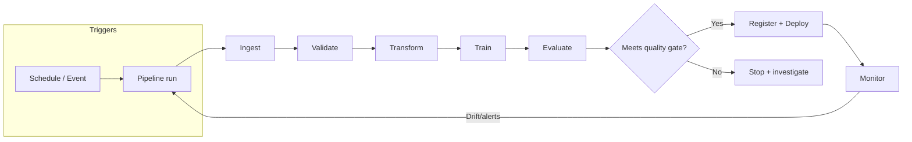

## PART IV: PIPELINES & ARCHITECTURE

### Table of Contents

- [4.0 WHY PIPELINES (AUTOMATION) MATTER](#40-why-pipelines-automation-matter)
  - [4.0.1 Data preparation & processing system basics](#401-data-preparation--processing-system-basics-exam-level)
  - [4.0.2 OPERATING DATA PIPELINES IN PRODUCTION](#402-operating-data-pipelines-in-production-test-style)
- [4.1 EVENT-DRIVEN TRAINING](#41-event-driven-training)
- [4.2 PREPROCESSING AT PREDICTION TIME](#42-preprocessing-at-prediction-time)
- [4.3 ARCHITECTURE PATTERNS](#43-architecture-patterns)
- [4.4 KUBEFLOW PIPELINES](#44-kubeflow-pipelines)
- [4.5 PIPELINE ORCHESTRATION OPTIONS](#45-pipeline-orchestration-options)
  - [4.5.1 PROMOTING A MODEL ARTIFACT TO PRODUCTION](#451-promoting-a-model-artifact-to-production-staging-first)
- [4.6 DATA PIPELINES](#46-data-pipelines)
- [4.7 MODEL MONITORING](#47-model-monitoring)
- [4.8 RESOURCE ORGANIZATION](#48-resource-organization)
- [4.9 CI/CD FOR ML](#49-cicd-for-ml)
- [4.10 PRODUCTION READINESS CHECKS (MLOps)](#410-production-readiness-checks-mlops)
- [4.11 CONTINUOUS TRAINING (CT) PATTERN](#411-continuous-training-ct-pattern)

### Official docs (high-signal starting points)

- **Vertex AI Pipelines**: [Vertex AI Pipelines Introduction](https://cloud.google.com/vertex-ai/docs/pipelines/introduction)
- Kubeflow Pipelines SDK: [kubeflow.org/docs/components/pipelines](https://www.kubeflow.org/docs/components/pipelines/)
- **Cloud Composer** (managed Airflow): [cloud.google.com/composer/docs](https://cloud.google.com/composer/docs)
- **Dataflow**: [cloud.google.com/dataflow/docs](https://cloud.google.com/dataflow/docs)
- **Dataproc**: [cloud.google.com/dataproc/docs](https://cloud.google.com/dataproc/docs)
- **Cloud Data Fusion**: [cloud.google.com/data-fusion/docs](https://cloud.google.com/data-fusion/docs)
- **Pub/Sub**: [cloud.google.com/pubsub/docs](https://cloud.google.com/pubsub/docs)
- **Cloud Functions**: [cloud.google.com/functions/docs](https://cloud.google.com/functions/docs)
- **Cloud Monitoring**: [cloud.google.com/monitoring/docs](https://cloud.google.com/monitoring/docs)
- **Cloud Logging**: [cloud.google.com/logging/docs](https://cloud.google.com/logging/docs)
- **Cloud Build** (CI/CD): [cloud.google.com/build/docs](https://cloud.google.com/build/docs)
- MLOps Best Practices: [MLOps Continuous Delivery](https://cloud.google.com/architecture/mlops-continuous-delivery-and-automation-pipelines-in-machine-learning)

### 4.0 WHY PIPELINES (AUTOMATION) MATTER

Automating ingestion, preprocessing, training, evaluation, and deployment reduces manual effort and improves reliability.

- **Primary benefit**: Less manual work + faster iteration + fewer human errors
- **Orchestration**: Scheduling/triggering runs and managing dependencies (DAGs)
- **Logging/monitoring**: Detect pipeline failures and bottlenecks early
- **Version control**: Reproducibility of pipeline code/config and rollbacks

**EXAM TIP:** Pipeline automation/orchestration is about streamlining the **end-to-end workflow**, not making data "random" or changing model accuracy.

#### MLOps: Background and Foundations

**What is MLOps?**: Machine Learning Operations (MLOps) is about integrating ML models into real-world software systems. It's where machine learning meets software engineering, DevOps, and data engineering.

**Key realization**: The ML model itself is only a **small part** of a production ML system. The surrounding infrastructure (data pipelines, feature engineering, serving infrastructure, monitoring, etc.) is much larger and more complex.

**Why MLOps matters**:

- **Models degrade over time**: Real-world conditions change (user behavior, data drift, concept drift)
- **Production requirements**: Must run continuously (24/7), handle evolving data, meet latency/throughput requirements
- **Without MLOps**: Manual, brittle processes lead to slow iteration, error-prone deployments, stale models in production

**MLOps vs DevOps**:

| Aspect          | Traditional Software             | ML Systems                                                         |
| --------------- | -------------------------------- | ------------------------------------------------------------------ |
| **Development** | Deterministic                    | Experimental, data-driven                                          |
| **Versioning**  | Code only                        | Code + data + models                                               |
| **Testing**     | Functional correctness           | Functional + data validation + model performance                   |
| **Deployment**  | Code push                        | Multi-step pipeline (retraining, validation, deployment)           |
| **Performance** | Code/infrastructure issues       | Model quality degradation (drift)                                  |
| **Monitoring**  | Service health (latency, errors) | Service health + model predictions (distribution shifts, accuracy) |
| **Lifecycle**   | Linear                           | Cyclical (feedback loops back to data collection)                  |

**MLOps = DevOps + data + models**

**System-level concerns in production ML**:

1. **Latency and throughput**:

   - **Latency**: Time from input to prediction (critical for user-facing apps)
   - **Throughput**: Predictions per unit time (critical for high-volume tasks)
   - **Trade-offs**: Model accuracy vs speed (simpler models, quantization, batch processing, caching)

2. **Data and concept drift**:

   - **Data drift**: Changes in input data distribution (e.g., summer photos → winter photos)
   - **Concept drift**: Changes in input-output relationship (e.g., pre-pandemic vs post-pandemic churn signals)
   - **Handling**: Monitoring (statistical tests, distribution tracking), thresholds/alerts, periodic retraining, online learning (with caution)

3. **Feedback loops**:

   - Model's predictions influence future input data (e.g., recommendation systems showing certain content → users click → skewed data)
   - **Managing**: Explore-exploit trade-off, debiasing training data, simulations/A/B tests, breaking the loop periodically

4. **Reproducibility**:
   - Ability to recreate model results reliably
   - **Requirements**: Version control (code, data, models), containerization (Docker), tests for data/models, fixed random seeds
   - **Why important**: Debugging, consistency across environments, collaboration

**EXAM TIP:** Questions about "model performance degrading over time" → think **data drift** or **concept drift** → solution is **monitoring + retraining**.  
**EXAM TIP:** Questions about "recreating results" or "consistency across environments" → think **reproducibility** → solution is **version control + containerization + tests**.

#### 4.0.3 The Machine Learning System Lifecycle (Detailed)

**Overview**: The ML lifecycle consists of interconnected stages: **Scoping → Data → Modeling → Deployment → Monitoring**. Each stage requires specific engineering practices and tooling for production readiness.

**Key insight**: "Developing ML models starts with engineering data." Data quality issues are more frequent causes of failure in production ML than algorithm issues. MLOps pays significant attention to data monitoring, validation, and versioning.

**1. Data Pipelines**

**Why data pipelines matter**: In ML, the quality and management of your data are often more important than the specific modeling algorithm. Production ML systems need robust data pipelines to reliably feed data into model training and inference.

**Key insight**: "In enterprise MLOps, models are commodities, but data pipelines are assets." The cleverest model architecture is worthless if fed unreliable data. Choices made for data have profound downstream consequences on performance, scalability, and reliability of entire ML system.

**Key aspects**:

**A. Data Sources**:

Production ML systems interact with data from several origins:

**1. User Input Data**:

- Data explicitly provided by users (text in search bar, uploaded images, form submissions)
- **Notoriously unreliable**: Users are lazy; if possible to input unformatted/raw data, they will
- **Requires**: Heavy-duty validation and robust error handling
- **Example**: Search queries, image uploads, form submissions

**2. System-Generated Data (Logs)**:

- Applications and infrastructure generate massive volume of logs
- **Records**: Significant events, system states (memory usage), service calls, model predictions
- **Characteristics**: Often noisy, but invaluable for debugging, monitoring system health, ML system visibility
- **Processing**: Can be processed in batches (daily/weekly) or real-time for monitoring/alerting
- **Example**: Application logs, infrastructure metrics, model prediction logs

**3. Internal Databases**:

- Where enterprises typically derive most value
- **Sources**: Inventory, CRM, user accounts, financial transactions
- **Characteristics**: Highly structured, follows relational model
- **Use case**: Feature engineering, ensuring recommendations match inventory
- **Example**: Customer database, product catalog, transaction history

**4. Third-Party Data**:

- Data acquired from external vendors
- **Types**: Demographic information, social media activity, purchasing habits
- **Power**: Can bootstrap models like recommender systems
- **Challenge**: Availability increasingly constrained by privacy regulations
- **Example**: Demographic data, social media feeds, market research data

**B. Data Formats**:

The format you choose for storage is a critical architectural decision impacting storage costs, access speed, and ease of use.

**1. Text vs Binary**:

| Aspect          | Text Formats (JSON, CSV)                   | Binary Formats (Parquet)                             |
| --------------- | ------------------------------------------ | ---------------------------------------------------- |
| **Readability** | Human-readable (can open in text editor)   | Not human-readable (requires schema)                 |
| **Storage**     | Verbose, consumes more space               | Compact, efficient (e.g., 14 MB CSV → 6 MB Parquet)  |
| **Use case**    | Debugging, configuration, data interchange | Large-scale analytical workloads (industry standard) |
| **Example**     | JSON: 7 bytes for "1000000"                | Binary: 4 bytes for integer 1000000                  |

**Text formats**:

- **JSON**: Ubiquitous due to simplicity and flexibility, represents structured and unstructured data
- **CSV**: Simple, human-readable, easy to debug
- **Cost**: Verbose, significantly more storage space

**Binary formats**:

- **Parquet**: Designed for machine consumption, far more compact and efficient
- **Requirement**: Program must know exact schema and layout to interpret bytes
- **Space savings**: Dramatic (e.g., 14 MB CSV → 6 MB Parquet)
- **Industry standard**: For large-scale analytical workloads

**2. Row-Major vs Column-Major**:

This distinction is critical for ML engineers—directly relates to how we access data for training and analysis.

| Aspect             | Row-Major (CSV)                                    | Column-Major (Parquet)                                  |
| ------------------ | -------------------------------------------------- | ------------------------------------------------------- |
| **Layout**         | Consecutive elements of row stored together        | Consecutive elements of column stored together          |
| **Optimized for**  | Write-heavy workloads, adding complete records     | Analytical queries (calculating mean of single feature) |
| **Access pattern** | Retrieving entire samples (all data for user ID)   | Reading single column as contiguous block               |
| **Performance**    | Slower for analytical queries (jump around memory) | Faster for analytical queries (cache-friendly)          |

**Row-major format**:

- **Layout**: Consecutive elements of row stored next to each other (reading table line by line)
- **Optimized for**: Write-heavy workloads, frequently adding new complete records
- **Efficient for**: Retrieving entire samples at once (all data for specific user ID)

**Column-major format**:

- **Layout**: Consecutive elements of column stored next to each other
- **Optimized for**: Analytical queries common in ML
- **Example**: Calculating mean of single feature across millions of samples
  - Column-major: Read one column as single contiguous block (extremely efficient, cache-friendly)
  - Row-major: Jump around memory, reading small piece from each row (significantly slower)
- **Performance**: Orders of magnitude faster for columnar operations

**Pandas DataFrame example**:

- **Built around column-major DataFrame**
- **Iterating by column**: ~2 microseconds (fast, contiguous memory)
- **Iterating by row**: ~38 microseconds (~20x slower, non-contiguous memory)
- **Reason**: Processors more efficient with contiguous blocks of memory
- **Not a flaw**: Direct consequence of column-major data model

**D. Data Ingestion**:

- Getting raw data from various sources into your system/development environment
- **Batch ingestion**: Periodically importing a dump or running a daily job
- **Streaming ingestion**: Real-time processing of incoming events
- **GCP tools**: Cloud Storage (batch), Pub/Sub (streaming), Dataflow (processing)

**E. Data Storage**:

- Once ingested, data needs to be stored (often in both raw form and processed form)
- **Data lakes**: Low-cost storage for raw, unstructured/semi-structured data (Cloud Storage, AWS S3, on-prem HDFS)
- **Data warehouses**: Optimized for analytical queries (BigQuery)
- **Feature stores**: Centralized database of precomputed features for training and online inference
  - Ensures consistency between offline training data and online serving data
  - Examples: Vertex AI Feature Store, Feast, Tecton

**C. Data Processing (ETL/ELT)**:

**ETL in ML Workflows**:

ETL stands for **Extract, Transform, Load**. It describes the pipeline of getting data from sources, processing it into usable form, and loading it into storage/system for use. ETL is often the first stage of preparing data for model training or inference.

**1. Extract**:

- **Pull data** from various sources (databases, APIs, files, etc.)
- **ML sources**: Application databases, logs, third-party datasets, user-provided data
- **Validation**: Check for malformed records during extraction
- **Early rejection**: Reject or quarantine data that doesn't meet expectations as early as possible
- **Example**: Filter out records with missing required fields, log/notify about bad data
- **Benefit**: Early validation prevents propagating errors downstream

**2. Transform**:

- **Core processing step**: Data cleaned and converted into desired format
- **Operations**:
  - Merging multiple sources
  - Handling missing values
  - Standardizing formats (categorical labels consistent across sources)
  - Deduplicating records
  - Aggregating or summarizing data
  - Deriving new features
- **ML-specific**: Feature engineering (turning raw data into features models can consume)
  - **Examples**: Raw timestamps → day-of-week, time-since-last-event
  - Encoding categorical variables as one-hot vectors
  - Normalizing numeric fields
- **Hefty part**: Most data wrangling happens here

**3. Load**:

- **Load transformed data** into target destination
- **Targets**: Data warehouse, relational database, distributed storage, cloud storage, analytical database
- **ML pipelines**: Could mean:
  - Writing cleaned dataset for training (CSV/Parquet file, data warehouse table)
  - Loading features into feature store
  - Loading into production databases for serving
- **Considerations**:
  - **Frequency**: How often to load (batch schedule or streaming)
  - **Format**: What format to use
  - **Example**: Load aggregated features daily into warehouse table that training job will read

**ETL vs ELT**:

**ELT (Extract, Load, Transform)** is a variant where raw data is first loaded into storage (often data lake) before transformation.

| Aspect              | ETL                                       | ELT                                                          |
| ------------------- | ----------------------------------------- | ------------------------------------------------------------ |
| **Order**           | Extract → Transform → Load                | Extract → Load → Transform                                   |
| **Processing**      | Transform before loading                  | Load raw data, transform later                               |
| **Storage**         | Transformed data in warehouse             | Raw data in data lake                                        |
| **Flexibility**     | Less flexible (transform defined upfront) | More flexible (redefine transformations later)               |
| **Ingestion speed** | Slower (processing upfront)               | Faster (minimal processing upfront)                          |
| **Downside**        | Less flexible                             | Data swamp (sifting through massive lake can be inefficient) |

**ELT popularity**: Rise of inexpensive storage and scalable compute. Organizations dump all raw data into data lake (S3, HDFS) immediately, transform later when needed.

**Advantages of ELT**:

- Quick ingestion (minimal processing upfront)
- Flexibility to redefine transformations later

**Disadvantages of ELT**:

- If store everything raw, face cost/complexity of sifting through "data swamp"
- As data volume grows, scanning massive lake for each query can be inefficient

**Hybrid approach**: Balance fast data acquisition (ELT style) with upfront processing (ETL style) to keep data usable.

**Common ML pattern**:

- Do some light cleaning upon extraction (avoid garbage data accumulation)
- Load into lake/warehouse
- Do heavier feature engineering transformations in later pipeline stages before model training

**Example: ETL for ML**:

E-commerce recommendation model:

- **Extract**: Production databases (orders, user info, product catalog)
- **Transform**: Join tables, clean inactive users/test orders, aggregate purchase history per user, encode product categories
- **Load**: Transformed feature set (user features and labels) into data warehouse table or saved as file
- **Training**: ML training job reads prepared data

**If ELT instead**: Dump all raw logs/databases into data lake, ML pipeline transforms raw data on-the-fly each time (more flexible, but possibly slower).

**Hybrid**: Some ETL to create intermediate features, then ELT of those into warehouse and further transformations.

**Note on Streaming**:

- **ETL traditionally**: Batch processing (periodic loads)
- **Streaming data**: Real-time feeding into online model
- **Similar principles**: "get data → process → use data" remains, just with low latency
- **Tools**: Kafka for extraction, real-time transforms, etc.
- **Coverage**: Will touch on streaming in context of feature stores and orchestration in future chapters

**Hands-On: Building Data Pipelines (Hybrid ETL/ELT Example)**:

**Objective**: Simulate a basic ML data pipeline demonstrating hybrid ETL/ELT approach with data generation, validation, feature engineering, and storage in multiple formats.

**Pipeline Structure**:

**Stage 1: ETL Sub-Pipeline (E → T → L)**:

**1. Extract Phase I**:

- Pull data from heterogeneous sources:
  - **Internal databases**: SQLite `customers.db` (customer master data)
  - **Finance systems**: `sales.csv` (transactional sales data)
  - **Activity tracking**: `events.json` (behavioral event data)
- Functions: `extract_sales_csv()`, `extract_events_json()`, `extract_customers_sqlite()`
- Bring heterogeneous data into common format (pandas DataFrames)

**2. Validation Phase**:

- **validate_sales()**:
  - Column checks, type casting (IDs → int, amounts → numeric, timestamps → datetime)
  - Drop invalid rows (missing key fields)
  - Sanitize amounts (negative/zero → NaN, cap extreme outliers)
  - Fill missing amounts (customer-level median, then global median)
  - Deduplication (keep latest timestamp per sale_id)
- **validate_events()**:
  - Column checks, type casting
  - Drop invalid rows, deduplication
- **validate_customers()**:
  - Column checks, type casting
  - Drop invalid rows, deduplication

**3. Transform Phase I**:

- **Feature engineering for churn prediction**:
  - **Time windows**: Observation window (e.g., 200 days) and label window (e.g., 60 days)
  - **RFM features**:
    - **Recency**: Days since last purchase (cutoff - last_purchase_date)
    - **Frequency**: Count of purchases in observation window
    - **Monetary**: Sum of amounts, average amount, max amount
  - **Inter-purchase gap**: Mean days between consecutive purchases
  - **Tenure**: Days since customer signup
  - **Demographics**: Country, city
  - **Label**: Churn (1 if no future purchase in label window, 0 otherwise)
- **Leakage safety**: All features computed from observation window (before cutoff), label from label window (after cutoff)
- **Output**: Feature table (row per customer) with engineered features and labels

**4. Load Phase I**:

- **Save transformed data** in multiple formats:
  - CSV (human-readable, debugging)
  - Parquet (compact, efficient, analytical queries)
  - JSON (interchange, API responses)
- **Documentation**:
  - Data dictionary (explaining each feature column)
  - Run metadata (timestamp, random seed, parameters, row counts)
  - QA report (unique customers, churn rate, date ranges)

**Stage 2: ELT Sub-Pipeline (E → L → T)**:

**5. Extract Phase II**:

- **Fetch intermediate dataset** from storage (simulating ML team fetching from data team's storage)
- Can use any format (CSV, Parquet, JSON) depending on needs
- **Purpose**: Handle missing values (NaNs from customers with no purchases)

**6. Load Phase II**:

- **Save fetched data** before transformation (ELT pattern: load raw first)
- Ensures data available for future use without re-extraction

**7. Transform Phase II**:

- **scikit-learn Pipeline** for preprocessing:
  - **Split data**: Train/validation split (80/20) with stratification
  - **Detect column types**: Numeric vs categorical (from training data only)
  - **Numeric pipeline**:
    - Impute missing values with column mean
    - Standardize features (mean 0, variance 1)
  - **Categorical pipeline**:
    - Impute missing categories with most frequent
    - One-hot encode categories
  - **ColumnTransformer**: Apply appropriate pipeline to each column type
  - **Leakage safety**: Fit preprocessor on training only, transform validation
- **Output**: Processed train/validation DataFrames ready for modeling

**Key Implementation Patterns**:

```python
# Extract from multiple sources
def extract_sales_csv():
    df = pd.read_csv('sales.csv')
    return df

def extract_customers_sqlite():
    conn = sqlite3.connect('customers.db')
    df = pd.read_sql('SELECT * FROM customers', conn)
    conn.close()
    return df

# Validate and clean
def validate_sales(df):
    # Type casting, sanitization, imputation, deduplication
    return cleaned_df

# Transform (feature engineering)
def transform_features(sales, customers, cutoff, obs_days, label_days):
    # RFM features, time-based features, leakage-safe labels
    return features_df, daily_obs, sales_obs

# Load (save in multiple formats)
def dump_outputs(feats, sales_obs, daily_obs, cutoff, obs_days, label_days):
    feats.to_csv('features.csv')
    feats.to_parquet('features.parquet')
    feats.to_json('features.json', orient='records', indent=2)
    # Save metadata, data dictionary, QA report

# ELT: Extract → Load → Transform
# Extract intermediate data
df = pd.read_parquet('features.parquet')

# Load (save copy)
df_copy = df.copy()
df_copy.to_parquet('features_copy.parquet')

# Transform (scikit-learn pipeline)
from sklearn.pipeline import Pipeline
from sklearn.compose import ColumnTransformer
from sklearn.preprocessing import StandardScaler, OneHotEncoder
from sklearn.impute import SimpleImputer

numeric_pipeline = Pipeline([
    ('imputer', SimpleImputer(strategy='mean')),
    ('scaler', StandardScaler())
])

categorical_pipeline = Pipeline([
    ('imputer', SimpleImputer(strategy='most_frequent')),
    ('onehot', OneHotEncoder(sparse_output=False, handle_unknown='ignore'))
])

preprocessor = ColumnTransformer([
    ('numeric', numeric_pipeline, numeric_cols),
    ('categorical', categorical_pipeline, categorical_cols)
])

X_train_processed = preprocessor.fit_transform(X_train)
X_valid_processed = preprocessor.transform(X_valid)
```

**Key Takeaways**:

- **Hybrid approach**: ETL for initial processing, ELT for flexible downstream transformations
- **Multiple formats**: Save in CSV (debugging), Parquet (efficiency), JSON (interchange)
- **Leakage prevention**: Strict separation of observation and label windows, fit preprocessor on training only
- **Validation**: Early validation prevents propagating errors downstream
- **Documentation**: Data dictionary, metadata, QA reports for traceability
- **Reproducibility**: Random seeds, timestamps, parameter logging

**EXAM TIP:** Questions about "ETL vs ELT" → think **ETL** (transform before load, less flexible but cleaner) vs **ELT** (load raw first, transform later, more flexible but can create data swamp). Questions about "data format choice" → think **text formats** (human-readable, debugging) vs **binary formats** (compact, efficient, industry standard for analytics). Questions about "row vs column storage" → think **row-major** (write-heavy, retrieve entire samples) vs **column-major** (analytical queries, calculate mean of feature, much faster). Questions about "data pipeline structure" → think **Extract → Validate → Transform → Load** (ETL) or **Extract → Load → Transform** (ELT).

**G. Sampling Strategies**:

**Why sampling matters**: In many cases, we cannot or do not use all available data. Perhaps data is too large (training on trillions of records isn't feasible), or obtaining labels is costly, so we label a subset, or we intentionally down-sample for quicker experimentation. Good sampling can make model development efficient and ensure the model generalizes, while poor sampling can mislead your results.

**Sampling occurs in many stages**:

- Choosing what real-world data to collect for building your dataset
- Selecting a subset of available data for labeling or training (especially when you have more data than you can feasibly use)
- Splitting data into training/validation/testing sets
- Sampling data during training for each batch (in stochastic gradient descent, for example)
- Sampling in monitoring (e.g., logging only a fraction of predictions for analysis)

**Types of Sampling**:

**1. Non-Probability Sampling**:

Not strictly based on random chance but uses some subjective or practical criteria to pick data.

**A. Convenience Sampling**:

- Selecting data that is easiest to obtain
- **Example**: Using the first 10,000 records from a log because they're readily at hand, or using a dataset collected from one accessible source (like one city or one user group)
- **Implications**: High risk of bias since the sample may not represent the overall population
- **Use case**: Popular because it's convenient, but can skew results (e.g., model trained on data from single city may not generalize to other regions)

**B. Snowball Sampling**:

- Using existing sample data to recruit further data
- **Example**: Social networks or graphs—you have data on some users, then include their friends, then friends-of-friends, and so on
- **Implications**: Can be helpful to gather relevant data when you don't have direct access, but can over-represent tightly connected communities and miss out on isolated samples

**C. Judgment (Purposive) Sampling**:

- Relying on experts to hand-pick what data to include
- **Example**: Domain expert might select "important" cases to train on
- **Implications**: Can incorporate valuable domain knowledge, but it's subjective and can reflect the expert's biases

**D. Quota Sampling**:

- Ensures certain predefined quantities or a fraction of different sub-groups
- **Example**: Include exactly 100 samples of each class in a classification problem, or maintain a specific count or certain ratio of categories
- **Implications**: Guarantees representation of all groups, but the selection within each group might still be non-random (usually convenience-based within each quota)
- **Risk**: Can introduce bias if the population within each quota is not homogeneous

**Non-probability sampling**: Often a starting point (especially in early prototyping or when data access is limited). However, models built on non-random samples may not be reliable. If you use these methods, be aware of the biases.

**2. Probability (Random) Sampling Methods**:

Probabilistic sampling methods are less prone to bias than non-probabilistic methods, owing to the inherent randomness in their selection strategy.

**A. Simple Random Sampling**:

- Each data point has an equal chance of being selected
- **Example**: Shuffling your dataset and picking a subset
- **Works well**: If your data is homogeneous or you truly have no prior knowledge of important groupings
- **Problem**: Can be problematic if there are rare but important subgroups; you might, by chance, pick too few of them
- **Example issue**: Dataset of transactions with 2% fraud. A simple random sample of 1,000 might contain around 20 fraud cases. If you happen to get 5 or 50 by random fluctuation, your sample's fraud rate would skew

**B. Weighted Sampling**:

- A form of random sampling where each sample is given a weight (probability) for selection
- **Allows**: Oversampling certain cases or undersampling others in a controlled way
- **Example**: Weight rare classes higher so they appear more in the sample
- **Tools**: `random.choices` in Python allows weighted sampling
- **Use cases**: Combat class imbalance (oversampling minority class), emphasize recent data more than older data
- **Note**: Concept of sample weights during model training is related but distinct—weighted sampling picks more of some data to include, whereas sample weights let you include all data but give some examples more importance in the loss function

**C. Stratified Sampling**:

- Divide the population into strata (groups) and sample from each group separately to ensure representation
- **Example**: For an imbalanced classification, stratify by class label so that your sample has the same class proportions as the full dataset (or ensure each class gets enough representation)
- **Benefits**: Greatly reduces variance between subgroup representation
- **Recommendation**: Generally recommended for creating train/test splits when class distributions are important
- **Drawback**: Need to know the important grouping variables upfront, and if some groups are very small or hard to stratify (e.g., continuous variables), it might not be applicable

**D. Reservoir Sampling**:

- Algorithm for sampling from streaming data of unknown size, ensuring each item has an equal probability of being included
- **Use case**: Continuous stream (say, user clicks) and you want to maintain a random sample of fixed size (like the last 1,000 clicks, but in a random sense, not just the latest)
- **Benefit**: Allows you to sample from a stream without storing it all, which is crucial in production streaming pipelines

**E. Importance Sampling**:

- More advanced technique often used in statistical estimation and reinforcement learning
- **Concept**: You want to evaluate or train on a distribution that is different from where your data came from by re-weighting samples
- **Use case**: In ML pipelines, can be used to bias the sampling towards informative cases while still correcting for that bias during estimation
- **Example**: In reinforcement learning, you might sample episodes from a behavior policy but want to evaluate a target policy. Importance sampling provides a way to correct for the difference

**Practical Implications of Sampling Choices**:

- **Always ask**: "Does my sample reflect the real-world distribution relevant to the model's deployment?"
- **Use stratification**: When splitting datasets by class, time, or other key criteria. Most ML libraries (scikit-learn's `train_test_split` for example) have stratified split options for classification problems
- **Sampling bias**: Can creep in from many sources. Even an ostensibly random sample can be biased if your data source is incomplete
- **Downsampling for experiments**: When downsampling for quicker experiments (common practice), do it carefully. It's fine to take, say, 10% of data to prototype, but keep it random or stratified. Always test the final model on the full distribution if possible
- **Big data tip**: If you have an extremely large dataset, instead of training on all of it, you might take a well-stratified sample to train initial models (for speed) and then possibly gradually increase data size. Sometimes a model saturates performance with far less than the total available data

**Key principle**: Sampling is both a necessity and a potential pitfall. It's integral to how we create manageable training sets and evaluation splits. The guiding principle is to ensure your sampling strategy is aligned with the problem's needs and does not inadvertently introduce bias.

**H. Data Design: Class Imbalance**:

**Class imbalance is the norm in production ML**: Most interesting problems involve detecting rare events—fraudulent transactions, customer churn, equipment failure, or disease diagnosis. The vast majority of your data will belong to the "normal" or negative class.

**Challenges for model training**:

**1. Insufficient signal**: With very few examples of the minority class, the model does not usually have enough information to learn its distinguishing patterns.

**2. Degenerate solutions**: It's easy for a model to achieve high accuracy by adopting a simple heuristic: always predict the majority class. In a dataset where only 0.1% of cases are fraudulent, this strategy yields 99.9% accuracy, a local minimum that can be difficult for optimization algorithms to escape.

**👉 For this reason, accuracy alone is not a reliable metric for datasets with class imbalance. Metrics such as recall and F1 score provide a more informative evaluation in such cases.**

**3. Asymmetric error costs**: The business impact of a misclassification is rarely symmetrical. A false negative (missing a fraudulent transaction) is often far more costly than a false positive (flagging a legitimate transaction for review). Standard loss functions treat all errors equally, leading to models that are not optimized for the business problem.

**Techniques to Address Class Imbalance**:

**1. Data-Level Methods (Resampling)**:

These methods modify the data distribution itself.

**A. Undersampling**:

- **Removing samples** from the majority class
- **Simple approach**: Random removal
- **Sophisticated techniques**: Tomek links remove the majority-class samples that are close to minority-class samples, helping to clarify the decision boundary
- **Risk**: Discarding potentially useful information

**B. Oversampling**:

- **Adding more samples** to the minority class
- **Simple method**: Random duplication (but can lead to overfitting)
- **Advanced technique**: SMOTE (Synthetic Minority Oversampling Technique), which creates new synthetic samples by interpolating between existing minority class samples
- **Effectiveness**: Generally most effective on low-dimensional, tabular data
- **Note**: There has been some criticism towards SMOTE

**2. Algorithm-Level Methods (Cost-Sensitive Learning)**:

These methods modify the learning algorithm to be more robust to imbalance, keeping the original data distribution intact. This is often the preferred approach for modern deep learning models.

**A. Class Weights**:

- **Most common approach**: Assign a weight to each class in the loss function that is inversely proportional to its frequency
- **Effect**: Forces the model to "pay more attention" to getting the rare examples correct
- **Implementation**: `class_weight="balanced"` in scikit-learn, or manual weights

**B. Focal Loss**:

- **More advanced modification** of the standard cross-entropy loss
- **Concept**: Dynamically down-weights the loss for well-classified examples, allowing the model to focus its efforts on hard-to-classify examples, which often belong to the minority class
- **Formula**: `FL(p_t) = -α_t(1 - p_t)^γ log(p_t)`
  - `α_t`: Inverse of class frequency (handles class imbalance)
  - `γ` (gamma): Focusing parameter (down-weights easy examples)
  - `p_t`: Predicted probability for the true class
- **Benefits**:
  - Reduces contribution of confident predictions
  - Higher γ → more downweighing of easy examples
  - Addresses both class imbalance and hard example focus
- **Use case**: Particularly effective for imbalanced datasets where rare classes matter most

**EXAM TIP:** Questions about "class imbalance" → think **accuracy is misleading** (use recall, F1, ROC-AUC instead), **data-level methods** (undersampling, oversampling, SMOTE) vs **algorithm-level methods** (class weights, focal loss). Questions about "sampling strategies" → think **probability sampling** (random, stratified, weighted) vs **non-probability sampling** (convenience, snowball, judgment, quota). Always use **stratified splits** for imbalanced classification problems.

**I. Data Leakage**:

**Definition**: Data leakage occurs when information from outside the training data (often from the future or from the test set) leaks into the features used to train a model. In simpler terms, it's when your model accidentally gets a sneak peek at data it shouldn't have during training, leading to overly optimistic performance and likely catastrophic failure in production.

**Why data leakage is dangerous**:

- **A leaked feature** can make a model seem extremely accurate during training/validation, because it's indirectly using the answer!
- **When deployed**, that information isn't available (or is ill-gotten), so the model fails unexpectedly
- **Leakage can be subtle** and is often discovered only after deployment, when the model behaves too well on historical data but poorly on new data

**Common Causes of Data Leakage**:

**1. Train/Test Contamination**:

- **Most straightforward leakage**: Somehow, data from the test set gets into the training set
- **Causes**: Dataset split isn't truly random or independent
- **Example**: If the data are time-dependent and you randomly shuffle, some future info might end up in training. Or if there are duplicates, the same entity might appear in the train and test
- **Prevention**:
  - Always perform rigorous deduplication before splitting your data
  - Perform the split before applying any preprocessing steps (scaling, encoding, feature engineering)
  - Ensure that there is no overlap between the splits
  - For time-series data, respect the temporal order: models should only be trained on past data and evaluated on future data
  - For datasets with non-independent observations (e.g., multiple entries per user), split by unique entities so that all records of an individual belong exclusively to one set

**2. Leaking Through Preprocessing**:

- **Subtle form**: If you normalize or impute data using the combined statistics of train+test
- **Example**: Scaling features to 0-1 using the min and max of the entire dataset (including test) leaks knowledge of the test distribution into the train
- **Another example**: If you do PCA on the entire dataset before splitting, the PCA components are influenced by test data variance
- **Prevention**:
  - Always fit preprocessing only on the training set, then apply it to validation/test
  - This is exactly why scikit-learn's `Pipeline` (and similar constructs) are valuable—they ensure that any fitted transforms (like scalers) are fit on training data only
  - Perform operations like scaling, encoding, feature selection inside the training pipeline
  - Do not use global stats. For instance, use the training mean/STD for normalization of test data, not the global mean

**3. Using Target-Derived Features**:

- **Common mistake** in feature engineering
- **Example**: Predicting whether a user will churn next month, and you accidentally include a feature like "number of logins in next month" which obviously includes the outcome
- **Less obvious**: You include a summary that was computed including the target period
- **Prevention**: Think carefully. Any feature that wouldn't be available at prediction time (or that uses information from the future relative to prediction) is a leakage risk. In pipelines, ensure that features are computed only from past data for the prediction timestamp. Feature stores often help here by doing point-in-time correct joins

**4. Time-Series Leakage**:

- **When data is time-dependent**, leakage can occur if future information is used
- **Common cause**: Not respecting chronological order
- **Example**: If predicting stock prices, you must not randomly shuffle the data during cross-validation, or you'll train on data from 2021 to predict 2020
- **Another scenario**: Features that accumulate over time can leak if not careful. Imagine a feature "total sales to date": if you compute it for each record up to the current date, that's fine. But if you accidentally compute it using the full dataset, the later entries will have totals including future sales
- **Prevention**:
  - Use temporal splits (train on past, validate on later periods)
  - If you compute cumulative features, ensure you cut off at the right timestamp for each training instance

**5. Leakage Through Data Collection/Labeling Process**:

- **Sometimes, the way data is collected** can introduce leakage
- **Famous example**: Medical ML model predicting disease from X-ray images that seemed extremely accurate, but later found out that many "disease" images had a certain marker or scanner type that only the patients with that disease used; the model was picking up on the marker, not the disease itself
- **Another case**: COVID-19 prediction model leaked because positive cases often came from certain hospitals (the model learned hospital origin, not actual patient data)
- **Prevention**:
  - Scrutinize how labels are generated
  - Ensure that nothing in the features is inadvertently a proxy for the label
  - If necessary, do data cleaning to remove or randomize such identifiers
  - When splitting, stratify in a way that avoids easy proxies (like ensuring both train and test have data from all sources, if possible)

**6. Human Leakage in Feature Engineering**:

- **When a domain expert**, in constructing features, uses knowledge of the target
- **Example**: Building a credit risk model, an engineer might think to include whether the customer eventually defaulted as a feature, which is obviously the target itself, but perhaps encoded differently
- **Prevention**: It sounds silly, but it can happen in less blatant ways (like "account status at end of quarter" as a feature while trying to predict default in that quarter)

**Data leakage can happen at any stage**: Data gathering, sampling, splitting, preprocessing, and feature engineering. Therefore, monitoring and testing for leakage are crucial throughout the ML lifecycle.

**Detecting and Preventing Leakage**:

**1. Holdout Validation**:

- Always evaluate your model on data that was held out from any stage of training or feature creation
- If performance drops drastically from training to holdout, suspect possible leakage or overfitting
- Consistent methodology (like proper cross-validation) will surface if something is too good to be true

**2. Feature Importance Analysis**:

- Compute feature importances (for tree models) or use permutation importance on the validation set
- If a particular feature is overwhelmingly important, inspect it; could it be leaking info?
- Sometimes, a leaked feature is like a "cheat code" the model uses. For instance, if a feature accidentally leaks, the model will latch onto it with, say, 10x or more importance than other features
- Domain knowledge helps here—check if any feature wouldn't realistically be available at prediction time

**3. Null Models and Sanity Checks**:

- Intentionally shuffle labels or use a time-shifted validation (e.g., predict last year from the previous year's model)
- If your pipeline has leakage, a model might oddly still perform well even when it shouldn't, because it's using the leaked structure rather than the true signal
- **Example**: Train on 2020 data, then test on 2019 (effectively backward in time, which should be nonsensical). Ideally, the performance should drop to random; if it doesn't, some time-leakage might be present

**4. Ablation Studies**:

- Systematically remove suspicious features or groups of features from your model and observe the impact on performance
- If removing a feature like `scan_machine_id` causes performance to plummet from, say, 99% to 60%, you have likely found a leak

**Quick Checklist**:

- ✅ Perform train/val/test split early and never peek at test in any way (don't tune on it, don't fit on it)
- ✅ When scaling or encoding, fit on train only
- ✅ If oversampling (for imbalance), do it after splitting, not before (to avoid having oversampled points leak into the test)
- ✅ For time series, use a time-based split; do not randomly shuffle across time
- ✅ Label encoding of categorical data should be fitted only on the training set—especially for encodings based on statistics, like target encoding
- ✅ If using cross-validation, ensure the folds are split on entire groups if needed (e.g., group K-fold by user to avoid the same user in multiple folds)

**A Simple, Ideal and Leakage-Safe ML Pipeline**:

**Key rule**: "Scale and normalize your data after splitting to avoid data leakage. Use statistics from only the train split, instead of the entire data, to scale your features and handle missing values."

**In MLOps**: Automated checks for leakage are valuable. Some feature store frameworks ensure point-in-time correctness (i.e., when creating training data, they join features in a way that a given training example's features are only from prior timestamps). You can also build pipeline tests: for instance, train a model on what should be "impossible" scenarios (like predicting the past from the future) to see if it performs oddly well, indicating leakage.

**Key takeaway**: Always imagine yourself at the moment of making a live prediction: only use data that would be available at that moment. Any data that comes later or from outside the training scope is off-limits for training. If in doubt, leave it out, or consult a teammate: "Is this feature leaking the target?". It's better to have a slightly less informed model than one that cheats and then fails in production.

**EXAM TIP:** Questions about "data leakage" → think **train/test contamination**, **preprocessing leakage** (fit on train only), **target-derived features**, **time-series leakage** (temporal order), **data collection artifacts**. Questions about "preventing leakage" → think **split early**, **fit preprocessing on train only**, **point-in-time correctness**, **feature importance analysis**, **ablation studies**.

**J. Feature Stores at Scale (Feast)**:

**What is a Feature Store**: A feature store is a centralized data store and management system for ML features. Feast is a popular open source feature store.

**Why Feature Stores**:

In a production ML system, you might have many models using overlapping features. If each pipeline computes features independently, you get duplication, inconsistency, and maintenance headaches.

**A feature store creates**:

- **Single source of truth**: Compute feature X once and use it everywhere
- **Online lookup**: Your serving code can query features by key with low latency
- **Consistency**: Ensures the model in production uses the exact same logic and values as were used in training (avoiding training-serving skew)
- **Point-in-time correctness**: Mechanisms to ensure no leakage from future data in feature computation

**Benefits**:

- Avoids recomputing features on the fly in production requests (which could be too slow or inconsistent)
- Provides storage for feature values in two forms:
  - **Offline store**: For training (historical feature data)
  - **Online store**: For real-time lookup of the latest feature values for serving predictions

**Feast Architecture (Brief)**:

Feast decouples feature computation and storage. We define features in a feature repository.

**Key Concepts**:

**1. Entity**:

- The primary key of a feature
- Entities have value types
- **Example**: `customer_id` is an entity

**2. Feature View**:

- A definition of a group of features (with a certain schema and entity) and how to get their data
- Includes the data source for computing the feature
- **Example**: `customer_stats` FeatureView contains features like `total_purchases`, `avg_order_value`, etc., all tied to the `customer_id` entity

**3. Offline Store**:

- Where historical feature data is stored
- **Feast supports**: BigQuery, Redshift, file system, etc., as an offline store
- Used for generating training datasets

**4. Online Store**:

- A fast key-value store for serving features to models
- **Feast supports**: Redis, DynamoDB, etc., as online stores
- Used for real-time feature lookups during inference

**5. Feature Service**:

- Groupings of features for convenience in retrieval
- Allows you to bundle multiple FeatureViews together

**How Feast Works**:

- **Define features in code**: Features are defined in a feature repository (YAML + Python)
- **Materialize to stores**: Feast allows you to materialize features to both offline and online stores
- **Point-in-time correctness**: When you do a training dataset generation, Feast does a point-in-time join—if you give it entity primary keys and timestamps and labels, it will fetch feature values as of that timestamp (so it doesn't use data from after the prediction time)
- **Consistency**: Feature definitions (transformations, sources) are in one place. If you update how a feature is computed, you update it in Feast and recompute. Both offline and online will reflect that

**Hands-On: Feast-Backed ML Data Pipeline**:

**Objective**: Simulate a compact end-to-end feature pipeline using Pandas, NumPy, Scikit-learn, and Feast.

**Key Steps**:

**1. Repository & Configuration Bootstrap**:

- Create a Feast repo (`feast_telco_repo`)
- Configure Feast with:
  - **Offline store**: `type: file` (Feast reads Parquet/CSV from disk)
  - **Online store**: SQLite DB for quick demo serving
  - **Registry file**: To track applied objects

**2. Data Sources & Feature Definitions**:

- Fetch dataset (e.g., Telco customer churn dataset)
- Perform basic cleaning operations
- Define features of interest (numerical and categorical)
- Simulate timestamps:
  - `feature_ts`: When features were available
  - `label_ts`: `feature_ts + 30 days` (prediction horizon)
  - `created_at`: `feature_ts + 5 minutes` (ingestion lag)
- **Principle**: Separation of feature time and label time is the foundation for point-in-time correctness

**3. Label Encoding for Feast**:

- Feast's Int64 fields can't store raw strings, so create an encoded copy for storage
- Keep the original strings for model training later
- **Important**: This encoding is not used by the model. The model uses sklearn's OneHotEncoder after splitting. Hence, no leakage.

**4. Persist Feature & Label Tables**:

- Create two artifacts:
  - `telco_features.parquet` → Input features for Feast's offline store
  - `entity_labels.parquet` → Labels + timestamps for ML training
- Enables Feast to do its time-travel join (`get_historical_features()`), ensuring:
  - Training data uses only past features
  - No data leakage from the future

**5. Define Feast Objects**:

```python
# Entity: Primary key
customer = Entity(
    name="customer_id",
    join_keys=["customer_id"],
    value_type=ValueType.STRING
)

# FileSource: Where to find raw feature data
source = FileSource(
    path="data/telco_features.parquet",
    timestamp_field="event_timestamp",
    created_timestamp_column="created_at"
)

# Schema: Feature fields and their data types
schema = Schema([
    Field(name="total_charges", dtype=Float32),
    Field(name="monthly_charges", dtype=Float32),
    # ... more features
])

# FeatureView: Logical grouping of features
customer_stats = FeatureView(
    name="customer_stats",
    entities=[customer],
    ttl=timedelta(days=365),
    schema=schema,
    source=source,
    online=True
)

# FeatureStore: Manage interaction with Feast repo
store = FeatureStore(repo_path="feast_telco_repo")
store.apply([customer, customer_stats])
```

**6. Retrieve Point-in-Time Features and Temporal Splitting**:

```python
# entity_df: Table with (customer_id, event_timestamp, label)
entity_df = pd.DataFrame({
    "customer_id": df["customer_id"],
    "event_timestamp": df["label_ts"],
    "label": df["churn"]
})

# get_historical_features(): Point-in-time join
training_df = store.get_historical_features(
    entity_df=entity_df,
    features=["customer_stats:total_charges", "customer_stats:monthly_charges", ...]
).to_df()

# Temporal split (not random!)
timestamps = training_df["event_timestamp"].sort_values()
split_idx_70 = int(len(timestamps) * 0.7)
split_idx_85 = int(len(timestamps) * 0.85)

train_df = training_df[training_df["event_timestamp"] <= timestamps.iloc[split_idx_70]]
valid_df = training_df[(training_df["event_timestamp"] > timestamps.iloc[split_idx_70]) &
                       (training_df["event_timestamp"] <= timestamps.iloc[split_idx_85])]
test_df = training_df[training_df["event_timestamp"] > timestamps.iloc[split_idx_85]]
```

**7. Preprocessing + Model Pipeline**:

```python
from sklearn.pipeline import Pipeline
from sklearn.compose import ColumnTransformer
from sklearn.preprocessing import StandardScaler, OneHotEncoder
from sklearn.impute import SimpleImputer
from sklearn.linear_model import LogisticRegression

# Numeric pipeline
numeric_pipeline = Pipeline([
    ("imputer", SimpleImputer(strategy="mean")),
    ("scaler", StandardScaler())
])

# Categorical pipeline
categorical_pipeline = Pipeline([
    ("imputer", SimpleImputer(strategy="most_frequent")),
    ("onehot", OneHotEncoder(handle_unknown="ignore"))
])

# ColumnTransformer
preprocessor = ColumnTransformer([
    ("numeric", numeric_pipeline, numeric_cols),
    ("categorical", categorical_pipeline, categorical_cols)
])

# Full pipeline
pipeline = Pipeline([
    ("preprocessor", preprocessor),
    ("classifier", LogisticRegression(class_weight="balanced"))
])

# Fit on training only (no leakage)
pipeline.fit(X_train, y_train)
```

**8. Materialize to Online & Feature Lookup**:

```python
# Materialization: Load feature data from offline source into online store
store.materialize_incremental(end_date=datetime.now())

# Feature Service: Group features for convenience
bundle = FeatureService(
    name="customer_bundle",
    features=[customer_stats]
)

# Online lookup (serving-style query)
online_features = store.get_online_features(
    entity_rows=[{"customer_id": "123"}, {"customer_id": "456"}],
    features=bundle
).to_dict()
```

**Key Takeaways from Feast Demo**:

- **Point-in-time correctness**: Feast ensures features available at training time are the same as those that would have been available in production
- **Temporal splits**: Use chronological splits (not random) to mimic the real world
- **Leakage prevention**: Strict separation of feature time and label time
- **Training-serving consistency**: Online lookups use the same FeatureView/Service as offline training
- **Single source of truth**: Feature definitions in one place, used everywhere

**EXAM TIP:** Questions about "feature stores" → think **single source of truth**, **offline store** (training) vs **online store** (serving), **point-in-time correctness**, **training-serving consistency**. Questions about "Feast" → think **Entity** (primary key), **FeatureView** (group of features), **get_historical_features()** (point-in-time join), **materialize** (load to online store).

**G. Data Labeling and Annotation**:

- For supervised ML problems requiring labels (ground truth)
- **Process**: Obtain labels for data (naturally collected or human annotation)
- **Production systems**: Include labeling pipeline using internal teams or crowd-sourcing
- **Continuous labeling**: Label new data on ongoing basis

**H. Data Versioning and Metadata**:

- **Critical**: Track which data was used to train which model
- Data changes over time (new records appended, corrections applied)
- Need to know which version of dataset X was used for reproducibility, auditing, model comparison
- **Metadata logging**: Timestamps of data extraction, checksums of files, number of records
- **Tools**: DVC (Data Version Control), MLflow, custom solutions

**I. Offline vs Online Pipelines**:

| Aspect          | Offline Pipelines (Training) | Online Pipelines (Serving)               |
| --------------- | ---------------------------- | ---------------------------------------- |
| **Purpose**     | Create training datasets     | Compute features for real-time inference |
| **Latency**     | Can be heavy (hours)         | Must be lightweight and low-latency      |
| **Scale**       | Large batches                | Single user request                      |
| **Consistency** | Must match online pipeline   | Must match offline pipeline              |

**Challenge**: **Training/serving skew** - offline and online pipelines diverge, causing model to behave differently in production than in training.

**Solutions**:

- Use shared feature store
- Derive training data by simulating online computations
- Ensure consistent preprocessing logic

**EXAM TIP:** Questions about "data pipeline reliability" → think **ingestion, storage, processing, labeling, versioning**. Questions about "training/serving inconsistency" → think **shared feature store** or **simulate online computations**.

**J. Distributed Data Processing with Apache Spark**:

**Why Spark**: As data volumes grow, single-machine tools (Pandas, NumPy) may start to falter. Apache Spark is a distributed computing engine widely used for big data processing. It plays a significant role in many MLOps pipelines where data is large or needs to be processed in parallel.

**What is Spark**:

- **Cluster computing framework** that provides an API for distributed data structures (RDDs, DataFrames) and operations on them
- **Written in Scala** but provides bindings for Python (PySpark), Java, R, etc.
- **Two key aspects** for ML pipelines:
  - **DataFrame API**: Similar concept to pandas DataFrame, but distributed
  - **Spark MLlib**: Includes its own pipeline and machine learning algorithms that can run in a distributed manner

**Spark DataFrame**:

- **Conceptually**: Like a table distributed across a cluster
- **Operations**: SQL-like operations, filter, join, group, etc., automatically parallelized
- **Under the hood**: Built on RDDs but provides optimizations through the Catalyst query optimizer
- **Code similarity**: Looks similar to Pandas code, but Spark can run on very large dataset spread across different machines
- **Execution**: Spark partitions the data and runs tasks on each partition in parallel. The data is not all loaded into one memory (each worker holds a chunk)

**Spark for ETL in ML**:

- **Heavy lifting**: A lot of data engineering pipelines use Spark to do:
  - Reading from data lakes
  - Joining large tables
  - Computing features like aggregations
- **Output**: Can output result to storage (maybe writing a Parquet file), which is then used by model training
- **Alternative**: Can use Spark to directly train models on large data via MLlib

**Spark MLlib and Pipelines**:

- **MLlib**: Library of machine learning algorithms in Spark
- **Pipeline class**: Analogous to scikit-learn's Pipeline
- **Components**:
  - `Imputer` (for missing values)
  - `VectorAssembler` (to combine features into a vector)
  - Algorithms like `LinearRegression` in a distributed form
- **Example Spark ML Pipeline**:

```python
from pyspark.sql import SparkSession
from pyspark.ml import Pipeline
from pyspark.ml.feature import Imputer, VectorAssembler
from pyspark.ml.regression import LinearRegression
from pyspark.ml.evaluation import RegressionEvaluator

# Spark session
spark = SparkSession.builder \
    .appName("SimpleSparkMLPipeline") \
    .master("local[*]") \
    .config("spark.driver.memory", "4g") \
    .getOrCreate()

# Generate synthetic data (time-indexed regression dataset)
start_ts = F.unix_timestamp(F.lit("2024-01-01 00:00:00"))
df = spark.range(10000) \
    .withColumn("ts", start_ts + (col("id") * 60)) \
    .withColumn("ds", F.from_unixtime(col("ts")).cast("timestamp")) \
    .withColumn("feature_a", F.randn(seed=42)) \
    .withColumn("feature_b", F.rand(seed=1337) * 10.0) \
    .withColumn("y", 2.0*col("feature_a") + 0.3*col("feature_b") + F.randn(seed=7)*0.5) \
    .drop("ts")

# Temporal split
train = df.filter(col("ds") < "2024-06-01")
test = df.filter(col("ds") >= "2024-06-01")

# Derive calendar feature
train = train.withColumn("hour", F.hour(col("ds")).cast("double"))
test = test.withColumn("hour", F.hour(col("ds")).cast("double"))

# Define pipeline stages
imputer = Imputer(
    inputCols=["hour", "feature_a", "feature_b"],
    outputCols=["hour_imp", "feature_a_imp", "feature_b_imp"]
)

assembler = VectorAssembler(
    inputCols=["hour_imp", "feature_a_imp", "feature_b_imp"],
    outputCols="features"
)

lr = LinearRegression(labelCol="y", featuresCol="features")

# Create and fit pipeline
pipeline = Pipeline(stages=[imputer, assembler, lr])
model = pipeline.fit(train)

# Evaluate
predictions = model.transform(test)
evaluator = RegressionEvaluator(metricName="r2")
r2 = evaluator.evaluate(predictions)

spark.stop()
```

**Key points**:

- **Imputer inside pipeline**: Fit on train only (no leakage)
- **Distributed execution**: Operations run across partitions in parallel
- **Similar to scikit-learn**: Conceptually similar, but distributed

**When to Use Spark**:

| Scenario                                                                    | Tool Choice                | Reason                                                                               |
| --------------------------------------------------------------------------- | -------------------------- | ------------------------------------------------------------------------------------ |
| **Data fits in memory** (< few million rows, < GB)                          | **Pandas + scikit-learn**  | Best, simplest, fastest (less overhead, negligible startup delays)                   |
| **Tens of billions of records** or naturally distributed data               | **Spark**                  | Handles datasets that don't fit in memory, distributes across cluster                |
| **Feature warehouse**                                                       | **Spark or warehouse SQL** | Better than dumping all data to single machine                                       |
| **Example**: 1 billion events in Parquet on HDFS, compute features per user | **Spark**                  | Pandas would fail; Spark can group by user and compute aggregates in distributed way |

**Spark vs Pandas Comparison**:

| Aspect                  | Pandas                                                                          | Spark                                                                              |
| ----------------------- | ------------------------------------------------------------------------------- | ---------------------------------------------------------------------------------- |
| **Optimization**        | In-memory, single-node workloads                                                | Distributed computing framework                                                    |
| **Best for**            | Small to medium datasets that fit in RAM                                        | Datasets much larger than memory                                                   |
| **Overhead**            | Very low overhead                                                               | Orchestration overhead (JVM startup, task scheduling, shuffle management)          |
| **Execution**           | Eager (all-in-memory)                                                           | Lazy evaluation, partitioned execution                                             |
| **Local machine**       | Usually faster for simple operations, even on tens/hundreds of millions of rows | Slower due to overhead, but doesn't crash                                          |
| **Cluster environment** | Cannot handle                                                                   | Scales across clusters, ideal for massive aggregations, joins, pipelines           |
| **Memory**              | Must hold full table (and intermediates) in RAM → crash risk                    | Spreads table across partitions, processes independently, spills to disk if needed |
| **Result**              | Returns full dataset                                                            | Only returns final small answer (e.g., count())                                    |

**Key Insight**:

- **Pandas**: Eager, all-in-memory (easy to crash at high N)
- **Spark**: Partitioned, lazy, spill-friendly (finishes on same machine)
- **Why Spark succeeds**: Never tries to materialize all N rows on driver. Each partition processed independently. If RAM is tight, Spark spills partitions to disk. Result returned to Python is not the full dataset.

**Example**: At N=100,000,000:

- **Pandas**: Allocates entire dataset in driver's RAM at once → OOM (Out of Memory)
- **Spark**: Partitions the work, processes independently, only returns final count → succeeds

**Note**: Spark still executes the entire job across all rows and all partitions. But instead of sending the full dataset to the driver (like `collect()` would), Spark only ships the final small result (`count()`). So Spark doesn't "cheat" or "sample." It runs the complete operation exactly as specified, just returns less data to Python.

**Spark Limitations**:

- **Not magic**: Network and I/O can become bottlenecks
- **Works best**: With algorithms that can be parallelized easily (most linear models, tree ensembles, etc., but not all)
- **Debugging**: Can be harder due to distributed nature. One should be comfortable with logs to diagnose performance issues

**Summary**: Apache Spark extends pipelines to big data scale, letting teams implement distributed ETL and even modeling. In an MLOps context, being comfortable with Spark means you can create pipelines that leverage the distributed nature of Spark, a typical necessity in production where data is huge.

**Key takeaway**: Use it when needed—for many MLOps tasks, small data tools suffice, but when you hit the big data realm or need the power of parallel processing, Spark (or similar frameworks) becomes indispensable.

**EXAM TIP:** Questions about "big data processing" → think **Apache Spark** (distributed, handles datasets larger than memory). Questions about "when to use Spark vs Pandas" → think **Pandas** (small/medium data, fits in RAM) vs **Spark** (billions of records, distributed, cluster). Questions about "Spark execution" → think **lazy evaluation**, **partitioned execution**, **spill to disk** (doesn't crash like Pandas).

**K. Orchestration and Workflow Management**:

**Why Orchestration**: Building a pipeline is one thing; running it reliably on schedule or in response to events is another. Workflow orchestration tools are designed to manage complex pipelines with multiple steps, dependencies, and scheduling needs.

**What is a DAG**:

- **DAG (Directed Acyclic Graph)**: Data structure most workflow orchestrators use to represent pipelines
- **Nodes**: Tasks (fetching data, processing it, training a model, deploying it)
- **Edges**: Dependencies (for example, training depends on processing, which depends on fetching)
- **Directed**: Tasks must follow the defined order
- **Acyclic**: No loops that would cause infinite runs
- **Natural fit**: For pipelines where some steps run sequentially while others can run in parallel if they don't depend on each other

**Pipeline Orchestration with Prefect**:

**Prefect**: An orchestration tool (open source, with a Cloud/Enterprise version) designed to feel more Pythonic and flexible than older DAG-based systems like Airflow.

**Key Features**:

**1. Flows & Tasks**:

- Turn Python functions into tasks using decorators
- Group them inside flows
- Dependencies are inferred from how you call them

**2. Dynamic Workflows**:

- Can use standard Python control flow (if, for, etc.) inside a flow
- More flexible than static DAG definitions

**3. Execution Backends**:

- Prefect tasks/flows can run locally, on Dask, in Docker containers, or on Kubernetes
- Depends on how workers are deployed

**4. Agent/Worker Model**:

- A worker polls a work pool for scheduled flow runs and executes them
- Makes it easy to run flows across different environments without leaving a terminal open

**Example Prefect Pipeline**:

```python
from prefect import flow, task
from prefect.tasks import task_input_hash
from datetime import timedelta

@task(retries=3, retry_delay_seconds=5, cache_key_fn=task_input_hash, cache_expiration=timedelta(hours=1))
def fetch_data():
    """Fetch raw data from source"""
    # Simulate data fetching
    return {"data": "raw_data"}

@task(retries=2)
def process_data(raw_data):
    """Process and clean data"""
    # Simulate processing
    return {"processed": "clean_data"}

@task
def train_model(processed_data):
    """Train ML model"""
    # Simulate training
    return {"model": "trained_model"}

@flow(name="ml_pipeline")
def ml_pipeline():
    """Main pipeline flow"""
    raw_data = fetch_data()
    processed_data = process_data(raw_data)
    model = train_model(processed_data)
    return model

if __name__ == "__main__":
    ml_pipeline()
```

**Key Points**:

- **@task decorator**: Makes each function retriable, monitorable, and observable
- **@flow decorator**: Groups tasks together
- **Dependency graph**: Inferred from function calls (`process_data(raw)` depends on `fetch_data()`)
- **Prefect builds DAG implicitly**: You just write Python

**Running Prefect Flows**:

**Development/Testing**:

- Can simply run like a Python script: `python filename.py`
- Executes immediately in the current process (good for local dev)

**Scheduled Runs**:

- Use an agent process that polls Prefect's server for scheduled flows
- Executes them (possibly spawning new processes or containers per flow run)

**Scheduling in Prefect**:

**1. Cron Schedules**:

- Traditional, predictable time-based runs
- **Example**: `0 2 * * *` for 2 AM every day

**2. Interval Schedules**:

- Run every N seconds/minutes
- **Example**: `interval: 30` for every 30 seconds

**3. Event-Driven Triggers**:

- Run when something happens (e.g., file arrives in S3, webhook fired, upstream job finishes)
- Prefect Automations/Webhooks can launch flows directly

**Monitoring and UI**:

- **Prefect UI**: See flow runs, tasks, logs, etc.
- **More modern-looking** and easier to set up than older tools
- **Prefect Cloud**: Hosted UI
- **Prefect Server** (open source): Run a couple of services for it

**Best Practices for Scheduling** (Regardless of Tool):

**1. Use Cron/Time Schedules Judiciously**:

- If pipeline needs to run at regular interval (daily retraining, hourly data sync, etc.), configure a schedule that gives some buffer
- **Example**: If you need daily data that's available by 1 AM, maybe schedule your job at 3 AM to be safe
- **Be mindful of time zones**

**2. Event-Driven Triggers**:

- Some pipelines should run on events (e.g., when a new data file arrives, or when the upstream pipeline finishes)
- **Benefits**: Don't run jobs when not needed
- **Example**: Instead of running every hour to check for new data, use an event (like a cloud storage pub/sub notification or a webhook) to trigger the pipeline when data arrives
- **Note**: Implementing that might require integration with external systems

**3. Retries and Idempotence**:

- **Always configure retries** for tasks that are prone to transient failures (network calls, database queries, etc.)
- **Make pipeline tasks idempotent** whenever possible
- **Idempotent**: If they run twice with the same inputs, the effect is the same (or at least not harmful)
- **Benefit**: If a task fails midway and it partially completed something before failure, a retry won't break things

**4. Production vs Development Environments**:

- **Good practice**: Have separate environments for dev/test pipelines vs production
- **For Prefect**: Might use different projects or namespaces
- **Prevents**: Tests from colliding with real runs

**5. Immutable Infrastructure for Pipelines**:

- **Containerize the pipeline code** so that wherever it runs, it uses the same environment
- **Especially important for ML**: Where you have specific library versions
- **Can run tasks in Docker containers**: Avoids "it worked on my laptop" issues

**6. Documentation**:

- **Document your pipelines**: What each does, the schedule, and upstream/downstream data
- **Orchestrators usually allow adding descriptions**: This becomes useful for the future

**Using these strategies** ensures the pipeline runs reliably and issues are caught early, which is crucial in orchestrating ML systems.

**GCP Orchestration Tools**:

| Tool                    | Type             | Use Case                                               |
| ----------------------- | ---------------- | ------------------------------------------------------ |
| **Vertex AI Pipelines** | Managed Kubeflow | Multi-step ML workflow with minimal cluster management |
| **Kubeflow Pipelines**  | Self-managed K8s | Multi-cloud, full control                              |
| **Cloud Composer**      | Managed Airflow  | Complex DAGs, cross-system orchestration               |

**EXAM TIP:** Questions about "workflow orchestration" → think **DAG** (Directed Acyclic Graph), **scheduling** (cron, interval, event-driven), **retries and idempotence**, **separate environments**. Questions about "GCP orchestration" → think **Vertex AI Pipelines** (managed Kubeflow), **Cloud Composer** (managed Airflow). Questions about "Prefect" → think **Pythonic**, **dynamic workflows**, **implicit DAGs**, **agent/worker model**.

**2. Model Training and Experimentation**

**Context**: Training happens offline (research or batch environment), not directly in live production system. Production training management is more rigorous than ad-hoc experiments.

**Key considerations**:

**A. Experiment Tracking**:

- Track multiple approaches: different model architectures, features, hyperparameter settings
- **Record**:
  - Which code version produced the model
  - Which data subset was used
  - What hyperparameters were set
  - Evaluation metrics (accuracy, loss, AUC, etc.)
- **Benefits**: Answer questions like "which training run gave us 0.85 AUC?" or "did adding feature X improve accuracy?"
- **Tools**: MLflow, Weights & Biases, TensorBoard, Vertex AI Experiments

**B. Selecting a Winner & Model Validation**:

- Through experimentation, candidate model performs best on validation metric
- **Before production**: More rigorous evaluation
  - **Fresh hold-out test set**: Not seen during experimentation (unbiased estimate)
  - **Domain-specific evaluation**: Clinician review, edge case testing
  - **Ethical and bias review**: In some organizations
- **Best practice**: Establish baseline metrics and acceptance criteria at project start (e.g., "need at least 5% improvement")

**C. Training Pipeline Automation**:

- **Automate training process** as pipeline for repeatability and schedulability
- **Script sequence**: Fetch latest data → preprocess → train model → evaluate metrics → (optionally) push model to registry if good
- **Tools**: CI systems, custom scripts, Vertex AI Pipelines, Kubeflow Pipelines
- **Benefits**: Easy retriggering (e.g., "train new model every week with latest data")
- **Continuous retraining**: Automated training becomes especially important

**D. Resource Management**:

- Training modern ML models (especially deep learning) is computationally intensive
- **Leverage**: Cloud VMs with GPUs/TPUs, distributed computing clusters
- **Efficiency**: Right hardware, parallelize jobs, distributed training for large datasets/models
- **Cost optimization**: Spot instances, auto-scaling, Docker images for portability

**E. Hyperparameter Tuning**:

- **Automate**: Grid search, random search, Bayesian optimization
- **Results**: Fed back into experiment tracking system
- **Caution**: Don't over-tune to validation set (avoid subtle overfitting)
- **Best practice**: Final evaluation on truly blind test after tuning

**F. Collaboration and Reproducibility**:

- **Code version control**: Git for associating experiments with specific code commits
- **Feature branches**: Different model ideas
- **Environment management**: requirements.txt/pip, Conda, Docker
- **Goal**: If someone else re-runs training code, they get same result

**Output of training phase**:

- Trained model artifact (.pkl, SavedModel, ONNX, etc.)
- Accompanying metadata (training code version, data version, metrics)
- Confidence that model is ready to provide value

**EXAM TIP:** Questions about "tracking experiments" → think **experiment tracking tools** (MLflow, W&B). Questions about "reproducibility" → think **version control + environment management + fixed random seeds**.

**3. Model Deployment and Inference**

**Deployment**: Model is taken out of training environment and integrated into production system to serve predictions to end-users or other systems.

**Deployment patterns**:

- **Online real-time services**: API endpoints
- **Offline batch processing**: Scheduled jobs
- **Edge deployment**: End-user devices

**Key aspects**:

**A. Packaging the Model**:

- Trained model artifact needs to be packaged for production
- **Same environment**: Direct serialization (pickle, joblib, .h5, .pt)
- **Different environment**: Export to standardized format (ONNX) for cross-language support
- **Best practice**: Store versioned model artifact in Model Registry
- **Model Registry**: Database of models with versions and metadata (not every logged model, only models of interest)

**B. Deployment as a Service (Online Inference)**:

- **Common approach**: Deploy model as microservice behind API
- **Implementation**: Flask or FastAPI application that loads model on startup, exposes `/predict` endpoint
- **Input/Output**: Receives feature inputs (JSON), returns predictions (classification label or score) in real-time
- **Containerization**: Docker for consistency, run on server or Kubernetes cluster
- **Protocols**: RESTful APIs or gRPC
- **Scalability**: Multiple replicas, load balancer
- **Cloud platforms**: Amazon SageMaker, Azure ML, Vertex AI (automate endpoint creation)
- **Key metrics**: Latency and throughput (optimize with appropriate hardware, quantization if needed)

**C. Batch Inference**:

- **Use case**: Not every ML deployment is live API
- **Example**: Customer segmentation model runs once a week over all customer records, stores results in database
- **Implementation**: Scheduled job that loads model, processes large dataset, writes outputs
- **Scale**: Can use big data frameworks
- **Latency**: Not strict, but worry about throughput (efficiently process millions of records)
- **Advantage**: Use full power of distributed computing, don't keep service running 24/7

**D. Edge and Mobile Deployment**:

- **Constraint**: Limited compute, power, no direct update unless user updates app
- **Techniques**: Model compression (pruning, quantization), specialized runtimes
- **Example**: Voice assistant model on smart speaker (small and efficient)

**E. Integrating with Larger System**:

- **Beyond model code**: Integration with existing systems
- **Example**: Fraud detection model service called by transaction processing system
- **Considerations**:
  - Application logic outside model
  - Fallback or manual override (if model service down, default to safe behavior)
  - Escalation to human review (if model not confident)

**F. Canary Releases and A/B Testing**:

| Aspect      | Canary Deployment                   | A/B Testing                             |
| ----------- | ----------------------------------- | --------------------------------------- |
| **Focus**   | Risk reduction and stability        | Optimization and feature effectiveness  |
| **Metrics** | Operational (errors, performance)   | User behavior (conversions, engagement) |
| **Group**   | Small, representative               | Statistically significant, balanced     |
| **Use**     | Identify issues before full rollout | Compare business metrics                |

**Canary deployment**:

- Send small percentage of traffic to new model
- Compare behavior/outputs/performance with old model
- If good (no errors, better metrics), gradually increase traffic

**A/B testing**:

- Portion of users get predictions from new model, others from control (old model)
- Compare business metrics (e.g., recommendation system: clicks, conversions)
- Can be online (real-time) or offline (analyze logs)

**Note**: Canary deployment can precede A/B test (ensure new version is stable before experimental setting)

**G. Scaling and Reliability**:

- **Horizontal scaling**: Running N replicas (Kubernetes auto-scaling)
- **Reliability practices**:
  - **Health checks**: Service reports if model is loaded and functioning
  - **Logging**: Requests and responses (sampling for analysis)
  - **Alerting**: Error rates or latency spikes → notify on-call engineers
- **Monitoring**: Both system level (latency, throughput) and application level (model loading failures, weird outputs)

**H. Model Registry & CI/CD Integration**:

- **Model registry**: Central repository storing and managing different versions of ML models
- **When model trained and approved**: Register in model registry with version number (e.g., "FraudModel v1.3")
- **Deployment**: Pull model from registry
- **CI/CD integration**: Once tests passed and model approved, CI pipeline automatically builds Docker image, deploys to staging
- **Governance**: Track which version is in staging vs production, know exact model binary running in production

**Success criteria**: Latency, throughput, reliability (uptime, error handling). Model accuracy in lab isn't enough if it takes 10 seconds to respond or crashes often.

**EXAM TIP:** Questions about "deploying model as API" → think **FastAPI/Flask + Docker + Kubernetes**. Questions about "safe model rollout" → think **canary deployment** or **A/B testing**. Questions about "model versioning" → think **Model Registry**.

**4. Monitoring and Observability**

**Critical phase**: After deployment, ML model needs continuous monitoring. This is where much of ongoing work in ML in production lies.

**Three categories**:

**A. Operational Monitoring**:

- **Traditional aspect**: Ensure service is up and responding
- **Key metrics**:
  - Latency (response time)
  - Throughput (requests per second)
  - Error rates (HTTP 5xx errors)
  - Resource usage (CPU, memory, GPU utilization)
- **Tools**: Prometheus/Grafana, CloudWatch, Cloud Monitoring
- **Alerts**: Set up for anomalies (latency spikes, service down)
- **Logging**: Log calls to model (input features and outputs) for debugging and analysis (with sampling and privacy considerations)

**B. Data Quality and Drift Monitoring**:

- **Unique ML challenge**: Ensure input data remains within bounds of what model knows
- **Data drift**: Distribution of input data changes over time
  - **Example**: Image classification model trained on daytime images, now getting night-time images (pixel distribution changes)
- **Concept drift**: Relationship between input and output changes
  - **Example**: Spam filter's definition of spam changes as spammers adopt new techniques
- **Monitoring approach**: Statistical checks on incoming data
  - Track mean/standard deviation of numeric features
  - Track frequency of categories
  - Compare against training data
- **Advanced metrics**: Population stability index (PSI), KL divergence
- **Significant deviation**: Could indicate drift

**C. Model Performance Monitoring**:

**Challenge**: Often don't immediately know "right answer" for each prediction in production.

**Approaches**:

**1. Proxy Metrics**:

- **Classification**: Monitor confidence scores distribution
  - If model suddenly very unsure (lower confidence) or too sure (extreme probabilities), something might be off
- **Prediction rate**: Monitor rate of positive predictions
  - **Example**: Fraud model historically predicted 15% as fraud, now flagging 55% → red flag
- **Regression**: Monitor range of outputs
  - **Example**: Price prediction suddenly negative or extremely large → issue

**2. Ground Truth Feedback**:

- **Eventual ground truth**: Some systems get true outcomes later
  - **Example**: Recommendation system (user clicks = ground truth), credit scoring (user defaulted = ground truth, but long delay)
- **Close the loop**: When true outcomes available, measure model's actual accuracy on recent data
- **Periodic back-testing**: Take sample of past predictions and outcomes, compute metrics (accuracy, precision/recall), track over time
- **Drop in metrics**: Indicates performance degradation (drift or model staleness)

**3. Shadow Models**:

- **Advanced setup**: Deploy shadow model (new version running alongside old, not impacting decisions)
- **Purpose**: Compare outputs to current model
- **Use case**: New model version in shadow gets live traffic inputs, compare predictions
- **Benefit**: Highlight cases where they disagree, analyze if new model would do better or worse

**4. Business Metrics**:

- **Ultimate measure**: If ML model is core to product, performance shows up in business KPIs
- **Example**: Recommendation model gets worse → drop in engagement (click-through rate, watch time)
- **Challenge**: Metrics are noisy, affected by many factors
- **Best practice**: Work with product owners to define success in production, track relevant KPIs

**Key insight**: Model performance ≠ business performance. Model with slightly lower accuracy might perform better in business terms if more aligned with real goal or user experience.

**D. Alerting and Response**:

- **Policies**: What to do when something is off
- **Examples**:
  - Data drift crosses threshold → automatically retrain (if possible) or alert engineer
  - Model accuracy falls below threshold → roll back to previous model version
- **Automatic rollback**: Some systems implement (e.g., if new model's metric is 5% worse than old, revert traffic)
- **Manual intervention**: Many organizations still rely on (automated decisions can be tricky if monitoring metric is noisy)
- **Runbook**: Operations team should have procedures for issues
  - Model sends too many alerts → retrain on fresh data or check data pipeline
  - Service latency degrades → scale out or optimize code

**Why monitoring is crucial**:

- **High-stakes domain**: Medical diagnosis - if data changes (new sensor equipment) and model predictions become less accurate, serious consequences if not detected
- **Less critical domain**: Ad click prediction - failing to monitor means serving suboptimal model for months, losing significant revenue

**Summary**: Monitoring "closes the loop" in ML lifecycle. Feeds information from live system back to development process. Ensures model continues to do what you expect, provides signals for when to refresh or improve it.

**EXAM TIP:** Questions about "monitoring ML systems" → think **operational monitoring + drift monitoring + model performance monitoring**. Questions about "data drift" → think **statistical checks on input distribution**. Questions about "concept drift" → think **relationship between input and output changes**.

**5. Hands-On: Training to API (FastAPI + Docker)**

**Goal**: Simulate taking a trained model from Jupyter notebook to web service.

**Steps**:

1. **Train and serialize model** (offline, in notebook/script)
2. **Write FastAPI application** that loads model and defines prediction endpoint
3. **Run API server** and test with sample inputs
4. **Containerize app** with Docker (for reproducibility and deployment)

**Example: Iris Classification Model**:

```python
# train.py - Train and save model
from sklearn.ensemble import RandomForestClassifier
from sklearn.datasets import load_iris
import joblib

iris = load_iris()
X, y = iris.data, iris.target

model = RandomForestClassifier(n_estimators=50)
model.fit(X, y)

joblib.dump(model, 'iris_model.pkl')
```

```python
# app.py - FastAPI inference service
from fastapi import FastAPI
from pydantic import BaseModel
import joblib
from sklearn.datasets import load_iris

app = FastAPI()
model = joblib.load('iris_model.pkl')
iris = load_iris()

class IrisFeatures(BaseModel):
    sepal_length: float
    sepal_width: float
    petal_length: float
    petal_width: float

@app.get("/health")
def health():
    return {"status": "healthy"}

@app.post("/predict")
def predict(features: IrisFeatures):
    input_array = [[features.sepal_length, features.sepal_width,
                    features.petal_length, features.petal_width]]
    prediction = model.predict(input_array)[0]
    probabilities = model.predict_proba(input_array)[0]

    return {
        "species": iris.target_names[prediction],
        "confidence": round(float(max(probabilities)), 3)
    }
```

```dockerfile
# Dockerfile
FROM python:3.11-slim
WORKDIR /app
COPY app.py iris_model.pkl requirements.txt .
RUN pip install -r requirements.txt
EXPOSE 80
CMD ["uvicorn", "app:app", "--host", "0.0.0.0", "--port", "80"]
```

**Key production considerations**:

- Model serialization (reproducibility)
- Separated training and serving
- API with well-defined contract (Pydantic schema)
- Easy scaling (multiple containers)
- Health check endpoint
- Input validation

**In full MLOps setup**: CI/CD pipeline picks up new model version from registry, deploys new service version (staging first, then production).

**EXAM TIP:** Questions about "deploying model as API" → think **FastAPI/Flask + Docker + container orchestration**. Questions about "model serving" → think **API endpoint + model loading + input validation**.

#### 4.0.4 Reproducibility and Versioning in ML Systems

**Overview**: Reproducibility means you can repeat an experiment or process and get the same results. In ML, this is critical for trust, collaboration, debugging, and compliance. Reproducibility ties closely with versioning—to reproduce an experiment, you need to know exactly which code, data, and parameters were used.

**Key insight**: "If it isn't reproducible, it's not science." In MLOps, if it isn't reproducible, it won't be robust in production. Reproducibility turns ML from a one-off art into an engineering discipline.

**Why Reproducibility Matters**:

**A. Debugging and Error Tracking**:

- If model performance suddenly drops or discrepancy between offline and online behavior, reproducing training process exactly helps pinpoint cause
- **Questions to answer**: Was it a code change? New library version? Different random seed?
- **Without reproducibility**: Effectively chasing a moving target

**B. Collaboration**:

- One engineer might want to rerun another's experiment to verify results or build on it
- **Goal**: Reproducing someone's work should be as easy as pulling code and data and running a script
- **Reality without reproducibility**: "What environment did you use?" guessing game

**C. Regulations and Compliance**:

- Industries like healthcare, finance, autonomous vehicles need to prove how model was built and that it behaves consistently
- **Example**: Bank showing regulators exact training procedure for credit risk model
- **Challenge scenarios**: If model decision is challenged (bias accusations), need to recreate how decision came to be

**D. Continuity**:

- Personnel changes happen—original author might leave company
- **With reproducibility**: Next person can pick up where they left off
- **Without reproducibility**: Organizations risk losing "knowledge" locked in model

**E. Production Issues**:

- Models retrained periodically—if new version performs worse, reproducibility helps compare runs
- **Rollback**: If need to roll back to previous model, should ideally retrain it (if data changed) or have exact artifact
- **Versioning**: Allows fetching exact model version when needed

**Challenges to Reproducibility**:

1. **Randomness**: ML outcome depends on randomness (initial weights, random train-test split). Two runs with same code/data could yield slightly different models if not controlled.

2. **Data Versioning**: Data is large—can't just throw dataset into Git easily. Data may update over time. Need to version both code and data.

3. **Environment Matters**: Library versions, hardware (floating-point precision differences on different GPUs), OS. If training code relies on system-specific behavior, that's a reproducibility risk.

4. **Moving Pieces**: ML models and pipelines have many components (hyperparameters, feature pipelines, preprocessing steps). Easy to have "experiments" not fully tracked (manual tweaks in notebook, forgotten).

**Best Practices for Reproducibility and Versioning**:

**A. Ensure Deterministic Processes**:

- **Set random seeds**: `np.random.seed(0)`, `random.seed(0)`, TensorFlow/PyTorch seed settings
- **Note**: Some parallel or GPU operations inherently non-deterministic (race conditions, reduced precision)
- **Bit-for-bit identical**: Might require sacrificing performance (frameworks have "deterministic" mode, slower)
- **Practical approach**: Reproducibility within tolerance often enough (similar performance and outputs, not bit-identical)
- **Control sources**: Data shuffling order, weight initialization, etc.
- **Multiple threads**: Order of execution could vary. Fix seeds and use single thread for critical parts.
- **Rule of thumb**: If someone runs training pipeline twice on same machine, should yield effectively same model (or metrics)

**B. Version Control for Code**:

- **Non-negotiable**: All code (data preparation scripts, model training code) should be in Git
- **Every experiment**: Should tie to Git commit or tag
- **Include Git commit hash**: In model's metadata (allows tracing back from model to code)
- **Code versioning**: Well-understood in software engineering; ML extends rigor to other artifacts

**C. Version Data**:

- **Minimum**: Save snapshot or reference to exact data used for training
- **Challenge**: Training data in database constantly changing—might need to snapshot it
- **Tool**: DVC (Data Version Control) extends Git workflows to data and models
  - Doesn't store actual data in Git, but stores hashes/references
  - Data files versioned externally (cloud storage) while tying into Git commits
  - **Example**: Track `train.csv`—DVC records hash of file (or pointer to cloud object)
  - **Later**: Can reproduce exact file even if large
- **DVC**: "Git-like experience to organize your data, models, and experiments"

**D. Test for Reproducibility**:

- **Process**: Verify reproducibility after training
- **Quick test**: Load model, run on known test input, see if results as expected
- **Ensures**: Model file not corrupted, environment can produce same outputs
- **Retrain test**: Retrain model with same data (different random seed or benign change), ensure metrics in same ballpark
- **Wild differences**: Indicate bug or unstable training process
- **Critical models**: Might have "reproducibility test" in CI (re-run old training job on archive data)

**E. Track Experiments and Metadata**:

- **Tool**: Experiment tracker (MLflow, Weights & Biases)
- **When training script executes**, log:
  - Unique run ID
  - Parameters used (hyperparameters, training epochs, etc.)
  - Metrics (accuracy, loss over epochs, etc.)
  - Code version (Git hash)
  - Data version (DVC data hash or dataset ID)
  - Model artifact or reference to it
  - Environment info (library versions)
- **Result**: Record of each experiment
- **Best run**: If run #42 was best and became production, anyone can inspect run #42's details and reproduce it
- **MLflow concepts**:
  - **Experiment**: Named collection of runs
  - **Run**: Single execution of ML workflow within specific experiment (encapsulates code, parameters, metrics, artifacts)

**F. Version Model Artifacts**:

- **Every production model**: Give it version number or ID, register in model registry
- **Tool**: MLflow Model Registry provides central place to manage models with versions and stages (e.g., "v1-staging", "v1-production")
- **Model registry entry contains**:
  - Model artifact
  - Metadata (who created it, when)
  - References to experiment or code
  - **Lineage**: Which run (with which parameters and data) produced that model
- **Benefits**: Even if deploy model v5 today, can still fetch model v3 if needed, know exactly what each version is

**G. Data and Model Lineage Logging**:

- **When model trained**: Log references to exact data
- **Examples**:
  - Data lake with partitions: Note which partition or timestamp
  - Database query: Include query or data checksum in log
- **Advanced setups**: Data lineage tools (track data provenance through pipelines)
- **Most setups**: Record "used file X of size Y bytes, with checksum Z" is great
- **DVC**: DVC commit ID acts as the link

**H. Environment Management**:

- **Capture software environment**:
  - **requirements.txt** or **environment.yml** (Conda) to pin library versions
  - **Avoid floating dependencies**: Don't say "pandas" without version (update could change behavior)
- **Containerize if possible**: Docker image as exact snapshot of environment (version Docker images: `my-train-env:v1`)
- **If not containers**: Use virtual environments to isolate dependencies
- **Infrastructure as code**: Script cloud instances or specific hardware (even infrastructure differences like GPU capabilities less likely to creep in)

**Trade-offs**:

- **Absolute reproducibility (bit-for-bit)**: Sometimes unnecessarily strict
- **Practical approach**: Care that performance or behavior is reproducible within tolerance, not exact weights
- **Example**: Training deep net gives 0.859 accuracy one time, 0.851 next time—effectively same in usefulness
- **Problem indicator**: 0.88 one time, 0.80 another with supposedly same setup—indicates problem
- **Business perspective**: Consistency of quality matters, not bit-for-bit identical
- **If can achieve bit-for-bit easily**: Do it (simplifies debugging), but be aware of sources of nondeterminism

**Key Principle**: "If it's not logged or versioned, it didn't happen."

**Teams often adopt**:

- Checklists or automation to enforce (e.g., training script automatically logs to MLflow so you can't forget)
- Discipline and culture as much as tools
- Habit: "Did I commit that code? Did I tag the data version? Am I logging the runs?"

**Hands-On Examples**:

**1. PyTorch Model Training Loop and Model Persistence**:

```python
import torch
import torch.nn as nn
import torch.optim as optim

# Set seed for reproducibility
torch.manual_seed(0)

# Define simple neural network
class Net(nn.Module):
    def __init__(self):
        super(Net, self).__init__()
        self.fc1 = nn.Linear(10, 5)
        self.fc2 = nn.Linear(5, 1)

    def forward(self, x):
        x = torch.relu(self.fc1(x))
        x = self.fc2(x)
        return x

# Create model instance
model = Net()
criterion = nn.MSELoss()
optimizer = optim.SGD(model.parameters(), lr=0.01)

# Dummy data (in practice, use DataLoader)
X = torch.randn(100, 10)
y = torch.randn(100, 1)

# Training loop
for epoch in range(5):
    optimizer.zero_grad()
    outputs = model(X)
    loss = criterion(outputs, y)
    loss.backward()
    optimizer.step()
    print(f'Epoch {epoch+1}, Loss: {loss.item():.4f}')

# Save model weights
torch.save(model.state_dict(), 'model_weights.pth')

# Load model
model2 = Net()
model2.load_state_dict(torch.load('model_weights.pth'))
model2.eval()  # Set to evaluation mode

# Save checkpoint (for resuming training)
checkpoint = {
    'epoch': 5,
    'model_state_dict': model.state_dict(),
    'optimizer_state_dict': optimizer.state_dict(),
    'loss': loss.item(),
}
torch.save(checkpoint, 'checkpoint.pth')
```

**Key points**:

- Set `torch.manual_seed(0)` for reproducibility
- Save `state_dict()` (recommended, contains model parameters)
- Can also save entire model, but saving state dict + code to define class is more version-proof
- Checkpoint contains everything to resume training (model weights, optimizer state, epoch, loss)

**2. Git + DVC for Version Control**:

**Setup**:

```bash
# Initialize Git and DVC
git init
dvc init

# Add DVC config to Git
git add .dvc .gitignore
git commit -m "Initialize DVC"

# Track dataset with DVC
dvc add data.csv
# Creates data.csv.dvc (tracked by Git)
# Adds data.csv to .gitignore

# Set up DVC remote (e.g., cloud storage)
dvc remote add -d myremote s3://bucket/path
# Or local: dvc remote add -d myremote /path/to/remote

# Push dataset to remote
dvc push

# Pull dataset (on another machine)
dvc pull

# Update dataset
# Modify data.csv
dvc add data.csv  # Updates .dvc file with new hash
git add data.csv.dvc
git commit -m "Update dataset"
dvc push

# Restore older version
git checkout <old-commit-hash>
dvc checkout  # Restores data.csv from that commit
```

**DVC workflow**:

- DVC stores hashes/references in `.dvc` files (tracked by Git)
- Actual data stored externally (cloud storage, local remote)
- `data.csv.dvc` contains hash and size of data file
- When commit changes, DVC file hash changes
- Can restore older versions using Git + DVC checkout

**3. MLflow for Experiment Tracking**:

```python
import mlflow
import mlflow.sklearn
from sklearn.ensemble import RandomForestClassifier
from sklearn.svm import SVC
from sklearn.metrics import accuracy_score, log_loss
from sklearn.datasets import load_iris
from sklearn.model_selection import train_test_split

# Load data
iris = load_iris()
X_train, X_test, y_train, y_test = train_test_split(
    iris.data, iris.target, test_size=0.2, random_state=42
)

# Set experiment name
mlflow.set_experiment("Iris_Classification_Comparison")

# Train and track multiple models
models = {
    "RandomForest": RandomForestClassifier(n_estimators=100),
    "SVC": SVC(probability=True),
}

for model_name, model in models.items():
    with mlflow.start_run(run_name=model_name):
        # Train model
        model.fit(X_train, y_train)

        # Predictions
        y_pred = model.predict(X_test)
        y_pred_proba = model.predict_proba(X_test)

        # Calculate metrics
        accuracy = accuracy_score(y_test, y_pred)
        log_loss_score = log_loss(y_test, y_pred_proba)

        # Log parameters and metrics
        mlflow.log_params({
            "n_estimators": 100 if model_name == "RandomForest" else None,
            "model_type": model_name
        })
        mlflow.log_metrics({
            "accuracy": accuracy,
            "log_loss": log_loss_score
        })

        # Log model
        mlflow.sklearn.log_model(model, "model")

# Register best model
best_run_id = "..."  # From MLflow UI or logged output
mlflow.register_model(
    f"runs:/{best_run_id}/model",
    "IrisBestModel"
)

# Load registered model for inference
model = mlflow.sklearn.load_model("models:/IrisBestModel/latest")
# Or specific version: "models:/IrisBestModel/1"

# Save model to local directory
mlflow.sklearn.save_model(
    mlflow.sklearn.load_model("models:/IrisBestModel/1"),
    "model_dir"
)
```

**MLflow features**:

- **Experiment tracking**: Log parameters, metrics, models
- **Model registry**: Register models with versions and stages
- **UI**: Browse experiments, compare runs, visualize metrics
- **Model loading**: Load registered models by name and version
- **Lineage**: Track which run produced which model

**4. Weights & Biases (W&B) for Reproducible ML**:

**W&B Philosophy**: "The developer-first MLOps platform" - cloud-based, focused on experiment tracking, dataset/model versioning, and collaboration. Central thesis: highest-leverage activity in ML is the cycle of training → tracking → comparing → deciding what to try next.

**MLflow vs W&B Comparison**:

| Feature / Aspect        | MLflow                                     | Weights & Biases (W&B)                                            |
| ----------------------- | ------------------------------------------ | ----------------------------------------------------------------- |
| **Nature**              | Open-source, self-hosted (local or server) | Cloud-first, hosted (free & paid tiers)                           |
| **Experiment Tracking** | Logs parameters, metrics, artifacts        | Similar but with richer visualizations                            |
| **UI**                  | Basic web UI, simple plots                 | Advanced dashboard with interactive charts                        |
| **Collaboration**       | Limited                                    | Strong: team dashboards, reporting                                |
| **Artifacts Storage**   | Local (default)                            | Hosted (or external bucket with integration)                      |
| **Ease of Use**         | Simple Python API, more manual config      | User-friendly, lots of integrations (PyTorch, Keras, HuggingFace) |
| **Offline Use**         | Fully possible (local logging + UI)        | Offline possible, but main strength is online                     |
| **Best For**            | Local/enterprise setups, custom infra      | Fast setup, collaboration, visualization-heavy workflows          |

**Why W&B if you know MLflow?**:

- **Managed vs self-hosted**: W&B offers fully managed SaaS; MLflow usually needs tracking server
- **Richer visualizations**: W&B offers better dashboards and collaboration out of the box
- **Seamless integration**: Artifact storage and model registry integrated seamlessly
- **Team-oriented**: Easy sharing and reporting

**Core takeaway**: W&B cuts infra overhead and boosts collaboration/visualization, while MLflow is leaner but self-managed. Choice depends on use case.

**W&B Key Concepts**:

- **Project**: Groups runs together (similar to MLflow "Experiment")
- **Run**: Single execution of ML workflow within project
- **Artifacts**: Versioned, cloud-backed folders for datasets, models, etc.
- **Registry**: Centralized, curated space for candidate artifacts (production/staging)
- **Lineage**: Visual graph showing data → preprocessing → training → model flow

**A. Dataset Versioning with W&B Artifacts**:

```python
import wandb
import pandas as pd
from sklearn.datasets import fetch_california_housing

# Initialize run
run = wandb.init(
    project="house-price-prediction",
    job_type="upload-dataset"
)

# Fetch and save data
housing = fetch_california_housing()
df = pd.DataFrame(housing.data, columns=housing.feature_names)
df['target'] = housing.target
df.to_csv('california_housing.csv', index=False)

# Create artifact
artifact = wandb.Artifact(
    name='california-housing-raw',
    type='dataset',
    description='Raw California housing dataset'
)
artifact.add_file('california_housing.csv')

# Log artifact (creates version v0, aliased as 'latest')
run.log_artifact(artifact)
run.finish()
```

**B. Experiment Tracking with scikit-learn Integration**:

```python
import wandb
from sklearn.ensemble import RandomForestRegressor
from sklearn.model_selection import train_test_split
from sklearn.metrics import mean_squared_error, r2_score

# Initialize run with config
run = wandb.init(
    project="house-price-prediction",
    job_type="train",
    config={
        "n_estimators": 100,
        "max_depth": 10,
        "random_state": 42
    },
    tags=["random-forest", "regression"]
)

# Use dataset artifact (declares dependency, downloads data)
artifact = run.use_artifact('california-housing-raw:latest')
artifact_dir = artifact.download()
df = pd.read_csv(f'{artifact_dir}/california_housing.csv')

# Prepare data
X = df.drop('target', axis=1)
y = df['target']
X_train, X_test, y_train, y_test = train_test_split(
    X, y, test_size=0.2, random_state=42
)

# Train model
model = RandomForestRegressor(**wandb.config)
model.fit(X_train, y_train)

# Evaluate and log metrics
y_pred = model.predict(X_test)
mse = mean_squared_error(y_test, y_pred)
r2 = r2_score(y_test, y_pred)

wandb.log({
    "mse": mse,
    "r2": r2
})

# Auto-log sklearn visualizations
wandb.sklearn.plot_regressor(
    model, X_train, X_test, y_train, y_test,
    model_name="RandomForest"
)

# Save and version model
import joblib
joblib.dump(model, 'model.joblib')

model_artifact = wandb.Artifact(
    name='house-price-rf-regressor',
    type='model',
    metadata={'mse': mse, 'r2': r2}
)
model_artifact.add_file('model.joblib')
run.log_artifact(model_artifact)

run.finish()
```

**C. Multi-Stage Data Pipeline with Artifacts**:

```python
# Stage 1: Data Ingestion
run1 = wandb.init(project="sales-forecasting", job_type="ingest-data")
# Fetch raw data, save to CSV
raw_artifact = wandb.Artifact('raw-sales-data', type='dataset')
raw_artifact.add_file('raw_sales.csv')
run1.log_artifact(raw_artifact)
run1.finish()

# Stage 2: Data Preprocessing
run2 = wandb.init(project="sales-forecasting", job_type="preprocess-data")
# Use raw artifact
raw_artifact = run2.use_artifact('raw-sales-data:latest')
artifact_dir = raw_artifact.download()
df = pd.read_csv(f'{artifact_dir}/raw_sales.csv')

# Preprocess (clean, aggregate, split)
# ... preprocessing code ...
train_df.to_csv('train.csv', index=False)
val_df.to_csv('validation.csv', index=False)

# Log processed artifact
processed_artifact = wandb.Artifact('processed-sales-data', type='processed_dataset')
processed_artifact.add_file('train.csv')
processed_artifact.add_file('validation.csv')
run2.log_artifact(processed_artifact)
run2.finish()
```

**Lineage Graph**: W&B automatically creates visual graph showing `raw-sales-data` → `preprocess-data` run → `processed-sales-data`. Provides audit trail: "How was this model created?"

**D. PyTorch Integration with Gradient Tracking**:

```python
import torch
import torch.nn as nn
import wandb

# Define LSTM model
class LSTMModel(nn.Module):
    def __init__(self, input_size, hidden_size, num_layers):
        super().__init__()
        self.lstm = nn.LSTM(input_size, hidden_size, num_layers, batch_first=True)
        self.fc = nn.Linear(hidden_size, 1)

    def forward(self, x):
        lstm_out, _ = self.lstm(x)
        return self.fc(lstm_out[:, -1, :])

# Initialize run
run = wandb.init(
    project="sales-forecasting",
    job_type="train",
    config={
        "learning_rate": 0.001,
        "epochs": 50,
        "hidden_size": 64,
        "num_layers": 2
    }
)

# Use processed data artifact
artifact = run.use_artifact('processed-sales-data:latest')
artifact_dir = artifact.download()
train_df = pd.read_csv(f'{artifact_dir}/train.csv')
val_df = pd.read_csv(f'{artifact_dir}/validation.csv')

# Create model, loss, optimizer
model = LSTMModel(1, wandb.config.hidden_size, wandb.config.num_layers)
criterion = nn.MSELoss()
optimizer = torch.optim.Adam(model.parameters(), lr=wandb.config.learning_rate)

# Watch model (automatically tracks gradients and parameters)
wandb.watch(model, log_freq=100)

# Training loop
best_loss = float('inf')
for epoch in range(wandb.config.epochs):
    # Training phase
    model.train()
    train_losses = []
    for batch in train_loader:
        optimizer.zero_grad()
        # Reinitialize LSTM hidden state
        hidden = None
        pred = model(batch['sequence'].unsqueeze(-1))
        loss = criterion(pred, batch['target'])
        loss.backward()
        optimizer.step()
        train_losses.append(loss.item())

    avg_train_loss = np.mean(train_losses)

    # Validation phase
    model.eval()
    val_losses = []
    with torch.no_grad():
        for batch in val_loader:
            hidden = None
            pred = model(batch['sequence'].unsqueeze(-1))
            loss = criterion(pred, batch['target'])
            val_losses.append(loss.item())

    avg_val_loss = np.mean(val_losses)

    # Log metrics
    wandb.log({
        "epoch": epoch,
        "train_loss": avg_train_loss,
        "val_loss": avg_val_loss
    })

    # Save best model checkpoint
    if avg_val_loss < best_loss:
        best_loss = avg_val_loss
        checkpoint = {
            'model_state_dict': model.state_dict(),
            'scaler': scaler,  # If using StandardScaler
            'config': wandb.config
        }
        torch.save(checkpoint, 'best_model_bundle.pth')

        # Version model artifact
        model_artifact = wandb.Artifact(
            name='sales-forecasting-lstm',
            type='model',
            metadata={'epoch': epoch, 'val_loss': avg_val_loss}
        )
        model_artifact.add_file('best_model_bundle.pth')
        run.log_artifact(model_artifact, aliases=['best', f'epoch_{epoch}'])

run.finish()
```

**Key W&B PyTorch Features**:

- **wandb.watch()**: Automatically logs gradients and parameters (histograms), model topology
- **Gradient monitoring**: Detect vanishing/exploding gradients, identify unstable training
- **Checkpoint versioning**: Save model checkpoints as artifacts with aliases (`best`, `epoch_N`)
- **Lineage tracking**: See if new data version introduced in run

**E. Model Registry**:

**Purpose**: Centralized, curated space for candidate artifacts (only few models are candidates for production/staging, not all artifacts).

**Workflow**:

1. **Create registry** in W&B UI (Registry option in sidebar)
2. **Link model to registry**: On artifact page, click "Link to Registry"
3. **Assign aliases**: `staging`, `production`, `latest` (pointers for deployment scripts)
4. **Programmatic access**: `wandb.use_artifact('registry-name/model-name:staging')`

**Benefits**:

- Decouple production/staging systems from rapid experimentation iteration
- Deployment scripts pull by alias, not hardcoded version numbers
- Clear promotion path: experiment → staging → production

**F. Complete Workflow Summary**:

1. **Version dataset**: Create artifact, log to W&B
2. **Track training**: Use dataset artifact, log parameters/metrics, version model
3. **Lineage graph**: Visual audit trail (data → preprocessing → training → model)
4. **Register model**: Link best model to registry with aliases
5. **Deploy**: Pull model from registry by alias

**Key Advantages of W&B**:

- **Interactive UI**: Rich dashboards, visualizations, comparison tools
- **Automatic lineage**: Visual graph created automatically from artifact usage
- **Deep learning focus**: Gradient tracking, parameter histograms, model topology
- **Collaboration**: Team dashboards, reporting, easy sharing
- **Managed service**: No infrastructure overhead (vs self-hosted MLflow)

**EXAM TIP:** Questions about "reproducibility" → think **random seeds + version control + environment management**. Questions about "data versioning" → think **DVC** (doesn't store data in Git, stores hashes/references) or **W&B Artifacts** (versioned cloud-backed folders). Questions about "experiment tracking" → think **MLflow** (self-hosted, flexible) or **Weights & Biases** (cloud-first, rich visualizations, collaboration). Questions about "model registry" → think **versioned models with metadata and lineage**. Questions about "gradient tracking in deep learning" → think **wandb.watch()** for automatic gradient/parameter logging.



### 4.0.1 Data preparation & processing system basics (exam-level)

These show up as "data systems design" questions:

- **Data ingestion**: Collect/acquire data from sources into your platform
- **Data transformation**: Convert/clean data into analysis-ready formats (ETL/ELT)
- **Data warehousing**: Central store for analytics (in GCP this is typically **BigQuery**)
- **Data governance**: Policies/standards for how data is managed/used (security, access, compliance)

**EXAM TIP:** "Data warehousing" → storing/managing data for analytics (BigQuery in GCP).

#### Data lake vs data warehouse

- **Data lake**: low-cost storage for raw, unstructured/semi-structured data (GCP: **Cloud Storage**)
- **Data warehouse**: optimized for analytical queries (GCP: **BigQuery**)

**EXAM TIP:** "Data lake advantage" → low storage cost for raw data (not optimized for transactions).

### 4.0.2 OPERATING DATA PIPELINES IN PRODUCTION (Test-style)

#### Reliability of pipeline changes

- **CI/CD**: automated tests + controlled releases reduce deployment risk
- **Version control**: track changes, support rollback
- **Data validation tests**: ensure pipeline changes don’t break data quality

**EXAM TIP:** Reliability of deployed pipeline changes → **CI/CD + version control + validation tests**.

#### Monitoring, logging, and alerting

- **Cloud Monitoring**: pipeline health/performance metrics + alert policies
- **Cloud Logging**: centralized logs for debugging and audits
- **Error Reporting**: error aggregation and alerting for runtime exceptions

**EXAM TIP:** “Monitor pipeline status/performance” → **Cloud Monitoring**.  
**EXAM TIP:** “Collect/analyze/visualize pipeline logs” → **Cloud Logging**.  
**EXAM TIP:** “Real-time error tracking/alerting” → **Error Reporting**.

#### Scheduling and config automation

- **Cloud Scheduler**: cron-style scheduling for pipeline tasks
- **Cloud Tasks**: asynchronous task queue (retries/backoff for jobs)

**EXAM TIP:** "Run pipeline tasks on a schedule" → **Cloud Scheduler**.

### 4.1 EVENT-DRIVEN TRAINING

Automatically trigger model retraining when new data arrives.

#### Cloud Storage → Pub/Sub → Cloud Function Pattern

1. Data pipeline saves cleaned data to Cloud Storage bucket
2. Cloud Storage trigger sends message to Pub/Sub topic when new file arrives
3. Cloud Function is triggered by Pub/Sub message
4. Cloud Function starts training job on GKE/Vertex AI

**EXAM TIP:** Auto-retrain when new data available → Cloud Storage trigger → Pub/Sub → Cloud Function.  
**COMMON TRAP:** DON'T use App Engine polling or Cloud Scheduler checking timestamps.

### 4.2 PREPROCESSING AT PREDICTION TIME

When you need to apply the same preprocessing at training and prediction time for high-throughput online prediction:

#### Architecture Pattern

1. Incoming requests sent to Pub/Sub topic
2. Cloud Function triggered by Pub/Sub
3. Cloud Function implements preprocessing logic
4. Cloud Function calls AI Platform for prediction
5. Results written to outbound Pub/Sub queue

**EXAM TIP:** High-throughput online prediction with preprocessing → Pub/Sub → Cloud Function → AI Platform.

### 4.3 ARCHITECTURE PATTERNS

#### Support Ticket Enrichment Architecture

For serverless ML system to enrich support tickets with metadata before assigning to agents:

| Prediction Task                      | Endpoint                   | Reason                       |
| ------------------------------------ | -------------------------- | ---------------------------- |
| Priority classification (custom)     | AI Platform                | Custom trained model         |
| Resolution time regression           | AI Platform                | Custom trained model         |
| Sentiment analysis (no domain terms) | Cloud Natural Language API | Pre-trained, general purpose |

**EXAM TIP:** Classification + Regression → AI Platform. General sentiment → Cloud NL API.

#### Call Center Audio Pipeline

For analyzing customer calls with PII protection and SQL analytics interface:

- **Requirements**: Speech transcription, PII detection/removal, regional data compliance, SQL interface
- **Processing (Box 1)**: Dataflow - integrates Speech-to-Text API + Cloud DLP API
- **Analytics (Box 2)**: BigQuery - SQL ANSI-2011 compliant, regional data storage

**EXAM TIP:** Audio processing + PII protection + SQL interface → Dataflow + BigQuery.

### 4.4 KUBEFLOW PIPELINES

#### Experiments

Kubeflow experiments let you organize multiple pipeline runs for comparison.

- **Purpose**: Compare metrics across different model architectures in single dashboard
- **Use Case**: Testing multiple Keras architectures, tracking results centrally

**EXAM TIP:** Compare multiple model architectures in one dashboard → Kubeflow Pipeline experiments.

#### BigQuery Component

Query BigQuery as a step in your Kubeflow pipeline.

- **Easiest Method**: Find BigQuery Query Component in Kubeflow Pipelines GitHub repo, copy URL, load into pipeline

**EXAM TIP:** Query BigQuery in Kubeflow (easiest way) → Load BigQuery Query Component from GitHub.

#### Integrating Custom Python Code

- func_to_container_op: Convert Python functions directly to pipeline components
- ContainerOp: Create component from existing container
- load_component_from_file: Load component from YAML definition

**EXAM TIP:** Quickly integrate Python code into Kubeflow → func_to_container_op.

#### Reliability for transient failures (retries/backoff)

If a pipeline step depends on an unstable third-party API:

- Configure **retries with exponential backoff** at the component level (KFP)

**EXAM TIP:** Intermittent failures → set `retry_limit` + backoff (more robust than “just add CPUs”).

#### PySpark in Kubeflow

- **Method**: Add ContainerOp that spins up Dataproc cluster, runs transformation, saves to Cloud Storage

**EXAM TIP:** PySpark transformation in Kubeflow pipeline → ContainerOp with Dataproc.

### 4.5 PIPELINE ORCHESTRATION OPTIONS

| Service                     | Type                    | Best For                                 |
| --------------------------- | ----------------------- | ---------------------------------------- |
| Vertex AI Pipelines         | Managed, KFP-compatible | GCP-native, minimal management           |
| Kubeflow Pipelines          | Self-managed K8s        | Multi-cloud, full control                |
| Cloud Composer              | Managed Airflow         | Complex DAGs, cross-system orchestration |
| Cloud Functions + Scheduler | Serverless              | Simple scheduled jobs                    |
| BigQuery scheduled queries  | Serverless              | SQL-based retraining (BQML)              |

**EXAM TIP:** Multi-step ML workflow with minimal cluster management → Vertex AI Pipelines with Kubeflow SDK.

**EXAM TIP:** If the answer choices mention **Apache Airflow** for orchestration, the GCP-managed equivalent is **Cloud Composer**.

### 4.5.1 PROMOTING A MODEL ARTIFACT TO PRODUCTION (staging first)

Common pattern when a pipeline produces a model artifact in Cloud Storage and you need to test before production:

- Create a **new model version** (staging candidate)
- **Deploy to a test/staging environment** (endpoint) and validate (offline eval + smoke tests)
- Only after validation, promote/roll out to production (traffic split / full cutover)

**EXAM TIP:** Don’t deploy straight to prod. Validate in a test environment first, then promote.

### 4.6 DATA PIPELINES

| Service           | Code Required      | Best For                       |
| ----------------- | ------------------ | ------------------------------ |
| Dataflow          | Yes (Python/Java)  | Streaming/batch ETL at scale   |
| Dataproc          | Yes (Spark/Hadoop) | Existing Spark jobs, big data  |
| Cloud Data Fusion | NO - GUI           | Codeless ETL, data integration |
| Dataprep          | NO - GUI           | Data cleaning and wrangling    |

**EXAM TIP:** Codeless ETL with visual interface → Cloud Data Fusion.  
**EXAM TIP:** Data cleaning and correction → Dataprep.

**EXAM TIP:** Managed Apache Spark on Google Cloud → **Dataproc**.  
**EXAM TIP:** “ETL pipelines” in Google Cloud → **Dataflow** is the default managed answer (Beam).

#### Dataflow autoscaling

Dataflow can automatically add/remove workers based on the workload.

**EXAM TIP:** “Automatically adjust resources based on workload” → Dataflow **autoscaling**.

#### Pub/Sub delivery semantics

Pub/Sub provides **at-least-once** delivery (you may see duplicates).

**EXAM TIP:** At-least-once delivery means subscribers must be idempotent / de-duplicate.

#### Streaming windows (definition)

A **window** groups stream events into time-based buckets for aggregation (e.g., per minute/hour).

**EXAM TIP:** “Window in streaming pipeline” → time-based segmentation of the stream.

#### Batch processing at scale (high throughput)

- **Batch**: high-throughput processing of large datasets (not low-latency)
- **Streaming**: low-latency continuous processing

**EXAM TIP:** “Key benefit of batch processing” → high-throughput data processing.

#### Distributed computing concepts (why/how)

- **Goal**: speed up processing/training via parallelism
- **Fault tolerance**: data replication, checkpointing, retries
- **MapReduce**: split work into chunks and process in parallel

**EXAM TIP:** Fault tolerance technique → data replication.  
**EXAM TIP:** MapReduce purpose → divide into smaller sub-tasks and run in parallel.

#### Real-time ingestion into BigQuery

For app/user events that must land in BigQuery in near real-time:

- **Pattern**: App → **Pub/Sub** → **Dataflow (streaming)** → **BigQuery**
- **Why**: Pub/Sub handles ingestion + buffering; Dataflow does streaming ETL and writes to BigQuery reliably

**EXAM TIP:** “Real-time ingestion into BigQuery” from apps/events → **Pub/Sub + Dataflow streaming → BigQuery**.

### 4.7 MODEL MONITORING

#### Monitoring Approaches

| Approach                                | Cost   | Best For                              |
| --------------------------------------- | ------ | ------------------------------------- |
| Weekly BigQuery query on success metric | Low    | Simple monitoring, cost-sensitive     |
| Continuous Evaluation (mAP)             | Medium | Ongoing performance tracking          |
| Vertex AI Model Monitoring              | Higher | Feature drift/skew detection at scale |

Consider business requirements. If you need to minimize cost and have clear success metrics stored in BigQuery, a scheduled query is often sufficient.

**EXAM TIP:** Monitor model performance, minimize cost → Weekly BigQuery query (not Vertex AI Monitoring).

### 4.8 RESOURCE ORGANIZATION

#### Large Teams (50+ Data Scientists)

- **Challenge**: Organizing jobs, models, versions across many users
- **Solution**: Use LABELS to organize resources into descriptive categories
- **Implementation**: Apply labels to created resources, users filter by labels

**EXAM TIP:** 50+ data scientists organizing resources → Labels (not separate projects for each user).

### 4.9 CI/CD FOR ML

#### Automated Unit Testing on Code Push

Automatically run unit tests when code is pushed to a repository:

- **Tools**: Cloud Build + Cloud Source Repositories
- **Pattern**: Push to dev branch → Cloud Build trigger → Run unit tests
- **Use Case**: Testing Kubeflow Pipeline components that require custom libraries

**EXAM TIP:** Automate unit tests on push to development branch → Cloud Build trigger.  
**COMMON TRAP:** Don't use Cloud Logging sink + Cloud Function for this.

#### Automated Retraining on Code Changes

- **Tools**: Cloud Build + Cloud Source Repositories
- **Pattern**: Push code → Trigger Cloud Build → Run training job
- **Use Case**: Benchmark new architectures automatically when code changes

**EXAM TIP:** Version control + auto-retrain on code change → Cloud Build + Cloud Source Repositories.

### 4.10 PRODUCTION READINESS CHECKS (MLOps)

When features/data, model code, and infra are "done", a key remaining readiness check is operational:

- **Monitoring**: Track live model performance + data drift/skew and alerting

**EXAM TIP:** "Additional readiness check" after model + infra are tested → **ensure model performance is monitored**.

#### Model Monitoring Job Configuration

When setting up model monitoring to detect prediction drift:

| Configuration                | Recommended? | Reason                              |
| ---------------------------- | ------------ | ----------------------------------- |
| 10% sampling, every 24 hours | YES          | Balanced coverage and cost          |
| 90% sampling, every 24 hours | NO           | Too expensive, unnecessary coverage |
| 10% sampling, every hour     | NO           | Too frequent for most use cases     |
| Continuous retraining daily  | NO           | Addresses symptom, not detection    |

**EXAM TIP:** Prevent prediction drift → Model monitoring job with 10% sampling every 24 hours.  
**COMMON TRAP:** Don't use 90% sampling - it's wasteful.

### 4.11 CONTINUOUS TRAINING (CT) PATTERN

Automatically retrain when new ground truth arrives, but only promote the model if it meets a quality gate.

**EXAM TIP:** “Retrain automatically on new verified labels and only deploy if thresholds are met” → **Continuous Training (CT)** with evaluation gate.

#### Cost-aware labeling and retraining cadence

If labels are expensive and you don’t want to label at a fixed cadence:

- **Step 1**: Detect **skew/drift** first (training vs serving feature distribution)
- **Step 2**: Only when skew is detected, **sample** recent serving data for labeling/evaluation
- **Step 3**: Retrain when performance drops or drift is confirmed

**EXAM TIP:** Minimize labeling cost → run skew/drift checks frequently, label **only when skew is detected** (not "label every N weeks").
