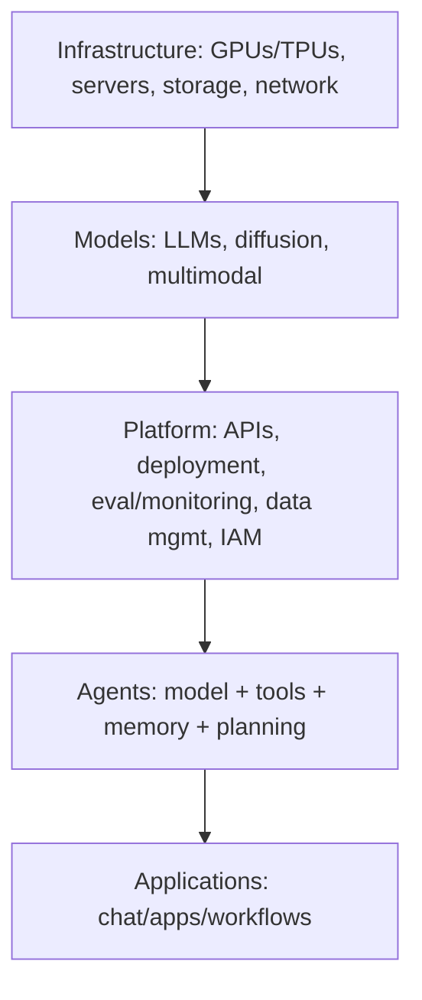
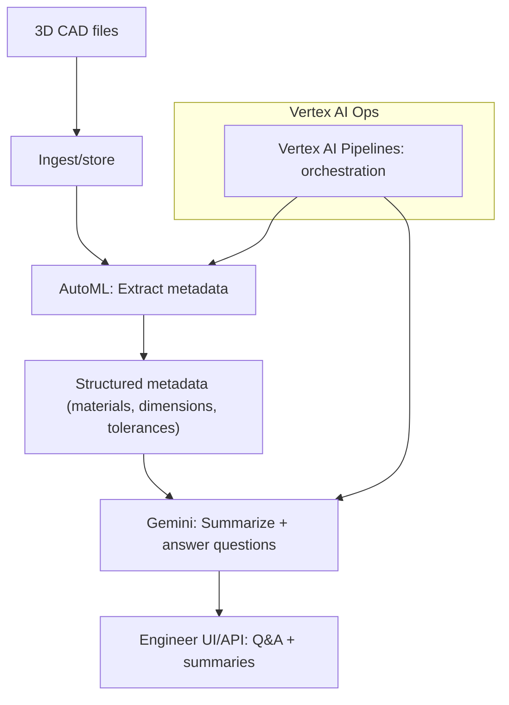
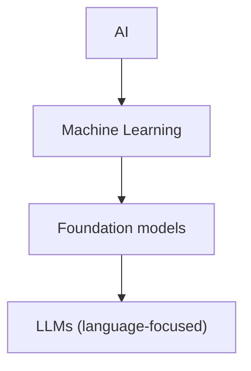
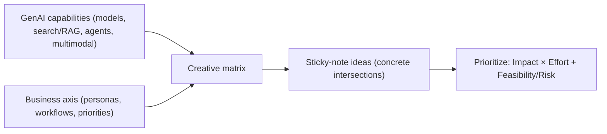
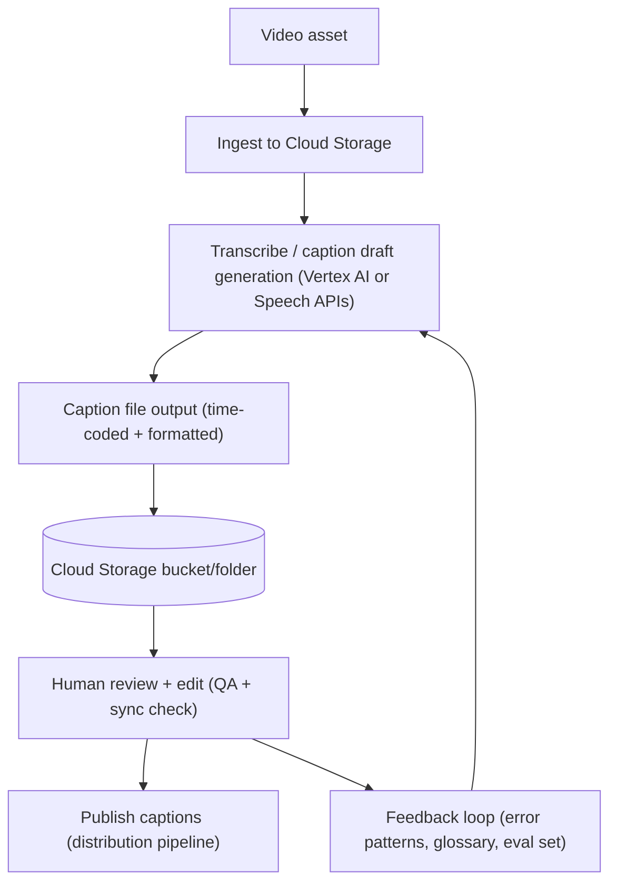
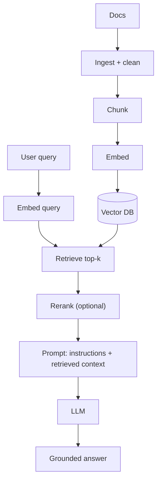

## PART VI: GENERATIVE AI

The October 2024 exam version includes Generative AI topics.

### Table of Contents

- [6.0 LLMs & Agentic Systems](#60-llms--agentic-systems-what-the-exam-is-really-testing)
- [6.0.1 Foundations of AI Engineering and LLMOps](#601-foundations-of-ai-engineering-and-llmops)
- [6.1 TRANSFORMER ARCHITECTURE](#61-transformer-architecture)
  - [6.1.1 Tokenization](#611-tokenization-how-text-becomes-numbers-for-llms)
- [6.2 Prompting & Inference Controls](#62-prompting--inference-controls-fastest-customization)
- [6.3 RAG & Grounding](#63-rag--grounding-retrieval-augmented-generation)
- [6.4 AI Agents](#64-ai-agents-beyond-chatbots)
- [6.5 Building agents on Google Cloud](#65-building-agents-on-google-cloud-service-mapping)
- [6.6 AgentOps](#66-agentops-reliability-safety-and-operating-in-production)
- [6.7 GenAI evaluation](#67-genai-evaluation-beyond-is-it-correct)
- [6.8 Inference performance & cost/latency tradeoffs](#68-inference-performance--costlatency-tradeoffs)
- [6.9 MODEL CUSTOMIZATION](#69-model-customization)
- [6.10 Skill Boost PDF reading lists](#610-skill-boost-pdf-reading-lists-useful-references)

### Executive lens (why leaders care, and what can go wrong)

This section is intentionally short and more “human”: it reflects how GenAI leaders describe the space in practice.

- **The upside**: GenAI can help teams work faster and unlock new workflows (summarization, translation/rewriting for tone, coding, multimodal creation).
- **The risk**: One of the biggest risks is **slowing down productivity**—tools can distract, add review burden, or create “busywork outputs” if the organization doesn’t set expectations and guardrails.
- **The competitive reality**: Not using these tools can be a disadvantage because you miss new ways of working and new opportunities.
- **Multimodal matters**: The better your organization can provide **high-quality inputs** across modalities (text, images, video), the better these systems tend to perform in real workflows.
- **Leadership’s lever**: Education + enablement. Teams need practical training on **capabilities and limitations** so they adopt GenAI intentionally (not blindly).

**Note:** Some productivity figures in training materials (e.g., “hours saved per year”) are often context-dependent—treat them as hypotheses to validate in your organization.

### A practical learning journey (from the “GenAI Leader” learning path)

This is **not official exam scope**; it’s included to make the guide feel less robotic and to reflect how Google’s GenAI Leader curriculum frames adoption for non-technical leaders.

- **Start simple**: GenAI “beyond the chatbot” — focus on what it can do in business settings, not the math.
- **Earn buy-in**: learn how to talk about use cases and value with both technical and non-technical teams.
- **Build shared language**: cover foundational terms (LLMs, prompts, responsible AI) so teams can collaborate.
- **Understand the landscape**: think in layers (models → apps → data/RAG → ops/governance), with different opportunities/risks at each layer.
- **Make it personal**: apply GenAI to individual workflows (where adoption often starts).
- **Make it durable**: move toward custom tools/agents that fit the organization (with guardrails, evaluation, and governance).

### Why GenAI became a huge buzzword (what changed around 2022)

AI as a field has been around for a long time and has quietly powered everyday products (feeds, recommendations, voice assistants, autocomplete). What changed with “GenAI” is that:

- **LLMs suddenly got much more capable** at understanding complex instructions and producing high-quality text (and later, multimodal outputs).
- **Compute became more accessible** for training and deployment, alongside tooling designed for AI workloads.

Together, these shifts made GenAI feel like a step-change in what teams could do “out of the box”, and created the adoption wave we’re seeing.

**What you should be able to explain (foundational concepts checklist)**

- **AI vs ML vs GenAI**: where each fits and why GenAI is different from traditional task-specific models
- **Data types + requirements**: how modality (text, image, audio, video) and data quality shape what's possible
- **Strategies to address foundation-model limitations**: prompting, grounding/RAG, tuning, evaluation, and guardrails (pick the lightest that works)
- **Responsible + secure AI in orgs**: privacy, safety, policy, and operational controls (before scaling)

### 6.0.1 Foundations of AI Engineering and LLMOps

**Introduction**:

**While learning MLOps**: We explored traditional machine learning models and systems, learning how to take them from experimentation to production using the principles of MLOps.

**Now, a new question emerges**: What happens when the "model" is no longer a custom-trained classifier, but a massive foundation model like Llama, GPT, or Claude? Are the same principles enough?

**Not quite**: Modern AI applications are increasingly powered by large language models (LLMs), which are systems that can generate text, reason over documents, call tools, write code, analyze data, and even act as autonomous agents.

**These models introduce**: An entirely new set of engineering challenges that traditional MLOps does not fully address.

**This is where**: AI engineering and LLMOps come in.

**AI engineering, and specifically LLMOps (Large Language Model Operations)**: Are the specialized practices for managing and maintaining LLMs and LLM-based applications in production, ensuring they remain reliable, accurate, secure, and cost-effective.

**LLMOps aims**: To manage language models and the applications built on them by drawing inspiration from MLOps. It applies reliable software engineering and DevOps practices to LLM-based systems, ensuring that all components work together seamlessly to deliver value.

**Note on terminology**: In this series, we might use AI engineering and LLMOps somewhat interchangeably at places, but there's a slight distinction: AI engineering is the broader discipline of building real-world AI applications, while LLMOps is the operational subset of it focused on optimizing, deploying, and maintaining LLM-powered systems in production.

**Fundamentals of AI Engineering & LLMs**:

**Large language models (LLMs) and foundation models**: In general, are reshaping the way modern AI systems are built.

**Out of this**: AI engineering has emerged as a distinct discipline, one that focuses on building practical applications powered by AI models (especially large pre-trained models).

**It evolved**: Out of traditional machine learning engineering as companies moved from training bespoke ML models to harnessing powerful foundation models developed by others.

**Foundation models**: Are massive, pre-trained AI systems that learn broad patterns from huge datasets, serving as versatile "base models" adaptable to many specific tasks. It is worth noting that LLMs are a specific type of foundation model, specialized mainly for language tasks.

**In essence**: AI engineering blends software engineering, data engineering, and ML to develop, deploy, and maintain AI-driven systems that are reliable and scalable in real-world conditions.

**At first glance**: An "AI Engineer" might sound like a rebranding of an ML engineer, and indeed, there is significant overlap, but there are important distinctions.

**AI engineering emphasizes**: Using and adapting existing models (like open-source LLMs or API models) to solve problems, whereas classical ML engineering often centers on training models from scratch on curated data.

**AI engineering also deals**: With the engineering challenges of integrating AI into products: handling data pipelines, model serving infrastructure, continuous evaluation, and iteration based on user feedback.

**The role sits**: At the intersection of software development and machine learning, requiring knowledge of both deploying software systems and understanding AI model behavior.

**The AI Application Stack**:

**AI engineering can be thought of**: In terms of a layered stack of responsibilities, much like traditional software systems. At a high level, any AI-driven application involves three layers:

- **The application itself** (user interface and logic integrating AI)
- **The model or model development layer**
- **The infrastructure layer** that supports serving and operations

**1. Application Development (Top Layer)**:

**At this layer**: Engineers build the features and interfaces that end-users interact with, powered by AI under the hood.

**With powerful models**: Readily available via libraries or APIs, much of the work here involves prompting the model effectively and supplying any additional context the model needs.

**Because the model's outputs**: Directly affect user experience, rigorous evaluation is crucial at this layer. AI engineers must also design intuitive interfaces and handle product considerations (for example, how users provide input to the LLM and how the AI responses are presented).

**This layer has seen**: Explosive growth in the last couple of years, as it's easier than ever to plug an existing model into an app or workflow.

**2. Model Development (Middle Layer)**:

**This layer is traditionally**: The domain of ML engineers and researchers. It includes choosing model architectures, training models on data, fine-tuning pre-trained models, and optimizing models for efficiency.

**When working with foundation models**: Model development typically involves adapting an existing pretrained model rather than training one from scratch. It can involve tasks like fine-tuning an LLM on domain-specific data and performing optimization (e.g., quantizing or compressing).

**Data is a central piece**: Here: preparing datasets for fine-tuning or evaluating models, which might include labeling data or filtering and augmenting existing corpora.

**Hence, even though**: Foundation models are used as a starting point, understanding how models learn (e.g., knowledge of training algorithms, loss functions, etc.) remains valuable in troubleshooting and improving them as per the desired use case.

**3. Infrastructure (Bottom Layer)**:

**At the base**: AI engineering relies on robust infrastructure to deploy and operate models.

**This includes**: The serving stack (how you host the model and expose it), managing computational resources (typically means provisioning GPUs or other accelerators), and monitoring the system's health and performance.

**It also spans**: Data storage and pipelines (for example, a vector database to store embeddings for retrieval), as well as observability tooling to track usage and detect issues like downtime or degraded output quality.

**Based on the three layers**: And whatever we've learned so far, one key point is that many fundamentals of Ops have not changed even as we transition to using LLMs. Similar to any Ops lifecycle, we still need to solve real business problems, define success and performance metrics, monitor, iterate with feedback, and optimize for performance and cost.

**However**: On top of those fundamentals, AI engineering introduces new techniques and challenges unique to working with powerful pre-trained models.

**LLM Basics**:

**Large language models (LLMs)**: Are a type of AI model designed to understand and generate human-like text. They are essentially advanced predictors: given some input text (a "prompt"), an LLM produces a continuation of that text.

**Under the hood**: Most state-of-the-art LLMs are built on the transformer architecture, a neural network design introduced in 2017 ("Attention Is All You Need") that enables scaling to very high parameter counts and effective learning from sequential data like text.

**Several characteristics and terminology related to LLMs**:

**1. Scale (the "large" in LLM)**:

**LLMs have**: A huge number of parameters (weight values in the neural network). This number can range from hundreds of billions to trillions.

**There isn't a strict threshold**: For what counts as "large", but generally, it implies models with at least several billion parameters.

**The term is relative**: And keeps evolving (each year's "large" might be "medium" a couple of years later), but it contrasts these models with earlier "small" language models (like older RNN-based models or word embedding models with millions of parameters).

**2. Training on Massive Text Corpora**:

**LLMs are trained**: In an unsupervised manner on very large text datasets, essentially everything from books, articles, websites (Common Crawl data), Wikipedia, forums, etc., up until a certain cut-off date.

**The training objective**: Is often to predict the next word in a sentence (more formally, next token, since text is tokenized into sub-word units). By learning to predict next tokens, these models learn grammar, facts, reasoning patterns, and even some world knowledge encoded in text.

**The training process**: Involves reading billions of sentences and adjusting weights to minimize prediction error. Through this, LLMs develop a statistical model of language that can be surprisingly adept at many tasks.

**3. Generative and Autoregressive**:

**Most LLMs** (like the GPT series): Are autoregressive transformers, meaning they generate text one token at a time, each time considering the previous tokens (the prompt plus what they've generated so far) to predict the next.

**This allows them**: To generate free-form text of arbitrary length. They can also be directed to produce specific formats (JSON, code, lists) via appropriate prompting. LLMs fall under the Generative AI category as well, since they create new content rather than just predicting a label or category.

**Another kind of LMs**: Is masked language models.

**A masked language model**: Predicts missing tokens anywhere in a sequence, using the context from both before and after the missing tokens. In essence, a masked language model is trained to be able to fill in the blank. A well-known example of a masked language model is bidirectional encoder representations from transformers, or BERT.

**Masked language models**: Are commonly used for non-generative tasks such as sentiment analysis. They are also useful for tasks requiring an understanding of the overall context, like code debugging, where a model needs to understand both the preceding and following code to identify errors.

**Note**: In this series, unless explicitly stated, language model (or large language model) will refer to an autoregressive model.

**4. Emergent Abilities**:

**One intriguing aspect discovered**: Is that as LMs get larger and are trained on more data, they start exhibiting emergent behavior, i.e., capabilities that smaller models did not have, seemingly appearing at a certain scale.

**For example**: The ability to do multi-step arithmetic, logical reasoning in chain-of-thought, or follow certain complex instructions often only becomes reliable in the larger models.

**These emergent abilities**: Are a major reason why LLMs took the world by storm. At a certain size and training breadth, the model is not just a mimic of text, but can perform non-trivial reasoning and problem-solving. It's still a statistical machine, but it effectively learned algorithms from data.

**5. Few-Shot and Zero-Shot Learning**:

**Before LLMs**: If you wanted a model to do something like summarization, you'd train it specifically for that. LLMs introduced the ability to do tasks zero-shot (no examples, just an instruction in plain language) or few-shot (provide a few examples in the prompt).

**For instance**: You can paste an article and say "TL;DR:" and the LLM will attempt a summary, even if it was never explicitly trained to summarize, because it has seen enough text to infer what "TL;DR" means and how summaries look.

**This was a revolutionary shift**: In how we interact with models: we don't always need a dedicated model per task; one sufficiently large model can handle myriad tasks given the right prompt.

**This is why**: Prompt engineering became important; the model already has the capability, we just have to prompt it correctly to activate that capability.

**6. Transformers and Attention**:

**For a bit of the technical underpinnings**: Transformers use a mechanism called self-attention, which allows the model to weigh the relevance of different words in the input relative to each other when producing an output.

**This means**: The model can capture long-range dependencies in language (e.g., understanding a pronoun reference that was several sentences back, or the theme of a paragraph).

**Transformers also lend themselves**: To parallel computation, which made it feasible to train extremely large models using modern computing (GPUs/TPUs). This architecture replaced older recurrent neural network approaches that couldn't scale as well.

**7. Limitations**:

**It's important to remember**: LLMs don't truly "understand" in a human sense. They predict text based on patterns, i.e., basically, they are probabilistic. This means they can be right for the wrong reasons and wrong with high confidence.

**For example**: An LLM might generate a very coherent-sounding but completely made-up answer to a factual question (hallucination). They have no inherent truth-checking mechanism; that's why providing context or integrating tools is often needed for high-stakes applications.

**It's also worth noting**: That making a model larger yields diminishing returns at some point. The jump from 100M to 10B parameters yields a bigger improvement than the jump from 10B to 50B, for example.

**So just because**: An LLM is extremely large doesn't always mean it's the best choice. There might be sweet spots in the size vs performance vs cost trade-off. Engineers often choose the smallest model that achieves the needed performance to keep latency/cost down.

**For instance**: If a 7B model can do a task with 95% success and a 70B model can do it with 97%, one might stick with 7B for production due to the huge difference in resource requirements, unless that extra 2% is mission-critical.

**In summary**: An LLM is like an extremely knowledgeable but somewhat alien being: it has read a lot and can produce answers on almost anything, often writing more fluently than a human, but it might not always be reliable or know its own gaps. It's our job to coax the best out of it with instructions and context, and curtail its weaknesses with evaluations.

**The Shift from Traditional ML Models to Foundation Model Engineering**:

**Traditionally**: Deploying an AI solution usually means developing a bespoke ML model for the task: gathering a labeled dataset, training a model, and integrating it into an application.

**This "classical" ML engineering**: Was very model-centric; you'd often start from scratch or from a small pre-trained base, forming the data → model → product flow.

**With the advent**: Of large pre-trained models (a.k.a. foundation models), the flow is shifting to product → data → model. You start with a powerful general model, quickly build a product around it, and only later gather data or adjust the model if needed.

**Key changes from traditional ML to foundation-model-driven AI engineering**:

**1. Less Model Training, More Adaptation**:

**Without foundation models**: Creating an ML application meant you needed to train your own models (or at least heavily fine-tune existing smaller models).

**For example**: Building a speech recognizer or a chatbot would require training or using a specialized model for that exact task. In the new paradigm, you begin with a model that someone else has already trained on massive data, e.g. an open-source LLM or a model from an API, and your job is to adapt it to your use case.

**Model adaptation**: May be performed through lightweight techniques such as prompt and context engineering, which require no changes to internal weights. When greater specialization is needed, fine-tuning with supplemental data can be applied.

**2. Bigger Models with Bigger Compute Demands**:

**Foundation models**: Especially LLMs, are orders of magnitude larger than the models many ML engineers used to work with. A typical scikit-learn or TensorFlow model might have been tens of thousands or millions of parameters; by contrast, foundation models have billions of parameters, and some approach trillions.

**These models consume**: Far more compute and memory. In practice, that means AI engineers must grapple with GPU/TPU clusters, high memory hardware, and optimization techniques to make inference feasible.

**There's a new urgency**: Around efficiency: techniques like model quantization (reducing precision to 8-bit or 4-bit) and model distillation (creating smaller models that approximate the large model's behavior) have become important engineering skills.

**Despite these challenges**: The flip side is positive: with big models, you often need less task-specific data than before. A foundation model already "knows" a lot from its training; sometimes you can get excellent results with zero additional training, just by prompt tweaking.

**This can dramatically shorten**: Development cycles. AI engineering thus has a faster iterative loop at the prototype stage, but potentially a more complex deployment stage due to model size (if the model is not via a vendor API).

**3. Open-Ended Outputs and New Evaluation Challenges**:

**Traditional ML models**: Often produced structured or bounded outputs, e.g. a class label from a fixed set, a number from a distribution, or a yes/no prediction. Evaluating these models was straightforward: we had metrics like accuracy, F1, mean error, etc., computed against a labeled ground truth.

**LLMs, by contrast**: Generate open-ended text (or other content). Their outputs are flexible and can solve many tasks, but that flexibility makes it harder to measure performance objectively.

**How do you automatically evaluate**: If a long AI-generated answer is "good"? Quality can be subjective or context-dependent.

**AI engineers, therefore**: Face a much bigger evaluation problem. Often need to define custom criteria for success. Human feedback becomes important (hence the rise of techniques like RLHF: Reinforcement Learning from Human Feedback to fine-tune models).

**Another evaluation challenge**: Is that these models can fail in unexpected ways, for example, they can hallucinate or produce inappropriate content if prompted maliciously.

**Ensuring reliability and safety**: Is part of the evaluation loop. AI engineers must incorporate guardrails and monitors, for example, filters for disallowed content or fallbacks.

**In short**: Foundation model engineering differs from classic ML engineering in that it's less about creating new models and more about adapting and governing powerful models.

**You will spend**: More time crafting prompts or retrieval pipelines than tweaking neural network architectures, and you'll need to evaluate not just if the model's predictions are correct, but how and why they might fail.

**To navigate this new landscape**: It helps to have a mental framework for the "knobs" you can turn when building with foundation models.

**That's where**: The 3 levers of AI engineering come in: instructions, context, and the model. These are the primary dimensions along which we can improve or adapt an AI system's behavior.

**Levers of AI Engineering**:

**When using LLMs or other foundation models**: Think of yourself as having three main levers to pull in order to get the outcome you want:

- **Instructions**: What instructions or prompts you give the model (and how you give them)?
- **Context**: What additional information or data do you provide to the model along with your prompt?
- **The Model**: Which model you choose and how you might modify its parameters or fine-tune it.

**This framework is extremely useful**: If your current AI system isn't performing to requirements, you can consider:

- Do I change how I'm prompting it?
- Do I provide more/better context?
- Do I need a different or improved model?

**Lever 1: Instructions**:

**Instructions refer to**: The input prompt or query we give to the model, essentially, how we ask our question or define the task. Prompt engineering is the art and science of crafting these instructions to guide the model's behavior.

**It's often**: The fastest and cheapest way to improve a model's output without any model retraining. By simply rephrasing or restructuring a prompt, we can get significantly different results from an LLM.

**Key points about the instructions lever**:

**A. Clarity and Specificity**:

**Ambiguous or under-specified prompts**: Yield unpredictable outputs. Being explicit about requirements and tasks helps get instant better responses.

**B. Role and Tone Instructions**:

**Modern chat-oriented LLMs**: Support a system message or similar mechanism where you can set the context or persona of the AI. This is a powerful form of instruction.

**For instance**: Telling the model "You are an expert financial advisor" at the start can make its answers sound more formal and knowledgeable in that domain. Similarly, instructing style ("respond in a friendly tone" or "provide the answer in Old English") can usually be achieved through a prompt.

**C. Examples in Prompts (Few-Shot Learning)**:

**It is the technique**: Of giving examples of the desired output within the prompt. For example, if you want an LLM to transform sentences into questions, you might show a couple of input → output pairs in the prompt and then add a new input for it to transform.

**The model will infer**: The pattern from the examples. Few-shot examples act as implicit instructions; they set a precedent or context that the model uses to shape its response. This method can massively improve performance on tasks where the model otherwise isn't sure what format or depth you need.

**D. Iterative Prompt Refinement**:

**Treat prompts**: Like code that you debug. If the output isn't what you hoped, analyze it: Did the model misunderstand your request? Did it include extraneous info?

**Then go ahead**: And refine the prompt.

**E. Limits of Prompting**:

**Prompt engineering alone**: Might not be enough if the model fundamentally lacks some knowledge or skill (no matter how you ask, it might not know the answer if it wasn't trained on relevant data, and you don't supply it).

**Also**: Prompts can become lengthy and unwieldy for very specific behavior, whereas at some point, it might be easier to just fine-tune the model (baking the desired behavior into the model weights, so you don't need huge prompts every time). We'll discuss this under the model lever.

**But as a rule of thumb**: Start with prompt tweaks before considering costly approaches like fine-tuning, you'd be surprised how much you can get out of a model with clever instruction design.

**Lever 2: Context**:

**The second lever**: Is providing context to the model, i.e., supplemental information that the model can use to formulate its response.

**Even the largest LLMs**: Have a cutoff to their training data (and inherent limitations in memorization), so they won't know about anything beyond what they were trained on.

**Context engineering, broadly**: Is about giving the model knowledge it can draw from, or setting the stage so it better understands the query.

**There are two main forms**: Of context we can provide:

- **Information relevant to the query**: Like documents, facts, or data
- **Interaction context**: Like the conversation history or previous user inputs, in a chat setting

**A. Retrieval-Augmented Generation (RAG)**:

**A powerful pattern**: For providing information context is RAG.

**In a simple retrieval-augmented setup**: When a user asks a question, the system first retrieves relevant documents or data from an external source (such as a database, a knowledge base, or the web), and then feeds those documents into the prompt along with the question.

**The LLM uses**: Both the question and the retrieved context to generate its answer. This effectively extends the model's knowledge to whatever you have in your company docs. or latest news, etc.

**For example**: If a user asks "What's the growth rate of our user base this quarter?", the system might fetch the latest analytics report and include a snippet like "According to the Q3 report: user base grew 5% month-over-month." in the prompt. The model then has the data to answer accurately, even if such specifics were never in its training data.

**B. Long Contexts and Knowledge Embedding**:

**Another aspect of context**: Is that modern models support fairly long input lengths. This means you can feed quite a lot of information in one go, but still, there's a limit to it.

**Hence**: There's an emerging practice of context management, where you decide what information to include or exclude from the prompt for optimal performance, somewhat analogous to feature engineering in classical ML. This is what the industry particularly refers to as "context engineering".

**The challenge**: Is that input length is finite and adding more text can introduce noise or increase cost, so you want to include just the relevant context.

**C. Techniques for Augmenting Context**:

**We mentioned**: Retrieval via search or vector databases as one technique. Others include structured knowledge lookups (like calling an API or database query and inserting the result), or providing tool outputs.

**In advanced AI agent scenarios**: The LLM can be designed to invoke tools and then incorporate the results into context. For instance, an LLM might be prompted to first do a web search and then given the search snippet to continue the conversation. All of these revolve around supplying information that the model didn't inherently know when the query came in.

**In summary**: Context is your lever for supplying the model with data it didn't originally have, thereby extending its capabilities and keeping it grounded. Proper use of context can often solve problems that instructions alone cannot, especially for factual or up-to-date queries.

**Lever 3: Model**:

**The third lever**: Is the model itself. This involves choices about which model you use and whether you need to modify the model's parameters through techniques like fine-tuning.

**While the first two levers**: (instructions and context) allow you to adapt a model without changing its internal weights, this lever is about actually changing or choosing the model to better fit your task.

**Important aspects of the model lever**:

**A. Model Selection**:

**Not all LLMs are equal**: They differ in size, knowledge cutoff, training data, architecture, and fine-tuning. A critical decision is which base model to start from.

**Choosing the right model**: For the job can make or break your application: it's a trade-off between performance, cost, latency, and practical constraints like deployment environment or licensing.

**Often**: A larger model will perform better, but a smaller model fine-tuned on your domain might outperform a larger general model on that specific domain, so you have to test.

**Model selection is thus a lever**: You can switch to a different model if one isn't working well (e.g. try Anthropic Claude vs GPT vs an open model and compare outputs on your task).

**B. Fine-Tuning and Training**:

**If instructions and context**: Aren't enough to reach the desired performance, you might need to fine-tune the model. Fine-tuning means continuing to train the model on additional data so it adapts to your task.

**Unlike prompt or retrieval augmentation**: Fine-tuning actually changes the model's weights. For instance, if you have a thousand example customer inquiries and high-quality representative answers, you could fine-tune an LLM on this Q&A pair set so that it better handles your customer support domain.

**Instruction fine-tuning**: Is a specific type of LLM fine-tuning.

**Fine-tuning can significantly improve**: Output quality, tone, and consistency, and can also reduce the need for very large prompts (because instructions get baked into the model's behavior). There are different types and scales of fine-tuning, which we'll be discussing in subsequent chapters.

**C. Fine-Tune vs Prompting**:

**This is a crucial decision**: Fine-tuning can make a model much better for your specific task, especially if the task has a narrow focus or a distinct style that the model hasn't seen enough.

**It can also reduce inference cost**: For example, instead of using a 130B parameter general model with a huge prompt to get the output you want, you might fine-tune a 7B model that consistently produces that output style, which will be cheaper and faster to run.

**However**: Fine-tuning requires effort: you need training data, training infrastructure, and it carries risk (the model might overfit or its behavior on other tasks might change in unwanted ways).

**As a rule of thumb**: Exhaust prompt and context approaches first, and fine-tune only if those don't meet your requirements or if you need to optimize for performance/latency.

**D. Customization and Model Improvements**:

**Beyond fine-tuning**: The model lever could include things like model compression and optimization (pruning unnecessary neurons, distilling the model into a smaller one, or other architectural tweaks).

**Also**: If you're working with open-source models, you might decide to train a smaller model from scratch for certain cases (e.g., train a 500M parameter model that's edge-deployable for a simple task, instead of using a huge model via API). These are all part of the "model" lever, essentially altering the AI's brain rather than just its inputs.

**In summary**: The 3 levers: instructions, context, and model are the core toolkit of engineering with LLMs. A principled approach is: use the highest lever only as needed.

**Start by optimizing**: Your prompts. If that's not enough, add supporting context or retrieval mechanisms to give the model what it needs. Only if those avenues still fall short (or if you have the resources and data to significantly boost performance) should you turn to altering the model via fine-tuning or other model optimization strategies.

**By structuring your problem-solving**: This way, you ensure you're not taking on more complexity than necessary.

**To conclude this section**: Understanding the three levers of AI engineering: instructions, context, and the model, gives you a structured way to diagnose and improve system performance.

**Instead of treating**: Model behavior as a black box, you now have a practical framework for intervention: start by refining how you ask, then adjust what information you provide, and only lastly consider modifying the model itself.

**This hierarchy**: Keeps your solutions simple, cost-effective, and grounded. Most problems can be solved through better prompting or smarter context management; only a minority require full model customization.

**By approaching LLM development**: Through this layered lens, it is ensured that every improvement is deliberate, efficient, and aligned with the system's real needs.

**MLOps vs. LLMOps Key Differences**:

**Although at various places**: This chapter has explored the differences between LLMOps and MLOps, the following concise bullet points provide a quick summary of the key distinctions:

- **Iteration focus**: MLOps iterates on model and data; LLMOps often iterates on prompts and retrieved context (model is fixed until fine-tune decision)
- **Data needs**: MLOps typically requires labeled data for training; LLMOps leverages unlabeled data via the foundation model and might not require much labeled data initially, focusing more on collecting feedback data
- **Deployment unit**: MLOps deployment = a model binary or inference pipelines; LLMOps deployment = a pipeline of prompt templates + model (which might be an API) + context stores
- **Monitoring metrics**: MLOps monitors numeric performance metrics; LLMOps monitors qualitative outputs, in addition to certain specialized numeric metrics and user satisfaction signals

**It is important to note**: Here, the differences certainly don't mean we abandon MLOps knowledge, rather we extend it. A lot of MLOps wisdom is still very much true and valuable in LLMOps. It's just that the content of what we monitor or how we change the system has new dimensions.

**Key Takeaways**:

- **AI engineering and LLMOps**: Are specialized practices for managing LLMs and LLM-based applications in production
- **AI engineering blends**: Software engineering, data engineering, and ML to develop, deploy, and maintain AI-driven systems
- **The AI application stack**: Consists of three layers: application development (top), model development (middle), infrastructure (bottom)
- **LLM basics**: Scale (billions/trillions of parameters), training on massive text corpora, generative/autoregressive, emergent abilities, few-shot/zero-shot learning, transformers/attention, limitations (hallucination, diminishing returns)
- **Shift from traditional ML**: Less model training/more adaptation, bigger models/bigger compute demands, open-ended outputs/new evaluation challenges
- **3 Levers of AI Engineering**: Instructions (prompt engineering), Context (RAG, context management), Model (selection, fine-tuning, customization)
- **Principled approach**: Use highest lever only as needed (start with prompts, then context, then model)
- **MLOps vs LLMOps**: Different iteration focus, data needs, deployment units, monitoring metrics

**EXAM TIP:** Questions about "AI engineering vs ML engineering" → think **AI engineering** (uses/adapts existing models, prompt/context engineering, faster iterative loop) vs **ML engineering** (trains models from scratch, model-centric, data → model → product). Questions about "LLM basics" → think **scale** (billions/trillions parameters) → **training** (massive text corpora, unsupervised, next token prediction) → **generative/autoregressive** (one token at a time, free-form text) → **emergent abilities** (capabilities appearing at scale) → **few-shot/zero-shot** (no training needed, just prompt) → **transformers/attention** (long-range dependencies, parallel computation) → **limitations** (hallucination, probabilistic, no truth-checking). Questions about "3 levers of AI engineering" → think **Instructions** (prompt engineering, clarity/specificity, role/tone, few-shot examples, iterative refinement) → **Context** (RAG, long contexts, context management, knowledge embedding, tool outputs) → **Model** (model selection, fine-tuning, customization, compression). Questions about "lever priority" → think **start with instructions** (fastest/cheapest) → **then context** (extend knowledge) → **only then model** (fine-tuning/customization, most expensive). Questions about "MLOps vs LLMOps" → think **iteration focus** (MLOps: model/data, LLMOps: prompts/context) → **data needs** (MLOps: labeled data, LLMOps: unlabeled/feedback) → **deployment unit** (MLOps: model binary, LLMOps: prompt templates + model + context stores) → **monitoring** (MLOps: numeric metrics, LLMOps: qualitative + numeric + user satisfaction).

### The business impact of GenAI (beyond the chatbot)

This framing is adapted from the GenAI Leader curriculum and is meant to sound like how leaders talk about adoption (concise, practical, not hype).

#### The 5 layers of GenAI (infrastructure → models → platform → agents → applications)

The GenAI Leader curriculum frames GenAI as an interconnected stack. A useful analogy: **infrastructure is the foundation**, **models are the engine**, **platform is the wiring/control system**, **agents are the drivers**, and **applications are the vehicles** users interact with.

- **Infrastructure**: the compute + storage foundation (servers, GPUs/TPUs, networking, storage).
- **Models**: the “brains” (foundation models like LLMs and diffusion models) trained on large datasets.
- **Platform**: the layer that operationalizes models (APIs/SDKs, data access, deployment, evaluation/monitoring, IAM/security controls).
- **Agents**: software that uses a model + tools to pursue goals (multi-step actions like research, troubleshooting, tool use).
- **GenAI-powered applications**: the user-facing experiences (e.g., Gemini app, Workspace with Gemini, NotebookLM, custom apps).



#### The infrastructure layer (what it provides, and why it matters)

The infrastructure layer is the **hardware + software foundation** that provides the compute, storage, and networking required to train, serve, and scale GenAI systems—especially large models with heavy data and compute needs.

**What “good AI infrastructure” includes**

- **High-performance compute**: accelerators like **GPUs** and **TPUs** for training and inference (and clusters to scale them).
- **High-performance storage**: capacity + fast access to very large datasets (often at TB/PB scale) so training isn’t bottlenecked on I/O.
- **Networking**: high-bandwidth, low-latency communication so distributed training/serving can coordinate efficiently.

**Quiz-style takeaway (when you’re not using a managed platform)**

If you aren’t building on a platform that abstracts infrastructure, you need to plan infrastructure requirements for **all** stages:

- **Data collection/prep**, **model training**, **model deployment**, **model refinement**, and **model monitoring**.

#### AI on the edge (when cloud isn’t the right place to run inference)

Cloud hosting is powerful, but some use cases need AI to run **closer to the data source** to avoid latency and connectivity issues.

- **Edge computing** runs models on devices/servers near the point of need (phones, embedded devices, factory equipment, vehicles).
- **Why go edge/local**: **low latency** (real-time responsiveness), **privacy/data control**, and **offline/limited connectivity** operation.

**Google edge tooling (from the course framing)**

- **Lite Runtime (LiteRT)**: a high-performance runtime for running models efficiently on-device.
- **Gemini Nano**: a compact, efficient model in the Gemini family designed for **on-device** use cases.
  - Examples mentioned: Pixel features like call/voice summarization; Android developer access via **AI Edge SDK** (where applicable).

**How Vertex AI still fits (even when deploying on edge)**

Use Vertex AI for the heavy lifting (data prep, training/tuning, evaluation, MLOps), then deploy to edge:

- **Convert** models to **LiteRT** formats for on-device performance.
- **Package & deploy** (e.g., containers/edge packaging) to target hardware.
- **Manage & monitor** edge deployments and feed learnings back into iteration.

**Quiz-style edge vs cloud intuition**

- **Edge**: real-time, safety-critical, or offline constraints (e.g., surgical device feedback, self-driving).
- **Cloud**: large-scale centralized analytics or massive concurrency (e.g., high-traffic chatbots, smart-city traffic optimization).

#### The platform layer (Vertex AI as the “glue”)

The platform layer is what makes complex ML/GenAI systems practical to build and operate. It brings the pieces together—**infrastructure, models, data access, deployment, security, and operations**—behind consistent APIs and workflows.

In Google Cloud, **Vertex AI** is the canonical example of a platform layer: a unified ML platform that streamlines building, deploying, and managing ML + GenAI solutions.

**Key platform benefits (what you get “by using a platform”)**

- **Open and flexible**: work with Google models, third-party models, and open models (where supported) without rebuilding everything.
- **Powerful infrastructure**: managed compute for training/serving, including distributed training and hyperparameter optimization.
- **Pre-trained models**: fast start via model catalogs (e.g., Model Garden-style discovery).
- **Comprehensive tooling**: training jobs, evaluation, deployment, monitoring, logging/metrics integration.
- **Customization**: prompting + grounding/RAG + tuning/fine-tuning options depending on the problem.
- **Easy integration**: APIs/SDKs to plug models into applications and workflows.

**MLOps capabilities (why platform matters in production)**

- Orchestrate workflows (**pipelines**), track experiments and iterations, manage ML metadata, and monitor/evaluate model quality over time.
- **Feature store** (where used): share/serve/reuse features to keep training-serving consistent.
- Common “platform layer” building blocks you’ll see referenced:
  - **Model registry**: manage model versions, track changes, and organize models across their lifecycle.
  - **Model evaluation**: compare model performance to pick the best model for the use case.
  - **Workflow orchestration**: automate end-to-end workflows with **Vertex AI Pipelines**.
  - **Model monitoring**: detect performance degradation, input skew/drift, and trigger updates/retraining.

#### The model layer (what it is + how Vertex AI helps)

At the heart of any ML/AI system is the **model**: a sophisticated mathematical structure trained on data so it can learn patterns and produce outputs (generate, classify, predict, summarize, etc.). In the 5-layer view, models are the “brains” that agents and applications rely on.

**Vertex AI as a model hub (Model Garden)**

In many cases you don’t need to train a model from scratch. **Vertex AI Model Garden** helps you **discover, customize, and deploy** existing models, including:

- **First-party foundation models** (Google)
- **First-party pre-trained APIs** (task-focused APIs)
- **Open models** (open/open‑weight options)
- **Third-party models** (partners)

**When to use Model Garden vs build your own**

- Choose **Model Garden** when you want a readily available, high-performing model (optionally tuned) for common tasks (e.g., translation, summarization, assistants).
- Choose **fully custom training** when you need deep control over architecture/training (research-grade needs, novel modeling approaches, special constraints).

**Build models with Vertex AI (custom + AutoML options)**

- **Custom training**: train at scale using frameworks like **PyTorch, TensorFlow, scikit-learn, XGBoost**.
- **AutoML**: build models with less manual ML engineering (useful when you want strong baselines quickly).

**AutoML objectives (high-yield table)**

| Data type    | Supported objectives                                |
| ------------ | --------------------------------------------------- |
| Image data   | Classification, object detection                    |
| Video data   | Action recognition, classification, object tracking |
| Tabular data | Classification/regression, forecasting              |

**Quiz-style intuition**

- “Need a translation model that’s ready and solid” → **Vertex AI Model Garden**
- “Researcher needs full control over architecture/training (e.g., protein folding)” → **Vertex AI custom model**

#### Case study (GenAI Leader): Generative AI for manufacturing CAD insights (Cymbal Aerospace)

This pattern shows how Vertex AI can combine **specialized extraction** with **LLM summarization** to turn complex artifacts into decision-ready insights.

**Problem**

- Engineers had a large library of **3D CAD models**, but extracting details (materials, dimensions, tolerances, stress points) was manual, slow, and error-prone.

**Two-layer approach on Vertex AI**

1. **AutoML (specialized model)**: train a model to extract key **structured metadata** from CAD files.
2. **Gemini (LLM)**: turn extracted metadata into **natural-language summaries** and Q&A responses.
3. **MLOps glue**: orchestrate the workflow using **Vertex AI Pipelines** (and deploy/scale via Vertex AI).



**Reported outcomes (treat as directional until you validate)**

- Faster product development cycles and design reviews; fewer planning bottlenecks.

**Design takeaway**

- Use a **specialist model** to reliably extract structure from domain artifacts, then use an **LLM** to translate that structure into human-readable summaries and answers.

#### Agents and GenAI-powered applications (how they relate)

Think of a **GenAI-powered application** as the user-facing product (UI + workflows + policies). An **agent** is the “intelligent actor” inside that product that can reason, use tools, and take actions to achieve a goal.

**What agents can do (common capabilities)**

- **Understand and respond to natural language**
- **Automate complex tasks** (multi-step plans + tool use, not just one-shot generation)
- **Personalize** responses and actions based on context (user profile, history, preferences, enterprise data)

**Agent inside an application**

- The **application** defines the user experience, constraints, and the business goal.
- The **agent** executes tasks within that framework using available tools (APIs, search, databases, actions).

**Multi-agent systems (when one agent isn’t enough)**

Many real apps use multiple specialized agents (e.g., a router/supervisor + domain specialists). Examples:

- **Travel booking app**: itinerary planner + pricing/search agent + policy/constraints agent
- **Customer support app**: triage agent + knowledge/RAG agent + escalation agent
- **Personalized learning app**: tutor agent + quiz generator + progress tracking agent

#### How agents work (conversational vs workflow agents + reasoning loop + tools)

Most agents you’ll see in practice fall into two buckets:

- **Conversational agents**: designed for dialogue (Q&A, help, troubleshooting) with optional tool use.
  - Typical loop: user message → interpret intent → (optional) tool call → generate response → deliver response.
- **Workflow agents**: designed to complete multi-step business processes (often triggered by forms/files/schedules).
  - Typical loop: trigger/task definition → interpret requirements → execute a sequence of tool/API actions → produce an output artifact → deliver/update systems.

**Agents are “beyond just models” because they add:**

- a **reasoning loop** (iterate until done), and
- **tools** (ways to read/write the real world: data stores, APIs, software systems, sometimes robots).

**Reasoning loop (high-level)**

This is the agent’s continuous cycle:

1. **Observe**: gather information about the task/environment.
2. **Interpret**: assess the situation and constraints.
3. **Plan**: decide next steps (often multi-step).
4. **Act**: call tools / take actions.

Then repeat until a goal or stopping condition is reached.

**Tool examples (what agents can do with tools)**

- Update inventory / reorder supplies
- Check calendars and schedule meetings
- Query databases / run analytics
- File transfers / notifications / ticket creation
- Interact with sensors/actuators in robotics

**Common agent categories (use cases)**

- Customer service agents, employee productivity agents, creative agents, code agents, data agents, security agents.

#### GenAI is a technology layer, not “one app”

- A **chatbot app** (like the Gemini app) is one product surface.
- The **model** (Gemini) is a building block engineers can embed across many applications and workflows.
- In practice, you’ll see GenAI embedded into tools like:
  - **Workplace apps** (email/docs/meetings/presentations)
  - **Analytics** (helping summarize insights, generate explanations)
  - **Developer workflows** (code generation, test generation, debugging)
  - **Cloud operations** (automation, troubleshooting, suggestions)

#### Quick definitions (from GenAI Leader quiz-style questions)

- **Artificial Intelligence (AI)**: the broad field of building machines that can do tasks that normally require human intelligence (learning, problem-solving, decision-making).
- **Machine Learning (ML)**: a subset of AI where systems learn patterns from data to perform specific tasks.
  - Intuition: the “learning” ends up as a **model** — think of it as **math** (often many equations/parameters). You put inputs in, you get outputs out.
- **Generative AI**: a type of AI that can **create new content** (text, images, audio/music, code), not just analyze existing data.
  - Simple analogy: traditional ML can learn to **judge** whether something matches a category (e.g., “spam or not spam”); GenAI learns patterns well enough to **create** a new version (like learning from many paintings, then making a new painting).
- **Gemini**:
  - a **generative AI model (family of models)** developed by Google
  - also appears as an **assistant/app experience** in products (e.g., “Gemini in Gmail”), but the _model_ ≠ the _app_
- **Multimodal GenAI application**: a system that processes/combines **multiple input modalities** (e.g., text + image + audio/video) to solve one task.
  - Example: analyzing customer sentiment using **video testimonials** (visual/audio) + **survey text** (text)

#### Deep learning, generative AI, and foundation models (how they relate)

- **Deep learning (DL)**: a subset of ML based on **neural networks**, useful when patterns are complex (language, vision, audio, multimodal).
- **Generative AI**: uses deep learning to **create** new content (text, images, audio, video, code).
- **Foundation models**: large deep-learning models trained on massive datasets (often with lots of unlabeled data) so they can be adapted to many tasks.

**Semi-supervised learning (common in practice)**

Neural networks can learn from a blend of:

- a **small amount of labeled data** (to anchor the task), and
- a **large amount of unlabeled data** (to learn general patterns),

which can improve generalization when labels are expensive.

#### What is data (and why it matters so much)

Data is **information** used as inputs to help models learn patterns and make outputs. It can show up in many forms:

- **Numbers** (measurements, prices, sensor readings)
- **Dates/timestamps** (seasonality, trends, time-to-event)
- **Text** (descriptions, emails, tickets, transcripts)
- **Images / audio / video** (visual/audio signals, multimodal workflows)

**Intuition (from the GenAI Leader course):** ML models make predictions based on _existing data_ the way humans make educated guesses based on _experience_—but the model does it with probability, not gut feel.

**Choosing the right data is crucial**

- Data must be **relevant** to the task. Example: traffic patterns in London are unlikely to help predict crop yields in Kansas.
- The model can’t learn what the data doesn’t contain. If you provide the wrong signals, you’ll get confidently wrong outputs.

**Data quality: five practical dimensions**

- **Accuracy**: values are correct (mislabeled data teaches the wrong patterns).
- **Completeness**: enough data volume _and_ coverage (size + representation).
- **Representativeness**: inclusive coverage to avoid skew/bias in outcomes.
- **Consistency**: formats/labels are stable and standardized across sources/time.
- **Relevance**: the data actually maps to the decision you’re trying to make.

**Data accessibility (what blocks good models in real orgs)**

- **Availability**: can the right people/systems access the data when needed?
- **Cost**: is it affordable to store, move, and query at the required cadence?
- **Format**: is it usable (schemas, file types, quality checks, documentation)?

#### Data types (structured vs unstructured)

Business data is often framed as **structured** vs **unstructured** (and in practice, you’ll also see **semi-structured**).

- **Structured data**: organized into rows/columns with a consistent schema (tables).
  - Examples: CSV sales table with `Date`, `Product ID`, `Quantity Sold`, `Price`; medical record fields like DOB, address, vaccination history.
- **Unstructured data**: no predefined schema; messy/complex; requires more sophisticated processing.
  - Examples: free-form text (reviews, emails, PDFs), images, audio recordings, video.
- **Semi-structured data**: has some structure but not a fixed relational schema.
  - Examples: JSON event logs, nested records, “documents” with optional fields.

**Quiz-style intuition (structured or unstructured?)**

- Product review text (“This phone is great…”) → **Unstructured**
- Sales data in a CSV with columns → **Structured**
- Audio recording of a customer service call → **Unstructured**
- Digital image of a cat → **Unstructured**
- Medical record fields (DOB/address/vaccines) → **Structured**

#### Types of learning (and the data each needs)

How you use data depends on the learning approach. Three common approaches are **supervised**, **unsupervised**, and **reinforcement learning**.

**Labeled vs unlabeled**

- **Labeled data**: examples are tagged with the “right answer” (target), like emails labeled **spam/not spam**.
- **Unlabeled data**: raw data without tags (photos, audio streams, logs). The algorithm must find structure/patterns on its own.

**Supervised vs unsupervised vs reinforcement learning**

- **Supervised learning (labeled)**: learn a mapping from inputs → target.
  - Examples: spam classification, demand prediction, churn prediction.
- **Unsupervised learning (unlabeled)**: discover structure without targets.
  - Examples: topic modeling in documents, clustering, anomaly detection.
- **Reinforcement learning (interaction + feedback)**: learn by trying actions and receiving rewards/penalties (trial and error).
  - Intuition: like training a pet; reward good behavior, discourage bad behavior.
  - Examples: game-playing agents, robotics/control, recommendation/ranking optimization loops.

**Google Cloud examples (from the course)**

- **Predictive maintenance (supervised)**: train on labeled sensor history (temperature/pressure/vibration) to predict failures (Vertex AI).
- **Anomaly detection (unsupervised)**: find unusual transactions that deviate from historical patterns (BigQuery ML).
- **Recommendations (reinforcement learning)**: optimize recommendations over time to maximize engagement/sales (Vertex AI).

#### Turning data into learning on Google Cloud (end-to-end lifecycle)

For enterprise ML/GenAI work, the hard part is often the **journey from scattered data to reliable predictions**. A useful mental model is a simple lifecycle:

- **Gather (ingest)**: collect raw data based on the outcome you want.
  - Typical tools: **Pub/Sub** (streaming ingestion), **Cloud Storage** (unstructured storage), **Cloud SQL / Cloud Spanner** (structured operational data).
- **Prepare**: clean, transform, label, and make data discoverable.
  - Typical tools: **BigQuery** (analysis + transformation), **Data Catalog** (dataset discovery/governance).
- **Train**: create and evaluate models in a managed environment with the right compute.
  - Typical tools: **Vertex AI training** (prebuilt containers, custom training jobs, evaluation).
- **Deploy & predict**: make the model available for batch/online predictions and scale to demand.
  - Typical tools: **Vertex AI** deployment/serving (managed scaling).
- **Manage**: operate the model over time (versions, metrics, drift, automation).
  - Typical tools: **model versioning/registry**, monitoring & drift checks, **Vertex AI Pipelines** (automation), feature management (e.g., Feature Store where used).

**Security note (from the course framing):** in enterprise settings, ensure data access is controlled end-to-end with **IAM** (least privilege) across ingestion, storage, training, and serving.

#### The four primary ways businesses use GenAI

- **Create**: generate new content (text, images, audio, code).
- **Summarize**: condense large information into decision-ready summaries.
- **Discover**: find the right information at the right time (search + Q&A over content).
- **Automate**: automate tasks that used to require manual human work (with appropriate review/guardrails).

#### Practical examples you’ll recognize (Google ecosystem examples)

- **Create**
  - Draft emails or content (tone/translation help)
  - Generate images for slides (e.g., Imagen/Gemini-integrated creation workflows)
  - Generate code/unit tests (e.g., Gemini Code Assist–style workflows)
- **Summarize**
  - Summarize long docs/reports and extract key takeaways
  - Summarize meetings into action items
  - Summarize customer feedback for sentiment and themes
- **Discover**
  - Search for a file and ask questions about its contents (Drive-style “ask about this doc”)
  - Enterprise Q&A over internal knowledge (search + reasoning + enterprise data)
- **Automate**
  - Convert content formats (speech ↔ text, translation)
  - Automate documentation and information extraction (code docs, contract review/extraction)
  - Automate ticket creation/notifications from customer feedback signals

**Case study pattern (Imagen for e-commerce content at scale — PUMA example)**

- **Problem**: creating high-quality product imagery for many regions/variants is slow and expensive (photoshoots, localization).
- **Approach**: use **Imagen** to generate or customize **backgrounds/settings** around an existing product photo library via prompts (and then iterate quickly).
- **Localization**: adjust prompts to reflect regional context (e.g., landmarks) to make content feel locally relevant.
- **Outcome**: reported improvements like higher engagement (e.g., a “click-through rate” lift in a regional market). Treat such numbers as directional until validated in your own setup and measurement.

#### Nano Banana Pro: Efficient Image Generation for Agent Workflows

**Nano Banana Pro** is Google's efficient text-to-image model, part of the Imagen family, optimized for **speed and cost-effectiveness**. Launched November 2025.

| Aspect           | Details                                                           |
| ---------------- | ----------------------------------------------------------------- |
| **Model type**   | Text-to-image diffusion model (efficient variant of Imagen)       |
| **Optimization** | Speed and cost (faster inference, lower cost per image)           |
| **Use cases**    | Agent workflows, browser automation, rapid iteration, prototyping |
| **Integration**  | Available in Google Antigravity, Vertex AI Model Garden           |

**When to choose Nano Banana Pro vs Imagen**:

| Scenario                                                   | Model Choice    | Rationale                                  |
| ---------------------------------------------------------- | --------------- | ------------------------------------------ |
| **Agent workflows** (browser automation, iterative design) | Nano Banana Pro | Fast response times needed for agent loops |
| **High-quality marketing images**                          | Imagen          | Maximum quality/fidelity priority          |
| **Rapid prototyping**                                      | Nano Banana Pro | Lower cost enables more iterations         |
| **Production e-commerce** (PUMA-style)                     | Imagen          | Quality matters more than speed            |
| **Cost-sensitive applications**                            | Nano Banana Pro | Lower per-image cost                       |

**Key characteristics**:

- **Faster inference**: Optimized for low latency, suitable for real-time agent interactions
- **Cost-effective**: Lower cost per image generation compared to full Imagen
- **Agent-friendly**: Designed for integration into agent workflows (e.g., Google Antigravity's browser-in-the-loop agents)
- **Iterative workflows**: Enables rapid iteration without prohibitive costs

**EXAM TIP:** When questions mention "agent workflows", "rapid iteration", "cost-effective image generation", or "browser automation" → consider **Nano Banana Pro** over Imagen.

#### Multimodal GenAI (why it changes workflows)

Multimodal models can work across **text, images, video, audio, and PDFs**—either separately or combined in one task. This is why “GenAI” shows up in places like marketing content, document understanding, analytics dashboards, and support operations (not just chat).

#### “Beyond chat”: common enterprise use cases (business → system mapping)

- **Uncover patterns and insights in data**
  - Forecasting demand and optimizing inventory (Vertex AI forecasting / ML pipelines)
  - Personalized recommendations to increase engagement and reduce churn (search/retrieval + ranking; Vertex AI Search / retrieval patterns)
  - Scientific discovery workflows (fine-tuning and evaluation on domain data)
- **Search and question-answering over enterprise resources**
  - “Find a file and ask questions about it” (enterprise search + content Q&A patterns)
  - “Unlock enterprise expertise” (agents that combine reasoning + search + enterprise data)
- **Monitor real-time events**
  - Anomaly detection for fraud/ops signals (streaming ingestion + detection + alerting)

#### Vertex AI and multimodal GenAI (Vertex AI in action)

From the GenAI Leader curriculum perspective:

- **Vertex AI** is Google Cloud’s unified ML platform to build/train/deploy models and AI applications.
- For **multimodal GenAI** (text, code, images, speech), Vertex AI provides access to models through **Model Garden**, plus managed building blocks for tuning and deployment.
- In “search + GenAI assistant” use cases, a common pairing is:
  - **Gemini** (understand the request, reason, converse, and generate responses)
  - **Vertex AI Search** (retrieve the most relevant answers from a large multimodal knowledge base)

**Case study pattern (automotive virtual assistant)**

- **User problem**: a driver sees a dashboard warning light and needs help now (not after hunting through a manual).
- **Multimodal input**: the user can describe the issue in text and even show an image/video (e.g., phone camera).
- **Knowledge base** (examples): owner’s manuals, FAQs, help-center articles, videos, step-by-step guides.
- **Flow**:
  - Gemini interprets the question and can ask clarifying questions
  - Vertex AI Search retrieves the best matching guidance from the knowledge base
  - The assistant provides step-by-step troubleshooting (not just a static answer)
- **Business outcomes** (typical): reduced support costs (fewer calls), faster resolution, improved accessibility and customer satisfaction.

### Foundations of GenAI: foundation models (and where LLMs fit)

This framing is adapted from the GenAI Leader curriculum and is useful for exam-style “definition” questions.

- **AI (artificial intelligence)**: computers doing tasks that normally require human intelligence (understanding language, making decisions).
- **ML (machine learning)**: a major way we build AI systems—models learn patterns from data to solve tasks.
- **Traditional ML models**: often trained for one specific task on a narrower dataset (e.g., a spam classifier).
- **Foundation models**: large, general-purpose models trained on massive, diverse datasets so they can be adapted to many downstream tasks.
- **LLMs**: a specialized type of foundation model focused on language. (So: LLM ⊂ foundation model.)

#### Key features of foundation models (why they’re different)

- **Trained on diverse data**: learn general patterns/relationships that transfer across tasks.
- **Flexible**: one model can support many use cases.
- **Adaptable**: can be specialized for domains/use cases via additional targeted training (tuning/fine-tuning).

#### Examples (Google model families)

- **Gemini**: multimodal foundation model trained across text, images, code, audio, video, etc.
- **Imagen**: image generation/editing foundation model trained primarily on images + text descriptions.
  - **Nano Banana Pro**: efficient variant of Imagen optimized for speed and cost; ideal for agent workflows requiring rapid image generation (e.g., browser automation, iterative design).
- **Chirp**: audio/speech foundation model trained on multilingual audio (speech recognition / transcription / translation use cases).
- **Diffusion models**: a common foundation-model family for media generation (especially images, and sometimes audio/video) that generates outputs by **iteratively denoising** (refining noise into structure).

#### Prompting foundation models (how you “use” GenAI)

Foundation models, like other AI models, take **inputs** (“prompts”) and produce **outputs**. The difference is flexibility: many foundation models (especially multimodal ones) can accept a broader set of inputs than traditional models.

| Input (prompt)                 | Output (typical)             |
| ------------------------------ | ---------------------------- |
| Question                       | Answer                       |
| Text request for an image      | Generated image              |
| “Summarize this file/document” | Summary                      |
| Buggy code snippet             | Corrected code / explanation |

**EXAM TIP:** Prompting (prompt engineering / prompt design) is a practical skill: better prompts often beat “more training” for many business use cases.



### Building a successful GenAI strategy (top-down + bottom-up)

This framing is adapted from the GenAI Leader curriculum and is written for “how should an org do this responsibly?” questions.

#### The core idea: don’t start with the newest tech

- Start with **business priorities and high-value workflows**.
- Then decide where GenAI can help (and where it introduces unacceptable risk).

#### A two-fold approach that works in real organizations

- **Top-down**: executives define a clear vision, pick strategic priorities, allocate resources, and set guardrails (safety/responsible AI).
- **Bottom-up**: teams closest to the work run small experiments, surface ideas, and share what actually improves daily workflows.

**Why both matter**

- Top-down without bottom-up misses practical opportunities.
- Bottom-up without top-down creates scattered experiments with inconsistent risk controls and no path to scale.

#### Roles (who does what)

- **Executives / senior leaders**
  - Provide sponsorship, budget, and a clear “why now”
  - Align GenAI initiatives to business goals and risk appetite
- **Mid-level managers + individual contributors**
  - Identify feasible, high-impact use cases in real workflows
  - Encourage safe experimentation and gather feedback
  - Help integrate tools into existing processes (change management)

#### A lightweight strategy checklist (multi-directional)

Use these lenses for both top-down and bottom-up efforts:

- **Strategic focus**: which workflows matter most and why?
- **Exploration**: where can teams prototype safely and quickly?
- **Responsible AI**: policies, privacy, and safety guardrails (before scaling)
- **Resourcing**: time, people, tooling, and review capacity
- **Impact**: how you’ll measure success (quality, time saved, cost, risk reduction)
- **Continuous improvement**: evaluation + monitoring + iteration loops

#### Brainstorming use cases: the “creative matrix” method (practical)

When teams struggle to generate _and_ prioritize use cases, a simple facilitation technique is a **creative matrix**:

- **Axis 1 (GenAI capabilities)**: pick the tools/capabilities you can realistically use (e.g., Workspace with Gemini, Vertex AI Search, conversational agents, model tuning, multimodal).
- **Axis 2 (your business)**: pick what matters internally (personas, workflows, strategic goals).
- **Fill the grid**: write “sticky note” ideas for each intersection (small, concrete use cases).



**Prioritization step (keep it lightweight)**

- **Impact**: will this materially improve a priority workflow or KPI?
- **Effort**: can we ship a safe pilot quickly (days/weeks), or is it months?
- **Feasibility**: do we have the data, access, and integration path?
- **Responsible AI risk**: privacy/safety/compliance exposure; review burden.

**Example matrix prompts (to generate sticky notes fast)**

- “Enhance customer experience” × “Vertex AI Search” → image-based search to find similar products.
- “Increase efficiency” × “Agents/automation” → auto-triage support tickets and draft responses with citations.
- “Drive innovation” × “Model tuning” → adapt a model for a niche domain (with eval gates).
- “Employee productivity” × “Workspace with Gemini” → meeting notes + action items + follow-up drafts.

#### Choosing a model (practical selection checklist)

When picking a model for a GenAI use case, start with the **requirements** (not the hype). Common factors:

- **Modality**: what inputs/outputs do you need (text, image, audio, video, multimodal)?
- **Context window**: will the model need long documents, many retrieved chunks, or multi-turn history?
- **Security**: data handling constraints, access controls, isolation needs, policy requirements.
- **Availability and reliability**: production uptime, behavior under load, resilience/DR expectations.
- **Cost**: per-request cost + overall system cost (retrieval, storage, logging, evals, monitoring).
- **Performance**: quality/latency tradeoffs for your task (accuracy, hallucination rate, latency).
- **Fine-tuning and customization**: do you need prompting/RAG only, or tuning for a domain/style?
- **Ease of integration**: APIs/SDKs, tool calling/structured output, observability hooks, deployment surface.

#### GenAI project resources: people, cost, and time (leader checklist)

Before building, sanity-check **who**, **how much**, and **how long**.

**People (roles across the stack)**

- **Business leaders / business users**: define outcomes, constraints, and success metrics; often start with pre-built GenAI apps.
- **Developers**: integrate models into products (APIs, data sources, workflows, UI) and ship reliable experiences.
- **AI practitioners (ML/GenAI engineers, data scientists)**: develop/tune models, run evals, handle safety/security, and operationalize with MLOps.

**Cost (what you pay for)**

GenAI projects typically pay for three activities:

- **Training** (if you train/tune): compute time + storage for data/artifacts.
- **Deploying**: running endpoints/serving infrastructure + supporting services.
- **Using models (inference)**: often **usage-based**, commonly measured in **tokens/characters**.

Common cost drivers:

- **Model size/capability** (bigger often costs more)
- **Context window + token usage** (longer prompts/outputs cost more)
- **Traffic volume** and latency targets

**Time (time-to-value ladder)**

- **Use a pre-built GenAI application**: seconds/minutes to try and adopt.
- **Use pre-built agents / AI Applications-style tooling**: often weeks (faster than full custom code).
- **Custom app with grounding/RAG**: weeks-to-months (often best for “enterprise truth”).
- **Tuning/fine-tuning**: weeks-to-months (needs data + evals).
- **Brand-new model**: months (rarely necessary).

#### GenAI solution needs (scope and feasibility checklist)

Before you commit to a build path, sanity-check the solution across:

- **Scale**: individual, small team, enterprise, or millions of customers?
  - Small scale: pre-built apps can go very far.
  - Large scale: prioritize scalability + security; factor infra/storage + latency.
- **Customization**: start with existing models/APIs; add grounding or tuning only if needed.
  - Ask: what is genuinely unique (domain, task complexity, UX)?
  - If the domain is specialized (law/medicine), consider domain-specific data and/or tuning.
- **User interaction (UI/UX)**: how do users engage (chat, embedded workflow, task-oriented tool)?
  - Design for the right level of guidance and feedback.
- **Privacy, data security, compliance**: sensitivity, encryption/access controls, and regulations (e.g., GDPR/HIPAA).
- **Other constraints**:
  - **Latency**: real-time vs tolerant of delay.
  - **Connectivity**: always online vs offline/edge scenarios.
  - **Accuracy tolerances**: define acceptable error rates.
  - **Explainability**: do you need to understand “why” (regulated/high-stakes)?

**Quiz-style intuition**

- “Need realistic text-to-image for marketing, short on time” → **use a pre-trained API** first (fastest path).

#### Choosing and maintaining your GenAI solution (comparison + maintenance)

Once you’ve assessed needs and resources, treat GenAI as an ongoing product: **choose deliberately**, then **maintain continuously**.

**Comparing companies and models (how to choose)**

- **Evaluate capabilities**: use benchmarks and real task evaluations (your own eval set beats generic leaderboards).
- **Compare pricing structures**: estimate cost under your expected traffic (often token-based for LLM APIs).
- **Factor in additional costs**: storage, retrieval/vector DB, rerankers, tool/API calls, logging/monitoring, and tuning jobs.
- **Read the fine print**: usage limits, data retention/privacy policies, and terms of service.

**Useful resources**

- Provider pricing pages
- Research papers/benchmarks
- Community discussions (for operational/pricing gotchas)

**Maintenance (what you’ll keep doing)**

- **Model monitoring and retraining**: watch quality and drift; retrain/tune when performance degrades or requirements change.
- **Data updates**: refresh knowledge sources, update corpora, re-embed when embedding models change, and maintain schemas/labels.
- **Software updates and bug fixes**: prompts/routers/tool schemas evolve; keep dependencies current.
- **Hardware and infrastructure**: capacity planning (cloud or edge), scaling, cost controls.
- **Security and compliance**: patch vulnerabilities, review IAM permissions, audit logs, and update policies (SAIF/responsible AI).

**Google Cloud’s ML models (via Vertex AI)**

Vertex AI can help you discover/deploy/customize models, including Google models, third-party proprietary models, and open models. In Google's suite:

- **Gemini**: **multimodal** model family (text + images + audio + video) for complex understanding, conversational AI, and content generation.
- **Gemma**: **lightweight, open** model family (built on research/tech behind Gemini) that can be a good fit for local deployments and specialized apps.
- **Imagen**: **text-to-image diffusion** model for high-quality image generation/editing from prompts.
- **Nano Banana Pro**: **efficient text-to-image** model optimized for speed and cost-effectiveness. Part of the Imagen family, designed for rapid iteration and agent workflows (e.g., browser-in-the-loop automation in Google Antigravity).
- **Veo**: **video generation** model (from text prompts and/or still images) for generating video content.

#### Keeping humans at the forefront (augmentation vs automation)

As you adopt GenAI, the “best” use cases usually **augment human strategic work** while **automating repetitive work**.

**Use GenAI for augmentation (enhance strategic thinking)**

- **Critical thinking & problem-solving**: GenAI can surface information; humans interpret it and make decisions.
- **Creativity & innovation**: GenAI expands options; humans choose direction and take accountability.
- **Relationship building & collaboration**: GenAI can assist communication; humans build trust and navigate nuance.
- **Strategic planning & vision**: GenAI can help with analysis/forecasting; leaders set goals and long-term direction.

**Use GenAI for automation (offload the “busy work”)**

- **Repetitive, rule-based tasks**: data entry, basic retrieval, formatting, boilerplate code.
- **Time-consuming tasks**: research, summarization, first-draft creation, initial analysis.

**Humans-in-the-loop (needed in both cases)**

- **Data selection & preparation**: ensure high-quality, relevant, representative inputs; control sensitive data.
- **Prompt design & refinement**: iterate prompts as “prompt-as-code” to improve reliability.
- **Output evaluation & refinement**: review/edit for correctness, compliance, and brand alignment.
- **Continuous monitoring & feedback**: measure quality/drift/safety issues and improve over time.

#### Case study (GenAI Leader): AI-assisted captioning with humans-in-the-loop (Warner Bros.)

This example is a clean “augmentation, not replacement” pattern: **AI generates a first-pass caption file**, then **humans edit and verify** for correctness and sync.

**What changes operationally**

- The model produces a **time-coded, formatted caption file** that lands in a folder and is ready to edit.
- Human captioners shift from “type everything” to **review + correction + sync validation**.
- Reported impact (as shared in the course): **~50% cost reduction** and **~80% reduction in manual captioning time**.

**Why this is a good GenAI/ML use case**

- Captioning is **time-consuming** and benefits from a strong “draft → review” loop.
- Quality requirements are high; the human review step acts as a quality gate.
- You can iterate on model choice and approach; Vertex AI is positioned as **model-choice flexible** (platform not locked to one model).

**Reference architecture on Google Cloud (one reasonable implementation)**



**EXAM TIP:** When an answer mentions “reduce human time but keep quality high” → pick designs that output **editable artifacts** (drafts, structured files) and include a **human-in-the-loop quality gate**, rather than “fully automate with no review”.

### 6.0 LLMs & Agentic Systems (what the exam is really testing)

- **LLM**: A language model (often transformer-based) trained to predict the next token; can be instruction-tuned to follow tasks.
- **GenAI app**: Your product + prompt(s) + model + data + guardrails + evaluation + monitoring.
- **Agent**: An LLM-driven system that can **plan**, **call tools**, **retrieve/ground on data**, and **take actions** (often multi-step, non-deterministic).

**EXAM TIP:** When the question says “business team needs actionable outcomes” or “must use enterprise docs / real-time info” → think **system design** (integration + grounding + evaluation), not just “train a better model”.

### 6.1 TRANSFORMER ARCHITECTURE

#### Self-Attention

The core mechanism that allows transformers to weigh relationships between all positions in a sequence.

- **Formula**: \( \mathrm{Attention}(Q,K,V) = \mathrm{softmax}(QK^\top/\sqrt{d_k}) \times V \)

#### Architecture Variants

| Type            | Attention Direction    | Examples                    | Best For                               |
| --------------- | ---------------------- | --------------------------- | -------------------------------------- |
| Encoder-Only    | Bidirectional          | BERT, RoBERTa               | Understanding: classification, NER, QA |
| Decoder-Only    | Causal (left-to-right) | GPT, Gemini, LLaMA, LLaMA 4 | Generation: completion, chat           |
| Encoder-Decoder | Both + cross-attention | T5, BART                    | Seq2seq: translation, summarization    |

#### Mixture-of-Experts (MoE) Architecture

**Why MoE for LLMs**: As models scale to hundreds of billions of parameters, traditional Transformers become computationally expensive. MoE allows models to scale capacity without proportional compute increases.

**Core idea**: Instead of activating all parameters for every token, MoE activates only a **subset of expert subnetworks** per token. This enables:

- **Larger models** (hundreds of billions of parameters)
- **Efficient inference** (only fraction of parameters used per token)
- **Cost-effective scaling** (GPT-4-level performance at ~half the inference cost)

**How MoE works**:

1. **Router (gate)**: A lightweight neural network that scores each expert based on the token's representation.

   - Produces softmax scores over all experts
   - Selects **top-K experts** (typically 2-3) per token
   - Router is trained alongside the model

2. **Experts**: Multiple parallel feedforward networks (MLPs), each learning different representations.

   - Each expert is smaller than a standard Transformer FFN
   - Different experts specialize in different patterns (verbs, dates, entities, etc.)
   - Only selected experts process each token

3. **Sparse activation**: Only selected experts compute outputs; others remain inactive.
   - Outputs from selected experts are weighted and combined
   - Different tokens can route to different experts
   - Different layers can use different expert selections

**Key components**:

- **Router**: Multi-class classifier producing expert scores
- **Top-K selection**: Selects K experts with highest scores
- **Expert MLPs**: Specialized feedforward networks
- **Shared expert** (optional): Always processes every token for stability

**Challenges and solutions**:

**Challenge 1: Expert under-training**

- **Problem**: Router may favor one expert early, leaving others untrained
- **Solution**:
  - Add noise to router outputs during training
  - Set non-selected expert logits to -infinity (softmax → 0)

**Challenge 2: Load imbalance**

- **Problem**: Some experts process more tokens than others
- **Solution**: Limit tokens per expert; overflow to next-best expert

**MoE vs Standard Transformer**:

| Aspect              | Standard Transformer             | MoE Transformer                   |
| ------------------- | -------------------------------- | --------------------------------- |
| **FFN**             | Single large feedforward network | Multiple smaller expert networks  |
| **Activation**      | All parameters active            | Only selected experts active      |
| **Parameters**      | All loaded in memory             | All loaded, but sparse activation |
| **Inference speed** | Slower (all params)              | Faster (fraction of params)       |
| **Model size**      | Limited by compute               | Can scale to 100B+ parameters     |

**Real-world examples**:

- **LLaMA 4**: Uses MoE with 128 experts, activates ~few per token (GPT-4-level performance at ~half cost)
- **Mixtral 8x7B**: 8 experts, activates 2 per token (7B active parameters, 47B total)
- **LLaMA 4 Maverick**: 128 experts, activates subset per token

**Analogy**: Think of MoE as a team of specialists (experts) with a manager (router) who assigns work to the best-suited specialists. Only the selected specialists work on each task, making the system efficient while maintaining expertise.

**EXAM TIP:** Questions about "efficient large models" or "scaling to 100B+ parameters" → think **MoE architecture**. Questions about "LLaMA 4 architecture" → **MoE Transformer** with sparse expert activation.

### 6.1.1 Tokenization (how text becomes numbers for LLMs)

**Introduction**:

**At the heart of an LLM's input processing**: Is tokenization: breaking text into discrete units called tokens, and assigning each a unique token ID, because before a neural network can process human language, that language must be translated into a format the machine can understand: numerical vectors.

**Tokenization is one stage**: Of this two-stage critical translation process, with the other stage being embedding, which maps the tokens into a continuous vector space.

**Early techniques relied**: On word-level tokenization (splitting by spaces) or character-level tokenization. Both approaches have significant limitations.

**Word-level tokenization**: Results in massive vocabulary sizes and cannot handle unseen words, while character-level tokenization produces excessively long sequences that dilute semantic meaning and increase computational cost.

**Hence**: Modern LLMs adopt subword tokenization, which strikes an optimal balance. Here, tokens are often words and subwords, depending on frequency of occurrence. For example, the sentence "Transformers are amazing!" might be tokenized into pieces like ["Transform", "ers", " are", " amazing", "!"].

**Understanding tokenization is critical for**:

- Estimating **cost** (most LLM APIs charge per token)
- Managing **context window** limits
- Debugging unexpected model behavior (tokenization artifacts)
- Optimizing **chunking** for RAG

**What is a token?**

A token is a **sub-word unit** — not necessarily a full word. Modern tokenizers split text into pieces that balance vocabulary size with sequence length.

| Input text     | Approximate tokens | Notes                                      |
| -------------- | ------------------ | ------------------------------------------ |
| "Hello"        | 1 token            | Common word = single token                 |
| "tokenization" | 2-3 tokens         | Less common = split into pieces            |
| "GPT-4"        | 2+ tokens          | Hyphenated/special chars often split       |
| "こんにちは"   | 3-5 tokens         | Non-Latin scripts often use more tokens    |
| Whitespace     | Usually included   | Leading space often attached to next token |

**Rule of thumb**: ~4 characters ≈ 1 token (for English). But this varies by tokenizer and language.

**Why Subword Tokenization?**

**More formally**: The reasons behind using subword units are:

**1. Subwords Capture Meaning**:

**Unlike single characters**: Subword tokens can represent meaningful chunks of words. For instance, the word "cooking" can be split into tokens "cook" and "ing", each carrying part of the meaning.

**A purely character-based model**: Would have to learn "cook" vs "cooking" relationships from scratch, whereas subwords provide a head start by preserving linguistic structure.

**2. Vocabulary Efficiency**:

**There are far fewer**: Unique subword tokens than full words. Using subword tokens reduces the vocabulary size dramatically compared to word-level tokenizers, which makes the model more efficient to train and use.

**For example**: Instead of needing a vocabulary containing every form of a word (run, runs, running, ran, etc.), a tokenizer might include base tokens like "run" and suffix tokens like "ning" or past tense markers. This keeps the vocabulary (and therefore model size) manageable.

**Most LLMs have vocabularies**: On the order of tens to hundreds of thousands of tokens, far smaller than the number of possible words.

**3. Handling Unknown or Rare Words**:

**Subword tokenization naturally handles**: Out-of-vocabulary words better by breaking them into pieces. If the model encounters a new word it wasn't trained on, it can split it into familiar segments rather than treating it as an entirely unknown token.

**This helps the model**: Generalize to new words by understanding their components.

**Subword Tokenization Algorithms**:

**The three dominant algorithms**: In this space are byte-pair encoding (BPE), WordPiece, and Unigram tokenization.

**These algorithms build**: A vocabulary of tokens by starting from characters and iteratively merging common sequences to form longer tokens. The result is a fixed vocabulary where each token may be a word or a frequent subword.

**1. Byte-Pair Encoding (BPE)**:

**Byte-Pair Encoding (BPE)**: Is the standard for models like GPT-2, GPT-3, GPT-4, and the Llama family. It is a frequency-based compression algorithm that iteratively merges the most frequent adjacent pairs of symbols into new tokens.

**Mechanism**:

1. **Initialization**: The vocabulary is initialized with all unique characters in the corpus
2. **Statistical Counting**: The algorithm scans the corpus and counts the frequency of all adjacent symbol pairs (e.g., "e" followed by "r")
3. **Merge Operation**: The most frequent pair is merged into a new token (e.g., "er"). This new token is added to the vocabulary
4. **Iteration**: This process repeats until a pre-defined vocabulary size (hyperparameter) is reached

**Implementations, such as those in GPT models**: Utilize Byte-level BPE (BBPE). Instead of directly operating on Unicode characters, BBPE defines the base vocabulary as the 256 possible byte values of UTF-8 encoding.

**This ensures**: That any input string, regardless of language, script, or emoji content, can be tokenized without generating unknown tokens, as every character decomposes into bytes.

**Important Note**:

**Unicode**: Is a universal character standard that assigns a unique number (called a code point) to every character, symbol, and emoji in all the world's writing systems.

**UTF-8**: Is a specific, widely-used method of encoding those Unicode code points into a sequence of bytes for storage and transmission on computers. UTF-8 is an implementation of the Unicode standard. It defines how to translate the abstract Unicode code points into binary data (sequences of 8-bit bytes) that computers can store and process.

**How does this help?**

**Byte-level BPE (BBPE)**: Works on raw bytes, not characters or words. Any text you type (English, Hindi, Chinese, emojis, symbols) is first converted into UTF-8 bytes.

**Since UTF-8 represents**: Everything using combinations of 256 possible byte values (0-255). BBPE starts with these 256 bytes as its base vocabulary and then learns frequent byte sequences and merges them into larger tokens.

**Now, as we know**: Simple BPE (Byte Pair Encoding) operates on text units; hence, while it significantly reduces the out-of-vocabulary (OOV) problem compared to word-level tokenization, it does not eliminate it entirely.

**This is because**: If a character or symbol was never seen during training, such as a rare Unicode character or emoji, simple BPE can fail to represent the input correctly.

**Byte-level BPE (BBPE) addresses**: This limitation by changing the fundamental unit of tokenization. Instead of starting from characters, BBPE first converts text into UTF-8 bytes and uses the 256 possible byte values as its base vocabulary.

**Since every possible character**: In any language or script can be represented as a sequence of UTF-8 bytes, any input string can always be tokenized, even if the character itself was never seen during training.

**As a result**: BBPE completely eliminates the OOV problem by design. Rare characters, emojis, mixed scripts, and noisy user inputs are always representable as byte sequences, which can then be merged into larger subword tokens if they appear frequently.

**This universality and robustness**: Are the two main reasons why GPT models and many other LLMs use byte-level BPE instead of traditional character-based BPE.

**2. WordPiece Algorithm**:

**WordPiece was popularized**: By BERT. Like BPE, it is an additive algorithm (it starts with characters and merges them). However, the "greedy" selection criteria is different.

**Mechanism**:

**While BPE asks**: "Which pair of tokens appears most often together?"

**WordPiece asks**: "Which merge increases the probability of the training data the most?"

**Conceptually**: This preference can be expressed using the ratio:

$$\frac{P(AB)}{P(A) P(B)}$$

**where**:

- **P(AB)**: The probability of the merged unit appearing
- **P(A) P(B)**: The probability of the two units appearing independently

**This ratio measures**: How much more likely A and B are to appear together than by chance.

**Note**: This ratio is an intuitive proxy, not the exact training objective. In practice, WordPiece greedily selects merges that maximize the improvement in corpus log-likelihood under a unigram language model.

**A Unigram language model**: Is a type of language model that considers each token to be independent of the tokens before it. It's the simplest language model.

**Formally**: WordPiece chooses the merge (A, B) that maximizes:

$$\Delta \log P(D) = \log P(D | V \cup \{AB\}) - \log P(D | V)$$

**where V**: Is the current vocabulary and D is the training corpus.

**This measures**: How much adding the merged token AB to the vocabulary V improves the model's ability to explain the training data, compared to using the vocabulary alone.

**A larger positive Δ log P(D)**: Means that adding the merge AB explains the training data significantly better, so that merge is preferred.

**How does it help?**

**Raw frequency alone**: Can promote merges that occur often by coincidence, such as common prefixes or character patterns that attach to many different words.

**A likelihood-based criterion**: Corrects for this by comparing how often two units appear together relative to how often they appear independently.

**As a result**: Highly generic pieces like "un", which appear in thousands of words, are not automatically merged with every stem they touch. However, if a specific combination such as "un" + "happy" occurs far more often than expected given their individual frequencies, the merge "unhappy" is favored.

**This selective merging**: Naturally preserves meaningful linguistic structure, producing subwords that align with true prefixes, suffixes, and roots rather than arbitrary character sequences.

**Hence, to summarize**: WordPiece prioritizes merges where the components are "stuck" to each other, often resulting in subwords that better capture prefixes, suffixes, and linguistic roots.

**Note**: In implementation (like BERT), WordPiece uses the `##` prefix (e.g., playing → play, ##ing) to signify that a subword is a continuation of some previous token, maintaining the distinction between a character at the start of a word and one in the middle.

**3. Unigram Tokenization**:

**Used in SentencePiece** (and models like T5): Unigram reverses the logic of BPE and WordPiece. Instead of building up, it starts "too big" and trims down.

**Mechanism**:

1. **Initialization**: The process starts by being deliberately generous. Instead of deciding upfront what the "right" words or subwords are, the algorithm begins with a very large list of candidates. This includes many possible pieces of text that appear in the data, from short character fragments to longer word-like chunks

2. **The probabilistic model**: Each candidate piece is given a probability that reflects how often it seems to be useful. The key simplifying assumption is that these pieces are treated independently. In other words, the model does not try to understand grammar or context at this stage, only how likely each piece is to appear on its own. So each token t is assigned a probability p(t), and tokens are assumed to occur independently (unigram assumption). For a fixed segmentation s = (x₁, …, xₙ) of a string x:

$$P(s) = \prod_{i=1}^{n} p(x_i)$$

**Any sentence or word**: Can usually be split into pieces in many different ways. Instead of picking just one split, the algorithm considers all reasonable ways of breaking the text into these pieces. The likelihood of the text is then computed by combining the probabilities of all these possible splits. In other words, because multiple segmentations are possible, the total probability of x marginalizes over all valid segmentations S(x):

$$P(x) = \sum_{s \in S(x)} P(s)$$

3. **Iterative pruning**: Now comes the cleanup step. The algorithm asks a simple question for each token: "If I remove this piece, how much worse does the model become at explaining the data?" So the algorithm estimates how much each token contributes to the overall corpus likelihood under the unigram model. Tokens with the smallest contribution (i.e., whose removal causes minimal likelihood loss) are discarded in batches, typically the bottom 10-20%. This process is repeated until the vocabulary reaches the desired size

**The "sampling" superpower**:

**The most significant advantage**: Of Unigram is that it is non-deterministic during training. Because it is based on a probabilistic model, a single sentence like "unhappily" can be segmented in multiple ways:

- un + happily
- un + happi + ly
- u + n + happily

**During training**: We can sample these different versions. This acts as subword regularization, forcing the model to be robust and learn that "unhappily" carries the same meaning regardless of how the "slices" fall.

**Hence, to summarize**: Unigram tokenization starts with an oversized vocabulary and prunes it down using a probabilistic model that scores how much each token contributes to corpus likelihood.

**Because multiple segmentations**: Are possible, it can sample different tokenizations during training, acting as subword regularization and making models robust to how words are split.

**At this point**: We have answered the first fundamental question in an LLM's input pipeline: "How do we convert raw text into a finite, structured set of discrete symbols that a model can reason over?"

**Tokenization provides**: That answer. Through subword tokenization algorithms like BPE, WordPiece, and Unigram, we transform arbitrary text into a sequence of tokens and hence token IDs drawn from a fixed vocabulary.

**However**: Tokenization alone does not make text understandable to a neural network.

**Tokens at this stage**: Are still discrete, symbolic identifiers: integers with no inherent notion of similarity, meaning, or geometry. For example, the token IDs for "cat", "dog", and "quantum" are just numbers; the model has no reason to believe that the first two are semantically related while the third is not.

**This brings us**: To the second half of the translation process, i.e., embeddings.

**Vector Space Representations: Embeddings**:

**Tokenization answers**: "What are the units of text?"

**Embeddings answer**: "How should those units be represented so a neural network can learn from them?"

**Once your text**: Has been split into tokens and mapped into integer IDs (token IDs), the model still can't "understand" anything, integers are just indices.

**The embedding stack**: Is the bridge that turns discrete symbols into continuous vectors that can be manipulated by matrix multiplications, dot products, and gradients.

**Definition**:

**An embedding**: Is a learned mapping from a discrete object (like a token ID) into a vector in R^D.

**The core idea is simple**:

- **Discrete tokens**: Are not "numerical" in any meaningful sense
- **Neural networks**: Work with real-valued vectors
- **So we learn**: A lookup table that assigns each token a dense vector

**What an embedding is not**:

- **It is not**: A precomputed dictionary of "meanings"
- **It is not necessarily**: "Semantic" in a human sense
- **It is not fixed or universal**: Across models; embeddings depend on the corpus, model size, objective, and training dynamics

**Embeddings are best understood**: As a trainable interface layer that converts token IDs into a geometric representation that makes the rest of the network's job easier.

**Token Embeddings**:

**Token embeddings**: Are the lookup table actually being trained. As discussed earlier, these are learned representations that map token IDs to vectors.

**The Embedding Matrix**:

**Let the vocabulary size**: Be V, and the model dimension be D (often called d_model). Then the token embedding layer is a matrix:

$$E \in \mathbb{R}^{V \times D}$$

**Row E[t]**: Is the embedding vector for token ID t.

**If V = 50,000 and D = 768**: Then E has 50,000 × 768 parameters.

**That's the entire "token embedding" mechanism**: Indexing into a matrix.

**Forward Pass Mechanics: Gather, Don't Multiply**:

**Suppose your input token IDs are**: x = [t₁, t₂, …, t_L].

**Then the token embeddings are**: X = [E[t₁], E[t₂], …, E[t_L]] ∈ R^(L×D).

**In most implementations**: This is done by a gather operation:

- **It's not**: A dense matrix multiplication
- **It's a "pick these rows" operation**
- **During backpropagation**: Gradients only update the rows that were actually used

**How Dense Vectors Help Learning**:

**Embeddings give the model**: A continuous space where:

- **Similar tokens**: Can have similar representations
- **Linear operations** (like dot products): Can capture relationships
- **Gradients**: Can smoothly adjust the representation during training

**Note**: But remember: "similar" here is defined by what helps predict tokens under the training objective, not by human intuition.

**How Embeddings Are Learned**:

**A key point to note**: Is that token embeddings are learned end-to-end as part of the language modeling objective. They're not trained separately.

**In next-token prediction**: The cross-entropy loss backpropagates through the transformer stack and into the embedding table, updating only the rows corresponding to tokens that appeared in the input.

**So, token embeddings become "good"**: Only because they become useful for predicting the next token under massive data.

**From Static Tokens to Contextual Meaning**:

**At the embedding layer**: Token embeddings are context-free. Each token ID maps to exactly one learned vector in the embedding matrix, and this lookup is deterministic.

**No matter where**: A token appears in a sequence, the same embedding vector is returned. For example, the token "bank" always starts with the same vector, even though the word itself is ambiguous and can refer to a financial institution or the side of a river. The embedding table does not encode this distinction.

**This design is deliberate**: The role of the embedding layer is only to provide a continuous, learnable representation of discrete tokens so that the transformer can process them numerically.

**Moreover**: At this stage, embeddings contain no information about neighboring tokens, sentence structure, or overall meaning.

**Context is introduced**: Only after embeddings enter the transformer layers. Through self-attention, each token representation is updated by attending to other tokens in the sequence.

**As a result**: While the input embedding for "bank" is identical in all cases, its hidden state becomes different in contexts like "river bank overflowed" versus "bank approved the loan".

**The key idea is**:

- **Input token embeddings**: Are static and context-independent
- **Transformer hidden states**: Are dynamic and context-dependent

**Positional Embeddings**:

**Self-attention is permutation-invariant**: If you do not add position.

**Here's the core issue**:

**Attention computes**: Relationships between tokens by comparing their representations.

**If the model sees tokens**: But not their order, it cannot distinguish:

- "The dog bit the man"
- "The man bit the dog"

**Technically**: If your model uses the same embedding vectors regardless of order, then reordering the sequence doesn't change the set of inputs, only their arrangement. And attention, without position, treats them as a collection, not a sequence.

**So we must inject**: Position information.

**This implies**: That positional embeddings are not optional in transformers. Without them, a vanilla self-attention block can't express order-sensitive functions reliably.

**1. Absolute Positional Embeddings**:

**The simplest approach**:

1. **Compute token embeddings**: X ∈ R^(L×D)
2. **Compute positional embeddings**: P ∈ R^(L×D)
3. **Add them**: Z₀ = X + P
4. **Then Z₀**: Is fed into the first transformer block

**Here**: Position vectors are learned parameters, i.e., P ∈ R^(L_max×D), where L_max is the maximum sequence length the model was built/trained to handle. It is a fixed architectural hyperparameter.

**Each position i**: Has its own trainable vector P[i]. This is literally another lookup table, just like token embeddings.

**2. Relative Positional Embedding**:

**In natural language**: What matters more is how words sit relative to each other. A verb agreeing with its subject, a modifier attaching to a nearby noun, or a phrase referring back to something mentioned earlier are all examples where relative distance and ordering are more important than whether a token sits at position 7 or position 42.

**This intuition motivates**: Relative positional embeddings. Instead of treating each position as a unique coordinate with its own identity, relative approaches encourage the model to reason in terms of relationships between tokens.

**The emphasis shifts**: From "where is this token in the sequence?" to "how far is this token from another one, and in which direction?"

**Key ideas behind relative positional embeddings include**:

- **Embedding information**: About the distance between tokens rather than fixed indices
- **Capturing**: Whether tokens are close together or far apart
- **Representing**: Directional relationships such as "before" and "after"
- **Allowing**: The same pattern to apply regardless of where it appears in the sequence

**Many linguistic dependencies**: Naturally fit this framing. Subject-verb agreement depends on the connection between the subject and verb, not their absolute positions.

**Attention to recent words**: Is usually stronger than attention to distant ones. Quoted or bracketed spans form local regions that matter as a group, independent of their absolute location in the text.

**Because of this**: Relative positional embeddings often generalize better. When a model learns rules based on relative distance, those rules can transfer across sequences of different lengths.

**A pattern learned**: In short sentences can still apply in much longer documents, as long as the relative structure is preserved. This makes relative approaches especially attractive for long-context modeling and for settings where input lengths vary significantly.

**Another practical advantage**: Is reduced dependence on fixed sequence sizes. Absolute positional embeddings are typically tied to a maximum length seen during training, whereas relative schemes are less anchored to specific positions.

**This can help models**: Extrapolate more gracefully beyond the exact conditions they were trained on, although this is not a guarantee and still depends on the overall architecture.

**Moreover**: It is important to note that although relative positional methods have certain advantages over absolute ones, neither is universally superior; the choice depends on the task, data, and model design.

**Finally**: Another important point is that in modern architectures, positional information is not always added directly to token embeddings at the input. In many designs, positional structure is introduced later and more implicitly in the model, but discussing those mechanisms is beyond the scope of this course.

**Note**: Because of this, it is important to understand that it is not accurate to treat "adding positional embeddings to token embeddings" as a universal rule.

**Now, with embeddings**: We have completed the second and final stage of the translation process. Tokenization converts raw text into discrete symbols drawn from a finite vocabulary, while embeddings convert those symbols into continuous vector representations that neural networks operate on.

**Implementation: How to Tokenize (Hugging Face Example)**:

```python
from transformers import AutoTokenizer

# Load tokenizer matched to your model
tokenizer = AutoTokenizer.from_pretrained("google/gemma-2b")

text = "Tokenization is essential for LLMs."

# Encode: text → token IDs
token_ids = tokenizer.encode(text)
print(token_ids)  # e.g., [15496, 2065, 318, 6393, 329, 406, 31288, 13]

# Decode: token IDs → text
decoded = tokenizer.decode(token_ids)
print(decoded)  # "Tokenization is essential for LLMs."

# See individual tokens
tokens = tokenizer.tokenize(text)
print(tokens)  # ['▁Token', 'ization', '▁is', '▁essential', '▁for', '▁L', 'LM', 's', '.']
```

**Counting Tokens (for Cost/Context Estimation)**:

```python
# Count tokens in a string
num_tokens = len(tokenizer.encode(text))
print(f"Token count: {num_tokens}")

# For OpenAI models, use tiktoken
import tiktoken
enc = tiktoken.encoding_for_model("gpt-4")
num_tokens = len(enc.encode(text))
```

**Google Cloud / Vertex AI**: Use the `countTokens` API method to get accurate token counts for Gemini models before sending requests.

**Hands-On: GPT Tokenizers Comparison**:

**Below is a small experiment**: That compares how different OpenAI tokenizers segment the same multilingual sentence.

**We encode the text**: Using GPT-2, GPT-3, GPT-4, and GPT-4o tokenizers, verify round-trip correctness, and align decoded token pieces side-by-side for inspection.

**The input text**: Is deliberately chosen to include English, Hindi, Japanese, separators, and an emoji, since tokenizers often behave very differently across scripts and Unicode symbols.

**Key observations from GPT tokenizer comparison**:

- **Vocabulary size**: Should be read as a structural property of the tokenizer, not a guarantee of fewer tokens for all inputs
- **Round-trip correctness**: All tokenizers successfully round-trip the text, meaning decode(encode(text)) reproduces the original string exactly in every case
- **GPT-2 and GPT-3**: Have almost identical vocabulary sizes (~50k) and produce the same token count (51 tokens) for our input sentence
- **GPT-4**: Has a much larger vocabulary (~100k) and reduces the token count significantly to 38 tokens, indicating better coverage of non-Latin scripts and more compact subword units
- **GPT-4o**: Has the largest vocabulary (~200k) and produces only 20 tokens for the same sentence, showing a dramatic improvement in token efficiency, especially for multilingual text
- **Key takeaway**: Newer tokenizers don't just add vocabulary, they materially reduce token counts, which directly affects context usage, latency, and cost
- **Repeated � (replacement character)**: Visible in GPT-2, GPT-3 and GPT-4 columns around the Hindi/Japanese and emoji segments indicates that these tokenizers are effectively operating at a fragmented Unicode level for those scripts
- **This fragmentation happens**: Because these tokenizers were trained with weaker coverage for non-Latin scripts, so they fall back to representing tokens as smaller, less meaningful units
- **Note**: In the table, we are decoding one token at a time, which means each token is decoded in isolation, without its neighboring bytes. Many Unicode characters (such as Hindi letters, Japanese characters, and emojis) are represented by multiple bytes (due to weaker coverage for non-Latin scripts), and decoding only a fragment of those bytes produces invalid Unicode, which when decoded on their own, are shown as �. This is why the full round-trip decode works correctly, but several individual token pieces are unable to render when shown separately
- **In contrast**: GPT-4o shows clean, readable fragments for Hindi and Japanese characters, even showing the entire emoji as a single token (hence it got rendered for GPT-4o tokenizer) meaning those scripts are directly and well represented in the vocabulary rather than decomposed
- **GPT-4o groups**: Larger semantic chunks together, which is why it needs far fewer rows (tokens) overall
- **Leading spaces and separators**: Appear attached to tokens in several places, which is expected behavior and reflects how tokenizers optimize for natural language statistics rather than word boundaries

**The most important practical insight**: From this output is that tokenization quality strongly affects multilingual robustness and efficiency, even before embeddings, attention, or model architecture come into play.

**This is why**: Prompt length, context limits, and cost estimates must always be understood relative to the tokenizer used by the target model, not by counting characters or words. Hence, the token count is practically a very important metric for performance evaluations and cost management.

**Key takeaways**:

- **Tokenization is model-specific**: The same sentence can map to very different token sequences depending on the tokenizer being used
- **Newer tokenizers**: Are far more token-efficient, especially for multilingual text and emojis
- **Vocabulary size matters**: But what matters more is coverage of Unicode and common subwords, not just raw scale
- **Older tokenizers**: Often fall back to individual byte-level fragmentation, which is why isolated token pieces may not render cleanly
- **Token count, not character count**: Is the unit that actually governs context limits, latency, and cost

**Hands-On: Token Embeddings**:

**Below is a small experiment**: That shows token embeddings as a lookup table and demonstrates the "picking" of rows:

```python
import torch
import torch.nn as nn

# Create embedding layer
vocab_size = 50000
embedding_dim = 128
embed_layer = nn.Embedding(vocab_size, embedding_dim)

# Token IDs (batch of one sequence with 4 tokens)
token_ids = torch.tensor([[40, 1842, 616, 3290]])

# Forward pass: lookup operation
embeddings = embed_layer(token_ids)
print(embeddings.shape)  # (1, 4, 128)
```

**This demo shows**: The exact next step after tokenization: mapping token IDs to continuous vectors using an embedding layer:

- **nn.Embedding(vocab_size, embedding_dim)**: Creates a learnable lookup table of shape (50000, 128), where each row corresponds to one token ID
- **Printing embed_layer.weight**: Reveals this table directly: each row is a 128-dimensional vector, initialized randomly
- **Note**: These vectors have no semantic meaning yet; they are just parameters that will be shaped during training
- **The tensor token_ids**: = [[40, 1842, 616, 3290]] represents a batch of one sequence containing four token IDs
- **Passing this tensor**: Through the embedding layer performs a pure lookup operation ("picking"), not a matrix multiplication
- **Each token ID**: Indexes into the embedding table and retrieves its corresponding vector
- **The output shape (1, 4, 128)**: Reflects batch size = 1, sequence length = 4 tokens, embedding dimension = 128 per token

**In a real scenario**: During training, gradients from the language modeling loss flow back into this embedding table, gradually organizing token vectors so that useful patterns emerge.

**The key takeaway**: From this demo is that embeddings are simply a learned bridge from discrete token IDs to a continuous vector space, enabling the rest of the neural network to operate. Plus, token embeddings is a lookup table, where we perform a pure lookup operation ("picking"), not a matrix multiplication.

**As a follow-up self-learning exercise**: We encourage readers to extend this demo by incorporating simple absolute positional embeddings alongside the token embeddings. You can assume L_max to be 64. Doing so can help deepen understanding of how positional information is represented and integrated.

**Why Tokenization Matters for RAG Chunking**:

**When chunking documents**: For RAG, chunk size is usually specified in **tokens**, not characters:

- **Typical chunk size**: 256–1024 tokens
- **Overlap**: 10–20% overlap between chunks to preserve context at boundaries
- **Why tokens matter**: The model's context window is measured in tokens, so chunk + query + system prompt must all fit

```python
# Chunk by tokens (simplified)
def chunk_by_tokens(text, tokenizer, chunk_size=512, overlap=50):
    tokens = tokenizer.encode(text)
    chunks = []
    for i in range(0, len(tokens), chunk_size - overlap):
        chunk_tokens = tokens[i:i + chunk_size]
        chunks.append(tokenizer.decode(chunk_tokens))
    return chunks
```

**Common Tokenization Pitfalls**:

| Pitfall                        | Problem                                       | Solution                                                               |
| ------------------------------ | --------------------------------------------- | ---------------------------------------------------------------------- |
| **Wrong tokenizer**            | Token IDs don't match model's vocabulary      | Always use the tokenizer from the same model checkpoint                |
| **Truncation without warning** | Input silently cut off at max length          | Set `truncation=True` explicitly and handle overflow                   |
| **Special tokens missing**     | Model expects `[CLS]`, `[SEP]`, `<s>`, `</s>` | Use `tokenizer.encode()` or `tokenizer()` which add them automatically |
| **Multilingual surprises**     | Non-English text uses many more tokens        | Test with representative samples; budget for 2–3x token count          |
| **Whitespace handling**        | Leading spaces become separate tokens         | Be consistent with whitespace in prompts                               |

**Official Documentation Links**:

- Hugging Face Tokenizers: [huggingface.co/docs/tokenizers](https://huggingface.co/docs/tokenizers/)
- Hugging Face Transformers AutoTokenizer: [Transformers Tokenizer Documentation](https://huggingface.co/docs/transformers/main_classes/tokenizer)
- Google Vertex AI countTokens: [Vertex AI countTokens API](https://cloud.google.com/vertex-ai/generative-ai/docs/model-reference/count-tokens)
- OpenAI tiktoken: [openai/tiktoken](https://github.com/openai/tiktoken)
- SentencePiece: [google/sentencepiece](https://github.com/google/sentencepiece)

**Key Takeaways**:

- **Tokenization and embeddings**: Form the foundational translation layer between human language and neural computation
- **Subword tokenization**: Is not a minor implementation detail, it fundamentally shapes vocabulary efficiency, robustness, and model behavior
- **Embeddings are learned interfaces**: Meaning emerges later through attention and context
- **Positional information**: Is essential for sequence modeling, and different positional schemes reflect different inductive biases
- **Tokenization is model-specific**: The same sentence can map to very different token sequences depending on the tokenizer
- **Token count, not character count**: Is the unit that actually governs context limits, latency, and cost

**EXAM TIP:** If a question mentions "unexpected behavior with special characters" or "input truncated" → think **tokenization issues** first. Questions about "tokenization algorithms" → think **BPE** (frequency-based, iteratively merges pairs, GPT/Llama) → **WordPiece** (likelihood-based merging, prioritizes "stuck" components, BERT) → **Unigram** (probabilistic model, starts large/prunes down, subword regularization, T5/SentencePiece). Questions about "Byte-level BPE" → think **256 byte vocabulary** (UTF-8 bytes), **eliminates OOV problem** (any character representable), **universality/robustness** (handles rare characters, emojis, mixed scripts). Questions about "embeddings" → think **learned mapping** (token ID → vector), **embedding matrix** (V×D parameters), **gather operation** (not matrix multiplication, pick rows), **context-free at input** (static, same token = same vector), **context introduced via attention** (dynamic hidden states). Questions about "positional embeddings" → think **absolute** (learned lookup table, fixed L_max, each position has unique vector) → **relative** (distance-based, directional relationships, generalizes better, less tied to fixed sequence sizes) → **self-attention permutation-invariant** (needs position to distinguish order).

### 6.2 Prompting & Inference Controls (fastest "customization")

- **System prompt vs user prompt**: Use system for global policy (“tone”, “constraints”), user for task-specific instructions.
- **Few-shot examples**: Provide 1–5 examples to shape output format reliably (especially extraction/classification).
- **Temperature**: Higher = more diverse/creative; lower = more deterministic/consistent.
- **Top-K / Top-P**: Sampling controls that restrict which tokens are eligible next (more control over creativity vs factuality).
- **Max tokens**: Controls response length; helps cap cost/latency.

**EXAM TIP:** Token limits don’t make the model “more concise” — they just stop generation. If you need short outputs, you usually also need explicit prompt constraints (format + length requirements).

**Prompt documentation (real-world + exam-friendly):** Keep prompts as “prompt-as-code” artifacts (system + user + examples + guardrails) and track iterations, because prompts evolve like any other dependency.

#### Prompting the Gemini app (hands-on mental model)

If you’re new, the fastest way to build intuition is to treat the prompt box like a conversation with a very capable assistant: ask questions, give creative tasks, and iterate. A helpful practice loop is to try one prompt in each category:

- **Create**: “Write website copy for \<product\>.”
- **Summarize**: “Summarize this long email/document and list action items.”
- **Discover**: “Research \<topic\> and provide a 5-bullet brief with sources to verify.”
- **Automate**: “Draft a template reply / create a checklist / propose steps I can follow.”

**Multimodal input types (quiz-style intuition):** the “right input” depends on the desired output.

- Want a **realistic image** → provide a **text description** (and optionally an image for editing).
- Want a **fixed Python script** → provide a **code snippet** (and error/output if available).
- Want a **summary of a customer service call** → provide an **audio file** (or transcript) depending on the workflow.
- Want a **personalized workout plan** → provide a **text description** (goals, constraints, schedule).

#### Sampling controls: when outputs are too random (or too repetitive)

- **Temperature**: 0 is greedy decoding (most likely token); higher increases diversity.
- **Top-K**: keep only the K most likely tokens. Top-K = 1 is greedy decoding.
- **Top-P (nucleus)**: keep the smallest set of tokens whose cumulative probability ≥ P.
- **Best-of-N**: generate N candidate answers and select the best by a metric/rule (useful when reasoning/logic quality matters).
- **Typical starting point** (from the PDFs): \(T \approx 0.2\), top-P \(\approx 0.95\), top-K \(\approx 30\). For “single correct answer” tasks: start with \(T = 0\).

**COMMON TRAP:** The “repetition loop bug” (model repeats filler) is often made worse by poor temperature/top-K/top-P settings. Fix by tuning sampling + adding stop conditions + lowering max output tokens.

**COMMON TRAP:** “Fine-tune” is rarely the first answer. Start with **prompting** or **RAG/grounding** unless you truly need style/domain adaptation at scale.

#### Structured outputs (JSON) and integration

- **Why JSON**: Makes downstream systems deterministic (parsing, routing, dashboards).
- **How**: Specify schema + examples, and validate outputs. If JSON is malformed, use repair/validation logic.

### 6.3 RAG & Grounding (Retrieval Augmented Generation)

Combines LLM generation with external knowledge retrieval.

**Source**: [Embeddings and Vector Stores Whitepaper](https://www.kaggle.com/whitepaper-embeddings-and-vector-stores)

#### Why grounding matters (foundation model limitations)

Foundation models are powerful, but they have predictable limitations. Grounding is the "reality check" that ties outputs back to trusted sources.

- **Hallucinations**: the model can produce fluent but incorrect statements.
- **Knowledge cutoff**: the model may not know recent events, policy changes, or newly updated docs.
- **Data dependency**: output quality depends heavily on the data/context you provide (garbage in, garbage out).
- **Bias & fairness issues**: training data can encode societal/representation bias and produce unequal outcomes.
- **Edge cases**: rare scenarios can fail in surprising ways (distribution shift, unusual inputs, long-tail queries).

**Practical mitigations (what to reach for first)**

- Need answers tied to enterprise truth → **grounding/RAG** (retrieve and cite the right docs; add a reranker if relevance is weak).
- Need consistent task behavior/style at scale → **prompting** first, then **tuning** if needed.
- Need safer outputs → **guardrails** (policy filters, safety scoring, allowlists/denylists) + **human review** for high-risk actions.
- Need to manage bias/fairness → measure and improve **representation**, run fairness evals, and monitor outcomes over time.
- Need reliability on edge cases → build eval sets with long-tail examples and add monitoring/alerts for failures.

#### Embedding Methods (from Google's Whitepaper)

**Dense embeddings**:

- Fixed-size vectors (typically 384, 768, or 1536 dimensions) capturing semantic meaning
- Generated by transformer models (e.g., text-embedding-004, text-embedding-ada-002)
- **Use case**: Semantic search, similarity matching, finding conceptually similar content

**Sparse embeddings**:

- High-dimensional vectors with many zeros (e.g., BM25, SPLADE)
- Better at keyword/exact match retrieval
- **Use case**: Keyword-based search, exact term matching

**Hybrid search**:

- Combines dense + sparse embeddings for best of both worlds
- **Use case**: Production RAG systems (semantic understanding + keyword precision)

**Multimodal embeddings**:

- Embeddings for images, audio, video alongside text
- **Use case**: Cross-modal retrieval (find images from text queries, or vice versa)

**EXAM TIP:** Questions about "semantic search" → think **dense embeddings**. Questions about "keyword matching" → think **sparse embeddings**. Questions about "production RAG" → think **hybrid search**.

#### What are Vector Databases?

**Objective**: Vector databases store unstructured data (text, images, audio, video, etc.) in the form of **vector embeddings**—numerical vectors that capture the essential features and characteristics of the underlying data.

**Key concepts**:

- **Not new**: Vector databases have existed for a long time and are used in recommendation systems, search engines, and many applications you interact with daily.
- **Embeddings**: Each data point (word, document, image, etc.) is transformed into a numerical vector using ML techniques. These vectors capture semantic characteristics—similar entities cluster together in the embedding space.
- **Similarity operations**: Once stored as vectors, we can perform sophisticated operations like similarity search, clustering, and classification over unstructured data, which is difficult with traditional databases.

**Real-world examples**:

- **E-commerce recommendations**: When a website suggests similar items or searches for products based on a query, vector databases are often used behind the scenes.
- **Image organization**: Photo apps can organize images by visual similarity (beaches, mountains, cities) rather than just date/location, using vector representations of color, shapes, textures, and objects.
- **Semantic search**: Finding documents or content based on meaning rather than exact keyword matches.

**How it works**:

1. **Encoding**: Transform unstructured data into vector embeddings using ML models (e.g., BERT for text, CLIP for images).
2. **Storage**: Store embeddings in a vector database optimized for similarity search.
3. **Query**: Encode query into a vector and find nearest neighbors in the embedding space.
4. **Retrieval**: Return original objects corresponding to similar vectors.

**Why vector databases matter**:

- **Semantic understanding**: Can find similar content even when exact keywords don't match (e.g., "AI" vs "artificial intelligence").
- **Multimodal**: Can handle text, images, audio, video in the same system.
- **Scalable**: Efficient similarity search even with millions/billions of vectors.

#### Vector Search Algorithms

| Algorithm                                     | Description                                           | Trade-offs                                                                          |
| --------------------------------------------- | ----------------------------------------------------- | ----------------------------------------------------------------------------------- |
| **Exact search**                              | Linear scan or exhaustive comparison                  | Accurate but slow for large datasets (O(n) complexity)                              |
| **Approximate Nearest Neighbor (ANN)**        | Fast approximate search with configurable accuracy    | Speed vs accuracy trade-off                                                         |
| **HNSW (Hierarchical Navigable Small World)** | Graph-based ANN with excellent accuracy/speed balance | Popular choice for production (used by Vertex AI Vector Search, Pinecone, Weaviate) |

**HNSW details**:

- Builds a multi-layer graph where each layer is a subset of the previous layer
- Search starts at the top layer (sparse) and navigates down to dense layers
- **Time complexity**: O(log n) for search, O(n log n) for index construction
- **Space complexity**: O(n) for the index

**EXAM TIP:** Questions about "fast vector search" or "production vector DB" → think **HNSW algorithm** (most common ANN choice).

#### Vector Store Selection Criteria

| Criterion                  | Questions to Ask                             | Examples                                                                                 |
| -------------------------- | -------------------------------------------- | ---------------------------------------------------------------------------------------- |
| **Scale**                  | How many vectors? How many dimensions?       | pgvector (millions), Milvus (billions), Vertex AI Vector Search (billions)               |
| **Latency**                | What's the acceptable query time?            | In-memory (fastest, <1ms), disk-based (slower but cheaper, 10-100ms)                     |
| **Persistence**            | Do you need durability?                      | Redis (ephemeral), PostgreSQL + pgvector (durable), Vertex AI Vector Search (managed)    |
| **Metadata filtering**     | Do you need to filter by attributes?         | Weaviate, Qdrant (strong metadata support), Vertex AI Vector Search (metadata filtering) |
| **Managed vs self-hosted** | Do you want to manage infrastructure?        | Pinecone, Vertex AI Vector Search (managed), self-hosted Milvus/Weaviate                 |
| **Integration**            | How easy is it to integrate with your stack? | Vertex AI Vector Search (GCP-native), pgvector (PostgreSQL-native)                       |

**EXAM TIP:** Questions about "managed vector search on GCP" → think **Vertex AI Vector Search** (formerly Matching Engine). Questions about "PostgreSQL vector search" → think **pgvector**.

#### Techniques to overcome limitations (prompting vs RAG vs fine-tuning vs HITL)

In practice, you’ll combine a few techniques depending on what’s failing.

- **Prompt engineering**: the fastest lever—use instructions, examples (few-shot), and output schemas to guide behavior and enforce formats.
- **Grounding / RAG**: connect outputs to **verifiable sources** (enterprise docs, KBs, databases) to reduce hallucinations and handle knowledge cutoffs.
- **Fine-tuning (tuning/customization)**: train a foundation model further on task/domain examples when prompting isn’t enough and you need consistent behavior (style, domain language, strict formats).
- **Humans-in-the-loop (HITL)**: add pre- or post-generation review for decisions requiring judgment, context, or risk control (moderation, sensitive domains, high-risk actions).

**Quick “which tool when?”**

- Wrong facts / needs company-specific truth → **RAG/grounding** + citations
- Output format not stable → **prompting + structured output**, then consider **tuning**
- Needs a specific style/domain across many requests → **tuning** (after you have eval data)
- High-risk, safety-critical, or incomplete info → **HITL** + guardrails + monitoring

1. Document Ingestion - collect and preprocess documents
2. Chunking - split documents into 256-1024 token pieces
3. Embedding - convert chunks to vectors
4. Vector Storage - store in vector database (e.g., **Vertex AI Vector Search** / Matching Engine, or other vector DB)
5. Retrieval - find K nearest chunks to user query
6. Augmentation - construct prompt with retrieved context
7. Generation - LLM generates grounded response



#### Chunking strategies (common patterns)

- **Fixed-size chunking**: split by tokens/chars (fast, simple; can break sentences/ideas).
- **Semantic chunking**: split by meaning boundaries (sentences/paragraphs/sections).
- **Recursive chunking**: split hierarchically (section → paragraph → sentence) until within size target.
- **Overlapping chunks**: add overlap to reduce boundary information loss (but increases index size/cost).
- **Hybrid**: semantic/recursive + overlap (common practical default).

**EXAM TIP:** If your RAG outputs feel “almost right but missing context,” revisit **chunking + overlap** before blaming the model.

#### Embeddings & vector stores (production details)

- **Embedding compatibility**: embeddings from different models (or different versions) are **not comparable**. Keep the embedding model/version consistent across your corpus + queries.
- **Plan for upgrades**: embedding quality improves quickly; design for re-embedding + regression tests so you can upgrade safely.
- **Retrieval evaluation metrics**:
  - **precision@k** and **recall@k** (binary relevance)
  - **nDCG@k** (ranking quality when relevance is graded)
  - Benchmarks often referenced: **BEIR** and **MTEB**
- **Dual encoder pattern**: many systems embed documents and queries differently (document vs query “task type”) to improve retrieval quality.

#### Retrieval improvement: reranking (bi-encoder → cross-encoder)

**Why BERT isn't effective for sentence similarity:**

- BERT produces **token-level embeddings**, not sentence-level embeddings. To get sentence embeddings, you must pool (mean/max) token embeddings, which loses nuanced information.
- BERT wasn't trained to produce sentence-level embeddings via pooling. Its pre-training (MLM + NSP) focuses on token-level relationships, not mapping semantically similar sentences closer in vector space.
- **Result**: Two sentences with the same meaning but different phrasing may have dissimilar embeddings, while unrelated sentences may have similar embeddings by chance.

**Solution: Fine-tune models specifically for sentence similarity using two approaches:**

##### Bi-encoders (First-stage retrieval)

**How they work:**

1. **Independent encoding**: Each sentence (query or document) is processed separately by the same BERT model.
2. **Sentence embedding**: Token embeddings are pooled (typically mean pooling) to create a fixed-size sentence vector.
3. **Similarity scoring**: Cosine similarity or dot product between query and document embeddings.
4. **Training**: Model is fine-tuned on sentence-pair labels to learn that semantically similar sentences should have similar embeddings.

**Advantages:**

- ✅ **Can cache embeddings**: Documents can be pre-embedded and stored in a vector database (fast retrieval).
- ✅ **Scalable**: Compare one query against millions of documents efficiently (just compute query embedding once).
- ✅ **Fast inference**: Single forward pass per sentence.

**Limitations:**

- ❌ **Lower accuracy**: Processes sentences independently, missing fine-grained interactions between query and document.
- ❌ **Requires more training data**: Needs larger labeled datasets to learn sentence-level patterns effectively.

**Common models**: Sentence-BERT (SBERT), SentenceTransformers (distilbert-base-nli-mean-tokens, all-MiniLM-L6-v2, etc.)

##### Cross-encoders (Reranking)

**How they work:**

1. **Concatenated input**: Query and document are concatenated with `[SEP]` separator: `[CLS] query [SEP] document [SEP]`
2. **Joint processing**: The entire pair is processed together in a single forward pass.
3. **Attention mechanism**: Self-attention allows the model to learn intricate interactions between query and document tokens.
4. **Similarity score**: The `[CLS]` token embedding is passed through a classification layer to output a similarity score.

**Advantages:**

- ✅ **Higher accuracy**: Models fine-grained interactions between query and document simultaneously.
- ✅ **Better for similarity scoring**: Explicitly trained for pairwise sentence scoring tasks.

**Limitations:**

- ❌ **Cannot cache embeddings**: Must recompute for every query-document pair (no independent representations).
- ❌ **Slower**: Requires processing each pair separately, making it impractical for large-scale retrieval.
- ❌ **Not suitable for indexing**: Cannot produce meaningful embeddings for a single sentence in isolation.

**Common models**: Cross-encoder models fine-tuned on sentence-pair datasets (e.g., cross-encoder/ms-marco-MiniLM-L-6-v2)

##### Two-stage retrieval pattern (bi-encoder → cross-encoder)

**Production RAG systems typically use both:**

1. **First-stage retrieval (bi-encoder)**:

   - Fast dense retrieval to get top-K candidates (e.g., top 100-200 documents)
   - Documents are pre-embedded and stored in a vector database
   - Query is embedded once and compared against all document embeddings

2. **Reranking (cross-encoder)**:
   - More accurate (but slower) model scores query+document pairs
   - Reorders the top-K candidates from the first stage
   - Typically reranks top 10-50 candidates to get the final top results

**Why this works:**

- **Best of both worlds**: Combines the speed/scalability of bi-encoders with the accuracy of cross-encoders
- **Cost-effective**: Only runs expensive cross-encoder on a small subset of candidates
- **Production-ready**: Balances latency, accuracy, and cost

**Example flow:**

```
Query → Bi-encoder → Vector DB search → Top 100 candidates
         ↓
    Cross-encoder reranks top 100 → Top 10 final results
```

**EXAM TIP:** When you need "better relevance" without re-indexing everything, add a **reranker** (cross-encoder) after bi-encoder retrieval.

**EXAM TIP:** Questions about "fast retrieval at scale" → **bi-encoder**. Questions about "highest accuracy for similarity" → **cross-encoder**. Questions about "production RAG" → **bi-encoder + cross-encoder reranking**.

**Advanced technique: AugSBERT (Augmented SBERT)**

**Problem**: Bi-encoders need large labeled datasets to achieve competitive performance, but cross-encoders can produce high-quality labels with less data. How can we combine the accuracy of cross-encoders with the efficiency of bi-encoders?

**Solution**: AugSBERT uses cross-encoders to label (or augment) training datasets, then trains bi-encoders on this enriched data. This allows bi-encoders to benefit from cross-encoder accuracy while maintaining their efficiency and scalability.

**Three scenarios and approaches:**

##### Scenario 1: Full labeled sentence pairs dataset

**When**: You have a fully annotated dataset with all sentence pairs labeled.

**Approach**: Data augmentation to extend training data.

**Steps:**

1. **Prepare gold dataset**: Compile your original labeled dataset (sentence pairs with similarity labels).
2. **Word-level augmentation**:
   - Use contextual word embeddings (BERT/RoBERTa) to replace words with synonyms
   - Use lexical resources (WordNet, PPDB) for synonym substitution
   - Use LLMs to generate paraphrased versions
   - Creates "silver data" (automatically generated, reasonably high quality)
3. **Merge datasets**: Combine gold + silver data into extended training set.
4. **Train bi-encoder**: Fine-tune bi-encoder on the extended dataset.

**Limitation**: Cannot aggressively substitute words—beyond a certain point, the model starts memorizing templates instead of learning representations. Gains saturate quickly.

##### Scenario 2: Few annotated samples

**When**: You have limited labeled data (e.g., 100-1000 sentence pairs).

**Approach**: Use cross-encoder to weakly label additional data, then train bi-encoder on combined dataset.

**Steps:**

1. **Fine-tune cross-encoder**: Train cross-encoder on your small labeled dataset ("gold data"). Cross-encoders require less data to achieve strong performance.
2. **Create augmented sentence pairs**:
   - **BM25 sampling**: Retrieve top-k lexically similar sentences (keyword overlap). Fast but misses semantic similarity with low lexical overlap.
   - **Semantic search**: Use pre-trained bi-encoder (SBERT) to retrieve top-k semantically similar sentences. Captures synonymy and semantic relationships beyond keywords.
   - **Avoid duplicates**: Ensure new pairs aren't already in the gold dataset.
3. **Weak labeling**: Use the fine-tuned cross-encoder to label the new sentence pairs, creating "silver data" with similarity scores.
4. **Train bi-encoder**: Combine gold + silver datasets and train bi-encoder on the extended dataset.

**Result**: Bi-encoder learns from a much larger dataset, improving its ability to map similar sentences closer in vector space, without the computational cost of using cross-encoder at inference time.

##### Scenario 3: No annotated samples

**When**: You have no labeled sentence pairs in your target domain.

**Approach**: Transfer learning from a related source domain.

**Steps:**

1. **Train cross-encoder on source domain**: Find a related annotated dataset (e.g., Quora Question Pairs, STS Benchmark) and train cross-encoder on it. Pre-trained models like BERT help with generalization.
2. **Label target domain**: Use the cross-encoder to generate pseudo-labels (weak labels) for sentence pairs in your target domain.
3. **Optional - Active learning**: For pairs with ambiguous scores (around 0.5), get human labels to improve quality.
4. **Fine-tune bi-encoder**: Train bi-encoder on the weakly labeled target dataset.

**Challenge**: Cross-encoder may struggle with domain-specific terminology. Active learning can help identify and label ambiguous cases.

**Key takeaways:**

- **Cross-encoders**: Computationally expensive but provide highly accurate similarity scores. Great for generating high-quality labels for unlabeled data.
- **Bi-encoders**: Can encode sentences independently and scale efficiently, but need much more training data.
- **AugSBERT**: Uses cross-encoders to produce silver data, improving bi-encoder performance without losing speed advantage.
- **Performance saturation**: More augmentation doesn't always mean better performance—gains typically saturate quickly.

**EXAM TIP:** When you have limited labeled data for sentence similarity, use **AugSBERT**: train cross-encoder on small dataset → use it to label more data → train bi-encoder on combined dataset.

#### Advanced RAG architectures & variants (from the AI Engineering Guidebook)

- **Agentic RAG**: agent decides if/when to retrieve; can do multi-step retrieval and tool use.
- **HyDE (Hypothetical Document Embeddings)**: generate a hypothetical answer/document, embed it, retrieve using that embedding to improve recall when the raw query is sparse/ambiguous.
- **CAG (Cache-Augmented Generation)**: cache frequent/“stable” knowledge to reduce repeated retrieval and speed up inference; can combine with RAG (“two layers”: cached stable knowledge + live retrieval for fresh info).
- **REFRAG**: relevance-aware retrieval that selectively expands/keeps chunks (guidebook frames it as using a learned relevance policy).

**COMMON TRAP:** If RAG is failing, it’s often a **retrieval** problem (chunking, embeddings, reranking), not a generation problem.

#### Grounding vs Fine-Tuning: When to Use Each

**The false dichotomy**: Fine-tuning vs RAG is often presented as an either/or choice, but they serve different purposes and can be used together.

**Key differences**:

- **Grounding/RAG**: Connect the model to **up-to-date / proprietary facts** at runtime (typically via retrieval). Improves factuality and reduces hallucinations. **Does not modify model weights**.
- **Fine-tuning**: Changes model behavior/weights to better match a task/style. **Does not automatically make outputs "current"** or provide access to new data.

**COMMON TRAP:** Fine-tuning is not grounding. Use RAG/grounding when you need answers tied to **enterprise documents** or **fresh data**.

#### Fine-Tuning vs RAG: Detailed Comparison

##### What is Fine-Tuning?

**Definition**: Continue training an LLM on a specific learning task using training data. Requires identifying correct input data, learning objective, and training process.

**Common fine-tuning tasks**:

- Translation (English-Spanish, etc.)
- Custom support message routing
- Specialized question-answering
- Text sentiment analysis
- Named entity recognition

**System design components**:

**Training pipeline**:

- **Model registry**: Store original models and fine-tuned versions with metadata
- **Quantization module**: Convert weights from floats to integers (4x size reduction)
- **Feature store**: Prepare and store training data
- **Data validation/preprocessing**: Validate and preprocess injected data
- **LoRA/QLoRA modifications**: Efficient fine-tuning with low-rank adapters
- **LoRA/QLoRA registry**: Track fine-tuned adapter weights and versions
- **Model validation**: Validate on task-specific data (challenge: retaining original capabilities)

**Serving pipeline**:

- Pull model + LoRA/QLoRA weights from registry
- Deployment pipeline (canary, A/B testing)
- Model monitoring (typical ML monitoring systems)
- Data aggregation for next training update

##### What is RAG?

**Definition**: Expose an LLM to new data stored in a database without modifying the model. Provide additional data context in the prompt.

**How RAG works**:

1. Encode data into embeddings
2. Index embeddings in vector database
3. Convert user query to embedding
4. Search for similar embeddings (cosine similarity)
5. Construct prompt with retrieved context
6. LLM generates answer using context

**System design components**:

**Indexing pipeline**:

- **New incoming data pipeline**: Continuously update data (data engineering pipelines)
- **Data store**: Store and preprocess data before embedding
- **Embedding generation service**: LLM converts text chunks to vectors
- **Vector database**: Index vector representations

**Serving pipeline**:

- **Model registry**: Store embedding model + answer generation model (both typically don't need retraining)
- **Vector database**: Central component for similarity search
- **Chunk selection module**: Select right chunks and inject into prompt

##### Using Third-Party Host vs Owning the Model

**Third-party providers (OpenAI, Anthropic)**:

- ✅ **Handled by provider**: Model registry, deployment, serving, monitoring
- ✅ **RAG**: Can use APIs as-is
- ✅ **Fine-tuning**: Still need training pipeline, but serving is handled
- ✅ **Lower expertise requirements**: Less specialized ML engineering skills needed

**Cost comparison (OpenAI GPT-3.5 Turbo)**:

- **Default model**: $0.0015/1K tokens (input), $0.002/1K tokens (output)
- **Fine-tuned model**: $0.003/1K tokens (input), $0.006/1K tokens (output)
- **Fine-tuning cost**: $0.0080/1K tokens (training)

**EXAM TIP:** Questions about "managed LLM service" → think **third-party API providers** (OpenAI, Anthropic). Questions about "full control" → think **owning the model** (higher cost, more expertise needed).

##### Cost Analysis: Fine-Tuning

**Training costs**:

- **BERT (345M parameters)**: ~$3.4/day (5.6 GB GPU, fine-tuning is fast)
- **Llama 2 (70B parameters)**: ~$340/day (560 GB GPU cluster)
- **GPT-3.5 Turbo fine-tuning**: $0.0080/1K tokens (~$340 = 21M words = 350 books)

**Serving costs**:

- **Llama 2 (70B)**: ~$170/day per model (~$125K/year for redundant deployment)
- **GPT-3.5 Turbo fine-tuned**: $0.004/1K tokens average (~$170/day = 42.5M words/day = 21K requests/day)

**Expertise costs**:

- **Owning model**: Requires ML engineering, MLOps, data science expertise
- **Third-party**: Requires data preparation and light automation (less specialized skills)

**Recurring fine-tuning costs**:

- **Catastrophic forgetting**: Model forgets previous capabilities during continuous fine-tuning
- **Fragile strategy**: Hard to ensure model retains original capabilities after fine-tuning
- **Requires careful design**: Need strategies to prevent forgetting

**EXAM TIP:** Questions about "cost-effective LLM deployment" → consider **third-party APIs** unless you have very high request volume (>21K requests/day) or need full control.

##### Problems with RAG

**1. Questions not semantically similar to answers**:

- **Problem**: Question embeddings may not match answer document embeddings (same words, different context).
- **Solution**: Use **HyDE (Hypothetical Document Embeddings)** - generate hypothetical answer, embed it, use for search.

**2. Semantic similarity can be diluted**:

- **Problem**: Large text chunks contain multiple unrelated concepts, diluting search relevance.
- **Solution**: Break data into smaller chunks (few paragraphs max) to ensure concept uniqueness.

**3. Cannot ask aggregation questions**:

- **Problem**: RAG can't answer questions requiring scanning all documents (e.g., "What is the earliest document?").
- **Limitation**: Similarity search only finds local information, not global aggregations.

**4. Document order matters**:

- **Problem**: LLMs may dismiss documents in the middle of retrieved list.
- **Solution**: Reorder documents by placing most relevant at top **and bottom**, least relevant in middle.

**EXAM TIP:** Questions about "RAG limitations" → think **chunking strategy**, **HyDE for query-answer mismatch**, **document ordering**, and **aggregation queries**.

##### When to Use Fine-Tuning vs RAG

| Scenario                             | Recommended Approach | Reason                                             |
| ------------------------------------ | -------------------- | -------------------------------------------------- |
| Need up-to-date/enterprise knowledge | **RAG/Grounding**    | Provides access to current data without retraining |
| Need specific style/domain language  | **Fine-tuning**      | Changes model behavior to match style/terminology  |
| Need both style + current data       | **Both**             | Fine-tune for style, RAG for knowledge             |
| Limited training data                | **RAG**              | No training data needed, just documents            |
| Need consistent task behavior        | **Fine-tuning**      | Model learns task-specific patterns                |
| Frequently changing data             | **RAG**              | Easier to update index than retrain model          |
| Stable domain knowledge              | **Fine-tuning**      | Can encode knowledge into model weights            |

**EXAM TIP:** Questions about "enterprise knowledge" or "current data" → **RAG**. Questions about "style adaptation" or "task specialization" → **Fine-tuning**. Questions about "both" → use **both together**.

#### Google Cloud “managed RAG” building blocks (from Google Cloud Skills Boost PDFs)

- **Vertex AI Search**: Managed semantic search + retrieval over your content; often the “out-of-the-box RAG” answer.
- **Vertex AI RAG Engine**: A data framework for building context-augmented LLM applications (RAG pipelines, context management).
- **Check grounding API**: Verify whether an “answer candidate” is grounded in a set of reference texts (“facts”).
- **GraphRAG**: Combines knowledge graphs + RAG to improve grounding for multi-hop reasoning and explainability.

**EXAM TIP:** When you see “ground responses on proprietary content quickly” → **Vertex AI Search** (and optionally **Vertex AI RAG Engine**) beats DIY pipelines unless the question demands custom infra.

### 6.4 AI Agents (beyond chatbots)

#### Motivation for AI Agents

**Three perspectives**:

1. **RAG perspective**: RAG systems follow programmatic flows (developer defines steps). Agents add **autonomy** - agents can reason, plan, figure out relevant sources, extract information, take actions, and self-correct.

2. **Software development perspective**: Traditional automation requires rigid pre-defined rules (`if A then X, if B then Y`). Agents:

   - Don't need explicit instructions for every case
   - Gather information dynamically
   - Use reasoning for ambiguous problems
   - Collaborate with other agents
   - Leverage external tools for real-time decisions
   - Handle flexible inputs/outputs (not fixed data types)

3. **Autonomous system perspective**: Traditional LLM interactions require constant user engagement (ask → review → tweak → repeat). Agents can **autonomously complete tasks** without constant intervention:
   - Break down complex objectives into sub-tasks
   - Execute step-by-step
   - Refine outputs along the way
   - Self-correct when needed

**Example: News aggregation platform**

- **Traditional**: Hardcoded scrapers, filtering rules, manual verification
- **Agent-based**: Web Scraper Agent (adapts to page changes), Topic Analysis Agent (detects trends), Fact-checking Agent (verifies credibility), Summarization Agent (generates summaries)
- **Multi-agent framework**: Multiple specialized agents working together, each backed by optimal LLM for its task

**EXAM TIP:** Questions about "autonomous task completion" or "multi-step workflows without constant user input" → think **AI Agents** (not just RAG or single LLM calls).

#### Six Essential Building Blocks of AI Agents

To build effective, reliable, and useful agents, six fundamental building blocks are essential:

**1. Role-playing**

- **What**: Define agent's role, expertise, and objective clearly
- **Why**: Role assignment influences reasoning process, ensuring domain-specific knowledge retrieval and generation
- **Best practice**: More specific and contextual roles → better response quality
- **Example**: "Senior contract lawyer specializing in corporate law" vs "general AI assistant" for legal contract analysis
- **Tip**: Keywords like "Senior", "Expert", "Head" in roles are highly effective

**2. Focus/Tasks**

- **What**: Keep agents specialized with narrow, well-defined scope
- **Why**: Overloading agents with too many tasks/information causes loss of focus and degraded performance
- **Best practice**: One agent = one specialized task. Use multiple agents instead of one "do-everything" agent
- **Example**: Marketing copy agent focuses only on messaging/tone/audience (not pricing analysis or competitive intelligence)

**3. Tools**

- **What**: External capabilities agents can use (web search, APIs, databases, code execution)
- **Why**: Agents need access to real-time information and specialized computations
- **Best practice**: Equip agents with **only essential tools** for their tasks. More tools ≠ better results
- **Example**: Research agent needs web search + summarization + citation manager (not speech-to-text or code execution)
- **Common tools**: Web search, file readers, database queries, API calls, calculators, code executors

**4. Cooperation**

- **What**: Multi-agent collaboration and feedback exchange
- **Why**: Specialized agents working together improve decision-making and task execution
- **Best practice**: Design workflows where agents exchange insights and refine each other's outputs
- **Example**: Financial analysis system with Data Collection Agent → Risk Assessment Agent → Portfolio Strategy Agent → Report Generation Agent

**5. Guardrails**

- **What**: Constraints and safeguards to prevent hallucinations, infinite loops, unreliable decisions
- **Why**: Without guardrails, agents can go off-track or make dangerous decisions
- **Best practices**:
  - Limit tool usage (prevent API overuse)
  - Set validation checkpoints (ensure outputs meet criteria)
  - Establish fallback mechanisms (human review, alternative agent)
- **Example**: Legal assistant guardrails prevent non-factual advice, jurisdiction misinterpretation, outdated citations

**6. Memory**

- **What**: Ability to retain context from previous interactions
- **Why**: Without memory, agents start fresh every time, losing all context
- **Types**:
  - **Short-term memory**: Exists during execution (conversation history, recent steps)
  - **Long-term memory**: Persists after execution (user preferences, learned facts)
  - **Entity memory**: Stores information about key subjects (customer details, product info)
- **Best practice**: Implement both short-term and long-term memory for learning, adaptation, and personalization

**Design principle**: Think of yourself as a manager hiring a team:

- Define the goal (specific outcome)
- Establish the process (steps to reach goal)
- Hire the right experts (specialized agents)
- Give them the right tools (essential capabilities only)

**EXAM TIP:** Questions about "agent effectiveness" or "improving agent quality" → think **six building blocks**: Role-playing, Focus, Tools, Cooperation, Guardrails, Memory.

#### Key components of every agent (high-yield)

- **Model**: LLM as reasoning/generation engine.
- **Instructions**: System/policy prompts + task prompts.
- **Tools**: Functions/APIs the agent can call (DB queries, internal services, workflows).
- **Memory**:
  - **Short-term**: Conversation context window (tokens).
  - **Long-term**: Stored knowledge/preferences (often backed by a KB/vector store).
- **Grounding**: Retrieval layer that injects verified context into prompts.
- **Orchestration**: How the agent plans multi-step actions and coordinates tool calls.

#### Common agent patterns you should recognize

- **ReAct (Reason + Act)**: Interleaves reasoning with tool actions over multiple turns.
- **Agentic RAG**: Retrieval is not a single step; the agent iteratively retrieves, refines queries, and verifies.

#### Agent design patterns (high-yield, from the AI Engineering Guidebook)

These patterns are worth recognizing because exam scenarios often describe them indirectly:

- **Reflection pattern**: the agent reviews its own work, spots mistakes, and iterates before finalizing an answer.
- **Tool use pattern**: the agent uses tools (APIs, code execution, vector DB) to access external info/actions instead of relying only on internal knowledge.
- **ReAct loop (Thought → Action → Observation)**: combines reflection + tool use to solve multi-step tasks reliably.
- **Planning pattern**: agent creates a roadmap by decomposing the task into sub-goals/steps, then executes them.
- **Router pattern**: human defines possible paths/functions; the model chooses which route/tool/agent should handle the request.
- **Multi-agent (manager/supervisor) pattern**: a manager agent coordinates multiple specialist sub-agents and iterates on next steps.
- **Hierarchical agents**: supervisor delegates tasks to workers, tracks progress, and merges results (a common multi-agent structure).
- **Autonomous pattern (high risk)**: the agent generates and executes new code with minimal supervision (usually requires strict guardrails + human approval).

**EXAM TIP:** When the prompt hints “specialists / delegation / coordination” → think **router + multi-agent supervisor**. When it hints “multi-step reasoning + tools” → think **ReAct**. When it hints “the answer needs iterative self-correction” → think **reflection**.

#### Agent tool types (Extensions vs function calling vs data stores)

Google’s agent materials often split “tools” into three types:

- **Extensions (agent-side execution)**: bridge agents to external APIs in a standardized way; the agent selects and invokes them at runtime using examples/definitions.
- **Function calling (client-side execution)**: the model outputs a function name + structured args, but the **client app** executes the API call (more control; avoids exposing credentials to the agent).
- **Data stores (agent-side execution)**: connect agents to dynamic/up-to-date data sources (often via vector DB for RAG), reducing need to retrain/fine-tune.

**EXAM TIP:** If the question emphasizes security/auth/network constraints or special order-of-operations (batch, human-in-the-loop) → prefer **function calling** over letting the agent call an API directly.

#### Targeted learning for tool use (how models learn to use tools)

- **In-context learning**: prompt + tools + few-shot examples at inference time (ReAct is a common template).
- **Retrieval-based in-context learning**: dynamically retrieve the most relevant tools/examples/context into the prompt (Example Store / RAG).
- **Fine-tuning**: train the model on many tool-use examples so it learns tool selection/argument patterns before deployment.

#### Context engineering (agent memory + “what the agent sees”)

The guidebook emphasizes that many “agent failures” are really context failures:

- **Short-term memory**: within-session context (conversation history, intermediate steps).
- **Long-term memory**: persists across sessions (user preferences, durable facts/knowledge).
- **Episodic memory**: recalls past experiences/task completions.
- **Semantic memory**: durable knowledge/facts (often in a KB/vector store).

**EXAM TIP:** If an agent “forgets” or behaves inconsistently, the fix is often **context/memory design** (summarize, retrieve, store) rather than changing the base model.

### 6.5 Building agents on Google Cloud (service mapping)

These names show up increasingly in training materials and “real world” GenAI questions:

- **Agent Development Kit (ADK)**: Code-first framework to build, evaluate, and deploy agents; agents built with ADK can be deployed on Vertex AI.
- **Vertex AI Agent Engine**: Managed services to deploy/manage/scale agents in production.
- **Google Agentspace**: No/low-code orchestration to govern and scale an “agent workforce”.
- **Agent Starter Pack**: Templates/tools to go from idea to deployment faster.
- **Agent2Agent (A2A)**: Open protocol for interoperability between agentic applications.
- **Model Context Protocol (MCP)**: Open protocol standardizing how apps provide context to LLMs (tooling/interoperability).

**EXAM TIP:** If requirements say “fully managed” + “canary/traffic splitting” + “production deployment” for an agentic app → map to **Vertex AI** managed offerings (Agent Engine / endpoints) rather than DIY infra.

### 6.6 AgentOps (reliability, safety, and operating in production)

Agents are non-deterministic; production readiness needs deliberate ops:

- **Evaluation**: Automated evals against criteria; compare versions; slice by scenario.
  - From the PDFs: **Gen AI evaluation service** in Vertex AI supports evaluating generative apps/models and benchmarking results.
- **Observability**: Logging/tracing of tool calls, failures, latency, token usage; tie into Google Cloud Observability.
- **Safety/responsible AI**: Content filtering + safety attribute scoring; define policies and guardrails.
- **Security**: Least privilege for tool execution; keep secrets out of prompts; isolate high-risk actions.

**COMMON TRAP:** “We tested a few prompts manually and it worked” (“vibe testing”) is not enough. The correct answer is usually to add **evals, monitoring, and guardrails**.

#### Common risks (from the AgentOps section in the “AI agents” PDF)

- **Not performing as intended** (quality/accuracy/safety failures)
- **Misuse / harmful use** (by developers or users)
- **Overclaiming capabilities** (users think it “knows” things it doesn’t)
- **Societal harms** (bias, privacy violations, inequality)
- **Information hazards** (lack of groundedness / non-factuality / confirmation bias)

#### Safeguards & artifacts (what “responsible” usually means in answers)

- **Model evaluations**: automated quality + grounding + safety checks (ideally in CI/CD before release)
- **Monitoring**: latency, token usage, tool-call success rate, error rate; production regressions
- **Safety attributes + confidence thresholds**: score/filter outputs and set thresholds per use case
- **Content filtering / moderation**: block or route unsafe content (Vertex AI Studio and GenAI APIs support safety scoring; many systems add moderation APIs)
- **Recitation / memorization checks**: mitigate training data leakage and “verbatim” regurgitation
- **Privacy restrictions + data governance**: minimize sensitive data exposure; control what tools/data the agent can access
- **Transparency docs**: **Model Cards** + **Data Cards** (document intended use, data provenance, limitations, and evaluation slices)

#### Security for agents (tool calling raises the bar)

- **Principle of least privilege**: tools run under strict IAM permissions so the agent cannot access unauthorized resources even if its logic is compromised.
- **Prompt injection defense**: validate/sanitize tool inputs; treat retrieved content as untrusted; don’t allow “instructions” from documents to override system policy.
- **Secrets hygiene**: never put credentials/secrets in prompts; use secret managers and scoped service accounts.
- **Auditability**: keep an audit trail (logs/metrics) for compliance and incident response.

#### Secure AI (SAIF-style thinking across the ML lifecycle)

Secure AI is about preventing **intentional harm** and misuse (not just “bugs”). Think in terms of the full lifecycle: **gather → prepare → train → deploy → manage**.

- **Gather your data**
  - **Access control**: restrict who can read and who can _write_ (to prevent **data poisoning**).
  - **Integrity**: validate sources and log ingestion paths.
- **Prepare your data**
  - **Sensitive data handling**: anonymize where feasible; minimize what’s exposed to training and prompts.
  - **Validation**: integrity checks + anomaly detection to catch poisoning/manipulation.
  - **Encryption + monitoring**: encrypt at rest/in transit; log and monitor pipeline activity.
- **Train your model**
  - Protect training datasets + model artifacts from unauthorized access/modification.
  - **Model theft risk**: treat checkpoints/weights as sensitive IP; use least privilege and auditing.
- **Deploy and predict**
  - Control who can call the model and what inputs are allowed; sanitize/validate inputs to reduce **adversarial attacks** and **prompt injection**.
  - If using third-party/prebuilt models: verify provenance and track vulnerabilities/updates.
- **Manage your model**
  - Continuous monitoring for anomalies/tampering; keep dependencies patched.
  - Regularly review IAM permissions and rotate credentials/keys where applicable.

**Google Cloud security building blocks (common exam phrasing)**

- **IAM** for least-privilege access controls
- **Encryption** in transit and at rest (platform-default + CMEK where required)
- **Security Command Center** for centralized security posture visibility
- **Logging + Monitoring** for audit trails, alerts, and incident response

#### Responsible AI (build on security, then add trust + ethics)

Responsible AI means avoiding **intentional and unintentional harm**. A practical way to remember it:

- **Security is the foundation**: if the system is insecure, you can’t be responsible (attackers can poison data, steal models, or exploit the system).

Beyond security, responsible AI usually includes:

- **Transparency**: users should understand how data is used, what the system can/can’t do, and where bias/limitations may appear (Model Cards/Data Cards help).
- **Privacy**: anonymize/pseudonymize where feasible; minimize sensitive data; add safeguards against **training-data leakage** and accidental disclosure.
- **Data quality, bias, and fairness**: poor/incomplete data can amplify societal bias; evaluate fairness across slices and monitor outcomes over time.
  - Also ask: was the data collected consensually, and could it perpetuate harmful bias?
- **Accountability + explainability**: define who is responsible for outcomes; use explainability to debug and detect hidden bias.
  - Google Cloud tool that may show up in exam questions: **Vertex Explainable AI**.
- **Legal implications**: stay aligned to privacy and non-discrimination requirements, plus IP/licensing and product liability; the landscape evolves quickly.

**EXAM TIP:** If the question hints at “secure, compliant, production-ready agent” → the right direction is **AgentOps + SAIF mindset** (defense-in-depth + evals + monitoring + least privilege), not only “improve prompts”.

#### Agent evaluation (5-stage checklist from the “Operationalizing GenAI on Vertex AI” PDF)

1. **Tool unit testing + refinement**: test tool behavior; refine tool/function descriptions + parameter schema.
2. **Evaluation dataset creation**: multi-turn scenarios, created manually and/or harvested from real sessions.
3. **Tool selection evaluation**: correct tool selection + correct parameters; handle “no tool needed”.
   - Use **trajectory evaluation**: compare expected steps/tools vs observed steps/tools; detect wrong tools / “cul-de-sac” loops.
4. **Reasoning + groundedness evaluation**: correctness + groundedness of answers, plus recovery from errors and multi-turn context handling.
5. **Operational metrics**: latency + cost (practical viability + scalability).

**EXAM TIP:** If you need to debug “why the agent did X” → instrument traces/logs and inspect the agent’s trajectory (tool calls + intermediate steps), not just the final answer.

#### Tool access strategies (generalist vs specialist vs dynamic selection)

- **Generalist**: full tool registry access (flexible, less predictable).
- **Specialist**: curated tool list (more predictable + secure, more design effort).
- **Dynamic selection**: choose tools at runtime from a registry (flexible, harder to test/predict).

#### Memory & observability patterns (production)

- **Short-term memory options**: logs, Cloud Storage/DB, client-side session, or hybrid.
- **Long-term memory options**: vector DB (semantic), metadata/graphs (IDs/timestamps), Cloud Storage/DB, or hybrid.

### 6.7 GenAI evaluation (beyond “is it correct?”)

From the foundational LLM + Vertex GenAI Ops whitepapers:

- **Evaluation data**: build an eval dataset that mirrors expected production traffic; continuously enrich with real logs and targeted synthetic cases.
- **Evaluation context**: evaluate the whole system (prompt + RAG + agent workflow), not just the model output.
- **Definition of “good”**: don’t rely on exact-match only; use **rubrics** aligned to business outcomes.
- **Evaluation methods**:
  - **Human evaluation** (gold standard for nuanced outputs)
  - **LLM autoraters** (scalable judgments; require calibration / “meta-evaluation” against humans)

From the AI Engineering Guidebook (LLM evaluation chapter):

- **Single-turn vs multi-turn evals**: assistants/agents require conversation-level evaluation, not single message scoring.
- **Component-level evals**: evaluate retrieval (context quality), tool selection, and response separately; not just “final answer”.
- **LLM-as-a-judge metrics (G-eval pattern)**: define criteria in natural language; the judge produces a score (and often rationale).
- **Head-to-head evals**: compare two models/prompt variants directly to reduce scoring noise.
- **Evaluation vs observability**:
  - **Evaluation**: are outputs good (correct/grounded/safe) per rubric?
  - **Observability**: what happened in production (latency, tool-call success, traces, cost)?
- **Red teaming**: explicitly include adversarial prompts and misuse cases (prompt injection, jailbreak attempts) in test sets.
- **Evaluating tool-using (MCP/agent) apps**: evaluate not only the final output, but how tools were used (which tools, args, ordering, failures).

### 6.8 Inference performance & cost/latency tradeoffs

High-yield levers that show up in Google materials:

- **Quantization**: reduce precision of weights/activations for speed/memory wins; can be inference-only or QAT.
- **Distillation**: train a smaller “student” using a larger “teacher” (often via synthetic data or distribution matching).
- **Context caching (prefix caching)**: cache the KV cache for shared prompt prefixes (multi-turn chat; large doc uploads). Available as **Context Caching** in Google AI Studio and Vertex AI.
- **Speculative decoding**: use a small “drafter” model to propose tokens; main model verifies in parallel (quality-neutral if aligned).
- **Batching**: improves throughput (and cost) but increases memory pressure; decode is often where batching helps most.

**EXAM TIP:** Offline/batch inference prioritizes throughput/cost; interactive chat/UX prioritizes latency.

#### Serving engines & patterns (high-throughput LLM serving)

The guidebook highlights these recurring serving ideas (many appear in vLLM-like engines):

- **Continuous batching**: dynamically batch arriving requests to maximize GPU utilization.
- **KV cache management**: KV cache grows with context length; efficient paging/eviction reduces memory blow-ups.
- **Prefill vs decode scheduling**: prefill is throughput-heavy; decode is latency-sensitive; schedulers try to keep decode responsive.
- **Prefix-aware routing**: keep shared prefixes together to maximize cache hits (works well with cached system prompts/docs).

### 6.9 MODEL CUSTOMIZATION

| Technique              | Training Required | Data Needed     | Best For                  |
| ---------------------- | ----------------- | --------------- | ------------------------- |
| Prompt Engineering     | None              | 0-10 examples   | Quick adaptation          |
| RAG/Grounding          | Index only        | Documents       | Enterprise knowledge      |
| Supervised Fine-tuning | Yes               | 100-1000+       | Style/domain adaptation   |
| LoRA                   | Yes (efficient)   | 100+            | Resource-efficient tuning |
| RLHF                   | Yes               | Preference data | Alignment, safety         |

#### Issues with Traditional Fine-Tuning for LLMs

**The problem**: Traditional fine-tuning works well for smaller models (e.g., BERT with 110M-340M parameters) but becomes **prohibitively expensive** for large language models:

- **Model size**: GPT-3 has 175B parameters (510x larger than BERT-Large). GPT-4 is suspected to be ~1.7T parameters.
- **Memory requirements**: GPT-3 checkpoint is ~350GB (just weights, not including training activations/backprop).
- **Infrastructure costs**: Maintaining separate fine-tuned models for thousands of customers would require massive GPU clusters.
- **Deployment overhead**: Each fine-tuned model needs its own instance, even if rarely used.

**Why it worked before**: Smaller models (like BERT) could be fine-tuned on single GPU clusters. LLMs require distributed training across many GPUs and massive memory.

**EXAM TIP:** Questions about "fine-tuning large models" or "efficient model customization" → think **LoRA** or **QLoRA** (parameter-efficient fine-tuning).

#### LoRA (Low-Rank Adaptation)

**Core idea**: Instead of updating all model parameters, LoRA trains **very few additional parameters** while preserving full fine-tuning performance.

**How LoRA works**:

1. **Low-rank decomposition**: During fine-tuning, the weight update matrix `ΔW` is decomposed into two smaller matrices:

   - `ΔW = BA` where:
     - `A` has dimensions `d × r` (random Gaussian initialization)
     - `B` has dimensions `r × k` (zero initialization)
     - `r` (rank) is much smaller than `d` and `k` (typically 1-64)

2. **Frozen base model**: Original weights `W` remain frozen (no gradient updates).

3. **Training**: Only matrices `A` and `B` are trained during fine-tuning.

4. **Inference**: Compute `W' = W + BA` (can be merged for zero inference overhead).

**Mathematical formulation**:

- Original weight matrix: `W` (dimensions `d × k`)
- Weight update: `ΔW = BA` (dimensions `d × k`)
- Final weights: `W' = W + BA`

**Parameter reduction example**:

- Original matrix: `2048 × 12288` = **25M parameters**
- With `r = 16`:
  - `A`: `2048 × 16` = 32,768 parameters
  - `B`: `16 × 12288` = 196,608 parameters
  - **Total**: 229,376 parameters (**110x reduction**)

**Effectiveness and benefits**:

- ✅ **Massive parameter reduction**: 98%+ fewer trainable parameters (e.g., 350GB → 35MB checkpoint size).
- ✅ **Faster training**: ~25% speedup (no gradients for frozen weights).
- ✅ **No inference latency**: Can merge `A` and `B` into `W` at deployment.
- ✅ **Multiple adapters**: Store many LoRA adapters (one per customer/task) while sharing base model.
- ✅ **Low rank works**: Even `r = 1` often performs nearly as well as higher ranks.

**Initialization**:

- `A`: Random Gaussian (ensures diversity)
- `B`: Zero matrix (ensures `BA = 0` initially, so `W' = W` at start)

**EXAM TIP:** LoRA reduces trainable parameters by **decomposing weight updates into low-rank matrices** (`ΔW = BA`). The rank `r` can be orders of magnitude smaller than the original matrix dimensions.

#### QLoRA (Quantized Low-Rank Adaptation)

**Problem**: LoRA reduces trainable parameters, but the **base model weights** still consume significant memory (e.g., 25M parameters × 4 bytes = 100MB per matrix).

**Solution**: Combine **quantization** (reduce precision of base weights) with **LoRA** (efficient fine-tuning).

**How QLoRA works**:

1. **Quantize base model**: Convert weights from 32-bit (float32) to lower precision:

   - 16-bit (float16): 50% memory reduction
   - 8-bit (int8): 75% memory reduction
   - 4-bit (int4): 87.5% memory reduction

2. **Apply LoRA**: Train low-rank adapters on the quantized model.

3. **Trade-off**: Quantization introduces some precision loss, but QLoRA uses techniques to preserve information as much as possible.

**Benefits**:

- ✅ **Even lower memory**: Can fine-tune large models on consumer GPUs.
- ✅ **Maintains performance**: LoRA adapters compensate for quantization loss.
- ✅ **Practical**: Enables fine-tuning of models that wouldn't fit in memory otherwise.

**EXAM TIP:** **QLoRA** = **Quantization** (reduce base model memory) + **LoRA** (efficient fine-tuning). Use when memory is constrained.

#### PEFT (Parameter-Efficient Fine-Tuning) Library

**What it is**: Hugging Face library that provides easy-to-use implementations of LoRA, QLoRA, and other parameter-efficient methods.

**Workflow**:

1. **Define PEFT config**: Create `LoraConfig` with:

   - `task_type`: SEQ_CLS, CAUSAL_LM, SEQ_2_SEQ_LM, etc.
   - `r`: rank hyperparameter
   - `lora_alpha`: scaling factor
   - `lora_dropout`: dropout probability

2. **Load base model**: Use appropriate `AutoModelFor...` class.

3. **Create PEFT model**: `get_peft_model(base_model, peft_config)` adds LoRA adapters.

4. **Train**: Use Hugging Face `Trainer` API (or custom training loop).

**Benefits**:

- ✅ **Easy integration**: Works seamlessly with Transformers library.
- ✅ **Minimal code changes**: Add LoRA to existing fine-tuning workflows.
- ✅ **Multiple methods**: Supports LoRA, QLoRA, and other PEFT techniques.

**EXAM TIP:** For production LoRA fine-tuning, use **Hugging Face PEFT library** for easy integration with Transformers.

#### When to Use Each Customization Method

| Method                 | When to Use                           | Limitations                                 |
| ---------------------- | ------------------------------------- | ------------------------------------------- |
| **Prompt Engineering** | Quick iteration, no training data     | Limited control, may not be sufficient      |
| **RAG/Grounding**      | Need up-to-date/enterprise knowledge  | Requires document indexing                  |
| **Full Fine-tuning**   | Small models, need maximum control    | Expensive for LLMs, requires large datasets |
| **LoRA**               | LLM fine-tuning, resource constraints | Still requires some training data           |
| **QLoRA**              | Memory-constrained environments       | Some precision loss from quantization       |

**EXAM TIP:** Questions about "efficient LLM fine-tuning" → **LoRA** or **QLoRA**. Questions about "fine-tuning on consumer hardware" → **QLoRA**.

#### LoRA Variants and Improvements

Since LoRA's introduction, several variants have been proposed to address specific challenges and improve upon the foundational technique:

##### LoRA-FA (Frozen-A)

**Key innovation**: Freezes matrix `A` and only trains matrix `B`.

**How it works**:

- In standard LoRA, both `A` and `B` are trained.
- LoRA-FA freezes `A` (random initialization) and only updates `B`.
- "FA" stands for "Frozen-A".

**Benefits**:

- ✅ **Reduced memory**: Less activation memory required (no gradients for `A`).
- ✅ **Fewer trainable parameters**: ~50% reduction compared to LoRA.
- ✅ **Similar or better performance**: Often matches or exceeds LoRA accuracy.

**Use case**: Memory-constrained environments where you want to reduce trainable parameters further.

##### VeRA (Vector-based Random Matrix Adaptation)

**Key innovation**: Shares frozen random matrices `A` and `B` across all layers, learns only small layer-specific scaling vectors.

**How it works**:

- `A` and `B` are **frozen, random, and shared** across all model layers.
- Only trains small, layer-specific scaling vectors `b` and `d` (not shared).
- `A`: random Gaussian initialization (shared).
- `B`: random Gaussian initialization (shared, not zero like LoRA).
- `d`: initialized with ones (trainable, layer-specific).
- `b`: initialized with zeros (trainable, layer-specific).

**Benefits**:

- ✅ **Massive parameter reduction**: 100x fewer trainable parameters than LoRA.
- ✅ **Lower memory**: Significantly reduced memory requirements.
- ✅ **Similar performance**: Matches LoRA accuracy in most cases.

**Use case**: Extreme parameter efficiency when you need minimal trainable parameters.

##### Delta-LoRA

**Key innovation**: Updates the base weight matrix `W` using delta between consecutive training steps.

**How it works**:

- Standard LoRA never updates `W` (only `A` and `B`).
- Delta-LoRA updates `W` by computing the scaled difference between `AB` at consecutive steps.
- Update rule: `ΔW = c × (A_{t+1}B_{t+1} - A_tB_t)` where `c` is a constant.

**Benefits**:

- ✅ **Better performance**: Often outperforms LoRA and full fine-tuning.
- ✅ **Updates base weights**: Captures fine-grained details better than LoRA alone.

**Limitation**:

- ❌ **Not suitable for multi-tenant scenarios**: Cannot share base model `W` across users since it's updated per customer.
- ❌ **Storage overhead**: Each fine-tuned model needs its own `W`, defeating LoRA's storage advantage.

**Use case**: Single-tenant scenarios where maximum performance is needed and storage isn't a concern.

**EXAM TIP:** **Delta-LoRA** improves accuracy but breaks the multi-tenant advantage of LoRA (can't share base model). Use when you need maximum performance for a single customer, not for LLM providers serving many customers.

##### LoRA+

**Key innovation**: Uses different learning rates for matrices `A` and `B`.

**How it works**:

- Standard LoRA uses the same learning rate for both `A` and `B`.
- LoRA+ uses a **higher learning rate for `B`** than `A`.
- Rationale: `B` starts at zero (needs larger updates), `A` starts random (needs smaller refinements).

**Benefits**:

- ✅ **1-2% performance improvement** over standard LoRA.
- ✅ **2x faster training** at the same computational cost.
- ✅ **Simple modification**: Easy to implement (just adjust learning rates).

**Use case**: When you want a simple improvement over LoRA with better convergence.

##### LoRA-drop

**Key innovation**: Selectively applies LoRA to only the most important layers.

**How it works**:

1. Start by adding LoRA to all layers.
2. Train for a few epochs on a sample dataset.
3. Compute activations from LoRA matrices (`A·B·X`) for each layer.
4. **Keep LoRA** in layers with large activations (significant contribution).
5. **Remove LoRA** from layers with small activations (minimal contribution).
6. Train final model with selected layers only.

**Benefits**:

- ✅ **Faster training**: Fewer LoRA matrices to train.
- ✅ **Reduced memory**: Only train adapters where they matter.
- ✅ **Similar accuracy**: Performance maintained by keeping important adapters.

**Use case**: When you want to speed up training by focusing on layers that benefit most from adaptation.

##### DoRA (Weight-Decomposed Low-Rank Adaptation)

**Key innovation**: Decomposes weight matrix into magnitude and direction components, applying LoRA only to direction while training magnitude separately.

**How it works**:

1. **Decompose weight matrix**: Split pretrained weight `W` into:

   - **Magnitude vector `m`**: Scale (length) of each column in `W`
   - **Directional matrix `V`**: Normalized orientation (unit vectors) of columns
   - Mathematical relationship: `W = m ⊙ V` (where `V` is normalized)

2. **Apply LoRA to direction**: Apply low-rank adaptation (`ΔV = BA`) only to the directional component `V`.

3. **Train separately**:

   - Train magnitude vector `m` directly as a learnable parameter
   - Train directional updates `ΔV` using LoRA (matrices `A` and `B`)

4. **Final weight**: `W' = m ⊙ normalize(V + BA)`

**Why DoRA works better**:

- **LoRA limitation**: Updates magnitude and direction proportionally (positive slope in `ΔM` vs `ΔD` plot), limiting flexibility.
- **Full fine-tuning**: Can independently adjust magnitude and direction (negative slope), allowing nuanced updates.
- **DoRA advantage**: Achieves negative slope similar to full fine-tuning by decoupling magnitude and direction updates, enabling flexible adjustments while maintaining parameter efficiency.

**Benefits**:

- ✅ **Better performance**: Outperforms LoRA even with reduced rank (e.g., half the rank).
- ✅ **Flexible updates**: Can make subtle directional changes without proportional magnitude changes (and vice versa).
- ✅ **Parameter efficient**: Only adds ~0.01% more parameters than LoRA (magnitude vector).
- ✅ **Closer to full fine-tuning**: Learning patterns more closely match full fine-tuning than LoRA.

**Use case**: When you need better performance than LoRA while maintaining parameter efficiency. Particularly effective when independent magnitude/direction updates are important.

**EXAM TIP:** **DoRA** outperforms LoRA by decomposing weights into magnitude and direction, allowing independent updates. Use when you need better performance than LoRA with minimal parameter overhead.

#### LoRA Variants Comparison

| Variant        | Key Innovation                        | Parameter Reduction | Best For                                   |
| -------------- | ------------------------------------- | ------------------- | ------------------------------------------ |
| **LoRA**       | Low-rank decomposition                | 98%+                | General-purpose efficient fine-tuning      |
| **DoRA**       | Magnitude/direction decomposition     | 98%+                | Better performance than LoRA               |
| **LoRA-FA**    | Freeze `A`, train only `B`            | 99%+                | Memory-constrained environments            |
| **VeRA**       | Shared frozen matrices, learn vectors | 99.9%+              | Extreme parameter efficiency               |
| **Delta-LoRA** | Updates base `W` via delta            | 98%+                | Single-tenant, maximum performance         |
| **LoRA+**      | Different learning rates for `A`/`B`  | 98%+                | Simple improvement over LoRA               |
| **LoRA-drop**  | Selective layer adaptation            | Variable            | Faster training, layer importance analysis |

**EXAM TIP:** For **multi-tenant LLM providers** (like OpenAI), use **LoRA** or **LoRA-FA** (not Delta-LoRA, which breaks model sharing). For **single-tenant maximum performance**, consider **Delta-LoRA** or **LoRA+**.

### 6.10 Skill Boost PDF reading lists (useful references)

These links were originally captured from Google Cloud Skills Boost PDF reading lists (the PDF/text extracts are intentionally **not** included in the public repo).

Selected links:

- LLM intro: [Introduction to LLMs](https://developers.google.com/machine-learning/resources/intro-llms)
- Prompt engineering: [Prompt Engineering Guide](https://developers.google.com/machine-learning/resources/prompt-eng)
- LangChain on Vertex AI (Reasoning Engine overview): [Vertex AI Reasoning Engine](https://cloud.google.com/vertex-ai/generative-ai/docs/reasoning-engine/overview)
- Vertex AI GenAI learn resources: [Vertex AI Generative AI Learning Resources](https://cloud.google.com/vertex-ai/generative-ai/docs/learn-resources)
