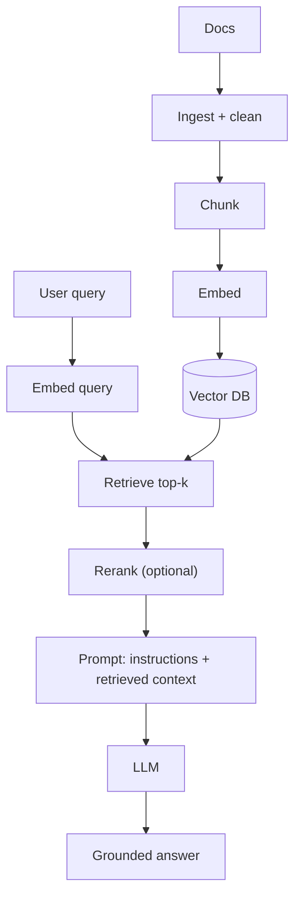

## PART VI: GENERATIVE AI

The October 2024 exam version includes Generative AI topics.

### 6.0 LLMs & Agentic Systems (what the exam is really testing)

- **LLM**: A language model (often transformer-based) trained to predict the next token; can be instruction-tuned to follow tasks.
- **GenAI app**: Your product + prompt(s) + model + data + guardrails + evaluation + monitoring.
- **Agent**: An LLM-driven system that can **plan**, **call tools**, **retrieve/ground on data**, and **take actions** (often multi-step, non-deterministic).

**EXAM TIP:** When the question says “business team needs actionable outcomes” or “must use enterprise docs / real-time info” → think **system design** (integration + grounding + evaluation), not just “train a better model”.

### 6.1 TRANSFORMER ARCHITECTURE

#### Self-Attention

The core mechanism that allows transformers to weigh relationships between all positions in a sequence.

- **Formula**: \( \mathrm{Attention}(Q,K,V) = \mathrm{softmax}(QK^\top/\sqrt{d_k}) \times V \)

#### Architecture Variants

| Type            | Attention Direction    | Examples           | Best For                               |
| --------------- | ---------------------- | ------------------ | -------------------------------------- |
| Encoder-Only    | Bidirectional          | BERT, RoBERTa      | Understanding: classification, NER, QA |
| Decoder-Only    | Causal (left-to-right) | GPT, Gemini, LLaMA | Generation: completion, chat           |
| Encoder-Decoder | Both + cross-attention | T5, BART           | Seq2seq: translation, summarization    |

### 6.2 Prompting & Inference Controls (fastest “customization”)

- **System prompt vs user prompt**: Use system for global policy (“tone”, “constraints”), user for task-specific instructions.
- **Few-shot examples**: Provide 1–5 examples to shape output format reliably (especially extraction/classification).
- **Temperature**: Higher = more diverse/creative; lower = more deterministic/consistent.
- **Top-K / Top-P**: Sampling controls that restrict which tokens are eligible next (more control over creativity vs factuality).
- **Max tokens**: Controls response length; helps cap cost/latency.

**EXAM TIP:** Token limits don’t make the model “more concise” — they just stop generation. If you need short outputs, you usually also need explicit prompt constraints (format + length requirements).

**Prompt documentation (real-world + exam-friendly):** Keep prompts as “prompt-as-code” artifacts (system + user + examples + guardrails) and track iterations, because prompts evolve like any other dependency.

#### Sampling controls: when outputs are too random (or too repetitive)

- **Temperature**: 0 is greedy decoding (most likely token); higher increases diversity.
- **Top-K**: keep only the K most likely tokens. Top-K = 1 is greedy decoding.
- **Top-P (nucleus)**: keep the smallest set of tokens whose cumulative probability ≥ P.
- **Best-of-N**: generate N candidate answers and select the best by a metric/rule (useful when reasoning/logic quality matters).
- **Typical starting point** (from the PDFs): \(T \approx 0.2\), top-P \(\approx 0.95\), top-K \(\approx 30\). For “single correct answer” tasks: start with \(T = 0\).

**COMMON TRAP:** The “repetition loop bug” (model repeats filler) is often made worse by poor temperature/top-K/top-P settings. Fix by tuning sampling + adding stop conditions + lowering max output tokens.

**COMMON TRAP:** “Fine-tune” is rarely the first answer. Start with **prompting** or **RAG/grounding** unless you truly need style/domain adaptation at scale.

#### Structured outputs (JSON) and integration

- **Why JSON**: Makes downstream systems deterministic (parsing, routing, dashboards).
- **How**: Specify schema + examples, and validate outputs. If JSON is malformed, use repair/validation logic.

### 6.3 RAG & Grounding (Retrieval Augmented Generation)

Combines LLM generation with external knowledge retrieval.

1. Document Ingestion - collect and preprocess documents
2. Chunking - split documents into 256-1024 token pieces
3. Embedding - convert chunks to vectors
4. Vector Storage - store in vector database (e.g., **Vertex AI Vector Search** / Matching Engine, or other vector DB)
5. Retrieval - find K nearest chunks to user query
6. Augmentation - construct prompt with retrieved context
7. Generation - LLM generates grounded response

#### Chunking strategies (common patterns)

- **Fixed-size chunking**: split by tokens/chars (fast, simple; can break sentences/ideas).
- **Semantic chunking**: split by meaning boundaries (sentences/paragraphs/sections).
- **Recursive chunking**: split hierarchically (section → paragraph → sentence) until within size target.
- **Overlapping chunks**: add overlap to reduce boundary information loss (but increases index size/cost).
- **Hybrid**: semantic/recursive + overlap (common practical default).

**EXAM TIP:** If your RAG outputs feel “almost right but missing context,” revisit **chunking + overlap** before blaming the model.

#### Embeddings & vector stores (production details)

- **Embedding compatibility**: embeddings from different models (or different versions) are **not comparable**. Keep the embedding model/version consistent across your corpus + queries.
- **Plan for upgrades**: embedding quality improves quickly; design for re-embedding + regression tests so you can upgrade safely.
- **Retrieval evaluation metrics**:
  - **precision@k** and **recall@k** (binary relevance)
  - **nDCG@k** (ranking quality when relevance is graded)
  - Benchmarks often referenced: **BEIR** and **MTEB**
- **Dual encoder pattern**: many systems embed documents and queries differently (document vs query “task type”) to improve retrieval quality.

#### Retrieval improvement: reranking (bi-encoder → cross-encoder)

- **First-stage retrieval**: fast dense retrieval (bi-encoder) to get top-K candidates.
- **Reranking**: a more accurate (but slower) model (often a **cross-encoder**) scores query+document pairs to reorder the top-K.

**EXAM TIP:** When you need “better relevance” without re-indexing everything, add a **reranker**.

#### Advanced RAG architectures & variants (from the AI Engineering Guidebook)

- **Agentic RAG**: agent decides if/when to retrieve; can do multi-step retrieval and tool use.
- **HyDE (Hypothetical Document Embeddings)**: generate a hypothetical answer/document, embed it, retrieve using that embedding to improve recall when the raw query is sparse/ambiguous.
- **CAG (Cache-Augmented Generation)**: cache frequent/“stable” knowledge to reduce repeated retrieval and speed up inference; can combine with RAG (“two layers”: cached stable knowledge + live retrieval for fresh info).
- **REFRAG**: relevance-aware retrieval that selectively expands/keeps chunks (guidebook frames it as using a learned relevance policy).

**COMMON TRAP:** If RAG is failing, it’s often a **retrieval** problem (chunking, embeddings, reranking), not a generation problem.

#### Grounding vs fine-tuning

- **Grounding**: Connect the model to **up-to-date / proprietary facts** at runtime (typically via retrieval). Improves factuality and reduces hallucinations.
- **Fine-tuning**: Changes model behavior/weights to better match a task/style. Does **not** automatically make outputs “current”.

**COMMON TRAP:** Fine-tuning is not grounding. Use RAG/grounding when you need answers tied to **enterprise documents** or **fresh data**.

#### Google Cloud “managed RAG” building blocks (from Google Cloud Skills Boost PDFs)

- **Vertex AI Search**: Managed semantic search + retrieval over your content; often the “out-of-the-box RAG” answer.
- **Vertex AI RAG Engine**: A data framework for building context-augmented LLM applications (RAG pipelines, context management).
- **Check grounding API**: Verify whether an “answer candidate” is grounded in a set of reference texts (“facts”).
- **GraphRAG**: Combines knowledge graphs + RAG to improve grounding for multi-hop reasoning and explainability.

**EXAM TIP:** When you see “ground responses on proprietary content quickly” → **Vertex AI Search** (and optionally **Vertex AI RAG Engine**) beats DIY pipelines unless the question demands custom infra.

### 6.4 AI Agents (beyond chatbots)

#### Key components of every agent (high-yield)

- **Model**: LLM as reasoning/generation engine.
- **Instructions**: System/policy prompts + task prompts.
- **Tools**: Functions/APIs the agent can call (DB queries, internal services, workflows).
- **Memory**:
  - **Short-term**: Conversation context window (tokens).
  - **Long-term**: Stored knowledge/preferences (often backed by a KB/vector store).
- **Grounding**: Retrieval layer that injects verified context into prompts.
- **Orchestration**: How the agent plans multi-step actions and coordinates tool calls.

#### Common agent patterns you should recognize

- **ReAct (Reason + Act)**: Interleaves reasoning with tool actions over multiple turns.
- **Agentic RAG**: Retrieval is not a single step; the agent iteratively retrieves, refines queries, and verifies.

#### Agent design patterns (high-yield, from the AI Engineering Guidebook)

These patterns are worth recognizing because exam scenarios often describe them indirectly:

- **Reflection pattern**: the agent reviews its own work, spots mistakes, and iterates before finalizing an answer.
- **Tool use pattern**: the agent uses tools (APIs, code execution, vector DB) to access external info/actions instead of relying only on internal knowledge.
- **ReAct loop (Thought → Action → Observation)**: combines reflection + tool use to solve multi-step tasks reliably.
- **Planning pattern**: agent creates a roadmap by decomposing the task into sub-goals/steps, then executes them.
- **Router pattern**: human defines possible paths/functions; the model chooses which route/tool/agent should handle the request.
- **Multi-agent (manager/supervisor) pattern**: a manager agent coordinates multiple specialist sub-agents and iterates on next steps.
- **Hierarchical agents**: supervisor delegates tasks to workers, tracks progress, and merges results (a common multi-agent structure).
- **Autonomous pattern (high risk)**: the agent generates and executes new code with minimal supervision (usually requires strict guardrails + human approval).

**EXAM TIP:** When the prompt hints “specialists / delegation / coordination” → think **router + multi-agent supervisor**. When it hints “multi-step reasoning + tools” → think **ReAct**. When it hints “the answer needs iterative self-correction” → think **reflection**.

#### Agent tool types (Extensions vs function calling vs data stores)

Google’s agent materials often split “tools” into three types:

- **Extensions (agent-side execution)**: bridge agents to external APIs in a standardized way; the agent selects and invokes them at runtime using examples/definitions.
- **Function calling (client-side execution)**: the model outputs a function name + structured args, but the **client app** executes the API call (more control; avoids exposing credentials to the agent).
- **Data stores (agent-side execution)**: connect agents to dynamic/up-to-date data sources (often via vector DB for RAG), reducing need to retrain/fine-tune.

**EXAM TIP:** If the question emphasizes security/auth/network constraints or special order-of-operations (batch, human-in-the-loop) → prefer **function calling** over letting the agent call an API directly.

#### Targeted learning for tool use (how models learn to use tools)

- **In-context learning**: prompt + tools + few-shot examples at inference time (ReAct is a common template).
- **Retrieval-based in-context learning**: dynamically retrieve the most relevant tools/examples/context into the prompt (Example Store / RAG).
- **Fine-tuning**: train the model on many tool-use examples so it learns tool selection/argument patterns before deployment.

#### Context engineering (agent memory + “what the agent sees”)

The guidebook emphasizes that many “agent failures” are really context failures:

- **Short-term memory**: within-session context (conversation history, intermediate steps).
- **Long-term memory**: persists across sessions (user preferences, durable facts/knowledge).
- **Episodic memory**: recalls past experiences/task completions.
- **Semantic memory**: durable knowledge/facts (often in a KB/vector store).

**EXAM TIP:** If an agent “forgets” or behaves inconsistently, the fix is often **context/memory design** (summarize, retrieve, store) rather than changing the base model.

### 6.5 Building agents on Google Cloud (service mapping)

These names show up increasingly in training materials and “real world” GenAI questions:

- **Agent Development Kit (ADK)**: Code-first framework to build, evaluate, and deploy agents; agents built with ADK can be deployed on Vertex AI.
- **Vertex AI Agent Engine**: Managed services to deploy/manage/scale agents in production.
- **Google Agentspace**: No/low-code orchestration to govern and scale an “agent workforce”.
- **Agent Starter Pack**: Templates/tools to go from idea to deployment faster.
- **Agent2Agent (A2A)**: Open protocol for interoperability between agentic applications.
- **Model Context Protocol (MCP)**: Open protocol standardizing how apps provide context to LLMs (tooling/interoperability).

**EXAM TIP:** If requirements say “fully managed” + “canary/traffic splitting” + “production deployment” for an agentic app → map to **Vertex AI** managed offerings (Agent Engine / endpoints) rather than DIY infra.

### 6.6 AgentOps (reliability, safety, and operating in production)

Agents are non-deterministic; production readiness needs deliberate ops:

- **Evaluation**: Automated evals against criteria; compare versions; slice by scenario.
  - From the PDFs: **Gen AI evaluation service** in Vertex AI supports evaluating generative apps/models and benchmarking results.
- **Observability**: Logging/tracing of tool calls, failures, latency, token usage; tie into Google Cloud Observability.
- **Safety/responsible AI**: Content filtering + safety attribute scoring; define policies and guardrails.
- **Security**: Least privilege for tool execution; keep secrets out of prompts; isolate high-risk actions.

**COMMON TRAP:** “We tested a few prompts manually and it worked” (“vibe testing”) is not enough. The correct answer is usually to add **evals, monitoring, and guardrails**.

#### Common risks (from the AgentOps section in the “AI agents” PDF)

- **Not performing as intended** (quality/accuracy/safety failures)
- **Misuse / harmful use** (by developers or users)
- **Overclaiming capabilities** (users think it “knows” things it doesn’t)
- **Societal harms** (bias, privacy violations, inequality)
- **Information hazards** (lack of groundedness / non-factuality / confirmation bias)

#### Safeguards & artifacts (what “responsible” usually means in answers)

- **Model evaluations**: automated quality + grounding + safety checks (ideally in CI/CD before release)
- **Monitoring**: latency, token usage, tool-call success rate, error rate; production regressions
- **Safety attributes + confidence thresholds**: score/filter outputs and set thresholds per use case
- **Content filtering / moderation**: block or route unsafe content (Vertex AI Studio and GenAI APIs support safety scoring; many systems add moderation APIs)
- **Recitation / memorization checks**: mitigate training data leakage and “verbatim” regurgitation
- **Privacy restrictions + data governance**: minimize sensitive data exposure; control what tools/data the agent can access
- **Transparency docs**: **Model Cards** + **Data Cards** (document intended use, data provenance, limitations, and evaluation slices)

#### Security for agents (tool calling raises the bar)

- **Principle of least privilege**: tools run under strict IAM permissions so the agent cannot access unauthorized resources even if its logic is compromised.
- **Prompt injection defense**: validate/sanitize tool inputs; treat retrieved content as untrusted; don’t allow “instructions” from documents to override system policy.
- **Secrets hygiene**: never put credentials/secrets in prompts; use secret managers and scoped service accounts.
- **Auditability**: keep an audit trail (logs/metrics) for compliance and incident response.

**EXAM TIP:** If the question hints at “secure, compliant, production-ready agent” → the right direction is **AgentOps + SAIF mindset** (defense-in-depth + evals + monitoring + least privilege), not only “improve prompts”.

#### Agent evaluation (5-stage checklist from the “Operationalizing GenAI on Vertex AI” PDF)

1. **Tool unit testing + refinement**: test tool behavior; refine tool/function descriptions + parameter schema.
2. **Evaluation dataset creation**: multi-turn scenarios, created manually and/or harvested from real sessions.
3. **Tool selection evaluation**: correct tool selection + correct parameters; handle “no tool needed”.
   - Use **trajectory evaluation**: compare expected steps/tools vs observed steps/tools; detect wrong tools / “cul-de-sac” loops.
4. **Reasoning + groundedness evaluation**: correctness + groundedness of answers, plus recovery from errors and multi-turn context handling.
5. **Operational metrics**: latency + cost (practical viability + scalability).

**EXAM TIP:** If you need to debug “why the agent did X” → instrument traces/logs and inspect the agent’s trajectory (tool calls + intermediate steps), not just the final answer.

#### Tool access strategies (generalist vs specialist vs dynamic selection)

- **Generalist**: full tool registry access (flexible, less predictable).
- **Specialist**: curated tool list (more predictable + secure, more design effort).
- **Dynamic selection**: choose tools at runtime from a registry (flexible, harder to test/predict).

#### Memory & observability patterns (production)

- **Short-term memory options**: logs, Cloud Storage/DB, client-side session, or hybrid.
- **Long-term memory options**: vector DB (semantic), metadata/graphs (IDs/timestamps), Cloud Storage/DB, or hybrid.

### 6.7 GenAI evaluation (beyond “is it correct?”)

From the foundational LLM + Vertex GenAI Ops whitepapers:

- **Evaluation data**: build an eval dataset that mirrors expected production traffic; continuously enrich with real logs and targeted synthetic cases.
- **Evaluation context**: evaluate the whole system (prompt + RAG + agent workflow), not just the model output.
- **Definition of “good”**: don’t rely on exact-match only; use **rubrics** aligned to business outcomes.
- **Evaluation methods**:
  - **Human evaluation** (gold standard for nuanced outputs)
  - **LLM autoraters** (scalable judgments; require calibration / “meta-evaluation” against humans)

From the AI Engineering Guidebook (LLM evaluation chapter):

- **Single-turn vs multi-turn evals**: assistants/agents require conversation-level evaluation, not single message scoring.
- **Component-level evals**: evaluate retrieval (context quality), tool selection, and response separately; not just “final answer”.
- **LLM-as-a-judge metrics (G-eval pattern)**: define criteria in natural language; the judge produces a score (and often rationale).
- **Head-to-head evals**: compare two models/prompt variants directly to reduce scoring noise.
- **Evaluation vs observability**:
  - **Evaluation**: are outputs good (correct/grounded/safe) per rubric?
  - **Observability**: what happened in production (latency, tool-call success, traces, cost)?
- **Red teaming**: explicitly include adversarial prompts and misuse cases (prompt injection, jailbreak attempts) in test sets.
- **Evaluating tool-using (MCP/agent) apps**: evaluate not only the final output, but how tools were used (which tools, args, ordering, failures).

### 6.8 Inference performance & cost/latency tradeoffs

High-yield levers that show up in Google materials:

- **Quantization**: reduce precision of weights/activations for speed/memory wins; can be inference-only or QAT.
- **Distillation**: train a smaller “student” using a larger “teacher” (often via synthetic data or distribution matching).
- **Context caching (prefix caching)**: cache the KV cache for shared prompt prefixes (multi-turn chat; large doc uploads). Available as **Context Caching** in Google AI Studio and Vertex AI.
- **Speculative decoding**: use a small “drafter” model to propose tokens; main model verifies in parallel (quality-neutral if aligned).
- **Batching**: improves throughput (and cost) but increases memory pressure; decode is often where batching helps most.

**EXAM TIP:** Offline/batch inference prioritizes throughput/cost; interactive chat/UX prioritizes latency.

#### Serving engines & patterns (high-throughput LLM serving)

The guidebook highlights these recurring serving ideas (many appear in vLLM-like engines):

- **Continuous batching**: dynamically batch arriving requests to maximize GPU utilization.
- **KV cache management**: KV cache grows with context length; efficient paging/eviction reduces memory blow-ups.
- **Prefill vs decode scheduling**: prefill is throughput-heavy; decode is latency-sensitive; schedulers try to keep decode responsive.
- **Prefix-aware routing**: keep shared prefixes together to maximize cache hits (works well with cached system prompts/docs).

### 6.9 MODEL CUSTOMIZATION

| Technique              | Training Required | Data Needed     | Best For                  |
| ---------------------- | ----------------- | --------------- | ------------------------- |
| Prompt Engineering     | None              | 0-10 examples   | Quick adaptation          |
| RAG/Grounding          | Index only        | Documents       | Enterprise knowledge      |
| Supervised Fine-tuning | Yes               | 100-1000+       | Style/domain adaptation   |
| LoRA                   | Yes (efficient)   | 100+            | Resource-efficient tuning |
| RLHF                   | Yes               | Preference data | Alignment, safety         |

- **LoRA**: Low-Rank Adaptation. \(W' = W + BA\) where B, A are small. 98%+ parameter reduction.

### 6.10 Skill Boost PDF reading lists (useful references)

From:

- `docs/gcp-ml-exam-guide/pdfs_txt/G-LLM-I-m0-l2-en-file-2.en.txt`
- `docs/gcp-ml-exam-guide/pdfs_txt/G-GENAI-I-m1-l2-en-file-2.en.txt`

Selected links (as included in those PDFs):

- LLM intro: `https://developers.google.com/machine-learning/resources/intro-llms`
- Prompt engineering: `https://developers.google.com/machine-learning/resources/prompt-eng`
- LangChain on Vertex AI (Reasoning Engine overview): `https://cloud.google.com/vertex-ai/generative-ai/docs/reasoning-engine/overview`
- Vertex AI GenAI learn resources: `https://cloud.google.com/vertex-ai/generative-ai/docs/learn-resources`
