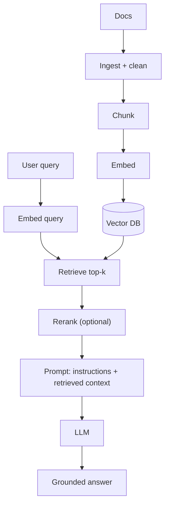

## PART VI: GENERATIVE AI

The October 2024 exam version includes Generative AI topics.

### Executive lens (why leaders care, and what can go wrong)

This section is intentionally short and more “human”: it reflects how GenAI leaders describe the space in practice.

- **The upside**: GenAI can help teams work faster and unlock new workflows (summarization, translation/rewriting for tone, coding, multimodal creation).
- **The risk**: One of the biggest risks is **slowing down productivity**—tools can distract, add review burden, or create “busywork outputs” if the organization doesn’t set expectations and guardrails.
- **The competitive reality**: Not using these tools can be a disadvantage because you miss new ways of working and new opportunities.
- **Multimodal matters**: The better your organization can provide **high-quality inputs** across modalities (text, images, video), the better these systems tend to perform in real workflows.
- **Leadership’s lever**: Education + enablement. Teams need practical training on **capabilities and limitations** so they adopt GenAI intentionally (not blindly).

**Note:** Some productivity figures in training materials (e.g., “hours saved per year”) are often context-dependent—treat them as hypotheses to validate in your organization.

### A practical learning journey (from the “GenAI Leader” learning path)

This is **not official exam scope**; it’s included to make the guide feel less robotic and to reflect how Google’s GenAI Leader curriculum frames adoption for non-technical leaders.

- **Start simple**: GenAI “beyond the chatbot” — focus on what it can do in business settings, not the math.
- **Earn buy-in**: learn how to talk about use cases and value with both technical and non-technical teams.
- **Build shared language**: cover foundational terms (LLMs, prompts, responsible AI) so teams can collaborate.
- **Understand the landscape**: think in layers (models → apps → data/RAG → ops/governance), with different opportunities/risks at each layer.
- **Make it personal**: apply GenAI to individual workflows (where adoption often starts).
- **Make it durable**: move toward custom tools/agents that fit the organization (with guardrails, evaluation, and governance).

### The business impact of GenAI (beyond the chatbot)

This framing is adapted from the GenAI Leader curriculum and is meant to sound like how leaders talk about adoption (concise, practical, not hype).

#### GenAI is a technology layer, not “one app”

- A **chatbot app** (like the Gemini app) is one product surface.
- The **model** (Gemini) is a building block engineers can embed across many applications and workflows.
- In practice, you’ll see GenAI embedded into tools like:
  - **Workplace apps** (email/docs/meetings/presentations)
  - **Analytics** (helping summarize insights, generate explanations)
  - **Developer workflows** (code generation, test generation, debugging)
  - **Cloud operations** (automation, troubleshooting, suggestions)

#### Quick definitions (from GenAI Leader quiz-style questions)

- **Generative AI**: a type of AI that can **create new content** (text, images, audio/music, code), not just analyze existing data.
- **Gemini**:
  - a **generative AI model (family of models)** developed by Google
  - also appears as an **assistant/app experience** in products (e.g., “Gemini in Gmail”), but the _model_ ≠ the _app_
- **Multimodal GenAI application**: a system that processes/combines **multiple input modalities** (e.g., text + image + audio/video) to solve one task.
  - Example: analyzing customer sentiment using **video testimonials** (visual/audio) + **survey text** (text)

#### The four primary ways businesses use GenAI

- **Create**: generate new content (text, images, audio, code).
- **Summarize**: condense large information into decision-ready summaries.
- **Discover**: find the right information at the right time (search + Q&A over content).
- **Automate**: automate tasks that used to require manual human work (with appropriate review/guardrails).

#### Practical examples you’ll recognize (Google ecosystem examples)

- **Create**
  - Draft emails or content (tone/translation help)
  - Generate images for slides (e.g., Imagen/Gemini-integrated creation workflows)
  - Generate code/unit tests (e.g., Gemini Code Assist–style workflows)
- **Summarize**
  - Summarize long docs/reports and extract key takeaways
  - Summarize meetings into action items
  - Summarize customer feedback for sentiment and themes
- **Discover**
  - Search for a file and ask questions about its contents (Drive-style “ask about this doc”)
  - Enterprise Q&A over internal knowledge (search + reasoning + enterprise data)
- **Automate**
  - Convert content formats (speech ↔ text, translation)
  - Automate documentation and information extraction (code docs, contract review/extraction)
  - Automate ticket creation/notifications from customer feedback signals

**Case study pattern (Imagen for e-commerce content at scale — PUMA example)**

- **Problem**: creating high-quality product imagery for many regions/variants is slow and expensive (photoshoots, localization).
- **Approach**: use **Imagen** to generate or customize **backgrounds/settings** around an existing product photo library via prompts (and then iterate quickly).
- **Localization**: adjust prompts to reflect regional context (e.g., landmarks) to make content feel locally relevant.
- **Outcome**: reported improvements like higher engagement (e.g., a “click-through rate” lift in a regional market). Treat such numbers as directional until validated in your own setup and measurement.

#### Multimodal GenAI (why it changes workflows)

Multimodal models can work across **text, images, video, audio, and PDFs**—either separately or combined in one task. This is why “GenAI” shows up in places like marketing content, document understanding, analytics dashboards, and support operations (not just chat).

#### “Beyond chat”: common enterprise use cases (business → system mapping)

- **Uncover patterns and insights in data**
  - Forecasting demand and optimizing inventory (Vertex AI forecasting / ML pipelines)
  - Personalized recommendations to increase engagement and reduce churn (search/retrieval + ranking; Vertex AI Search / retrieval patterns)
  - Scientific discovery workflows (fine-tuning and evaluation on domain data)
- **Search and question-answering over enterprise resources**
  - “Find a file and ask questions about it” (enterprise search + content Q&A patterns)
  - “Unlock enterprise expertise” (agents that combine reasoning + search + enterprise data)
- **Monitor real-time events**
  - Anomaly detection for fraud/ops signals (streaming ingestion + detection + alerting)

#### Vertex AI and multimodal GenAI (Vertex AI in action)

From the GenAI Leader curriculum perspective:

- **Vertex AI** is Google Cloud’s unified ML platform to build/train/deploy models and AI applications.
- For **multimodal GenAI** (text, code, images, speech), Vertex AI provides access to models through **Model Garden**, plus managed building blocks for tuning and deployment.
- In “search + GenAI assistant” use cases, a common pairing is:
  - **Gemini** (understand the request, reason, converse, and generate responses)
  - **Vertex AI Search** (retrieve the most relevant answers from a large multimodal knowledge base)

**Case study pattern (automotive virtual assistant)**

- **User problem**: a driver sees a dashboard warning light and needs help now (not after hunting through a manual).
- **Multimodal input**: the user can describe the issue in text and even show an image/video (e.g., phone camera).
- **Knowledge base** (examples): owner’s manuals, FAQs, help-center articles, videos, step-by-step guides.
- **Flow**:
  - Gemini interprets the question and can ask clarifying questions
  - Vertex AI Search retrieves the best matching guidance from the knowledge base
  - The assistant provides step-by-step troubleshooting (not just a static answer)
- **Business outcomes** (typical): reduced support costs (fewer calls), faster resolution, improved accessibility and customer satisfaction.

### Foundations of GenAI: foundation models (and where LLMs fit)

This framing is adapted from the GenAI Leader curriculum and is useful for exam-style “definition” questions.

- **AI (artificial intelligence)**: computers doing tasks that normally require human intelligence (understanding language, making decisions).
- **ML (machine learning)**: a major way we build AI systems—models learn patterns from data to solve tasks.
- **Traditional ML models**: often trained for one specific task on a narrower dataset (e.g., a spam classifier).
- **Foundation models**: large, general-purpose models trained on massive, diverse datasets so they can be adapted to many downstream tasks.
- **LLMs**: a specialized type of foundation model focused on language. (So: LLM ⊂ foundation model.)

#### Key features of foundation models (why they’re different)

- **Trained on diverse data**: learn general patterns/relationships that transfer across tasks.
- **Flexible**: one model can support many use cases.
- **Adaptable**: can be specialized for domains/use cases via additional targeted training (tuning/fine-tuning).

#### Examples (Google model families)

- **Gemini**: multimodal foundation model trained across text, images, code, audio, video, etc.
- **Imagen**: image generation/editing foundation model trained primarily on images + text descriptions.
- **Chirp**: audio/speech foundation model trained on multilingual audio (speech recognition / transcription / translation use cases).

#### Prompting foundation models (how you “use” GenAI)

Foundation models, like other AI models, take **inputs** (“prompts”) and produce **outputs**. The difference is flexibility: many foundation models (especially multimodal ones) can accept a broader set of inputs than traditional models.

| Input (prompt)                 | Output (typical)             |
| ------------------------------ | ---------------------------- |
| Question                       | Answer                       |
| Text request for an image      | Generated image              |
| “Summarize this file/document” | Summary                      |
| Buggy code snippet             | Corrected code / explanation |

**EXAM TIP:** Prompting (prompt engineering / prompt design) is a practical skill: better prompts often beat “more training” for many business use cases.

```mermaid
flowchart TD
  A[AI] --> B[Machine Learning]
  B --> C[Foundation models]
  C --> D[LLMs (language-focused)]
```

### Building a successful GenAI strategy (top-down + bottom-up)

This framing is adapted from the GenAI Leader curriculum and is written for “how should an org do this responsibly?” questions.

#### The core idea: don’t start with the newest tech

- Start with **business priorities and high-value workflows**.
- Then decide where GenAI can help (and where it introduces unacceptable risk).

#### A two-fold approach that works in real organizations

- **Top-down**: executives define a clear vision, pick strategic priorities, allocate resources, and set guardrails (safety/responsible AI).
- **Bottom-up**: teams closest to the work run small experiments, surface ideas, and share what actually improves daily workflows.

**Why both matter**

- Top-down without bottom-up misses practical opportunities.
- Bottom-up without top-down creates scattered experiments with inconsistent risk controls and no path to scale.

#### Roles (who does what)

- **Executives / senior leaders**
  - Provide sponsorship, budget, and a clear “why now”
  - Align GenAI initiatives to business goals and risk appetite
- **Mid-level managers + individual contributors**
  - Identify feasible, high-impact use cases in real workflows
  - Encourage safe experimentation and gather feedback
  - Help integrate tools into existing processes (change management)

#### A lightweight strategy checklist (multi-directional)

Use these lenses for both top-down and bottom-up efforts:

- **Strategic focus**: which workflows matter most and why?
- **Exploration**: where can teams prototype safely and quickly?
- **Responsible AI**: policies, privacy, and safety guardrails (before scaling)
- **Resourcing**: time, people, tooling, and review capacity
- **Impact**: how you’ll measure success (quality, time saved, cost, risk reduction)
- **Continuous improvement**: evaluation + monitoring + iteration loops

#### Brainstorming use cases: the “creative matrix” method (practical)

When teams struggle to generate _and_ prioritize use cases, a simple facilitation technique is a **creative matrix**:

- **Axis 1 (GenAI capabilities)**: pick the tools/capabilities you can realistically use (e.g., Workspace with Gemini, Vertex AI Search, conversational agents, model tuning, multimodal).
- **Axis 2 (your business)**: pick what matters internally (personas, workflows, strategic goals).
- **Fill the grid**: write “sticky note” ideas for each intersection (small, concrete use cases).

```mermaid
flowchart LR
  A[GenAI capabilities\n(models, search/RAG, agents, multimodal)] --> B[Creative matrix]
  C[Business axis\n(personas, workflows, priorities)] --> B
  B --> D[Sticky-note ideas\n(concrete intersections)]
  D --> E[Prioritize\nImpact × Effort\n+ Feasibility/Risk]
```

**Prioritization step (keep it lightweight)**

- **Impact**: will this materially improve a priority workflow or KPI?
- **Effort**: can we ship a safe pilot quickly (days/weeks), or is it months?
- **Feasibility**: do we have the data, access, and integration path?
- **Responsible AI risk**: privacy/safety/compliance exposure; review burden.

**Example matrix prompts (to generate sticky notes fast)**

- “Enhance customer experience” × “Vertex AI Search” → image-based search to find similar products.
- “Increase efficiency” × “Agents/automation” → auto-triage support tickets and draft responses with citations.
- “Drive innovation” × “Model tuning” → adapt a model for a niche domain (with eval gates).
- “Employee productivity” × “Workspace with Gemini” → meeting notes + action items + follow-up drafts.

#### Keeping humans at the forefront (augmentation vs automation)

As you adopt GenAI, the “best” use cases usually **augment human strategic work** while **automating repetitive work**.

**Use GenAI for augmentation (enhance strategic thinking)**

- **Critical thinking & problem-solving**: GenAI can surface information; humans interpret it and make decisions.
- **Creativity & innovation**: GenAI expands options; humans choose direction and take accountability.
- **Relationship building & collaboration**: GenAI can assist communication; humans build trust and navigate nuance.
- **Strategic planning & vision**: GenAI can help with analysis/forecasting; leaders set goals and long-term direction.

**Use GenAI for automation (offload the “busy work”)**

- **Repetitive, rule-based tasks**: data entry, basic retrieval, formatting, boilerplate code.
- **Time-consuming tasks**: research, summarization, first-draft creation, initial analysis.

**Humans-in-the-loop (needed in both cases)**

- **Data selection & preparation**: ensure high-quality, relevant, representative inputs; control sensitive data.
- **Prompt design & refinement**: iterate prompts as “prompt-as-code” to improve reliability.
- **Output evaluation & refinement**: review/edit for correctness, compliance, and brand alignment.
- **Continuous monitoring & feedback**: measure quality/drift/safety issues and improve over time.

#### Case study (GenAI Leader): AI-assisted captioning with humans-in-the-loop (Warner Bros.)

This example is a clean “augmentation, not replacement” pattern: **AI generates a first-pass caption file**, then **humans edit and verify** for correctness and sync.

**What changes operationally**

- The model produces a **time-coded, formatted caption file** that lands in a folder and is ready to edit.
- Human captioners shift from “type everything” to **review + correction + sync validation**.
- Reported impact (as shared in the course): **~50% cost reduction** and **~80% reduction in manual captioning time**.

**Why this is a good GenAI/ML use case**

- Captioning is **time-consuming** and benefits from a strong “draft → review” loop.
- Quality requirements are high; the human review step acts as a quality gate.
- You can iterate on model choice and approach; Vertex AI is positioned as **model-choice flexible** (platform not locked to one model).

**Reference architecture on Google Cloud (one reasonable implementation)**

```mermaid
flowchart TD
  V[Video asset] --> I[Ingest to Cloud Storage]
  I --> T[Transcribe / caption draft generation\n(Vertex AI or Speech APIs)]
  T --> C[Caption file output\n(time-coded + formatted)]
  C --> B[(Cloud Storage bucket/folder)]
  B --> H[Human review + edit\n(QA + sync check)]
  H --> P[Publish captions\n(distribution pipeline)]
  H --> F[Feedback loop\n(error patterns, glossary, eval set)]
  F --> T
```

**EXAM TIP:** When an answer mentions “reduce human time but keep quality high” → pick designs that output **editable artifacts** (drafts, structured files) and include a **human-in-the-loop quality gate**, rather than “fully automate with no review”.

### 6.0 LLMs & Agentic Systems (what the exam is really testing)

- **LLM**: A language model (often transformer-based) trained to predict the next token; can be instruction-tuned to follow tasks.
- **GenAI app**: Your product + prompt(s) + model + data + guardrails + evaluation + monitoring.
- **Agent**: An LLM-driven system that can **plan**, **call tools**, **retrieve/ground on data**, and **take actions** (often multi-step, non-deterministic).

**EXAM TIP:** When the question says “business team needs actionable outcomes” or “must use enterprise docs / real-time info” → think **system design** (integration + grounding + evaluation), not just “train a better model”.

### 6.1 TRANSFORMER ARCHITECTURE

#### Self-Attention

The core mechanism that allows transformers to weigh relationships between all positions in a sequence.

- **Formula**: \( \mathrm{Attention}(Q,K,V) = \mathrm{softmax}(QK^\top/\sqrt{d_k}) \times V \)

#### Architecture Variants

| Type            | Attention Direction    | Examples           | Best For                               |
| --------------- | ---------------------- | ------------------ | -------------------------------------- |
| Encoder-Only    | Bidirectional          | BERT, RoBERTa      | Understanding: classification, NER, QA |
| Decoder-Only    | Causal (left-to-right) | GPT, Gemini, LLaMA | Generation: completion, chat           |
| Encoder-Decoder | Both + cross-attention | T5, BART           | Seq2seq: translation, summarization    |

### 6.2 Prompting & Inference Controls (fastest “customization”)

- **System prompt vs user prompt**: Use system for global policy (“tone”, “constraints”), user for task-specific instructions.
- **Few-shot examples**: Provide 1–5 examples to shape output format reliably (especially extraction/classification).
- **Temperature**: Higher = more diverse/creative; lower = more deterministic/consistent.
- **Top-K / Top-P**: Sampling controls that restrict which tokens are eligible next (more control over creativity vs factuality).
- **Max tokens**: Controls response length; helps cap cost/latency.

**EXAM TIP:** Token limits don’t make the model “more concise” — they just stop generation. If you need short outputs, you usually also need explicit prompt constraints (format + length requirements).

**Prompt documentation (real-world + exam-friendly):** Keep prompts as “prompt-as-code” artifacts (system + user + examples + guardrails) and track iterations, because prompts evolve like any other dependency.

#### Prompting the Gemini app (hands-on mental model)

If you’re new, the fastest way to build intuition is to treat the prompt box like a conversation with a very capable assistant: ask questions, give creative tasks, and iterate. A helpful practice loop is to try one prompt in each category:

- **Create**: “Write website copy for \<product\>.”
- **Summarize**: “Summarize this long email/document and list action items.”
- **Discover**: “Research \<topic\> and provide a 5-bullet brief with sources to verify.”
- **Automate**: “Draft a template reply / create a checklist / propose steps I can follow.”

**Multimodal input types (quiz-style intuition):** the “right input” depends on the desired output.

- Want a **realistic image** → provide a **text description** (and optionally an image for editing).
- Want a **fixed Python script** → provide a **code snippet** (and error/output if available).
- Want a **summary of a customer service call** → provide an **audio file** (or transcript) depending on the workflow.
- Want a **personalized workout plan** → provide a **text description** (goals, constraints, schedule).

#### Sampling controls: when outputs are too random (or too repetitive)

- **Temperature**: 0 is greedy decoding (most likely token); higher increases diversity.
- **Top-K**: keep only the K most likely tokens. Top-K = 1 is greedy decoding.
- **Top-P (nucleus)**: keep the smallest set of tokens whose cumulative probability ≥ P.
- **Best-of-N**: generate N candidate answers and select the best by a metric/rule (useful when reasoning/logic quality matters).
- **Typical starting point** (from the PDFs): \(T \approx 0.2\), top-P \(\approx 0.95\), top-K \(\approx 30\). For “single correct answer” tasks: start with \(T = 0\).

**COMMON TRAP:** The “repetition loop bug” (model repeats filler) is often made worse by poor temperature/top-K/top-P settings. Fix by tuning sampling + adding stop conditions + lowering max output tokens.

**COMMON TRAP:** “Fine-tune” is rarely the first answer. Start with **prompting** or **RAG/grounding** unless you truly need style/domain adaptation at scale.

#### Structured outputs (JSON) and integration

- **Why JSON**: Makes downstream systems deterministic (parsing, routing, dashboards).
- **How**: Specify schema + examples, and validate outputs. If JSON is malformed, use repair/validation logic.

### 6.3 RAG & Grounding (Retrieval Augmented Generation)

Combines LLM generation with external knowledge retrieval.

1. Document Ingestion - collect and preprocess documents
2. Chunking - split documents into 256-1024 token pieces
3. Embedding - convert chunks to vectors
4. Vector Storage - store in vector database (e.g., **Vertex AI Vector Search** / Matching Engine, or other vector DB)
5. Retrieval - find K nearest chunks to user query
6. Augmentation - construct prompt with retrieved context
7. Generation - LLM generates grounded response



#### Chunking strategies (common patterns)

- **Fixed-size chunking**: split by tokens/chars (fast, simple; can break sentences/ideas).
- **Semantic chunking**: split by meaning boundaries (sentences/paragraphs/sections).
- **Recursive chunking**: split hierarchically (section → paragraph → sentence) until within size target.
- **Overlapping chunks**: add overlap to reduce boundary information loss (but increases index size/cost).
- **Hybrid**: semantic/recursive + overlap (common practical default).

**EXAM TIP:** If your RAG outputs feel “almost right but missing context,” revisit **chunking + overlap** before blaming the model.

#### Embeddings & vector stores (production details)

- **Embedding compatibility**: embeddings from different models (or different versions) are **not comparable**. Keep the embedding model/version consistent across your corpus + queries.
- **Plan for upgrades**: embedding quality improves quickly; design for re-embedding + regression tests so you can upgrade safely.
- **Retrieval evaluation metrics**:
  - **precision@k** and **recall@k** (binary relevance)
  - **nDCG@k** (ranking quality when relevance is graded)
  - Benchmarks often referenced: **BEIR** and **MTEB**
- **Dual encoder pattern**: many systems embed documents and queries differently (document vs query “task type”) to improve retrieval quality.

#### Retrieval improvement: reranking (bi-encoder → cross-encoder)

- **First-stage retrieval**: fast dense retrieval (bi-encoder) to get top-K candidates.
- **Reranking**: a more accurate (but slower) model (often a **cross-encoder**) scores query+document pairs to reorder the top-K.

**EXAM TIP:** When you need “better relevance” without re-indexing everything, add a **reranker**.

#### Advanced RAG architectures & variants (from the AI Engineering Guidebook)

- **Agentic RAG**: agent decides if/when to retrieve; can do multi-step retrieval and tool use.
- **HyDE (Hypothetical Document Embeddings)**: generate a hypothetical answer/document, embed it, retrieve using that embedding to improve recall when the raw query is sparse/ambiguous.
- **CAG (Cache-Augmented Generation)**: cache frequent/“stable” knowledge to reduce repeated retrieval and speed up inference; can combine with RAG (“two layers”: cached stable knowledge + live retrieval for fresh info).
- **REFRAG**: relevance-aware retrieval that selectively expands/keeps chunks (guidebook frames it as using a learned relevance policy).

**COMMON TRAP:** If RAG is failing, it’s often a **retrieval** problem (chunking, embeddings, reranking), not a generation problem.

#### Grounding vs fine-tuning

- **Grounding**: Connect the model to **up-to-date / proprietary facts** at runtime (typically via retrieval). Improves factuality and reduces hallucinations.
- **Fine-tuning**: Changes model behavior/weights to better match a task/style. Does **not** automatically make outputs “current”.

**COMMON TRAP:** Fine-tuning is not grounding. Use RAG/grounding when you need answers tied to **enterprise documents** or **fresh data**.

#### Google Cloud “managed RAG” building blocks (from Google Cloud Skills Boost PDFs)

- **Vertex AI Search**: Managed semantic search + retrieval over your content; often the “out-of-the-box RAG” answer.
- **Vertex AI RAG Engine**: A data framework for building context-augmented LLM applications (RAG pipelines, context management).
- **Check grounding API**: Verify whether an “answer candidate” is grounded in a set of reference texts (“facts”).
- **GraphRAG**: Combines knowledge graphs + RAG to improve grounding for multi-hop reasoning and explainability.

**EXAM TIP:** When you see “ground responses on proprietary content quickly” → **Vertex AI Search** (and optionally **Vertex AI RAG Engine**) beats DIY pipelines unless the question demands custom infra.

### 6.4 AI Agents (beyond chatbots)

#### Key components of every agent (high-yield)

- **Model**: LLM as reasoning/generation engine.
- **Instructions**: System/policy prompts + task prompts.
- **Tools**: Functions/APIs the agent can call (DB queries, internal services, workflows).
- **Memory**:
  - **Short-term**: Conversation context window (tokens).
  - **Long-term**: Stored knowledge/preferences (often backed by a KB/vector store).
- **Grounding**: Retrieval layer that injects verified context into prompts.
- **Orchestration**: How the agent plans multi-step actions and coordinates tool calls.

#### Common agent patterns you should recognize

- **ReAct (Reason + Act)**: Interleaves reasoning with tool actions over multiple turns.
- **Agentic RAG**: Retrieval is not a single step; the agent iteratively retrieves, refines queries, and verifies.

#### Agent design patterns (high-yield, from the AI Engineering Guidebook)

These patterns are worth recognizing because exam scenarios often describe them indirectly:

- **Reflection pattern**: the agent reviews its own work, spots mistakes, and iterates before finalizing an answer.
- **Tool use pattern**: the agent uses tools (APIs, code execution, vector DB) to access external info/actions instead of relying only on internal knowledge.
- **ReAct loop (Thought → Action → Observation)**: combines reflection + tool use to solve multi-step tasks reliably.
- **Planning pattern**: agent creates a roadmap by decomposing the task into sub-goals/steps, then executes them.
- **Router pattern**: human defines possible paths/functions; the model chooses which route/tool/agent should handle the request.
- **Multi-agent (manager/supervisor) pattern**: a manager agent coordinates multiple specialist sub-agents and iterates on next steps.
- **Hierarchical agents**: supervisor delegates tasks to workers, tracks progress, and merges results (a common multi-agent structure).
- **Autonomous pattern (high risk)**: the agent generates and executes new code with minimal supervision (usually requires strict guardrails + human approval).

**EXAM TIP:** When the prompt hints “specialists / delegation / coordination” → think **router + multi-agent supervisor**. When it hints “multi-step reasoning + tools” → think **ReAct**. When it hints “the answer needs iterative self-correction” → think **reflection**.

#### Agent tool types (Extensions vs function calling vs data stores)

Google’s agent materials often split “tools” into three types:

- **Extensions (agent-side execution)**: bridge agents to external APIs in a standardized way; the agent selects and invokes them at runtime using examples/definitions.
- **Function calling (client-side execution)**: the model outputs a function name + structured args, but the **client app** executes the API call (more control; avoids exposing credentials to the agent).
- **Data stores (agent-side execution)**: connect agents to dynamic/up-to-date data sources (often via vector DB for RAG), reducing need to retrain/fine-tune.

**EXAM TIP:** If the question emphasizes security/auth/network constraints or special order-of-operations (batch, human-in-the-loop) → prefer **function calling** over letting the agent call an API directly.

#### Targeted learning for tool use (how models learn to use tools)

- **In-context learning**: prompt + tools + few-shot examples at inference time (ReAct is a common template).
- **Retrieval-based in-context learning**: dynamically retrieve the most relevant tools/examples/context into the prompt (Example Store / RAG).
- **Fine-tuning**: train the model on many tool-use examples so it learns tool selection/argument patterns before deployment.

#### Context engineering (agent memory + “what the agent sees”)

The guidebook emphasizes that many “agent failures” are really context failures:

- **Short-term memory**: within-session context (conversation history, intermediate steps).
- **Long-term memory**: persists across sessions (user preferences, durable facts/knowledge).
- **Episodic memory**: recalls past experiences/task completions.
- **Semantic memory**: durable knowledge/facts (often in a KB/vector store).

**EXAM TIP:** If an agent “forgets” or behaves inconsistently, the fix is often **context/memory design** (summarize, retrieve, store) rather than changing the base model.

### 6.5 Building agents on Google Cloud (service mapping)

These names show up increasingly in training materials and “real world” GenAI questions:

- **Agent Development Kit (ADK)**: Code-first framework to build, evaluate, and deploy agents; agents built with ADK can be deployed on Vertex AI.
- **Vertex AI Agent Engine**: Managed services to deploy/manage/scale agents in production.
- **Google Agentspace**: No/low-code orchestration to govern and scale an “agent workforce”.
- **Agent Starter Pack**: Templates/tools to go from idea to deployment faster.
- **Agent2Agent (A2A)**: Open protocol for interoperability between agentic applications.
- **Model Context Protocol (MCP)**: Open protocol standardizing how apps provide context to LLMs (tooling/interoperability).

**EXAM TIP:** If requirements say “fully managed” + “canary/traffic splitting” + “production deployment” for an agentic app → map to **Vertex AI** managed offerings (Agent Engine / endpoints) rather than DIY infra.

### 6.6 AgentOps (reliability, safety, and operating in production)

Agents are non-deterministic; production readiness needs deliberate ops:

- **Evaluation**: Automated evals against criteria; compare versions; slice by scenario.
  - From the PDFs: **Gen AI evaluation service** in Vertex AI supports evaluating generative apps/models and benchmarking results.
- **Observability**: Logging/tracing of tool calls, failures, latency, token usage; tie into Google Cloud Observability.
- **Safety/responsible AI**: Content filtering + safety attribute scoring; define policies and guardrails.
- **Security**: Least privilege for tool execution; keep secrets out of prompts; isolate high-risk actions.

**COMMON TRAP:** “We tested a few prompts manually and it worked” (“vibe testing”) is not enough. The correct answer is usually to add **evals, monitoring, and guardrails**.

#### Common risks (from the AgentOps section in the “AI agents” PDF)

- **Not performing as intended** (quality/accuracy/safety failures)
- **Misuse / harmful use** (by developers or users)
- **Overclaiming capabilities** (users think it “knows” things it doesn’t)
- **Societal harms** (bias, privacy violations, inequality)
- **Information hazards** (lack of groundedness / non-factuality / confirmation bias)

#### Safeguards & artifacts (what “responsible” usually means in answers)

- **Model evaluations**: automated quality + grounding + safety checks (ideally in CI/CD before release)
- **Monitoring**: latency, token usage, tool-call success rate, error rate; production regressions
- **Safety attributes + confidence thresholds**: score/filter outputs and set thresholds per use case
- **Content filtering / moderation**: block or route unsafe content (Vertex AI Studio and GenAI APIs support safety scoring; many systems add moderation APIs)
- **Recitation / memorization checks**: mitigate training data leakage and “verbatim” regurgitation
- **Privacy restrictions + data governance**: minimize sensitive data exposure; control what tools/data the agent can access
- **Transparency docs**: **Model Cards** + **Data Cards** (document intended use, data provenance, limitations, and evaluation slices)

#### Security for agents (tool calling raises the bar)

- **Principle of least privilege**: tools run under strict IAM permissions so the agent cannot access unauthorized resources even if its logic is compromised.
- **Prompt injection defense**: validate/sanitize tool inputs; treat retrieved content as untrusted; don’t allow “instructions” from documents to override system policy.
- **Secrets hygiene**: never put credentials/secrets in prompts; use secret managers and scoped service accounts.
- **Auditability**: keep an audit trail (logs/metrics) for compliance and incident response.

**EXAM TIP:** If the question hints at “secure, compliant, production-ready agent” → the right direction is **AgentOps + SAIF mindset** (defense-in-depth + evals + monitoring + least privilege), not only “improve prompts”.

#### Agent evaluation (5-stage checklist from the “Operationalizing GenAI on Vertex AI” PDF)

1. **Tool unit testing + refinement**: test tool behavior; refine tool/function descriptions + parameter schema.
2. **Evaluation dataset creation**: multi-turn scenarios, created manually and/or harvested from real sessions.
3. **Tool selection evaluation**: correct tool selection + correct parameters; handle “no tool needed”.
   - Use **trajectory evaluation**: compare expected steps/tools vs observed steps/tools; detect wrong tools / “cul-de-sac” loops.
4. **Reasoning + groundedness evaluation**: correctness + groundedness of answers, plus recovery from errors and multi-turn context handling.
5. **Operational metrics**: latency + cost (practical viability + scalability).

**EXAM TIP:** If you need to debug “why the agent did X” → instrument traces/logs and inspect the agent’s trajectory (tool calls + intermediate steps), not just the final answer.

#### Tool access strategies (generalist vs specialist vs dynamic selection)

- **Generalist**: full tool registry access (flexible, less predictable).
- **Specialist**: curated tool list (more predictable + secure, more design effort).
- **Dynamic selection**: choose tools at runtime from a registry (flexible, harder to test/predict).

#### Memory & observability patterns (production)

- **Short-term memory options**: logs, Cloud Storage/DB, client-side session, or hybrid.
- **Long-term memory options**: vector DB (semantic), metadata/graphs (IDs/timestamps), Cloud Storage/DB, or hybrid.

### 6.7 GenAI evaluation (beyond “is it correct?”)

From the foundational LLM + Vertex GenAI Ops whitepapers:

- **Evaluation data**: build an eval dataset that mirrors expected production traffic; continuously enrich with real logs and targeted synthetic cases.
- **Evaluation context**: evaluate the whole system (prompt + RAG + agent workflow), not just the model output.
- **Definition of “good”**: don’t rely on exact-match only; use **rubrics** aligned to business outcomes.
- **Evaluation methods**:
  - **Human evaluation** (gold standard for nuanced outputs)
  - **LLM autoraters** (scalable judgments; require calibration / “meta-evaluation” against humans)

From the AI Engineering Guidebook (LLM evaluation chapter):

- **Single-turn vs multi-turn evals**: assistants/agents require conversation-level evaluation, not single message scoring.
- **Component-level evals**: evaluate retrieval (context quality), tool selection, and response separately; not just “final answer”.
- **LLM-as-a-judge metrics (G-eval pattern)**: define criteria in natural language; the judge produces a score (and often rationale).
- **Head-to-head evals**: compare two models/prompt variants directly to reduce scoring noise.
- **Evaluation vs observability**:
  - **Evaluation**: are outputs good (correct/grounded/safe) per rubric?
  - **Observability**: what happened in production (latency, tool-call success, traces, cost)?
- **Red teaming**: explicitly include adversarial prompts and misuse cases (prompt injection, jailbreak attempts) in test sets.
- **Evaluating tool-using (MCP/agent) apps**: evaluate not only the final output, but how tools were used (which tools, args, ordering, failures).

### 6.8 Inference performance & cost/latency tradeoffs

High-yield levers that show up in Google materials:

- **Quantization**: reduce precision of weights/activations for speed/memory wins; can be inference-only or QAT.
- **Distillation**: train a smaller “student” using a larger “teacher” (often via synthetic data or distribution matching).
- **Context caching (prefix caching)**: cache the KV cache for shared prompt prefixes (multi-turn chat; large doc uploads). Available as **Context Caching** in Google AI Studio and Vertex AI.
- **Speculative decoding**: use a small “drafter” model to propose tokens; main model verifies in parallel (quality-neutral if aligned).
- **Batching**: improves throughput (and cost) but increases memory pressure; decode is often where batching helps most.

**EXAM TIP:** Offline/batch inference prioritizes throughput/cost; interactive chat/UX prioritizes latency.

#### Serving engines & patterns (high-throughput LLM serving)

The guidebook highlights these recurring serving ideas (many appear in vLLM-like engines):

- **Continuous batching**: dynamically batch arriving requests to maximize GPU utilization.
- **KV cache management**: KV cache grows with context length; efficient paging/eviction reduces memory blow-ups.
- **Prefill vs decode scheduling**: prefill is throughput-heavy; decode is latency-sensitive; schedulers try to keep decode responsive.
- **Prefix-aware routing**: keep shared prefixes together to maximize cache hits (works well with cached system prompts/docs).

### 6.9 MODEL CUSTOMIZATION

| Technique              | Training Required | Data Needed     | Best For                  |
| ---------------------- | ----------------- | --------------- | ------------------------- |
| Prompt Engineering     | None              | 0-10 examples   | Quick adaptation          |
| RAG/Grounding          | Index only        | Documents       | Enterprise knowledge      |
| Supervised Fine-tuning | Yes               | 100-1000+       | Style/domain adaptation   |
| LoRA                   | Yes (efficient)   | 100+            | Resource-efficient tuning |
| RLHF                   | Yes               | Preference data | Alignment, safety         |

- **LoRA**: Low-Rank Adaptation. \(W' = W + BA\) where B, A are small. 98%+ parameter reduction.

### 6.10 Skill Boost PDF reading lists (useful references)

These links were originally captured from Google Cloud Skills Boost PDF reading lists (the PDF/text extracts are intentionally **not** included in the public repo).

Selected links:

- LLM intro: `https://developers.google.com/machine-learning/resources/intro-llms`
- Prompt engineering: `https://developers.google.com/machine-learning/resources/prompt-eng`
- LangChain on Vertex AI (Reasoning Engine overview): `https://cloud.google.com/vertex-ai/generative-ai/docs/reasoning-engine/overview`
- Vertex AI GenAI learn resources: `https://cloud.google.com/vertex-ai/generative-ai/docs/learn-resources`
