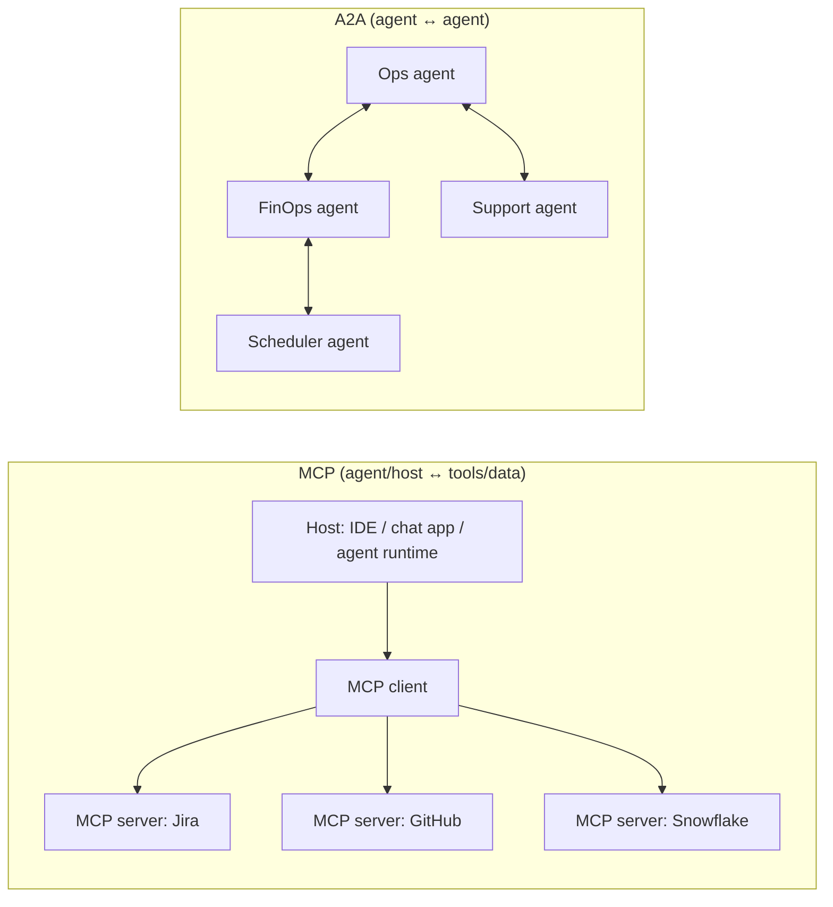

## PART VII: AI TOOLS & FRAMEWORKS (Agents + LLM Apps)

**Important note:** This part is **not** official exam content/scope. It's included as an author-curated reference to capture extra details and practical ecosystem knowledge that often helps in real projects (and sometimes informs exam intuition).

This part is a **tooling map** (commercial + open-source) for building LLM apps and AI agents. The goal is to help you:

- Pick the right layer to "buy vs build" (managed agent platform vs OSS framework vs custom code).
- Recognize common tool categories that show up in exam-style scenarios (RAG, orchestration, guardrails, eval/observability, serving).
- Translate requirements (latency, governance, data access, compliance, cost) into a concrete stack.

### Table of Contents

**Foundations & Core Concepts**:

- [7.1 Ecosystem Taxonomy](#71-ecosystem-taxonomy-and-layers)
- [7.2 Agent Taxonomy: Level 0-4](#72-agent-taxonomy-level-0-4)
- [7.3 Google's Official Agent Whitepapers](#73-googles-official-agent-whitepapers-kaggle-course)

**Platforms & Cloud Services**:

- [7.4 Google Cloud (Vertex AI + Agent Stack)](#74-google-cloud-vertex-ai--google-agent-stack)
- [7.5 AWS (Amazon Bedrock + Managed Agents)](#75-aws-amazon-bedrock--managed-agents)
- [7.6 Microsoft Azure (Azure AI Foundry)](#76-microsoft-azure-azure-ai-foundry--azure-openai--agent-service)
- [7.7 Cloud Platform Comparison](#77-cloud-platform-comparison-aws-vs-gcp-vs-azure)

**Frameworks & Tools**:

- [7.8 Core ML/DL Frameworks](#78-core-mldl-frameworks-foundation-of-non-llm-ml-engineering)
- [7.9 Open-Source Agent Frameworks](#79-open-source--multi-cloud-frameworks-the-app--orchestration-layer)
- [7.10 Commercial Agent Builders](#710-commercial-agent-builders-and-provider-sdks)
- [7.11 Interoperability Protocols (MCP & A2A)](#711-interoperability-protocols-mcp--a2a)

**Agent Development**:

- [7.12 Agent Frameworks Deep Dive](#712-agent-frameworks-deep-dive-building-intelligent-systems)
- [7.13 Context Management & Memory](#713-context-management-memory--session-state-for-agents)
- [7.14 Multi-Agent Patterns](#714-multi-agent-patterns-and-architectures)

**Production & Operations**:

- [7.15 Production Deployment](#715-genai--agent-production-deployment)
- [7.16 Agent Evaluation & Quality](#716-agent-evaluation-and-quality-assurance)
- [7.17 Agent Security & Governance](#717-agent-security-identity-policies-and-guard-models)
- [7.18 Prototype to Production Lifecycle](#718-prototype-to-production-operational-lifecycle)

**Advanced Topics**:

- [7.19 Agentic RAG](#719-agentic-rag-advanced-retrieval-patterns)
- [7.20 Agent-Human Interaction](#720-agent-human-interaction-computer-use-live-mode-ui-control)
- [7.21 Contracts & Multi-Agent Systems](#721-contracts-and-contract-lifecycle-multi-agent-systems)
- [7.22 Vector Stores & Retrieval Infrastructure](#722-vector-stores--retrieval-infrastructure-rag-substrate)
- [7.23 LLM Serving & Inference](#723-llm-serving--inference-engines)
- [7.24 Evaluation & Observability Tools](#724-evaluation--observability-llmops--agentops-tooling)
- [7.25 Security & Guardrails Tooling](#725-security--guardrails-tooling-checklist)
- [7.26 Default Stacks by Scenario](#726-default-stacks-by-scenario-quick-mapping)
- [7.27 AI Tools for Developers](#727-ai-tools-for-developers-and-business-users)
- [7.28 Integration Platforms](#728-integration-platforms-and-nocode-ai)
- [7.29 Domain-Specific Libraries](#729-domain--and-language-specific-ml-libraries)
- [7.30 Governance & Compliance](#730-governance-risk-and-compliance-frameworks)

---

### 7.3 Google's Official Agent Whitepapers (Kaggle Course)

Google has published comprehensive whitepapers on GenAI and agents as part of the **5-Day GenAI Intensive Course** on Kaggle. These are **critical authoritative sources** for understanding Google's official approach to agent development and production deployment.

**Source**: [5-Day Gen AI Intensive Course with Google | Kaggle](https://www.kaggle.com/learn-guide/5-day-genai)

**Complete whitepaper list**:

| Whitepaper                                                  | URL                                                                                               | Key Topics                                                                         |
| ----------------------------------------------------------- | ------------------------------------------------------------------------------------------------- | ---------------------------------------------------------------------------------- |
| **Foundational LLM and Text Generation**                    | [Link](https://www.kaggle.com/whitepaper-foundational-llm-and-text-generation)                    | LLM evolution, transformers, fine-tuning, inference acceleration, reasoning models |
| **Embeddings and Vector Stores**                            | [Link](https://www.kaggle.com/whitepaper-embeddings-and-vector-stores)                            | Embedding methods, vector search algorithms, RAG foundations                       |
| **Generative AI Agents**                                    | [Link](https://www.kaggle.com/whitepaper-agents)                                                  | Core components, production-grade frameworks, observability, domain knowledge      |
| **Introduction to Agents**                                  | [Link](https://www.kaggle.com/whitepaper-introduction-to-agents)                                  | Agent architectures, reasoning loops, tool use patterns                            |
| **Context Engineering, Sessions and Memory**                | [Link](https://www.kaggle.com/whitepaper-context-engineering-sessions-and-memory)                 | Context management, session state, memory hierarchies, ADK context architecture    |
| **Agent Tools and Interoperability with MCP**               | [Link](https://www.kaggle.com/whitepaper-agent-tools-and-interoperability-with-mcp)               | MCP protocol, tool design, agent-to-tool communication                             |
| **Agent Quality**                                           | [Link](https://www.kaggle.com/whitepaper-agent-quality)                                           | Evaluation metrics, quality assurance, testing strategies                          |
| **Prototype to Production**                                 | [Link](https://www.kaggle.com/whitepaper-prototype-to-production)                                 | CI/CD, scaling, A2A interoperability, production deployment                        |
| **Solving Domain-Specific Problems Using LLMs**             | [Link](https://www.kaggle.com/whitepaper-solving-domains-specific-problems-using-llms)            | Specialized LLMs (SecLM, Med-PaLM), domain adaptation                              |
| **Operationalizing Generative AI on Vertex AI using MLOps** | [Link](https://www.kaggle.com/whitepaper-operationalizing-generative-ai-on-vertex-ai-using-mlops) | MLOps for GenAI, Vertex AI tooling, deployment pipelines                           |

**Why these matter for the exam**:

- These whitepapers represent **Google's official perspective** on agent architecture and best practices
- They provide **production-grade patterns** that align with exam scenarios
- They cover **critical concepts** like context engineering, observability, and quality assurance
- They demonstrate **Google Cloud's approach** to agent deployment and management

**Note**: Access to these whitepapers requires Kaggle account registration. The course also includes hands-on notebooks, case studies, and interactive conversations via NotebookLM.

---

## 7.3.1 Key Concepts from Google's Agent Whitepapers

This section integrates critical insights from Google's official Kaggle whitepapers, organized by topic area. These concepts are foundational and referenced throughout this guide.

### Production-Grade Agent Framework Requirements

Source: [Generative AI Agents Whitepaper](https://www.kaggle.com/whitepaper-agents)

A production-grade agent framework must satisfy three critical requirements:

| Requirement         | Description                                                                                                                | Why It Matters                                                                    |
| ------------------- | -------------------------------------------------------------------------------------------------------------------------- | --------------------------------------------------------------------------------- |
| **Open**            | Allow plug-in of any model or tool to prevent vendor lock-in                                                               | Flexibility to switch models, integrate custom tools, avoid platform dependencies |
| **Precise Control** | Enable hybrid approach where non-deterministic LM reasoning is governed by hard-coded business rules                       | Enforce policies, constraints, and deterministic logic where needed               |
| **Observability**   | Generate detailed traces and logs exposing reasoning trajectory, internal monologue, tool choices, parameters, and results | Debug unexpected behavior, audit decisions, improve over time                     |

**The observability requirement is especially critical**: For unexpected agent behavior, a robust framework must expose:

- **Reasoning trajectory**: The sequence of thoughts/decisions
- **Internal monologue**: What the agent "thought" at each step
- **Tool choices**: Which tools were selected and why
- **Parameters generated**: The exact inputs passed to tools
- **Results observed**: What the agent learned from tool outputs

**EXAM TIP:** When questions mention "debugging agent behavior", "unexpected outputs", or "production reliability" → think **observability** (traces, logs, reasoning exposure).

### Instructing Agents with Domain Knowledge and Persona

Source: [Generative AI Agents Whitepaper](https://www.kaggle.com/whitepaper-agents)

The **system prompt** (or core instructions) is the **agent's constitution** — it defines:

- **Domain knowledge**: What the agent knows about the problem space
- **Persona**: How the agent should behave, communicate, and make decisions
- **Constraints**: What the agent must or must not do

**Best practices**:

- **Be explicit**: Clearly state the agent's role, expertise, and boundaries
- **Include examples**: Few-shot examples in the system prompt guide behavior
- **Separate concerns**: System instructions (constitution) vs user messages (requests)
- **Version control**: Treat system prompts as code; track changes, test variations

**The agent spectrum**:

Agents exist on a spectrum from **tools** (augmenting existing processes) to **autonomous drivers** (dynamically adapting, planning, and executing tasks to achieve goals).

| Position on Spectrum  | Description                                                 | Use Case Example                             |
| --------------------- | ----------------------------------------------------------- | -------------------------------------------- |
| **Tool**              | Agent augments existing processes; human remains in control | Code completion, content suggestions         |
| **Assistant**         | Agent handles routine tasks; human reviews/approves         | Email triage, ticket routing                 |
| **Autonomous Driver** | Agent plans and executes multi-step tasks independently     | Research agent, automated workflow execution |

**EXAM TIP:** Questions about "agent autonomy" or "human-in-the-loop" → consider where on this spectrum the use case falls.

### No-Code Builders vs Code-First Frameworks

Source: [Generative AI Agents Whitepaper](https://www.kaggle.com/whitepaper-agents)

| Approach             | Best For                                                          | Example                                                                 |
| -------------------- | ----------------------------------------------------------------- | ----------------------------------------------------------------------- |
| **No-code builders** | Speed and accessibility; empowering business users; simple agents | Vertex AI Agent Builder, low-code automation tools                      |
| **Code-first**       | Complex, mission-critical systems; custom logic; deep control     | ADK (Agent Development Kit), LangGraph, custom Python/TypeScript agents |

**When to choose code-first**:

- You need **custom business logic** that can't be expressed in visual builders
- You require **precise control** over agent behavior and error handling
- You need **deep integration** with existing systems and APIs
- You want **version control** and **testability** of agent logic

**ADK as code-first example**: Provides deep control, customizability, and integration capabilities for engineers building production agents.

---

### Context Engineering: Sessions and Memory (Deep Dive)

Source: [Context Engineering, Sessions and Memory Whitepaper](https://www.kaggle.com/whitepaper-context-engineering-sessions-and-memory)

This whitepaper aligns with ADK's context engineering approach (covered in § 7.5.5). Key concepts:

#### The Context Problem

As agents run longer, context explodes:

- **Chat history** grows linearly with each turn
- **Tool outputs** accumulate (API responses, database results, code execution)
- **Intermediate reasoning** (chain-of-thought, planning steps) adds tokens
- **External documents** (RAG results, file contents) bloat the window

#### Context Engineering Solutions

| Strategy                     | How It Works                                                         | When to Use                                                            |
| ---------------------------- | -------------------------------------------------------------------- | ---------------------------------------------------------------------- |
| **Session management**       | Persistent conversation state across turns; structured event logs    | Multi-turn conversations, workflow continuity                          |
| **Memory hierarchies**       | Short-term (session) vs long-term (cross-session) vs semantic memory | Agents that need to remember users, preferences, past decisions        |
| **Artifact externalization** | Large data stored separately; referenced, not pasted into prompts    | File processing, large API responses, intermediate computation results |
| **Context compilation**      | Build working context from sources via explicit processors/pipelines | When you need fine-grained control over what the model sees            |

#### Memory Types (from whitepaper)

| Memory Type           | Lifespan      | Content                                    | Access Pattern                  |
| --------------------- | ------------- | ------------------------------------------ | ------------------------------- |
| **Working memory**    | Current turn  | Immediate context for this reasoning step  | Always included                 |
| **Session memory**    | Conversation  | Full conversation history, tool calls      | Sliding window or summarization |
| **Episodic memory**   | Cross-session | Significant past interactions, outcomes    | Retrieved via similarity search |
| **Semantic memory**   | Permanent     | Facts, preferences, learned patterns       | Retrieved via embeddings        |
| **Procedural memory** | Permanent     | Learned workflows, task-specific behaviors | Triggered by task patterns      |

**EXAM TIP:** Questions about "agent forgetting" or "maintaining context" → think **session management + memory hierarchies**.

---

### Agent Tools and Interoperability with MCP

Source: [Agent Tools and Interoperability with MCP Whitepaper](https://www.kaggle.com/whitepaper-agent-tools-and-interoperability-with-mcp)

#### Tool Design Principles

| Principle              | Description                                                         | Example                                                                    |
| ---------------------- | ------------------------------------------------------------------- | -------------------------------------------------------------------------- |
| **Idempotency**        | Tool calls should be safe to retry; same inputs → same outputs      | Database queries, read-only API calls                                      |
| **Atomicity**          | Tool either succeeds completely or fails cleanly; no partial states | File writes, transaction commits                                           |
| **Observability**      | Tools should log inputs/outputs for debugging                       | All tool calls logged with timestamps, parameters, results                 |
| **Error handling**     | Tools should return structured errors, not crash                    | Return `{"error": "reason", "retryable": true}` instead of exceptions      |
| **Scoped permissions** | Tools should operate with least-privilege credentials               | Database tool uses read-only credentials unless write is explicitly needed |

#### MCP (Model Context Protocol) Deep Dive

MCP enables **standardized communication** between agents/hosts and tools/data sources.

**MCP Architecture**:

```
┌─────────────────────────────────────────────────────────────────┐
│                    MCP ECOSYSTEM                                 │
├─────────────────────────────────────────────────────────────────┤
│                                                                 │
│  ┌──────────────┐         ┌──────────────┐                      │
│  │   Host      │         │  MCP Server  │                      │
│  │ (Agent/IDE) │◄───────►│  (Tool/Data) │                      │
│  └──────────────┘         └──────────────┘                      │
│         │                        │                               │
│         │  MCP Protocol          │                               │
│         │  (JSON-RPC 2.0)       │                               │
│         │                        │                               │
│         ▼                        ▼                               │
│  ┌──────────────────────────────────────────┐                  │
│  │         MCP Capabilities                   │                  │
│  ├──────────────────────────────────────────┤                  │
│  │ • Tools (callable functions)              │                  │
│  │ • Resources (files, KB snippets, data)   │                  │
│  │ • Prompts (reusable prompt templates)      │                  │
│  │ • Sampling (LLM inference requests)       │                  │
│  └──────────────────────────────────────────┘                  │
│                                                                 │
└─────────────────────────────────────────────────────────────────┘
```

**MCP Server Types**:

| Server Type         | Purpose                      | Example Implementations                      |
| ------------------- | ---------------------------- | -------------------------------------------- |
| **Tool Server**     | Expose callable functions    | GitHub MCP (create issues, PRs), Jira MCP    |
| **Resource Server** | Provide access to data/files | File system MCP, database MCP, Snowflake MCP |
| **Hybrid Server**   | Both tools and resources     | Most production MCP servers                  |

**MCP Security** (from whitepaper):

| Security Concern      | MCP Solution                                           |
| --------------------- | ------------------------------------------------------ |
| **Authentication**    | OAuth 2.1, API keys, or custom auth per server         |
| **Authorization**     | Resource indicators prevent token reuse attacks        |
| **Confused deputy**   | Explicit resource scoping prevents unauthorized access |
| **Session hijacking** | Short-lived tokens, secure transport (TLS)             |

**EXAM TIP:** Questions about "agent tool integration" or "standardized agent communication" → think **MCP protocol**.

---

### Agent Quality: Evaluation and Testing

Source: [Agent Quality Whitepaper](https://www.kaggle.com/whitepaper-agent-quality)

Agent evaluation differs from traditional ML evaluation because:

- **Non-deterministic outputs**: Same input can produce different valid outputs
- **Multi-step trajectories**: Success depends on the entire sequence of actions
- **Tool interactions**: Quality depends on tool selection and parameter generation
- **Context-dependent**: Performance varies with conversation history and state

#### Evaluation Dimensions

| Dimension           | What to Measure                     | Metrics                                                          |
| ------------------- | ----------------------------------- | ---------------------------------------------------------------- |
| **Task completion** | Did the agent achieve the goal?     | Success rate, goal achievement score                             |
| **Correctness**     | Are the outputs factually accurate? | Accuracy, factual consistency, grounding verification            |
| **Efficiency**      | How many steps/tokens did it take?  | Steps to completion, token usage, cost per task                  |
| **Reliability**     | Does it work consistently?          | Success rate variance, failure modes, edge case handling         |
| **Safety**          | Does it avoid harmful outputs?      | Safety violation rate, guardrail triggers, content filter blocks |

#### Evaluation Strategies

| Strategy                | Description                                                 | When to Use                                                    |
| ----------------------- | ----------------------------------------------------------- | -------------------------------------------------------------- |
| **Unit testing**        | Test individual tool calls, prompt templates, parsing logic | During development, CI/CD pipeline                             |
| **Integration testing** | Test agent + tools + external systems together              | Before deployment, regression testing                          |
| **End-to-end testing**  | Test complete agent workflows with realistic scenarios      | Pre-production validation, acceptance testing                  |
| **LLM-as-judge**        | Use another LLM to evaluate agent outputs                   | When human evaluation is expensive; for large-scale evaluation |
| **Human evaluation**    | Human reviewers assess quality, correctness, safety         | High-stakes decisions, final validation, edge cases            |
| **A/B testing**         | Compare agent versions in production                        | Gradual rollouts, prompt optimization, model selection         |

#### Quality Metrics for Agents

| Metric Category        | Specific Metrics                                                    |
| ---------------------- | ------------------------------------------------------------------- |
| **Task success**       | Task completion rate, goal achievement score, user satisfaction     |
| **Tool usage**         | Tool call accuracy, parameter correctness, tool selection precision |
| **Trajectory quality** | Steps to completion, backtracking frequency, plan adherence         |
| **Response quality**   | Relevance, coherence, helpfulness, factual accuracy                 |
| **Cost efficiency**    | Tokens per task, cost per successful task, tool call costs          |
| **Safety**             | Guardrail trigger rate, harmful content rate, PII leakage rate      |

**EXAM TIP:** Questions about "agent evaluation" or "quality assurance" → think **multi-dimensional evaluation** (not just accuracy) + **trajectory analysis** + **safety metrics**.

---

## 7.18 Prototype to Production: Operational Lifecycle

Source: [Prototype to Production Whitepaper](https://www.kaggle.com/whitepaper-prototype-to-production)

**Authors**: Sokratis Kartakis, Gabriela Hernandez Larios, Ran Li, Elia Secchi, and Huang Xia

This whitepaper provides a comprehensive guide to the **operational lifecycle of AI agents**, focusing on deployment, scaling, and productionizing.

**Practical Implementation**: Throughout this whitepaper, examples reference the **Google Cloud Platform Agent Starter Pack**—a Python package providing production-ready Generative AI agent templates for Google Cloud. It includes pre-built agents, automated CI/CD setup, Terraform deployment, Vertex AI evaluation integration, and built-in Google Cloud observability. See: `https://github.com/GoogleCloudPlatform/agent-starter-pack`

#### People and Process: The Team Behind Production Agents

**Why focus on people and process?** The best technology is ineffective without the right team to build, manage, and govern it.

**Traditional MLOps Teams**:

| Team                        | Responsibilities                                                                                                                          |
| --------------------------- | ----------------------------------------------------------------------------------------------------------------------------------------- |
| **Cloud Platform Team**     | Cloud architects, administrators, security specialists; manage infrastructure, security, access control; grant least-privilege roles      |
| **Data Engineering Team**   | Data engineers and data owners; build/maintain data pipelines, handle ingestion, preparation, quality standards                           |
| **Data Science/MLOps Team** | Data scientists (experiment/train models), ML engineers (automate ML pipelines), MLOps Engineers (build/maintain pipeline infrastructure) |
| **ML Governance**           | Product owners, auditors; oversee ML lifecycle, ensure compliance, transparency, accountability                                           |

**Generative AI introduces new specialized roles**:

| Role                      | Responsibilities                                                                                                                                                  |
| ------------------------- | ----------------------------------------------------------------------------------------------------------------------------------------------------------------- |
| **Prompt Engineers**      | Blend technical skill in crafting prompts with deep domain expertise; define right questions and expected answers (may be done by AI Engineers or domain experts) |
| **AI Engineers**          | Scale GenAI solutions to production; build robust backend systems with evaluation at scale, guardrails, RAG/tool integration                                      |
| **DevOps/App Developers** | Build front-end components and user-friendly interfaces that integrate with GenAI backend                                                                         |

**EXAM TIP:** Questions about "who builds agents" or "team structure" → think **AI Engineers** (backend) + **Prompt Engineers** (prompts) + **DevOps** (frontend) + **Cloud Platform Team** (infrastructure).

#### Evaluation-Gated Deployment: The Core Principle

**Core principle**: **No agent version should reach users without first passing a comprehensive evaluation** that proves its quality and safety.

**Two implementation methods**:

1. **Manual "Pre-PR" Evaluation**:

   - AI Engineer/Prompt Engineer runs evaluation suite locally before PR
   - Performance report (comparing new agent vs production baseline) linked in PR description
   - Reviewer (AI Engineer or ML Governor) assesses code + behavioral changes
   - **Use case**: Teams seeking flexibility or beginning their evaluation journey

2. **Automated In-Pipeline Gate**:
   - Evaluation harness integrated directly into CI/CD pipeline
   - Failing evaluation automatically blocks deployment
   - Programmatic enforcement of quality standards
   - **Use case**: Mature teams prioritizing consistency over flexibility

**EXAM TIP:** Questions about "quality gates" or "pre-production validation" → think **Evaluation-Gated Deployment** (manual pre-PR or automated CI/CD gate).

#### Three-Phase CI/CD Pipeline

A robust pipeline is designed as a **funnel**—catching errors as early and cheaply as possible ("shifting left").

**Phase 1: Pre-Merge Integration (CI)**

- **Purpose**: Rapid feedback to developer who opened PR
- **Checks**: Unit tests, code linting, dependency scanning, **agent quality evaluation suite**
- **Benefit**: Prevents polluting main branch; catches performance degradation before merge
- **Example**: Cloud Build PR checks template from Agent Starter Pack

**Phase 2: Post-Merge Validation in Staging (CD)**

- **Purpose**: Operational readiness of integrated system
- **Process**: Package agent → deploy to staging (high-fidelity replica of production)
- **Tests**: Load testing, integration tests against remote services, **internal user testing ("dogfooding")**
- **Benefit**: Validates agent as integrated system under production-like conditions
- **Example**: Staging deployment template from Agent Starter Pack

**Phase 3: Gated Deployment to Production**

- **Purpose**: Final deployment to production
- **Process**: Product Owner gives final sign-off (human-in-the-loop) → exact artifact from staging promoted to production
- **Benefit**: Ensures production deployment matches tested staging artifact
- **Example**: Production deployment template from Agent Starter Pack

**Key technologies**:

- **Infrastructure as Code (IaC)**: Terraform defines environments programmatically (identical, repeatable, version-controlled)
- **Automated Testing Frameworks**: Pytest executes tests/evaluations at each stage
- **Secret Management**: Secret Manager for API keys (injected at runtime, not hardcoded)

**EXAM TIP:** Questions about "CI/CD for agents" → think **three-phase pipeline**: Pre-merge (CI) → Staging (CD) → Production (gated).

#### Safe Rollout Strategies

**Four proven patterns** for gradual rollouts:

| Strategy          | Description                                                                                                                                      | Use Case                  |
| ----------------- | ------------------------------------------------------------------------------------------------------------------------------------------------ | ------------------------- |
| **Canary**        | Start with 1% of users; monitor for prompt injections, unexpected tool usage; scale up gradually or roll back instantly                          | Low-risk initial rollout  |
| **Blue-Green**    | Run two identical production environments; route traffic to "blue" while deploying to "green"; switch instantly; zero downtime, instant recovery | Zero-downtime deployments |
| **A/B Testing**   | Compare agent versions on real business metrics for data-driven decisions (internal or external users)                                           | Comparing agent versions  |
| **Feature Flags** | Deploy code but control release dynamically; test new capabilities with select users first                                                       | Gradual feature rollout   |

**Foundation**: **Rigorous versioning**—every component (code, prompts, model endpoints, tool schemas, memory structures, evaluation datasets) must be versioned. Enables instant rollback to known-good state.

**Deployment options**: Agent Engine or Cloud Run, with Cloud Load Balancing for traffic management.

**EXAM TIP:** Questions about "safe deployment" or "gradual rollout" → think **Canary** (1% → scale up) or **Blue-Green** (zero downtime).

#### Building Security from the Start

**Unique agent risks**:

- **Prompt Injection & Rogue Actions**: Malicious users trick agents into unintended actions
- **Data Leakage**: Agents expose sensitive information through responses or tool usage
- **Memory Poisoning**: False information stored in agent's memory corrupts future interactions

**Three layers of defense** (Google's Secure AI Framework - SAIF):

1. **Policy Definition and System Instructions** (The Agent's Constitution):

   - Define policies for desired/undesired behavior
   - Engineer into System Instructions (SIs)

2. **Guardrails, Safeguards, and Filtering** (The Enforcement Layer):

   - **Input Filtering**: Classifiers (e.g., Perspective API) analyze prompts, block malicious inputs
   - **Output Filtering**: Vertex AI's built-in safety filters check for harmful content, PII, policy violations
   - **Human-in-the-Loop (HITL) Escalation**: Pause and escalate high-risk/ambiguous actions for human review

3. **Continuous Assurance and Testing**:
   - **Rigorous Evaluation**: Any change triggers full re-run of evaluation pipeline (Vertex AI Evaluation)
   - **Dedicated RAI Testing**: Test for specific risks (NPOV evaluations, Parity evaluations)
   - **Proactive Red Teaming**: Actively try to break safety systems through creative manual testing and AI-driven simulation

**EXAM TIP:** Questions about "agent security" → think **three-layer defense**: System Instructions + Guardrails/Filtering + Continuous Assurance.

#### Operations in Production: Observe → Act → Evolve Loop

**Core discipline**: Instead of static monitoring, adopt a continuous loop:

1. **Observe**: Understand agent's behavior in real-time
2. **Act**: Real-time intervention to maintain performance, cost, safety
3. **Evolve**: Long-term strategic improvement based on production learnings

**Observe: Your Agent's Sensory System**

**Three pillars of observability**:

| Pillar      | Description                                                                         | Example                                                                                       |
| ----------- | ----------------------------------------------------------------------------------- | --------------------------------------------------------------------------------------------- |
| **Logs**    | Granular, factual diary of what happened (every tool call, error, decision)         | Cloud Logging                                                                                 |
| **Traces**  | Narrative connecting individual logs (reveals causal path of why agent took action) | Cloud Trace (unique ID links Vertex AI Agent Engine invocation, model calls, tool executions) |
| **Metrics** | Aggregated report card (performance, cost, operational health at scale)             | Cloud Monitoring dashboards (alert when latency thresholds exceeded)                          |

**ADK Integration**: Agent Development Kit provides built-in Cloud Trace integration for automatic instrumentation.

**Act: The Levers of Operational Control**

**Two categories of operational levers**:

1. **Managing System Health: Performance, Cost, and Scale**

   **Designing for Scale**:

   - **Horizontal Scaling**: Design agent as stateless, containerized service; external state enables any instance to handle any request (Cloud Run, Vertex AI Agent Engine Runtime)
   - **Asynchronous Processing**: Offload long-running tasks using event-driven patterns (Pub/Sub → Cloud Run)
   - **Externalized State Management**: Persist memory externally (Vertex AI Agent Engine built-in Session/memory service, or Cloud Run + AlloyDB/Cloud SQL)

   **Balancing Competing Goals**:

   - **Speed (Latency)**: Parallel processing, aggressive caching, smaller efficient models for routine tasks
   - **Reliability**: Automatic retries with exponential backoff; design idempotent tools (safe-to-retry)
   - **Cost**: Shorten prompts, use cheaper models for easier tasks, batch requests

2. **Managing Risk: The Security Response Playbook**

   **Sequence**: **Contain → Triage → Resolve**

   - **Contain**: Immediate containment via "circuit breaker" (feature flag to disable affected tool)
   - **Triage**: Route suspicious requests to HITL review queue; investigate exploit scope/impact
   - **Resolve**: Develop patch (updated input filter, system prompt); deploy via automated CI/CD pipeline

**Evolve: Learning from Production**

**The Evolution Workflow**:

1. **Analyze Production Data**: Identify trends in user behavior, task success rates, security incidents
2. **Update Evaluation Datasets**: Transform production failures into test cases (augment golden dataset)
3. **Refine and Deploy**: Commit improvements → trigger automated pipeline (refine prompts, add tools, update guardrails)

**Example**: Retail agent logs show 15% of users receive error when asking for 'similar products' → Create failing test case → Engineer refines prompt + adds robust similarity search tool → Commits change → Passes updated evaluation suite → Safely rolled out via canary deployment → Resolved in under 48 hours.

**Evolving Security**: Production feedback loop for security:

- **Observe**: Monitoring detects new threat vector (novel prompt injection, unexpected data leak)
- **Act**: Security response team contains threat
- **Evolve**: Feed insight back into development lifecycle:
  - Update evaluation datasets (add attack as permanent test case)
  - Refine guardrails (update system prompt, input filters, tool-use policies)
  - Automate and deploy (commit change → CI/CD validates → deploy)

**EXAM TIP:** Questions about "production operations" or "continuous improvement" → think **Observe → Act → Evolve loop**.

#### A2A Implementation: Agent Cards and Code Examples

**Agent Card**: Standardized JSON specification acting as "business card" for each agent.

**Agent Card structure**:

```json
{
  "name": "check_prime_agent",
  "version": "1.0.0",
  "description": "An agent specialized in checking whether numbers are prime",
  "capabilities": {},
  "securitySchemes": {
    "agent_oauth_2_0": {
      "type": "oauth2"
    }
  },
  "defaultInputModes": ["text/plain"],
  "defaultOutputModes": ["application/json"],
  "skills": [
    {
      "id": "prime_checking",
      "name": "Prime Number Checking",
      "description": "Check if numbers are prime using efficient algorithms",
      "tags": ["mathematical", "computation", "prime"]
    }
  ],
  "url": "http://localhost:8001/a2a/check_prime_agent"
}
```

**Making an agent A2A-compatible (ADK)**:

```python
from google.adk.a2a.utils.agent_to_a2a import to_a2a

# Your existing agent
root_agent = Agent(
    name='hello_world_agent',
    # ... your agent code ...
)

# Make it A2A-compatible
a2a_app = to_a2a(root_agent, port=8001)
# Serve with uvicorn or Agent Engine
```

**Consuming a remote agent via A2A (ADK)**:

```python
from google.adk.agents.remote_a2a_agent import RemoteA2aAgent

prime_agent = RemoteA2aAgent(
    name="prime_agent",
    description="Agent that handles checking if numbers are prime.",
    agent_card="http://localhost:8001/a2a/check_prime_agent/.well-known/agent-card.json"
)
```

**Hierarchical agent composition**:

```python
# Local sub-agent for dice rolling
roll_agent = Agent(
    name="roll_agent",
    instruction="You are an expert at rolling dice."
)

# Remote A2A agent for prime checking
prime_agent = RemoteA2aAgent(
    name="prime_agent",
    agent_card="http://localhost:8001/.well-known/agent-card.json"
)

# Root orchestrator combining both
root_agent = Agent(
    name="root_agent",
    instruction="Delegate rolling dice to roll_agent, prime checking to prime_agent.",
    sub_agents=[roll_agent, prime_agent]
)
```

**Non-negotiable technical requirements**:

- **Distributed tracing**: Every request carries unique trace ID (essential for debugging, audit trail)
- **Robust state management**: A2A interactions are stateful; require sophisticated persistence layer

**When to use A2A vs local sub-agents**:

- **A2A**: Formal, cross-team integrations requiring durable service contract
- **Local sub-agents**: Tightly coupled tasks within single application (more efficient)

**EXAM TIP:** Questions about "agent discovery" or "agent-to-agent communication" → think **Agent Cards** (JSON specification) + **A2A protocol**.

#### How A2A and MCP Work Together

**They are complementary, not competing**:

| Protocol | Domain                            | Use Case Example                                                                    |
| -------- | --------------------------------- | ----------------------------------------------------------------------------------- |
| **MCP**  | Tools and resources (primitives)  | Calculator, database API, weather API                                               |
| **A2A**  | Other agents (autonomous systems) | "Analyze last quarter's customer churn and recommend three intervention strategies" |

**Layered architecture**: Use **A2A** for high-level agent collaboration; each agent internally uses **MCP** to interact with its specific tools.

**Example workflow** (auto repair shop):

1. **User-to-Agent (A2A)**: Customer communicates with "Shop Manager" agent
2. **Agent-to-Agent (A2A)**: Shop Manager delegates to specialized "Mechanic" agent
3. **Agent-to-Tool (MCP)**: Mechanic agent uses MCP to call tools (`scan_vehicle_for_error_codes()`, `get_repair_procedure()`, `raise_platform()`)
4. **Agent-to-Agent (A2A)**: Mechanic communicates with external "Parts Supplier" agent

**EXAM TIP:** Questions about "MCP vs A2A" → **MCP** for tools/resources, **A2A** for agent-to-agent collaboration.

**For detailed A2A implementation** (Agent Cards, code examples, hierarchical composition), see [§ 7.18 Prototype to Production: A2A Implementation](#718-prototype-to-production-operational-lifecycle).

#### Registry Architectures: When and How to Build Them

**Decision framework**: Build registries when scale/complexity demands centralized management.

**Tool Registry** (using MCP):

- **Purpose**: Catalog all assets (functions, APIs)
- **Patterns**:
  - **Generalist agents**: Access full catalog (trades speed/accuracy for scope)
  - **Specialist agents**: Use predefined subsets (higher performance)
  - **Dynamic agents**: Query registry at runtime (adapt to new tools)
- **Benefits**: Human discovery (developers search before building duplicates), security auditing, capability understanding
- **Build when**: Tool discovery becomes bottleneck OR security requires centralized auditing

**Agent Registry** (using A2A AgentCards):

- **Purpose**: Catalog agents for discovery and reuse
- **Benefits**: Teams discover/reuse existing agents, reduce redundant work, enable automated agent-to-agent delegation
- **Build when**: Multiple teams need to discover/reuse specialized agents without tight coupling

**Trade-off**: Registries offer discovery and governance at the cost of maintenance. **Start without one**; build when ecosystem scale demands centralized management.

**EXAM TIP:** Questions about "tool/agent discovery" or "centralized management" → think **Tool Registry** (MCP) or **Agent Registry** (A2A AgentCards) when scale/complexity demands it.

#### AgentOps Lifecycle: Complete Reference Architecture

**The lifecycle**:

1. **Developer's Inner Loop**: Rapid local testing and prototyping to shape agent's core logic
2. **Pre-Production Engine**: Automated evaluation gates validate quality and safety against golden dataset
3. **Safe Rollouts**: Release to production with gradual rollout strategies
4. **Production Observability**: Comprehensive observability captures real-world data
5. **Evolution Loop**: Turn every insight into the next improvement

**Key capabilities**:

- **Evaluation**: Golden datasets, LLM-as-judge, trajectory evaluation
- **CI/CD**: Three-phase pipeline (Pre-merge → Staging → Production)
- **Observability**: Logs, traces, metrics (Cloud Logging, Cloud Trace, Cloud Monitoring)
- **Security**: Three-layer defense (System Instructions + Guardrails + Continuous Assurance)
- **Interoperability**: A2A protocol, MCP protocol, registries

**EXAM TIP:** Questions about "agent operations" or "production lifecycle" → think **AgentOps**: Evaluation-gated deployment → Safe rollouts → Observe → Act → Evolve loop.

#### Key Challenges in Production

| Challenge            | Description                                                            | Mitigation Strategy                                                |
| -------------------- | ---------------------------------------------------------------------- | ------------------------------------------------------------------ |
| **Reliability**      | Agents can fail unpredictably; tool calls may timeout or return errors | Retries, fallbacks, circuit breakers, graceful degradation         |
| **Scalability**      | Agent workloads are bursty; context management is expensive            | Auto-scaling, context optimization, caching, async processing      |
| **Observability**    | Non-deterministic behavior makes debugging difficult                   | Comprehensive logging, tracing, metrics, reasoning exposure        |
| **Cost control**     | LLM calls and tool usage can spiral without limits                     | Token budgets, cost tracking, rate limiting, model tier routing    |
| **Security**         | Agents have expanded attack surface (prompt injection, tool misuse)    | Input/output guardrails, tool-level validation, IAM, audit logging |
| **Interoperability** | Agents need to communicate with each other and external systems        | A2A protocol, MCP, standardized APIs, event-driven architecture    |

#### CI/CD for Agents: Comparison Table and Pipeline Diagram

**Note**: For detailed explanation of the three-phase pipeline (Pre-Merge → Staging → Production), see [§ 7.18: Three-Phase CI/CD Pipeline](#three-phase-cicd-pipeline) above.

**Traditional CI/CD** → **Agent CI/CD** comparison:

| Stage       | Traditional                     | Agent-Specific                                                          |
| ----------- | ------------------------------- | ----------------------------------------------------------------------- |
| **Build**   | Compile code, run unit tests    | Validate prompts, test tool integrations, check context compilation     |
| **Test**    | Unit tests, integration tests   | Agent trajectory tests, LLM-as-judge evaluation, safety checks          |
| **Deploy**  | Blue/green, canary              | Canary with eval metrics, shadow mode, A/B testing with quality gates   |
| **Monitor** | Latency, error rate, throughput | Task success rate, tool call accuracy, cost per task, safety violations |

**Agent-specific CI/CD pipeline**:

```
┌────────────────────────────────────────────────────────────────────────┐
│                    AGENT CI/CD PIPELINE                                 │
├────────────────────────────────────────────────────────────────────────┤
│                                                                        │
│  Code Commit                                                           │
│      │                                                                 │
│      ▼                                                                 │
│  ┌─────────────────┐                                                   │
│  │  Build & Lint   │  • Validate prompts                              │
│  │                 │  • Check tool schemas                             │
│  │                 │  • Verify context processors                     │
│  └────────┬────────┘                                                   │
│           │                                                            │
│           ▼                                                            │
│  ┌─────────────────┐                                                   │
│  │  Unit Tests      │  • Tool function tests                           │
│  │                 │  • Prompt template tests                          │
│  │                 │  • Context compilation tests                      │
│  └────────┬────────┘                                                   │
│           │                                                            │
│           ▼                                                            │
│  ┌─────────────────┐                                                   │
│  │  Agent Eval      │  • Trajectory evaluation                         │
│  │                 │  • LLM-as-judge quality checks                   │
│  │                 │  • Safety/guardrail tests                         │
│  │                 │  • Cost estimation                               │
│  └────────┬────────┘                                                   │
│           │                                                            │
│           ▼                                                            │
│  ┌─────────────────┐                                                   │
│  │  Security Scan   │  • Prompt injection detection                    │
│  │                 │  • Tool permission audit                          │
│  │                 │  • PII detection                                 │
│  └────────┬────────┘                                                   │
│           │                                                            │
│           ▼                                                            │
│  ┌─────────────────┐                                                   │
│  │  Staging         │  • Shadow mode (log, don't act)                  │
│  │                 │  • A/B testing with eval metrics                 │
│  └────────┬────────┘                                                   │
│           │                                                            │
│           ▼                                                            │
│  ┌─────────────────┐                                                   │
│  │  Production      │  • Canary deployment                            │
│  │                 │  • Automatic rollback on quality degradation     │
│  └─────────────────┘                                                   │
│                                                                        │
└────────────────────────────────────────────────────────────────────────┘
```

**Note**: For A2A implementation details (Agent Cards, code examples, hierarchical composition), see [§ 7.18: A2A Implementation](#a2a-implementation-agent-cards-and-code-examples) above. For foundational concepts on A2A vs MCP, see [§ 7.11 Interoperability Protocols](#711-interoperability-protocols-mcp--a2a-the-agent-internet).

---

### 7.3.2 Embeddings and Vector Stores (RAG Foundations)

Source: [Embeddings and Vector Stores Whitepaper](https://www.kaggle.com/whitepaper-embeddings-and-vector-stores)

This whitepaper covers the foundational concepts for RAG (Retrieval-Augmented Generation).

#### Embedding Methods

| Method                    | Description                                             | Use Case                                              |
| ------------------------- | ------------------------------------------------------- | ----------------------------------------------------- |
| **Dense embeddings**      | Fixed-size vectors capturing semantic meaning           | Semantic search, similarity matching                  |
| **Sparse embeddings**     | High-dimensional vectors with many zeros (BM25, SPLADE) | Keyword-based search, exact match retrieval           |
| **Hybrid search**         | Combine dense + sparse for best of both worlds          | Production RAG systems (semantic + keyword matching)  |
| **Multimodal embeddings** | Embeddings for images, audio, video alongside text      | Cross-modal retrieval (find images from text queries) |

#### Vector Search Algorithms

| Algorithm                                     | Description                                        | Trade-offs                                              |
| --------------------------------------------- | -------------------------------------------------- | ------------------------------------------------------- |
| **Exact search**                              | Linear scan or exhaustive comparison               | Accurate but slow for large datasets                    |
| **Approximate Nearest Neighbor (ANN)**        | Fast approximate search with configurable accuracy | Speed vs accuracy trade-off (HNSW, IVF, LSH)            |
| **HNSW (Hierarchical Navigable Small World)** | Graph-based ANN with good accuracy/speed balance   | Popular choice for production (used by many vector DBs) |

#### Vector Store Selection Criteria

| Criterion                  | Questions to Ask                       | Examples                                             |
| -------------------------- | -------------------------------------- | ---------------------------------------------------- |
| **Scale**                  | How many vectors? How many dimensions? | pgvector (millions), Milvus (billions)               |
| **Latency**                | What's the acceptable query time?      | In-memory (fastest), disk-based (slower but cheaper) |
| **Persistence**            | Do you need durability?                | Redis (ephemeral), PostgreSQL + pgvector (durable)   |
| **Metadata filtering**     | Do you need to filter by attributes?   | Weaviate, Qdrant (strong metadata support)           |
| **Managed vs self-hosted** | Do you want to manage infrastructure?  | Pinecone (managed), self-hosted Milvus/Weaviate      |

**EXAM TIP:** Questions about "RAG implementation" or "vector search" → think **embedding method** (dense/sparse/hybrid) + **ANN algorithm** (HNSW) + **vector store** (managed vs self-hosted).

---

### 7.3.3 Domain-Specific LLMs

Source: [Solving Domain-Specific Problems Using LLMs Whitepaper](https://www.kaggle.com/whitepaper-solving-domains-specific-problems-using-llms)

#### When to Use Domain-Specific Models

| Scenario               | Approach                                                  | Example Models                               |
| ---------------------- | --------------------------------------------------------- | -------------------------------------------- |
| **General tasks**      | Use foundation models (Gemini, GPT-4) with prompting/RAG  | Most use cases                               |
| **Specialized domain** | Fine-tune foundation model on domain data                 | Custom models for finance, legal, healthcare |
| **Regulated industry** | Domain-specific models trained with safety/accuracy focus | SecLM (security), Med-PaLM (healthcare)      |
| **Low-latency needs**  | Smaller, specialized models optimized for speed           | Edge deployment, real-time applications      |

#### Domain Adaptation Strategies

| Strategy        | Description                                                     | When to Use                                                         |
| --------------- | --------------------------------------------------------------- | ------------------------------------------------------------------- |
| **Prompting**   | Use domain-specific prompts and few-shot examples               | Quick iteration, no training data                                   |
| **RAG**         | Ground model with domain knowledge base                         | When you have domain documents/knowledge                            |
| **Fine-tuning** | Train foundation model on domain-specific data                  | When you have labeled domain data, need domain terminology          |
| **LoRA/QLoRA**  | Efficient fine-tuning with parameter-efficient methods          | When full fine-tuning is too expensive                              |
| **RLHF**        | Reinforcement Learning from Human Feedback for domain alignment | When you need to align with domain-specific preferences/constraints |

**EXAM TIP:** Questions about "specialized models" or "domain expertise" → consider **fine-tuning** (if you have domain data) vs **RAG** (if you have domain documents) vs **specialized models** (SecLM, Med-PaLM for regulated industries).

---

### 7.3.4 MLOps for Generative AI

Source: [Operationalizing Generative AI on Vertex AI using MLOps Whitepaper](https://www.kaggle.com/whitepaper-operationalizing-generative-ai-on-vertex-ai-using-mlops)

#### What's Different for GenAI MLOps

| Traditional MLOps    | GenAI MLOps                                                            |
| -------------------- | ---------------------------------------------------------------------- |
| **Model versioning** | Model weights + prompts + RAG configs + tool definitions               |
| **Evaluation**       | Accuracy metrics → Task success, quality scores, safety metrics        |
| **Monitoring**       | Prediction accuracy → Task completion, tool usage, cost, safety        |
| **Retraining**       | Data drift triggers → Prompt optimization, RAG updates, tool additions |
| **Deployment**       | Model endpoints → Agent endpoints with streaming, tool orchestration   |

#### Vertex AI Tools for GenAI MLOps

| Tool                        | Purpose                                                             | Use Case                                         |
| --------------------------- | ------------------------------------------------------------------- | ------------------------------------------------ |
| **Vertex AI Pipelines**     | Orchestrate GenAI workflows (data prep → RAG indexing → evaluation) | End-to-end GenAI pipelines                       |
| **Vertex AI Evaluation**    | Evaluate agent quality, prompt performance, RAG accuracy            | Pre-deployment validation, continuous monitoring |
| **Vertex AI Model Garden**  | Discover and deploy foundation models                               | Model selection, version management              |
| **Vertex AI Feature Store** | Manage features for traditional ML + embeddings for RAG             | Unified feature management                       |
| **Vertex AI Monitoring**    | Monitor model performance, data drift, prediction quality           | Production observability                         |

**EXAM TIP:** Questions about "GenAI deployment" or "MLOps for agents" → think **Vertex AI Pipelines** (orchestration) + **Vertex AI Evaluation** (quality gates) + **Vertex AI Monitoring** (observability).

---

## 7.16 Agent Evaluation: Outside-In vs Inside-Out Framework

Source: [Agent Quality Whitepaper](https://www.kaggle.com/whitepaper-agent-quality)

Agent evaluation requires a strategic shift from traditional software testing. The **"Outside-In" evaluation hierarchy** provides a framework for assessing agent quality.

#### The Outside-In View: End-to-End Evaluation (Black Box)

**First question**: "Did the agent achieve the user's goal effectively?"

**Metrics**:

- **Task Success Rate**: Binary/graded score of whether the final output was correct, complete, and solved the user's problem
- **User Satisfaction**: Direct feedback (thumbs up/down), CSAT scores
- **Overall Quality**: Accuracy, completeness for quantitative tasks

**EXAM TIP:** Questions about "agent quality" or "evaluation strategy" → start with **Outside-In** (end-to-end success) before diving into internal details.

#### The Inside-Out View: Trajectory Evaluation (Glass Box)

**When to use**: After identifying a failure, analyze the agent's execution trajectory.

**Components to evaluate**:

1. **LLM Planning (The "Thought")**: Core reasoning quality

   - Hallucinations, off-topic responses, context pollution, repetitive loops

2. **Tool Usage**: Selection and parameterization

   - Wrong tool selection, missing tools, hallucinated tool names, incorrect parameters

3. **Tool Response Interpretation**: Understanding tool outputs

   - Misinterpreting data, failing to extract entities, not recognizing error states

4. **RAG Performance**: Retrieval quality

   - Irrelevant documents, outdated information, LLM ignoring retrieved context

5. **Trajectory Efficiency**: Resource usage

   - Excessive API calls, high latency, redundant efforts

6. **Multi-Agent Dynamics**: Inter-agent communication
   - Communication loops, role conflicts, coordination failures

**EXAM TIP:** Questions about "debugging agent failures" or "trajectory analysis" → think **Inside-Out** evaluation (glass box).

#### Trajectory Evaluation Metrics

Source: [Agents Companion Whitepaper](https://www.kaggle.com/whitepaper-agents-companion)

| Metric              | Description                                                       | When to Use                                     |
| ------------------- | ----------------------------------------------------------------- | ----------------------------------------------- |
| **Exact match**     | Trajectory perfectly mirrors ideal solution; no deviation         | Strict workflows (e.g., financial transactions) |
| **In-order match**  | Core steps completed in order; extra actions allowed              | Flexible workflows with required sequence       |
| **Any-order match** | All necessary actions included; order doesn't matter              | Parallelizable tasks                            |
| **Precision**       | How many tool calls in predicted trajectory are relevant/correct? | Measuring tool call accuracy                    |
| **Recall**          | How many essential tool calls from reference are captured?        | Measuring completeness                          |
| **Single-tool use** | Is a specific action within the agent's trajectory?               | Testing if agent learned to use a tool          |

**EXAM TIP:** Questions about "trajectory evaluation" → consider **precision/recall** for tool usage, **exact match** for strict workflows, **any-order match** for flexible tasks.

---

## 7.17 Agent Security: Identity, Policies, and Guard Models

Source: [Introduction to Agents Whitepaper](https://www.kaggle.com/whitepaper-introduction-to-agents)

#### Agent Identity: A New Class of Principal

Agents introduce a **third category of principal** (beyond users and service accounts):

| Principal Entity     | Authentication/Verification                                | Notes                                                   |
| -------------------- | ---------------------------------------------------------- | ------------------------------------------------------- |
| **Users**            | OAuth, SSO                                                 | Human actors with full autonomy                         |
| **Agents**           | SPIFFE (Secure Production Identity Framework for Everyone) | Agents have delegated authority, act on behalf of users |
| **Service Accounts** | IAM                                                        | Applications/containers, fully deterministic            |

**Key concept**: Each agent must have a **cryptographically verifiable identity** distinct from:

- The user who invoked it
- The developer who built it

**SPIFFE** provides:

- Verifiable identity for agents
- Least-privilege permissions per agent
- Contained blast radius if an agent is compromised

**EXAM TIP:** Questions about "agent authentication" or "agent identity" → think **SPIFFE** for verifiable agent identity.

#### Policies to Constrain Access

**Policies** are authorization (AuthZ) rules that limit agent capabilities:

- **Tool-level policies**: Which APIs/tools can this agent use?
- **Data access policies**: Which databases/documents can this agent read?
- **Action policies**: What actions are allowed/forbidden (e.g., "no purchases over $100")?

**Best practice**: Apply **principle of least privilege**—grant only the minimum capabilities needed.

**EXAM TIP:** Questions about "agent authorization" or "limiting agent actions" → think **policies** + **least privilege**.

#### Defense in Depth: Guardrails and Guard Models

**Hybrid security approach**:

1. **Deterministic Guardrails** (Layer 1):

   - Hardcoded rules outside the model's reasoning
   - Policy engine blocking actions (e.g., "no purchases > $100")
   - Provides predictable, auditable limits

2. **Reasoning-Based Defenses** (Layer 2):
   - **Guard models**: Specialized smaller models acting as security analysts
   - Examine agent's proposed plan before execution
   - Flag risky or policy-violating steps for review

**EXAM TIP:** Questions about "agent security" or "preventing harmful actions" → think **defense in depth**: deterministic guardrails + guard models.

---

## 7.11.1 Agent Interoperability: A2A, AP2, and x402 (Extended Protocols)

**Note**: This section extends [§ 7.11 Interoperability Protocols](#711-interoperability-protocols-mcp--a2a-the-agent-internet) with additional protocols (AP2, x402) and advanced A2A concepts. For A2A implementation details (Agent Cards, code examples), see [§ 7.18 Prototype to Production: A2A Implementation](#718-prototype-to-production-operational-lifecycle).

Source: [Introduction to Agents Whitepaper](https://www.kaggle.com/whitepaper-introduction-to-agents)

#### Agent2Agent (A2A) Protocol

**A2A** enables agents to communicate with each other regardless of language or runtime.

**Key components**:

- **Agent Card**: JSON "business card" advertising agent capabilities, endpoint, security credentials
- **Task-oriented architecture**: Asynchronous "tasks" instead of simple request-response
- **Streaming updates**: Long-running connections for progress updates

**Use cases**:

- Multi-agent workflows
- Agent composition (building complex systems from simpler agents)
- Cross-platform integration

**EXAM TIP:** Questions about "agent-to-agent communication" → think **A2A protocol** + **Agent Cards** for discovery.

#### Agent Payments Protocol (AP2)

**AP2** is an open protocol for agentic commerce.

**Key features**:

- **Cryptographically-signed mandates**: Verifiable proof of user intent
- **Non-repudiable audit trail**: Every transaction is logged and verifiable
- **Delegated authority**: Agents can browse, negotiate, and transact on behalf of users

**Use case**: Enables agents to securely make purchases or transactions on behalf of users.

**EXAM TIP:** Questions about "agent transactions" or "agent payments" → think **AP2** for secure, auditable agent commerce.

#### x402 Payment Protocol

**x402** uses HTTP 402 "Payment Required" status code for machine-to-machine micropayments.

**Key features**:

- **Frictionless micropayments**: Pay-per-use API access or digital content
- **No complex accounts**: No subscriptions or account management needed
- **Machine-to-machine**: Designed for agent-to-service payments

**Use case**: Agent pays for API access or digital content on a per-use basis.

**EXAM TIP:** Questions about "micropayments" or "pay-per-use agent services" → think **x402** protocol.

---

## 7.14 Multi-Agent Patterns: Diamond, Peer-to-Peer, Collaborative, Adaptive Loop

Source: [Agents Companion Whitepaper](https://www.kaggle.com/whitepaper-agents-companion)

Beyond the basic patterns (Sequential, Hierarchical, Router, Supervisor), production multi-agent systems use additional patterns:

| Pattern             | Description                                                                               | Use Case Example                                                                  |
| ------------------- | ----------------------------------------------------------------------------------------- | --------------------------------------------------------------------------------- |
| **Diamond Pattern** | Coordinator delegates to multiple agents in parallel; responses converge to single output | Research team: multiple agents research different angles, coordinator synthesizes |
| **Peer-to-Peer**    | Agents communicate directly without central coordinator; decentralized coordination       | Swarm intelligence, distributed problem-solving                                   |
| **Collaborative**   | Agents share information and resources; work together toward common goal                  | Team of researchers contributing expertise                                        |
| **Adaptive Loop**   | System adapts agent selection/routing based on performance feedback                       | Self-optimizing agent workflows                                                   |

**EXAM TIP:** Questions about "parallel agent execution" → think **Diamond Pattern**. Questions about "decentralized agents" → think **Peer-to-Peer**.

---

## 7.19 Agentic RAG: Advanced Retrieval Patterns

Source: [Agents Companion Whitepaper](https://www.kaggle.com/whitepaper-agents-companion)

**Agentic RAG** extends traditional RAG with autonomous retrieval agents that actively refine their search.

#### Key Capabilities

| Capability                        | Description                                                         | Benefit                                 |
| --------------------------------- | ------------------------------------------------------------------- | --------------------------------------- |
| **Context-Aware Query Expansion** | Generate multiple query refinements instead of single search pass   | More comprehensive, relevant results    |
| **Multi-Step Reasoning**          | Decompose complex queries into logical steps; retrieve sequentially | Better handling of multi-part questions |
| **Adaptive Source Selection**     | Dynamically select best knowledge sources based on context          | Optimal retrieval from multiple sources |
| **Validation and Correction**     | Evaluator agents cross-check retrieved knowledge for hallucinations | Higher accuracy, reduced errors         |

**EXAM TIP:** Questions about "improving RAG accuracy" or "multi-step retrieval" → think **Agentic RAG** with query expansion + validation.

---

## 7.20 Agent-Human Interaction: Computer Use, Live Mode, UI Control

Source: [Introduction to Agents Whitepaper](https://www.kaggle.com/whitepaper-introduction-to-agents)

#### Computer Use (UI Control)

**Computer use** enables agents to control user interfaces directly.

**Capabilities**:

- Navigate to pages
- Highlight buttons
- Pre-fill forms
- Click elements

**Implementation options**:

- **MCP UI**: Tools that control UI via Model Context Protocol
- **AG UI**: Specialized UI messaging systems syncing client state with agent
- **A2UI**: Generation of bespoke interfaces

**EXAM TIP:** Questions about "agent controlling UI" or "browser automation" → think **Computer Use** + **MCP UI** or **AG UI**.

#### Live Mode (Multimodal Real-Time Communication)

**Live Mode** enables bidirectional streaming for real-time, multimodal agent interaction.

**Capabilities**:

- **Bidirectional streaming**: User can speak to agent and interrupt it
- **Multimodal input**: Camera and microphone access
- **Low-latency speech**: Generated speech at human conversation latency

**Use cases**:

- Hands-free guidance (e.g., technician repairing equipment)
- Real-time style advice (e.g., shopper getting fashion recommendations)

**Technology**: **Gemini Live API** enables this capability.

**EXAM TIP:** Questions about "real-time agent interaction" or "multimodal agents" → think **Live Mode** + **Gemini Live API**.

---

## 7.21 Contracts and Contract Lifecycle (Multi-Agent Systems)

Source: [Agents Companion Whitepaper](https://www.kaggle.com/whitepaper-agents-companion)

In multi-agent systems, **contracts** define agreements between agents for task delegation and execution.

#### Contract Lifecycle

1. **Contract Creation**: Coordinator agent creates contract defining task, requirements, constraints
2. **Contract Negotiation**: Agents negotiate terms (deadlines, resources, quality standards)
3. **Contract Execution**: Agent executes task according to contract
4. **Contract Feedback**: Performance evaluation, payment (if applicable), contract closure

#### Subcontracts

Agents can create **subcontracts**—delegating portions of their contract to other agents.

**Example**: Project Manager Agent receives contract to "launch product"; creates subcontracts for MarketResearchAgent, MarketingAgent, WebDevAgent.

**EXAM TIP:** Questions about "agent task delegation" or "multi-agent coordination" → think **contracts** + **subcontracts** for structured task distribution.

---

## 7.1 Ecosystem Taxonomy and Layers

Think of agentic/LLM systems as a set of layers:

- **Models**: foundation models (proprietary or open weights).
- **App frameworks**: prompts, tool calling, RAG chains, memory, routing.
- **Agent orchestration**: multi-step execution, planners/routers, multi-agent supervision, retries/timeouts.
- **Knowledge / retrieval**: indexing, vector stores, reranking, grounding.
- **Safety & governance**: policies, guardrails, content safety, secrets/IAM boundaries, audit trails.
- **Evaluation & observability**: offline evals + online monitoring/tracing/cost.
- **Serving**: endpoints, batching, caching, streaming, concurrency control.

**EXAM TIP:** When a question says “fully managed” + “enterprise governance” + “rapid delivery” → prefer a **cloud-managed** offering. When it says “custom orchestration” + “bring your own model” + “fine control” → prefer **OSS frameworks + custom infra**.

## 7.8 Core ML/DL Frameworks (Foundation of "Non-LLM" ML Engineering)

Even if you work mostly on GenAI, the ML Engineer exam (and many real systems) still rely on classic ML/DL frameworks:

- **Deep learning**: PyTorch, TensorFlow/Keras, JAX (Flax/Haiku).
- **Classical ML**: scikit-learn, XGBoost, LightGBM, CatBoost.
- **Interchange / optimized inference**: ONNX + ONNX Runtime.
- **Legacy (still seen)**: MXNet, PaddlePaddle, CNTK.

#### Probabilistic / Bayesian programming (for uncertainty-aware modeling)

These show up when you need explicit uncertainty, probabilistic inference, and Bayesian modeling:

- **Stan** (probabilistic programming + HMC/NUTS): `https://mc-stan.org/`
- **PyMC** (Python Bayesian modeling): `https://www.pymc.io/`
- **Turing.jl** (Julia Bayesian modeling): `https://turinglang.org/`
- **Edward** (legacy research ecosystem; still referenced historically)

Example table: core model frameworks

| Category      | Tools (examples)                             |
| ------------- | -------------------------------------------- |
| Deep learning | PyTorch, TensorFlow, Keras, JAX (Flax/Haiku) |
| Classical ML  | scikit-learn, XGBoost, LightGBM, CatBoost    |
| Interchange   | ONNX, ONNX Runtime                           |
| Probabilistic | Stan, PyMC, Turing.jl                        |
| Legacy DL     | MXNet, PaddlePaddle, CNTK                    |

## 7.4 Google Cloud (Vertex AI + Google Agent Stack)

Core docs entry point:

- Generative AI on Vertex AI: `https://cloud.google.com/vertex-ai/generative-ai/docs`

High-yield building blocks you should recognize:

- **Grounding**: Vertex docs include grounding options like Google Search, Maps, and **Vertex AI Search**, plus “grounding responses using RAG”.
- **RAG Engine**: Vertex docs describe **RAG Engine** (RAG overview/quickstart/billing) and guidance for vector DB choices (including **Vertex AI Vector Search** and third-party options).

Practical “when to choose” map:

- **Fastest managed path for enterprise RAG**: Vertex AI Search / RAG Engine (vs rolling your own ingest + vector DB + retrieval + eval).
- **Need custom orchestration/agent design**: use code-first agent frameworks (your own or vendor-supported) + deploy on managed compute (Cloud Run / GKE / Vertex).
- **Need strong governance/observability**: integrate evaluation + logging/tracing + IAM least privilege + audit logs (AgentOps mindset).

## 7.5 AWS (Amazon Bedrock + Managed Agents)

Core docs entry points:

- Agents: `https://docs.aws.amazon.com/bedrock/latest/userguide/agents.html`
- Amazon Bedrock docs home: `https://docs.aws.amazon.com/bedrock/`

What to look for in AWS-style questions:

- **Managed agents**: when the prompt emphasizes “use Bedrock”, “tool use”, “automate tasks”, “managed”, the answer usually centers on **Bedrock agents**.
- **Safety controls**: look for Bedrock’s “guardrails/safety” concepts when asked about content filtering and policy enforcement.
- **Managed retrieval**: look for “knowledge base”/managed retrieval primitives for RAG-like solutions.

## 7.6 Microsoft Azure (Azure AI Foundry + Azure OpenAI + Agent Service)

Core docs entry point:

- Microsoft Foundry documentation: `https://learn.microsoft.com/en-us/azure/ai-foundry/`

From the Foundry documentation navigation (high-yield):

- **Foundry Agent Service**: orchestrate/host agents; create custom agents; agent app templates.
- **Agentic retrieval**: create/connect knowledge bases for agentic retrieval.
- **Evaluate agentic workflows** + **AI Red Teaming Agent (preview)**.
- **Content Safety**: Azure content safety / safety docs are surfaced in the same toolchain.
- **Azure OpenAI in Foundry**: Azure OpenAI integration inside the Foundry model.

**EXAM TIP:** When you see “agentic retrieval + eval + red teaming + content safety” described together, it often implies a **platform suite** (not just “write a prompt”).

## 7.7 Cloud Platform Comparison: AWS vs GCP vs Azure (ML + GenAI + Agents)

High-level positioning

| Cloud | ML & classical AI | GenAI platform (models, RAG)         | Agentic platform focus                                     |
| ----- | ----------------- | ------------------------------------ | ---------------------------------------------------------- |
| AWS   | SageMaker         | Bedrock                              | Bedrock Agents + AgentCore                                 |
| GCP   | Vertex AI         | Vertex AI (Gemini, RAG)              | Vertex AI Agent Builder + ADK, MCP, A2A                    |
| Azure | Azure ML / Fabric | Azure AI Foundry (OpenAI, Phi, etc.) | Azure AI Foundry Agent Service + Microsoft Agent Framework |

#### Core ML platforms

- **AWS**: **Amazon SageMaker** for training/tuning/processing/experiments/deployment/registry; tight integration with S3/Redshift/EMR/Kinesis/EKS.
- **GCP**: **Vertex AI** as a unified platform (training, AutoML, pipelines, registry, online/offline prediction); integrates natively with BigQuery/Dataflow/Dataproc/GKE.
- **Azure**: **Azure ML** for training/MLOps/registry/endpoints, increasingly integrated into **Microsoft Fabric**; connects with Fabric/Synapse, ADLS, and Power Platform.

#### GenAI / foundation model services

- **AWS – Amazon Bedrock**: managed access to multiple foundation models behind a unified API; includes RAG primitives (knowledge bases) and orchestration via agents.
- **GCP – Vertex AI (Gemini)**: Gemini models (text/vision/code/multimodal) via Vertex GenAI APIs; retrieval + grounding integrated with Vertex search and vector features.
- **Azure – Azure AI Foundry**: access to Azure OpenAI models (and other models via Foundry); grounding over web/search and enterprise data; integrated evaluation/governance surfaces.

#### Agent-specific services (what exam prompts often describe)

- **AWS: Bedrock Agents + AgentCore**
  - **Bedrock Agents**: managed agents that call tools (“action groups”), connect to knowledge bases, and execute multi-step workflows (RAG + tool use).
  - **AgentCore**: positioned as a more flexible runtime (serverless deployment patterns, policy/IAM integration, and observability via CloudWatch/OpenTelemetry-style tooling).
- **GCP: Vertex AI Agent Builder + ADK/MCP/A2A**
  - **Agent Builder**: platform surface to build/scale/govern enterprise agents (Gemini-first).
  - **ADK**: programmable agent behavior.
  - **MCP**: standardizes connecting agents to external tools/resources.
  - **A2A**: coordination between agents (including cross-system/cross-vendor coordination patterns).
- **Azure: Agent Service in Azure AI Foundry**
  - **Foundry Agent Service**: design/deploy/scale agents with governance + observability; integrates with Foundry evaluation and enterprise knowledge.
  - **Microsoft Agent Framework**: referenced as a broader agent framework layer; commonly paired with MCP concepts and Microsoft ecosystem integrations.

#### RAG, tools, and ecosystem integration

- **AWS**: knowledge bases for retrieval; tools via action groups/Lambda/Step Functions; integrates with S3/Redshift/OpenSearch and the AWS data stack.
- **GCP**: RAG features tied to BigQuery and search services; MCP/A2A emphasize tool reuse and interoperability.
- **Azure**: grounding over enterprise data (Fabric/Microsoft Graph) and strong “tool surface” via Teams/Outlook/SharePoint/Dynamics/Power Automate.

#### Practical selection guidance

- **Choose AWS** if you’re SageMaker-centric and want Bedrock-based GenAI/agents tightly coupled to IAM/VPC + Lambda/Step Functions.
- **Choose GCP** if BigQuery is your analytical core and you want Gemini-first development plus interoperability patterns (MCP/A2A) and Vertex agent surfaces.
- **Choose Azure** if you’re Microsoft 365/Dynamics/Fabric-centric and need enterprise agents deeply integrated into the Microsoft stack (Copilot-style workflows).

## 7.9 Open-Source / Multi-Cloud Frameworks (The "App & Orchestration Layer")

These are common choices when you want portability or deeper control:

- **LangChain + LangGraph** (Python/JS): LLM app building + agent orchestration graphs. Docs: `https://docs.langchain.com/`
- **LlamaIndex**: RAG-first framework (indexing/retrieval patterns + connectors). Docs: `https://docs.llamaindex.ai/`
- **Haystack (deepset)**: RAG pipelines, retrievers/rerankers, production patterns. Docs: `https://docs.haystack.deepset.ai/`
- **Semantic Kernel (Microsoft)**: agent/plugins patterns + orchestration. Docs: `https://learn.microsoft.com/en-us/semantic-kernel/`
- **AutoGen (Microsoft Research)**: multi-agent conversation patterns. Repo: `https://github.com/microsoft/autogen`
- **CrewAI**: role-based multi-agent orchestration (teams of agents with roles/goals/tasks; often paired with tools + RAG). Docs: `https://docs.crewai.com/`
- **PydanticAI**: typed/validated agent outputs and tool calling patterns. Docs: `https://ai.pydantic.dev/`
- **DSPy**: programmatic prompt optimization / “compiled prompting”. Repo: `https://github.com/stanfordnlp/dspy`
- **Rasa**: assistants/chatbots with NLU + dialogue management. Docs: `https://rasa.com/docs/`
- **promptflow / Prompt Flow (Microsoft)**: workflow authoring + evaluation loops for LLM apps (Azure-centric, but OSS tooling exists). Repo: `https://github.com/microsoft/promptflow`

Other tools you may see in the wild (often more “product” than “framework”, or newer):

- **OpenAI Swarm** (lightweight multi-agent patterns; vendor ecosystem specific)
- **Phidata**, **Agno** (Python agent frameworks with pluggable LLMs/vector stores)
- **FastAgency** (production/agent acceleration patterns)
- **Lindy** (business workflow automation agents)
- **MetaGPT**, **OpenAgents**, **Letta**, **AutoGPT-style stacks** (agentic automation ecosystems; quality varies widely—evaluate carefully)

## 7.10 Commercial Agent Builders and Provider SDKs (OpenAI / Anthropic / Others)

These sit between “pure model API” and “full cloud platform”: they provide agent runtimes, tool calling patterns, and ecosystem integrations.

- **OpenAI platform (APIs + tooling)**:
  - **ChatGPT**: end-user product; often used for prototyping and ad-hoc analysis.
  - **OpenAI API**: model access for apps (tool/function calling patterns, structured outputs, etc.). Docs: `https://platform.openai.com/docs`
  - **OpenAI agent guidance/frameworks**: lightweight orchestration patterns (e.g., Swarm) and official “how to build agents” materials.
- **Anthropic (Claude ecosystem)**:
  - **Claude**: end-user assistant.
  - **Claude Code**: developer-focused “coding agent” workflow integrated with your repo/terminal (useful for refactors, debugging, code navigation).
  - **Model Context Protocol (MCP)**: open protocol used broadly for tool/context integration in agentic apps. Spec/docs: `https://modelcontextprotocol.io/`
- **Other commercial app platforms** (often appear in industry, less in exam questions):
  - **Cohere**, **Mistral**, etc. (provider APIs + embeddings/rerankers + deployment options; vendor-specific feature sets).
  - **Vellum**: visual LLM app builder + SDK for workflows/experiments/evals. `https://www.vellum.ai/`

**EXAM TIP:** Provider SDKs (OpenAI/Anthropic/etc.) help you ship faster, but enterprise answers still hinge on **governance, eval, monitoring, and least privilege tool execution**.

## 7.11 Interoperability Protocols: MCP & A2A (The "Agent Internet")

Two interoperability ideas are showing up more and more in agent stacks:

#### MCP: Model Context Protocol (agent/host ↔ tools/data)

**MCP** is an open standard (originating from Anthropic) for connecting LLMs/agents to tools, APIs, files, and databases via a consistent protocol.

- **Architecture**: client–server.
  - A **host** (chat app, IDE, agent runtime) runs an **MCP client**.
  - The client connects to one or more **MCP servers** that expose:
    - **Tools** (callable actions)
    - **Resources** (files, KB snippets, data sources)
    - **Prompts** (reusable prompt templates)
- **Why it matters**: replaces bespoke plugin systems and one-off integrations with a universal “adapter layer” for context + tools (capability discovery, structured calls, streaming, standardized errors).
- **Newer feature direction**: “sampling”-style features can allow an MCP server to ask the client’s model to generate text, enabling richer workflows without the server owning model keys.

**When to use MCP**

- You want a single tool spec (e.g., Jira, GitHub, Snowflake) reusable across multiple hosts/runtimes.
- You need secure, auditable access to enterprise systems via a well-defined interface (instead of ad-hoc plugins).

#### A2A: Agent2Agent protocol (agent ↔ agent)

**Agent2Agent (A2A)** is an open protocol (championed by Google’s agent ecosystem) that focuses on **horizontal interoperability**: agents discover each other, exchange messages, negotiate capabilities, and coordinate tasks across platforms.

- **What it enables**: a “team of agents” where different agents can live in different systems (teams, vendors, org boundaries) but still collaborate as peers.
- **Typical concepts**: agent identities, capability descriptions, secure communication, multi-step workflows.

**When to use A2A**

- You want cross-team/cross-org collaboration (finance agent + support agent + scheduler agent) without a single monolithic orchestrator.
- You expect partner/vendor agents to cooperate through a neutral “agent mesh” protocol.

#### MCP vs A2A (and how they combine)

- **MCP is vertical**: connect _one agent/host_ to _many tools/data sources_ (tool/data connectivity).
- **A2A is horizontal**: connect _many agents_ to _each other_ (coordination and delegation).

**Common best practice**

- Use **MCP** for tool/data connectivity and consistent enterprise integrations.
- Use **A2A** (or similar patterns) for multi-agent coordination across boundaries.

Simple illustration:

- An ops assistant uses **MCP** to access GitHub/Jira/Kubernetes, and uses **A2A** to delegate cost analysis to a FinOps agent owned by another team.

#### Other emerging agent protocol patterns

You may also see references to lighter-weight “agent workflow” specs (sometimes described as REST-style patterns) when MCP/A2A are considered too heavy for a given integration.



**How to choose quickly**

- **You need deterministic control + testability**: graph/state-machine orchestration (LangGraph-style).
- **You need RAG/connectors first**: LlamaIndex / Haystack-style.
- **You want strong typing/validation**: PydanticAI-style.
- **You want “multi-agent roles” quickly**: CrewAI/AutoGen-style.

Example table: agent and LLM application frameworks

| Category                     | Tools (examples)                                      |
| ---------------------------- | ----------------------------------------------------- |
| LLM apps + orchestration     | LangChain, LangGraph, Semantic Kernel, promptflow     |
| RAG + indexing-first         | LlamaIndex, Haystack                                  |
| Multi-agent orchestration    | CrewAI, AutoGen                                       |
| Typed/validated “agent code” | PydanticAI                                            |
| Classic assistants/chatbots  | Rasa                                                  |
| Vendor-native                | OpenAI (Agents/SDK patterns), Semantic Kernel, Vellum |

---

## 7.2 Agent Taxonomy: Level 0-4 (Foundational Framework)

Source: [Introduction to Agents Whitepaper](https://www.kaggle.com/whitepaper-introduction-to-agents)

Understanding agent capabilities helps architects and product leaders scope what kind of agent to build. Agents can be classified into five levels, each building on the capabilities of the last:

| Level | Name                          | Capabilities                                                                                                                  | Example Use Case                                                   |
| ----- | ----------------------------- | ----------------------------------------------------------------------------------------------------------------------------- | ------------------------------------------------------------------ |
| **0** | **Core Reasoning System**     | LM operates in isolation; responds based on pre-trained knowledge only; no tools, memory, or real-time interaction            | Explaining concepts, planning approaches (but can't execute)       |
| **1** | **Connected Problem-Solver**  | LM + tools; can access real-time information via APIs, databases, RAG; answers questions requiring current data               | Weather agent, flight booking agent, RAG-powered Q&A               |
| **2** | **Strategic Problem-Solver**  | Level 1 + context engineering; actively selects/manages relevant information; creates multi-step plans; proactive assistance  | Travel planning agent, research assistant, document analysis agent |
| **3** | **Collaborative Multi-Agent** | Multiple specialized agents work together; coordinator delegates tasks; agents treat other agents as tools; division of labor | Project management agent team, enterprise workflow automation      |
| **4** | **Self-Evolving System**      | Level 3 + autonomous creation; agents can create new tools/agents dynamically; system expands capabilities on the fly         | Research frontier (not yet production-ready)                       |

#### Level 0: The Core Reasoning System

**What it is**: The LM in its most basic form—a reasoning engine without tools, memory, or real-time awareness.

**Strengths**:

- Extensive pre-trained knowledge
- Can explain concepts and plan problem-solving approaches
- Fast, no external dependencies

**Limitations**:

- No access to real-time information
- Cannot answer questions about events after training cutoff
- Cannot interact with external systems

**Example**: Asking "What was the Yankees game score last night?" → Cannot answer (game happened after training data).

**EXAM TIP:** Questions about "static knowledge" or "pre-trained only" → think **Level 0**.

#### Level 1: The Connected Problem-Solver

**What it is**: Level 0 + tools. The agent can now access real-time information and interact with external systems.

**Key capability**: Uses the 5-step loop (Get Mission → Scan Scene → Think → Act → Observe) to answer questions requiring current data.

**Example**: Same Yankees question → Agent uses Google Search API → Retrieves score → Answers correctly.

**Common tools**:

- **RAG**: Query vector databases or knowledge bases
- **APIs**: Weather, flights, databases
- **NL2SQL**: Query structured databases

**EXAM TIP:** Questions about "real-time data" or "external APIs" → think **Level 1**.

#### Level 2: The Strategic Problem-Solver

**What it is**: Level 1 + context engineering. The agent actively manages information, creates multi-step plans, and provides proactive assistance.

**Key capability**: **Context engineering**—selecting, packaging, and managing the most relevant information for each step.

**Example**: "Find a coffee shop halfway between my office and my client's office"

1. **Think**: "I need the halfway point"
   - **Act**: Call Maps API with both addresses
   - **Observe**: "Halfway point is Millbrae, CA"
2. **Think**: "Now find coffee shops in Millbrae with 4+ stars"
   - **Act**: Call Places API with refined query
   - **Observe**: "Millbrae Coffee, The Daily Grind"
3. **Think**: "Synthesize and present results"

**Strategic planning enables**:

- Multi-step task decomposition
- Proactive assistance (e.g., reading email → adding calendar event)
- Context-aware tool selection

**EXAM TIP:** Questions about "multi-step planning" or "proactive assistance" → think **Level 2**.

#### Level 3: The Collaborative Multi-Agent System

**What it is**: Multiple specialized agents working together. Agents treat other agents as tools.

**Key pattern**: **Division of labor**—complex tasks segmented into sub-tasks, each handled by a specialist.

**Example**: "Launch our new 'Solaris' headphones"

- **Project Manager Agent** delegates to:
  - **MarketResearchAgent**: "Analyze competitor pricing"
  - **MarketingAgent**: "Draft press release"
  - **WebDevAgent**: "Generate product page HTML"

**Benefits**:

- Each agent is simpler, focused, easier to build/test/maintain
- Ideal for dynamic or long-running business processes
- Mirrors human organizational structures

**EXAM TIP:** Questions about "specialized agents" or "agent teams" → think **Level 3**.

#### Level 4: The Self-Evolving System

**What it is**: Level 3 + autonomous creation. Agents can dynamically create new tools or agents to fill capability gaps.

**Key capability**: **Meta-reasoning**—agents identify gaps and create solutions autonomously.

**Example**: Project Manager Agent realizes it needs social media monitoring but no such tool exists:

1. **Think (Meta-Reasoning)**: "I need to track 'Solaris' social media buzz, but I lack the capability"
2. **Act (Autonomous Creation)**: Invokes `AgentCreator` tool with mission: "Build agent that monitors social media for 'Solaris headphones', performs sentiment analysis, reports daily summary"
3. **Observe**: New `SentimentAnalysisAgent` created, tested, added to team

**Status**: Research frontier; not yet production-ready.

**EXAM TIP:** Questions about "agents creating agents" or "autonomous capability expansion" → think **Level 4** (likely research/experimental).

---

## 7.12 Agent Frameworks Deep Dive: Building Intelligent Systems

This section provides implementation-ready code snippets for the most important agent frameworks.

### Vertex AI Agent Engine (Google Cloud's Managed Agent Platform)

**Vertex AI Agent Engine** is Google Cloud's managed runtime for deploying, scaling, and operating AI agents in production. It handles infrastructure, scaling, traffic management, and integrates with Vertex AI's MLOps ecosystem.

#### Key capabilities

| Capability             | Description                                                                  |
| ---------------------- | ---------------------------------------------------------------------------- |
| **Managed deployment** | Deploy agents built with ADK or custom code; auto-scaling, traffic splitting |
| **Tool orchestration** | Built-in support for function calling, grounding, and tool execution         |
| **Session management** | Conversation state, memory persistence across turns                          |
| **Evaluation**         | Integrated agent evaluation and testing workflows                            |
| **Observability**      | Logging, tracing, metrics for agent behavior (latency, tool calls, errors)   |
| **Safety**             | Content filters, guardrails, and AI red teaming integration                  |

#### Agent Engine vs Agent Builder

| Concept                         | What It Is                                                                            |
| ------------------------------- | ------------------------------------------------------------------------------------- |
| **Vertex AI Agent Builder**     | Visual/low-code UI for building agents (playbooks, data stores, tools)                |
| **Vertex AI Agent Engine**      | Runtime/infrastructure for deploying agents (from ADK, custom code, or Agent Builder) |
| **ADK (Agent Development Kit)** | Code-first Python SDK for building agents programmatically                            |

**EXAM TIP:** When a question says "production deployment" + "managed" + "traffic splitting" + "agents" → think **Agent Engine**. When it says "code-first" + "custom logic" → think **ADK**.

---

### ADK (Agent Development Kit) — Google's Code-First Agent Framework

**ADK** is Google's open-source Python framework for building agents that can be deployed to Vertex AI Agent Engine or run locally.

Official repo: `https://github.com/google/adk-python`  
Official docs: `https://google.github.io/adk-docs/`

#### ADK core concepts

| Concept     | Description                                                                            |
| ----------- | -------------------------------------------------------------------------------------- |
| **Agent**   | The main orchestrator — decides what to do, calls tools, maintains state               |
| **Tool**    | A callable function the agent can invoke (API calls, database queries, code execution) |
| **Session** | Conversation context and memory                                                        |
| **Runner**  | Executes the agent locally or remotely                                                 |

#### ADK: Simple agent with tools (pseudocode — verify imports in ADK docs)

```python
# NOTE: ADK is evolving quickly; treat this as *structure*, not exact imports.
# Verify the current import paths / class names in the official docs:
# - https://google.github.io/adk-docs/
# - https://github.com/google/adk-python

# 1) Define tools as regular functions
def get_weather(city: str) -> str:
    # Call a real API in production
    return f"Weather in {city}: 72°F, sunny"

def search_kb(query: str) -> str:
    # Query your search / vector store in production
    return f"Found results for '{query}': [doc1, doc2, doc3]"

# 2) Register tools with the agent runtime
tools = [get_weather, search_kb]  # (wrapped/registered per ADK docs)

# 3) Create an agent with instructions + tools
agent = {
    "name": "assistant",
    "model": "gemini-2.0-flash",
    "instruction": (
        "Use get_weather for weather. Use search_kb for internal knowledge. "
        "Cite sources when using retrieved content."
    ),
    "tools": tools,
}

# 4) Run locally (runner/session setup per ADK docs)
result = run(agent, "What's the weather in Seattle and find docs about ML pipelines")
print(result)
```

#### ADK: Multi-agent with delegation (pseudocode)

```python
# 3-agent pipeline: research → write → review
researcher = {"name": "researcher", "instruction": "Research and cite sources.", "tools": [search_kb]}
writer = {"name": "writer", "instruction": "Write a clear summary from research."}
reviewer = {"name": "reviewer", "instruction": "Check accuracy, clarity, and add missing caveats."}

pipeline = sequential([researcher, writer, reviewer])  # per ADK composition primitives
final = pipeline.run("Create a summary of recent developments in agentic AI")
print(final)
```

#### ADK: Deploy to Vertex AI Agent Engine (pseudocode — verify current deployment API)

```python
# Pseudocode: deployment API names change; use official docs for the exact call.
# Typical inputs: agent artifact, project, region, display name, scaling config.
deployment = deploy_agent(
    agent=agent,
    project_id="your-project",
    location="us-central1",
    display_name="my-assistant-agent",
    min_replicas=1,
    max_replicas=10,
)
print(deployment.endpoint)
```

---

### Agentic RAG (Retrieval as an Agent Decision)

Traditional RAG: query → retrieve → generate (single pass).  
**Agentic RAG**: the agent **decides** when/whether to retrieve, can do **multi-step retrieval**, and **validates** retrieved context.

#### Why agentic RAG?

| Traditional RAG                    | Agentic RAG                                              |
| ---------------------------------- | -------------------------------------------------------- |
| Always retrieves on every query    | Agent decides if retrieval is needed                     |
| Single retrieval step              | Multi-hop: retrieve → reason → retrieve more             |
| No validation of retrieved docs    | Agent can verify relevance, ask clarifying questions     |
| Fixed retrieval query = user query | Agent can rewrite/decompose queries for better retrieval |

#### Agentic RAG with ADK (pseudocode — verify ADK tool wrappers in docs)

```python
def retrieve_documents(query: str, top_k: int = 5) -> list[dict]:
    """Retrieve relevant documents from vector store."""
    # In production: embed query, search vector DB, return chunks
    return [
        {"content": "ML pipelines automate...", "source": "doc1.pdf", "score": 0.92},
        {"content": "Feature stores provide...", "source": "doc2.pdf", "score": 0.87},
    ]

def verify_source(claim: str, source_id: str) -> str:
    """Verify a specific claim against the original source document."""
    # In production: fetch full doc, check if claim is supported
    return f"Claim '{claim}' is supported by {source_id}"

agent = {
    "name": "agentic_rag",
    "model": "gemini-2.0-flash",
    "instruction": (
        "Decide if retrieval is needed. If needed, decompose the query, retrieve, and iterate. "
        "Verify key claims and cite sources. If you cannot find support in retrieved sources, say so."
    ),
    # Tools are wrapped/registered per ADK docs:
    "tools": [retrieve_documents, verify_source],
}

answer = run(agent, "Compare Feature Store vs raw feature tables for churn prediction. Cite sources.")
print(answer)
```

#### Multi-hop retrieval pattern

```python
# Agent instruction for multi-hop reasoning
multi_hop_instruction = """
When answering complex questions:

1. DECOMPOSE: Break the question into sub-questions
   Example: "How does X compare to Y for use case Z?"
   → Sub-Q1: "What is X and its capabilities?"
   → Sub-Q2: "What is Y and its capabilities?"
   → Sub-Q3: "What are requirements for use case Z?"

2. RETRIEVE: Search for each sub-question separately

3. SYNTHESIZE: Combine retrieved information to answer the original question

4. VALIDATE: Cross-check key facts across multiple sources

5. ITERATE: If gaps remain, formulate follow-up queries
"""
```

---

### Multi-Agent Architectures

Multi-agent systems use multiple specialized agents that collaborate on complex tasks.

#### Common patterns

| Pattern                 | Description                                       | When to Use                                |
| ----------------------- | ------------------------------------------------- | ------------------------------------------ |
| **Sequential pipeline** | Agent A → Agent B → Agent C (linear handoff)      | Content creation, review workflows         |
| **Parallel fan-out**    | Query sent to multiple agents; results aggregated | Research, multi-perspective analysis       |
| **Router/dispatcher**   | Classifier routes to specialist agents            | Customer support, domain-specific handling |
| **Supervisor/manager**  | Manager delegates to workers, tracks progress     | Complex projects, iterative refinement     |
| **Debate/adversarial**  | Agents argue opposing views; judge decides        | High-stakes decisions, red teaming         |

#### Supervisor pattern diagram

```
                    ┌─────────────────┐
                    │   Supervisor    │
                    │ (orchestrates)  │
                    └────────┬────────┘
                             │
           ┌─────────────────┼─────────────────┐
           │                 │                 │
           ▼                 ▼                 ▼
    ┌─────────────┐   ┌─────────────┐   ┌─────────────┐
    │  Researcher │   │   Writer    │   │  Reviewer   │
    │   Agent     │   │   Agent     │   │   Agent     │
    └─────────────┘   └─────────────┘   └─────────────┘
```

---

### CrewAI — Role-Based Multi-Agent Orchestration

**CrewAI** makes it easy to define "crews" of agents with roles, goals, and backstories that work together on tasks.

Official docs: `https://docs.crewai.com/`

#### CrewAI core concepts

| Concept     | Description                                       |
| ----------- | ------------------------------------------------- |
| **Agent**   | A role with goals, backstory, and tools           |
| **Task**    | A specific job assigned to an agent               |
| **Crew**    | A team of agents working together                 |
| **Process** | How tasks are executed (sequential, hierarchical) |

#### CrewAI: Research team example

```python
from crewai import Agent, Task, Crew, Process
from crewai_tools import SerperDevTool, WebsiteSearchTool

# Tools
search_tool = SerperDevTool()  # Web search
web_rag_tool = WebsiteSearchTool()  # RAG over websites

# Define agents with roles
researcher = Agent(
    role="Senior Research Analyst",
    goal="Uncover cutting-edge developments in AI agents",
    backstory="""You are a senior researcher at a leading tech think tank.
    You have a knack for finding obscure but important information.
    You're known for thorough, well-sourced analysis.""",
    tools=[search_tool, web_rag_tool],
    verbose=True,
    llm="gemini/gemini-2.0-flash",  # or "openai/gpt-4o"
)

writer = Agent(
    role="Tech Content Strategist",
    goal="Craft compelling content about AI technology",
    backstory="""You are a renowned content strategist who specializes
    in making complex technical topics accessible to business leaders.
    You create clear, engaging narratives backed by solid research.""",
    verbose=True,
    llm="gemini/gemini-2.0-flash",
)

editor = Agent(
    role="Senior Editor",
    goal="Ensure content is accurate, clear, and publication-ready",
    backstory="""You are a meticulous editor with decades of experience
    in technical publishing. You catch errors others miss and improve
    clarity without losing technical accuracy.""",
    verbose=True,
    llm="gemini/gemini-2.0-flash",
)

# Define tasks
research_task = Task(
    description="""Research the latest developments in AI agent frameworks.
    Focus on: ADK, LangGraph, CrewAI, AutoGen.
    Compare their architectures, use cases, and production readiness.
    Include code examples where relevant.""",
    expected_output="Detailed research report with comparisons and examples",
    agent=researcher,
)

writing_task = Task(
    description="""Using the research report, write a comprehensive article
    about AI agent frameworks for technical decision makers.
    Make it engaging but technically accurate.
    Include a comparison table and recommendations.""",
    expected_output="Publication-ready article (1500-2000 words)",
    agent=writer,
    context=[research_task],  # Depends on research
)

editing_task = Task(
    description="""Review and edit the article for:
    - Technical accuracy
    - Clarity and flow
    - Grammar and style
    Provide the final polished version.""",
    expected_output="Final edited article ready for publication",
    agent=editor,
    context=[writing_task],
)

# Create crew
crew = Crew(
    agents=[researcher, writer, editor],
    tasks=[research_task, writing_task, editing_task],
    process=Process.sequential,  # or Process.hierarchical
    verbose=True,
)

# Run the crew
result = crew.kickoff()
print(result)
```

#### CrewAI: Hierarchical process (manager delegates)

```python
from crewai import Crew, Process

# Create a crew with hierarchical management
managed_crew = Crew(
    agents=[researcher, writer, editor],
    tasks=[research_task, writing_task, editing_task],
    process=Process.hierarchical,
    manager_llm="gemini/gemini-2.0-flash",  # Manager uses this LLM
    verbose=True,
)

# The manager agent is created automatically
# It decides task order, delegation, and iteration
result = managed_crew.kickoff()
```

#### CrewAI: Custom tools

```python
from crewai.tools import BaseTool
from pydantic import BaseModel, Field

class DatabaseQueryInput(BaseModel):
    query: str = Field(..., description="SQL query to execute")
    database: str = Field(default="analytics", description="Target database")

class DatabaseQueryTool(BaseTool):
    name: str = "database_query"
    description: str = "Execute SQL queries against internal databases"
    args_schema: type[BaseModel] = DatabaseQueryInput

    def _run(self, query: str, database: str = "analytics") -> str:
        # In production: execute query securely
        return f"Query results from {database}: [row1, row2, row3]"

# Use custom tool with agent
data_analyst = Agent(
    role="Data Analyst",
    goal="Extract insights from company data",
    backstory="Expert SQL analyst with deep knowledge of the data warehouse.",
    tools=[DatabaseQueryTool()],
    llm="gemini/gemini-2.0-flash",
)
```

---

### LangGraph — State Machine Orchestration for Agents

**LangGraph** provides explicit control flow for agent workflows using graph-based state machines. It's ideal when you need deterministic, testable, and debuggable agent behavior.

Official docs: `https://docs.langchain.com/oss/python/langgraph/overview`

#### LangGraph core concepts

| Concept          | Description                                                               |
| ---------------- | ------------------------------------------------------------------------- |
| **StateGraph**   | Defines the workflow as a graph of nodes and edges                        |
| **State**        | TypedDict that flows through the graph; nodes read/write to it            |
| **Node**         | A function that takes state, does work, returns updated state             |
| **Edge**         | Connection between nodes; can be conditional                              |
| **Checkpointer** | Persistence layer for state (enables pause/resume, time-travel debugging) |

#### LangGraph: Minimal workflow (aligned with upstream README)

```python
from langgraph.graph import START, StateGraph
from typing_extensions import TypedDict

class State(TypedDict):
    text: str

def node_a(state: State) -> dict:
    return {"text": state["text"] + "a"}

def node_b(state: State) -> dict:
    return {"text": state["text"] + "b"}

graph = StateGraph(State)
graph.add_node("node_a", node_a)
graph.add_node("node_b", node_b)
graph.add_edge(START, "node_a")
graph.add_edge("node_a", "node_b")

app = graph.compile()
print(app.invoke({"text": ""}))  # {'text': 'ab'}
```

#### LangGraph: Multi-agent supervisor pattern (conceptual; see docs for the latest routing APIs)

```python
from typing import TypedDict, Annotated, Literal
from langgraph.graph import StateGraph, END
from langchain_google_genai import ChatGoogleGenerativeAI
from langchain_core.messages import HumanMessage, SystemMessage
import operator

class MultiAgentState(TypedDict):
    messages: Annotated[list, operator.add]
    next_agent: str
    research_output: str
    writing_output: str
    final_output: str

# Specialist LLMs (could be different models)
supervisor_llm = ChatGoogleGenerativeAI(model="gemini-2.0-flash")
researcher_llm = ChatGoogleGenerativeAI(model="gemini-2.0-flash")
writer_llm = ChatGoogleGenerativeAI(model="gemini-2.0-flash")

def supervisor_node(state: MultiAgentState) -> MultiAgentState:
    """Supervisor decides which agent to call next."""
    system = """You are a supervisor managing a research and writing team.
    Based on the current state, decide the next step:
    - 'researcher': if we need more research
    - 'writer': if research is complete and we need writing
    - 'FINISH': if the task is complete

    Respond with just the agent name or FINISH."""

    messages = [SystemMessage(content=system)] + state["messages"]
    response = supervisor_llm.invoke(messages)
    next_agent = response.content.strip().lower()

    return {"next_agent": next_agent, "messages": [response]}

def researcher_node(state: MultiAgentState) -> MultiAgentState:
    """Research agent gathers information."""
    system = """You are a research specialist. Gather comprehensive information
    on the topic and provide a detailed research summary."""

    messages = [SystemMessage(content=system)] + state["messages"]
    response = researcher_llm.invoke(messages)

    return {
        "research_output": response.content,
        "messages": [response]
    }

def writer_node(state: MultiAgentState) -> MultiAgentState:
    """Writer agent creates content based on research."""
    system = f"""You are a skilled writer. Using this research:

    {state.get('research_output', 'No research yet')}

    Create a well-structured, engaging piece of content."""

    messages = [SystemMessage(content=system)] + state["messages"]
    response = writer_llm.invoke(messages)

    return {
        "writing_output": response.content,
        "final_output": response.content,
        "messages": [response]
    }

def route_supervisor(state: MultiAgentState) -> Literal["researcher", "writer", "end"]:
    """Route based on supervisor decision."""
    next_agent = state.get("next_agent", "").lower()
    if "research" in next_agent:
        return "researcher"
    elif "writ" in next_agent:
        return "writer"
    else:
        return "end"

# Build multi-agent graph
multi_graph = StateGraph(MultiAgentState)

# Add nodes
multi_graph.add_node("supervisor", supervisor_node)
multi_graph.add_node("researcher", researcher_node)
multi_graph.add_node("writer", writer_node)

# Set entry
multi_graph.set_entry_point("supervisor")

# Routing from supervisor
multi_graph.add_conditional_edges(
    "supervisor",
    route_supervisor,
    {"researcher": "researcher", "writer": "writer", "end": END}
)

# After specialist work, go back to supervisor
multi_graph.add_edge("researcher", "supervisor")
multi_graph.add_edge("writer", "supervisor")

# Compile with memory (enables pause/resume)
from langgraph.checkpoint.memory import MemorySaver
memory = MemorySaver()
multi_app = multi_graph.compile(checkpointer=memory)

# Run with thread_id for persistence
config = {"configurable": {"thread_id": "project-123"}}
result = multi_app.invoke(
    {
        "messages": [HumanMessage(content="Write an article about agentic RAG patterns")],
        "next_agent": "",
        "research_output": "",
        "writing_output": "",
        "final_output": ""
    },
    config
)
```

#### LangGraph: Human-in-the-loop (approval gates) (conceptual; see docs for interrupt/checkpoint APIs)

```python
from langgraph.graph import StateGraph, END
from langgraph.checkpoint.memory import MemorySaver

class ApprovalState(TypedDict):
    messages: Annotated[list, operator.add]
    draft: str
    approved: bool
    feedback: str

def generate_draft(state: ApprovalState) -> ApprovalState:
    """Generate initial draft."""
    # ... generate content ...
    return {"draft": "Generated draft content...", "approved": False}

def human_review(state: ApprovalState) -> ApprovalState:
    """This node will pause for human input."""
    # LangGraph automatically pauses here when using interrupt_before
    # Human provides feedback via external mechanism
    return state

def revise_draft(state: ApprovalState) -> ApprovalState:
    """Revise based on feedback."""
    # ... revise using state["feedback"] ...
    return {"draft": f"Revised based on: {state['feedback']}"}

def route_after_review(state: ApprovalState) -> Literal["revise", "end"]:
    if state.get("approved"):
        return "end"
    return "revise"

# Build graph with human checkpoint
approval_graph = StateGraph(ApprovalState)
approval_graph.add_node("generate", generate_draft)
approval_graph.add_node("review", human_review)
approval_graph.add_node("revise", revise_draft)

approval_graph.set_entry_point("generate")
approval_graph.add_edge("generate", "review")
approval_graph.add_conditional_edges("review", route_after_review, {"revise": "revise", "end": END})
approval_graph.add_edge("revise", "review")

# Compile with interrupt for human review
approval_app = approval_graph.compile(
    checkpointer=MemorySaver(),
    interrupt_before=["review"]  # Pause before human review
)
```

---

### Framework Comparison: When to Use What

| Framework      | Best For                                      | Strengths                                    | Considerations                        |
| -------------- | --------------------------------------------- | -------------------------------------------- | ------------------------------------- |
| **ADK**        | Google Cloud production, Vertex AI deployment | Native GCP integration, managed scaling      | Google ecosystem focus                |
| **CrewAI**     | Role-based teams, creative workflows          | Easy multi-agent setup, role/goal paradigm   | Less fine-grained control than graphs |
| **LangGraph**  | Complex workflows, deterministic control      | Explicit state machine, debuggable, testable | More boilerplate than CrewAI          |
| **AutoGen**    | Research, conversational multi-agent          | Strong conversation patterns                 | Can be complex for simple use cases   |
| **LlamaIndex** | RAG-first applications                        | Best-in-class data connectors, indexing      | Less focus on agent orchestration     |

**EXAM TIP:** The exam tests concepts, not specific framework syntax. Understand the **patterns** (ReAct, routing, supervisor, agentic RAG) rather than memorizing API calls.

---

## 7.13 Context Management, Memory & Session State for Agents

Agents need **memory** to maintain coherent conversations, learn from interactions, and handle multi-turn tasks. This section covers the key concepts and implementation patterns.

### Why Context Management Matters

| Without Memory               | With Memory                          |
| ---------------------------- | ------------------------------------ |
| Agent forgets previous turns | Agent remembers conversation history |
| User must repeat context     | Agent builds on prior context        |
| No personalization           | Agent learns user preferences        |
| Each request is isolated     | Multi-step tasks work correctly      |
| No state across sessions     | User can resume conversations        |

### Types of Agent Memory

| Memory Type                | What It Stores                | Lifespan        | Use Case                           |
| -------------------------- | ----------------------------- | --------------- | ---------------------------------- |
| **Short-term (Working)**   | Current conversation turns    | Single session  | Multi-turn chat, task context      |
| **Long-term (Persistent)** | Facts, preferences, summaries | Across sessions | User profiles, learned preferences |
| **Episodic**               | Specific past interactions    | Across sessions | "Remember when we discussed X?"    |
| **Semantic**               | General knowledge, facts      | Permanent       | Domain knowledge, company info     |
| **Procedural**             | Learned workflows, patterns   | Permanent       | Task-specific learned behaviors    |

### Context Window Management

LLMs have finite context windows. As conversations grow, you must decide what to keep and what to drop.

#### Strategies for managing context

| Strategy               | How It Works                       | Pros                | Cons                  |
| ---------------------- | ---------------------------------- | ------------------- | --------------------- |
| **Sliding window**     | Keep last N messages               | Simple, predictable | Loses early context   |
| **Summarization**      | Periodically summarize older turns | Compresses history  | Loses details         |
| **Token budget**       | Keep messages until token limit    | Maximizes context   | Sudden drops          |
| **Importance scoring** | Keep "important" messages longer   | Preserves key info  | Complexity            |
| **Hybrid**             | Recent + summary + key facts       | Best of both        | Implementation effort |

#### Token-aware context management (Python example)

```python
from transformers import AutoTokenizer

class ContextManager:
    def __init__(self, model_name: str, max_tokens: int = 8000, reserve_for_response: int = 1000):
        self.tokenizer = AutoTokenizer.from_pretrained(model_name)
        self.max_context_tokens = max_tokens - reserve_for_response
        self.messages = []
        self.summary = ""

    def count_tokens(self, text: str) -> int:
        return len(self.tokenizer.encode(text))

    def add_message(self, role: str, content: str):
        self.messages.append({"role": role, "content": content})
        self._trim_if_needed()

    def _trim_if_needed(self):
        """Trim oldest messages if over token budget."""
        while self._total_tokens() > self.max_context_tokens and len(self.messages) > 2:
            # Keep system message (index 0) and most recent
            removed = self.messages.pop(1)
            # Optionally: add to summary instead of discarding
            self._update_summary(removed)

    def _total_tokens(self) -> int:
        total = self.count_tokens(self.summary) if self.summary else 0
        for msg in self.messages:
            total += self.count_tokens(msg["content"])
        return total

    def _update_summary(self, removed_message: dict):
        """Update running summary with removed content."""
        # In production: use LLM to summarize
        if self.summary:
            self.summary += f"\n- {removed_message['role']}: {removed_message['content'][:100]}..."
        else:
            self.summary = f"Earlier context:\n- {removed_message['role']}: {removed_message['content'][:100]}..."

    def get_messages_for_llm(self) -> list[dict]:
        """Return messages formatted for LLM, including summary if present."""
        result = []
        if self.summary:
            result.append({"role": "system", "content": f"Summary of earlier conversation:\n{self.summary}"})
        result.extend(self.messages)
        return result
```

### Session Management Patterns

**Session** = a logical conversation boundary (may span multiple requests, may persist across time).

#### Session lifecycle

```
┌─────────────────────────────────────────────────────────────────┐
│                        SESSION LIFECYCLE                        │
├─────────────────────────────────────────────────────────────────┤
│                                                                 │
│  CREATE          UPDATE           PERSIST         RESUME        │
│  ───────         ──────           ───────         ──────        │
│  New session     Add messages     Save to DB      Load from DB  │
│  Generate ID     Update state     Serialize       Deserialize   │
│  Init context    Track metadata   Checkpoint      Restore state │
│                                                                 │
│                        EXPIRE / DELETE                          │
│                        ──────────────                           │
│                        TTL-based cleanup                        │
│                        User-requested deletion                  │
│                        GDPR/compliance                          │
│                                                                 │
└─────────────────────────────────────────────────────────────────┘
```

#### Session state schema (typical structure)

```python
from dataclasses import dataclass, field
from datetime import datetime
from typing import Any

@dataclass
class SessionState:
    # Identity
    session_id: str
    user_id: str | None = None

    # Timestamps
    created_at: datetime = field(default_factory=datetime.utcnow)
    updated_at: datetime = field(default_factory=datetime.utcnow)
    expires_at: datetime | None = None

    # Conversation history
    messages: list[dict] = field(default_factory=list)
    summary: str = ""

    # Agent state
    current_task: str | None = None
    pending_actions: list[dict] = field(default_factory=list)
    tool_results: list[dict] = field(default_factory=list)

    # Memory / learned context
    user_preferences: dict = field(default_factory=dict)
    facts: list[str] = field(default_factory=list)

    # Metadata
    metadata: dict[str, Any] = field(default_factory=dict)
```

### Implementation: Session Management with ADK (conceptual)

```python
# NOTE: Treat this as a reference architecture, not exact imports.
# Verify current ADK session APIs in the official docs:
# - https://google.github.io/adk-docs/

session_store = make_session_store(backend="firestore", ttl_hours=24)

session_id = "user-123-session-456"
user_id = "user-123"
session = session_store.get_or_create(session_id=session_id, user_id=user_id)

agent = {"name": "assistant", "model": "gemini-2.0-flash", "instruction": "Use conversation history."}

run(agent, "My name is Alice and I work on ML pipelines", session=session)
reply = run(agent, "What did I say my job was?", session=session)
print(reply)

session_store.save(session)
```

### Implementation: Session Management with LangGraph (conceptual)

LangGraph uses **checkpointers** for state persistence.

```python
from typing import TypedDict, Annotated
from langgraph.graph import StateGraph, END
import operator

# State includes conversation history
class ConversationState(TypedDict):
    messages: Annotated[list, operator.add]
    user_id: str
    session_metadata: dict

# LangGraph supports checkpointing for persistence; specific backends and import paths evolve.
# Follow the official docs for current options and examples:
# https://docs.langchain.com/oss/python/langgraph/overview
checkpointer = make_checkpointer(backend="sqlite", path="sessions.db")

# Build graph (simplified)
def chat_node(state: ConversationState) -> ConversationState:
    # Access full history via state["messages"]
    history = state["messages"]
    # ... process with LLM ...
    return {"messages": [response]}

graph = StateGraph(ConversationState)
graph.add_node("chat", chat_node)
graph.set_entry_point("chat")
graph.add_edge("chat", END)

# Compile with checkpointer
app = graph.compile(checkpointer=checkpointer)

# Run with thread_id (= session_id)
config = {"configurable": {"thread_id": "session-abc-123"}}

# Turn 1
result1 = app.invoke(
    {"messages": [HumanMessage("I'm working on a RAG system")], "user_id": "alice", "session_metadata": {}},
    config
)

# Turn 2 (automatically has history from checkpointer)
result2 = app.invoke(
    {"messages": [HumanMessage("What architecture should I use?")]},
    config
)

# Get full state at any point
state_snapshot = app.get_state(config)
print(state_snapshot.values["messages"])  # Full history

# Time-travel: get state at a specific checkpoint
history = list(app.get_state_history(config))
past_state = history[2]  # Third checkpoint
```

### Implementation: Memory with LangChain

```python
from langchain.memory import (
    ConversationBufferMemory,
    ConversationSummaryMemory,
    ConversationBufferWindowMemory,
    VectorStoreRetrieverMemory
)
from langchain_google_genai import ChatGoogleGenerativeAI

llm = ChatGoogleGenerativeAI(model="gemini-2.0-flash")

# Option 1: Buffer memory (keep all messages)
buffer_memory = ConversationBufferMemory(
    memory_key="chat_history",
    return_messages=True
)

# Option 2: Window memory (keep last K turns)
window_memory = ConversationBufferWindowMemory(
    k=10,  # Keep last 10 exchanges
    memory_key="chat_history",
    return_messages=True
)

# Option 3: Summary memory (compress older turns)
summary_memory = ConversationSummaryMemory(
    llm=llm,
    memory_key="chat_history",
    return_messages=True
)

# Option 4: Vector store memory (semantic retrieval of past turns)
from langchain_community.vectorstores import Chroma
from langchain_google_genai import GoogleGenerativeAIEmbeddings

embeddings = GoogleGenerativeAIEmbeddings(model="models/embedding-001")
vectorstore = Chroma(embedding_function=embeddings, persist_directory="./memory_db")

vector_memory = VectorStoreRetrieverMemory(
    retriever=vectorstore.as_retriever(search_kwargs={"k": 5}),
    memory_key="relevant_history"
)

# Use with chain
from langchain.chains import ConversationChain

chain = ConversationChain(
    llm=llm,
    memory=summary_memory,  # Or any memory type
    verbose=True
)

# Conversation with automatic memory
response1 = chain.predict(input="My team is building a customer support bot")
response2 = chain.predict(input="What frameworks would you recommend?")  # Has context
```

### Long-Term Memory Patterns

For agents that need to remember across sessions (user preferences, facts, past interactions):

```python
from dataclasses import dataclass
from datetime import datetime

@dataclass
class LongTermMemory:
    """Persistent memory that survives across sessions."""

    user_id: str

    # User profile (learned over time)
    preferences: dict  # {"response_style": "concise", "expertise_level": "expert"}

    # Factual memory (things the user told us)
    facts: list[dict]  # [{"fact": "Works at Acme Corp", "confidence": 0.95, "source": "user_statement"}]

    # Episodic memory (past significant interactions)
    episodes: list[dict]  # [{"summary": "Helped debug RAG pipeline", "date": "2024-01-15", "outcome": "resolved"}]

    # Procedural memory (learned workflows for this user)
    procedures: list[dict]  # [{"task": "code_review", "steps": [...], "preferences": {...}}]


class LongTermMemoryStore:
    """Store and retrieve long-term memories."""

    def __init__(self, vectorstore, db_client):
        self.vectorstore = vectorstore  # For semantic search
        self.db = db_client  # For structured storage

    def add_fact(self, user_id: str, fact: str, source: str = "conversation"):
        """Store a learned fact about the user."""
        # Embed and store for semantic retrieval
        self.vectorstore.add_texts(
            texts=[fact],
            metadatas=[{"user_id": user_id, "type": "fact", "source": source}]
        )
        # Also store structured
        self.db.facts.insert({"user_id": user_id, "fact": fact, "source": source, "timestamp": datetime.utcnow()})

    def recall_relevant(self, user_id: str, query: str, k: int = 5) -> list[str]:
        """Retrieve memories relevant to current query."""
        results = self.vectorstore.similarity_search(
            query,
            k=k,
            filter={"user_id": user_id}
        )
        return [doc.page_content for doc in results]

    def get_user_profile(self, user_id: str) -> dict:
        """Get structured user preferences."""
        return self.db.profiles.find_one({"user_id": user_id}) or {}
```

### Production Session Management Checklist

| Concern              | Solution                                                              |
| -------------------- | --------------------------------------------------------------------- |
| **Persistence**      | Use durable storage (Firestore, PostgreSQL, Redis) not just in-memory |
| **Scalability**      | Stateless app servers + external session store                        |
| **TTL / Expiration** | Auto-expire old sessions (24h–7d typical)                             |
| **Privacy / GDPR**   | Allow users to delete their data; don't log PII unnecessarily         |
| **Security**         | Encrypt session data at rest; validate session ownership              |
| **Concurrency**      | Handle multiple requests to same session (locking or last-write-wins) |
| **Recovery**         | Checkpointing enables resume after crashes                            |
| **Observability**    | Log session lifecycle events; track memory usage                      |

### Vertex AI Agent Engine Session Management (conceptual)

Agent Engine provides a managed runtime where sessions are typically identified by a **session ID** and the platform persists conversation state across turns. The exact client API is evolving, so treat the following as conceptual:

```python
# Pseudocode: shape varies by SDK version / preview surface.
session_id = "user-alice-project-xyz"

resp1 = agent_engine.query("Hello, I'm starting a new project", session_id=session_id)
resp2 = agent_engine.query("What did we discuss earlier?", session_id=session_id)
print(resp2.text)
```

Use the official Vertex AI documentation for the current SDK surface and best practices around retention/TTL, privacy, and observability.

**EXAM TIP:** When questions mention "conversation history", "multi-turn", "remember previous context", or "resume conversation" → think **session management + memory patterns**.

---

## 7.15 GenAI & Agent Production Deployment

Moving agents from prototype to production requires treating them as **distributed systems** with rigorous engineering practices. This section covers the architectural patterns, security controls, and operational discipline needed for production-grade agent deployments.

Source: [Architecting efficient context-aware multi-agent framework for production](https://developers.googleblog.com/architecting-efficient-context-aware-multi-agent-framework-for-production/)

---

### Context Engineering: The Scaling Bottleneck

As agents run longer, the information they track—chat history, tool outputs, documents, reasoning—**explodes**. Simply using larger context windows is not a scaling strategy.

#### The three-way pressure on context

| Pressure                                      | Problem                                                                                                            |
| --------------------------------------------- | ------------------------------------------------------------------------------------------------------------------ |
| **Cost & latency spirals**                    | Model cost and time-to-first-token grow with context size; "shoveling" raw history makes agents slow and expensive |
| **Signal degradation ("lost in the middle")** | Irrelevant logs, stale tool outputs distract the model from the immediate instruction                              |
| **Physical limits**                           | RAG results, artifacts, and conversation traces eventually overflow even the largest windows                       |

#### The ADK thesis: context as a compiled view

Instead of treating context as a mutable string buffer, ADK treats **context as a compiled view over a richer stateful system**:

```
┌─────────────────────────────────────────────────────────────────────┐
│                    CONTEXT COMPILATION PIPELINE                      │
├─────────────────────────────────────────────────────────────────────┤
│                                                                     │
│   SOURCES                    COMPILER                    OUTPUT     │
│   ───────                    ────────                    ──────     │
│   Session (events)    →      Flows &          →      Working Context │
│   Memory (long-term)  →      Processors       →      (per-call view) │
│   Artifacts (files)   →      (ordered list)   →                      │
│                                                                     │
└─────────────────────────────────────────────────────────────────────┘
```

#### Three design principles

| Principle                              | Description                                                                             |
| -------------------------------------- | --------------------------------------------------------------------------------------- |
| **Separate storage from presentation** | Durable state (Sessions) vs per-call views (Working Context) evolve independently       |
| **Explicit transformations**           | Context is built through named, ordered processors—observable and testable              |
| **Scope by default**                   | Every model call sees the **minimum context required**; agents reach for more via tools |

#### The tiered context model

| Layer               | Purpose                                                       | Lifecycle                             |
| ------------------- | ------------------------------------------------------------- | ------------------------------------- |
| **Working Context** | Immediate prompt for this model call                          | Ephemeral (thrown away after call)    |
| **Session**         | Durable log of events (messages, tool calls, results)         | Per-conversation                      |
| **Memory**          | Long-lived searchable knowledge (preferences, past decisions) | Cross-session                         |
| **Artifacts**       | Large binary/text data (files, logs, images)                  | Addressed by name/version, not pasted |

#### Flows and processors: the compilation pipeline

```python
# Simplified ADK SingleFlow processor pipeline (conceptual)
self.request_processors = [
    basic.request_processor,
    auth_preprocessor.request_processor,
    request_confirmation.request_processor,    # HITL confirmation
    instructions.request_processor,            # System prompt
    identity.request_processor,                # Agent identity
    contents.request_processor,                # Conversation history
    context_cache_processor.request_processor, # Prefix caching
    planning.request_processor,                # Task decomposition
    code_execution.request_processor,          # Code sandbox
    output_schema_processor.request_processor, # Structured outputs
]

self.response_processors = [
    planning.response_processor,
    code_execution.response_processor,
]
```

**Key insight**: You're no longer rewriting "prompt templates"—you're adding/reordering processors in a pipeline.

#### Multi-agent context scoping

When a root agent invokes sub-agents, you must prevent **context explosion**:

| Pattern             | Description                                                   | Context Scope                                                |
| ------------------- | ------------------------------------------------------------- | ------------------------------------------------------------ |
| **Agents as Tools** | Sub-agent is a function: call with focused prompt, get result | Callee sees only specific instructions + necessary artifacts |
| **Agent Transfer**  | Control handed off to sub-agent to continue conversation      | Sub-agent inherits a configurable view over the Session      |

**Handoff modes**:

- **Full mode**: Pass full contents of caller's working context (useful when sub-agent needs entire history)
- **None mode**: Sub-agent sees no prior history; only receives new prompt you construct

**Translation during handoff**: Foundation models see `system`/`user`/`assistant` roles, not "Agent A" vs "Agent B". ADK **recasts** prior assistant messages as narrative context and **attributes** tool calls to avoid confusion.

---

### Distributed Systems for Agents

Production agents are distributed systems with unique challenges.

#### Agent deployment topology

```
                         ┌─────────────────┐
                         │   Load Balancer │
                         │  (Cloud LB / Kong / Envoy)
                         └────────┬────────┘
                                  │
          ┌───────────────────────┼───────────────────────┐
          │                       │                       │
          ▼                       ▼                       ▼
    ┌───────────┐           ┌───────────┐           ┌───────────┐
    │  Agent    │           │  Agent    │           │  Agent    │
    │  Instance │           │  Instance │           │  Instance │
    │  (Pod 1)  │           │  (Pod 2)  │           │  (Pod N)  │
    └─────┬─────┘           └─────┬─────┘           └─────┬─────┘
          │                       │                       │
          └───────────────────────┼───────────────────────┘
                                  │
          ┌───────────────────────┼───────────────────────┐
          │                       │                       │
          ▼                       ▼                       ▼
    ┌───────────┐           ┌───────────┐           ┌───────────┐
    │  Session  │           │  Vector   │           │   Model   │
    │   Store   │           │   Store   │           │  Gateway  │
    │ (Redis/   │           │ (pgvector │           │ (Vertex/  │
    │  Firestore)│          │  /Milvus) │           │  OpenAI)  │
    └───────────┘           └───────────┘           └───────────┘
```

#### Key distributed systems concerns

| Concern                | Challenge                                                            | Solution                                                          |
| ---------------------- | -------------------------------------------------------------------- | ----------------------------------------------------------------- |
| **Statefulness**       | Agents have multi-turn state; requests must route to correct session | External session store + session ID in request; stateless compute |
| **Idempotency**        | Tool calls may be retried; side effects must be safe                 | Idempotency keys; deduplication at tool level                     |
| **Consistency**        | Multiple agent instances may modify same session                     | Optimistic locking or append-only event logs                      |
| **Timeouts**           | LLM calls can take 10-60+ seconds                                    | Async processing; long-poll or SSE/WebSocket for clients          |
| **Cascading failures** | Agent calls LLM → LLM calls tool → tool calls external API           | Circuit breakers; bulkheads; graceful degradation                 |

#### Resilience patterns

```python
# Pseudocode: resilience in agent tool calls
import asyncio
from tenacity import retry, stop_after_attempt, wait_exponential
from circuitbreaker import circuit

class ToolExecutor:
    @circuit(failure_threshold=5, recovery_timeout=30)
    @retry(stop=stop_after_attempt(3), wait=wait_exponential(multiplier=1, max=10))
    async def execute_tool(self, tool_name: str, args: dict, idempotency_key: str):
        # Check if already executed (idempotency)
        cached = await self.cache.get(f"tool:{idempotency_key}")
        if cached:
            return cached

        # Execute with timeout
        try:
            result = await asyncio.wait_for(
                self.tools[tool_name].run(**args),
                timeout=30.0
            )
        except asyncio.TimeoutError:
            raise ToolTimeoutError(f"Tool {tool_name} timed out")

        # Cache result for idempotency
        await self.cache.set(f"tool:{idempotency_key}", result, ttl=3600)
        return result
```

---

### Security & Guardrails

Agent systems expand the attack surface beyond traditional APIs.

#### Threat model for agents

| Threat                   | Description                                | Mitigation                                                  |
| ------------------------ | ------------------------------------------ | ----------------------------------------------------------- |
| **Prompt injection**     | Malicious input manipulates agent behavior | Input sanitization; instruction hierarchy; output filtering |
| **Tool misuse**          | Agent calls tools with harmful parameters  | Tool-level validation; allowlists; rate limits              |
| **Data exfiltration**    | Agent leaks sensitive data via outputs     | Output filtering; PII detection; audit logging              |
| **Privilege escalation** | Agent gains access beyond intended scope   | Least-privilege tool permissions; scoped credentials        |
| **Model theft**          | Extraction of prompts/fine-tuning data     | Rate limiting; output watermarking; monitoring              |
| **Denial of service**    | Expensive operations exhaust resources     | Cost caps; token budgets; circuit breakers                  |

#### Defense in depth architecture

```
┌─────────────────────────────────────────────────────────────────────┐
│                         SECURITY LAYERS                              │
├─────────────────────────────────────────────────────────────────────┤
│                                                                     │
│  ┌─────────────┐                                                    │
│  │   INPUT     │  • PII detection (Cloud DLP)                       │
│  │   FILTER    │  • Prompt injection detection                       │
│  │             │  • Rate limiting per user/session                   │
│  └──────┬──────┘                                                    │
│         │                                                            │
│         ▼                                                            │
│  ┌─────────────┐                                                    │
│  │   AGENT     │  • Instruction hierarchy (system > user)            │
│  │   CORE      │  • Tool permission boundaries                       │
│  │             │  • Token/cost budgets per request                   │
│  └──────┬──────┘                                                    │
│         │                                                            │
│         ▼                                                            │
│  ┌─────────────┐                                                    │
│  │   TOOL      │  • Input validation per tool                        │
│  │   LAYER     │  • Scoped credentials (short-lived tokens)          │
│  │             │  • Audit logging of all calls                       │
│  └──────┬──────┘                                                    │
│         │                                                            │
│         ▼                                                            │
│  ┌─────────────┐                                                    │
│  │   OUTPUT    │  • Content safety filters                           │
│  │   FILTER    │  • PII redaction                                    │
│  │             │  • Grounding verification                           │
│  └─────────────┘                                                    │
│                                                                     │
└─────────────────────────────────────────────────────────────────────┘
```

#### Guardrails implementation

```python
# Pseudocode: guardrails pipeline
from typing import Literal
from pydantic import BaseModel

class GuardrailResult(BaseModel):
    allowed: bool
    reason: str | None = None
    modified_content: str | None = None

class GuardrailsPipeline:
    def __init__(self):
        self.input_guardrails = [
            PIIDetector(),
            PromptInjectionDetector(),
            ContentSafetyFilter(),
            RateLimiter(),
        ]
        self.output_guardrails = [
            PIIRedactor(),
            GroundingVerifier(),
            ContentSafetyFilter(),
            CostTracker(),
        ]

    async def check_input(self, user_input: str, session_id: str) -> GuardrailResult:
        for guardrail in self.input_guardrails:
            result = await guardrail.check(user_input, session_id)
            if not result.allowed:
                return result
        return GuardrailResult(allowed=True)

    async def check_output(self, agent_output: str, context: dict) -> GuardrailResult:
        for guardrail in self.output_guardrails:
            result = await guardrail.check(agent_output, context)
            if not result.allowed:
                return result
            if result.modified_content:
                agent_output = result.modified_content
        return GuardrailResult(allowed=True, modified_content=agent_output)

# Tool-level security
class SecureTool:
    def __init__(self, name: str, allowed_actions: list[str], credential_scope: str):
        self.name = name
        self.allowed_actions = allowed_actions
        self.credential_scope = credential_scope

    async def execute(self, action: str, params: dict, auth_context: dict):
        # Validate action is allowed
        if action not in self.allowed_actions:
            raise PermissionError(f"Action {action} not allowed for tool {self.name}")

        # Get scoped credential (short-lived)
        credential = await self.get_scoped_credential(self.credential_scope, auth_context)

        # Audit log
        await self.audit_log(action, params, auth_context)

        # Execute with scoped credential
        return await self._execute_internal(action, params, credential)
```

#### Google Cloud Armor for agent APIs

Cloud Armor provides WAF and DDoS protection for agent endpoints:

```yaml
# Cloud Armor security policy (conceptual)
securityPolicy:
  name: agent-api-policy
  rules:
    - action: deny(403)
      priority: 1000
      match:
        expr:
          expression: "evaluatePreconfiguredExpr('xss-stable')"
      description: 'Block XSS attacks'

    - action: deny(403)
      priority: 1001
      match:
        expr:
          expression: "evaluatePreconfiguredExpr('sqli-stable')"
      description: 'Block SQL injection'

    - action: rate_based_ban
      priority: 2000
      match:
        config:
          intervalSec: 60
          conformAction: allow
          exceedAction: deny(429)
          rateLimitThreshold:
            count: 100 # 100 requests per minute per IP
      description: 'Rate limit per IP'

    - action: throttle
      priority: 3000
      match:
        versionedExpr: SRC_IPS_V1
      rateLimitOptions:
        conformAction: allow
        exceedAction: deny(429)
        enforceOnKey: HTTP_HEADER
        enforceOnKeyName: 'X-Session-ID'
        rateLimitThreshold:
          count: 20 # 20 requests per session per minute
      description: 'Rate limit per session'
```

#### Secret Manager for Agent Credentials

Agents often need credentials to access tools, APIs, and data sources. **Never put secrets in prompts or code** — use Secret Manager.

Source: [Confidential Applications on Google Cloud](https://developers.googleblog.com/dont-trust-verify-building-end-to-end-confidential-applications-on-google-cloud/)

```python
# Pseudocode: Secure credential access for agent tools
from google.cloud import secretmanager

class SecretProvider:
    """Fetch secrets from Secret Manager with caching and rotation awareness."""

    def __init__(self, project_id: str):
        self.client = secretmanager.SecretManagerServiceClient()
        self.project_id = project_id
        self._cache = {}

    def get_secret(self, secret_id: str, version: str = "latest") -> str:
        """Get secret value; use 'latest' for auto-rotation."""
        cache_key = f"{secret_id}:{version}"
        if cache_key in self._cache:
            return self._cache[cache_key]

        name = f"projects/{self.project_id}/secrets/{secret_id}/versions/{version}"
        response = self.client.access_secret_version(request={"name": name})
        secret_value = response.payload.data.decode("UTF-8")

        # Cache for short duration (secrets can rotate)
        self._cache[cache_key] = secret_value
        return secret_value

    def get_tool_credential(self, tool_name: str) -> dict:
        """Get credentials for a specific tool."""
        return {
            "api_key": self.get_secret(f"{tool_name}-api-key"),
            "endpoint": self.get_secret(f"{tool_name}-endpoint"),
        }

# Usage in agent tool
class DatabaseTool:
    def __init__(self, secret_provider: SecretProvider):
        self.secrets = secret_provider

    async def execute(self, query: str):
        # Get fresh credentials (supports rotation)
        creds = self.secrets.get_tool_credential("database")

        # Connect with credentials from Secret Manager
        conn = await connect(
            host=creds["endpoint"],
            password=creds["api_key"]
        )
        return await conn.execute(query)
```

**Best practices for Secret Manager with agents**:

| Practice                             | Description                                                       |
| ------------------------------------ | ----------------------------------------------------------------- |
| **Use `latest` version**             | Enables automatic secret rotation without code changes            |
| **Short TTL caching**                | Cache secrets for minutes, not hours (rotation awareness)         |
| **Separate secrets per environment** | Different secrets for dev/staging/prod                            |
| **Audit access**                     | Enable Cloud Audit Logs for secret access                         |
| **Principle of least privilege**     | Grant `secretAccessor` role only to service accounts that need it |

#### IAM Policies for Agent Systems

Agents require careful IAM design to prevent privilege escalation.

```
┌────────────────────────────────────────────────────────────────────────────┐
│                    IAM ARCHITECTURE FOR AGENTS                              │
├────────────────────────────────────────────────────────────────────────────┤
│                                                                            │
│  ┌─────────────────────┐          ┌─────────────────────┐                  │
│  │   User Identity     │          │   Agent Service     │                  │
│  │   (end user)        │          │   Account           │                  │
│  └──────────┬──────────┘          └──────────┬──────────┘                  │
│             │                                │                             │
│             │ authenticates                  │ runs as                     │
│             ▼                                ▼                             │
│  ┌─────────────────────────────────────────────────────────┐               │
│  │                    AGENT API                             │               │
│  │  • Validates user identity                               │               │
│  │  • Maps user → allowed tools/scopes                      │               │
│  │  • Enforces user-level quotas                            │               │
│  └──────────┬──────────────────────────────────┬───────────┘               │
│             │                                  │                            │
│             │ user context                     │ agent identity             │
│             ▼                                  ▼                            │
│  ┌─────────────────────┐          ┌─────────────────────┐                  │
│  │   Tool A            │          │   Tool B            │                  │
│  │   (user's data)     │          │   (shared service)  │                  │
│  │                     │          │                     │                  │
│  │   IAM: user impersonation    │   IAM: service account │                │
│  └─────────────────────┘          └─────────────────────┘                  │
│                                                                            │
└────────────────────────────────────────────────────────────────────────────┘
```

**IAM patterns for agents**:

| Pattern                       | Use Case                     | Implementation                                      |
| ----------------------------- | ---------------------------- | --------------------------------------------------- |
| **Service account per agent** | Isolate agent permissions    | Each agent type has dedicated SA with minimal roles |
| **Workload Identity**         | GKE-based agents             | Map K8s SA → GCP SA; no key files                   |
| **Short-lived credentials**   | Tool access                  | Use `generateAccessToken` for 1-hour tokens         |
| **User impersonation**        | Access user's data           | Agent acts on behalf of user with their permissions |
| **VPC Service Controls**      | Data exfiltration prevention | Restrict which APIs can be called from agent VPC    |

```python
# Pseudocode: IAM-aware tool execution
from google.auth import impersonated_credentials
from google.auth import default

class IAMAwareToolExecutor:
    def __init__(self):
        # Agent's base credentials
        self.agent_credentials, self.project = default()

    def get_user_impersonated_credentials(self, user_email: str, scopes: list[str]):
        """Get credentials that act as the user (requires domain-wide delegation or user consent)."""
        target_principal = f"user:{user_email}"

        # Create impersonated credentials
        impersonated = impersonated_credentials.Credentials(
            source_credentials=self.agent_credentials,
            target_principal=target_principal,
            target_scopes=scopes,
            lifetime=3600  # 1 hour
        )
        return impersonated

    def get_scoped_service_credentials(self, target_service_account: str, scopes: list[str]):
        """Get short-lived credentials for a specific service account."""
        impersonated = impersonated_credentials.Credentials(
            source_credentials=self.agent_credentials,
            target_principal=target_service_account,
            target_scopes=scopes,
            lifetime=3600
        )
        return impersonated

    async def execute_tool_as_user(self, tool: str, params: dict, user_context: dict):
        """Execute tool with user's permissions."""
        user_email = user_context["email"]
        allowed_scopes = user_context["allowed_scopes"]

        # Get user-scoped credentials
        user_creds = self.get_user_impersonated_credentials(user_email, allowed_scopes)

        # Execute tool with user credentials
        return await self.tools[tool].execute(params, credentials=user_creds)
```

#### Model Armor: Agent-Specific Guardrails

Source: [Build a Secure Agent with Model Armor and Identity](https://codelabs.developers.google.com/secure-customer-service-agent/instructions)

**Model Armor** is Google Cloud's service for real-time input/output filtering on agent traffic. It addresses threats that traditional WAFs (like Cloud Armor) can't catch — specifically **prompt injection** and **sensitive data disclosure** at the semantic level.

```
┌────────────────────────────────────────────────────────────────────────────┐
│                      MODEL ARMOR DEFENSE LAYERS                             │
├────────────────────────────────────────────────────────────────────────────┤
│                                                                            │
│  Layer 1: RUNTIME POLICY ENFORCEMENT                                       │
│  ├── Model Armor templates for input/output validation                     │
│  ├── Block prompt injection patterns                                        │
│  └── Prevent sensitive data disclosure                                      │
│                                                                            │
│  Layer 2: REASONING-BASED DEFENSES                                         │
│  ├── Model hardening (adversarial training)                                 │
│  ├── Classifier guards                                                      │
│  └── Intent verification                                                    │
│                                                                            │
│  Layer 3: CONTINUOUS ASSURANCE                                             │
│  ├── Red teaming / attack scenario testing                                  │
│  ├── Regression testing on guardrails                                       │
│  └── Variant analysis                                                       │
│                                                                            │
└────────────────────────────────────────────────────────────────────────────┘
```

**What Model Armor catches that Cloud Armor doesn't**:

| Threat                   | Cloud Armor | Model Armor      |
| ------------------------ | ----------- | ---------------- |
| SQL injection in HTTP    | ✅          | ❌ (not its job) |
| DDoS / rate limiting     | ✅          | ❌               |
| **Prompt injection**     | ❌          | ✅               |
| **Jailbreak attempts**   | ❌          | ✅               |
| **PII in LLM output**    | ❌          | ✅               |
| **Malicious tool calls** | ❌          | ✅               |

**Integration pattern**:

```python
# Pseudocode: Model Armor integration with agent
from google.cloud import modelarmor_v1  # Conceptual import

class ModelArmorGuardrail:
    def __init__(self, project_id: str, template_id: str):
        self.client = modelarmor_v1.ModelArmorClient()
        self.template = f"projects/{project_id}/locations/global/templates/{template_id}"

    async def sanitize_input(self, user_input: str, context: dict) -> dict:
        """Check user input before sending to LLM."""
        request = modelarmor_v1.SanitizeRequest(
            template=self.template,
            content=user_input,
            content_type="USER_PROMPT",
            metadata={
                "session_id": context.get("session_id"),
                "user_id": context.get("user_id"),
            }
        )
        response = await self.client.sanitize(request)

        if response.blocked:
            return {
                "allowed": False,
                "reason": response.block_reason,
                "category": response.threat_category,  # e.g., "PROMPT_INJECTION", "PII_DETECTED"
            }

        return {
            "allowed": True,
            "sanitized_content": response.sanitized_content,  # May have redactions
        }

    async def sanitize_output(self, llm_output: str, context: dict) -> dict:
        """Check LLM output before returning to user."""
        request = modelarmor_v1.SanitizeRequest(
            template=self.template,
            content=llm_output,
            content_type="MODEL_RESPONSE",
            metadata=context,
        )
        response = await self.client.sanitize(request)

        if response.blocked:
            return {
                "allowed": False,
                "reason": response.block_reason,
                "fallback_response": "I can't provide that information.",
            }

        return {
            "allowed": True,
            "sanitized_content": response.sanitized_content,
        }

# Usage in agent pipeline
class SecureAgent:
    def __init__(self):
        self.guardrail = ModelArmorGuardrail(
            project_id="my-project",
            template_id="agent-security-template"
        )
        self.llm = get_llm_client()

    async def process(self, user_input: str, session: dict) -> str:
        # 1. Input guardrail
        input_check = await self.guardrail.sanitize_input(user_input, session)
        if not input_check["allowed"]:
            return f"Request blocked: {input_check['reason']}"

        # 2. Call LLM with sanitized input
        llm_response = await self.llm.generate(input_check["sanitized_content"])

        # 3. Output guardrail
        output_check = await self.guardrail.sanitize_output(llm_response, session)
        if not output_check["allowed"]:
            return output_check["fallback_response"]

        return output_check["sanitized_content"]
```

**Model Armor template configuration** (conceptual):

```yaml
# Model Armor template definition
apiVersion: modelarmor.googleapis.com/v1
kind: SecurityTemplate
metadata:
  name: agent-security-template
spec:
  inputFilters:
    - type: PROMPT_INJECTION
      action: BLOCK
      sensitivity: HIGH

    - type: JAILBREAK_ATTEMPT
      action: BLOCK
      patterns:
        - 'ignore previous instructions'
        - 'you are now'
        - 'pretend you are'

    - type: PII_DETECTION
      action: REDACT
      categories:
        - EMAIL
        - PHONE
        - SSN
        - CREDIT_CARD

  outputFilters:
    - type: SENSITIVE_DATA
      action: REDACT
      categories:
        - INTERNAL_CREDENTIALS
        - API_KEYS
        - DATABASE_QUERIES

    - type: HARMFUL_CONTENT
      action: BLOCK
      categories:
        - HATE_SPEECH
        - VIOLENCE
        - ILLEGAL_ACTIVITY

    - type: GROUNDING_VERIFICATION
      action: WARN
      requireSources: true

  logging:
    enabled: true
    destination: 'projects/my-project/logs/model-armor'
    logBlocked: true
    logRedacted: true
```

**Cloud Armor + Model Armor: complementary defense**:

| Layer           | Tool        | What It Protects                                                 |
| --------------- | ----------- | ---------------------------------------------------------------- |
| **Network**     | Cloud Armor | HTTP-level attacks (XSS, SQLi, DDoS, bot traffic)                |
| **Application** | Model Armor | LLM-specific attacks (prompt injection, jailbreaks, PII leakage) |

Use **both** for production agent deployments — they protect different attack surfaces.

---

#### Apigee + GKE Inference Gateway for LLM Policies

Source: [Apigee Operator for Kubernetes and GKE Inference Gateway Integration](https://developers.googleblog.com/apigee-operator-for-kubernetes-and-gke-inference-gateway-integration-for-auth-and-aillm-policies/)

For enterprise agent deployments, **Apigee** provides API management capabilities specifically designed for LLM traffic:

```yaml
# Apigee policy for LLM inference (conceptual)
apiVersion: apigee.cloud.google.com/v1alpha1
kind: APIProduct
metadata:
  name: agent-api-product
spec:
  displayName: 'Agent API'
  approvalType: auto
  attributes:
    - name: llm-policies
      value: 'enabled'

  # Rate limiting per developer/app
  quota:
    limit: 1000
    interval: 1
    timeUnit: day

  # LLM-specific policies
  llmPolicies:
    # Token budget per request
    maxInputTokens: 32000
    maxOutputTokens: 8000

    # Model allowlist
    allowedModels:
      - gemini-2.0-flash
      - gemini-2.0-pro

    # Content safety
    contentFiltering: strict

    # Cost tracking
    costTracking:
      enabled: true
      alertThreshold: 100.00 # USD per day
```

**What Apigee + GKE Inference Gateway provides**:

| Capability             | Description                                       |
| ---------------------- | ------------------------------------------------- |
| **OAuth/API key auth** | Standard API authentication before reaching agent |
| **Rate limiting**      | Per-developer, per-app, per-endpoint quotas       |
| **Token budgets**      | Enforce max input/output tokens per request       |
| **Model allowlisting** | Restrict which models can be called               |
| **Cost tracking**      | Real-time cost monitoring and alerts              |
| **Content filtering**  | Apply safety policies at the gateway level        |
| **Audit logging**      | Full request/response logging for compliance      |

#### VPC Service Controls for Data Protection

Prevent data exfiltration by restricting which APIs agents can access:

```yaml
# VPC Service Controls perimeter (conceptual)
accessPolicy:
  name: 'agent-data-perimeter'

  servicePerimeters:
    - name: 'agent-perimeter'
      perimeterType: PERIMETER_TYPE_REGULAR

      # Resources inside the perimeter
      resources:
        - 'projects/my-agent-project'

      # Restricted services (agent can only call these)
      restrictedServices:
        - 'aiplatform.googleapis.com' # Vertex AI
        - 'bigquery.googleapis.com' # BigQuery
        - 'storage.googleapis.com' # Cloud Storage
        - 'secretmanager.googleapis.com' # Secret Manager

      # Block external APIs
      vpcAccessibleServices:
        enableRestriction: true
        allowedServices:
          - 'RESTRICTED-SERVICES'

      # Ingress rules (who can access the perimeter)
      ingressPolicies:
        - ingressFrom:
            identityType: ANY_SERVICE_ACCOUNT
            sources:
              - resource: 'projects/my-agent-project'
          ingressTo:
            operations:
              - serviceName: 'aiplatform.googleapis.com'
                methodSelectors:
                  - method: '*'
```

#### Confidential Computing for Sensitive AI

Source: [Building End-to-End Confidential Applications on Google Cloud](https://developers.googleblog.com/dont-trust-verify-building-end-to-end-confidential-applications-on-google-cloud/)

For highly sensitive workloads (healthcare, finance), **Confidential Computing** encrypts data in use:

| Feature                    | Description                                               |
| -------------------------- | --------------------------------------------------------- |
| **Confidential VMs**       | Memory encrypted with AMD SEV or Intel TDX                |
| **Confidential GKE Nodes** | Run agent containers in confidential VMs                  |
| **Attestation**            | Cryptographic proof that code runs in trusted environment |
| **Use case**               | Process sensitive data without exposing to cloud provider |

```yaml
# Confidential GKE node pool (conceptual)
apiVersion: container.cnrm.cloud.google.com/v1beta1
kind: ContainerNodePool
metadata:
  name: confidential-agent-pool
spec:
  nodeConfig:
    machineType: n2d-standard-4 # AMD EPYC (required for SEV)
    confidentialNodes:
      enabled: true
    shieldedInstanceConfig:
      enableSecureBoot: true
      enableIntegrityMonitoring: true
```

#### Agent Security Checklist (Google Cloud)

| Layer           | Service                   | Purpose                                                         |
| --------------- | ------------------------- | --------------------------------------------------------------- |
| **Network**     | Cloud Armor               | WAF, DDoS protection, rate limiting (HTTP-level)                |
| **Network**     | VPC Service Controls      | Data exfiltration prevention                                    |
| **API Gateway** | Apigee                    | Auth, rate limiting, LLM-specific policies                      |
| **Agent**       | **Model Armor**           | Prompt injection, jailbreak, PII leakage (LLM-level guardrails) |
| **Identity**    | IAM                       | Service accounts, workload identity, impersonation              |
| **Secrets**     | Secret Manager            | API keys, credentials, certificates                             |
| **Audit**       | Cloud Audit Logs          | Who did what, when                                              |
| **Data**        | Cloud DLP                 | PII detection and redaction                                     |
| **Compute**     | Confidential VMs/GKE      | Encryption in use for sensitive workloads                       |
| **Model**       | Vertex AI safety settings | Content filtering at the model level                            |

**EXAM TIP:** When questions mention "secure agent deployment" or "enterprise agent architecture" → think **Model Armor (prompt injection defense) + IAM (least privilege) + Secret Manager (no hardcoded creds) + Cloud Armor (WAF/rate limits) + VPC Service Controls (data perimeter) + audit logging**.

---

### CI/CD for AI Systems

Agent systems require specialized CI/CD practices beyond traditional software.

#### The AI/ML CI/CD pipeline

```
┌────────────────────────────────────────────────────────────────────────┐
│                        CI/CD PIPELINE FOR AGENTS                        │
├────────────────────────────────────────────────────────────────────────┤
│                                                                        │
│  ┌──────────┐    ┌──────────┐    ┌──────────┐    ┌──────────┐         │
│  │  CODE    │ →  │  BUILD   │ →  │  TEST    │ →  │  EVAL    │         │
│  │  COMMIT  │    │  & LINT  │    │  (unit)  │    │  (AI)    │         │
│  └──────────┘    └──────────┘    └──────────┘    └──────────┘         │
│                                                                        │
│                        ↓                                               │
│                                                                        │
│  ┌──────────┐    ┌──────────┐    ┌──────────┐    ┌──────────┐         │
│  │  DEPLOY  │ ←  │  APPROVE │ ←  │  STAGING │ ←  │  SECURITY│         │
│  │  (prod)  │    │  (HITL)  │    │  (canary)│    │  SCAN    │         │
│  └──────────┘    └──────────┘    └──────────┘    └──────────┘         │
│                                                                        │
└────────────────────────────────────────────────────────────────────────┘
```

#### What's different for AI systems

| Stage                 | Traditional CI/CD        | Agent CI/CD                                            |
| --------------------- | ------------------------ | ------------------------------------------------------ |
| **Unit tests**        | Deterministic assertions | Fuzzy assertions; eval metrics; LLM-as-judge           |
| **Integration tests** | API contracts            | Tool behavior; multi-turn scenarios                    |
| **Evaluation**        | Not applicable           | Prompt quality; retrieval accuracy; agent trajectories |
| **Security scan**     | Code vulnerabilities     | Prompt injection; jailbreak; data leakage              |
| **Staging**           | Feature testing          | A/B prompt experiments; shadow mode                    |
| **Deployment**        | Blue/green or rolling    | Canary with eval metrics; automatic rollback           |

#### Clean code practices for agents

```python
# ❌ BAD: Prompt as string concatenation
def bad_agent_prompt(user_query, context):
    return f"""You are a helpful assistant.
    Context: {context}
    User: {user_query}
    Please respond helpfully."""

# ✅ GOOD: Prompts as structured, versioned artifacts
from dataclasses import dataclass
from typing import Optional

@dataclass
class PromptConfig:
    version: str
    system_instruction: str
    few_shot_examples: list[dict]
    output_schema: Optional[dict] = None

    def render(self, context: dict, user_query: str) -> list[dict]:
        messages = [
            {"role": "system", "content": self.system_instruction},
        ]
        for example in self.few_shot_examples:
            messages.append({"role": "user", "content": example["user"]})
            messages.append({"role": "assistant", "content": example["assistant"]})

        if context:
            messages.append({"role": "user", "content": f"Context: {context}"})

        messages.append({"role": "user", "content": user_query})
        return messages

# Prompt versioning
PROMPTS = {
    "research_agent_v1": PromptConfig(
        version="1.0.0",
        system_instruction="""You are a research assistant...""",
        few_shot_examples=[...],
    ),
    "research_agent_v2": PromptConfig(
        version="2.0.0",
        system_instruction="""You are a research assistant with improved...""",
        few_shot_examples=[...],
    ),
}
```

#### Evaluation-driven CI/CD

```python
# Pseudocode: eval gate in CI/CD
from typing import Literal

class EvalResult:
    metric: str
    value: float
    threshold: float
    passed: bool

async def run_eval_suite(agent_config: dict, eval_dataset: list[dict]) -> list[EvalResult]:
    results = []

    # Retrieval quality (for RAG agents)
    retrieval_scores = await eval_retrieval(agent_config, eval_dataset)
    results.append(EvalResult(
        metric="retrieval_precision@5",
        value=retrieval_scores["precision@5"],
        threshold=0.7,
        passed=retrieval_scores["precision@5"] >= 0.7
    ))

    # Response quality (LLM-as-judge)
    response_scores = await eval_responses(agent_config, eval_dataset)
    results.append(EvalResult(
        metric="response_quality",
        value=response_scores["average"],
        threshold=4.0,  # out of 5
        passed=response_scores["average"] >= 4.0
    ))

    # Trajectory evaluation (for multi-step agents)
    trajectory_scores = await eval_trajectories(agent_config, eval_dataset)
    results.append(EvalResult(
        metric="trajectory_success_rate",
        value=trajectory_scores["success_rate"],
        threshold=0.8,
        passed=trajectory_scores["success_rate"] >= 0.8
    ))

    # Safety checks
    safety_scores = await eval_safety(agent_config, eval_dataset)
    results.append(EvalResult(
        metric="safety_pass_rate",
        value=safety_scores["pass_rate"],
        threshold=0.99,
        passed=safety_scores["pass_rate"] >= 0.99
    ))

    return results

def should_deploy(eval_results: list[EvalResult]) -> bool:
    return all(r.passed for r in eval_results)
```

---

### API Design for Agentic Calls

Agent APIs differ from traditional REST APIs in key ways.

#### Streaming vs request/response

| Pattern                      | Use Case                           | Implementation                         |
| ---------------------------- | ---------------------------------- | -------------------------------------- |
| **Request/response**         | Simple queries, internal tools     | Standard REST; wait for full response  |
| **Server-Sent Events (SSE)** | Chat UIs; token-by-token streaming | `text/event-stream`; partial responses |
| **WebSockets**               | Bidirectional; long-running tasks  | Real-time status updates; cancelation  |
| **Long-polling**             | Legacy clients; firewalls block WS | Repeated requests with timeout         |

#### Agent API design patterns

```python
# FastAPI example: streaming agent responses
from fastapi import FastAPI, Request
from fastapi.responses import StreamingResponse
from sse_starlette.sse import EventSourceResponse
import asyncio
import json

app = FastAPI()

@app.post("/v1/agent/chat")
async def chat_endpoint(request: Request):
    body = await request.json()
    session_id = body.get("session_id")
    message = body.get("message")
    stream = body.get("stream", False)

    if stream:
        return EventSourceResponse(
            stream_agent_response(session_id, message),
            media_type="text/event-stream"
        )
    else:
        response = await run_agent(session_id, message)
        return {"response": response}

async def stream_agent_response(session_id: str, message: str):
    """Stream agent response as SSE events."""
    async for event in agent.stream(session_id, message):
        if event.type == "token":
            yield {"event": "token", "data": json.dumps({"text": event.text})}
        elif event.type == "tool_call":
            yield {"event": "tool_call", "data": json.dumps({
                "tool": event.tool_name,
                "args": event.args,
                "status": "started"
            })}
        elif event.type == "tool_result":
            yield {"event": "tool_result", "data": json.dumps({
                "tool": event.tool_name,
                "result": event.result,
                "status": "completed"
            })}
        elif event.type == "done":
            yield {"event": "done", "data": json.dumps({
                "full_response": event.full_response,
                "usage": event.usage
            })}

# Async task pattern for long-running agents
@app.post("/v1/agent/tasks")
async def create_task(request: Request):
    body = await request.json()
    task_id = await queue_agent_task(body)
    return {"task_id": task_id, "status": "queued"}

@app.get("/v1/agent/tasks/{task_id}")
async def get_task_status(task_id: str):
    task = await get_task(task_id)
    return {
        "task_id": task_id,
        "status": task.status,  # queued, running, completed, failed
        "result": task.result if task.status == "completed" else None,
        "progress": task.progress,  # 0.0 - 1.0
    }
```

#### API versioning and deprecation

```python
# Version-aware routing
from fastapi import APIRouter, Header

v1_router = APIRouter(prefix="/v1")
v2_router = APIRouter(prefix="/v2")

@v1_router.post("/agent/chat")
async def chat_v1(request: Request):
    # Legacy behavior
    ...

@v2_router.post("/agent/chat")
async def chat_v2(request: Request):
    # New behavior (streaming by default, new response schema)
    ...

# Deprecation header
@app.middleware("http")
async def add_deprecation_header(request: Request, call_next):
    response = await call_next(request)
    if request.url.path.startswith("/v1/"):
        response.headers["Deprecation"] = "true"
        response.headers["Sunset"] = "2026-06-01"
        response.headers["Link"] = '</v2/agent/chat>; rel="successor-version"'
    return response
```

---

### Traffic Management & Scaling

Agent workloads have unique scaling characteristics.

#### Characteristics of agent traffic

| Characteristic        | Impact                                         | Mitigation                                         |
| --------------------- | ---------------------------------------------- | -------------------------------------------------- |
| **High latency**      | 5-60+ seconds per request                      | Async processing; streaming; timeout handling      |
| **Variable cost**     | 100x difference between simple/complex queries | Cost prediction; tiered pricing; budgets           |
| **Bursty**            | Viral content can spike traffic 100x           | Auto-scaling; queue-based processing               |
| **Long connections**  | Streaming ties up connections                  | Connection pooling; horizontal scaling             |
| **Stateful sessions** | Must route to correct session state            | External session store; sticky sessions (cautious) |

#### Scaling architecture

```yaml
# Kubernetes HPA for agent workloads (conceptual)
apiVersion: autoscaling/v2
kind: HorizontalPodAutoscaler
metadata:
  name: agent-hpa
spec:
  scaleTargetRef:
    apiVersion: apps/v1
    kind: Deployment
    name: agent-deployment
  minReplicas: 3
  maxReplicas: 100
  metrics:
    # Scale on concurrent requests (not CPU)
    - type: Pods
      pods:
        metric:
          name: http_requests_in_flight
        target:
          type: AverageValue
          averageValue: 10 # 10 concurrent requests per pod
    # Also consider queue depth
    - type: External
      external:
        metric:
          name: pubsub_subscription_num_undelivered_messages
          selector:
            matchLabels:
              subscription: agent-tasks-sub
        target:
          type: AverageValue
          averageValue: 50 # Scale up when queue grows
  behavior:
    scaleUp:
      stabilizationWindowSeconds: 30
      policies:
        - type: Percent
          value: 100
          periodSeconds: 15
    scaleDown:
      stabilizationWindowSeconds: 300 # Slow scale-down (agent workloads are bursty)
      policies:
        - type: Percent
          value: 10
          periodSeconds: 60
```

#### Cost management

```python
# Cost-aware request handling
from dataclasses import dataclass

@dataclass
class CostEstimate:
    input_tokens: int
    estimated_output_tokens: int
    estimated_cost_usd: float
    tier: str  # "cheap", "standard", "expensive"

class CostAwareRouter:
    def __init__(self, budget_per_user_per_day: float = 1.0):
        self.budget = budget_per_user_per_day

    async def route_request(self, user_id: str, request: dict) -> str:
        # Estimate cost
        estimate = self.estimate_cost(request)

        # Check user's remaining budget
        spent_today = await self.get_user_spend(user_id)
        if spent_today + estimate.estimated_cost_usd > self.budget:
            raise BudgetExceededError("Daily budget exceeded")

        # Route to appropriate model tier
        if estimate.tier == "cheap":
            return "gemini-1.5-flash"
        elif estimate.tier == "standard":
            return "gemini-2.0-flash"
        else:
            return "gemini-2.0-pro"

    def estimate_cost(self, request: dict) -> CostEstimate:
        input_tokens = self.count_tokens(request)
        # Heuristic: output ~2x input for agents
        estimated_output = input_tokens * 2

        # Rough pricing (adjust for actual model)
        cost_per_1k_input = 0.00035
        cost_per_1k_output = 0.00105
        estimated_cost = (
            (input_tokens / 1000) * cost_per_1k_input +
            (estimated_output / 1000) * cost_per_1k_output
        )

        tier = "cheap" if estimated_cost < 0.01 else "standard" if estimated_cost < 0.10 else "expensive"

        return CostEstimate(
            input_tokens=input_tokens,
            estimated_output_tokens=estimated_output,
            estimated_cost_usd=estimated_cost,
            tier=tier
        )
```

#### Observability for agents

```python
# Key metrics to track
AGENT_METRICS = {
    # Latency
    "agent_latency_seconds": Histogram(
        buckets=[0.5, 1, 2, 5, 10, 30, 60, 120]
    ),
    "llm_call_latency_seconds": Histogram(),
    "tool_call_latency_seconds": Histogram(labels=["tool_name"]),

    # Throughput
    "agent_requests_total": Counter(labels=["status", "model"]),
    "tool_calls_total": Counter(labels=["tool_name", "status"]),

    # Cost
    "tokens_used_total": Counter(labels=["model", "direction"]),  # input/output
    "estimated_cost_usd": Counter(labels=["model", "user_tier"]),

    # Quality (from evals)
    "response_quality_score": Histogram(),
    "retrieval_precision": Gauge(),

    # Errors
    "agent_errors_total": Counter(labels=["error_type"]),
    "guardrail_blocks_total": Counter(labels=["guardrail_type"]),
}

# Structured logging for agent traces
def log_agent_trace(trace: AgentTrace):
    logger.info(
        "agent_trace",
        session_id=trace.session_id,
        request_id=trace.request_id,
        user_id=trace.user_id,
        latency_ms=trace.latency_ms,
        tokens_in=trace.tokens_in,
        tokens_out=trace.tokens_out,
        tool_calls=[t.name for t in trace.tool_calls],
        model=trace.model,
        success=trace.success,
        error=trace.error if not trace.success else None,
    )
```

---

### Production Readiness Checklist

| Category          | Item                                                           | Status |
| ----------------- | -------------------------------------------------------------- | ------ |
| **Context**       | Tiered context architecture (working/session/memory/artifacts) | ☐      |
| **Context**       | Context compilation pipeline (explicit processors)             | ☐      |
| **Context**       | Multi-agent context scoping                                    | ☐      |
| **Security**      | Input guardrails (PII, injection, safety)                      | ☐      |
| **Security**      | Output guardrails (PII redaction, safety)                      | ☐      |
| **Security**      | Tool-level permissions and audit logging                       | ☐      |
| **Security**      | Cloud Armor or WAF configured                                  | ☐      |
| **Resiltic**      | Circuit breakers on external calls                             | ☐      |
| **Resilience**    | Idempotency for tool calls                                     | ☐      |
| **Resilience**    | Graceful degradation on LLM failures                           | ☐      |
| **CI/CD**         | Prompt versioning and testing                                  | ☐      |
| **CI/CD**         | Eval suite in pipeline                                         | ☐      |
| **CI/CD**         | Canary deployment with eval metrics                            | ☐      |
| **Scaling**       | Auto-scaling on concurrent requests                            | ☐      |
| **Scaling**       | Cost budgets per user/session                                  | ☐      |
| **Scaling**       | Queue-based processing for long tasks                          | ☐      |
| **Observability** | Latency, throughput, error metrics                             | ☐      |
| **Observability** | Token/cost tracking                                            | ☐      |
| **Observability** | Structured agent traces                                        | ☐      |

**EXAM TIP:** Production agent questions often combine multiple concerns. When you see "production-ready agent system" → think **context engineering + guardrails + eval-driven CI/CD + cost controls + observability**.

---

## 7.22 Vector Stores & Retrieval Infrastructure (RAG Substrate)

Common options (managed or self-hosted):

- **Postgres + pgvector** (self-hosted or managed Postgres): simplest “good enough” vector store for many teams.
- **Dedicated vector DBs**: Milvus, Weaviate, Qdrant, Pinecone, etc.
- **Cloud-native**: Vertex AI Vector Search / OpenSearch vector capabilities / Azure AI Search vector capabilities.
- **Hybrid search engines (dense + lexical)**: Elasticsearch, OpenSearch, Vespa, Solr (with vector plugins/capabilities).

Selection guide:

- **Small/medium scale + strong relational needs** → Postgres+pgvector
- **Large-scale ANN / low latency + ops budget** → managed vector search or dedicated vector DB
- **Enterprise search + governance** → managed search/RAG products (Vertex AI Search / Azure AI Search, etc.)

Example table: RAG components

| Layer         | Options (examples)                                            |
| ------------- | ------------------------------------------------------------- |
| Orchestration | LangChain, LangGraph, AutoGen, CrewAI                         |
| Indexing      | LlamaIndex, Haystack, Elasticsearch/OpenSearch, Vespa         |
| Vector DB     | Pinecone, Chroma, Qdrant, Weaviate, pgvector/Postgres, Milvus |

**Embedding / similarity providers** (often accessed via frameworks above): OpenAI, Cohere, Voyage AI, Jina, etc.

### 7.22.1 Model Hubs and the Hugging Face Ecosystem (The "GitHub for Models/Data" Layer)

This layer is easy to miss if you only think in terms of “cloud platforms”, but it’s central in real-world GenAI work:

#### What Hugging Face actually is

- **Community hub** for models, datasets, and apps (discovery + collaboration + versioning).
- **Core libraries** (commonly used in production):
  - Transformers, Datasets, Tokenizers, Diffusers
  - Accelerate (training acceleration/distribution helpers)
  - PEFT (parameter-efficient fine-tuning), TRL (RL fine-tuning patterns)
- **Platform features**:
  - Model Hub, Dataset Hub, Spaces (demos/apps)
  - Inference Endpoints / hosted inference options (plus enterprise/on-prem patterns)

#### Where HF fits vs cloud platforms

- **HF is cloud-agnostic content + tooling**: you can pull HF models into **SageMaker**, **Vertex AI**, **Azure ML**, or your own serving stack.
- **Clouds compete at the platform layer** (infra + governance + managed endpoints + agent stacks) but also **integrate or mirror** “model catalog” concepts.

**EXAM TIP:** If the prompt says “choose a managed platform to deploy/operate” → cloud endpoints usually win. If it says “we need model/dataset discovery + community artifacts + fast iteration” → a **model hub** mindset (HF-like) is a better fit.

#### “HF-equivalent” ecosystems (model hubs and catalogs)

Major open/community hubs:

- **Hugging Face Hub** (dominant open model/dataset hub)
- **ModelScope** (Alibaba ecosystem; strong regional footprint)
- **Replicate** (catalog + easy hosting/inference API)
- **DagsHub** (collaborative ML platform; “GitHub + data/versioning + ML tooling” style)
- **Specialized SD marketplaces** (Stable Diffusion models/LoRAs; quality/governance varies widely)

Cloud-native “catalogs” (more curated/managed, less community-driven):

- **Vertex AI** model catalog / AI Studio directories
- **Bedrock** model catalog / AWS Marketplace models
- **Azure** AI model catalog / Azure AI Studio

#### Inference & serving alternatives (if you mainly think of HF as “host my model and give me an API”)

- **Replicate**: multi-model inference API with simple deployment story
- **Self-hosted serving stacks**: BentoML / KServe / Triton / Ray Serve (often serving HF models)
- **Cloud-native endpoints**: SageMaker endpoints, Vertex AI endpoints, Azure ML / Foundry endpoints

## 7.23 LLM Serving & Inference Engines (When You Self-Host)

If you host open-weight models (or need extreme throughput), inference engines become a “first-class” tool choice:

- **vLLM**: `https://docs.vllm.ai/`
- **SGLang**: `https://github.com/sgl-project/sglang`
- **TensorRT-LLM**: `https://github.com/NVIDIA/TensorRT-LLM`
- **Text Generation Inference (TGI)**: `https://github.com/huggingface/text-generation-inference`

High-yield concepts to recognize across these projects:

- **Continuous batching**, **KV cache management**, **prefill vs decode scheduling**, **prefix/context caching**, **streaming**.

### 7.23.1 Open-Source Foundation Models (Beyond LLMs)

In practice, “open-source foundation models” usually means **open weights** you can download and run (license permitting), across multiple modalities:

- **Text (LLMs)**: general-purpose chat/instruct and code models (examples below).
- **Vision-language (VLMs)**: models that take images + text (for OCR-like reasoning, chart/doc Q&A, visual grounding).
- **Text-to-image / diffusion**: image generation and editing pipelines (often paired with LoRAs/control adapters).
- **Speech/audio**: speech-to-text and speech generation models used in voice agents.

**Engineering note:** Always check the **license**, distribution restrictions, and acceptable use policy. “Open weights” ≠ “free for any use”.

#### Image models (generation + editing) — what you should know

There are two common classes of “image models” used in production:

- **Vision-language models (VLMs)**: understand images and answer questions (see “Vision-language models” below).
- **Generative image models**: create/edit images (diffusion-style pipelines are the most common open-weight option).

**Common image generation/editing tasks**

- **Text-to-image**: generate images from prompts.
- **Image-to-image**: stylize/transform a source image (often for “variations”).
- **Inpainting/outpainting**: fill missing regions / extend borders.
- **Control/conditioning**: constrain generation with structure (edge maps, depth, pose) via control adapters.
- **LoRA adapters**: small finetunes for style/character/product customization.

**Open-weight model families you’ll see a lot**

- **Stable Diffusion / SDXL** (and derivatives): widely used open diffusion ecosystem.
- **FLUX.1** (and similar newer open-weight image models): often used for higher-quality generations (check license terms carefully).
- **PixArt-α** and other research-grade open models: sometimes used for specific quality/speed tradeoffs.

**Tooling that matters**

- **Diffusers** (Hugging Face) is the standard Python library for diffusion pipelines.
- **ComfyUI / Automatic1111-style UIs** are common for workflows (great for rapid iteration; production usually uses code).

**Engineering gotchas**

- **Latency**: diffusion requires multiple denoising steps; reduce steps, use faster samplers, quantize, or distill for speed.
- **VRAM**: image generation is memory-hungry; batch size and resolution dominate cost.
- **Safety**: image generation needs filtering (prompt + output classification) and provenance controls (watermarking/content policy).

#### Vision-language models (image understanding, visual Q&A, document/diagram reasoning)

VLMs are used for:

- **Image Q&A / captioning**
- **Document understanding** (tables, charts, screenshots)
- **Visual grounding** (refer to regions/objects)
- **Multimodal RAG** (retrieve relevant images/pages + answer)

Common open-weight components you’ll encounter:

- **CLIP-like encoders** (for image/text embeddings and retrieval)
- VLM families such as **LLaVA-like** and **Qwen-VL-like** models (names vary by release)

Engineering pattern (very common):

- Use **CLIP/SigLIP-style embeddings** for retrieval (image search / “find relevant page/frame”), then use a **VLM** to answer with the retrieved visuals as context.

#### Video models (understanding vs generation)

Video brings unique constraints: long sequences, high compute, and multi-modal signals (frames + audio + metadata).

**A) Video understanding (classification, tagging, moderation, highlights)**

Typical tasks:

- **Action recognition** (what is happening)
- **Event detection** (important moments)
- **Object/scene tagging** (what appears)
- **Moderation/safety** (unsafe content)
- **Temporal localization** (when an event happens)

Common model families/approaches you’ll see:

- **Frame sampling + image backbone** (cheap baseline): sample frames, run image model per frame, aggregate.
- **Video Transformers** (ViT-style extended over time): better temporal modeling, higher cost.
- **Two-stage retrieval + reasoning**:
  - Stage 1: embed frames/clips for retrieval
  - Stage 2: VLM/LLM summarizes or answers questions from selected clips

**Engineering defaults that work**

- **Sampling strategy matters**: uniform sampling for coverage; shot-boundary / scene-change sampling for efficiency.
- **Store embeddings at the clip level** for search and reuse across tasks.
- **Evaluate with temporal metrics** when localization matters (not just per-video accuracy).

**B) Video generation (text-to-video / image-to-video)**

Open-weight video generation evolves quickly; the recurring practical constraints are stable:

- **Compute cost** is high (many frames, high resolution, temporal coherence).
- **Serving is hard** (long runtimes, huge VRAM, often async/batch).
- **Quality evaluation** is tricky (you usually need human eval plus basic automated metrics).

**Engineering tip:** treat video generation as an **async job** (queue + batch GPUs) unless the product truly demands interactive latency.

### 7.23.2 Open-Source / Open-Weight LLM Examples (What People Actually Run)

When someone says “open-source LLM”, they often mean **open-weight** models you can run yourself (license permitting). Common examples you’ll see:

- **Qwen (Alibaba)**: widely used open-weight family across sizes; common choice for multilingual and strong general capability.
- **Llama (Meta)**: very common default for self-hosted chat/instruct deployments.
- **Mistral / Mixtral (Mistral AI)**: popular for performance/efficiency tradeoffs (and MoE variants).
- **Gemma (Google)** and other open releases: often used for smaller/faster deployments.

Where to find and evaluate them:

- **Model hubs** (Hugging Face, etc.) for discovery + downloads + benchmarks.
- Use an **eval harness** (Ragas/DeepEval/promptfoo-style) + your own golden set before swapping models.

**EXAM TIP:** “We need to run on-prem / avoid vendor lock-in / control weights” → open-weight models + self-hosted serving (vLLM/TGI/Triton) is the common direction.

### 7.23.3 API Routers / Aggregators (OpenRouter-Style)

These products sit above multiple model providers and expose a single API surface:

- **Why teams use them**:
  - Normalize APIs across providers
  - Route by price/latency/quality/fallback
  - Centralize usage/cost controls
- **Tradeoffs**:
  - Adds another vendor in the trust/data path (security + compliance review)
  - Harder to use provider-specific features unless they’re exposed

If you’re using an API router, still treat **evaluation + monitoring** as mandatory, because routing changes can change quality.

### 7.23.4 Non-Hyperscaler GPU & Inference Clouds (Cost/Perf Alternatives)

Beyond AWS/GCP/Azure, you’ll see specialized GPU clouds that focus on price/performance for training and inference. Example:

- **Hyperbolic**: “open-access AI cloud” offering on-demand GPU clusters and serverless inference, marketed as API-compatible with common ecosystems and positioned on cost. See: `https://www.hyperbolic.ai/` ([Hyperbolic](https://www.hyperbolic.ai/)).

**Engineering checklist before adopting**: data residency/compliance, private networking, IAM/audit logs, model availability, SLAs, and observability/export (OpenTelemetry/metrics/logs).

## 7.24 Evaluation & Observability (LLMOps / AgentOps Tooling)

Typical categories:

- **Offline evaluation**: regression tests for prompts/RAG/agents; golden sets; rubric scoring.
- **Tracing/observability**: tool calls, intermediate steps, latency, tokens/cost, errors.
- **Safety evaluation**: prompt injection tests, jailbreak suites, policy compliance checks.

Representative tools (vendor-agnostic):

- **DeepEval**: `https://github.com/confident-ai/deepeval`
- **Ragas** (RAG evaluation): `https://github.com/explodinggradients/ragas`
- **TruLens**: `https://github.com/truera/trulens`
- **Arize Phoenix**: `https://github.com/Arize-ai/phoenix`
- **promptfoo**: `https://github.com/promptfoo/promptfoo`
- **LangSmith** (LangChain ecosystem): `https://docs.smith.langchain.com/`
- **Weights & Biases Weave**: `https://weave.wandb.ai/`

**EXAM TIP:** The “correct” operational answer is almost never “manually test a few prompts.” It’s usually **eval dataset + automated evals + monitoring/tracing + safety tests**.

### 7.24.1 MLOps, Pipelines, and Observability (Classic ML + GenAI)

This is the “everything around the model” tool layer (data, pipelines, deployment, monitoring):

- **Experiment tracking / registry**: MLflow (`https://mlflow.org/`), Weights & Biases (`https://wandb.ai/`), Neptune (`https://neptune.ai/`).
- Also common: Polyaxon (`https://polyaxon.com/`), Comet (`https://www.comet.com/`).
- **Data/pipeline versioning**: DVC (`https://dvc.org/`), lakeFS (`https://lakefs.io/`), Delta Lake (`https://delta.io/`).
- Also common: Pachyderm (`https://www.pachyderm.com/`).
- **Orchestration**: Airflow (`https://airflow.apache.org/`), Prefect (`https://www.prefect.io/`), Dagster (`https://dagster.io/`), Kubeflow Pipelines (`https://www.kubeflow.org/docs/components/pipelines/`).
- Also common: Metaflow (`https://metaflow.org/`).
- **Feature stores**: Feast (`https://feast.dev/`), Tecton (`https://www.tecton.ai/`), Hopsworks (`https://www.hopsworks.ai/`).
- **Deployment / serving**: BentoML (`https://docs.bentoml.org/`), Seldon Core (`https://docs.seldon.io/`), KServe (`https://kserve.github.io/website/`), TorchServe (`https://github.com/pytorch/serve`), Triton (`https://github.com/triton-inference-server/server`).
- Also common: Ray Serve (`https://docs.ray.io/en/latest/serve/index.html`).
- **Monitoring / observability**: Evidently (`https://www.evidentlyai.com/`), WhyLogs (`https://github.com/whylabs/whylogs`), plus commercial platforms (Arize/WhyLabs/etc.).
- Also common: Fiddler (`https://www.fiddler.ai/`).

**EXAM TIP:** End-to-end managed platforms (Vertex AI / SageMaker / Azure ML / Databricks) bundle many of the above; exam prompts often reward “use the managed platform” when governance + scale + time-to-market are key.

Full platforms (end-to-end suites you’ll see in enterprises):

- **Databricks**: `https://www.databricks.com/`
- **Vertex AI**: `https://cloud.google.com/vertex-ai`
- **SageMaker**: `https://aws.amazon.com/sagemaker/`
- **Azure ML**: `https://learn.microsoft.com/en-us/azure/machine-learning/`
- **Snowflake Cortex**: `https://www.snowflake.com/en/data-cloud/cortex/`

## 7.25 Security & Guardrails (Tooling Checklist)

Regardless of vendor/framework, the same controls repeat:

- **Least privilege**: tools run under constrained identities (service accounts/roles).
- **Secrets hygiene**: never put credentials in prompts; use secret managers; short-lived tokens.
- **Prompt injection defense**: treat retrieved docs/tool outputs as untrusted; separate instructions vs data; validate tool args.
- **Allow-lists**: tools/functions with explicit schemas; restrict high-risk actions; add human approval for destructive ops.
- **Auditability**: logs/traces retained; changes to prompts/tools/versioned.

## 7.26 Default Stacks by Scenario (Quick Mapping)

- **Fast managed enterprise agent**:
  - Vendor agent platform (Vertex/Azure/AWS) + managed RAG/search + built-in eval + observability
- **Portable app with custom orchestration**:
  - LangGraph/LlamaIndex + your chosen vector DB + your evaluation stack + deploy on Cloud Run/GKE
- **Self-hosted inference at scale**:
  - vLLM/SGLang/TGI + vector DB + strict gateway + eval/monitoring + GPU autoscaling

## 7.27 AI Tools for Developers and Business Users (Products You'll See Everywhere)

These are not frameworks, but they matter in real engineering orgs (policy, security, workflows):

- **Coding assistants**: GitHub Copilot, Codeium, Replit Ghostwriter, "AI code review" tools (varies by org).
- **AI-native IDEs / coding agents**: Cursor (`https://www.cursor.com/`), Claude Code (Anthropic), **Google Antigravity** (`https://antigravity.google/`).
- **General assistants**: ChatGPT, Claude, Gemini, Perplexity, Microsoft Copilot.

#### Google Antigravity (Desktop Agent Development Tool)

**Google Antigravity** is Google's desktop application for building and orchestrating AI agents. Launched November 2025.

| Aspect            | Details                                                                                        |
| ----------------- | ---------------------------------------------------------------------------------------------- |
| **Platform**      | macOS (Apple Silicon + Intel); enterprise version coming soon                                  |
| **Price**         | Free for individual developers                                                                 |
| **Model support** | Gemini 3 Flash, Nano Banana Pro                                                                |
| **Use cases**     | UX automation (browser-in-the-loop), production artifact generation, multi-agent orchestration |

**Key features**:

- **Browser-in-the-loop agents**: Automate repetitive UX tasks via browser automation (similar to Browser Use)
- **Agent Manager**: Orchestrate multiple agents across workspaces; reduce context switching
- **Production artifacts**: Generate thoroughly designed code with comprehensive verification tests
- **Verification tests**: Built-in testing for agent outputs

**When to use Antigravity**:

- You want a **desktop-native experience** for agent development (not cloud-first)
- You need **browser automation** built into the development workflow
- You prefer **Google's agent stack** (Gemini models) vs. OpenAI/Anthropic-first tools

**Comparison with other AI IDEs**:

| Tool                   | Focus                             | Models                             | Browser Automation |
| ---------------------- | --------------------------------- | ---------------------------------- | ------------------ |
| **Google Antigravity** | Agent development + orchestration | Gemini 3, Nano Banana Pro          | ✅ Built-in        |
| **Cursor**             | General coding + AI assistance    | Multiple (OpenAI, Anthropic, etc.) | ❌                 |
| **Claude Code**        | Agentic coding with Claude        | Claude models                      | ❌                 |

Source: [https://antigravity.google/](https://antigravity.google/)

- **Automation / app builders**: Zapier, Make, n8n (AI nodes), voice-agent builders, no/low-code agent builders.
- **Business suites**: Intercom/Zendesk/HubSpot AI features, etc.

## 7.28 Integration Platforms and No-/Low-Code AI

This is a fast-growing “glue layer” for agents in real companies:

- **iPaaS with AI**: Zapier, Make, n8n (AI/LLM nodes).
- **Agent / integration hubs**: Composio (`https://composio.dev/`), and similar connector hubs for Slack/GitHub/Salesforce/Jira, etc.
- **Visual LLM builders**: LangFlow (`https://github.com/langflow-ai/langflow`), Flowise (`https://github.com/FlowiseAI/Flowise`), plus commercial builders (varies widely).
- **Voice/real-time agent builders**: commonly used in call center/voicebot stacks (vendor landscape changes quickly).

**EXAM TIP:** No/low-code tools are great for speed, but production answers still require **security, auditability, and evaluation**.

## 7.29 Domain- and Language-Specific ML Libraries (Useful in "What Tool Would You Use?" Questions)

- **NLP**: spaCy (`https://spacy.io/`), NLTK (`https://www.nltk.org/`), Hugging Face Transformers/tokenizers (`https://huggingface.co/docs/transformers/`).
- **Computer vision**: OpenCV (`https://opencv.org/`), Detectron2 (`https://github.com/facebookresearch/detectron2`), MMDetection/MMCV (`https://github.com/open-mmlab/mmdetection`), Kornia (`https://github.com/kornia/kornia`).
- **Recommenders**: implicit (`https://github.com/benfred/implicit`), plus ecosystem-specific libs.
- **Time series**: Prophet (`https://github.com/facebook/prophet`), darts (`https://github.com/unit8co/darts`), GluonTS (`https://github.com/awslabs/gluonts`).
- **Reinforcement learning**: Stable-Baselines3 (`https://github.com/DLR-RM/stable-baselines3`), RLlib (`https://docs.ray.io/en/latest/rllib/`).
- **Non-Python ecosystems** (common in “awesome-ml” lists): Go/Java/C++/Julia libraries vary; pick based on deployment/runtime constraints and team skills.

## 7.30 Governance, Risk, and Compliance Frameworks

- **NIST AI Risk Management Framework (AI RMF)**: `https://www.nist.gov/itl/ai-risk-management-framework`
- **Cloud Responsible AI toolkits**: major cloud platforms provide responsible AI guidance and tooling (evaluation, safety, governance, auditability) integrated into their ML/GenAI suites.

Practical “engineering constraints” to remember:

- **Data handling**: what can be sent to external models; retention; logging; PII policies.
- **Identity + access**: SSO/IAM integration; audit trails.
- **Evaluation**: how you measure “helpfulness” and prevent regressions.
