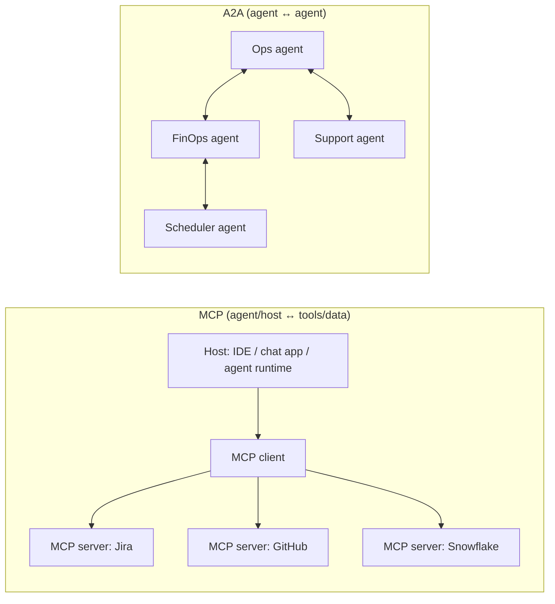

## PART VII: AI TOOLS & FRAMEWORKS (Agents + LLM Apps)

**Important note:** This part is **not** official exam content/scope. It’s included as an author-curated reference to capture extra details and practical ecosystem knowledge that often helps in real projects (and sometimes informs exam intuition).

This part is a **tooling map** (commercial + open-source) for building LLM apps and AI agents. The goal is to help you:

- Pick the right layer to “buy vs build” (managed agent platform vs OSS framework vs custom code).
- Recognize common tool categories that show up in exam-style scenarios (RAG, orchestration, guardrails, eval/observability, serving).
- Translate requirements (latency, governance, data access, compliance, cost) into a concrete stack.

### 7.1 A simple taxonomy (how the ecosystem fits together)

Think of agentic/LLM systems as a set of layers:

- **Models**: foundation models (proprietary or open weights).
- **App frameworks**: prompts, tool calling, RAG chains, memory, routing.
- **Agent orchestration**: multi-step execution, planners/routers, multi-agent supervision, retries/timeouts.
- **Knowledge / retrieval**: indexing, vector stores, reranking, grounding.
- **Safety & governance**: policies, guardrails, content safety, secrets/IAM boundaries, audit trails.
- **Evaluation & observability**: offline evals + online monitoring/tracing/cost.
- **Serving**: endpoints, batching, caching, streaming, concurrency control.

**EXAM TIP:** When a question says “fully managed” + “enterprise governance” + “rapid delivery” → prefer a **cloud-managed** offering. When it says “custom orchestration” + “bring your own model” + “fine control” → prefer **OSS frameworks + custom infra**.

### 7.1.1 Core ML/DL frameworks (foundation of “non-LLM” ML engineering)

Even if you work mostly on GenAI, the ML Engineer exam (and many real systems) still rely on classic ML/DL frameworks:

- **Deep learning**: PyTorch, TensorFlow/Keras, JAX (Flax/Haiku).
- **Classical ML**: scikit-learn, XGBoost, LightGBM, CatBoost.
- **Interchange / optimized inference**: ONNX + ONNX Runtime.
- **Legacy (still seen)**: MXNet, PaddlePaddle, CNTK.

#### Probabilistic / Bayesian programming (for uncertainty-aware modeling)

These show up when you need explicit uncertainty, probabilistic inference, and Bayesian modeling:

- **Stan** (probabilistic programming + HMC/NUTS): `https://mc-stan.org/`
- **PyMC** (Python Bayesian modeling): `https://www.pymc.io/`
- **Turing.jl** (Julia Bayesian modeling): `https://turinglang.org/`
- **Edward** (legacy research ecosystem; still referenced historically)

Example table: core model frameworks

| Category      | Tools (examples)                             |
| ------------- | -------------------------------------------- |
| Deep learning | PyTorch, TensorFlow, Keras, JAX (Flax/Haiku) |
| Classical ML  | scikit-learn, XGBoost, LightGBM, CatBoost    |
| Interchange   | ONNX, ONNX Runtime                           |
| Probabilistic | Stan, PyMC, Turing.jl                        |
| Legacy DL     | MXNet, PaddlePaddle, CNTK                    |

### 7.2 Google Cloud (Vertex AI + Google agent stack)

Core docs entry point:

- Generative AI on Vertex AI: `https://cloud.google.com/vertex-ai/generative-ai/docs`

High-yield building blocks you should recognize:

- **Grounding**: Vertex docs include grounding options like Google Search, Maps, and **Vertex AI Search**, plus “grounding responses using RAG”.
- **RAG Engine**: Vertex docs describe **RAG Engine** (RAG overview/quickstart/billing) and guidance for vector DB choices (including **Vertex AI Vector Search** and third-party options).

Practical “when to choose” map:

- **Fastest managed path for enterprise RAG**: Vertex AI Search / RAG Engine (vs rolling your own ingest + vector DB + retrieval + eval).
- **Need custom orchestration/agent design**: use code-first agent frameworks (your own or vendor-supported) + deploy on managed compute (Cloud Run / GKE / Vertex).
- **Need strong governance/observability**: integrate evaluation + logging/tracing + IAM least privilege + audit logs (AgentOps mindset).

### 7.3 AWS (Amazon Bedrock + managed agents)

Core docs entry points:

- Agents: `https://docs.aws.amazon.com/bedrock/latest/userguide/agents.html`
- Amazon Bedrock docs home: `https://docs.aws.amazon.com/bedrock/`

What to look for in AWS-style questions:

- **Managed agents**: when the prompt emphasizes “use Bedrock”, “tool use”, “automate tasks”, “managed”, the answer usually centers on **Bedrock agents**.
- **Safety controls**: look for Bedrock’s “guardrails/safety” concepts when asked about content filtering and policy enforcement.
- **Managed retrieval**: look for “knowledge base”/managed retrieval primitives for RAG-like solutions.

### 7.4 Microsoft Azure (Azure AI Foundry + Azure OpenAI + agent service)

Core docs entry point:

- Microsoft Foundry documentation: `https://learn.microsoft.com/en-us/azure/ai-foundry/`

From the Foundry documentation navigation (high-yield):

- **Foundry Agent Service**: orchestrate/host agents; create custom agents; agent app templates.
- **Agentic retrieval**: create/connect knowledge bases for agentic retrieval.
- **Evaluate agentic workflows** + **AI Red Teaming Agent (preview)**.
- **Content Safety**: Azure content safety / safety docs are surfaced in the same toolchain.
- **Azure OpenAI in Foundry**: Azure OpenAI integration inside the Foundry model.

**EXAM TIP:** When you see “agentic retrieval + eval + red teaming + content safety” described together, it often implies a **platform suite** (not just “write a prompt”).

### 7.4.1 AWS vs GCP vs Azure (ML + GenAI + agents): engineering-focused comparison (2025–2026)

High-level positioning

| Cloud | ML & classical AI | GenAI platform (models, RAG)         | Agentic platform focus                                     |
| ----- | ----------------- | ------------------------------------ | ---------------------------------------------------------- |
| AWS   | SageMaker         | Bedrock                              | Bedrock Agents + AgentCore                                 |
| GCP   | Vertex AI         | Vertex AI (Gemini, RAG)              | Vertex AI Agent Builder + ADK, MCP, A2A                    |
| Azure | Azure ML / Fabric | Azure AI Foundry (OpenAI, Phi, etc.) | Azure AI Foundry Agent Service + Microsoft Agent Framework |

#### Core ML platforms

- **AWS**: **Amazon SageMaker** for training/tuning/processing/experiments/deployment/registry; tight integration with S3/Redshift/EMR/Kinesis/EKS.
- **GCP**: **Vertex AI** as a unified platform (training, AutoML, pipelines, registry, online/offline prediction); integrates natively with BigQuery/Dataflow/Dataproc/GKE.
- **Azure**: **Azure ML** for training/MLOps/registry/endpoints, increasingly integrated into **Microsoft Fabric**; connects with Fabric/Synapse, ADLS, and Power Platform.

#### GenAI / foundation model services

- **AWS – Amazon Bedrock**: managed access to multiple foundation models behind a unified API; includes RAG primitives (knowledge bases) and orchestration via agents.
- **GCP – Vertex AI (Gemini)**: Gemini models (text/vision/code/multimodal) via Vertex GenAI APIs; retrieval + grounding integrated with Vertex search and vector features.
- **Azure – Azure AI Foundry**: access to Azure OpenAI models (and other models via Foundry); grounding over web/search and enterprise data; integrated evaluation/governance surfaces.

#### Agent-specific services (what exam prompts often describe)

- **AWS: Bedrock Agents + AgentCore**
  - **Bedrock Agents**: managed agents that call tools (“action groups”), connect to knowledge bases, and execute multi-step workflows (RAG + tool use).
  - **AgentCore**: positioned as a more flexible runtime (serverless deployment patterns, policy/IAM integration, and observability via CloudWatch/OpenTelemetry-style tooling).
- **GCP: Vertex AI Agent Builder + ADK/MCP/A2A**
  - **Agent Builder**: platform surface to build/scale/govern enterprise agents (Gemini-first).
  - **ADK**: programmable agent behavior.
  - **MCP**: standardizes connecting agents to external tools/resources.
  - **A2A**: coordination between agents (including cross-system/cross-vendor coordination patterns).
- **Azure: Agent Service in Azure AI Foundry**
  - **Foundry Agent Service**: design/deploy/scale agents with governance + observability; integrates with Foundry evaluation and enterprise knowledge.
  - **Microsoft Agent Framework**: referenced as a broader agent framework layer; commonly paired with MCP concepts and Microsoft ecosystem integrations.

#### RAG, tools, and ecosystem integration

- **AWS**: knowledge bases for retrieval; tools via action groups/Lambda/Step Functions; integrates with S3/Redshift/OpenSearch and the AWS data stack.
- **GCP**: RAG features tied to BigQuery and search services; MCP/A2A emphasize tool reuse and interoperability.
- **Azure**: grounding over enterprise data (Fabric/Microsoft Graph) and strong “tool surface” via Teams/Outlook/SharePoint/Dynamics/Power Automate.

#### Practical selection guidance

- **Choose AWS** if you’re SageMaker-centric and want Bedrock-based GenAI/agents tightly coupled to IAM/VPC + Lambda/Step Functions.
- **Choose GCP** if BigQuery is your analytical core and you want Gemini-first development plus interoperability patterns (MCP/A2A) and Vertex agent surfaces.
- **Choose Azure** if you’re Microsoft 365/Dynamics/Fabric-centric and need enterprise agents deeply integrated into the Microsoft stack (Copilot-style workflows).

### 7.5 Open-source / multi-cloud frameworks (the “app & orchestration layer”)

These are common choices when you want portability or deeper control:

- **LangChain + LangGraph** (Python/JS): LLM app building + agent orchestration graphs. Docs: `https://docs.langchain.com/`
- **LlamaIndex**: RAG-first framework (indexing/retrieval patterns + connectors). Docs: `https://docs.llamaindex.ai/`
- **Haystack (deepset)**: RAG pipelines, retrievers/rerankers, production patterns. Docs: `https://docs.haystack.deepset.ai/`
- **Semantic Kernel (Microsoft)**: agent/plugins patterns + orchestration. Docs: `https://learn.microsoft.com/en-us/semantic-kernel/`
- **AutoGen (Microsoft Research)**: multi-agent conversation patterns. Repo: `https://github.com/microsoft/autogen`
- **CrewAI**: role-based multi-agent orchestration (teams of agents with roles/goals/tasks; often paired with tools + RAG). Docs: `https://docs.crewai.com/`
- **PydanticAI**: typed/validated agent outputs and tool calling patterns. Docs: `https://ai.pydantic.dev/`
- **DSPy**: programmatic prompt optimization / “compiled prompting”. Repo: `https://github.com/stanfordnlp/dspy`
- **Rasa**: assistants/chatbots with NLU + dialogue management. Docs: `https://rasa.com/docs/`
- **promptflow / Prompt Flow (Microsoft)**: workflow authoring + evaluation loops for LLM apps (Azure-centric, but OSS tooling exists). Repo: `https://github.com/microsoft/promptflow`

Other tools you may see in the wild (often more “product” than “framework”, or newer):

- **OpenAI Swarm** (lightweight multi-agent patterns; vendor ecosystem specific)
- **Phidata**, **Agno** (Python agent frameworks with pluggable LLMs/vector stores)
- **FastAgency** (production/agent acceleration patterns)
- **Lindy** (business workflow automation agents)
- **MetaGPT**, **OpenAgents**, **Letta**, **AutoGPT-style stacks** (agentic automation ecosystems; quality varies widely—evaluate carefully)

### 7.5.1 Commercial “agent builders” and provider SDKs (OpenAI / Anthropic / others)

These sit between “pure model API” and “full cloud platform”: they provide agent runtimes, tool calling patterns, and ecosystem integrations.

- **OpenAI platform (APIs + tooling)**:
  - **ChatGPT**: end-user product; often used for prototyping and ad-hoc analysis.
  - **OpenAI API**: model access for apps (tool/function calling patterns, structured outputs, etc.). Docs: `https://platform.openai.com/docs`
  - **OpenAI agent guidance/frameworks**: lightweight orchestration patterns (e.g., Swarm) and official “how to build agents” materials.
- **Anthropic (Claude ecosystem)**:
  - **Claude**: end-user assistant.
  - **Claude Code**: developer-focused “coding agent” workflow integrated with your repo/terminal (useful for refactors, debugging, code navigation).
  - **Model Context Protocol (MCP)**: open protocol used broadly for tool/context integration in agentic apps. Spec/docs: `https://modelcontextprotocol.io/`
- **Other commercial app platforms** (often appear in industry, less in exam questions):
  - **Cohere**, **Mistral**, etc. (provider APIs + embeddings/rerankers + deployment options; vendor-specific feature sets).
  - **Vellum**: visual LLM app builder + SDK for workflows/experiments/evals. `https://www.vellum.ai/`

**EXAM TIP:** Provider SDKs (OpenAI/Anthropic/etc.) help you ship faster, but enterprise answers still hinge on **governance, eval, monitoring, and least privilege tool execution**.

### 7.5.2 MCP vs A2A (interoperability protocols for the “agent internet”)

Two interoperability ideas are showing up more and more in agent stacks:

#### MCP: Model Context Protocol (agent/host ↔ tools/data)

**MCP** is an open standard (originating from Anthropic) for connecting LLMs/agents to tools, APIs, files, and databases via a consistent protocol.

- **Architecture**: client–server.
  - A **host** (chat app, IDE, agent runtime) runs an **MCP client**.
  - The client connects to one or more **MCP servers** that expose:
    - **Tools** (callable actions)
    - **Resources** (files, KB snippets, data sources)
    - **Prompts** (reusable prompt templates)
- **Why it matters**: replaces bespoke plugin systems and one-off integrations with a universal “adapter layer” for context + tools (capability discovery, structured calls, streaming, standardized errors).
- **Newer feature direction**: “sampling”-style features can allow an MCP server to ask the client’s model to generate text, enabling richer workflows without the server owning model keys.

**When to use MCP**

- You want a single tool spec (e.g., Jira, GitHub, Snowflake) reusable across multiple hosts/runtimes.
- You need secure, auditable access to enterprise systems via a well-defined interface (instead of ad-hoc plugins).

#### A2A: Agent2Agent protocol (agent ↔ agent)

**Agent2Agent (A2A)** is an open protocol (championed by Google’s agent ecosystem) that focuses on **horizontal interoperability**: agents discover each other, exchange messages, negotiate capabilities, and coordinate tasks across platforms.

- **What it enables**: a “team of agents” where different agents can live in different systems (teams, vendors, org boundaries) but still collaborate as peers.
- **Typical concepts**: agent identities, capability descriptions, secure communication, multi-step workflows.

**When to use A2A**

- You want cross-team/cross-org collaboration (finance agent + support agent + scheduler agent) without a single monolithic orchestrator.
- You expect partner/vendor agents to cooperate through a neutral “agent mesh” protocol.

#### MCP vs A2A (and how they combine)

- **MCP is vertical**: connect _one agent/host_ to _many tools/data sources_ (tool/data connectivity).
- **A2A is horizontal**: connect _many agents_ to _each other_ (coordination and delegation).

**Common best practice**

- Use **MCP** for tool/data connectivity and consistent enterprise integrations.
- Use **A2A** (or similar patterns) for multi-agent coordination across boundaries.

Simple illustration:

- An ops assistant uses **MCP** to access GitHub/Jira/Kubernetes, and uses **A2A** to delegate cost analysis to a FinOps agent owned by another team.

#### Other emerging agent protocol patterns

You may also see references to lighter-weight “agent workflow” specs (sometimes described as REST-style patterns) when MCP/A2A are considered too heavy for a given integration.



**How to choose quickly**

- **You need deterministic control + testability**: graph/state-machine orchestration (LangGraph-style).
- **You need RAG/connectors first**: LlamaIndex / Haystack-style.
- **You want strong typing/validation**: PydanticAI-style.
- **You want “multi-agent roles” quickly**: CrewAI/AutoGen-style.

Example table: agent and LLM application frameworks

| Category                     | Tools (examples)                                      |
| ---------------------------- | ----------------------------------------------------- |
| LLM apps + orchestration     | LangChain, LangGraph, Semantic Kernel, promptflow     |
| RAG + indexing-first         | LlamaIndex, Haystack                                  |
| Multi-agent orchestration    | CrewAI, AutoGen                                       |
| Typed/validated “agent code” | PydanticAI                                            |
| Classic assistants/chatbots  | Rasa                                                  |
| Vendor-native                | OpenAI (Agents/SDK patterns), Semantic Kernel, Vellum |

---

## 7.5.3 Deep Dive: Agent Frameworks with Code Examples

This section provides implementation-ready code snippets for the most important agent frameworks.

### Vertex AI Agent Engine (Google Cloud's Managed Agent Platform)

**Vertex AI Agent Engine** is Google Cloud's managed runtime for deploying, scaling, and operating AI agents in production. It handles infrastructure, scaling, traffic management, and integrates with Vertex AI's MLOps ecosystem.

#### Key capabilities

| Capability             | Description                                                                  |
| ---------------------- | ---------------------------------------------------------------------------- |
| **Managed deployment** | Deploy agents built with ADK or custom code; auto-scaling, traffic splitting |
| **Tool orchestration** | Built-in support for function calling, grounding, and tool execution         |
| **Session management** | Conversation state, memory persistence across turns                          |
| **Evaluation**         | Integrated agent evaluation and testing workflows                            |
| **Observability**      | Logging, tracing, metrics for agent behavior (latency, tool calls, errors)   |
| **Safety**             | Content filters, guardrails, and AI red teaming integration                  |

#### Agent Engine vs Agent Builder

| Concept                         | What It Is                                                                            |
| ------------------------------- | ------------------------------------------------------------------------------------- |
| **Vertex AI Agent Builder**     | Visual/low-code UI for building agents (playbooks, data stores, tools)                |
| **Vertex AI Agent Engine**      | Runtime/infrastructure for deploying agents (from ADK, custom code, or Agent Builder) |
| **ADK (Agent Development Kit)** | Code-first Python SDK for building agents programmatically                            |

**EXAM TIP:** When a question says "production deployment" + "managed" + "traffic splitting" + "agents" → think **Agent Engine**. When it says "code-first" + "custom logic" → think **ADK**.

---

### ADK (Agent Development Kit) — Google's Code-First Agent Framework

**ADK** is Google's open-source Python framework for building agents that can be deployed to Vertex AI Agent Engine or run locally.

Official repo: `https://github.com/google/adk-python`  
Official docs: `https://google.github.io/adk-docs/`

#### ADK core concepts

| Concept     | Description                                                                            |
| ----------- | -------------------------------------------------------------------------------------- |
| **Agent**   | The main orchestrator — decides what to do, calls tools, maintains state               |
| **Tool**    | A callable function the agent can invoke (API calls, database queries, code execution) |
| **Session** | Conversation context and memory                                                        |
| **Runner**  | Executes the agent locally or remotely                                                 |

#### ADK: Simple agent with tools (pseudocode — verify imports in ADK docs)

```python
# NOTE: ADK is evolving quickly; treat this as *structure*, not exact imports.
# Verify the current import paths / class names in the official docs:
# - https://google.github.io/adk-docs/
# - https://github.com/google/adk-python

# 1) Define tools as regular functions
def get_weather(city: str) -> str:
    # Call a real API in production
    return f"Weather in {city}: 72°F, sunny"

def search_kb(query: str) -> str:
    # Query your search / vector store in production
    return f"Found results for '{query}': [doc1, doc2, doc3]"

# 2) Register tools with the agent runtime
tools = [get_weather, search_kb]  # (wrapped/registered per ADK docs)

# 3) Create an agent with instructions + tools
agent = {
    "name": "assistant",
    "model": "gemini-2.0-flash",
    "instruction": (
        "Use get_weather for weather. Use search_kb for internal knowledge. "
        "Cite sources when using retrieved content."
    ),
    "tools": tools,
}

# 4) Run locally (runner/session setup per ADK docs)
result = run(agent, "What's the weather in Seattle and find docs about ML pipelines")
print(result)
```

#### ADK: Multi-agent with delegation (pseudocode)

```python
# 3-agent pipeline: research → write → review
researcher = {"name": "researcher", "instruction": "Research and cite sources.", "tools": [search_kb]}
writer = {"name": "writer", "instruction": "Write a clear summary from research."}
reviewer = {"name": "reviewer", "instruction": "Check accuracy, clarity, and add missing caveats."}

pipeline = sequential([researcher, writer, reviewer])  # per ADK composition primitives
final = pipeline.run("Create a summary of recent developments in agentic AI")
print(final)
```

#### ADK: Deploy to Vertex AI Agent Engine (pseudocode — verify current deployment API)

```python
# Pseudocode: deployment API names change; use official docs for the exact call.
# Typical inputs: agent artifact, project, region, display name, scaling config.
deployment = deploy_agent(
    agent=agent,
    project_id="your-project",
    location="us-central1",
    display_name="my-assistant-agent",
    min_replicas=1,
    max_replicas=10,
)
print(deployment.endpoint)
```

---

### Agentic RAG (Retrieval as an Agent Decision)

Traditional RAG: query → retrieve → generate (single pass).  
**Agentic RAG**: the agent **decides** when/whether to retrieve, can do **multi-step retrieval**, and **validates** retrieved context.

#### Why agentic RAG?

| Traditional RAG                    | Agentic RAG                                              |
| ---------------------------------- | -------------------------------------------------------- |
| Always retrieves on every query    | Agent decides if retrieval is needed                     |
| Single retrieval step              | Multi-hop: retrieve → reason → retrieve more             |
| No validation of retrieved docs    | Agent can verify relevance, ask clarifying questions     |
| Fixed retrieval query = user query | Agent can rewrite/decompose queries for better retrieval |

#### Agentic RAG with ADK (pseudocode — verify ADK tool wrappers in docs)

```python
def retrieve_documents(query: str, top_k: int = 5) -> list[dict]:
    """Retrieve relevant documents from vector store."""
    # In production: embed query, search vector DB, return chunks
    return [
        {"content": "ML pipelines automate...", "source": "doc1.pdf", "score": 0.92},
        {"content": "Feature stores provide...", "source": "doc2.pdf", "score": 0.87},
    ]

def verify_source(claim: str, source_id: str) -> str:
    """Verify a specific claim against the original source document."""
    # In production: fetch full doc, check if claim is supported
    return f"Claim '{claim}' is supported by {source_id}"

agent = {
    "name": "agentic_rag",
    "model": "gemini-2.0-flash",
    "instruction": (
        "Decide if retrieval is needed. If needed, decompose the query, retrieve, and iterate. "
        "Verify key claims and cite sources. If you cannot find support in retrieved sources, say so."
    ),
    # Tools are wrapped/registered per ADK docs:
    "tools": [retrieve_documents, verify_source],
}

answer = run(agent, "Compare Feature Store vs raw feature tables for churn prediction. Cite sources.")
print(answer)
```

#### Multi-hop retrieval pattern

```python
# Agent instruction for multi-hop reasoning
multi_hop_instruction = """
When answering complex questions:

1. DECOMPOSE: Break the question into sub-questions
   Example: "How does X compare to Y for use case Z?"
   → Sub-Q1: "What is X and its capabilities?"
   → Sub-Q2: "What is Y and its capabilities?"
   → Sub-Q3: "What are requirements for use case Z?"

2. RETRIEVE: Search for each sub-question separately

3. SYNTHESIZE: Combine retrieved information to answer the original question

4. VALIDATE: Cross-check key facts across multiple sources

5. ITERATE: If gaps remain, formulate follow-up queries
"""
```

---

### Multi-Agent Architectures

Multi-agent systems use multiple specialized agents that collaborate on complex tasks.

#### Common patterns

| Pattern                 | Description                                       | When to Use                                |
| ----------------------- | ------------------------------------------------- | ------------------------------------------ |
| **Sequential pipeline** | Agent A → Agent B → Agent C (linear handoff)      | Content creation, review workflows         |
| **Parallel fan-out**    | Query sent to multiple agents; results aggregated | Research, multi-perspective analysis       |
| **Router/dispatcher**   | Classifier routes to specialist agents            | Customer support, domain-specific handling |
| **Supervisor/manager**  | Manager delegates to workers, tracks progress     | Complex projects, iterative refinement     |
| **Debate/adversarial**  | Agents argue opposing views; judge decides        | High-stakes decisions, red teaming         |

#### Supervisor pattern diagram

```
                    ┌─────────────────┐
                    │   Supervisor    │
                    │ (orchestrates)  │
                    └────────┬────────┘
                             │
           ┌─────────────────┼─────────────────┐
           │                 │                 │
           ▼                 ▼                 ▼
    ┌─────────────┐   ┌─────────────┐   ┌─────────────┐
    │  Researcher │   │   Writer    │   │  Reviewer   │
    │   Agent     │   │   Agent     │   │   Agent     │
    └─────────────┘   └─────────────┘   └─────────────┘
```

---

### CrewAI — Role-Based Multi-Agent Orchestration

**CrewAI** makes it easy to define "crews" of agents with roles, goals, and backstories that work together on tasks.

Official docs: `https://docs.crewai.com/`

#### CrewAI core concepts

| Concept     | Description                                       |
| ----------- | ------------------------------------------------- |
| **Agent**   | A role with goals, backstory, and tools           |
| **Task**    | A specific job assigned to an agent               |
| **Crew**    | A team of agents working together                 |
| **Process** | How tasks are executed (sequential, hierarchical) |

#### CrewAI: Research team example

```python
from crewai import Agent, Task, Crew, Process
from crewai_tools import SerperDevTool, WebsiteSearchTool

# Tools
search_tool = SerperDevTool()  # Web search
web_rag_tool = WebsiteSearchTool()  # RAG over websites

# Define agents with roles
researcher = Agent(
    role="Senior Research Analyst",
    goal="Uncover cutting-edge developments in AI agents",
    backstory="""You are a senior researcher at a leading tech think tank.
    You have a knack for finding obscure but important information.
    You're known for thorough, well-sourced analysis.""",
    tools=[search_tool, web_rag_tool],
    verbose=True,
    llm="gemini/gemini-2.0-flash",  # or "openai/gpt-4o"
)

writer = Agent(
    role="Tech Content Strategist",
    goal="Craft compelling content about AI technology",
    backstory="""You are a renowned content strategist who specializes
    in making complex technical topics accessible to business leaders.
    You create clear, engaging narratives backed by solid research.""",
    verbose=True,
    llm="gemini/gemini-2.0-flash",
)

editor = Agent(
    role="Senior Editor",
    goal="Ensure content is accurate, clear, and publication-ready",
    backstory="""You are a meticulous editor with decades of experience
    in technical publishing. You catch errors others miss and improve
    clarity without losing technical accuracy.""",
    verbose=True,
    llm="gemini/gemini-2.0-flash",
)

# Define tasks
research_task = Task(
    description="""Research the latest developments in AI agent frameworks.
    Focus on: ADK, LangGraph, CrewAI, AutoGen.
    Compare their architectures, use cases, and production readiness.
    Include code examples where relevant.""",
    expected_output="Detailed research report with comparisons and examples",
    agent=researcher,
)

writing_task = Task(
    description="""Using the research report, write a comprehensive article
    about AI agent frameworks for technical decision makers.
    Make it engaging but technically accurate.
    Include a comparison table and recommendations.""",
    expected_output="Publication-ready article (1500-2000 words)",
    agent=writer,
    context=[research_task],  # Depends on research
)

editing_task = Task(
    description="""Review and edit the article for:
    - Technical accuracy
    - Clarity and flow
    - Grammar and style
    Provide the final polished version.""",
    expected_output="Final edited article ready for publication",
    agent=editor,
    context=[writing_task],
)

# Create crew
crew = Crew(
    agents=[researcher, writer, editor],
    tasks=[research_task, writing_task, editing_task],
    process=Process.sequential,  # or Process.hierarchical
    verbose=True,
)

# Run the crew
result = crew.kickoff()
print(result)
```

#### CrewAI: Hierarchical process (manager delegates)

```python
from crewai import Crew, Process

# Create a crew with hierarchical management
managed_crew = Crew(
    agents=[researcher, writer, editor],
    tasks=[research_task, writing_task, editing_task],
    process=Process.hierarchical,
    manager_llm="gemini/gemini-2.0-flash",  # Manager uses this LLM
    verbose=True,
)

# The manager agent is created automatically
# It decides task order, delegation, and iteration
result = managed_crew.kickoff()
```

#### CrewAI: Custom tools

```python
from crewai.tools import BaseTool
from pydantic import BaseModel, Field

class DatabaseQueryInput(BaseModel):
    query: str = Field(..., description="SQL query to execute")
    database: str = Field(default="analytics", description="Target database")

class DatabaseQueryTool(BaseTool):
    name: str = "database_query"
    description: str = "Execute SQL queries against internal databases"
    args_schema: type[BaseModel] = DatabaseQueryInput

    def _run(self, query: str, database: str = "analytics") -> str:
        # In production: execute query securely
        return f"Query results from {database}: [row1, row2, row3]"

# Use custom tool with agent
data_analyst = Agent(
    role="Data Analyst",
    goal="Extract insights from company data",
    backstory="Expert SQL analyst with deep knowledge of the data warehouse.",
    tools=[DatabaseQueryTool()],
    llm="gemini/gemini-2.0-flash",
)
```

---

### LangGraph — State Machine Orchestration for Agents

**LangGraph** provides explicit control flow for agent workflows using graph-based state machines. It's ideal when you need deterministic, testable, and debuggable agent behavior.

Official docs: `https://docs.langchain.com/oss/python/langgraph/overview`

#### LangGraph core concepts

| Concept          | Description                                                               |
| ---------------- | ------------------------------------------------------------------------- |
| **StateGraph**   | Defines the workflow as a graph of nodes and edges                        |
| **State**        | TypedDict that flows through the graph; nodes read/write to it            |
| **Node**         | A function that takes state, does work, returns updated state             |
| **Edge**         | Connection between nodes; can be conditional                              |
| **Checkpointer** | Persistence layer for state (enables pause/resume, time-travel debugging) |

#### LangGraph: Minimal workflow (aligned with upstream README)

```python
from langgraph.graph import START, StateGraph
from typing_extensions import TypedDict

class State(TypedDict):
    text: str

def node_a(state: State) -> dict:
    return {"text": state["text"] + "a"}

def node_b(state: State) -> dict:
    return {"text": state["text"] + "b"}

graph = StateGraph(State)
graph.add_node("node_a", node_a)
graph.add_node("node_b", node_b)
graph.add_edge(START, "node_a")
graph.add_edge("node_a", "node_b")

app = graph.compile()
print(app.invoke({"text": ""}))  # {'text': 'ab'}
```

#### LangGraph: Multi-agent supervisor pattern (conceptual; see docs for the latest routing APIs)

```python
from typing import TypedDict, Annotated, Literal
from langgraph.graph import StateGraph, END
from langchain_google_genai import ChatGoogleGenerativeAI
from langchain_core.messages import HumanMessage, SystemMessage
import operator

class MultiAgentState(TypedDict):
    messages: Annotated[list, operator.add]
    next_agent: str
    research_output: str
    writing_output: str
    final_output: str

# Specialist LLMs (could be different models)
supervisor_llm = ChatGoogleGenerativeAI(model="gemini-2.0-flash")
researcher_llm = ChatGoogleGenerativeAI(model="gemini-2.0-flash")
writer_llm = ChatGoogleGenerativeAI(model="gemini-2.0-flash")

def supervisor_node(state: MultiAgentState) -> MultiAgentState:
    """Supervisor decides which agent to call next."""
    system = """You are a supervisor managing a research and writing team.
    Based on the current state, decide the next step:
    - 'researcher': if we need more research
    - 'writer': if research is complete and we need writing
    - 'FINISH': if the task is complete

    Respond with just the agent name or FINISH."""

    messages = [SystemMessage(content=system)] + state["messages"]
    response = supervisor_llm.invoke(messages)
    next_agent = response.content.strip().lower()

    return {"next_agent": next_agent, "messages": [response]}

def researcher_node(state: MultiAgentState) -> MultiAgentState:
    """Research agent gathers information."""
    system = """You are a research specialist. Gather comprehensive information
    on the topic and provide a detailed research summary."""

    messages = [SystemMessage(content=system)] + state["messages"]
    response = researcher_llm.invoke(messages)

    return {
        "research_output": response.content,
        "messages": [response]
    }

def writer_node(state: MultiAgentState) -> MultiAgentState:
    """Writer agent creates content based on research."""
    system = f"""You are a skilled writer. Using this research:

    {state.get('research_output', 'No research yet')}

    Create a well-structured, engaging piece of content."""

    messages = [SystemMessage(content=system)] + state["messages"]
    response = writer_llm.invoke(messages)

    return {
        "writing_output": response.content,
        "final_output": response.content,
        "messages": [response]
    }

def route_supervisor(state: MultiAgentState) -> Literal["researcher", "writer", "end"]:
    """Route based on supervisor decision."""
    next_agent = state.get("next_agent", "").lower()
    if "research" in next_agent:
        return "researcher"
    elif "writ" in next_agent:
        return "writer"
    else:
        return "end"

# Build multi-agent graph
multi_graph = StateGraph(MultiAgentState)

# Add nodes
multi_graph.add_node("supervisor", supervisor_node)
multi_graph.add_node("researcher", researcher_node)
multi_graph.add_node("writer", writer_node)

# Set entry
multi_graph.set_entry_point("supervisor")

# Routing from supervisor
multi_graph.add_conditional_edges(
    "supervisor",
    route_supervisor,
    {"researcher": "researcher", "writer": "writer", "end": END}
)

# After specialist work, go back to supervisor
multi_graph.add_edge("researcher", "supervisor")
multi_graph.add_edge("writer", "supervisor")

# Compile with memory (enables pause/resume)
from langgraph.checkpoint.memory import MemorySaver
memory = MemorySaver()
multi_app = multi_graph.compile(checkpointer=memory)

# Run with thread_id for persistence
config = {"configurable": {"thread_id": "project-123"}}
result = multi_app.invoke(
    {
        "messages": [HumanMessage(content="Write an article about agentic RAG patterns")],
        "next_agent": "",
        "research_output": "",
        "writing_output": "",
        "final_output": ""
    },
    config
)
```

#### LangGraph: Human-in-the-loop (approval gates) (conceptual; see docs for interrupt/checkpoint APIs)

```python
from langgraph.graph import StateGraph, END
from langgraph.checkpoint.memory import MemorySaver

class ApprovalState(TypedDict):
    messages: Annotated[list, operator.add]
    draft: str
    approved: bool
    feedback: str

def generate_draft(state: ApprovalState) -> ApprovalState:
    """Generate initial draft."""
    # ... generate content ...
    return {"draft": "Generated draft content...", "approved": False}

def human_review(state: ApprovalState) -> ApprovalState:
    """This node will pause for human input."""
    # LangGraph automatically pauses here when using interrupt_before
    # Human provides feedback via external mechanism
    return state

def revise_draft(state: ApprovalState) -> ApprovalState:
    """Revise based on feedback."""
    # ... revise using state["feedback"] ...
    return {"draft": f"Revised based on: {state['feedback']}"}

def route_after_review(state: ApprovalState) -> Literal["revise", "end"]:
    if state.get("approved"):
        return "end"
    return "revise"

# Build graph with human checkpoint
approval_graph = StateGraph(ApprovalState)
approval_graph.add_node("generate", generate_draft)
approval_graph.add_node("review", human_review)
approval_graph.add_node("revise", revise_draft)

approval_graph.set_entry_point("generate")
approval_graph.add_edge("generate", "review")
approval_graph.add_conditional_edges("review", route_after_review, {"revise": "revise", "end": END})
approval_graph.add_edge("revise", "review")

# Compile with interrupt for human review
approval_app = approval_graph.compile(
    checkpointer=MemorySaver(),
    interrupt_before=["review"]  # Pause before human review
)
```

---

### Framework Comparison: When to Use What

| Framework      | Best For                                      | Strengths                                    | Considerations                        |
| -------------- | --------------------------------------------- | -------------------------------------------- | ------------------------------------- |
| **ADK**        | Google Cloud production, Vertex AI deployment | Native GCP integration, managed scaling      | Google ecosystem focus                |
| **CrewAI**     | Role-based teams, creative workflows          | Easy multi-agent setup, role/goal paradigm   | Less fine-grained control than graphs |
| **LangGraph**  | Complex workflows, deterministic control      | Explicit state machine, debuggable, testable | More boilerplate than CrewAI          |
| **AutoGen**    | Research, conversational multi-agent          | Strong conversation patterns                 | Can be complex for simple use cases   |
| **LlamaIndex** | RAG-first applications                        | Best-in-class data connectors, indexing      | Less focus on agent orchestration     |

**EXAM TIP:** The exam tests concepts, not specific framework syntax. Understand the **patterns** (ReAct, routing, supervisor, agentic RAG) rather than memorizing API calls.

---

## 7.5.4 Context Management, Memory & Session State for Agents

Agents need **memory** to maintain coherent conversations, learn from interactions, and handle multi-turn tasks. This section covers the key concepts and implementation patterns.

### Why Context Management Matters

| Without Memory               | With Memory                          |
| ---------------------------- | ------------------------------------ |
| Agent forgets previous turns | Agent remembers conversation history |
| User must repeat context     | Agent builds on prior context        |
| No personalization           | Agent learns user preferences        |
| Each request is isolated     | Multi-step tasks work correctly      |
| No state across sessions     | User can resume conversations        |

### Types of Agent Memory

| Memory Type                | What It Stores                | Lifespan        | Use Case                           |
| -------------------------- | ----------------------------- | --------------- | ---------------------------------- |
| **Short-term (Working)**   | Current conversation turns    | Single session  | Multi-turn chat, task context      |
| **Long-term (Persistent)** | Facts, preferences, summaries | Across sessions | User profiles, learned preferences |
| **Episodic**               | Specific past interactions    | Across sessions | "Remember when we discussed X?"    |
| **Semantic**               | General knowledge, facts      | Permanent       | Domain knowledge, company info     |
| **Procedural**             | Learned workflows, patterns   | Permanent       | Task-specific learned behaviors    |

### Context Window Management

LLMs have finite context windows. As conversations grow, you must decide what to keep and what to drop.

#### Strategies for managing context

| Strategy               | How It Works                       | Pros                | Cons                  |
| ---------------------- | ---------------------------------- | ------------------- | --------------------- |
| **Sliding window**     | Keep last N messages               | Simple, predictable | Loses early context   |
| **Summarization**      | Periodically summarize older turns | Compresses history  | Loses details         |
| **Token budget**       | Keep messages until token limit    | Maximizes context   | Sudden drops          |
| **Importance scoring** | Keep "important" messages longer   | Preserves key info  | Complexity            |
| **Hybrid**             | Recent + summary + key facts       | Best of both        | Implementation effort |

#### Token-aware context management (Python example)

```python
from transformers import AutoTokenizer

class ContextManager:
    def __init__(self, model_name: str, max_tokens: int = 8000, reserve_for_response: int = 1000):
        self.tokenizer = AutoTokenizer.from_pretrained(model_name)
        self.max_context_tokens = max_tokens - reserve_for_response
        self.messages = []
        self.summary = ""

    def count_tokens(self, text: str) -> int:
        return len(self.tokenizer.encode(text))

    def add_message(self, role: str, content: str):
        self.messages.append({"role": role, "content": content})
        self._trim_if_needed()

    def _trim_if_needed(self):
        """Trim oldest messages if over token budget."""
        while self._total_tokens() > self.max_context_tokens and len(self.messages) > 2:
            # Keep system message (index 0) and most recent
            removed = self.messages.pop(1)
            # Optionally: add to summary instead of discarding
            self._update_summary(removed)

    def _total_tokens(self) -> int:
        total = self.count_tokens(self.summary) if self.summary else 0
        for msg in self.messages:
            total += self.count_tokens(msg["content"])
        return total

    def _update_summary(self, removed_message: dict):
        """Update running summary with removed content."""
        # In production: use LLM to summarize
        if self.summary:
            self.summary += f"\n- {removed_message['role']}: {removed_message['content'][:100]}..."
        else:
            self.summary = f"Earlier context:\n- {removed_message['role']}: {removed_message['content'][:100]}..."

    def get_messages_for_llm(self) -> list[dict]:
        """Return messages formatted for LLM, including summary if present."""
        result = []
        if self.summary:
            result.append({"role": "system", "content": f"Summary of earlier conversation:\n{self.summary}"})
        result.extend(self.messages)
        return result
```

### Session Management Patterns

**Session** = a logical conversation boundary (may span multiple requests, may persist across time).

#### Session lifecycle

```
┌─────────────────────────────────────────────────────────────────┐
│                        SESSION LIFECYCLE                        │
├─────────────────────────────────────────────────────────────────┤
│                                                                 │
│  CREATE          UPDATE           PERSIST         RESUME        │
│  ───────         ──────           ───────         ──────        │
│  New session     Add messages     Save to DB      Load from DB  │
│  Generate ID     Update state     Serialize       Deserialize   │
│  Init context    Track metadata   Checkpoint      Restore state │
│                                                                 │
│                        EXPIRE / DELETE                          │
│                        ──────────────                           │
│                        TTL-based cleanup                        │
│                        User-requested deletion                  │
│                        GDPR/compliance                          │
│                                                                 │
└─────────────────────────────────────────────────────────────────┘
```

#### Session state schema (typical structure)

```python
from dataclasses import dataclass, field
from datetime import datetime
from typing import Any

@dataclass
class SessionState:
    # Identity
    session_id: str
    user_id: str | None = None

    # Timestamps
    created_at: datetime = field(default_factory=datetime.utcnow)
    updated_at: datetime = field(default_factory=datetime.utcnow)
    expires_at: datetime | None = None

    # Conversation history
    messages: list[dict] = field(default_factory=list)
    summary: str = ""

    # Agent state
    current_task: str | None = None
    pending_actions: list[dict] = field(default_factory=list)
    tool_results: list[dict] = field(default_factory=list)

    # Memory / learned context
    user_preferences: dict = field(default_factory=dict)
    facts: list[str] = field(default_factory=list)

    # Metadata
    metadata: dict[str, Any] = field(default_factory=dict)
```

### Implementation: Session Management with ADK (conceptual)

```python
# NOTE: Treat this as a reference architecture, not exact imports.
# Verify current ADK session APIs in the official docs:
# - https://google.github.io/adk-docs/

session_store = make_session_store(backend="firestore", ttl_hours=24)

session_id = "user-123-session-456"
user_id = "user-123"
session = session_store.get_or_create(session_id=session_id, user_id=user_id)

agent = {"name": "assistant", "model": "gemini-2.0-flash", "instruction": "Use conversation history."}

run(agent, "My name is Alice and I work on ML pipelines", session=session)
reply = run(agent, "What did I say my job was?", session=session)
print(reply)

session_store.save(session)
```

### Implementation: Session Management with LangGraph (conceptual)

LangGraph uses **checkpointers** for state persistence.

```python
from typing import TypedDict, Annotated
from langgraph.graph import StateGraph, END
import operator

# State includes conversation history
class ConversationState(TypedDict):
    messages: Annotated[list, operator.add]
    user_id: str
    session_metadata: dict

# LangGraph supports checkpointing for persistence; specific backends and import paths evolve.
# Follow the official docs for current options and examples:
# https://docs.langchain.com/oss/python/langgraph/overview
checkpointer = make_checkpointer(backend="sqlite", path="sessions.db")

# Build graph (simplified)
def chat_node(state: ConversationState) -> ConversationState:
    # Access full history via state["messages"]
    history = state["messages"]
    # ... process with LLM ...
    return {"messages": [response]}

graph = StateGraph(ConversationState)
graph.add_node("chat", chat_node)
graph.set_entry_point("chat")
graph.add_edge("chat", END)

# Compile with checkpointer
app = graph.compile(checkpointer=checkpointer)

# Run with thread_id (= session_id)
config = {"configurable": {"thread_id": "session-abc-123"}}

# Turn 1
result1 = app.invoke(
    {"messages": [HumanMessage("I'm working on a RAG system")], "user_id": "alice", "session_metadata": {}},
    config
)

# Turn 2 (automatically has history from checkpointer)
result2 = app.invoke(
    {"messages": [HumanMessage("What architecture should I use?")]},
    config
)

# Get full state at any point
state_snapshot = app.get_state(config)
print(state_snapshot.values["messages"])  # Full history

# Time-travel: get state at a specific checkpoint
history = list(app.get_state_history(config))
past_state = history[2]  # Third checkpoint
```

### Implementation: Memory with LangChain

```python
from langchain.memory import (
    ConversationBufferMemory,
    ConversationSummaryMemory,
    ConversationBufferWindowMemory,
    VectorStoreRetrieverMemory
)
from langchain_google_genai import ChatGoogleGenerativeAI

llm = ChatGoogleGenerativeAI(model="gemini-2.0-flash")

# Option 1: Buffer memory (keep all messages)
buffer_memory = ConversationBufferMemory(
    memory_key="chat_history",
    return_messages=True
)

# Option 2: Window memory (keep last K turns)
window_memory = ConversationBufferWindowMemory(
    k=10,  # Keep last 10 exchanges
    memory_key="chat_history",
    return_messages=True
)

# Option 3: Summary memory (compress older turns)
summary_memory = ConversationSummaryMemory(
    llm=llm,
    memory_key="chat_history",
    return_messages=True
)

# Option 4: Vector store memory (semantic retrieval of past turns)
from langchain_community.vectorstores import Chroma
from langchain_google_genai import GoogleGenerativeAIEmbeddings

embeddings = GoogleGenerativeAIEmbeddings(model="models/embedding-001")
vectorstore = Chroma(embedding_function=embeddings, persist_directory="./memory_db")

vector_memory = VectorStoreRetrieverMemory(
    retriever=vectorstore.as_retriever(search_kwargs={"k": 5}),
    memory_key="relevant_history"
)

# Use with chain
from langchain.chains import ConversationChain

chain = ConversationChain(
    llm=llm,
    memory=summary_memory,  # Or any memory type
    verbose=True
)

# Conversation with automatic memory
response1 = chain.predict(input="My team is building a customer support bot")
response2 = chain.predict(input="What frameworks would you recommend?")  # Has context
```

### Long-Term Memory Patterns

For agents that need to remember across sessions (user preferences, facts, past interactions):

```python
from dataclasses import dataclass
from datetime import datetime

@dataclass
class LongTermMemory:
    """Persistent memory that survives across sessions."""

    user_id: str

    # User profile (learned over time)
    preferences: dict  # {"response_style": "concise", "expertise_level": "expert"}

    # Factual memory (things the user told us)
    facts: list[dict]  # [{"fact": "Works at Acme Corp", "confidence": 0.95, "source": "user_statement"}]

    # Episodic memory (past significant interactions)
    episodes: list[dict]  # [{"summary": "Helped debug RAG pipeline", "date": "2024-01-15", "outcome": "resolved"}]

    # Procedural memory (learned workflows for this user)
    procedures: list[dict]  # [{"task": "code_review", "steps": [...], "preferences": {...}}]


class LongTermMemoryStore:
    """Store and retrieve long-term memories."""

    def __init__(self, vectorstore, db_client):
        self.vectorstore = vectorstore  # For semantic search
        self.db = db_client  # For structured storage

    def add_fact(self, user_id: str, fact: str, source: str = "conversation"):
        """Store a learned fact about the user."""
        # Embed and store for semantic retrieval
        self.vectorstore.add_texts(
            texts=[fact],
            metadatas=[{"user_id": user_id, "type": "fact", "source": source}]
        )
        # Also store structured
        self.db.facts.insert({"user_id": user_id, "fact": fact, "source": source, "timestamp": datetime.utcnow()})

    def recall_relevant(self, user_id: str, query: str, k: int = 5) -> list[str]:
        """Retrieve memories relevant to current query."""
        results = self.vectorstore.similarity_search(
            query,
            k=k,
            filter={"user_id": user_id}
        )
        return [doc.page_content for doc in results]

    def get_user_profile(self, user_id: str) -> dict:
        """Get structured user preferences."""
        return self.db.profiles.find_one({"user_id": user_id}) or {}
```

### Production Session Management Checklist

| Concern              | Solution                                                              |
| -------------------- | --------------------------------------------------------------------- |
| **Persistence**      | Use durable storage (Firestore, PostgreSQL, Redis) not just in-memory |
| **Scalability**      | Stateless app servers + external session store                        |
| **TTL / Expiration** | Auto-expire old sessions (24h–7d typical)                             |
| **Privacy / GDPR**   | Allow users to delete their data; don't log PII unnecessarily         |
| **Security**         | Encrypt session data at rest; validate session ownership              |
| **Concurrency**      | Handle multiple requests to same session (locking or last-write-wins) |
| **Recovery**         | Checkpointing enables resume after crashes                            |
| **Observability**    | Log session lifecycle events; track memory usage                      |

### Vertex AI Agent Engine Session Management (conceptual)

Agent Engine provides a managed runtime where sessions are typically identified by a **session ID** and the platform persists conversation state across turns. The exact client API is evolving, so treat the following as conceptual:

```python
# Pseudocode: shape varies by SDK version / preview surface.
session_id = "user-alice-project-xyz"

resp1 = agent_engine.query("Hello, I'm starting a new project", session_id=session_id)
resp2 = agent_engine.query("What did we discuss earlier?", session_id=session_id)
print(resp2.text)
```

Use the official Vertex AI documentation for the current SDK surface and best practices around retention/TTL, privacy, and observability.

**EXAM TIP:** When questions mention "conversation history", "multi-turn", "remember previous context", or "resume conversation" → think **session management + memory patterns**.

---

### 7.6 Vector stores & retrieval infrastructure (RAG substrate)

Common options (managed or self-hosted):

- **Postgres + pgvector** (self-hosted or managed Postgres): simplest “good enough” vector store for many teams.
- **Dedicated vector DBs**: Milvus, Weaviate, Qdrant, Pinecone, etc.
- **Cloud-native**: Vertex AI Vector Search / OpenSearch vector capabilities / Azure AI Search vector capabilities.
- **Hybrid search engines (dense + lexical)**: Elasticsearch, OpenSearch, Vespa, Solr (with vector plugins/capabilities).

Selection guide:

- **Small/medium scale + strong relational needs** → Postgres+pgvector
- **Large-scale ANN / low latency + ops budget** → managed vector search or dedicated vector DB
- **Enterprise search + governance** → managed search/RAG products (Vertex AI Search / Azure AI Search, etc.)

Example table: RAG components

| Layer         | Options (examples)                                            |
| ------------- | ------------------------------------------------------------- |
| Orchestration | LangChain, LangGraph, AutoGen, CrewAI                         |
| Indexing      | LlamaIndex, Haystack, Elasticsearch/OpenSearch, Vespa         |
| Vector DB     | Pinecone, Chroma, Qdrant, Weaviate, pgvector/Postgres, Milvus |

**Embedding / similarity providers** (often accessed via frameworks above): OpenAI, Cohere, Voyage AI, Jina, etc.

### 7.6.1 Model hubs and the Hugging Face ecosystem (the “GitHub for models/data” layer)

This layer is easy to miss if you only think in terms of “cloud platforms”, but it’s central in real-world GenAI work:

#### What Hugging Face actually is

- **Community hub** for models, datasets, and apps (discovery + collaboration + versioning).
- **Core libraries** (commonly used in production):
  - Transformers, Datasets, Tokenizers, Diffusers
  - Accelerate (training acceleration/distribution helpers)
  - PEFT (parameter-efficient fine-tuning), TRL (RL fine-tuning patterns)
- **Platform features**:
  - Model Hub, Dataset Hub, Spaces (demos/apps)
  - Inference Endpoints / hosted inference options (plus enterprise/on-prem patterns)

#### Where HF fits vs cloud platforms

- **HF is cloud-agnostic content + tooling**: you can pull HF models into **SageMaker**, **Vertex AI**, **Azure ML**, or your own serving stack.
- **Clouds compete at the platform layer** (infra + governance + managed endpoints + agent stacks) but also **integrate or mirror** “model catalog” concepts.

**EXAM TIP:** If the prompt says “choose a managed platform to deploy/operate” → cloud endpoints usually win. If it says “we need model/dataset discovery + community artifacts + fast iteration” → a **model hub** mindset (HF-like) is a better fit.

#### “HF-equivalent” ecosystems (model hubs and catalogs)

Major open/community hubs:

- **Hugging Face Hub** (dominant open model/dataset hub)
- **ModelScope** (Alibaba ecosystem; strong regional footprint)
- **Replicate** (catalog + easy hosting/inference API)
- **DagsHub** (collaborative ML platform; “GitHub + data/versioning + ML tooling” style)
- **Specialized SD marketplaces** (Stable Diffusion models/LoRAs; quality/governance varies widely)

Cloud-native “catalogs” (more curated/managed, less community-driven):

- **Vertex AI** model catalog / AI Studio directories
- **Bedrock** model catalog / AWS Marketplace models
- **Azure** AI model catalog / Azure AI Studio

#### Inference & serving alternatives (if you mainly think of HF as “host my model and give me an API”)

- **Replicate**: multi-model inference API with simple deployment story
- **Self-hosted serving stacks**: BentoML / KServe / Triton / Ray Serve (often serving HF models)
- **Cloud-native endpoints**: SageMaker endpoints, Vertex AI endpoints, Azure ML / Foundry endpoints

### 7.7 LLM serving / inference engines (when you self-host)

If you host open-weight models (or need extreme throughput), inference engines become a “first-class” tool choice:

- **vLLM**: `https://docs.vllm.ai/`
- **SGLang**: `https://github.com/sgl-project/sglang`
- **TensorRT-LLM**: `https://github.com/NVIDIA/TensorRT-LLM`
- **Text Generation Inference (TGI)**: `https://github.com/huggingface/text-generation-inference`

High-yield concepts to recognize across these projects:

- **Continuous batching**, **KV cache management**, **prefill vs decode scheduling**, **prefix/context caching**, **streaming**.

### 7.7.0 Open-source foundation models (beyond LLMs)

In practice, “open-source foundation models” usually means **open weights** you can download and run (license permitting), across multiple modalities:

- **Text (LLMs)**: general-purpose chat/instruct and code models (examples below).
- **Vision-language (VLMs)**: models that take images + text (for OCR-like reasoning, chart/doc Q&A, visual grounding).
- **Text-to-image / diffusion**: image generation and editing pipelines (often paired with LoRAs/control adapters).
- **Speech/audio**: speech-to-text and speech generation models used in voice agents.

**Engineering note:** Always check the **license**, distribution restrictions, and acceptable use policy. “Open weights” ≠ “free for any use”.

#### Image models (generation + editing) — what you should know

There are two common classes of “image models” used in production:

- **Vision-language models (VLMs)**: understand images and answer questions (see “Vision-language models” below).
- **Generative image models**: create/edit images (diffusion-style pipelines are the most common open-weight option).

**Common image generation/editing tasks**

- **Text-to-image**: generate images from prompts.
- **Image-to-image**: stylize/transform a source image (often for “variations”).
- **Inpainting/outpainting**: fill missing regions / extend borders.
- **Control/conditioning**: constrain generation with structure (edge maps, depth, pose) via control adapters.
- **LoRA adapters**: small finetunes for style/character/product customization.

**Open-weight model families you’ll see a lot**

- **Stable Diffusion / SDXL** (and derivatives): widely used open diffusion ecosystem.
- **FLUX.1** (and similar newer open-weight image models): often used for higher-quality generations (check license terms carefully).
- **PixArt-α** and other research-grade open models: sometimes used for specific quality/speed tradeoffs.

**Tooling that matters**

- **Diffusers** (Hugging Face) is the standard Python library for diffusion pipelines.
- **ComfyUI / Automatic1111-style UIs** are common for workflows (great for rapid iteration; production usually uses code).

**Engineering gotchas**

- **Latency**: diffusion requires multiple denoising steps; reduce steps, use faster samplers, quantize, or distill for speed.
- **VRAM**: image generation is memory-hungry; batch size and resolution dominate cost.
- **Safety**: image generation needs filtering (prompt + output classification) and provenance controls (watermarking/content policy).

#### Vision-language models (image understanding, visual Q&A, document/diagram reasoning)

VLMs are used for:

- **Image Q&A / captioning**
- **Document understanding** (tables, charts, screenshots)
- **Visual grounding** (refer to regions/objects)
- **Multimodal RAG** (retrieve relevant images/pages + answer)

Common open-weight components you’ll encounter:

- **CLIP-like encoders** (for image/text embeddings and retrieval)
- VLM families such as **LLaVA-like** and **Qwen-VL-like** models (names vary by release)

Engineering pattern (very common):

- Use **CLIP/SigLIP-style embeddings** for retrieval (image search / “find relevant page/frame”), then use a **VLM** to answer with the retrieved visuals as context.

#### Video models (understanding vs generation)

Video brings unique constraints: long sequences, high compute, and multi-modal signals (frames + audio + metadata).

**A) Video understanding (classification, tagging, moderation, highlights)**

Typical tasks:

- **Action recognition** (what is happening)
- **Event detection** (important moments)
- **Object/scene tagging** (what appears)
- **Moderation/safety** (unsafe content)
- **Temporal localization** (when an event happens)

Common model families/approaches you’ll see:

- **Frame sampling + image backbone** (cheap baseline): sample frames, run image model per frame, aggregate.
- **Video Transformers** (ViT-style extended over time): better temporal modeling, higher cost.
- **Two-stage retrieval + reasoning**:
  - Stage 1: embed frames/clips for retrieval
  - Stage 2: VLM/LLM summarizes or answers questions from selected clips

**Engineering defaults that work**

- **Sampling strategy matters**: uniform sampling for coverage; shot-boundary / scene-change sampling for efficiency.
- **Store embeddings at the clip level** for search and reuse across tasks.
- **Evaluate with temporal metrics** when localization matters (not just per-video accuracy).

**B) Video generation (text-to-video / image-to-video)**

Open-weight video generation evolves quickly; the recurring practical constraints are stable:

- **Compute cost** is high (many frames, high resolution, temporal coherence).
- **Serving is hard** (long runtimes, huge VRAM, often async/batch).
- **Quality evaluation** is tricky (you usually need human eval plus basic automated metrics).

**Engineering tip:** treat video generation as an **async job** (queue + batch GPUs) unless the product truly demands interactive latency.

### 7.7.1 Open-source / open-weight LLM examples (what people actually run)

When someone says “open-source LLM”, they often mean **open-weight** models you can run yourself (license permitting). Common examples you’ll see:

- **Qwen (Alibaba)**: widely used open-weight family across sizes; common choice for multilingual and strong general capability.
- **Llama (Meta)**: very common default for self-hosted chat/instruct deployments.
- **Mistral / Mixtral (Mistral AI)**: popular for performance/efficiency tradeoffs (and MoE variants).
- **Gemma (Google)** and other open releases: often used for smaller/faster deployments.

Where to find and evaluate them:

- **Model hubs** (Hugging Face, etc.) for discovery + downloads + benchmarks.
- Use an **eval harness** (Ragas/DeepEval/promptfoo-style) + your own golden set before swapping models.

**EXAM TIP:** “We need to run on-prem / avoid vendor lock-in / control weights” → open-weight models + self-hosted serving (vLLM/TGI/Triton) is the common direction.

### 7.7.2 API routers / aggregators (OpenRouter-style)

These products sit above multiple model providers and expose a single API surface:

- **Why teams use them**:
  - Normalize APIs across providers
  - Route by price/latency/quality/fallback
  - Centralize usage/cost controls
- **Tradeoffs**:
  - Adds another vendor in the trust/data path (security + compliance review)
  - Harder to use provider-specific features unless they’re exposed

If you’re using an API router, still treat **evaluation + monitoring** as mandatory, because routing changes can change quality.

### 7.7.3 Non-hyperscaler GPU & inference clouds (cost/perf alternatives)

Beyond AWS/GCP/Azure, you’ll see specialized GPU clouds that focus on price/performance for training and inference. Example:

- **Hyperbolic**: “open-access AI cloud” offering on-demand GPU clusters and serverless inference, marketed as API-compatible with common ecosystems and positioned on cost. See: `https://www.hyperbolic.ai/` ([Hyperbolic](https://www.hyperbolic.ai/)).

**Engineering checklist before adopting**: data residency/compliance, private networking, IAM/audit logs, model availability, SLAs, and observability/export (OpenTelemetry/metrics/logs).

### 7.8 Evaluation + observability (LLMOps / AgentOps tooling)

Typical categories:

- **Offline evaluation**: regression tests for prompts/RAG/agents; golden sets; rubric scoring.
- **Tracing/observability**: tool calls, intermediate steps, latency, tokens/cost, errors.
- **Safety evaluation**: prompt injection tests, jailbreak suites, policy compliance checks.

Representative tools (vendor-agnostic):

- **DeepEval**: `https://github.com/confident-ai/deepeval`
- **Ragas** (RAG evaluation): `https://github.com/explodinggradients/ragas`
- **TruLens**: `https://github.com/truera/trulens`
- **Arize Phoenix**: `https://github.com/Arize-ai/phoenix`
- **promptfoo**: `https://github.com/promptfoo/promptfoo`
- **LangSmith** (LangChain ecosystem): `https://docs.smith.langchain.com/`
- **Weights & Biases Weave**: `https://weave.wandb.ai/`

**EXAM TIP:** The “correct” operational answer is almost never “manually test a few prompts.” It’s usually **eval dataset + automated evals + monitoring/tracing + safety tests**.

### 7.8.1 MLOps, pipelines, and observability (classic ML + GenAI)

This is the “everything around the model” tool layer (data, pipelines, deployment, monitoring):

- **Experiment tracking / registry**: MLflow (`https://mlflow.org/`), Weights & Biases (`https://wandb.ai/`), Neptune (`https://neptune.ai/`).
- Also common: Polyaxon (`https://polyaxon.com/`), Comet (`https://www.comet.com/`).
- **Data/pipeline versioning**: DVC (`https://dvc.org/`), lakeFS (`https://lakefs.io/`), Delta Lake (`https://delta.io/`).
- Also common: Pachyderm (`https://www.pachyderm.com/`).
- **Orchestration**: Airflow (`https://airflow.apache.org/`), Prefect (`https://www.prefect.io/`), Dagster (`https://dagster.io/`), Kubeflow Pipelines (`https://www.kubeflow.org/docs/components/pipelines/`).
- Also common: Metaflow (`https://metaflow.org/`).
- **Feature stores**: Feast (`https://feast.dev/`), Tecton (`https://www.tecton.ai/`), Hopsworks (`https://www.hopsworks.ai/`).
- **Deployment / serving**: BentoML (`https://docs.bentoml.org/`), Seldon Core (`https://docs.seldon.io/`), KServe (`https://kserve.github.io/website/`), TorchServe (`https://github.com/pytorch/serve`), Triton (`https://github.com/triton-inference-server/server`).
- Also common: Ray Serve (`https://docs.ray.io/en/latest/serve/index.html`).
- **Monitoring / observability**: Evidently (`https://www.evidentlyai.com/`), WhyLogs (`https://github.com/whylabs/whylogs`), plus commercial platforms (Arize/WhyLabs/etc.).
- Also common: Fiddler (`https://www.fiddler.ai/`).

**EXAM TIP:** End-to-end managed platforms (Vertex AI / SageMaker / Azure ML / Databricks) bundle many of the above; exam prompts often reward “use the managed platform” when governance + scale + time-to-market are key.

Full platforms (end-to-end suites you’ll see in enterprises):

- **Databricks**: `https://www.databricks.com/`
- **Vertex AI**: `https://cloud.google.com/vertex-ai`
- **SageMaker**: `https://aws.amazon.com/sagemaker/`
- **Azure ML**: `https://learn.microsoft.com/en-us/azure/machine-learning/`
- **Snowflake Cortex**: `https://www.snowflake.com/en/data-cloud/cortex/`

### 7.9 Security & guardrails (tooling checklist)

Regardless of vendor/framework, the same controls repeat:

- **Least privilege**: tools run under constrained identities (service accounts/roles).
- **Secrets hygiene**: never put credentials in prompts; use secret managers; short-lived tokens.
- **Prompt injection defense**: treat retrieved docs/tool outputs as untrusted; separate instructions vs data; validate tool args.
- **Allow-lists**: tools/functions with explicit schemas; restrict high-risk actions; add human approval for destructive ops.
- **Auditability**: logs/traces retained; changes to prompts/tools/versioned.

### 7.10 “Default stacks” by scenario (quick mapping)

- **Fast managed enterprise agent**:
  - Vendor agent platform (Vertex/Azure/AWS) + managed RAG/search + built-in eval + observability
- **Portable app with custom orchestration**:
  - LangGraph/LlamaIndex + your chosen vector DB + your evaluation stack + deploy on Cloud Run/GKE
- **Self-hosted inference at scale**:
  - vLLM/SGLang/TGI + vector DB + strict gateway + eval/monitoring + GPU autoscaling

### 7.11 “AI tools” for developers and business users (products you’ll see everywhere)

These are not frameworks, but they matter in real engineering orgs (policy, security, workflows):

- **Coding assistants**: GitHub Copilot, Codeium, Replit Ghostwriter, “AI code review” tools (varies by org).
- **AI-native IDEs / coding agents**: Cursor (`https://www.cursor.com/`), Claude Code (Anthropic), etc.
- **General assistants**: ChatGPT, Claude, Gemini, Perplexity, Microsoft Copilot.
- **Automation / app builders**: Zapier, Make, n8n (AI nodes), voice-agent builders, no/low-code agent builders.
- **Business suites**: Intercom/Zendesk/HubSpot AI features, etc.

### 7.12 Integration platforms and no-/low-code AI

This is a fast-growing “glue layer” for agents in real companies:

- **iPaaS with AI**: Zapier, Make, n8n (AI/LLM nodes).
- **Agent / integration hubs**: Composio (`https://composio.dev/`), and similar connector hubs for Slack/GitHub/Salesforce/Jira, etc.
- **Visual LLM builders**: LangFlow (`https://github.com/langflow-ai/langflow`), Flowise (`https://github.com/FlowiseAI/Flowise`), plus commercial builders (varies widely).
- **Voice/real-time agent builders**: commonly used in call center/voicebot stacks (vendor landscape changes quickly).

**EXAM TIP:** No/low-code tools are great for speed, but production answers still require **security, auditability, and evaluation**.

### 7.13 Domain- and language-specific ML libraries (useful in “what tool would you use?” questions)

- **NLP**: spaCy (`https://spacy.io/`), NLTK (`https://www.nltk.org/`), Hugging Face Transformers/tokenizers (`https://huggingface.co/docs/transformers/`).
- **Computer vision**: OpenCV (`https://opencv.org/`), Detectron2 (`https://github.com/facebookresearch/detectron2`), MMDetection/MMCV (`https://github.com/open-mmlab/mmdetection`), Kornia (`https://github.com/kornia/kornia`).
- **Recommenders**: implicit (`https://github.com/benfred/implicit`), plus ecosystem-specific libs.
- **Time series**: Prophet (`https://github.com/facebook/prophet`), darts (`https://github.com/unit8co/darts`), GluonTS (`https://github.com/awslabs/gluonts`).
- **Reinforcement learning**: Stable-Baselines3 (`https://github.com/DLR-RM/stable-baselines3`), RLlib (`https://docs.ray.io/en/latest/rllib/`).
- **Non-Python ecosystems** (common in “awesome-ml” lists): Go/Java/C++/Julia libraries vary; pick based on deployment/runtime constraints and team skills.

### 7.14 Governance, risk, and compliance frameworks

- **NIST AI Risk Management Framework (AI RMF)**: `https://www.nist.gov/itl/ai-risk-management-framework`
- **Cloud Responsible AI toolkits**: major cloud platforms provide responsible AI guidance and tooling (evaluation, safety, governance, auditability) integrated into their ML/GenAI suites.

Practical “engineering constraints” to remember:

- **Data handling**: what can be sent to external models; retention; logging; PII policies.
- **Identity + access**: SSO/IAM integration; audit trails.
- **Evaluation**: how you measure “helpfulness” and prevent regressions.
