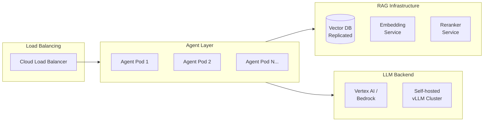

<div align="center">

# 🤖 GenAI System Design Cheat Sheet

**The complete reference for building production GenAI systems**

</div>

---

## 📑 Table of Contents

1. [ML Foundations](#1-ml-foundations)
2. [Core Components](#2-core-components)
3. [Architectures](#3-architectures)
4. [Training Stages](#4-training-stages)
5. [Key Techniques](#5-key-techniques)
6. [RAG Pipeline](#6-rag-pipeline)
7. [Agent Patterns](#7-agent-patterns)
8. [Serving & Optimization](#8-serving--optimization)
9. [Image Generation](#9-image-generation)
10. [Video Generation](#10-video-generation)
11. [Multimodal](#11-multimodal-vision-language)
12. [All Metrics](#12-all-metrics)
13. [Cost & Optimization](#13-cost--optimization)
14. [Security & Guardrails](#14-security--guardrails)
15. [Scalability Patterns](#15-scalability-patterns)
16. [Back-of-Envelope Calculations](#16-back-of-envelope-calculations)
17. [Platform Comparison](#17-platform-comparison)
18. [Model Quick Reference](#18-model-quick-reference)
19. [Interview Framework](#19-interview-framework)
20. [Glossary](#20-glossary)

---

## 1. ML Foundations

### 🧠 Intelligence & Models

```
Intelligence = Internal model of the world → Make predictions
Better model → More accurate predictions
```

| Concept | Traditional Software | Machine Learning |
|---------|---------------------|------------------|
| **How it works** | Programmers write explicit rules | Computer learns from examples |
| **Input** | Rules + Data | Examples (Data) |
| **Output** | Predictions | Model + Predictions |

### 📊 Two Phases of ML

**The core ML lifecycle:** First you **train** (teach the model by showing it examples and adjusting its parameters to minimize errors), then you **infer** (use the trained model to make predictions on new data). Training is expensive and done once; inference is cheap and done millions of times.

```mermaid
flowchart LR
    subgraph Training["🎯 Training Phase"]
        D[Data] --> L[Loss Function]
        L --> O[Optimizer]
        O --> P[Parameters]
    end

    subgraph Inference["🚀 Inference Phase"]
        I[New Input] --> M[Trained Model]
        M --> PR[Prediction]
    end

    P --> M
```



> **How it works:** During training, data flows through the model, the loss function measures how wrong the predictions are, and the optimizer adjusts parameters to reduce that error. Once trained, those parameters are frozen and the model is deployed for inference—new inputs go in, predictions come out.

| Phase | What It Is | GenAI Analogue |
|-------|-----------|----------------|
| **Training** | Fit model to data by minimizing **loss** | Pretraining, SFT, RLHF |
| **Inference** | Apply trained model to new data | API calls, production serving |

### 🔢 Key Formulas

#### Loss Functions

**Mean Squared Error (Regression):**

$$
\mathcal{L}_{\text{MSE}} = \frac{1}{n}\sum_{i=1}^{n}(y_i - \hat{y}_i)^2
$$

> **Terms:** n = number of samples, $y_i$ = actual value, $\hat{y}_i$ = predicted value

**Cross-Entropy (Classification):**

$$
\mathcal{L}_{\text{CE}} = -\sum_{i=1}^{C} y_i \log(\hat{y}_i)
$$

> **Terms:** C = number of classes, $y_i$ = true label (0 or 1), $\hat{y}_i$ = predicted probability for class i

**Language Model Loss:**

$$
\mathcal{L}_{\text{LM}} = -\frac{1}{T}\sum_{t=1}^{T} \log P(x_t | x_{<t})
$$

> **Terms:** T = sequence length, $x_t$ = token at position t, $x_{<t}$ = all tokens before position t, $P(x_t | x_{<t})$ = probability of next token given context

#### Gradient Descent Update

$$
\theta_{t+1} = \theta_t - \eta \nabla_\theta \mathcal{L}(\theta_t)
$$

> **Terms:** $\theta$ = model parameters (weights), $\eta$ = learning rate, $\nabla_\theta \mathcal{L}$ = gradient of loss with respect to parameters

> **💡 Intuition:** Move parameters in the direction that reduces loss. Learning rate η controls step size.

### 🧬 Deep Learning Building Blocks

#### Neurons & Activations

| Activation | Formula | Use Case |
|------------|---------|----------|
| **ReLU** | $\max(0, x)$ | Default in deep nets |
| **Sigmoid** | $\frac{1}{1+e^{-x}}$ | Binary classification, gates |
| **Tanh** | $\frac{e^x - e^{-x}}{e^x + e^{-x}}$ | Centered output (-1, 1) |
| **Softmax** | $\frac{e^{x_i}}{\sum_j e^{x_j}}$ | Multi-class probabilities |
| **GELU** | $x \cdot \Phi(x)$ | Transformers (smoother ReLU) |

#### Layer Types

| Layer | Purpose | Used In |
|-------|---------|---------|
| **Fully Connected** | All-to-all connections | MLPs, classification heads |
| **Convolutional** | Spatial feature extraction | CNNs, image processing |
| **Recurrent** | Sequential memory | RNNs, LSTMs (legacy) |
| **Attention** | Weighted importance | Transformers |
| **LayerNorm** | Normalize per-token | Transformers |
| **Dropout** | Regularization | Training only |

### 🎮 Reinforcement Learning

**Learning by doing:** Unlike supervised learning where you have "correct answers," RL learns through trial and error. An agent takes actions, observes rewards, and gradually learns a policy (strategy) that maximizes long-term reward. Think of it like training a dog with treats—no one tells the dog the "right" answer, it learns what works.

```mermaid
flowchart LR
    subgraph Agent["🤖 Agent"]
        P["Policy π<br/>(s → a)"]
    end

    Agent -->|"Action a"| E["🌍 Environment"]
    E -->|"State s"| Agent
    E -->|"Reward r"| Agent

    P -.->|"learn from r"| P
```



> **The RL loop:** The agent observes the current state, chooses an action based on its policy, receives a reward from the environment, and updates its policy to get better rewards next time. RLHF uses this loop with human preferences as rewards to make LLMs helpful and safe.

**Key Difference from Supervised Learning:**
- Supervised: Minimize loss vs explicit labels
- RL: **Maximize** cumulative reward through trial and error

#### RL Algorithms for LLMs

| Algorithm | Key Idea |
|-----------|----------|
| **REINFORCE** | Monte Carlo policy gradient—compute gradients from full episode returns |
| **PPO** | Clipped surrogate objective—stable updates with bounded policy changes |
| **TRPO** | Trust region constraint—guaranteed monotonic improvement |
| **GRPO** | Group relative advantages—used in DeepSeek for LLM alignment |

---

**REINFORCE (Policy Gradient):**

$$
\nabla J(\theta) = \mathbb{E}[\nabla \log \pi_\theta(a|s) \cdot R]
$$

> **Terms:**
> - **J(θ)** = objective function (expected cumulative reward)
> - **∇** = gradient operator (direction to improve)
> - **π_θ(a|s)** = policy—probability of taking action **a** in state **s** under parameters **θ**
> - **R** = total reward (return) from the episode
> - **𝔼** = expected value (average over many trials)

---

**PPO Clipped Objective:**

$$
L^{\text{CLIP}} = \min(r_t \cdot A_t, \text{clip}(r_t, 1-\epsilon, 1+\epsilon) \cdot A_t)
$$

> **Terms:**
> - **L^CLIP** = clipped loss function (what PPO minimizes)
> - **r_t** = probability ratio (new policy / old policy)
> - **A_t** = advantage—how much better this action was vs average
> - **ε (epsilon)** = clip range (typically 0.1–0.2), limits how much policy can change
> - **clip(r_t, 1-ε, 1+ε)** = constrains ratio to [0.8, 1.2] range (if ε=0.2)

**PPO Probability Ratio:**

$$
r_t(\theta) = \frac{\pi_\theta(a_t|s_t)}{\pi_{\text{old}}(a_t|s_t)}
$$

> **Terms:**
> - **π_θ** = current (new) policy after update
> - **π_old** = previous policy before update
> - **a_t** = action taken at time step t
> - **s_t** = state observed at time step t

---

**TRPO Trust Region Constraint:**

$$
D_{\text{KL}}(\pi_{\text{old}} \| \pi_\theta) \leq \delta
$$

> **Terms:**
> - **D_KL** = Kullback-Leibler divergence—measures how different two distributions are
> - **π_old** = old policy distribution
> - **π_θ** = new policy distribution
> - **δ (delta)** = maximum allowed divergence (trust region size), typically 0.01

### 📚 Three Ways Computers Learn

| Way | Signal | Data | GenAI Example |
|-----|--------|------|---------------|
| **Supervised** | Labels | (input, output) pairs | SFT fine-tuning |
| **Unsupervised** | None | Raw data | Pretraining (next-token) |
| **Reinforcement** | Rewards | Actions + feedback | RLHF alignment |

### 📈 Popular Supervised Learning Techniques

| Name | Description | Loss Function | Type |
|------|-------------|---------------|------|
| **Linear Regression** | Predicts continuous output via linear relationship | MSE: $\frac{1}{n}\sum(y_i - \hat{y}_i)^2$ | Regression |
| **Logistic Regression** | Models binary outcome probability via sigmoid | Binary Cross-Entropy | Classification |
| **Decision Tree** | Splits data by feature values | Gini, Entropy, MSE | Both |
| **Random Forest** | Ensemble of trees (averaged/voted) | Same as Decision Tree | Both |
| **XGBoost** | Gradient boosting with regularization | Customizable (Log Loss, MSE) | Both |
| **SVM** | Finds optimal separating hyperplane | Hinge loss, ε-insensitive | Both |

### 🔧 Common Optimizers

| Optimizer | Description | Key Hyperparameters |
|-----------|-------------|---------------------|
| **SGD** | Basic gradient descent | Learning rate (η) |
| **Adam** | Adaptive moments | η, β₁=0.9, β₂=0.999, ε=1e-8 |
| **AdamW** | Adam + weight decay | Same + weight decay |

**Adam Update:**

$$
m_t = \beta_1 m_{t-1} + (1-\beta_1) g_t
$$

$$
v_t = \beta_2 v_{t-1} + (1-\beta_2) g_t^2
$$

$$
\theta_t = \theta_{t-1} - \eta \frac{\hat{m}_t}{\sqrt{\hat{v}_t} + \epsilon}
$$

> **Terms:** $m_t$ = first moment (mean of gradients), $v_t$ = second moment (variance of gradients), $\beta_1, \beta_2$ = decay rates, $g_t$ = gradient at step t, $\hat{m}_t, \hat{v}_t$ = bias-corrected moments, $\epsilon$ = small constant to prevent division by zero

---

## 2. Core Components

**The GenAI request pipeline:** Every LLM request follows the same path—text goes in, gets chopped into tokens, converted to embeddings, processed by the model (using cached computations for efficiency), and tokens come out one by one until the response is complete.

```mermaid
flowchart TB
    subgraph Input["📥 Input"]
        Q[Query/Prompt]
        T[Tokenizer]
    end

    subgraph Processing["⚙️ Processing"]
        E[Embeddings]
        LLM[LLM]
        KV[KV Cache]
    end

    subgraph Output["📤 Output"]
        G[Generation]
        R[Response]
    end

    Q --> T --> E --> LLM
    KV --> LLM
    LLM --> G --> R
```



> **Why the KV Cache matters:** Without caching, generating token N would require recomputing attention for all previous tokens (O(N²) work). The KV cache stores these computations so each new token only needs O(N) work. This is why memory grows with context length—you're storing more cached values.

| Component | What It Is | Key Choice |
|-----------|-----------|------------|
| **LLM** | Large language model (GPT, Gemini, Claude) | Size vs cost vs latency |
| **Embeddings** | Dense vector representation | Dimension (768-3072) |
| **Vector DB** | Similarity search database | FAISS, Pinecone, Vertex AI |
| **Tokenizer** | Text → tokens (BPE, SentencePiece) | Vocab size, subword handling |
| **Prompt** | Instructions + context | System prompt, few-shot |
| **Context Window** | Max tokens (4K-2M) | Cost grows with length |
| **KV Cache** | Stored attention keys/values | Grows with context |

---

## 3. Architectures

### 🏗️ Architecture Taxonomy

```
Transformer (base architecture, 2017)
├── Variants (which stack + attention pattern)
│   ├── Decoder-only   → Causal attention (GPT, LLaMA, Claude)
│   ├── Encoder-only   → Bidirectional (BERT)
│   └── Encoder-decoder → Cross-attention (T5, BART)
└── Modifications
    └── MoE → Replace FFN with router + experts (Mixtral, Gemini 1.5)
```

### 🔄 Transformer Core

**The building block of all LLMs:** A Transformer is just this layer repeated N times (N=32 for 7B models, N=80+ for 70B+). Each layer has two parts: **attention** (lets tokens "look at" other tokens to understand context) and **feed-forward** (processes each token independently). Residual connections (+) let gradients flow during training.


> **How attention works:** Each token asks "what should I pay attention to?" by computing Query (what I'm looking for), Key (what I have to offer), and Value (my actual content). The softmax picks which tokens to focus on, weighted by relevance.

#### Self-Attention Formula

$$
\text{Attention}(Q, K, V) = \text{softmax}\left(\frac{QK^T}{\sqrt{d_k}}\right)V
$$

> **Terms:** Q = Query matrix (what I'm looking for), K = Key matrix (what tokens offer), V = Value matrix (actual content), $d_k$ = dimension of keys (scaling factor prevents large dot products)

#### Multi-Head Attention

$$
\text{MultiHead}(Q, K, V) = \text{Concat}(\text{head}_1, ..., \text{head}_h)W^O
$$

$$
\text{head}_i = \text{Attention}(QW_i^Q, KW_i^K, VW_i^V)
$$

> **Terms:** h = number of attention heads, $W^O$ = output projection matrix, $W_i^Q, W_i^K, W_i^V$ = learned projection matrices for head i

#### Positional Encoding

$$
PE_{(pos, 2i)} = \sin\left(\frac{pos}{10000^{2i/d}}\right)
$$

$$
PE_{(pos, 2i+1)} = \cos\left(\frac{pos}{10000^{2i/d}}\right)
$$

> **Terms:** pos = position in sequence, i = dimension index, d = model dimension. Sine for even dimensions, cosine for odd. The 10000 base creates different frequencies so the model can learn relative positions.

### 📊 Architecture Comparison

| Architecture | Attention | Best For | Examples |
|--------------|-----------|----------|----------|
| **Decoder-only** | Causal (see past only) | Text generation, chat | GPT-4, LLaMA, Claude |
| **Encoder-only** | Bidirectional | Classification, embeddings | BERT, RoBERTa |
| **Encoder-decoder** | Cross-attention | Translation, summarization | T5, BART |
| **MoE** | Same + sparse FFN | High capacity, lower cost | Mixtral, Gemini 1.5 |

### 🎯 MoE (Mixture of Experts)

**Get big model quality at small model cost:** Instead of running every input through all parameters, MoE models have multiple "expert" networks and a router that picks which 2-3 experts should handle each token. It's like a hospital with specialists—you don't see every doctor, just the ones relevant to your case.


> **How the router works:** Each token's embedding passes through a learned gating function that outputs weights for each expert. Only the top-K (usually 2) are activated, their outputs are weighted and combined. This sparsity is why Mixtral 8×7B has 56B parameters but runs like a 14B model.

**Key Insight:**
- Mixtral 8×7B = **56B total params**, but only **~14B active** per token
- Capacity of large model, compute cost of smaller one
- Trade-off: All experts must be in memory

| Model | Total Params | Active Params | Experts |
|-------|-------------|---------------|---------|
| Mixtral 8×7B | 47B | ~13B | 8, top-2 |
| Mixtral 8×22B | 141B | ~39B | 8, top-2 |
| DeepSeek-V2 | 236B | ~21B | 160, top-6 |

---

## 4. Training Stages

**From raw text to helpful assistant:** Training an LLM is a three-stage journey. First, pretrain on the entire internet to learn language (expensive, done by labs). Then, fine-tune on instruction examples to learn to follow directions. Finally, use human feedback to align the model—making it helpful, harmless, and honest.

```mermaid
flowchart LR
    subgraph PT["Stage 1: Pretraining"]
        A["Web, Books, Code<br/>(Trillions tokens)"] --> B["Next-token prediction"]
    end

    subgraph SFT["Stage 2: SFT"]
        B --> C["Instruction pairs<br/>(10K-100K)"]
    end

    subgraph RLHF["Stage 3: RLHF/DPO"]
        C --> D["Human preferences<br/>Reward model + PPO"]
    end

    D --> E["✅ Aligned Model"]
```



> **Why each stage matters:** Pretraining gives the model knowledge and language ability but no "personality." SFT teaches it to be helpful (follow instructions) but it may still give harmful answers. RLHF/DPO teach it to refuse harmful requests and prefer safe, accurate responses—this is the "alignment" that makes ChatGPT different from GPT-3.

| Stage | Data | Objective | Output |
|-------|------|-----------|--------|
| **Pretraining** | Trillions of tokens | Next-token prediction | Base model |
| **SFT** | 10K-100K (prompt, response) | Same, instruction format | Instruction-tuned |
| **RLHF** | Human preference rankings | Maximize reward | Aligned (helpful, harmless) |

### 🎯 RLHF Objective

$$
J(\pi_\theta) = \mathbb{E}_{x,y}\left[R(x,y) - \beta \cdot D_{KL}(\pi_\theta \| \pi_{\text{ref}})\right]
$$

> **Terms:** $J$ = objective to maximize, $\pi_\theta$ = policy being trained, $\mathbb{E}$ = expected value, R(x,y) = reward for response y to prompt x, $\beta$ = KL penalty weight, $D_{KL}$ = KL divergence (measures how much policy changed), $\pi_{\text{ref}}$ = reference policy (usually SFT model)

- **R(x,y)**: Reward model score
- **β**: KL penalty (prevents reward hacking)
- **π_ref**: Reference policy (SFT model)

### 🎯 DPO (Direct Preference Optimization)

$$
\mathcal{L}_{\text{DPO}} = -\log\sigma\left(\beta\left[\log\frac{\pi_\theta(y_w|x)}{\pi_{\text{ref}}(y_w|x)} - \log\frac{\pi_\theta(y_l|x)}{\pi_{\text{ref}}(y_l|x)}\right]\right)
$$

> **Terms:** $\sigma$ = sigmoid function, $y_w$ = winning/preferred response, $y_l$ = losing/rejected response, x = prompt, $\beta$ = temperature parameter, $\pi_\theta$ = model being trained, $\pi_{\text{ref}}$ = reference model

> **💡 DPO Advantage:** No separate reward model needed, more stable training

---

## 5. Key Techniques

**The GenAI toolbox:** These are the techniques you'll combine to build real applications. RAG grounds answers in your data. Fine-tuning customizes model behavior. Agents let models take actions. The art is knowing which to use when—and they often work best together.

| Technique | What It Does | When to Use |
|-----------|--------------|-------------|
| **RAG** | Retrieve docs → inject into prompt | Ground answers in your data |
| **Fine-tuning** | Train model on your data | Specialized style/domain |
| **Prompt Engineering** | Craft instructions | Quick iteration, no training |
| **Function Calling** | LLM outputs structured tool calls | Connect to APIs, DBs |
| **Agents** | LLM loop: think → act → observe | Multi-step tasks |
| **Guardrails** | Filter input/output | Safety, compliance |
| **Grounding** | Verify claims against sources | Reduce hallucination |

### ⚡ LoRA (Low-Rank Adaptation)

**Fine-tune a 70B model on a single GPU:** The key insight is that weight updates during fine-tuning have low "rank"—they can be compressed into two small matrices multiplied together. Instead of updating millions of parameters, you freeze the original model and train tiny adapter layers. Same quality, 256× fewer trainable parameters.

**Weight Update:**

$$
W' = W_0 + \Delta W = W_0 + BA
$$

**Dimensions:**

$$
W_0 \in \mathbb{R}^{d \times k}, \quad B \in \mathbb{R}^{d \times r}, \quad A \in \mathbb{R}^{r \times k}
$$

> **Terms:** $W_0$ = original frozen weights, $\Delta W = BA$ = low-rank update, d = output dimension, k = input dimension, r = rank (typically 8-64, much smaller than d,k), $\mathbb{R}$ = real numbers

```mermaid
flowchart LR
    X[Input] --> W0["W₀ (Frozen)"]
    X --> A["A (r×k)"]
    A --> B["B (d×r)"]
    W0 --> ADD((+))
    B --> ADD
    ADD --> H[Output]
```



> **How it works:** The input goes through both paths—the frozen original weights W₀ and the tiny adapter (A→B). Outputs are added together. At inference, you can merge BA into W₀ for zero latency cost, or swap different adapters for different tasks.

**📝 Example:**
```
d = 4096, k = 4096, r = 8

Full fine-tune: 4096 × 4096 = 16.7M params
LoRA: (4096×8) + (8×4096) = 65K params
Reduction: 256× fewer parameters!
```

### 🗜️ QLoRA

**LoRA on a budget:** QLoRA combines quantization (shrinking the model to 4-bit) with LoRA adapters. This lets you fine-tune a 65B model on a single 48GB GPU instead of needing 130GB+. The magic: quantize the base model to 4-bit, but keep the LoRA adapters in higher precision.

- **4-bit NormalFloat (NF4)**: Optimal for normally distributed weights
- **Double Quantization**: Quantize the quantization constants
- **Paged Optimizers**: CPU offload for memory spikes

| Metric | LoRA | QLoRA |
|--------|------|-------|
| Base model precision | 16-bit | 4-bit |
| Memory (65B model) | ~130GB | ~48GB |
| Quality | Baseline | ~Same |

---

## 6. RAG Pipeline

**Ground answers in your data:** LLMs hallucinate because they rely only on training data. RAG (Retrieval-Augmented Generation) fixes this by finding relevant documents first, then giving them to the LLM as context. Think of it as giving the model an open-book exam instead of closed-book.


> **The retrieval-then-generate pattern:** Your documents are pre-chunked and converted to embeddings (vectors). When a query arrives, it's also embedded and used to find similar chunks via vector search. A reranker sorts by relevance. The top chunks become context for the LLM, which generates an answer grounded in your actual documents.

### 📦 RAG Components

**The building blocks you choose:** Each component in the RAG pipeline has multiple options with different trade-offs. Chunking strategy affects how much context fits; embedding model affects semantic understanding; vector index affects speed vs. memory; retrieval method affects precision vs. recall.

| Component | Options | Notes |
|-----------|---------|-------|
| **Chunking** | 500 tokens, 200 overlap | RecursiveTextSplitter |
| **Embeddings** | text-embedding-004, OpenAI, BGE | 768-3072 dimensions |
| **Vector Index** | HNSW (fast), IVF (memory efficient) | HNSW for <100M vectors |
| **Retrieval** | Dense, BM25, Hybrid (RRF) | Hybrid often best |
| **Reranking** | Cross-encoder (ms-marco) | Top-20 → Top-5 |

### 🚀 Advanced RAG Techniques

#### HyDE (Hypothetical Document Embeddings)

**Fix the query-document mismatch problem:** User queries are often short and colloquial ("how do I fix the login bug?"), while documents are detailed and technical. HyDE bridges this gap by first generating a *hypothetical* answer, then using that answer's embedding for retrieval instead of the query's embedding.


> **Why it works:** The hypothetical answer is in the same "language" as your documents—detailed, technical, complete sentences. This makes the embedding much more likely to match relevant documents than a short query would. Trade-off: adds one LLM call, but significantly improves retrieval quality for ambiguous queries.

| Aspect | Standard RAG | HyDE |
|--------|--------------|------|
| **Embed** | Query directly | Hypothetical answer |
| **Best for** | Clear, specific queries | Ambiguous, short queries |
| **Latency** | Lower | +1 LLM call |
| **Retrieval quality** | Baseline | Often 10-20% better recall |

---

#### RAFT (Retrieval Augmented Fine-Tuning)

**Train the model to use retrieved documents better:** Standard RAG assumes the LLM can effectively use retrieved context, but models often ignore relevant passages or get confused by irrelevant ones. RAFT fine-tunes the model specifically on the task of answering questions given retrieved documents—including distractor documents that aren't helpful.


> **The key insight:** By training on a mix of helpful (oracle) and unhelpful (distractor) documents, the model learns to identify which retrieved passages are actually relevant and extract the answer from them—rather than hallucinating or being misled by noise.

**RAFT Training Recipe:**
1. For each question, include the **oracle document** (contains the answer)
2. Add **distractor documents** (retrieved but irrelevant)
3. Train the model to produce **chain-of-thought reasoning** that cites the oracle document
4. Some training examples have **no oracle** (all distractors) to teach the model to say "I don't know"

| Aspect | Standard RAG | RAFT |
|--------|--------------|------|
| **Model** | General LLM | Fine-tuned for RAG |
| **Distractors** | Confuse the model | Model learns to ignore |
| **Citations** | Often missing | Trained to cite sources |
| **"I don't know"** | Rare (hallucinates) | Trained to abstain |
| **Domain** | General | Domain-specific (your docs) |

> **When to use RAFT:** When you have a stable document corpus and can invest in fine-tuning. RAFT-tuned models significantly outperform standard RAG on domain-specific Q&A, especially when retrieval returns noisy results.

---

#### Query Rewriting / Expansion

**Turn vague queries into retrieval-friendly searches:** Users often ask questions poorly—ambiguous, missing context, or using different terminology than your documents. Query rewriting transforms the original query into one or more optimized versions.


**Rewriting strategies:**
- **Decomposition**: Break complex query into sub-questions
- **Expansion**: Add synonyms and related terms
- **Step-back**: Ask a more general question first, then specific
- **HyDE**: Generate hypothetical answer (covered above)

> **When to use:** Complex multi-part questions, domain-specific jargon mismatches, or when users don't know the "right" terminology.

---

#### CRAG (Corrective RAG)

**Catch weak evidence before generating answers:** Standard RAG trusts whatever the retriever returns. CRAG adds a validation step—an evaluator checks if retrieved documents actually support answering the question. If not, it triggers corrective actions.


**CRAG Actions:**
| Evaluation | Action | Rationale |
|------------|--------|-----------|
| **Correct** | Proceed to generation | Retrieved docs support the answer |
| **Incorrect** | Web search fallback | Knowledge base lacks the info |
| **Ambiguous** | Decompose + re-retrieve | Partial relevance, need more |

> **When to use:** High-stakes applications where hallucination is unacceptable (medical, legal, financial). Adds latency but significantly improves accuracy.

---

#### Self-RAG

**Let the model decide when to retrieve:** Not every question needs retrieval—some are simple enough to answer directly. Self-RAG trains the model to output special tokens that control the RAG process: whether to retrieve, whether retrieved docs are relevant, and whether the answer is supported.


**Self-RAG Reflection Tokens:**
- `[Retrieve]` — Should I retrieve for this query?
- `[IsRel]` — Is this passage relevant?
- `[IsSup]` — Is my response supported by the passage?
- `[IsUse]` — Is this response useful?

> **When to use:** When you want adaptive retrieval (save costs on simple queries) and built-in self-critique. Requires fine-tuning to add reflection capabilities.

---

#### GraphRAG

**Retrieval over connected knowledge, not isolated chunks:** Traditional RAG retrieves independent text chunks. GraphRAG builds a knowledge graph from your documents—entities become nodes, relationships become edges—then retrieves along those connections.


**Why GraphRAG wins:**
| Challenge | Vector RAG | GraphRAG |
|-----------|------------|----------|
| **Multi-hop questions** | Struggles (needs all info in one chunk) | Traverses relationships |
| **Entity disambiguation** | "Apple" = fruit or company? | Entity linking resolves |
| **Global summarization** | Must retrieve all chunks | Community summaries |
| **Source traceability** | Chunk-level | Entity + relationship level |

> **When to use:** Complex domains with many entities and relationships (enterprise knowledge bases, scientific literature, legal documents). Higher upfront cost to build the graph, but superior for multi-hop reasoning.

---

#### Agentic RAG

**RAG as a tool in an agent's toolkit:** Instead of a fixed retrieve-then-generate pipeline, Agentic RAG gives an agent access to retrieval as one of many tools. The agent decides when to search, what to search for, and whether to search again based on results.

```mermaid
flowchart TB
    Q[User Query] --> A[Agent]

    subgraph Tools["Agent Tools"]
        RAG[🔍 RAG Search]
        SQL[🗄️ SQL Query]
        WEB[🌐 Web Search]
        CALC[🧮 Calculator]
    end

    A -->|"Need docs?"| RAG
    A -->|"Need data?"| SQL
    A -->|"Need current info?"| WEB
    A -->|"Need math?"| CALC

    RAG & SQL & WEB & CALC --> A
    A -->|"Enough info?"| ANS[Answer]
    A -->|"Need more?"| Tools
```



**Agentic RAG patterns:**
- **Router**: Agent chooses which retrieval source (vector DB, SQL, API)
- **Iterative**: Agent retrieves, evaluates, retrieves more if needed
- **Multi-source**: Agent synthesizes from multiple knowledge bases
- **Tool-augmented**: RAG + code execution + web search

> **When to use:** When a single retrieval isn't enough—queries need multiple sources, iterative refinement, or tool use beyond just document search.

---

#### Parent-Document Retrieval

**Retrieve the chunk, return the parent:** Small chunks improve retrieval precision (less noise) but lose context. Parent-document retrieval gets the best of both: embed small chunks for matching, but return the larger parent document for generation.


| Approach | Chunk Size | Retrieval | Context |
|----------|------------|-----------|---------|
| **Small chunks only** | ~200 tokens | Precise | Limited context |
| **Large chunks only** | ~2000 tokens | Noisy | Full context |
| **Parent-document** | Embed small, return large | Precise | Full context ✓ |

> **When to use:** When your documents have important context that spans multiple paragraphs—sections that need to be read together to make sense.

### 📊 RAG Evaluation (RAGAS)

**Measure RAG quality without gold-standard answers:** RAGAS evaluates your RAG pipeline using the LLM itself as a judge. It checks four dimensions: Is the answer faithful to the retrieved context? Is it relevant to the question? Did we retrieve the right chunks? Did we retrieve enough of the relevant chunks?

| Metric | Measures | Formula/Target |
|--------|----------|----------------|
| **Faithfulness** | Claims supported by context | $\frac{\text{supported claims}}{\text{total claims}} > 0.9$ |
| **Answer Relevancy** | Response addresses question | > 0.85 |
| **Context Precision** | Retrieved chunks relevant | > 0.8 |
| **Context Recall** | Relevant chunks retrieved | > 0.8 |

### 🔍 Retrieval Metrics

**Classic IR (Information Retrieval) metrics for measuring retrieval quality:** These formulas help you understand if your vector search is returning the right documents. Precision asks "of what we retrieved, how much was relevant?" Recall asks "of what was relevant, how much did we retrieve?" MRR and NDCG care about ranking—good results should appear first.

$$
\text{Precision@K} = \frac{|\text{relevant} \cap \text{top-K}|}{K}
$$

$$
\text{Recall@K} = \frac{|\text{relevant} \cap \text{top-K}|}{|\text{relevant}|}
$$

$$
\text{MRR} = \frac{1}{|Q|}\sum_{i=1}^{|Q|}\frac{1}{\text{rank}_i}
$$

$$
\text{NDCG@K} = \frac{\text{DCG@K}}{\text{IDCG@K}}
$$

> **Terms for all retrieval metrics:** K = number of results to consider, "relevant" = ground truth relevant documents, "top-K" = retrieved documents, $\text{rank}_i$ = position of first relevant result for query i, |Q| = number of queries, DCG = Discounted Cumulative Gain (relevance weighted by position), IDCG = Ideal DCG (perfect ranking)

#### 📝 Applied Example

**Scenario:** User searches "How to fine-tune LLaMA?" Your vector DB returns 5 documents. You have ground truth labels for which docs are actually relevant.

```
Retrieved Results (Top-5):
┌─────┬─────────────────────────────────┬───────────┐
│ Pos │ Document                        │ Relevant? │
├─────┼─────────────────────────────────┼───────────┤
│  1  │ "LoRA fine-tuning guide"        │ ✅ Yes    │
│  2  │ "LLaMA model architecture"      │ ❌ No     │
│  3  │ "QLoRA memory optimization"     │ ✅ Yes    │
│  4  │ "GPT-4 API tutorial"            │ ❌ No     │
│  5  │ "LLaMA fine-tuning examples"    │ ✅ Yes    │
└─────┴─────────────────────────────────┴───────────┘

Ground truth: 4 relevant docs exist in total (one wasn't retrieved)
```

---

**Precision@5** — "Of the 5 docs we retrieved, how many were relevant?"

$$
\text{Precision@5} = \frac{|\text{relevant} \cap \text{top-5}|}{5} = \frac{3}{5} = 0.6 = 60\%
$$

> *We retrieved 3 relevant docs out of 5 total. 60% precision.*

---

**Recall@5** — "Of all 4 relevant docs that exist, how many did we find?"

$$
\text{Recall@5} = \frac{|\text{relevant} \cap \text{top-5}|}{|\text{relevant}|} = \frac{3}{4} = 0.75 = 75\%
$$

> *We found 3 of the 4 relevant docs. 75% recall—we missed one.*

---

**MRR (Mean Reciprocal Rank)** — "How quickly do we find the first relevant doc?"

For a single query, reciprocal rank = 1/position of first relevant result.

$$
\text{RR} = \frac{1}{\text{rank}_1} = \frac{1}{1} = 1.0
$$

> *First relevant doc at position 1 → perfect RR of 1.0*

**MRR across multiple queries** *(hypothetical evaluation set):*

| Query | Example Question | First Relevant Position | RR |
|-------|-----------------|------------------------|-----|
| 1 | "How to fine-tune LLaMA?" | 1 | 1/1 = 1.0 |
| 2 | "What is RLHF?" | 3 | 1/3 = 0.33 |
| 3 | "Explain KV cache" | 2 | 1/2 = 0.5 |

> *Note: MRR requires an evaluation dataset with multiple labeled queries. These are example queries, not derived from the single-query table above.*

$$
\text{MRR} = \frac{1}{3}(1.0 + 0.33 + 0.5) = \frac{1.83}{3} = 0.61
$$

> *Average MRR of 0.61—room to improve ranking.*

---

**NDCG@5** — "Are the most relevant docs ranked highest?"

NDCG uses graded relevance (not just yes/no). Let's say: highly relevant = 2, somewhat relevant = 1, not relevant = 0.

```
Position:   1    2    3    4    5
Relevance:  2    0    1    0    2
```

**DCG (Discounted Cumulative Gain):**

$$
\text{DCG@5} = \sum_{i=1}^{5} \frac{rel_i}{\log_2(i+1)} = \frac{2}{\log_2 2} + \frac{0}{\log_2 3} + \frac{1}{\log_2 4} + \frac{0}{\log_2 5} + \frac{2}{\log_2 6}
$$

$$
= \frac{2}{1} + \frac{0}{1.58} + \frac{1}{2} + \frac{0}{2.32} + \frac{2}{2.58} = 2 + 0 + 0.5 + 0 + 0.78 = 3.28
$$

**IDCG (Ideal DCG)** — perfect ranking would be [2, 2, 1, 0, 0]:

$$
\text{IDCG@5} = \frac{2}{1} + \frac{2}{1.58} + \frac{1}{2} + \frac{0}{2.32} + \frac{0}{2.58} = 2 + 1.26 + 0.5 + 0 + 0 = 3.76
$$

**NDCG:**

$$
\text{NDCG@5} = \frac{\text{DCG@5}}{\text{IDCG@5}} = \frac{3.28}{3.76} = 0.87
$$

> *NDCG of 0.87—good but not perfect. The highly relevant doc at position 5 should be ranked higher.*

---

**Quick Reference:**

| Metric | Question It Answers | Good Score | Interpretation |
|--------|---------------------|------------|----------------|
| **Precision@K** | How clean are results? | > 0.8 | Low = too much noise |
| **Recall@K** | Are we missing relevant docs? | > 0.8 | Low = retriever too narrow |
| **MRR** | How fast do users find answers? | > 0.7 | Low = poor first-result ranking |
| **NDCG@K** | Are best docs ranked highest? | > 0.8 | Low = reranking needed |

---

## 7. Agent Patterns

**LLMs that take actions:** A bare LLM just predicts text. An agent wraps the LLM in a loop where it can think, use tools (search, code execution, APIs), observe results, and iterate. This turns a chatbot into an autonomous assistant that can actually accomplish tasks in the real world.


> **The ReAct loop:** The LLM first produces a "Thought" (reasoning about what to do), then an "Action" (which tool to call with what arguments), then receives an "Observation" (the tool's output). This cycle repeats until the task is done. The key insight: separating thinking from acting makes the agent more reliable.

### 🤖 Agent = LLM in a Loop

**Reason → Act → Observe → Repeat**

| Framework | How It Works | Best For |
|-----------|--------------|----------|
| **CoT** | "Think step by step" | Math, logic |
| **ReAct** | Reason + Act + Observe | Tool use, multi-step |
| **Tree of Thoughts** | Explore multiple paths | Complex reasoning |

### 🔧 Tool Types

**How agents interact with the world:** Tools are the bridge between LLM reasoning and real actions. Function calling runs code on your server. Code execution runs in a sandbox. MCP (Model Context Protocol) provides a standardized way to connect to external services.

| Type | Execution | Example |
|------|-----------|---------|
| **Function Calling** | Client-side | API calls, DB queries |
| **Code Execution** | Sandbox | Python, SQL |
| **MCP Tools** | External servers | Standardized protocol |

### 🏗️ Multi-Agent Patterns

**Divide and conquer:** Complex tasks often benefit from multiple specialized agents working together. Like a software team with different roles (architect, developer, tester), multi-agent systems let you compose experts rather than building one monolithic agent.


> **Three patterns:** **Sequential** chains agents like an assembly line—each refines the previous output (e.g., research → draft → edit). **Parallel** runs agents simultaneously when tasks are independent (e.g., search multiple sources at once). **Debate** has agents argue and critique each other to improve quality through adversarial collaboration.

### 🚀 ADK (Agent Development Kit)

**Google's production-ready agent framework:** ADK provides the building blocks for enterprise agents—structured workflows, multi-agent orchestration, tool integration, and deployment to Vertex AI Agent Engine. Unlike LangChain (prototyping), ADK is designed for production scale and reliability.


| ADK Feature | What It Does | Production Benefit |
|-------------|--------------|-------------------|
| **Workflows** | Orchestrate multi-step tasks | Reliable execution, error handling |
| **Tool Registry** | Manage agent capabilities | Version control, access control |
| **Session Memory** | Persist conversation state | Multi-turn conversations |
| **Callbacks** | Hook into agent lifecycle | Logging, tracing, guardrails |
| **Vertex Agent Engine** | Managed deployment | Auto-scale, monitoring, SLAs |

> **ADK vs LangChain:** LangChain is great for prototyping—fast iteration, huge ecosystem. ADK is for production—type safety, structured workflows, native GCP integration. Many teams prototype in LangChain, then rebuild in ADK for deployment.

### 🏭 Production Scaling for Agents & RAG

**From prototype to millions of users:** Production systems need horizontal scaling, fault tolerance, observability, and cost controls. The architecture differs significantly from a Jupyter notebook demo.



#### Production Checklist

| Concern | Solution | Tools |
|---------|----------|-------|
| **Horizontal Scaling** | Stateless agents, load balancing | GKE, EKS, Cloud Run |
| **Vector DB Scaling** | Sharding, replication | Vertex Vector Search, OpenSearch |
| **Rate Limiting** | Token buckets, quotas | API Gateway, Envoy |
| **Cost Controls** | Budgets, model routing | Cloud billing alerts |
| **Observability** | Traces, metrics, logs | Cloud Trace, OpenTelemetry |
| **Failover** | Circuit breakers, retries | Istio, Cloud Armor |
| **Caching** | Response + semantic cache | Redis, Memorystore |

#### Open Source Production Stack

| Layer | Google Cloud | AWS | Open Source |
|-------|--------------|-----|-------------|
| **Orchestration** | ADK | Bedrock Agents | LangGraph, CrewAI |
| **LLM Serving** | Vertex AI | Bedrock | vLLM, TGI, Ollama |
| **Vector DB** | Vertex Vector Search | OpenSearch | Qdrant, Weaviate, Milvus |
| **Embeddings** | text-embedding-004 | Titan Embeddings | e5, BGE, Instructor |
| **Reranking** | — | — | ms-marco, bge-reranker |
| **Guardrails** | Model Armor | Bedrock Guardrails | Guardrails AI, NeMo |
| **Observability** | Cloud Trace | X-Ray | Langfuse, Phoenix, Langsmith |
| **Agent Memory** | Firestore | DynamoDB | Redis, PostgreSQL |

---

## 8. Serving & Optimization

**Make LLMs fast and cheap in production:** Raw LLM inference is slow and expensive. These techniques let you serve millions of requests without breaking the bank. The key insight: LLMs are memory-bandwidth bound (moving data is slower than computing), so optimizations focus on reducing memory movement and maximizing GPU utilization.

### ⚡ Key Optimization Techniques

| Technique | What It Does | Benefit |
|-----------|--------------|---------|
| **KV Cache** | Store attention keys/values | Avoid recomputation |
| **Continuous Batching** | Dynamic batch management | Better GPU utilization |
| **PagedAttention** | Non-contiguous KV cache | 2-4× throughput (vLLM) |
| **Quantization** | Reduce precision | Smaller, faster |
| **Speculative Decoding** | Draft model + verify | 2-3× speedup |

### 📊 Quantization Levels

**Trade precision for speed and memory:** Quantization reduces the number of bits used to store each weight. FP32 → FP16 is nearly free. INT8 gives 4× memory savings with minimal quality loss. INT4 is aggressive but enables running 70B models on consumer GPUs.

| Level | Memory | Speed | Quality Loss |
|-------|--------|-------|--------------|
| FP32 | 1× | 1× | None |
| FP16/BF16 | 0.5× | 1.5× | Negligible |
| INT8 | 0.25× | 2× | 1-2% |
| INT4 | 0.125× | 3× | 3-5% |

### 🔀 Parallelism Strategies

**Spread the work across multiple GPUs:** When a model doesn't fit on one GPU, you need parallelism. Data parallelism duplicates the model. Tensor parallelism splits layers horizontally. Pipeline parallelism splits layers vertically. ZeRO/FSDP shards optimizer state to train models that would otherwise be impossible.

| Strategy | What It Does | When to Use |
|----------|--------------|-------------|
| **Data Parallelism** | Same model, different data | Training |
| **Tensor Parallelism** | Split layers across GPUs | Model > 1 GPU |
| **Pipeline Parallelism** | Split layers sequentially | Very large models |
| **ZeRO/FSDP** | Shard optimizer states | Train 70B+ |

**ZeRO Stages:**
| Stage | Shards | Memory Reduction |
|-------|--------|------------------|
| ZeRO-1 | Optimizer states | ~4× |
| ZeRO-2 | + Gradients | ~8× |
| ZeRO-3 | + Parameters | ~N× (N = GPUs) |

---

## 9. Image Generation

### 🎨 Diffusion Models

**Learn to remove noise, generate from pure noise:** The brilliant insight behind Stable Diffusion, DALL-E, and Midjourney. During training, you add noise to images step by step until they're pure static, and teach a neural network to reverse this process. At generation time, start with random noise and iteratively denoise it into a coherent image guided by text.

```mermaid
flowchart LR
    subgraph Training
        I[Image] --> N1[Add Noise ×T] --> NI[Noisy Image]
        NI --> M[Model learns to denoise]
    end

    subgraph Inference
        PN[Pure Noise] --> D[Denoise ×T] --> GI[Generated Image]
        T[Text Prompt] --> D
    end
```

> **Why it works:** The model never learns to generate images directly—it learns to predict and remove noise. This is easier to train and gives remarkable quality. The text prompt guides the denoising: at each step, the model removes noise in a direction that makes the image more consistent with "a cat wearing a hat."

**Forward Process (Add Noise):**

$$
q(x_t|x_{t-1}) = \mathcal{N}(x_t; \sqrt{1-\beta_t}x_{t-1}, \beta_t I)
$$

> **Terms:** $x_t$ = image at timestep t, $\mathcal{N}$ = Gaussian distribution, $\beta_t$ = noise schedule (how much noise to add at step t), I = identity matrix

**Reverse Process (Denoise):**

$$
p_\theta(x_{t-1}|x_t) = \mathcal{N}(x_{t-1}; \mu_\theta(x_t, t), \Sigma_\theta(x_t, t))
$$

> **Terms:** $p_\theta$ = learned reverse process, $\mu_\theta$ = predicted mean (learned by neural network), $\Sigma_\theta$ = predicted variance, $\theta$ = model parameters

### 🔧 Diffusion Components

| Component | Purpose |
|-----------|---------|
| **Text Encoder** | CLIP/T5 → text embeddings |
| **U-Net / DiT** | Predicts noise to remove |
| **DDIM Sampler** | Faster sampling (20-50 steps) |
| **CFG** | Balance text vs diversity (w=7-15) |
| **VAE** | Latent space compression (512×) |

**Classifier-Free Guidance:**

$$
\hat{\epsilon}(x_t, c) = \epsilon(x_t, \emptyset) + w \cdot (\epsilon(x_t, c) - \epsilon(x_t, \emptyset))
$$

> **Terms:** $\hat{\epsilon}$ = guided noise prediction, $\epsilon(x_t, c)$ = conditional prediction (with text prompt c), $\epsilon(x_t, \emptyset)$ = unconditional prediction (no prompt), w = guidance scale (typically 7-15, higher = follows prompt more strictly)

### 🎭 GANs

**The art forger vs. detective game:** GANs pit two networks against each other. The Generator tries to create fake images that look real; the Discriminator tries to spot the fakes. As both improve through competition, the Generator eventually produces images so good the Discriminator can't tell them from real photos.

```mermaid
flowchart LR
    Z[Noise z] --> G[Generator]
    G --> FI[Fake Image]
    RI[Real Image] --> D[Discriminator]
    FI --> D
    D --> RF[Real/Fake?]
```

> **The adversarial dance:** The Discriminator maximizes its ability to correctly classify real vs. fake. The Generator minimizes the Discriminator's success. This minimax game reaches equilibrium when generated images are indistinguishable from real ones. GANs dominated before diffusion models; StyleGAN still produces the sharpest faces.

**GAN Objective:**

$$
\min_G \max_D \, \underset{x \sim p_{\text{data}}}{\mathbb{E}}[\log D(x)] + \underset{z \sim p_z}{\mathbb{E}}[\log(1-D(G(z)))]
$$

> **Terms:** G = Generator network, D = Discriminator network, x = real image sampled from data distribution, z = random noise vector, $p_z$ = noise distribution (usually Gaussian), G(z) = fake image generated from noise, D(x) = probability that x is real (0-1)

> **Reading the formula:** G (Generator) minimizes while D (Discriminator) maximizes. The first term is the expected log-probability that D correctly identifies real samples x. The second term is the expected log-probability that D correctly rejects fake samples G(z).

---

## 10. Video Generation

**Diffusion extended through time:** Video generation (Sora, Veo) applies the same denoising principle but adds temporal consistency—each frame must look good AND connect smoothly to adjacent frames. The architecture adds temporal attention layers that let the model "see" across frames, not just within each one.

```mermaid
flowchart LR
    T[Text] --> DIT[DiT + Temporal]
    DIT --> LR[Low-res Video]
    LR --> SSR[Spatial SR]
    SSR --> TSR[Temporal SR]
    TSR --> F[Final Video]
```

> **The cascade approach:** Generate at low resolution and frame rate first (easier, captures structure), then super-resolve spatially (sharper details) and temporally (smoother motion). This coarse-to-fine approach is computationally tractable and produces better results than direct high-resolution generation.

### 🎬 Video Components

| Component | Purpose |
|-----------|---------|
| **Temporal Attention** | Consistency across frames |
| **Temporal Convolution** | Local motion patterns |
| **VAE Compression** | 8× temporal + 8×8 spatial |
| **Spatial SR** | 160×90 → 1280×720 |
| **Temporal SR** | 8fps → 24fps |

---

## 11. Multimodal (Vision-Language)

**Teaching LLMs to see:** Vision-language models bridge images and text. They encode images into the same "language" that LLMs understand (embeddings), then let the LLM process both together. This enables describing images, answering questions about photos, and reasoning over visual content.

```mermaid
flowchart LR
    I[Image] --> VE[ViT Encoder]
    VE --> PE[Patch Embeddings]
    PE --> CA[Cross-Attention]
    Q[Question] --> TE[Text Encoder]
    TE --> CA
    CA --> D[Decoder]
    D --> A[Answer]
```

> **The vision-language bridge:** The image goes through a Vision Transformer (ViT) that converts it to patch embeddings—essentially treating each image region as a "visual token." These merge with text tokens via cross-attention, letting the decoder attend to both the question and relevant image regions to generate the answer.

| Model | Architecture | Use Case |
|-------|--------------|----------|
| **BLIP-2** | Frozen encoder + Q-Former + LLM | Captioning, VQA |
| **LLaVA** | ViT + LLaMA | Open-source VQA |
| **Gemini Vision** | Multimodal native | Everything |

---

## 12. All Metrics

**How to know if your GenAI system is working:** Metrics are your feedback loop. Without them, you're flying blind. Different modalities need different metrics—text quality differs from image quality differs from video quality. Safety and performance metrics apply to all.

### 📝 Text Generation

**Measuring text quality:** Perplexity measures how "surprised" the model is—lower means better language modeling. BLEU and ROUGE compare generated text to references using word overlap. METEOR improved on BLEU by adding synonym matching. BERTScore uses neural embeddings for semantic similarity, catching paraphrases that word-overlap metrics miss.

| Metric | Year | Remember | Formula | What It Answers |
|--------|------|----------|---------|-----------------|
| **Perplexity** | — | **Surprise** | $PPL = \exp\left(-\frac{1}{N}\sum\log P(w_i)\right)$ | "How surprised is the model by this text?" PPL=10 means ~10 plausible next words on average. **Scores:** <20 excellent, 20-50 good, >100 poor. GPT-4 achieves ~8-15 on standard benchmarks. Lower = better. Used to evaluate language models themselves, not comparing to a reference. |
| **BLEU** | 2002 | **Precision** | $BP \cdot \exp(\sum w_n \log p_n)$ | "Of what I generated, how much is correct?" Counts how many n-grams in your output appear in the reference. **Scores (0-100):** >50 excellent, 30-50 good, <20 poor. Human translations typically score 60-80. Penalizes short outputs. Best for: machine translation. |
| **ROUGE-N** | 2004 | **Coverage** | $\frac{\text{overlap n-grams}}{\text{reference n-grams}}$ | "Did I capture the important content?" Counts how many n-grams from the reference appear in your output. **Scores (0-1):** >0.5 good, 0.3-0.5 acceptable, <0.3 poor. ROUGE-1 F1 of 0.45+ is strong for summarization. Best for: summarization. |
| **ROUGE-L** | 2004 | **Flow** | Based on LCS | "Did I preserve word order?" Finds the longest in-order word sequence shared by both texts. **Scores (0-1):** >0.4 good, 0.25-0.4 acceptable. Typically 5-10% lower than ROUGE-1. Rewards outputs that maintain natural flow. |
| **METEOR** | 2005 | **Synonyms** | F-mean + fragmentation penalty | "What if I said it differently?" Matches stems + WordNet synonyms ("big"→"large", "running"→"ran"). **Scores (0-1):** >0.5 good, 0.3-0.5 acceptable. Typically 10-20% higher than BLEU on same text. Better human correlation than BLEU. |
| **BERTScore** | 2019 | **Meaning** | Cosine similarity of embeddings | "Do they mean the same thing?" Uses BERT embeddings for semantic similarity. "The cat sat" ≈ "A feline rested" despite zero word overlap. **Scores (0-1):** >0.9 excellent, 0.85-0.9 good, <0.8 poor. Best for: any task where paraphrasing is acceptable. |

> **Terms:**
> - **Perplexity:** N = number of tokens, $w_i$ = word/token at position i, $P(w_i)$ = model's predicted probability for that token. Lower perplexity = model is less "surprised" = better predictions.
> - **BLEU:** BP = brevity penalty (penalizes short outputs), $w_n$ = weight for n-gram size (usually 0.25 each for 1-4 grams), $p_n$ = precision of n-grams (what fraction of generated n-grams appear in reference).
> - **ROUGE-N:** "overlap n-grams" = n-grams appearing in both generated and reference, "reference n-grams" = total n-grams in reference. Measures recall (did we cover the reference?).
> - **ROUGE-L:** LCS = Longest Common Subsequence between generated and reference text. Captures sentence-level structure.
> - **METEOR:** Metric for Evaluation of Translation with Explicit ORdering. Matches exact words, stems, and synonyms via WordNet. Applies fragmentation penalty for discontiguous matches.
> - **BERTScore:** Computes cosine similarity between BERT embeddings of generated and reference tokens, then aggregates. Catches semantic equivalence that word-overlap misses.

### 🖼️ Image Generation

**Measuring image quality:** FID compares the distribution of generated images to real images—lower means generated images look more realistic. Inception Score measures both quality and diversity. CLIPScore checks if the image matches the text prompt. LPIPS measures perceptual similarity (how humans see differences).

| Metric | Remember | Target | What It Answers |
|--------|----------|--------|-----------------|
| **FID** | **Realism** | <10 excellent, <50 good, >100 poor | "Do generated images look like real ones?" Compares feature distributions. DALL-E 3 achieves ~10. |
| **IS** | **Variety** | >10 good, >50 excellent | "Are images both high-quality AND diverse?" Low = blurry or repetitive. |
| **CLIPScore** | **Match** | >0.3 good, >0.35 excellent | "Does the image match the prompt?" Uses CLIP to compare text↔image. |
| **LPIPS** | **Human-eye** | <0.1 similar, >0.5 different | "Would a human see these as similar?" Learned perceptual distance. |

### 🎬 Video Generation

**Measuring video quality:** Video adds the temporal dimension—frames must be good individually AND consistent across time. FVD extends FID to videos. Temporal consistency measures smoothness (no flickering or jumpy motion).

| Metric | Remember | Target | What It Answers |
|--------|----------|--------|-----------------|
| **FVD** | **Realism** | <300 good, <100 excellent | "Do generated videos look like real ones?" FID extended to temporal. |
| **FID (per-frame)** | **Frames** | <15 good, <10 excellent | "Is each individual frame high quality?" Ignores temporal coherence. |
| **Temporal Consistency** | **Smooth** | >4/5 good | "Is motion smooth without flickering?" Measures frame-to-frame stability. |

### 🔒 Safety

**Measuring harm prevention:** Safety metrics track how often your system produces harmful outputs. Toxicity rate measures offensive content. PII leak rate measures privacy violations. Jailbreak success rate measures how often attackers bypass safety controls. All should be as close to zero as possible.

| Metric | Remember | Target | What It Answers |
|--------|----------|--------|-----------------|
| **Toxicity Rate** | **Harmful** | <0.1% good, 0% ideal | "How often does output contain offensive content?" |
| **PII Leak Rate** | **Privacy** | 0% required | "Does the model leak names, emails, SSNs from training data?" |
| **Jailbreak Success** | **Bypass** | <1% good, <0.1% excellent | "How often do adversarial prompts bypass safety filters?" |

### ⚡ Performance

**Measuring speed and throughput:** TTFT (Time To First Token) is what users feel as "responsiveness"—how long until the model starts typing. Latency percentiles (P50/P95/P99) show the distribution of response times. Throughput measures tokens per second across all requests—your system's capacity.

| Metric | Remember | Target | What It Answers |
|--------|----------|--------|-----------------|
| **TTFT** | **Responsive** | <200ms good, <100ms excellent | "How long until the first token appears?" What users feel as snappy. |
| **Latency P50/P95/P99** | **Tail** | P99 <2s for chat apps | "What's the worst-case response time?" P99 = slowest 1% of requests. |
| **Throughput** | **Capacity** | Depends on GPU; A100 ~2-4K tok/s | "How many tokens/second can we serve?" System-wide capacity. |

---

## 13. Cost & Optimization

**LLM costs add up fast at scale:** Unlike traditional APIs where compute is cheap, LLM costs are dominated by token processing. A single GPT-4 request might cost $0.03—multiply by millions of users and you have a serious budget problem. Understanding and optimizing token economics is essential.

### 💰 Cost Formula

**The basic equation:** You pay separately for input tokens (your prompt + context) and output tokens (the model's response). Output tokens typically cost 2-3× more than input tokens. Long prompts with short answers are cheaper than short prompts with long answers.

$$
\text{Cost} = (\text{Input tokens} \times p_{\text{in}}) + (\text{Output tokens} \times p_{\text{out}})
$$

> **Terms:** Input tokens = prompt + context tokens, Output tokens = generated response tokens, $p_{\text{in}}$ = price per input token, $p_{\text{out}}$ = price per output token (usually 2-3× higher than input)

**📝 Example:**
```
2K input + 500 output @ Gemini Pro ($0.50/1M in, $1.50/1M out)
= 2000 × $0.0000005 + 500 × $0.0000015
= $0.00175/request
```

### 💡 Cost Optimization

**The levers you can pull:** Caching avoids redundant calls. Model routing sends easy questions to cheap models. Prompt optimization reduces input tokens. Quantization lets you self-host at lower cost. Combine these for 50-80% cost reduction at scale.

| Lever | Savings | How |
|-------|---------|-----|
| **Response Cache** | 30-50% | Cache exact matches |
| **Semantic Cache** | 20-30% | Cache similar queries |
| **Model Routing** | 40-60% | Small model for easy |
| **Prompt Optimization** | 10-30% | Shorter prompts |
| **Quantization** | 20-40% | INT8/INT4 models |

---

## 14. Security & Guardrails

### 🛡️ Threat Model

**Know your enemies:** LLMs introduce new attack surfaces. Direct injection manipulates through user input. Indirect injection hides malicious instructions in retrieved documents. Jailbreaking tricks the model into ignoring safety training. Data leakage extracts training data. Tool abuse exploits agent capabilities.

| Attack | Vector | Defense |
|--------|--------|---------|
| **Direct Injection** | User input | Input filter, spotlighting |
| **Indirect Injection** | Retrieved docs | Sanitize, instruction hierarchy |
| **Jailbreaking** | Trick model | RLHF, guardrails |
| **Data Leakage** | Training data | Differential privacy |
| **Tool Abuse** | Agent APIs | Least privilege |

### 🏰 Defense Layers

**Defense in depth:** No single layer stops all attacks. The pattern is: authenticate first (who is this?), filter inputs (is this prompt safe?), let the LLM process, then filter outputs (is this response safe to show?). Each layer catches different attack types—input guardrails catch injections, output guardrails catch harmful generations.

```mermaid
flowchart LR
    H[HTTP/Auth] --> IG[Input Guardrails]
    IG --> LLM[LLM]
    LLM --> OG[Output Guardrails]
    OG --> R[Response]
```

> **What each layer does:** HTTP/Auth stops unauthorized access. Input guardrails detect prompt injection, jailbreak attempts, and toxic content before it reaches the model. Output guardrails catch hallucinations, PII leaks, and harmful content before showing users. The model itself is the weakest link—that's why we wrap it with defenses.

**Spotlighting:** Mark external content as data, not instructions
```
<<DATA>>retrieved document content<</DATA>>
```

### 🔐 Agent Safety Checks

**Agents are high-risk:** Unlike chatbots, agents take real actions—calling APIs, executing code, modifying databases. A compromised agent can cause real damage. Safety must be built into every layer.

```mermaid
flowchart TB
    subgraph PreExecution["Before Tool Call"]
        TC[Tool Call Request] --> TV[Tool Validator]
        TV --> PC[Permission Check]
        PC --> RL[Rate Limiter]
    end

    subgraph Execution["Sandboxed Execution"]
        RL --> SB[Sandbox]
        SB --> TOOL[Tool Execution]
    end

    subgraph PostExecution["After Tool Call"]
        TOOL --> OV[Output Validator]
        OV --> LOG[Audit Log]
        LOG --> RES[Return Result]
    end
```

| Safety Layer | What It Checks | Implementation |
|--------------|----------------|----------------|
| **Tool Allowlist** | Only approved tools can run | ADK Tool Registry, Bedrock Action Groups |
| **Permission Scoping** | Least privilege per tool | IAM roles, OAuth scopes |
| **Input Validation** | Tool arguments are safe | JSON Schema, type checking |
| **Sandboxing** | Isolate code execution | gVisor, Firecracker, Docker |
| **Output Validation** | Results don't leak secrets | Regex filters, PII detection |
| **Rate Limiting** | Prevent runaway agents | Token buckets per user/agent |
| **Human-in-the-Loop** | Approve high-risk actions | Confirmation prompts, approval queues |
| **Audit Logging** | Track all actions | Cloud Logging, SIEM integration |

### 🛡️ RAG Safety Checks

**RAG inherits document risks:** Retrieved content can contain prompt injections, outdated info, or confidential data. Sanitize before including in context.

| Risk | Example | Mitigation |
|------|---------|------------|
| **Indirect Injection** | "Ignore instructions above..." in doc | Content sanitization, instruction hierarchy |
| **Data Poisoning** | Malicious docs in corpus | Source verification, content moderation |
| **PII Exposure** | SSN in retrieved chunk | PII detection/redaction before retrieval |
| **Outdated Info** | Old policy docs | Document versioning, freshness scoring |
| **Confidential Leakage** | User A sees User B's docs | Access control at retrieval time |

### 🔧 Guardrail Tools

| Tool | Provider | Capabilities |
|------|----------|--------------|
| **Model Armor** | Google Cloud | Injection detection, jailbreak prevention, topic blocking |
| **Bedrock Guardrails** | AWS | Content filters, denied topics, word filters, PII redaction |
| **Guardrails AI** | Open Source | Validators, structured output, custom rules |
| **NeMo Guardrails** | NVIDIA (OSS) | Topical rails, fact-checking, moderation |
| **LlamaGuard** | Meta (OSS) | Safety classification model |

---

## 15. Scalability Patterns

**Right-sizing your infrastructure:** GPU choice and configuration dramatically affect both cost and capability. Understand the memory requirements of your models, match them to appropriate hardware, and know when to scale horizontally vs. vertically.

### 🖥️ GPU Quick Reference

**The GPU landscape:** V100 is legacy but still works. A100 is the production workhorse with 40GB or 80GB options. H100 is the new king for training but expensive. L4 is the cost-effective choice for inference workloads.

| GPU | Memory | FP16 TFLOPS | Cost/hr | Best For |
|-----|--------|-------------|---------|----------|
| **V100** | 16/32 GB | 125 | ~$2 | Legacy |
| **A100** | 40/80 GB | 312 | ~$4 | Production |
| **H100** | 80 GB | 990 | ~$8 | Large training |
| **L4** | 24 GB | 121 | ~$0.80 | Cost-effective inference |

### 📐 Model → GPU Sizing

**Rule of thumb: 2 bytes per parameter in FP16.** A 7B model needs ~14GB, a 70B model needs ~140GB. For inference, you need the model weights plus KV cache. For training, multiply by 16-20× for gradients and optimizer states.

| Model Size | Memory (FP16) | GPUs Needed |
|------------|---------------|-------------|
| 7B | ~14GB | 1× L4/A10 |
| 13B | ~26GB | 1× A100-40GB |
| 70B | ~140GB | 2× H100 |
| 405B | ~810GB | 8× H100 |

---

## 16. Back-of-Envelope Calculations

**Quick math for system design interviews:** These formulas let you estimate model sizes, memory requirements, and training costs without a calculator. Memorize the key rules of thumb: 12×L×d² for parameters, 2 bytes per param in FP16, 6×P×T for training FLOPs.

### 🧮 Model Size

**Estimate parameters from architecture:** Most parameters are in the Transformer layers. Each layer has 4d² for attention and 8d² for FFN, totaling 12d² per layer. Multiply by layer count L. Add V×d for embeddings (usually small compared to layers).

**Quick Formula:**

$$
\text{Params} \approx 12 \times L \times d^2
$$

> **Terms:** L = number of Transformer layers, d = model dimension (hidden size), 12 = 4 (attention) + 8 (FFN) parameters per layer

| Component | Formula |
|-----------|---------|
| Embedding | V × d |
| Per Layer (Attention) | 4 × d² |
| Per Layer (FFN) | 8 × d² |
| **Total per Layer** | **12 × d²** |

### 💾 Memory

**Training uses way more memory than inference:** Inference only needs model weights + KV cache. Training needs weights + gradients + optimizer states (8× for Adam) + activations for backprop. That's why training a 7B model needs 8× A100s but inference runs on a single L4.

**Training Memory:**

$$
\text{Memory} \approx 16\text{-}20 \times \text{Model Size (bytes)}
$$

> **Terms:** 16-20× accounts for: weights (2 bytes in FP16) + gradients (2 bytes) + optimizer states (8 bytes for Adam) + activations (variable). For inference only: ~2× model size.

| Component | Size (FP16) |
|-----------|-------------|
| Weights | 2 × P bytes |
| Gradients | 2 × P bytes |
| Optimizer (Adam) | 8 × P bytes |
| Activations | 2-4 × weights |

### ⏱️ Training FLOPs

**How long will training take?** Chinchilla showed the optimal ratio is ~20 tokens per parameter. Total FLOPs = 6 × parameters × tokens (forward + backward pass). Divide by your GPU's TFLOPS to get training time. An H100 at 990 FP16 TFLOPS can train a 7B model on 140B tokens in ~1 day.

**Chinchilla Optimal:**

$$
\text{Tokens} \approx 20 \times \text{Parameters}
$$

> **Terms:** This is the "Chinchilla optimal" ratio—train on 20 tokens per parameter for best efficiency. A 7B model should see ~140B tokens.

**Total FLOPs:**

$$
\text{FLOPs} = 6 \times P \times T
$$

> **Terms:** P = number of parameters, T = number of training tokens, 6 = 2 (forward pass) + 4 (backward pass, roughly 2× forward). For inference: FLOPs ≈ 2 × P per token.

### 📐 Attention Complexity

**Where's the bottleneck?** Self-attention is O(n²×d)—quadratic in sequence length. FFN is O(n×d²)—linear in sequence length but quadratic in model dimension. For typical d=4096, attention dominates once context exceeds ~4K tokens. This is why long-context models need attention optimizations.

| Component | Complexity | Dominant When |
|-----------|------------|---------------|
| Self-Attention | O(n² × d) | n > d |
| Feed-Forward | O(n × d²) | n < d |

For d=4096, crossover at n=4096 tokens.

---

## 17. Platform Comparison

**GCP vs AWS for GenAI:** Both clouds offer managed LLM services, but with different models and ecosystems. Google has Gemini on Vertex AI; AWS has Claude on Bedrock. Both provide RAG infrastructure, guardrails, and agent frameworks. Choose based on your existing cloud footprint and which models you need.

| | Google Cloud | AWS |
|--|--------------|-----|
| **Models** | Gemini (Vertex AI) | Claude, Titan (Bedrock) |
| **RAG** | Vertex RAG Engine | Bedrock Knowledge Bases |
| **Agents** | ADK, Conversational Agents | AgentCore, Bedrock Agents |
| **Vector DB** | Vertex AI Vector Search | OpenSearch, Pinecone |
| **Guardrails** | Model Armor | Bedrock Guardrails |
| **Image Gen** | Imagen 3 | Titan Image, SD |
| **Video Gen** | Veo | - |

### 🛠️ Detailed Tools by Category

**The ecosystem at a glance:** This table maps tools to use cases. For LLM serving: vLLM for self-hosted, Vertex/Bedrock for managed. For orchestration: LangChain for prototyping, ADK for production. For RAG: managed services for speed, FAISS/pgvector for control.

| Category | Tool / Stack | Purpose | When to Use |
|----------|--------------|---------|-------------|
| **LLM Serving** | **vLLM** | OSS inference; PagedAttention, continuous batching | Self-hosted, high throughput, open models |
| | **TGI** (Text Generation Inference) | Hugging Face serving; similar to vLLM | HF ecosystem, Inference Endpoints |
| | **TensorRT-LLM** | NVIDIA-optimized inference | Max perf on NVIDIA GPUs |
| | **Vertex AI / Bedrock** | Managed model hosting | No infra; enterprise; Gemini/Claude |
| **Orchestration** | **LangChain** | Chains, agents, tools, RAG helpers | Rapid prototyping; broad ecosystem |
| | **LlamaIndex** | RAG-focused; data loaders, indices | Document-heavy RAG, diverse data sources |
| | **ADK** (Agent Development Kit) | Google agent framework; workflows, multi-agent | GCP; production agents; Vertex Agent Engine |
| **RAG / Vector** | **Vertex AI RAG Engine** | Managed RAG (ingest, index, query) | GCP; minimal RAG plumbing |
| | **Bedrock Knowledge Bases** | Managed RAG on AWS | AWS; same idea as Vertex RAG |
| | **FAISS** | OSS vector search (HNSW, IVF) | Self-hosted; library inside your app |
| | **Pinecone / Weaviate / Qdrant** | Managed or OSS vector DBs | Production vector search; scale |
| | **pgvector** | Postgres extension for vectors | Already on Postgres; smaller scale |
| **Embeddings** | **text-embedding-004** (Vertex) | Google embeddings | GCP RAG |
| | **OpenAI text-embedding-3** | OpenAI embeddings | When using OpenAI models |
| | **e5 / BGE** (OSS) | Open-source embed models | Self-hosted; no API cost |
| **Document Parsing** | **Document AI** (GCP) | PDF/docs → text, tables, structure | GCP; high-quality parsing |
| | **Textract** (AWS) | Same idea on AWS | AWS |
| | **PyMuPDF / pdfplumber** | Rule-based PDF extraction | Simple, consistent layouts |
| **Guardrails** | **Model Armor** (GCP) | Input/output safety; injection, jailbreak | Vertex AI apps |
| | **Bedrock Guardrails** | Same on AWS | Bedrock apps |
| **Evaluation** | **RAGAS** | RAG metrics (faithfulness, relevancy, context) | RAG quality without gold answers |
| **Dev / Experimentation** | **Google AI Studio** | Play with Gemini; quick prototypes | Learning; no production |
| | **Vertex AI Studio** | Enterprise; fine-tune, eval, deploy | Move from AI Studio to production |

---

## 18. Model Quick Reference

**The major players:** This table summarizes the leading models. GPT-4o and Gemini 1.5 Pro are multimodal SOTA. Claude 3.5 excels at reasoning. LLaMA 3 and Mixtral are the best open-source options. Stable Diffusion and Sora lead image/video generation.

| Model | Type | Params | Notes |
|-------|------|--------|-------|
| **GPT-4o** | Decoder-only | ~1.7T (rumored MoE) | Multimodal, SOTA |
| **Gemini 1.5 Pro** | MoE | Undisclosed | 1M context |
| **Claude 3.5** | Decoder-only | Undisclosed | Strong reasoning |
| **LLaMA 3** | Decoder-only | 8B-405B | Open-source |
| **Mixtral 8×22B** | MoE | 141B total, 39B active | Open-source |
| **Stable Diffusion** | Latent Diffusion | ~1B | Open-source images |
| **Sora** | DiT + temporal | Undisclosed | Video generation |

---

## 19. Interview Framework

**How to ace a GenAI system design interview:** Structure your time, cover the essentials, and show you understand the unique challenges of LLM systems: token economics, quality evaluation, and safety. The best candidates discuss trade-offs rather than presenting a single "right" answer.

### ⏱️ 45-Minute Structure

**Pace yourself:** Spend the first 5-10 minutes clarifying requirements—tokens per day, latency targets, quality bar, cost budget, safety needs. Then draw the architecture. Deep dive into 1-2 areas. End with trade-offs to show depth.

| Phase | Time | What to Cover |
|-------|------|---------------|
| **Requirements** | 5-10 min | Tokens, latency, quality, cost, safety |
| **Architecture** | 10-15 min | Draw: API → Orchestration → LLM → Response |
| **Deep Dive** | 15-20 min | RAG, model choice, eval, security |
| **Trade-offs** | 5-10 min | Quality vs cost, latency vs throughput |

### 🚨 Red Flags

**Avoid these rookie mistakes:** Interviewers look for candidates who understand the real challenges of production GenAI. Saying "just use GPT-4 for everything" shows you don't understand cost. Skipping guardrails shows you don't understand risk. Having no evaluation plan shows you can't iterate.

| Red Flag | Better Answer |
|----------|---------------|
| "No RAG needed" | How prevent hallucination? |
| "One model for all" | What about cost optimization? |
| "Skip guardrails" | Prompt injection? PII? |
| "No eval plan" | How know it's working? |
| "Unbounded context" | Cost and latency? |
| "Train from scratch" | Why not fine-tune? |
| "Real-time video gen" | Minutes is realistic |

### ✅ Quick Decision Guide

**Map requirements to solutions:** When the interviewer describes a use case, quickly pattern-match to the right technique. Need factual accuracy? RAG. Need style customization? Fine-tuning. Need actions? Agents. Need speed? Caching + small models. Most real systems combine multiple techniques.

| Need | Solution |
|------|----------|
| Ground in docs | **RAG** |
| Real-time tools | **Function calling / Agents** |
| Custom style | **Fine-tuning (SFT)** |
| Ultra-low latency | **Small model + edge + cache** |
| Reduce hallucination | **RAG + grounding + citations** |
| Multi-step reasoning | **Agents (ReAct)** |
| Cost at scale | **Routing + caching + quantization** |

---

## 20. Glossary

<details>
<summary><b>Click to expand full glossary (all acronyms spelled out, no jargon)</b></summary>

### Core Concepts

| Acronym | Full Name | Plain English Definition |
|---------|-----------|--------------------------|
| **AI** | Artificial Intelligence | Machines that perform tasks requiring human-like intelligence |
| **ML** | Machine Learning | Computers learning patterns from data instead of being explicitly programmed |
| **GenAI** | Generative AI | AI that creates new content (text, images, video) rather than just classifying |
| **LLM** | Large Language Model | AI trained on massive text to predict and generate human-like text (GPT, Claude, Gemini) |
| **NLP** | Natural Language Processing | Teaching computers to understand and generate human language |
| **API** | Application Programming Interface | A way for software to communicate; how you call LLMs from your code |
| **Token** | — | Smallest text unit the model reads (~4 characters or ~0.75 words); you pay per token |
| **Context Window** | — | Maximum tokens a model can process in one request (ranges from 4K to 2M tokens) |
| **Inference** | — | Using a trained model to get predictions; what happens when you call an LLM API |

### Architecture Terms

| Acronym | Full Name | Plain English Definition |
|---------|-----------|--------------------------|
| **Transformer** | — | The neural network design behind all modern LLMs; processes text using "attention" |
| **MoE** | Mixture of Experts | Model design where only some "expert" parts activate per input, saving compute |
| **FFN** | Feed-Forward Network | Simple neural network layer inside Transformers; data flows one direction |
| **FFNN** | Feed-Forward Neural Network | Basic neural network with no loops; data goes input → hidden layers → output |
| **CNN** | Convolutional Neural Network | Neural network for images; finds patterns using sliding filters |
| **RNN** | Recurrent Neural Network | Neural network with memory for sequences; older approach replaced by Transformers |
| **LSTM** | Long Short-Term Memory | Improved RNN that remembers longer sequences using "gates" to control what to keep/forget |
| **ViT** | Vision Transformer | Transformer adapted for images by treating image patches as "tokens" |
| **DiT** | Diffusion Transformer | Transformer used in image/video generation (Sora) instead of U-Net |
| **U-Net** | — | Neural network shaped like a "U" used to remove noise in image generation |
| **VAE** | Variational Autoencoder | Neural network that compresses images to smaller size and reconstructs them |
| **GAN** | Generative Adversarial Network | Two networks competing: one creates fakes, one detects them |

### Training Methods

| Acronym | Full Name | Plain English Definition |
|---------|-----------|--------------------------|
| **SFT** | Supervised Fine-Tuning | Teaching a model using examples with correct answers (question → ideal answer pairs) |
| **RLHF** | Reinforcement Learning from Human Feedback | Training models using human preferences ("this answer is better than that one") |
| **DPO** | Direct Preference Optimization | Simpler alternative to RLHF; directly learns from preference pairs |
| **RL** | Reinforcement Learning | Learning by trial and error with rewards, like training a dog with treats |
| **PPO** | Proximal Policy Optimization | Algorithm for RLHF; updates the model carefully to avoid breaking what works |
| **TRPO** | Trust Region Policy Optimization | RL algorithm that limits how much the model can change per update |
| **GRPO** | Group Relative Policy Optimization | RL algorithm used in some LLMs (DeepSeek) for making models helpful |

### Fine-Tuning Methods

| Acronym | Full Name | Plain English Definition |
|---------|-----------|--------------------------|
| **LoRA** | Low-Rank Adaptation | Cheap way to customize a model by training small "adapter" layers instead of the whole model |
| **QLoRA** | Quantized LoRA | LoRA applied to a compressed (4-bit) model; even cheaper customization |
| **PEFT** | Parameter-Efficient Fine-Tuning | General term for methods that train only a small part of the model |

### Optimizers (Training Algorithms)

| Acronym | Full Name | Plain English Definition |
|---------|-----------|--------------------------|
| **SGD** | Stochastic Gradient Descent | Basic algorithm to update model weights using random data samples |
| **Adam** | Adaptive Moment Estimation | Popular training algorithm that adapts learning speed for each parameter |
| **AdamW** | Adam with Weight Decay | Adam with added penalty to prevent memorizing training data |
| **RMSProp** | Root Mean Square Propagation | Training algorithm that adjusts speed based on recent history |
| **AMP** | Automatic Mixed Precision | Using both 16-bit and 32-bit numbers during training to save memory |

### Loss Functions & Activations

| Acronym | Full Name | Plain English Definition |
|---------|-----------|--------------------------|
| **MSE** | Mean Squared Error | Average squared difference between predictions and actual values |
| **CE** | Cross-Entropy | Measures how wrong predicted probabilities are; used for classification |
| **BCE** | Binary Cross-Entropy | Cross-Entropy for yes/no decisions |
| **ReLU** | Rectified Linear Unit | Simple function: outputs input if positive, zero otherwise |
| **GELU** | Gaussian Error Linear Unit | Smoother version of ReLU used in Transformers |
| **Softmax** | — | Converts raw scores into probabilities that sum to 1 |
| **Sigmoid** | — | S-shaped function outputting values between 0 and 1 |
| **Tanh** | Hyperbolic Tangent | S-shaped function outputting values between -1 and 1 |
| **BatchNorm** | Batch Normalization | Normalizes data across the batch; stabilizes training |
| **LayerNorm** | Layer Normalization | Normalizes data within each example; standard in Transformers |

### RAG & Retrieval

| Acronym | Full Name | Plain English Definition |
|---------|-----------|--------------------------|
| **RAG** | Retrieval-Augmented Generation | Finding relevant documents and giving them to an LLM to answer accurately |
| **HyDE** | Hypothetical Document Embeddings | Generate a hypothetical answer first, then use its embedding for retrieval |
| **RAFT** | Retrieval Augmented Fine-Tuning | Fine-tune model to use retrieved docs better, including handling distractors |
| **CRAG** | Corrective RAG | Validate retrieved docs support the answer; trigger corrections if not |
| **Self-RAG** | Self-Reflective RAG | Model decides when to retrieve and self-critiques its answers |
| **GraphRAG** | Graph-based RAG | Retrieval over knowledge graphs instead of isolated text chunks |
| **Agentic RAG** | Agent-based RAG | RAG as a tool in an agent's toolkit; agent decides when/what to retrieve |
| **Embedding** | — | Converting text into numbers (a vector) where similar meanings are close together |
| **Vector DB** | Vector Database | Database for finding similar embeddings quickly (Pinecone, FAISS) |
| **HNSW** | Hierarchical Navigable Small World | Fast algorithm for finding similar vectors; default choice |
| **IVF** | Inverted File Index | Vector search using clusters; uses less memory |
| **ANN** | Approximate Nearest Neighbor | Finding "close enough" matches quickly instead of exact search |
| **IR** | Information Retrieval | Field of finding relevant documents from a collection; basis for RAG metrics |
| **BM25** | Best Matching 25 | Classic keyword search based on word frequency |
| **RRF** | Reciprocal Rank Fusion | Method to combine vector and keyword search results |
| **RAGAS** | RAG Assessment | Framework for measuring RAG quality |

### Evaluation Metrics

| Acronym | Full Name | Plain English Definition |
|---------|-----------|--------------------------|
| **BLEU** | Bilingual Evaluation Understudy | Measures translation quality by n-gram precision (2002) |
| **ROUGE** | Recall-Oriented Understudy for Gisting Evaluation | Measures summary quality by n-gram recall (2004) |
| **METEOR** | Metric for Evaluation of Translation with Explicit ORdering | Like BLEU but matches synonyms and stems (2005) |
| **BERTScore** | BERT-based Score | Semantic similarity using neural embeddings (2019) |
| **FID** | Fréchet Inception Distance | Measures how realistic generated images are; lower is better |
| **IS** | Inception Score | Measures image quality and diversity; higher is better |
| **FVD** | Fréchet Video Distance | Like FID but for videos |
| **CIDEr** | Consensus-based Image Description Evaluation | Measures caption quality vs human references |
| **LPIPS** | Learned Perceptual Image Patch Similarity | Measures how similar two images look to humans |
| **NDCG** | Normalized Discounted Cumulative Gain | Measures ranking quality (best results at top?) |
| **MRR** | Mean Reciprocal Rank | Average of 1/(position of first correct answer) |
| **PPL** | Perplexity | How "surprised" a model is by text; lower = better |

### Serving & Performance

| Acronym | Full Name | Plain English Definition |
|---------|-----------|--------------------------|
| **TTFT** | Time To First Token | How long until the model starts responding |
| **TPS** | Tokens Per Second | Speed of text generation |
| **KV Cache** | Key-Value Cache | Stored computations so the model doesn't redo work for each token |
| **vLLM** | — | Popular open-source software for running LLMs efficiently |
| **TGI** | Text Generation Inference | Hugging Face's software for running LLMs |
| **TRT-LLM** | TensorRT-LLM | NVIDIA's optimized library for running LLMs |

### Parallelism & Scaling

| Acronym | Full Name | Plain English Definition |
|---------|-----------|--------------------------|
| **DP** | Data Parallelism | Same model on multiple GPUs, each processing different data |
| **TP** | Tensor Parallelism | Splitting each layer across GPUs; for models too big for one GPU |
| **PP** | Pipeline Parallelism | Different layers on different GPUs; data flows through in sequence |
| **ZeRO** | Zero Redundancy Optimizer | Technique to train huge models by distributing memory across GPUs |
| **FSDP** | Fully Sharded Data Parallel | PyTorch's implementation of ZeRO |
| **GPU** | Graphics Processing Unit | Specialized chip for parallel processing; runs AI models fast |
| **TPU** | Tensor Processing Unit | Google's custom AI chip for neural networks |
| **FLOPs** | Floating Point Operations | Count of math operations (adds, multiplies); measures total compute needed |
| **FLOPS** | Floating Point Operations Per Second | Speed of a chip (e.g., H100 = 990 TFLOPS = 990 trillion ops/sec) |
| **TFLOPS** | Tera-FLOPS | Trillion floating point operations per second; used to compare GPUs |

### Quantization (Model Compression)

| Acronym | Full Name | Plain English Definition |
|---------|-----------|--------------------------|
| **FP32** | 32-bit Floating Point | Full precision; most accurate but uses most memory |
| **FP16** | 16-bit Floating Point | Half precision; uses half memory with minimal quality loss |
| **BF16** | Brain Float 16 | Google's 16-bit format; better for training than FP16 |
| **INT8** | 8-bit Integer | Quarter precision; 4× less memory, ~1-2% quality loss |
| **INT4** | 4-bit Integer | Aggressive compression; 8× less memory, ~3-5% quality loss |
| **NF4** | 4-bit NormalFloat | Optimized 4-bit format used in QLoRA |

### Image & Video Generation

| Acronym | Full Name | Plain English Definition |
|---------|-----------|--------------------------|
| **CFG** | Classifier-Free Guidance | Makes images follow the text prompt more closely (typical: 7-15) |
| **DDPM** | Denoising Diffusion Probabilistic Model | Original diffusion method; removes noise gradually (1000 steps) |
| **DDIM** | Denoising Diffusion Implicit Model | Faster diffusion (20-50 steps); used in production |
| **LDM** | Latent Diffusion Model | Diffusion in compressed space; what Stable Diffusion uses |
| **CLIP** | Contrastive Language-Image Pre-training | Model understanding both text and images; guides image generation |
| **SD** | Stable Diffusion | Popular open-source image generation model |

### Agents & Reasoning

| Acronym | Full Name | Plain English Definition |
|---------|-----------|--------------------------|
| **CoT** | Chain-of-Thought | Asking the model to "think step by step" improves reasoning |
| **ReAct** | Reasoning + Acting | Agent pattern: think, act, observe result, repeat |
| **ToT** | Tree of Thoughts | Exploring multiple reasoning paths and picking the best |
| **MCP** | Model Context Protocol | Standard for connecting LLMs to external tools |
| **ADK** | Agent Development Kit | Google's framework for building AI agents |

### Safety & Security

| Acronym | Full Name | Plain English Definition |
|---------|-----------|--------------------------|
| **PII** | Personally Identifiable Information | Data that can identify someone (name, email, SSN) |
| **DLP** | Data Loss Prevention | Systems that detect and block sensitive data from leaking |

### Tokenization Methods

| Acronym | Full Name | Plain English Definition |
|---------|-----------|--------------------------|
| **BPE** | Byte Pair Encoding | Splits text into tokens by finding common character pairs; used by GPT |
| **SentencePiece** | — | Google's tokenization that works with any language |
| **WordPiece** | — | Similar to BPE; used by BERT |

### Cloud Platforms

| Acronym | Full Name | Plain English Definition |
|---------|-----------|--------------------------|
| **GCP** | Google Cloud Platform | Google's cloud computing services |
| **AWS** | Amazon Web Services | Amazon's cloud computing services |
| **Vertex AI** | — | Google's managed platform for AI/ML |
| **Bedrock** | — | AWS's managed service for foundation models |

### Other Common Terms

| Acronym | Full Name | Plain English Definition |
|---------|-----------|--------------------------|
| **SOTA** | State of the Art | The best current performance on a task |
| **OSS** | Open Source Software | Software with publicly available code |
| **EOS** | End of Sequence | Special token that tells the model to stop |
| **OOM** | Out of Memory | Error when GPU/system runs out of memory |
| **KL** | Kullback-Leibler (Divergence) | Measures how different two distributions are; used in RLHF |

</details>

---

<div align="center">

**GenAI Design = Traditional System Design + Token Economics + Quality Eval + Safety**

⭐ Star this repo if it helped you!

</div>
