<div align="center">

# 🏗️ System Design Essentials

**The complete reference for building scalable, reliable distributed systems**

</div>

---

> 📖 **Related:** For ML and GenAI system design (LLM serving, RAG, agents, MLOps), see **[ML & GenAI System Design Guide](./system-design-genai.md)**

---

## 📑 Table of Contents

1. [Core Concepts](#1-core-concepts) — ACID, CAP theorem, RSM, concurrency patterns
2. [Cloud Computing & Security](#2-cloud-computing--security) — IAM, encryption, VPC, 3-tier architecture
3. [Networking & VPC](#3-networking--vpc) — DNS resolution, TCP/IP model, proxies
4. [Key Components](#4-key-components) — Load balancers, API gateway, rate limiting
5. [Databases](#5-databases) — SQL vs NoSQL, replication, sharding strategies
6. [Caching](#6-caching) — Write strategies, Redis vs Memcached, invalidation
7. [Message Queues & Pub/Sub](#7-message-queues--pubsub) — Kafka architecture, DLQ patterns
8. [Storage](#8-storage) — Block/File/Object storage, CDN optimization
9. [Scalability Patterns](#9-scalability-patterns) — Horizontal vs vertical, microservices, DR
10. [Distributed System Patterns](#10-distributed-system-patterns) — Consistent hashing, quorum, leader election
11. [Capacity Estimation](#11-capacity-estimation) — Latencies, QPS formulas, back-of-envelope math
12. [Design Examples](#12-design-examples) — URL shortener, chat, notifications
13. [Quick Reference](#13-quick-reference) — Checklist, mindset, failure analysis, trade-offs
14. [Glossary](#14-glossary) — 100+ acronyms explained in plain English

---

## 1. Core Concepts

**The foundational principles:** Every distributed system must grapple with these core trade-offs. ACID ensures data integrity. CAP forces you to choose between consistency and availability. Understanding these isn't optional—they dictate your architecture.

### 🔐 ACID Properties

**ACID** (Atomicity, Consistency, Isolation, Durability) ensures data integrity in database transactions—critical for financial systems, inventory, or any scenario where partial updates cause inconsistent states.

| Property | Description | Example |
|----------|-------------|---------|
| **Atomicity** | All-or-nothing transactions | Bank transfer: debit fails → credit rolls back |
| **Consistency** | Data always valid per rules | Balances can't go negative |
| **Isolation** | Concurrent txns don't interfere | Two users booking last seat → one succeeds |
| **Durability** | Committed = permanent | Survives crashes via write-ahead logging |

### ⚖️ CAP Theorem

The CAP theorem states distributed systems can only guarantee **two of three** properties: **Consistency**, **Availability**, **Partition Tolerance**. Since network partitions are inevitable, you're choosing between C and A.

**The trade-off**: During a network split, you either accept writes (stay available, sacrifice consistency) or reject writes (stay consistent, sacrifice availability).

```
┌──────────────────────────────────────────────────────────────┐
│  CP (Consistency + Partition)  │  AP (Availability + Partition)   │
├────────────────────────────────┼──────────────────────────────────┤
│  Reject requests during split  │  Accept requests, may be stale   │
│  HBase, MongoDB, Redis         │  Cassandra, DynamoDB, CouchDB    │
│  Use: Financial, inventory     │  Use: Social feeds, analytics    │
└────────────────────────────────┴──────────────────────────────────┘
```

### 📊 Reliability, Scalability, Maintainability

These three qualities define production success:

| Quality | Definition | Key Techniques |
|---------|------------|----------------|
| **Reliability** | Functions correctly despite faults | Redundancy, monitoring, Chaos Monkey, graceful degradation |
| **Scalability** | Handles growth in users/data/load | Vertical (bigger) or horizontal (more machines) scaling |
| **Maintainability** | Easy to operate, understand, evolve | Good docs, simple architecture, modular design |

### 🔄 Concurrency Control

When multiple transactions access shared data simultaneously, we need mechanisms to ensure correctness. Without proper concurrency control, you could end up with lost updates, dirty reads, or phantom reads.

**Two-Phase Commit (2PC)** is a distributed transaction protocol that ensures all participants in a transaction either commit or abort together. It works in two phases:

1. **Prepare Phase**: The coordinator asks all participants "Can you commit?" Each participant prepares the transaction (acquires locks, writes to log) and votes YES or NO.
2. **Commit Phase**: If all vote YES, the coordinator tells everyone to commit. If any vote NO, everyone aborts.

The limitation of 2PC is that it's blocking—if the coordinator fails after sending PREPARE but before sending COMMIT, participants are stuck waiting. This is why many modern systems prefer eventual consistency patterns.

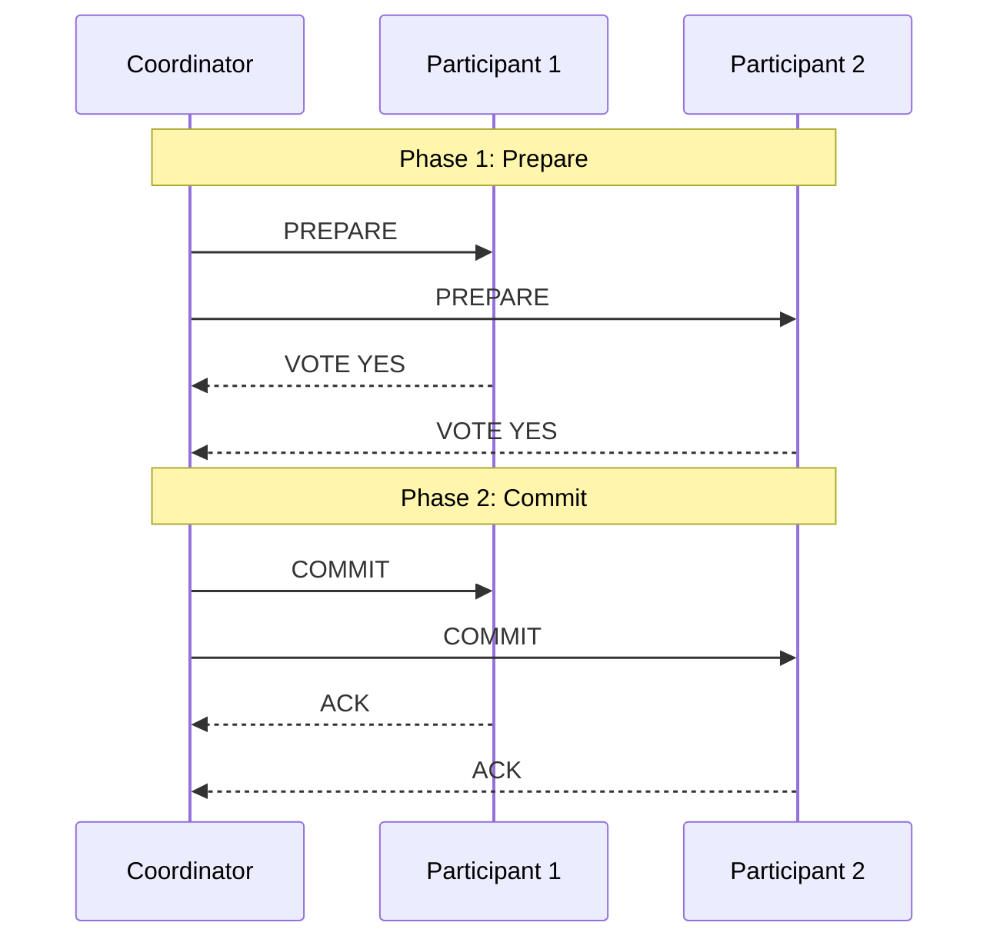

**SAGA Pattern** is an alternative for long-running distributed transactions. Instead of locking resources across multiple services, a saga breaks the transaction into a sequence of local transactions, each with a compensating action that can undo its effects.

For example, in an e-commerce order:
- T1: Reserve inventory → C1: Release inventory
- T2: Charge payment → C2: Refund payment  
- T3: Ship order → C3: Cancel shipment

If T3 fails, the saga executes C2, then C1, rolling back the entire business transaction without distributed locks.

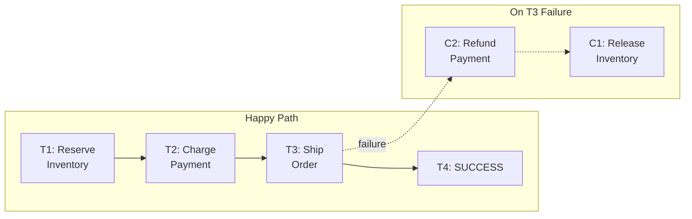

> **Saga vs 2PC:** Saga doesn't hold locks—each step commits locally. If step N fails, compensating transactions (C1...C(N-1)) undo previous work. Better for long-running distributed transactions.

---

## 2. Cloud Computing & Security

### ☁️ Cloud Computing Overview

On-demand IT resources with pay-as-you-go pricing. Three main categories:

| Category | Services | Examples |
|----------|----------|----------|
| **Compute** | VMs, containers, serverless | EC2, ECS/EKS, Lambda |
| **Storage** | Object, block, file | S3, EBS, EFS |
| **Database** | Relational, NoSQL, cache | RDS, DynamoDB, ElastiCache |

All services communicate through **VPC** (Virtual Private Cloud)—your isolated network with custom IP ranges, subnets, and routing.

### 🛡️ Security Fundamentals (Defense in Depth)

Layer multiple security controls—if one fails, others protect your assets:

| Pillar | What It Does | Key Components |
|--------|--------------|----------------|
| **IAM** | Controls who can do what | Users, Groups, Roles, Policies, MFA |
| **Encryption** | Protects data at rest & transit | KMS (at rest), TLS/SSL (transit), HSM |
| **Network** | Controls traffic flow | VPC, Subnets, Security Groups, NACLs |

**Principle**: Least privilege—grant only minimum access needed for each task.

### 🏛️ 3-Tier Application Security

A typical web application has three tiers, each with different security requirements. The key insight is that each tier should only communicate with its adjacent layers—the internet talks to the web tier, the web tier talks to the app tier, and the app tier talks to the database. No direct internet access to your database!

**Web Tier** sits in a public subnet and handles incoming HTTP/HTTPS traffic. Its security group allows inbound traffic on ports 80 and 443 from anywhere, but outbound traffic only goes to the application tier. All traffic should use TLS/SSL encryption.

**Application Tier** resides in a private subnet with no direct internet access. It accepts traffic only from the web tier's security group and can initiate connections to the database tier. Administrative access (SSH/RDP) should go through a bastion host or VPN, never directly from the internet.

**Database Tier** is the most protected layer, also in a private subnet. It accepts connections only from the application tier on the database port (e.g., 3306 for MySQL). Enable encryption at rest using KMS and encryption in transit using SSL certificates. Never expose database ports to the internet.

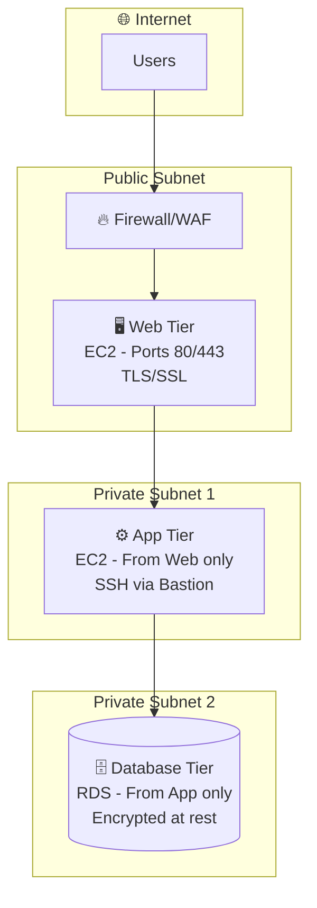

| Tier | Subnet | Security Group Rules |
|------|--------|---------------------|
| **Web** | Public | Inbound: 80/443 from Internet |
| **App** | Private | Inbound: From Web tier only, SSH via bastion |
| **DB** | Private | Inbound: DB port from App tier only |

### 🔒 Security Groups vs NACLs

Both Security Groups and Network ACLs (NACLs) filter traffic, but they operate at different levels and have important behavioral differences.

**Security Groups** are your first line of defense, operating at the instance level. They're **stateful**, meaning if you allow inbound traffic, the response is automatically allowed outbound—you don't need separate rules for request and response. Security Groups only have ALLOW rules; anything not explicitly allowed is denied.

**NACLs** operate at the subnet level and serve as a second layer of defense. They're **stateless**, so you must explicitly allow both inbound requests AND outbound responses. NACLs support both ALLOW and DENY rules, processed in numerical order—the first matching rule wins.

**When to use each**: Use Security Groups for most filtering needs since they're easier to manage. Use NACLs when you need to explicitly deny specific IP addresses or ranges, or when you want subnet-wide rules that apply regardless of instance security groups.

```
┌─────────────────────────────────────────────────────────────────┐
│         SECURITY GROUPS              vs           NACLs         │
├─────────────────────────────────────────────────────────────────┤
│                                                                 │
│  ┌───────────────────┐              ┌───────────────────┐      │
│  │  Instance Level   │              │   Subnet Level    │      │
│  │  (1st defense)    │              │   (2nd defense)   │      │
│  └───────────────────┘              └───────────────────┘      │
│                                                                 │
│  • STATEFUL                         • STATELESS                │
│    (return traffic                    (must explicitly         │
│     auto-allowed)                      allow return)           │
│                                                                 │
│  • Allow rules only                 • Allow AND Deny rules     │
│                                                                 │
│  • All rules evaluated              • Rules processed in       │
│                                       order (numbered)          │
│                                                                 │
│  ┌─────────────────────────────────────────────────────────┐   │
│  │                       VPC                                │   │
│  │  ┌────────────────────────────────────────────────┐     │   │
│  │  │              SUBNET (NACL)                      │     │   │
│  │  │  ┌──────────────┐    ┌──────────────┐          │     │   │
│  │  │  │   EC2 (SG)   │    │   EC2 (SG)   │          │     │   │
│  │  │  └──────────────┘    └──────────────┘          │     │   │
│  │  └────────────────────────────────────────────────┘     │   │
│  └─────────────────────────────────────────────────────────┘   │
└─────────────────────────────────────────────────────────────────┘
```

---

## 3. Networking & VPC

### 🌐 VPC Architecture

A Virtual Private Cloud (VPC) is your isolated network within the cloud. Think of it as your own private data center, but without the physical hardware to manage. When you create a VPC, you define a CIDR block (e.g., 172.31.0.0/16) that determines the IP address range for all resources within it.

**Subnets** divide your VPC into smaller network segments, each residing in a single Availability Zone. Public subnets have routes to an Internet Gateway, allowing resources to communicate with the internet. Private subnets don't have direct internet access—resources here can only reach the internet through a NAT Gateway (for outbound-only traffic).

**Route Tables** determine where network traffic is directed. Each subnet associates with a route table that contains rules like "send 0.0.0.0/0 (all internet traffic) to the Internet Gateway" or "send traffic to other subnets via the local router."

**Internet Gateway** enables communication between your VPC and the internet. It's horizontally scaled, redundant, and highly available by default.

**NAT Gateway** allows private subnet resources to initiate outbound internet connections (e.g., to download software updates) while preventing unsolicited inbound connections. The internet can only respond to requests—it cannot initiate connections to your private resources.

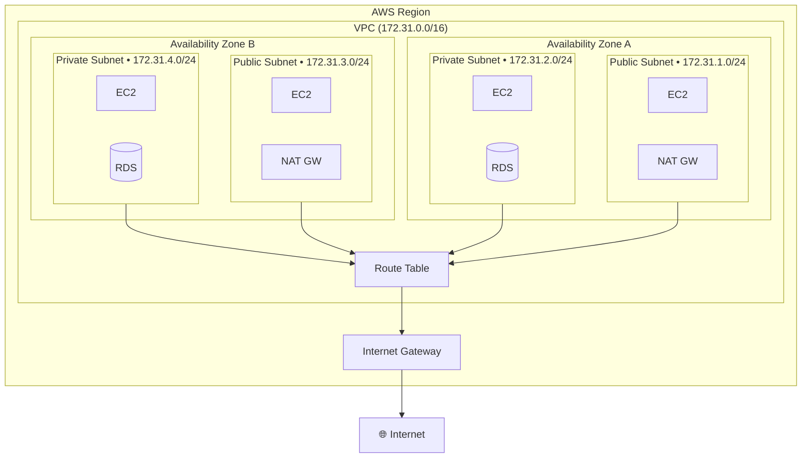

> **Key insight:** Public subnets route to Internet Gateway. Private subnets route through NAT Gateway for outbound-only internet access. Database in private subnet = no direct internet exposure.

### 🔍 DNS Resolution Flow

**DNS** (Domain Name System) translates domain names to IP addresses. When you type a URL into your browser, a chain of queries performs that translation. This process typically takes milliseconds but involves multiple servers across the internet.

**Step 1-2**: Your browser first checks its cache, then asks your configured DNS resolver (often your ISP's server or a public resolver like 8.8.8.8). If the resolver doesn't have the answer cached, it begins a recursive lookup.

**Step 3**: The resolver queries a root server. Root servers don't know specific domains, but they know which servers handle top-level domains like .com, .org, or .io. There are only 13 root server addresses (though many physical servers behind them).

**Step 4**: The resolver queries the TLD server for .com (or whatever the domain's TLD is). The TLD server responds with the authoritative nameservers for the specific domain.

**Step 5-6**: Finally, the resolver queries the authoritative nameserver for example.com, which returns the actual IP address. This answer is cached at various levels with TTL (time-to-live) values.

**Step 7**: Your browser connects to the web server at the returned IP address.

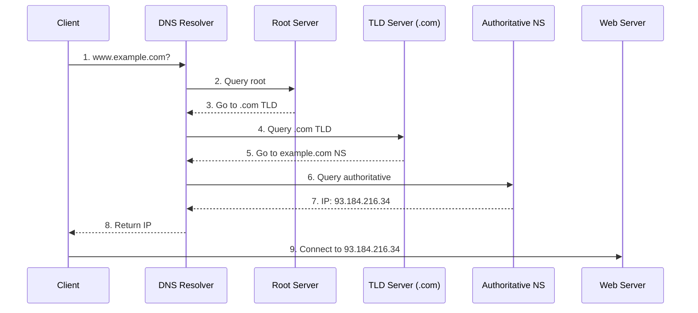

### 📡 TCP/IP Model

The TCP/IP model describes how data travels across networks in layers, with each layer handling specific responsibilities. Understanding this model helps you troubleshoot network issues and design systems that communicate efficiently.

**Physical Layer** deals with the actual hardware—cables, network interface cards, and the electrical or optical signals that carry data.

**Data Link Layer** handles communication between directly connected nodes. Ethernet is the most common protocol here. Switches operate at this layer, forwarding frames based on MAC addresses.

**Network Layer** routes packets across different networks. IP (Internet Protocol) operates here, and routers make forwarding decisions based on IP addresses. This is where logical addressing happens.

**Transport Layer** ensures reliable (**TCP**, Transmission Control Protocol) or fast (**UDP**, User Datagram Protocol) delivery between applications. TCP breaks data into segments, handles acknowledgments, retransmissions, and flow control. UDP is simpler and faster but doesn't guarantee delivery—perfect for real-time applications like video calls or gaming where a dropped packet matters less than latency.

**Application Layer** is where HTTP, FTP, SMTP, and other protocols live. This is the interface between network communication and your application code.

```
┌─────────────────────────────────────────────────────────────────┐
│                     TCP/IP MODEL                                │
│                                                                 │
│  Layer 5  ┌─────────────────────────────────────────────────┐  │
│           │              APPLICATION                         │  │
│           │         HTTP, FTP, SMTP, DNS                     │  │
│           └─────────────────────────────────────────────────┘  │
│                              │                                  │
│  Layer 4  ┌─────────────────────────────────────────────────┐  │
│           │               TRANSPORT                          │  │
│           │           TCP (reliable)                         │  │
│           │           UDP (fast)                             │  │
│           └─────────────────────────────────────────────────┘  │
│                              │                                  │
│  Layer 3  ┌─────────────────────────────────────────────────┐  │
│           │                NETWORK                           │  │
│           │            IP, Routers                           │  │
│           └─────────────────────────────────────────────────┘  │
│                              │                                  │
│  Layer 2  ┌─────────────────────────────────────────────────┐  │
│           │               DATA LINK                          │  │
│           │          Ethernet, Switches                      │  │
│           └─────────────────────────────────────────────────┘  │
│                              │                                  │
│  Layer 1  ┌─────────────────────────────────────────────────┐  │
│           │               PHYSICAL                           │  │
│           │         Cables, NICs, Hubs                       │  │
│           └─────────────────────────────────────────────────┘  │
│                                                                 │
│  TCP vs UDP:                                                   │
│  • TCP: Connection-oriented, reliable (file transfer, web)     │
│  • UDP: Connectionless, fast (streaming, gaming, VoIP)         │
└─────────────────────────────────────────────────────────────────┘
```

### 🔀 Proxies

| Type | Acts For | Use Cases | Examples |
|------|----------|-----------|----------|
| **Forward Proxy** | Clients | Mask IP, content filtering, caching, geo-bypass | Corporate proxy |
| **Reverse Proxy** | Servers | Load balancing, SSL termination, caching, WAF | Nginx, HAProxy, ALB |

```
Client → Forward Proxy → Internet → Reverse Proxy → Server
         (client-side)               (server-side)
```

---

## 4. Key Components

### ⚖️ Load Balancer with Auto Scaling

Load balancers distribute incoming traffic across multiple servers, preventing any single server from becoming overwhelmed and enabling horizontal scaling. Combined with auto-scaling, your application can automatically adjust capacity based on demand.

**How it works**: Clients connect to the load balancer's address (often via a DNS name like api.example.com). The load balancer monitors the health of backend servers and routes requests only to healthy instances. If a server fails health checks, traffic automatically shifts to remaining healthy servers.

**Auto Scaling Groups** manage the lifecycle of your servers. You define minimum (always running), maximum (cost cap), and desired capacity (normal state). Scaling policies adjust capacity based on metrics like CPU utilization, request count, or custom CloudWatch metrics. For predictable traffic patterns (like a daily sales event), scheduled scaling can pre-warm capacity before the spike hits.

**Key tip for high-traffic events**: Don't rely solely on reactive scaling. Pre-warm your load balancer and use scheduled scaling to have instances ready before the traffic arrives. The startup time for new instances includes launching the VM, running bootstrap scripts, and warming application caches—often several minutes.

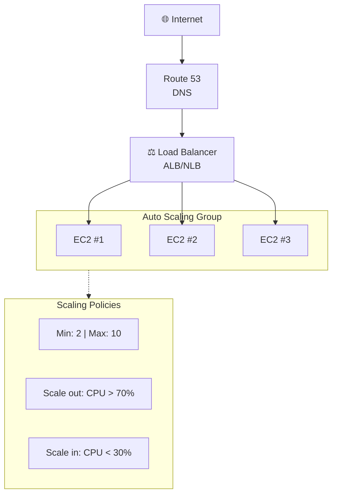

| Policy Type | Trigger | Action |
|-------------|---------|--------|
| **Target Tracking** | CPU > 70% | Add instances |
| **Step Scaling** | CPU > 90% | Add 2 instances |
| **Scheduled** | 9am weekdays | Pre-warm to 5 instances |

### 🔄 Load Balancer Types

The choice between Layer 4 and Layer 7 load balancers depends on your requirements for performance versus intelligence.

**Layer 4 (Network Load Balancer)** operates at the transport layer, making routing decisions based only on IP addresses and TCP/UDP ports. It's extremely fast—millions of requests per second with ultra-low latency—because it doesn't inspect packet contents. Use NLB when you need raw performance, non-HTTP protocols (gaming, IoT), or need to preserve client IPs.

**Layer 7 (Application Load Balancer)** operates at the HTTP/HTTPS layer, understanding the content of requests. It can route based on URL paths (/api/* to API servers, /images/* to media servers), HTTP headers, cookies, or even query strings. It handles SSL termination, freeing your servers from encryption overhead. Use ALB when you need content-based routing, sticky sessions, or WebSocket support.

**Load balancing algorithms** determine how traffic is distributed:
- **Round Robin**: Requests rotate through servers sequentially. Simple but doesn't account for server capacity differences.
- **Least Connections**: Sends traffic to the server with fewest active connections. Better for varying request durations.
- **IP Hash**: Uses client IP to determine the server, ensuring a client always hits the same server (sticky sessions without cookies).

```
┌─────────────────────────────────────────────────────────────────┐
│                   LOAD BALANCER TYPES                           │
│                                                                 │
│   LAYER 4 (Transport)          LAYER 7 (Application)           │
│   ┌─────────────────┐          ┌─────────────────┐             │
│   │ Network Load    │          │ Application     │             │
│   │   Balancer      │          │ Load Balancer   │             │
│   └────────┬────────┘          └────────┬────────┘             │
│            │                            │                       │
│   • TCP/UDP routing            • HTTP/HTTPS routing            │
│   • IP + Port based            • URL, Headers, Cookies         │
│   • Very fast (millions RPS)   • Content-based routing         │
│   • No inspection              • TLS termination               │
│   • Preserves client IP        • Rate limiting                 │
│                                                                 │
│   Use when:                    Use when:                       │
│   • Need raw performance       • Need smart routing            │
│   • Non-HTTP protocols         • Path-based routing            │
│   • Gaming, IoT, streaming     • Microservices                 │
│                                                                 │
│   Algorithms:                                                   │
│   ┌─────────────┬─────────────┬─────────────────────────────┐  │
│   │ Round Robin │ Least Conn  │ IP Hash (Sticky Sessions)   │  │
│   │     ↓       │     ↓       │            ↓                │  │
│   │  1→2→3→1    │  Route to   │  Same client → Same server  │  │
│   │             │  least busy │                             │  │
│   └─────────────┴─────────────┴─────────────────────────────┘  │
└─────────────────────────────────────────────────────────────────┘
```

### 🚪 API Gateway Pattern

An API Gateway serves as the single entry point for all client requests to your backend services. Instead of clients knowing about and connecting to multiple services directly, they connect to one gateway that handles routing, security, and cross-cutting concerns.

**Why use an API Gateway?**

Without a gateway, every microservice must implement authentication, rate limiting, logging, and CORS handling independently. This leads to code duplication, inconsistent security, and complex client code that must track multiple service endpoints.

**Key responsibilities:**

- **Authentication/Authorization**: Verify JWT tokens or API keys once at the gateway rather than in every service
- **Rate Limiting**: Protect services from abuse by limiting requests per client
- **Request Routing**: Direct `/users/*` to the User Service, `/orders/*` to the Order Service
- **Protocol Translation**: Accept REST from clients, communicate via gRPC to internal services
- **Request/Response Transformation**: Add headers, modify payloads, aggregate responses from multiple services
- **Logging and Monitoring**: Central place to capture metrics and traces for all API traffic

**Trade-offs**: The gateway can become a bottleneck and single point of failure if not properly scaled. It also adds latency to every request (typically 1-10ms). Design for horizontal scaling and deploy across multiple availability zones.

```
┌─────────────────────────────────────────────────────────────────┐
│                      API GATEWAY                                │
│                                                                 │
│   ┌────────┐  ┌────────┐  ┌────────┐                           │
│   │ Mobile │  │  Web   │  │  IoT   │                           │
│   │  App   │  │ Client │  │ Device │                           │
│   └───┬────┘  └───┬────┘  └───┬────┘                           │
│       │           │           │                                 │
│       └───────────┼───────────┘                                 │
│                   │                                             │
│           ┌───────┴───────┐                                     │
│           │  API GATEWAY  │                                     │
│           │               │                                     │
│           │ • Auth/AuthZ  │  ← Verify tokens once              │
│           │ • Rate Limit  │  ← Protect services                │
│           │ • SSL Term    │  ← Offload encryption              │
│           │ • Routing     │  ← Direct to services              │
│           │ • Logging     │  ← Central observability           │
│           └───────┬───────┘                                     │
│                   │                                             │
│       ┌───────────┼───────────┐                                 │
│       │           │           │                                 │
│       ▼           ▼           ▼                                 │
│   ┌───────┐   ┌───────┐   ┌───────┐                            │
│   │ User  │   │ Order │   │Product│                            │
│   │Service│   │Service│   │Service│                            │
│   └───────┘   └───────┘   └───────┘                            │
└─────────────────────────────────────────────────────────────────┘
```

### 🚦 Rate Limiting Algorithms

Rate limiting protects your services from being overwhelmed by too many requests—whether from a misbehaving client, a DDoS attack, or simply unexpected viral traffic. Different algorithms offer different trade-offs between burst handling, fairness, and implementation complexity.

**Token Bucket** is the most common algorithm, allowing controlled bursts. Imagine a bucket that holds tokens, with new tokens added at a fixed rate. Each request consumes a token. If the bucket is empty, the request is rejected (or queued). The bucket capacity determines maximum burst size, while the refill rate determines sustained throughput.

*Example*: A bucket with 100 tokens refilled at 10 tokens/second allows bursts of 100 requests but sustains only 10 RPS.

**Leaky Bucket** enforces a constant output rate regardless of input burstiness. Requests enter the bucket, but they "leak" out at a fixed rate. If the bucket overflows, excess requests are discarded. This is ideal when your downstream services need predictable, smooth traffic.

**Fixed Window Counter** divides time into fixed windows (e.g., 1-minute intervals) and counts requests per window. Simple to implement but has a boundary problem: a user could send 100 requests at 0:59 and another 100 at 1:00, effectively getting 200 requests in 2 seconds while respecting the 100/minute limit.

**Sliding Window** solves the boundary problem by looking at a rolling time window. It can be implemented as a log of timestamps (accurate but memory-heavy) or as a weighted average of current and previous windows (efficient approximation).

```
┌─────────────────────────────────────────────────────────────────┐
│                   RATE LIMITING ALGORITHMS                      │
│                                                                 │
│  TOKEN BUCKET                    LEAKY BUCKET                   │
│  ┌─────────────────┐            ┌─────────────────┐            │
│  │ Tokens added at │            │ Requests enter  │            │
│  │   fixed rate    │            │   at any rate   │            │
│  │       ↓         │            │       ↓         │            │
│  │   ┌───────┐     │            │   ┌───────┐     │            │
│  │   │ ● ● ● │     │            │   │ ● ● ● │     │            │
│  │   │ ● ●   │ cap │            │   │ ● ●   │     │            │
│  │   │ ●     │     │            │   │ ●     │     │            │
│  │   └───┬───┘     │            │   └───┬───┘     │            │
│  │       │         │            │       │leak     │            │
│  │       ▼         │            │       ▼         │            │
│  │   Requests      │            │   Constant      │            │
│  │   (burst OK)    │            │   output rate   │            │
│  └─────────────────┘            └─────────────────┘            │
│  Allows bursts up to            Smooths traffic to             │
│  bucket capacity                constant rate                  │
│                                                                 │
│  FIXED WINDOW                    SLIDING WINDOW                 │
│  ┌─────────────────┐            ┌─────────────────┐            │
│  │                 │            │                 │            │
│  │  |████|████|    │            │    ████████     │            │
│  │  |    |    |    │            │   ←──────────→  │            │
│  │  t0   t1   t2   │            │  Rolling window │            │
│  │                 │            │                 │            │
│  │ Reset at window │            │ Smoother, no    │            │
│  │ boundary        │            │ boundary issue  │            │
│  │ (boundary spike │            │                 │            │
│  │  problem!)      │            │                 │            │
│  └─────────────────┘            └─────────────────┘            │
└─────────────────────────────────────────────────────────────────┘
```

---

## 5. Databases

### 📊 SQL vs NoSQL

| Aspect | SQL (Relational) | NoSQL (Non-relational) |
|--------|------------------|------------------------|
| **Schema** | Fixed, predefined | Flexible, evolving |
| **Consistency** | ACID (strong) | BASE (eventual) |
| **Queries** | Complex JOINs | Simple key-based |
| **Scaling** | Vertical (traditionally) | Horizontal |
| **Examples** | MySQL, PostgreSQL | Redis, MongoDB, Cassandra |

**Choose SQL when**: Transactions critical, complex queries, relational data, data integrity paramount.
**Choose NoSQL when**: Massive scale, flexible schema, simple access patterns, high write throughput.

**Note**: Lines are blurring—PostgreSQL has JSON support, Spanner offers SQL at scale. Don't choose NoSQL just because "it scales."

### 🗃️ NoSQL Types

NoSQL isn't a single technology—it's a family of databases optimized for different data models and access patterns.

**Key-Value Stores** (Redis, DynamoDB) are the simplest: store a value with a key, retrieve it by key. Extremely fast for simple lookups. Redis extends this with data structures (lists, sets, sorted sets) making it great for caching, sessions, leaderboards, and real-time analytics.

**Document Databases** (MongoDB, Firestore) store semi-structured documents, typically JSON. Unlike relational tables, each document can have different fields. Ideal for content management, user profiles, or any domain where entities have varying attributes. They support querying on nested fields, not just keys.

**Graph Databases** (Neo4j, Amazon Neptune) model data as nodes and edges, optimized for traversing relationships. When you need to answer questions like "find friends of friends who also like jazz," graph databases outperform relational JOINs by orders of magnitude. Use for social networks, recommendation engines, fraud detection, and knowledge graphs.

**Columnar/Wide-Column Stores** (Cassandra, HBase, BigTable) organize data by columns rather than rows. When your query only needs 3 columns from a table with 100 columns, columnar storage reads only those 3 columns. This makes them excellent for analytics and aggregations over large datasets. They also excel at time-series data where you frequently query recent data.

```
┌─────────────────────────────────────────────────────────────────┐
│                      NoSQL TYPES                                │
│                                                                 │
│  KEY-VALUE              DOCUMENT              GRAPH             │
│  ┌───────────┐         ┌───────────┐         ┌───────────┐     │
│  │key → value│         │{          │         │  (A)──(B) │     │
│  │key → value│         │  "name":  │         │   │ \  │  │     │
│  │key → value│         │  "age":   │         │  (C)──(D) │     │
│  └───────────┘         │  "tags":[]│         └───────────┘     │
│                        │}          │                            │
│  Redis, DynamoDB       └───────────┘         Neo4j              │
│                        MongoDB               Amazon Neptune     │
│  Use: Cache,           Firestore                                │
│  sessions,             Use: CMS,             Use: Social nets,  │
│  leaderboards          catalogs,             recommendations,   │
│                        user profiles         fraud detection    │
│                                                                 │
│  COLUMNAR (Wide-Column)                                         │
│  ┌────────────────────────────────────────┐                    │
│  │ Row Key │ Col1  │ Col2  │ Col3  │ ... │                    │
│  │─────────┼───────┼───────┼───────┼─────│                    │
│  │ user1   │ name  │ email │       │     │  Sparse: rows can  │
│  │ user2   │ name  │       │ phone │     │  have diff columns │
│  └────────────────────────────────────────┘                    │
│  Cassandra, HBase, BigTable                                     │
│  Use: Analytics, time-series, IoT data, audit logs             │
└─────────────────────────────────────────────────────────────────┘
```

### 📋 Database Replication

Replication copies data across multiple servers for availability, durability, and read scalability. If one server fails, others continue serving requests. The key decision is how to handle writes.

**Master-Replica (Primary-Secondary)** is the most common pattern. One server (master) handles all writes and replicates changes to multiple replicas that handle reads. This scales read capacity linearly—add more replicas for more read throughput. The trade-off is replication lag: replicas may serve slightly stale data.

*Replication methods*:
- **Synchronous**: Master waits for replica acknowledgment before confirming write. Guarantees no data loss but adds latency.
- **Asynchronous**: Master confirms immediately, replicates in background. Faster writes but potential data loss if master fails before replication.

**Multi-AZ Deployment** protects against entire data center failures. Your primary database runs in Availability Zone A with a synchronous standby in Zone B. All writes go to primary; the standby continuously replays changes. If the primary fails, AWS automatically promotes the standby—typically within 60-120 seconds. Your application connects via a DNS endpoint that automatically points to the current primary.

*This is different from read replicas*: Multi-AZ is for high availability (automatic failover), while read replicas are for read scaling (manual promotion if needed).

```
┌─────────────────────────────────────────────────────────────────┐
│                 DATABASE REPLICATION                            │
│                                                                 │
│   MASTER-REPLICA (Read Replicas)                                │
│                                                                 │
│              Writes                                             │
│                 │                                               │
│                 ▼                                               │
│           ┌─────────┐                                           │
│           │ MASTER  │  ← All writes go here                    │
│           │  (RW)   │                                           │
│           └────┬────┘                                           │
│                │ Replication (sync or async)                    │
│       ┌────────┼────────┐                                       │
│       │        │        │                                       │
│       ▼        ▼        ▼                                       │
│   ┌───────┐┌───────┐┌───────┐                                  │
│   │Replica││Replica││Replica│  ← Handles reads                 │
│   │ (R)   ││ (R)   ││ (R)   │                                  │
│   └───────┘└───────┘└───────┘                                  │
│       ▲        ▲        ▲                                       │
│       └────────┼────────┘                                       │
│                │                                                │
│              Reads                                              │
│                                                                 │
│   MULTI-AZ DEPLOYMENT (High Availability)                       │
│   ┌─────────────────┐     ┌─────────────────┐                  │
│   │       AZ-A      │     │       AZ-B      │                  │
│   │   ┌─────────┐   │     │   ┌─────────┐   │                  │
│   │   │ PRIMARY │   │────►│   │ STANDBY │   │                  │
│   │   │   (RW)  │   │sync │   │  (Hot)  │   │                  │
│   │   └─────────┘   │     │   └─────────┘   │                  │
│   └─────────────────┘     └─────────────────┘                  │
│                                                                 │
│   Auto-failover: If primary fails, standby promoted            │
│   automatically in 60-120 seconds                              │
└─────────────────────────────────────────────────────────────────┘
```

### ⚡ Database Sharding

When a single database server can't handle your data volume or write throughput, sharding (horizontal partitioning) distributes data across multiple database servers. Each shard holds a subset of the data.

**How sharding works**: A shard key (like user_id) determines which shard stores each record. When your application needs to read or write data, it calculates the shard from the key and connects to the appropriate database.

**Sharding strategies**:

- **Hash-based**: Apply a hash function to the key, modulo the number of shards. Distributes data evenly but makes range queries difficult (querying users with IDs 1-1000 might hit all shards).
  
- **Range-based**: Assign ranges to shards (A-H on shard 1, I-P on shard 2). Enables efficient range queries but can create hotspots if data isn't uniformly distributed.
  
- **Directory-based**: A lookup service maps keys to shards. Most flexible but adds a potential bottleneck and single point of failure.

**The challenge**: Cross-shard queries are expensive. If you need to JOIN data across shards, you're doing multiple queries and combining results in your application. Design your shard key to keep related data together. For example, in a multi-tenant SaaS app, shard by tenant_id so all queries within a tenant hit one shard.

```
┌─────────────────────────────────────────────────────────────────┐
│                    DATABASE SHARDING                            │
│                                                                 │
│   Application makes request for user_id = 12345                 │
│                    │                                            │
│                    ▼                                            │
│           ┌─────────────────┐                                   │
│           │  Shard Router   │  ← Determines target shard       │
│           │  hash(12345) %3 │                                   │
│           │     = 0         │                                   │
│           └────────┬────────┘                                   │
│                    │                                            │
│       ┌────────────┼────────────┐                               │
│       │            │            │                               │
│       ▼            ▼            ▼                               │
│   ┌────────┐  ┌────────┐  ┌────────┐                           │
│   │Shard 0 │  │Shard 1 │  │Shard 2 │                           │
│   │────────│  │────────│  │────────│                           │
│   │hash=0  │  │hash=1  │  │hash=2  │                           │
│   │Users:  │  │Users:  │  │Users:  │                           │
│   │3,6,9...│  │1,4,7...│  │2,5,8...│                           │
│   └────────┘  └────────┘  └────────┘                           │
│                                                                 │
│   Sharding Strategies:                                          │
│   • Hash-based: Even distribution, poor range queries          │
│   • Range-based: Good ranges, risk of hotspots                 │
│   • Directory-based: Flexible, extra lookup step               │
│                                                                 │
│   Challenge: Cross-shard queries need aggregation in app       │
│   Solution: Choose shard key to keep related data together     │
└─────────────────────────────────────────────────────────────────┘
```

---

## 6. Caching

### 🏎️ Cache Architecture

A cache is a high-speed data storage layer that stores a subset of data so future requests can be served faster than querying the primary data store. Caches are typically stored in memory (RAM), which is orders of magnitude faster than disk-based databases.

**Why cache?** Consider an e-commerce product page. Without caching, every page view queries the database for product details, reviews, and recommendations. At scale, this overwhelms the database. With caching, the first request populates the cache; subsequent requests are served from memory in microseconds rather than milliseconds.

**Cache-aside (Lazy Loading)** is the most common pattern:
1. Application checks cache for data
2. **Cache hit**: Return cached data immediately
3. **Cache miss**: Query database, store result in cache, return to client

The application manages both the cache and database, giving full control over what gets cached and when. The downside is that the first request for any data always hits the database, and you must handle cache invalidation when data changes.

**Measuring cache effectiveness**: The cache hit ratio (percentage of requests served from cache) directly impacts performance.

#### Effective Access Time (EAT)

$$
\text{EAT} = (h \times t_c) + ((1-h) \times t_d)
$$

> **Terms:** h = cache hit ratio (0-1), $t_c$ = cache access time, $t_d$ = database access time, $(1-h)$ = miss ratio

**📝 Example:**
```
95% hit rate, 1ms cache, 100ms database:
EAT = (0.95 × 1) + (0.05 × 100) = 5.95ms
Without cache: 100ms → With cache: ~6ms (17× faster!)
```

```
┌─────────────────────────────────────────────────────────────────┐
│                    CACHING ARCHITECTURE                         │
│                                                                 │
│   ┌──────┐        ┌───────────────┐        ┌──────────┐        │
│   │Client│───────►│  Application  │───────►│ Database │        │
│   └──────┘        │    Server     │        └──────────┘        │
│                   └───────┬───────┘              ▲              │
│                           │                      │              │
│                           ▼                      │              │
│                   ┌───────────────┐              │              │
│                   │     CACHE     │──────────────┘              │
│                   │  (Redis/MC)   │     Cache Miss              │
│                   └───────────────┘                             │
│                                                                 │
│   CACHE-ASIDE PATTERN (Lazy Loading)                            │
│   ┌─────────────────────────────────────────────────────────┐  │
│   │  1. App checks cache for key                             │  │
│   │  2. If HIT  → return cached data (fast path)            │  │
│   │  3. If MISS → query DB → write to cache → return        │  │
│   └─────────────────────────────────────────────────────────┘  │
│                                                                 │
│   Cache Performance Formula:                                    │
│   EAT = (Hit% × HitTime) + (Miss% × MissTime)                  │
│                                                                 │
│   Example: 95% hit rate, 1ms hit, 100ms miss                   │
│   EAT = (0.95 × 1) + (0.05 × 100) = 5.95ms                    │
│   Without cache: 100ms → With cache: ~6ms (17x faster!)        │
└─────────────────────────────────────────────────────────────────┘
```

### 📝 Caching Strategies

Different write strategies offer trade-offs between consistency, performance, and complexity.

**Write-Through** writes data to both cache and database synchronously. The write isn't considered complete until both succeed. This ensures cache and database are always consistent but adds latency to write operations since you're waiting for two writes.

*Use when*: Consistency is critical and write frequency is low (user profiles, configuration).

**Write-Back (Write-Behind)** writes to cache immediately and returns to the client. The cache asynchronously persists to the database later (often batched for efficiency). This provides excellent write performance but risks data loss—if the cache fails before persisting, updates are lost.

*Use when*: Write performance is critical and some data loss is acceptable (gaming leaderboards, analytics counters).

**Write-Around** bypasses the cache on writes, writing directly to the database. The cache is only populated on reads (cache-aside). This prevents the cache from being filled with data that might never be read, but the first read after a write always hits the database.

*Use when*: Data is written frequently but read rarely (logs, audit trails).

**Cache Invalidation** is the hardest problem in caching. When database data changes, the cache must be updated or invalidated. Strategies include:
- **TTL (Time-To-Live)**: Data expires after a set time. Simple but may serve stale data.
- **Active Invalidation**: Application explicitly deletes/updates cache when data changes.
- **Event-Driven**: Database changes trigger cache invalidation via messaging.

```
┌─────────────────────────────────────────────────────────────────┐
│                   CACHING STRATEGIES                            │
│                                                                 │
│  WRITE-THROUGH               WRITE-BACK (LAZY)                  │
│  ┌─────────────────┐        ┌─────────────────┐                │
│  │   Write to DB   │        │  Write to Cache │                │
│  │       AND       │        │      ONLY       │                │
│  │  Cache together │        │  (Async to DB)  │                │
│  │                 │        │                 │                │
│  │  App → Cache    │        │  App → Cache    │                │
│  │   ↓      ↓      │        │         ↓       │                │
│  │  DB ←────┘      │        │        DB       │                │
│  │  (synchronous)  │        │    (batched)    │                │
│  └─────────────────┘        └─────────────────┘                │
│  ✓ Always consistent        ✓ Fast writes                      │
│  ✗ Higher write latency     ✗ Risk of data loss               │
│                                                                 │
│  WRITE-AROUND                                                   │
│  ┌─────────────────┐                                           │
│  │  Write to DB    │                                           │
│  │  BYPASS Cache   │                                           │
│  │                 │                                           │
│  │  App ──────► DB │                                           │
│  │       Cache     │  Cache only populated on reads            │
│  │   (not updated) │                                           │
│  └─────────────────┘                                           │
│  ✓ No cache pollution from write-heavy, read-rare data        │
│  ✗ First read always misses                                   │
│                                                                 │
│  CACHE INVALIDATION (the hard problem):                        │
│  • TTL: Simple but may serve stale data                        │
│  • Active: App deletes cache on DB update                      │
│  • Events: DB changes → message → cache invalidation           │
└─────────────────────────────────────────────────────────────────┘
```

### 🔴 Redis vs Memcached

| Feature | Redis | Memcached |
|---------|-------|-----------|
| **Data Types** | Strings, Lists, Sets, Hashes, Sorted Sets | Strings only |
| **Persistence** | Yes (RDB + AOF) | No (volatile) |
| **Replication** | Built-in | No |
| **Threading** | Single (100K+ ops/s) | Multi-threaded |
| **Use Cases** | Sessions, queues, leaderboards, pub/sub | Simple caching, large objects |

**Rule of thumb**: Start with Redis unless you specifically need multi-threaded caching of simple strings.

---

## 7. Message Queues & Pub/Sub

### 📬 Message Queue Architecture

Message queues decouple components by allowing asynchronous communication. Instead of Service A calling Service B directly (synchronous), Service A puts a message in a queue and continues its work. Service B processes the message when ready.

**Why use queues?**
- **Decoupling**: Services don't need to know about each other
- **Buffering**: Handle traffic spikes by queuing excess requests
- **Reliability**: Messages persist until processed, surviving service restarts
- **Scalability**: Add more consumers to process messages faster

**Queue vs Pub/Sub** are fundamentally different patterns:

In a **Queue**, each message is delivered to exactly one consumer. When multiple consumers listen to the same queue, they compete for messages—each message goes to only one of them. This is perfect for task distribution (process these 1000 images).

In **Pub/Sub**, each message is delivered to all subscribers of a topic. When a user posts a tweet, multiple services need to know: the notification service, the analytics service, the timeline service. Each gets its own copy of the message.

**Dead Letter Queue (DLQ)** handles messages that repeatedly fail processing. After N retries, the message moves to the DLQ for manual inspection rather than blocking the queue or being lost. Common causes: malformed data, bugs in consumer code, or downstream service failures.

```
┌─────────────────────────────────────────────────────────────────┐
│                   MESSAGE QUEUE                                 │
│                                                                 │
│   ┌──────────┐      ┌─────────────────┐      ┌──────────┐      │
│   │ Producer │─────►│     QUEUE       │─────►│ Consumer │      │
│   └──────────┘      │  ┌───┬───┬───┐  │      └──────────┘      │
│                     │  │ 1 │ 2 │ 3 │  │                        │
│                     │  └───┴───┴───┘  │                        │
│                     └─────────────────┘                        │
│                                                                 │
│   Point-to-Point: Each message goes to ONE consumer            │
│   Use: Task distribution, work queues, job processing          │
│                                                                 │
│                   PUB/SUB (Publish-Subscribe)                   │
│                                                                 │
│   ┌──────────┐      ┌─────────────────┐      ┌──────────┐      │
│   │Publisher │─────►│     TOPIC       │─────►│Subscriber│      │
│   └──────────┘      │    (Broker)     │──┐   └──────────┘      │
│                     └─────────────────┘  │                      │
│                                          │   ┌──────────┐      │
│                                          └──►│Subscriber│      │
│                                              └──────────┘      │
│                                                                 │
│   Broadcast: Each message goes to ALL subscribers              │
│   Use: Event notification, real-time updates, fan-out          │
└─────────────────────────────────────────────────────────────────┘
```

### 🔶 Kafka Architecture

Apache Kafka is a distributed streaming platform designed for high-throughput, fault-tolerant message handling. Unlike traditional queues, Kafka persists messages to disk and allows consumers to "replay" historical messages.

**Core concepts**:

**Topics** are categories for messages (think: database tables). A topic is split into **partitions** distributed across brokers. Each partition is an ordered, immutable sequence of messages.

**Partitions** enable parallelism. If a topic has 10 partitions, you can have up to 10 consumers reading in parallel. Messages within a partition maintain order, but there's no global ordering across partitions.

**Consumer Groups** enable both pub/sub and queue semantics. Consumers in the same group share partitions (queue behavior—each message to one consumer). Different consumer groups each receive all messages (pub/sub behavior).

**Offsets** track consumer progress. Each message has an offset (position in partition). Consumers commit offsets to mark progress. If a consumer restarts, it resumes from the last committed offset—no messages lost.

**Why Kafka over RabbitMQ?**
- Kafka: High throughput, message replay, stream processing. Better for analytics, logs, event sourcing.
- RabbitMQ: Lower latency, complex routing, traditional messaging. Better for task queues, RPC patterns.

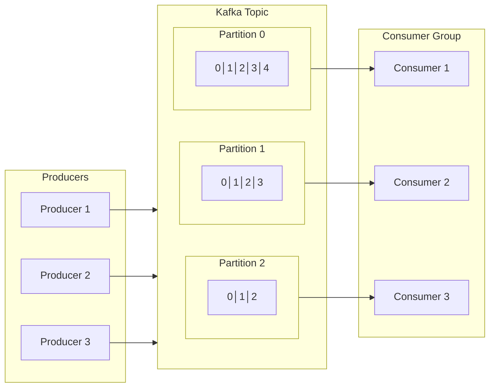

| Feature | Description |
|---------|-------------|
| **Ordering** | Guaranteed WITHIN partition, not across |
| **Persistence** | Messages stored on disk, replayable |
| **Throughput** | Millions of messages/sec |
| **Consumer Groups** | Share partitions (queue) or broadcast (pub/sub) |

> **Kafka vs RabbitMQ:** Kafka = log-based, replayable, high throughput (events, analytics). RabbitMQ = traditional queue, lower latency (tasks, RPC).

### 💀 Dead Letter Queue

When message processing fails repeatedly, you need a strategy to prevent one "poison pill" message from blocking your entire queue. Dead Letter Queues (DLQs) solve this by moving problematic messages aside for investigation.

**How it works**: Configure a retry policy (e.g., 3 attempts with exponential backoff). If a message fails all retries, the queue automatically moves it to the DLQ. Your main queue continues processing other messages while engineers investigate the DLQ contents.

**What causes DLQ messages?**
- **Malformed data**: A message with unexpected format that causes parsing errors
- **Business logic failures**: Data that violates constraints (e.g., negative quantities)
- **Downstream failures**: A dependent service is down (though this might warrant infinite retries)
- **Bugs**: Consumer code has a bug handling certain edge cases

**Best practices**:
- Monitor DLQ depth—it should be empty or near-empty
- Set up alerts when messages enter the DLQ
- Include debugging metadata (original timestamp, failure reason, retry count)
- Build tooling to replay DLQ messages after fixing issues

```
┌─────────────────────────────────────────────────────────────────┐
│                   DEAD LETTER QUEUE (DLQ)                       │
│                                                                 │
│   ┌──────────┐      ┌─────────────┐      ┌──────────┐          │
│   │ Producer │─────►│ Main Queue  │─────►│ Consumer │          │
│   └──────────┘      └──────┬──────┘      └────┬─────┘          │
│                            │                   │                │
│                            │    Retry 1:  ✗   │                │
│                            │    Retry 2:  ✗   │                │
│                            │    Retry 3:  ✗   │                │
│                            │                   │                │
│                            ▼                   │                │
│                     ┌──────────────┐           │                │
│                     │  Dead Letter │◄──────────┘                │
│                     │    Queue     │  After max retries         │
│                     └──────┬───────┘                            │
│                            │                                    │
│                            ▼                                    │
│                    Manual inspection                            │
│                    Fix issue → Replay                           │
│                                                                 │
│   DLQ messages caused by:                                       │
│   • Malformed data (parsing errors)                            │
│   • Business rule violations                                   │
│   • Consumer bugs on edge cases                                │
│   • Downstream service failures (maybe infinite retry instead) │
│                                                                 │
│   Best practices:                                               │
│   • Monitor DLQ depth (should be ~0)                           │
│   • Alert on new DLQ messages                                  │
│   • Include debugging metadata                                 │
│   • Build replay tooling                                       │
└─────────────────────────────────────────────────────────────────┘
```

---

## 8. Storage

### 💾 Storage Types Comparison

| Type | How It Works | Characteristics | Use Cases |
|------|--------------|-----------------|-----------|
| **Block (EBS)** | Raw blocks, mount as volume | Single EC2, lowest latency, highest IOPS | Databases, OS boot volumes |
| **File (EFS/FSx)** | NFS/SMB file system | Shared across instances, auto-scales | CMS, shared data, containers |
| **Object (S3)** | HTTP API, flat namespace | Unlimited capacity, 11 9s durability | Media, backups, data lakes |

**Key insight**: Block for performance, File for sharing, Object for scale. S3 is NOT for databases (no POSIX, higher latency).

### ⚡ Storage Performance Comparison

| Metric | Block (EBS) | File (EFS) | Object (S3) |
|--------|-------------|------------|-------------|
| **Latency** | <1ms | 1-10ms | 100-200ms |
| **Max IOPS** | 256,000 | Scales | N/A |
| **Throughput** | 4,000 MB/s | Scales | Unlimited (parallel) |
| **Access** | Single EC2 | Multiple | HTTP API |
| **Scope** | AZ | Regional | Regional |
| **Cost** | $$ | $$$ | $ |

**Choose**: EBS for databases (latency), EFS for shared files (concurrency), S3 for archives (cost/scale).

### 🌍 CDN Architecture

Caches content at edge locations worldwide, serving users from the nearest location.

```
Without CDN: User → 150ms → Origin → 150ms → User (300ms round-trip)
With CDN:    User → 5ms → Edge (cache hit!) → User (5ms total)
```

| CDN Type | How It Works | Best For |
|----------|--------------|----------|
| **Pull** | Fetches on first request, then caches | Most use cases (simpler) |
| **Push** | You upload content proactively | Large files, predictable content |

**Benefits beyond caching**: DDoS protection, SSL termination, image optimization, geo-load balancing.
**AWS CloudFront**: Integrates with Shield (DDoS), WAF, Lambda@Edge.

---

## 9. Scalability Patterns

### 📈 Horizontal vs Vertical Scaling

| Approach | How | Pros | Cons |
|----------|-----|------|------|
| **Vertical (Up)** | Bigger servers | Simple, no code changes | Hardware limits, expensive, SPOF |
| **Horizontal (Out)** | More servers | No limit, fault tolerant | Stateless design, distributed complexity |

**Reality**: Use both. Vertical for databases (easier consistency), horizontal for stateless app servers.

### 🧩 Microservices Architecture

Small, independent services that communicate over the network. Each owns its data and can scale independently.

| Benefits | Challenges |
|----------|------------|
| Independent scaling | Network complexity (failures, timeouts) |
| Technology diversity | Data consistency (sagas, eventual) |
| Fault isolation | Operational overhead |
| Team autonomy | Debugging (need distributed tracing) |

**When to use**: Large teams, large apps, different scaling needs. NOT for startups—start with a monolith, extract services when needed.

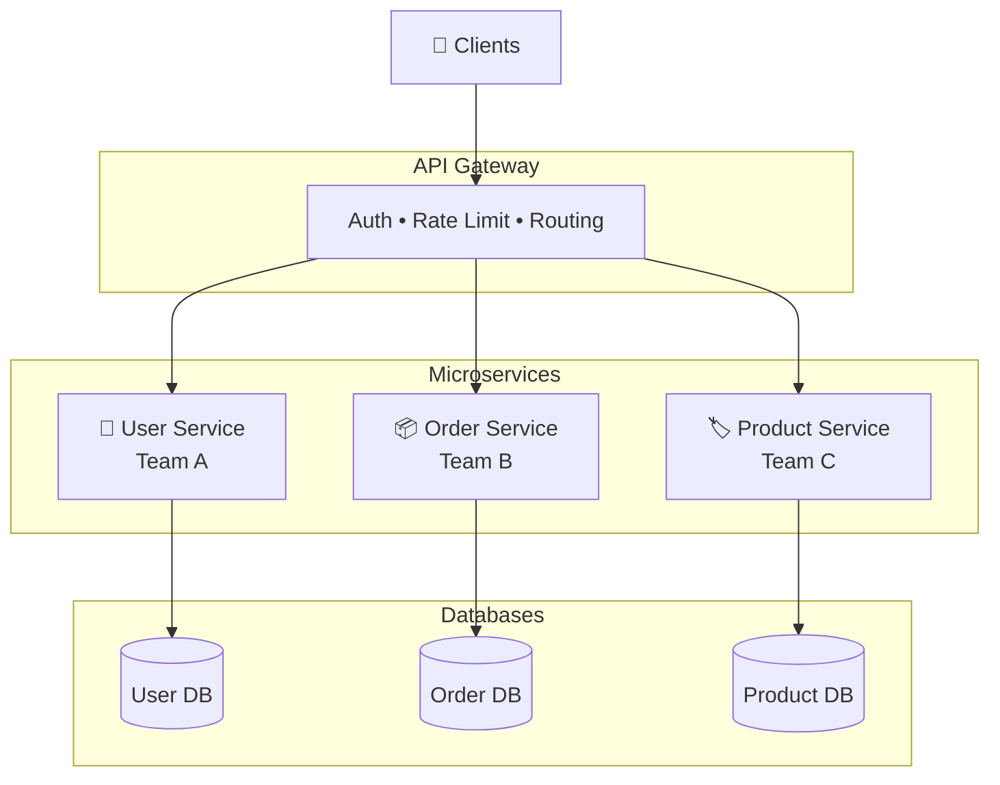

| Benefits | Challenges |
|----------|------------|
| ✅ Independent scaling | ❌ Network latency/failures |
| ✅ Technology flexibility | ❌ Data consistency (sagas) |
| ✅ Fault isolation | ❌ Operational complexity |
| ✅ Team autonomy | ❌ Debugging (need tracing) |

> **Start with a monolith.** Extract services when there's clear benefit—don't start with microservices!

### 🛡️ Disaster Recovery

Disaster Recovery (DR) plans for the worst: entire region failures, natural disasters, or catastrophic bugs. Your DR strategy depends on two key metrics:

**RTO (Recovery Time Objective)**: Maximum acceptable downtime. How long can your business survive without the system? E-commerce during Black Friday might need minutes; an internal reporting tool might tolerate hours.

**RPO (Recovery Point Objective)**: Maximum acceptable data loss. How much data can you afford to lose? A social media platform might accept losing the last hour of posts; a bank can't lose any transactions.

**DR Strategies** (from least to most expensive):

**Backup & Restore**: Regular backups to another region. Cheapest but slowest recovery (hours). RPO = time since last backup.

**Pilot Light**: Minimal core infrastructure running in DR region (databases replicating). On disaster, spin up remaining infrastructure. Recovery in tens of minutes.

**Warm Standby**: Scaled-down but functional environment in DR region. Traffic can be routed there immediately. Recovery in minutes.

**Hot Standby (Multi-Site)**: Full production capacity in both regions, traffic split between them. Instant failover, zero data loss. Most expensive but best RTO/RPO.

Route 53 (DNS) handles failover by directing traffic to the healthy region based on health checks.

```
┌─────────────────────────────────────────────────────────────────┐
│                  DISASTER RECOVERY                              │
│                                                                 │
│   RTO: Recovery Time Objective (max downtime you can tolerate) │
│   RPO: Recovery Point Objective (max data loss you can accept) │
│                                                                 │
│   PRIMARY REGION (us-east-1)     SECONDARY REGION (us-west-2)  │
│   ┌─────────────────────────┐    ┌─────────────────────────┐   │
│   │                         │    │                         │   │
│   │  ┌─────┐    ┌─────┐    │    │  ┌─────┐    ┌─────┐    │   │
│   │  │ EC2 │    │ EC2 │    │    │  │ EC2 │    │ EC2 │    │   │
│   │  └──┬──┘    └──┬──┘    │    │  └──┬──┘    └──┬──┘    │   │
│   │     │          │        │    │     │          │        │   │
│   │     └────┬─────┘        │    │     └────┬─────┘        │   │
│   │          │              │    │          │              │   │
│   │     ┌────┴────┐         │    │     ┌────┴────┐         │   │
│   │     │   RDS   │─────────┼────┼────►│   RDS   │         │   │
│   │     │ Primary │  Async  │    │     │ Standby │         │   │
│   │     └─────────┘  Repli- │    │     └─────────┘         │   │
│   │                  cation │    │                         │   │
│   └─────────────────────────┘    └─────────────────────────┘   │
│              │                              │                   │
│              └──────────────┬───────────────┘                   │
│                             │                                   │
│                      ┌──────┴──────┐                           │
│                      │  Route 53   │  DNS health check         │
│                      │ (Failover)  │  auto-switches traffic    │
│                      └─────────────┘                           │
│                                                                 │
│   Strategy      │ RTO      │ RPO      │ Cost                   │
│   ─────────────────────────────────────────────                │
│   Backup/Restore│ Hours    │ Hours    │ $                      │
│   Pilot Light   │ 10s mins │ Minutes  │ $$                     │
│   Warm Standby  │ Minutes  │ Minutes  │ $$$                    │
│   Hot Standby   │ Seconds  │ Zero     │ $$$$                   │
└─────────────────────────────────────────────────────────────────┘
```

---

## 10. Distributed System Patterns

### 🔄 Consistent Hashing

Standard hashing (hash(key) % N) has a major problem: when you add or remove a node, almost all keys need to move. Consistent hashing solves this by mapping both keys and nodes onto a ring.

**How it works**: Imagine a ring representing the full hash space (0 to 2^32-1). Nodes are placed on the ring at positions determined by hashing their identifiers. Keys are also hashed to positions. Each key belongs to the first node encountered when moving clockwise from the key's position.

**Why it's better**: When a node joins or leaves, only keys between it and its predecessor need to move—roughly 1/N of the keys instead of nearly all of them. This minimizes disruption during scaling or failures.

**Virtual nodes** improve distribution. Instead of each physical node having one position, give it many "virtual" positions. This ensures more even distribution of keys, especially with heterogeneous node capacities.

```
┌─────────────────────────────────────────────────────────────────┐
│                  CONSISTENT HASHING                             │
│                                                                 │
│   Standard hashing: hash(key) % N                               │
│   Problem: If N changes, almost ALL keys move!                 │
│                                                                 │
│   Consistent hashing: Both keys and nodes on a ring            │
│                                                                 │
│                        0                                        │
│                        │                                        │
│              ┌─────────┴─────────┐                              │
│             /                     \                             │
│            /      Node A           \                            │
│           │         ● (hash: 100)   │                           │
│           │    ★ key1 (hash: 80)    │  key1 → clockwise → A    │
│    270 ───┤                         ├─── 90                     │
│           │                         │                           │
│           │    ●                 ●  │                           │
│           │  Node C          Node B │                           │
│            \  (240)           (180) /                           │
│             \                     /                             │
│              └─────────┬─────────┘                              │
│                        │                                        │
│                       180                                       │
│                                                                 │
│   When Node B leaves: Only keys between C and B move to A      │
│   When Node D joins: Only keys in its range move to D          │
│                                                                 │
│   Virtual nodes: Each physical node → multiple ring positions  │
│   Benefits: More even distribution, handle capacity differences│
└─────────────────────────────────────────────────────────────────┘
```

### 🗳️ Quorum

Quorum-based systems balance consistency and availability by requiring a minimum number of nodes to participate in reads and writes. This ensures that reads and writes have at least one node in common.

#### Strong Consistency Condition

$$
W + R > N
$$

> **Terms:** N = total replicas, W = write quorum (nodes acknowledging write), R = read quorum (nodes responding to read)

> **💡 Intuition:** If W + R > N, every read will see at least one node that participated in the most recent write—guaranteeing strong consistency.

**Common configurations**:
- **W=N, R=1**: Strong consistency on writes, fast reads. But writes fail if any node is down.
- **W=1, R=N**: Fast writes, but reads are slow and must query all nodes.
- **W=majority, R=majority**: Balanced. For N=3, W=2, R=2 allows one node failure while maintaining consistency.

**Eventual consistency** (W=1, R=1): Fastest but no consistency guarantee. The write might go to node A while the read goes to node B, which hasn't replicated yet.

```
┌─────────────────────────────────────────────────────────────────┐
│                      QUORUM                                     │
│                                                                 │
│   N = Total replicas                                           │
│   W = Write quorum (nodes acknowledging write)                 │
│   R = Read quorum (nodes responding to read)                   │
│                                                                 │
│   RULE: W + R > N  →  Guarantees overlap (strong consistency)  │
│                                                                 │
│   Example: N=3, W=2, R=2  →  2+2=4 > 3 ✓                       │
│                                                                 │
│   WRITE (W=2 must ACK)          READ (R=2 must respond)        │
│   ┌───┐ ┌───┐ ┌───┐              ┌───┐ ┌───┐ ┌───┐            │
│   │ ✓ │ │ ✓ │ │   │              │ ✓ │ │ ✓ │ │   │            │
│   │N1 │ │N2 │ │N3 │              │N1 │ │N2 │ │N3 │            │
│   └───┘ └───┘ └───┘              └───┘ └───┘ └───┘            │
│     │     │                        │     │                     │
│     └──┬──┘                        └──┬──┘                     │
│        │                              │                        │
│    W=2 ✓                          R=2 ✓                        │
│                                                                 │
│   N1 and N2 overlap → Read sees latest write!                  │
│                                                                 │
│   Configurations:                                               │
│   • W=N, R=1: Strong write, one node down blocks writes       │
│   • W=1, R=N: Fast writes, must read all nodes                │
│   • W=majority, R=majority: Balanced (recommended)             │
│   • W=1, R=1: Eventual consistency (no guarantee)              │
└─────────────────────────────────────────────────────────────────┘
```

### 👑 Leader Election

Many distributed systems need a single "leader" to coordinate activities—processing writes, assigning work, or making decisions. Leader election algorithms ensure exactly one leader is chosen, even as nodes fail and recover.

**Why it's hard**: In a distributed system, nodes can't see each other's state directly. Network partitions might make it appear a leader is dead when it's actually fine. Having two leaders (split-brain) can cause data corruption.

**Raft** is a popular consensus algorithm that's easier to understand than Paxos. Nodes are either leaders, followers, or candidates. Leaders send heartbeats; if followers don't hear from the leader, they become candidates and request votes. The candidate with majority votes becomes the new leader.

**Coordination services** like ZooKeeper and etcd implement leader election so you don't have to. They provide strongly consistent key-value storage with features like ephemeral nodes (disappear when client disconnects) and watches (notify when data changes). Use these rather than implementing consensus yourself!

```
┌─────────────────────────────────────────────────────────────────┐
│                   LEADER ELECTION                               │
│                                                                 │
│   Why: Coordinate writes, assign work, make decisions          │
│   Challenge: Network partitions can cause "split brain"        │
│                                                                 │
│   ┌───────┐     ┌───────┐     ┌───────┐                        │
│   │Node A │     │Node B │     │Node C │                        │
│   │Follower│    │Follower│    │Follower│                       │
│   └───┬───┘     └───┬───┘     └───┬───┘                        │
│       │             │             │                             │
│       │   Leader timeout!         │                             │
│       │   A becomes candidate     │                             │
│       │             │             │                             │
│       │──Request vote────────────►│                             │
│       │◄─Vote yes─────────────────│                             │
│       │──Request vote───►│        │                             │
│       │◄─Vote yes────────│        │                             │
│       │             │             │                             │
│       │   Majority! A is leader   │                             │
│       │             │             │                             │
│       ▼             ▼             ▼                             │
│   ┌───────┐     ┌───────┐     ┌───────┐                        │
│   │ LEADER│     │Follower│    │Follower│                        │
│   └───────┘     └───────┘     └───────┘                        │
│       │             │             │                             │
│       │──Heartbeat──────────────►│  Leader sends heartbeats    │
│       │──Heartbeat───►│          │  Followers reset timeout    │
│                                                                 │
│   Don't implement yourself! Use:                               │
│   • ZooKeeper: Mature, battle-tested                           │
│   • etcd: Simpler, Kubernetes uses it                          │
│   • Consul: Also provides service discovery                    │
└─────────────────────────────────────────────────────────────────┘
```

---

## 11. Capacity Estimation

### ⏱️ Key Latencies & QPS

| Operation | Latency | Typical QPS |
|-----------|---------|-------------|
| L1 Cache | 0.5 ns | - |
| L2 Cache | 7 ns | - |
| Main Memory | 100 ns | - |
| SSD Random Read | 150 μs | - |
| Network Round Trip | 500 μs | - |
| MySQL Query | 1-10 ms | ~1,000 |
| Key-Value (Redis) | <1 ms | ~10,000 |
| In-Memory Cache | <0.1 ms | ~100K-1M |

**Why KV is 10x faster than SQL**: O(1) hash lookup vs B-tree traversal, no query parsing, no JOINs.
**Key constant**: 86,400 seconds/day (24 × 60 × 60)—use for converting daily volume to QPS.

### 🧮 Estimation Formulas

Back-of-the-envelope calculations help you quickly assess whether a design is feasible. The goal isn't precision—it's understanding the order of magnitude.

#### QPS (Queries Per Second)

$$
\text{QPS}_{\text{avg}} = \frac{\text{DAU} \times R}{86400}
$$

$$
\text{QPS}_{\text{peak}} = \text{QPS}_{\text{avg}} \times M
$$

> **Terms:** DAU = daily active users, R = requests per user per day, 86400 = seconds per day, M = peak multiplier (typically 2-3×)

**📝 Example:** 1M DAU, 5 requests/user/day
```
Average = (1,000,000 × 5) / 86,400 = ~58 QPS
Peak = 58 × 3 = ~174 QPS
```

---

#### Storage

$$
S_{\text{daily}} = N \times s
$$

$$
S_{\text{total}} = S_{\text{daily}} \times d \times r
$$

> **Terms:** N = records per day, s = record size (bytes), d = retention days, r = replication factor (typically 3×)

**📝 Example:** 100M URLs/day, 500 bytes, 5 years, 3× replication
```
Daily = 100M × 500B = 50 GB
5 Years = 50GB × 365 × 5 × 3 = ~275 TB
```

---

#### Bandwidth

$$
\text{BW} = \text{QPS} \times \bar{s}
$$

> **Terms:** BW = bandwidth, $\bar{s}$ = average request/response size

**📝 Example:** 100 QPS × 10KB = 1 MB/s = 8 Mbps

---

#### Servers Needed

$$
N_{\text{servers}} = \frac{\text{QPS}_{\text{peak}}}{C} \times 1.5
$$

> **Terms:** C = capacity per server (QPS), 1.5 = buffer factor for headroom

**📝 Example:** 3,000 Peak QPS, 500 QPS/server = (3000/500) × 1.5 = **9 servers**

---

**Common gotchas:**
- Don't forget replication factors
- Consider read vs write ratios (often 10:1 or 100:1)
- Peak traffic can be 10x+ average for spiky workloads
- Storage grows over time—estimate for retention period

---

## 12. Design Examples

### 🔗 URL Shortener

A URL shortener converts long URLs into short codes and redirects visitors to the original URL. Seems simple, but at scale it's a great example of key-value storage, encoding, and caching.

**Key design decisions**:

1. **Encoding**: Use **Base62** (alphanumeric encoding: characters a-z, A-Z, 0-9) for human-readable codes. With 7 characters, you get 62^7 = 3.5 trillion unique codes—plenty for most use cases.

2. **ID Generation**: Use a distributed ID generator (like Snowflake) to create unique numeric IDs, then encode to Base62. Alternatively, generate random strings and check for collisions.

3. **Storage**: A key-value store (DynamoDB, Redis) is perfect—you're doing simple lookups by short code. For durability, persist to disk with in-memory caching.

4. **Caching**: Most URL access follows power-law distribution—a small percentage of URLs get most traffic. Cache popular URLs in Redis with **TTL** (time-to-live). Expect 80%+ cache hit rate.

5. **Redirection**: Use 301 (permanent) redirects if SEO matters, 302 (temporary) if you want to track clicks. Include analytics logging asynchronously.

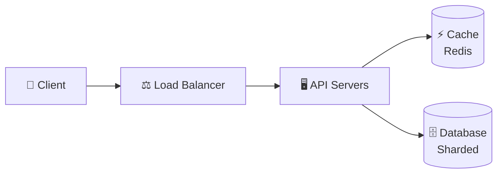

**Write Flow:**
1. Receive long URL: `https://example.com/very/long/path`
2. Generate unique ID (Snowflake or random)
3. Encode to Base62: `abc1234`
4. Store mapping: `abc1234 → https://example.com/...`
5. Return: `https://short.ly/abc1234`

**Read Flow:**
1. Receive: `https://short.ly/abc1234`
2. Check cache (80%+ hit rate expected)
3. If miss, query database
4. 301/302 redirect to original URL

> **Encoding:** Base62 (a-z, A-Z, 0-9) → 7 chars = 62⁷ = **3.5 trillion** unique URLs

### 💬 Chat Application

A chat application requires real-time bidirectional communication—fundamentally different from request-response HTTP. Key challenges include maintaining persistent connections, delivering messages with low latency, and handling presence/typing indicators.

**WebSocket** is the foundation. Unlike HTTP where the client always initiates, WebSocket maintains a persistent connection allowing the server to push messages to clients instantly. Each connected client maintains a WebSocket to a Connection Manager.

**Connection Manager** tracks which users are connected to which servers. When User A sends a message to User B, the system must find B's server and route the message there. This is often implemented with Redis pub/sub—each server subscribes to channels for its connected users.

**Message persistence** uses a database optimized for time-series data (Cassandra works well). Messages are partitioned by conversation_id so all messages in a conversation are colocated. Support for message ordering, read receipts, and offline delivery adds complexity.

**Presence service** tracks online/offline status and typing indicators. These are ephemeral—no need to persist, but they must propagate quickly. Often implemented with Redis with TTL-based expiration.

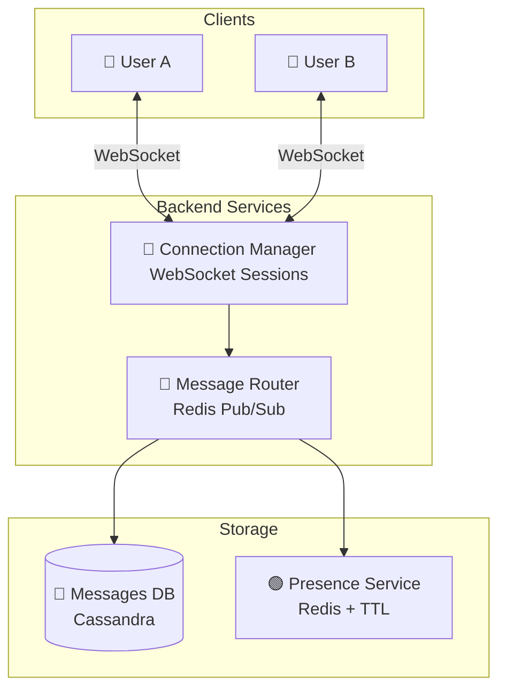

| Component | Technology | Purpose |
|-----------|------------|---------|
| **Connection** | WebSocket | Persistent, bidirectional real-time |
| **Routing** | Redis Pub/Sub | Cross-server message delivery |
| **Messages** | Cassandra | Partition by conversation_id |
| **Presence** | Redis + TTL | Online status, typing indicators |

### 🔔 Notification System

A notification system sends messages across multiple channels (push, SMS, email) to millions of users. Key challenges include high write volume, fanout to many recipients, and handling delivery failures gracefully.

**Key design decisions**:

1. **Decouple ingestion from delivery**: Accept notification requests quickly into a queue, process asynchronously. This prevents downstream failures from blocking the sender.

2. **Channel-specific workers**: Email, SMS, and push notifications have different rate limits, failure modes, and retry strategies. Use separate worker pools for each channel.

3. **Rate limiting**: Third-party providers (Twilio, SendGrid) have rate limits. Build rate limiting into your workers, not just at the API gateway.

4. **Delivery status tracking**: Store delivery status per notification per channel. Users need visibility into "was my notification delivered?"

5. **Template management**: Separate notification content from delivery logic. Support variables, localization, and A/B testing.

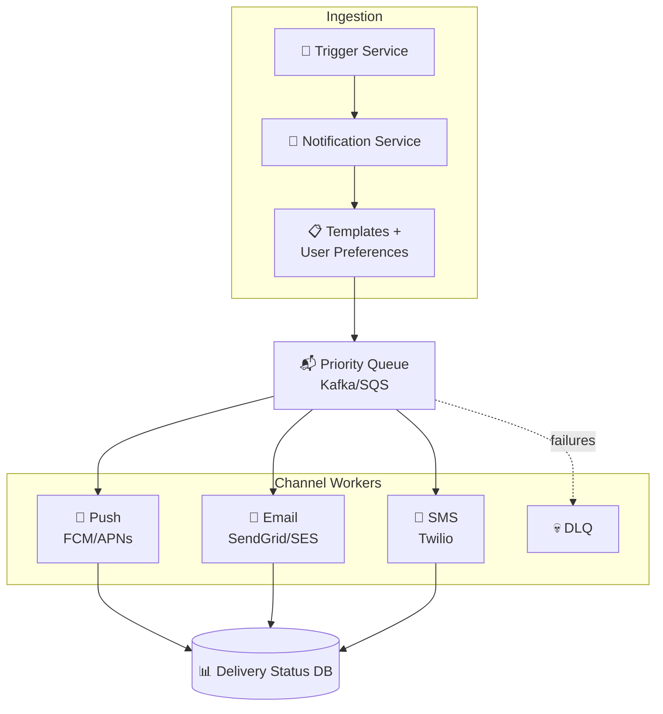

| Design Decision | Why |
|-----------------|-----|
| **Async queue** | Decouple sender from delivery, handle spikes |
| **Channel workers** | Different rate limits, retry strategies |
| **User preferences** | Opt-out, channel priority, quiet hours |
| **Deduplication** | Prevent duplicate notifications |
| **Delivery tracking** | sent → delivered → opened |

**Scaling considerations**:
- **Write-heavy**: Most operations are writes (send notification), reads are status checks
- **Fanout pattern**: One event (new follower post) → millions of notifications
- **Batch vs real-time**: Marketing emails can batch, security alerts must be real-time
- **Priority queues**: Separate queues for transactional (password reset) vs marketing

---

## 13. Quick Reference

### 🔢 Important Numbers

```
┌─────────────────────────────────────────────────────────────────┐
│                   IMPORTANT NUMBERS                             │
│                                                                 │
│   Time                           Bytes                          │
│   ────                           ─────                          │
│   1 million seconds ≈ 11.5 days  1 KB  = 1,024 B               │
│   1 billion seconds ≈ 31.7 years 1 MB  = 1,024 KB              │
│   Seconds per day   = 86,400     1 GB  = 1,024 MB              │
│   Seconds per year  ≈ 31.5M      1 TB  = 1,024 GB              │
│                                  1 PB  = 1,024 TB              │
│                                                                 │
│   Network                                                       │
│   ───────                                                       │
│   1 Gbps = 125 MB/s                                            │
│   100 Mbps = 12.5 MB/s                                         │
│                                                                 │
│   Scale                                                         │
│   ─────                                                         │
│   Thousand = 10^3   (3 zeros)                                  │
│   Million  = 10^6   (6 zeros)                                  │
│   Billion  = 10^9   (9 zeros)                                  │
│   Trillion = 10^12  (12 zeros)                                 │
└─────────────────────────────────────────────────────────────────┘
```

### ✅ System Design Interview Checklist

```
┌─────────────────────────────────────────────────────────────────┐
│                SYSTEM DESIGN CHECKLIST                          │
│                                                                 │
│   1. CLARIFY REQUIREMENTS (5-10 min)                           │
│      □ What are the core features? (functional)                │
│      □ How many users? QPS? Data size? (scale)                 │
│      □ What's the read/write ratio?                            │
│      □ Latency requirements? (real-time vs batch)              │
│      □ Availability target? (99.9%? 99.99%?)                   │
│                                                                 │
│   2. HIGH-LEVEL DESIGN (10-15 min)                             │
│      □ Draw the major components                               │
│      □ Show data flow for key operations                       │
│      □ Identify APIs between components                        │
│                                                                 │
│   3. DEEP DIVE (15-20 min)                                     │
│      □ Database schema design                                  │
│      □ SQL vs NoSQL choice with reasoning                      │
│      □ Caching strategy                                        │
│      □ How to scale each component                             │
│                                                                 │
│   4. ADDRESS BOTTLENECKS (5-10 min)                            │
│      □ Single points of failure?                               │
│      □ What happens when X fails?                              │
│      □ Hot spots or bottlenecks?                               │
│                                                                 │
│   5. WRAP UP (2-5 min)                                         │
│      □ Summarize key design decisions                          │
│      □ Acknowledge trade-offs made                             │
│      □ Mention future improvements                             │
└─────────────────────────────────────────────────────────────────┘
```

### 🧠 Beyond Pattern Matching: The Interview Mindset

The gap between knowing patterns and actually designing systems that scale comes down to **reasoning about trade-offs in real time**, not memorizing reference architectures.

**The Pattern Trap**: Most candidates can draw a load balancer perfectly, but few can explain when horizontal scaling stops being the answer. Collecting architectural patterns like Pokémon cards—Instagram's feed, Netflix's CDN, Twitter's fanout—isn't mastery. Mastery is understanding *why* each pattern exists and *when* it applies.

**Start With Numbers, Not Boxes**: Senior engineers don't start with architecture diagrams. They start with boring, unglamorous numbers:
- How many users?
- What's the read-to-write ratio?
- What's going to break first when this gets real traffic?

The boxes and arrows come later, after the math basically forces your hand.

```
┌─────────────────────────────────────────────────────────────────┐
│             NUMBERS FIRST: KEY QUESTIONS                        │
│                                                                 │
│   BEFORE drawing any component, answer:                         │
│                                                                 │
│   • DAU (Daily Active Users): current vs. 1yr vs. 5yr?         │
│   • QPS (Queries Per Second): reads? writes? peak?             │
│   • Data size: per record? total? growth rate?                 │
│   • Latency: P50? P99? What's acceptable?                      │
│   • Read/Write ratio: 100:1? 1:1? Write-heavy?                 │
│                                                                 │
│   These numbers DICTATE your architecture choices.              │
│   10K QPS vs 10M QPS = completely different designs.           │
└─────────────────────────────────────────────────────────────────┘
```

**Question Every Default Choice**: When you reach for consistent hashing, ask yourself: "Why consistent hashing here? What problem does it solve that a simple modulo wouldn't?" For a URL shortener with deterministic keys, do you actually need ring-based partitioning, or are you just pattern matching?

```
┌─────────────────────────────────────────────────────────────────┐
│           CHALLENGE YOUR COMPONENT CHOICES                      │
│                                                                 │
│   For EVERY component you add, answer:                          │
│                                                                 │
│   • Why this specific component? (not "because tutorials")     │
│   • What metric proves it's necessary?                         │
│   • What new failure mode does it introduce?                   │
│   • Can the system work without it? If yes, don't add it.     │
│                                                                 │
│   Example: Cache                                                │
│   ✗ "Every system needs caching" (pattern matching)            │
│   ✓ "Cache hit rate ~95% due to power-law access pattern,      │
│      reduces DB load from 50K to 2.5K QPS" (number-driven)     │
│                                                                 │
│   Counter-example: URL shortener with long-tail distribution   │
│   → 40% cache hit rate → caching adds latency + complexity     │
│   → might be better to just scale the database                 │
└─────────────────────────────────────────────────────────────────┘
```

**Failure Mode Thinking**: The best interviewers don't ask "how would you design this"—they ask "what happens when":

- What happens when your primary database goes down mid-transaction?
- What happens when cache invalidation lags by 30 seconds during a viral spike?
- What happens when two datacenters split and both think they're the primary?

~73% of major outages involve state inconsistency during partial failures—the exact scenarios most candidates never rehearse.

```
┌─────────────────────────────────────────────────────────────────┐
│              FAILURE MODE EXERCISE                              │
│                                                                 │
│   For ANY component, ask three failure questions:               │
│                                                                 │
│   DATABASE                                                      │
│   • What if writes succeed but reads lag behind?               │
│   • What if the primary fails during a write?                  │
│   • How do you detect silent corruption?                       │
│                                                                 │
│   CACHE                                                         │
│   • What if eviction is faster than population?                │
│   • What if cache and DB disagree? Which wins?                 │
│   • What's your thundering herd strategy?                      │
│                                                                 │
│   LOAD BALANCER                                                 │
│   • What if health checks pass but service is deadlocked?      │
│   • What if one backend is slow but not failing?               │
│   • How do you handle sticky sessions during failover?         │
│                                                                 │
│   If you can't articulate what breaks and how you'd detect     │
│   it, you're probably not ready.                                │
└─────────────────────────────────────────────────────────────────┘
```

**Start Simple, Evolve With Constraints**: The best design isn't the most sophisticated—it's the simplest thing that could work, with complexity added only when measured constraints force it.

```
┌─────────────────────────────────────────────────────────────────┐
│              EVOLUTION-DRIVEN DESIGN                            │
│                                                                 │
│   START WITH:                                                   │
│   • One database, one server, no cache                         │
│   • Vertical scaling first (it's simpler)                      │
│   • Monolith (until team/scale forces microservices)           │
│                                                                 │
│   ADD COMPLEXITY ONLY WHEN:                                     │
│   • A specific metric crosses a threshold you can NAME          │
│   • You can prove the simpler approach won't work              │
│   • The math forces your hand, not the pattern library         │
│                                                                 │
│   EVERY BOX YOU DRAW should solve a problem you've             │
│   already proven exists.                                        │
│                                                                 │
│   ┌──────────┐     ┌──────────┐     ┌──────────┐              │
│   │  Simple  │────►│ Measure  │────►│  Evolve  │              │
│   │  Design  │     │ Bottleneck│    │  Targeted │              │
│   └──────────┘     └──────────┘     └──────────┘              │
│        │                                   │                    │
│        └───────────── Repeat ─────────────┘                    │
└─────────────────────────────────────────────────────────────────┘
```

**Red Flags That Signal Pattern Matching**:

| Red Flag | What It Reveals | Better Approach |
|----------|-----------------|-----------------|
| "We need consistent hashing" | Reaching for patterns before understanding the problem | "Our key distribution is X, so we need Y because..." |
| "Add Redis for caching" | Assuming caching always helps | "Our read/write ratio is X:1, hit rate would be ~Y%" |
| "Use Kafka for messaging" | Pattern matching on queue choice | "We need at-least-once delivery because... Kafka's log compaction helps with..." |
| "Shard the database" | Assuming write scaling is needed | "Current write QPS is X, single-node limit is Y, so we need Z shards" |
| "Add a load balancer" | Reflexive complexity | "We have N servers because each handles X QPS" |

**The Mindset Shift**:

```
┌─────────────────────────────────────────────────────────────────┐
│                     PATTERN MATCHER                             │
│                                                                 │
│   • Starts with architecture diagrams                          │
│   • Adds components "because that's what you do"               │
│   • Can draw systems but can't explain trade-offs              │
│   • Freezes when constraints change                            │
│   • Knows WHAT to build, not WHY                               │
└─────────────────────────────────────────────────────────────────┘
                              ▼
┌─────────────────────────────────────────────────────────────────┐
│                    SYSTEM DESIGNER                              │
│                                                                 │
│   • Starts with numbers and constraints                        │
│   • Adds components when metrics force the decision            │
│   • Can defend every trade-off with data                       │
│   • Adapts when constraints shift                              │
│   • Knows WHY before deciding WHAT                             │
└─────────────────────────────────────────────────────────────────┘
```

**Practice Exercise**: Take any system design you've studied. Pick one component. Remove it. Can the system still work?
- If **yes**: You probably didn't need it.
- If **no**: What metric proves it's necessary?

That's how you build judgment instead of just pattern fluency.

### 💥 Component Failure Analysis Framework

For every component in your design, systematically ask: **"What happens when X fails/degrades?"** This framework gives you the thinking model for each common component.

---

#### 🗄️ DATABASE

**Failure Modes:**

| Scenario | What Happens | Detection | Response |
|----------|--------------|-----------|----------|
| **Primary goes down** | Writes fail, reads may fail | Health checks, connection errors | Promote replica, redirect traffic |
| **Writes succeed, reads lag** | Users see stale data | Replication lag metrics | Read-your-writes pattern, sticky sessions |
| **Disk fills up** | Writes rejected, possible corruption | Disk usage alerts (>80%) | Auto-expand, archive old data, alert |
| **Connection pool exhausted** | New requests timeout | Pool metrics, error rates | Increase pool, add read replicas, queue requests |
| **Split-brain (multi-master)** | Data divergence, conflicts | Quorum failures, conflict detection | Fencing tokens, quorum writes, manual resolution |
| **Slow queries** | Cascading timeouts, resource starvation | P99 latency, slow query log | Query optimization, read replicas, caching |
| **Corruption** | Silent data loss | Checksums, backup validation | Point-in-time recovery, checksums on read |

**Design Questions:**
```
• What's the failover time? (seconds vs minutes matters)
• Can we tolerate stale reads? For how long?
• What's our backup/recovery RPO and RTO?
• How do we detect silent corruption?
```

---

#### ⚡ CACHE (Redis, Memcached)

**Failure Modes:**

| Scenario | What Happens | Detection | Response |
|----------|--------------|-----------|----------|
| **Cache miss storm** | All requests hit DB simultaneously | DB load spike, cache hit rate drop | Circuit breaker, request coalescing, staggered TTL |
| **Cache goes down entirely** | 100% traffic to DB | Health check failure | Graceful degradation, DB can handle (or reject overflow) |
| **Stale data after write** | Users see old data | Requires monitoring writes | Write-through, cache invalidation, short TTL |
| **Thundering herd on expiry** | Spike when popular key expires | Traffic patterns, expiry timing | Probabilistic early expiration, mutex/lock |
| **Memory pressure / eviction** | Important keys evicted | Eviction metrics, miss rate | Increase memory, tune eviction policy, tiered caching |
| **Hot key** | Single node overwhelmed | Per-key metrics, node CPU | Key replication, local caching, key splitting |
| **Network partition from app** | Timeouts, fallback to DB | Connection errors, latency | Fast timeout + fallback, don't block on cache |

**Design Questions:**
```
• What's the cache hit rate? Is caching worth it? (>80% usually needed)
• What's the invalidation strategy? (TTL, event-based, write-through)
• Can we survive total cache failure? (DB must handle peak if not)
• What's the consistency model? (eventual OK, or need strong?)
```

---

#### ⚖️ LOAD BALANCER

**Failure Modes:**

| Scenario | What Happens | Detection | Response |
|----------|--------------|-----------|----------|
| **LB itself fails** | Total outage | DNS/anycast failover, health checks | Redundant LBs, DNS failover, anycast |
| **Health checks pass but service deadlocked** | Traffic to broken servers | Application-level health, request latency | Deep health checks (not just TCP), liveness + readiness |
| **Uneven distribution** | Some servers overloaded | Per-server metrics, latency variance | Review algorithm (round-robin vs least-conn), consistent hashing |
| **Sticky session server dies** | User session lost | Session errors, re-auth rate | Session externalization (Redis), graceful degradation |
| **Slow backend not removed** | Cascading slowdowns | P99 latency, queue depth | Active health checks, circuit breaker, timeout-based ejection |
| **SSL termination overload** | Connection failures | CPU usage, connection errors | Dedicated SSL offload, hardware acceleration |

**Design Questions:**
```
• What's the failover mechanism for the LB itself?
• How quickly are unhealthy backends removed? (seconds matter)
• What's the health check—TCP, HTTP, or application-specific?
• How do we handle session affinity without coupling?
```

---

#### 📬 MESSAGE QUEUE (Kafka, SQS, RabbitMQ)

**Failure Modes:**

| Scenario | What Happens | Detection | Response |
|----------|--------------|-----------|----------|
| **Consumer falls behind** | Queue backlog grows, memory pressure | Consumer lag metrics, queue depth | Scale consumers, increase batch size, alert on lag |
| **Duplicate messages** | Action performed twice | Idempotency key collisions | Idempotent consumers, deduplication layer |
| **Message loss** | Data lost, inconsistent state | End-to-end tracking, checksums | Acks, replication, dead-letter queue |
| **Poison message** | Consumer crashes repeatedly | Consumer crash rate, DLQ growth | Dead-letter queue, circuit breaker, manual review |
| **Broker failure** | Partition unavailable | Broker health, under-replicated partitions | Replication factor ≥3, automatic leader election |
| **Out of order processing** | Logic errors, race conditions | Sequence gaps, business logic errors | Partition by ordering key, sequence numbers |
| **Consumer rebalance storm** | Processing paused during rebalance | Rebalance events, processing gaps | Stable consumer groups, cooperative rebalancing |

**Design Questions:**
```
• What's our guarantee? (at-most-once, at-least-once, exactly-once)
• How do we handle duplicates? (idempotency keys)
• What happens to failed messages? (DLQ, retry, alert)
• What's acceptable consumer lag? (seconds, minutes, hours)
```

---

#### 🌐 API GATEWAY / SERVICE MESH

**Failure Modes:**

| Scenario | What Happens | Detection | Response |
|----------|--------------|-----------|----------|
| **Rate limit misconfigured** | Legitimate traffic rejected | 429 error rate, customer complaints | Gradual rollout, per-tenant limits, bypass for critical |
| **Gateway becomes bottleneck** | All services degraded | Gateway latency, CPU | Horizontal scaling, edge caching, bypass for internal |
| **Auth service down** | All authenticated requests fail | Auth error rate | Cache tokens, graceful degradation, retry with backoff |
| **Circuit breaker stuck open** | Service appears down when recovered | Circuit state, manual override | Time-based reset, health check override, monitoring |
| **Timeout too aggressive** | Slow but valid requests killed | Timeout errors vs actual failures | Adaptive timeouts, P99-based, separate read/write |
| **Cascading failure** | One slow service affects all | Cross-service latency correlation | Bulkheads, circuit breakers, async where possible |

**Design Questions:**
```
• What's the timeout strategy? (too short = false failures, too long = resource exhaustion)
• How do circuit breakers reset? (automatic vs manual)
• What's the rate limiting granularity? (per user, per IP, per tenant)
• What happens when auth is down? (fail open vs fail closed)
```

---

#### 💾 DISTRIBUTED STORAGE (S3, GCS, HDFS)

**Failure Modes:**

| Scenario | What Happens | Detection | Response |
|----------|--------------|-----------|----------|
| **Region outage** | Data unavailable | Region health, availability metrics | Multi-region replication, cross-region failover |
| **Throttling** | Requests rejected | 503/429 errors, request metrics | Exponential backoff, request spreading, higher tier |
| **Eventual consistency bite** | Read after write returns old data | Application logic errors | Strong read (if available), read-your-writes pattern |
| **Large object timeout** | Upload/download fails | Transfer errors, partial uploads | Multipart upload, resumable transfers, chunking |
| **Cost explosion** | Unexpected bills | Cost monitoring, usage alerts | Lifecycle policies, tiered storage, cleanup jobs |
| **Accidental deletion** | Data loss | Audit logs, versioning | Versioning, soft delete, MFA delete, backups |

**Design Questions:**
```
• What's the consistency model? (strong vs eventual)
• What's the durability guarantee? (11 9s for S3, but region matters)
• How do we handle large files? (multipart, streaming)
• What's the access pattern? (random vs sequential affects storage choice)
```

---

#### 🔍 SEARCH / ELASTICSEARCH

**Failure Modes:**

| Scenario | What Happens | Detection | Response |
|----------|--------------|-----------|----------|
| **Index lag** | Search returns stale results | Index freshness metrics | Near-real-time indexing, user expectations |
| **Query of death** | Cluster overwhelmed | CPU spike, timeout rate | Query validation, circuit breaker, query timeout |
| **Shard imbalance** | Hot spots, uneven performance | Per-shard metrics | Rebalancing, shard allocation awareness |
| **Split brain** | Data inconsistency | Cluster health, node count | Minimum master nodes, dedicated masters |
| **Memory pressure** | Slow queries, OOM | JVM heap, GC metrics | Heap tuning, circuit breakers, field data limits |
| **Mapping explosion** | Index bloat, performance degradation | Field count, mapping size | Strict mappings, dynamic template limits |

**Design Questions:**
```
• What's acceptable index lag? (real-time vs near-real-time vs batch)
• How do we handle query of death? (validation, timeouts, circuit breakers)
• What's the reindexing strategy? (zero-downtime, aliases)
• How do we scale? (more shards vs more nodes vs both)
```

---

#### 🔗 EXTERNAL API / THIRD-PARTY SERVICE

**Failure Modes:**

| Scenario | What Happens | Detection | Response |
|----------|--------------|-----------|----------|
| **Service down** | Dependent feature fails | Health checks, error rate | Circuit breaker, fallback, graceful degradation |
| **Rate limited** | Requests rejected | 429 errors | Backoff, request queuing, caching, higher tier |
| **Slow response** | Timeout, resource holding | Latency metrics | Aggressive timeouts, async, don't block critical path |
| **Breaking API change** | Integration fails | Schema validation, error patterns | Contract testing, versioned clients, monitoring |
| **Cost overrun** | Unexpected charges | Usage tracking, billing alerts | Caching, batching, usage caps |
| **Data quality issues** | Incorrect data in our system | Validation, anomaly detection | Input validation, sanity checks, alerts |

**Design Questions:**
```
• What's the SLA of the external service? (matches our needs?)
• What's the fallback when it's down? (cached data, degraded mode, error)
• How do we prevent our system from failing when theirs does?
• What's the cost model? (per request, per data volume)
```

---

#### 🧠 THE UNIVERSAL FAILURE CHECKLIST

For **ANY** component, ask these questions:

```
┌─────────────────────────────────────────────────────────────────┐
│              UNIVERSAL COMPONENT FAILURE CHECKLIST              │
│                                                                 │
│   1. DETECTION                                                  │
│      □ How do we know it's failing? (metrics, alerts)          │
│      □ How do we know it's slow vs down? (latency vs errors)   │
│      □ How do we detect silent failures? (data corruption)     │
│                                                                 │
│   2. IMPACT                                                     │
│      □ What breaks if this fails? (blast radius)               │
│      □ Can we operate in degraded mode? (graceful degradation) │
│      □ What's the user-visible impact? (error vs slow vs none) │
│                                                                 │
│   3. RECOVERY                                                   │
│      □ How long to detect? (MTTD)                              │
│      □ How long to recover? (MTTR)                             │
│      □ Is recovery automatic or manual?                        │
│      □ What data is lost during recovery? (RPO)                │
│                                                                 │
│   4. PREVENTION                                                 │
│      □ Redundancy: Is there a backup? (replicas, regions)      │
│      □ Isolation: Does failure cascade? (bulkheads)            │
│      □ Limits: Can it be overwhelmed? (rate limiting, quotas)  │
│                                                                 │
│   5. TESTING                                                    │
│      □ Have we tested this failure? (chaos engineering)        │
│      □ Do we have runbooks? (what to do when X fails)          │
│      □ When was the last failover test?                        │
└─────────────────────────────────────────────────────────────────┘
```

---

#### 🎯 INTERVIEW APPLICATION

When the interviewer asks **"What happens when X fails?"**, use this structure:

```
1. ACKNOWLEDGE the failure mode specifically
   "If the primary database fails mid-transaction..."

2. DETECT how we'd know
   "We'd detect this via connection errors and health check failures within 5 seconds..."

3. IMPACT what breaks
   "In-flight writes would fail, users would see errors for ~30 seconds..."

4. RESPOND what the system does automatically
   "The replica would be promoted automatically, connections would retry..."

5. RECOVER to normal state
   "After failover, we'd verify data consistency and clear any stuck transactions..."

6. PREVENT or mitigate in future
   "To minimize this, we use synchronous replication for zero data loss..."
```

**Example Answer:**
> "What happens when the cache fails?"
>
> "If Redis fails completely, we'd detect it within 1-2 seconds via connection timeouts. The impact is that all traffic immediately hits the database—which is why we size the DB to handle peak load without cache (about 10K QPS in our case). The response is automatic: our cache client has a 100ms timeout and falls back to direct DB queries. We'd recover by restarting Redis and letting it warm up gradually—we use lazy population rather than pre-warming to avoid thundering herd. To prevent this being catastrophic, we run Redis in cluster mode with replicas, so single-node failure doesn't cause full cache loss."

### ⚖️ Trade-off Decision Matrix

```
┌─────────────────────────────────────────────────────────────────┐
│                  TRADE-OFF MATRIX                               │
│                                                                 │
│   Decision          │ Option A         │ Option B              │
│   ──────────────────┼──────────────────┼─────────────────────  │
│   SQL vs NoSQL      │ ACID, JOINs      │ Scale, flexibility    │
│   Push vs Pull      │ Low read latency │ Lower write cost      │
│   Cache vs DB       │ Speed            │ Consistency           │
│   Sync vs Async     │ Consistency      │ Performance           │
│   Monolith vs Micro │ Simplicity       │ Scalability           │
│   Strong vs Event.  │ Correctness      │ Availability          │
│   ──────────────────┼──────────────────┼─────────────────────  │
│   TCP vs UDP        │ Reliability      │ Speed                 │
│   Direct vs VPN     │ Performance      │ Cost, simplicity      │
│   Block vs Object   │ Low latency      │ Scalability, cost     │
│   ──────────────────┼──────────────────┼─────────────────────  │
│                                                                 │
│   There's no universally "right" choice—it depends on your    │
│   specific requirements, constraints, and priorities.          │
└─────────────────────────────────────────────────────────────────┘
```

---

## 14. Glossary

**Quick reference for all acronyms and terms used in this guide.** Organized by category for easy lookup.

### Core Concepts

| Acronym | Full Name | Plain English Definition |
|---------|-----------|--------------------------|
| **ACID** | Atomicity, Consistency, Isolation, Durability | Four properties that guarantee database transactions are processed reliably |
| **CAP** | Consistency, Availability, Partition Tolerance | Theorem stating distributed systems can only guarantee two of three properties |
| **BASE** | Basically Available, Soft state, Eventually consistent | Alternative to ACID for distributed systems prioritizing availability |
| **2PC** | Two-Phase Commit | Protocol ensuring all participants in a distributed transaction commit or abort together |
| **SAGA** | — | Pattern for long-running distributed transactions using compensating actions |
| **RSM** | Replicated State Machine | Approach to building fault-tolerant systems by replicating state across nodes |

### Cloud & Networking

| Acronym | Full Name | Plain English Definition |
|---------|-----------|--------------------------|
| **VPC** | Virtual Private Cloud | Your isolated network within the cloud with custom IP ranges and routing |
| **IAM** | Identity and Access Management | Controls who can do what in your cloud environment |
| **CIDR** | Classless Inter-Domain Routing | Notation for IP address ranges (e.g., 10.0.0.0/16) |
| **DNS** | Domain Name System | Translates domain names (example.com) to IP addresses |
| **TLD** | Top-Level Domain | The last part of a domain name (.com, .org, .io) |
| **NAT** | Network Address Translation | Allows private subnet resources to access the internet without exposing them |
| **IGW** | Internet Gateway | Enables communication between VPC and the internet |
| **SG** | Security Group | Instance-level firewall; stateful, allow-only rules |
| **NACL** | Network Access Control List | Subnet-level firewall; stateless, allow and deny rules |
| **TCP** | Transmission Control Protocol | Reliable, connection-oriented protocol for data transmission |
| **UDP** | User Datagram Protocol | Fast, connectionless protocol; no delivery guarantee |
| **IP** | Internet Protocol | Protocol for routing packets across networks using addresses |
| **HTTP/HTTPS** | Hypertext Transfer Protocol (Secure) | Protocol for web communication; HTTPS adds encryption |
| **TLS/SSL** | Transport Layer Security / Secure Sockets Layer | Protocols for encrypting data in transit |
| **WAF** | Web Application Firewall | Protects web apps by filtering malicious HTTP traffic |
| **VPN** | Virtual Private Network | Encrypted tunnel between networks over the internet |
| **AZ** | Availability Zone | Isolated data center within a cloud region |
| **MFA** | Multi-Factor Authentication | Requires multiple verification methods for access |

### Databases

| Acronym | Full Name | Plain English Definition |
|---------|-----------|--------------------------|
| **SQL** | Structured Query Language | Language for managing relational databases; also refers to relational DBs |
| **NoSQL** | Not Only SQL | Family of non-relational databases (key-value, document, graph, columnar) |
| **RDBMS** | Relational Database Management System | Database that stores data in tables with relationships (MySQL, PostgreSQL) |
| **IOPS** | Input/Output Operations Per Second | Measure of storage performance (reads + writes per second) |
| **RDS** | Relational Database Service | AWS managed relational database service |
| **KV** | Key-Value | Database type storing data as key-value pairs (Redis, DynamoDB) |
| **ORM** | Object-Relational Mapping | Converts between database records and programming objects |
| **MVCC** | Multi-Version Concurrency Control | Database technique allowing concurrent transactions without locking |

### Caching

| Acronym | Full Name | Plain English Definition |
|---------|-----------|--------------------------|
| **TTL** | Time To Live | How long cached data remains valid before expiring |
| **EAT** | Effective Access Time | Weighted average of cache hit and miss times |
| **LRU** | Least Recently Used | Eviction policy removing the least recently accessed items first |
| **LFU** | Least Frequently Used | Eviction policy removing the least often accessed items first |
| **CDN** | Content Delivery Network | Globally distributed cache serving content from edge locations |

### Messaging & Queues

| Acronym | Full Name | Plain English Definition |
|---------|-----------|--------------------------|
| **DLQ** | Dead Letter Queue | Queue for messages that repeatedly fail processing |
| **Pub/Sub** | Publish-Subscribe | Messaging pattern where publishers broadcast to multiple subscribers |
| **MQ** | Message Queue | System for asynchronous communication between services |
| **FIFO** | First In, First Out | Queue ordering where oldest messages are processed first |
| **ACK** | Acknowledgment | Confirmation that a message was received/processed |

### Load Balancing & Components

| Acronym | Full Name | Plain English Definition |
|---------|-----------|--------------------------|
| **LB** | Load Balancer | Distributes incoming traffic across multiple servers |
| **ALB** | Application Load Balancer | Layer 7 load balancer routing based on HTTP content |
| **NLB** | Network Load Balancer | Layer 4 load balancer routing based on IP/port; ultra-low latency |
| **L4** | Layer 4 (Transport) | Network layer dealing with TCP/UDP; IP addresses and ports |
| **L7** | Layer 7 (Application) | Network layer dealing with HTTP/HTTPS; URLs, headers, cookies |
| **RPS** | Requests Per Second | Measure of throughput; how many requests a system handles |
| **API** | Application Programming Interface | Contract defining how software components communicate |
| **REST** | Representational State Transfer | Architectural style for APIs using HTTP methods |
| **gRPC** | gRPC Remote Procedure Call | High-performance RPC framework using Protocol Buffers |
| **JWT** | JSON Web Token | Compact, self-contained token for secure information exchange |
| **CORS** | Cross-Origin Resource Sharing | Mechanism allowing web pages to request resources from other domains |

### Scalability & Reliability

| Acronym | Full Name | Plain English Definition |
|---------|-----------|--------------------------|
| **HA** | High Availability | System designed to minimize downtime; typically 99.9%+ uptime |
| **DR** | Disaster Recovery | Plans and systems for recovering from catastrophic failures |
| **RTO** | Recovery Time Objective | Maximum acceptable downtime after a failure |
| **RPO** | Recovery Point Objective | Maximum acceptable data loss (time since last backup) |
| **SPOF** | Single Point of Failure | Component whose failure causes entire system failure |
| **MTTR** | Mean Time To Recovery | Average time to restore service after failure |
| **MTTD** | Mean Time To Detect | Average time to detect a failure |
| **SLA** | Service Level Agreement | Contract specifying uptime and performance guarantees |
| **SLO** | Service Level Objective | Internal targets for service performance |
| **SLI** | Service Level Indicator | Metrics used to measure SLO compliance |

### Distributed Systems

| Acronym | Full Name | Plain English Definition |
|---------|-----------|--------------------------|
| **Raft** | — | Consensus algorithm for leader election and log replication |
| **Paxos** | — | Consensus algorithm for distributed agreement (more complex than Raft) |
| **ZK** | ZooKeeper | Distributed coordination service for leader election, config, locks |
| **etcd** | — | Distributed key-value store used by Kubernetes for coordination |
| **W/R/N** | Write quorum / Read quorum / Total replicas | Quorum parameters: W+R>N guarantees strong consistency |
| **KL** | Kullback-Leibler (divergence) | Measure of difference between probability distributions |

### Capacity & Performance

| Acronym | Full Name | Plain English Definition |
|---------|-----------|--------------------------|
| **QPS** | Queries Per Second | Rate of requests a system processes |
| **TPS** | Transactions Per Second | Rate of database transactions processed |
| **DAU** | Daily Active Users | Number of unique users per day |
| **MAU** | Monthly Active Users | Number of unique users per month |
| **P50/P95/P99** | Percentile latencies | 50th/95th/99th percentile response times |
| **TTFB** | Time To First Byte | Time from request to receiving first byte of response |

### Storage

| Acronym | Full Name | Plain English Definition |
|---------|-----------|--------------------------|
| **EBS** | Elastic Block Store | AWS block storage for EC2 instances |
| **EFS** | Elastic File System | AWS managed NFS file system |
| **S3** | Simple Storage Service | AWS object storage with unlimited capacity |
| **NFS** | Network File System | Protocol for sharing files over a network |
| **HDFS** | Hadoop Distributed File System | Distributed file system for big data processing |
| **SSD** | Solid State Drive | Fast storage using flash memory; no moving parts |
| **HDD** | Hard Disk Drive | Traditional storage using spinning magnetic disks |

### AWS Services

| Acronym | Full Name | Plain English Definition |
|---------|-----------|--------------------------|
| **EC2** | Elastic Compute Cloud | AWS virtual machine service |
| **ECS** | Elastic Container Service | AWS managed container orchestration |
| **EKS** | Elastic Kubernetes Service | AWS managed Kubernetes |
| **Lambda** | — | AWS serverless compute; runs code without managing servers |
| **SQS** | Simple Queue Service | AWS managed message queue |
| **SNS** | Simple Notification Service | AWS managed pub/sub messaging |
| **Route 53** | — | AWS DNS and traffic management service |
| **CloudFront** | — | AWS CDN for content delivery |
| **ElastiCache** | — | AWS managed Redis/Memcached |
| **DynamoDB** | — | AWS managed NoSQL key-value database |
| **KMS** | Key Management Service | AWS service for creating and managing encryption keys |
| **HSM** | Hardware Security Module | Physical device for secure key storage and cryptographic operations |

### Data Units

| Unit | Size | Context |
|------|------|---------|
| **KB** | 1,024 bytes | Small files, API responses |
| **MB** | 1,024 KB | Images, small documents |
| **GB** | 1,024 MB | Videos, databases |
| **TB** | 1,024 GB | Large databases, data warehouses |
| **PB** | 1,024 TB | Big data, enterprise storage |
| **Gbps** | Gigabits per second | Network bandwidth (divide by 8 for MB/s) |

---

<div align="center">

**System Design = Trade-offs + Scale + Failure Modes + Numbers**

*This guide provides foundational knowledge for building production systems. The best design is the simplest one that meets your needs.*

⭐ Star this repo if it helped you!

*Last updated: February 2026*

</div>
