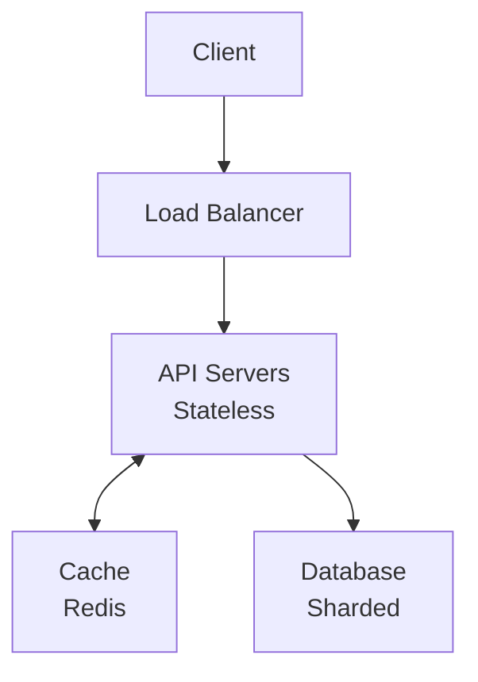
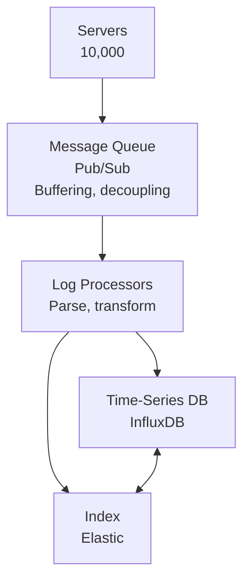
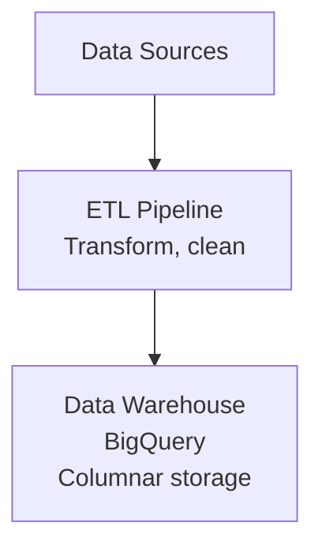
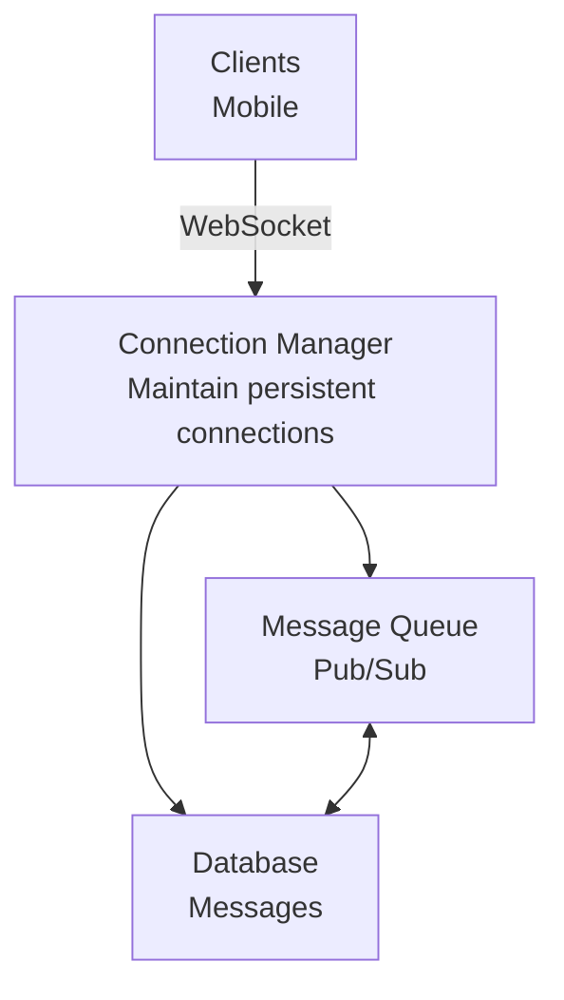
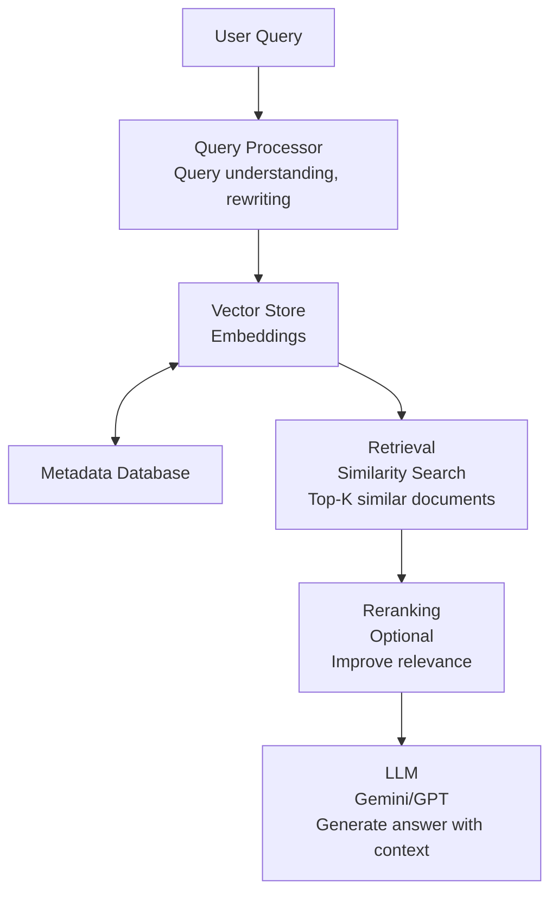
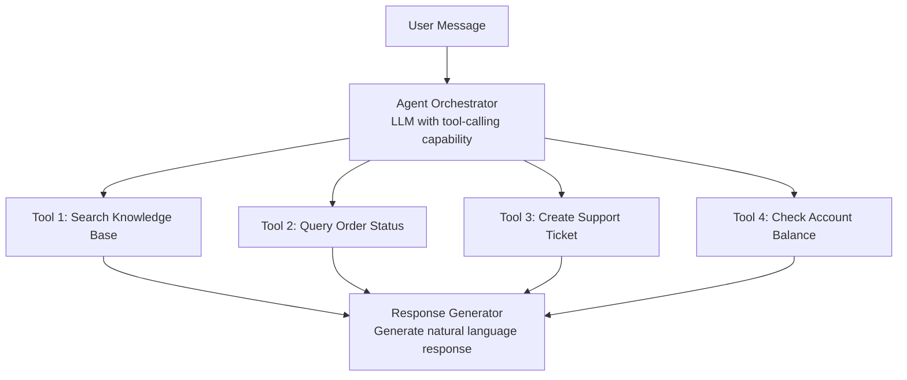
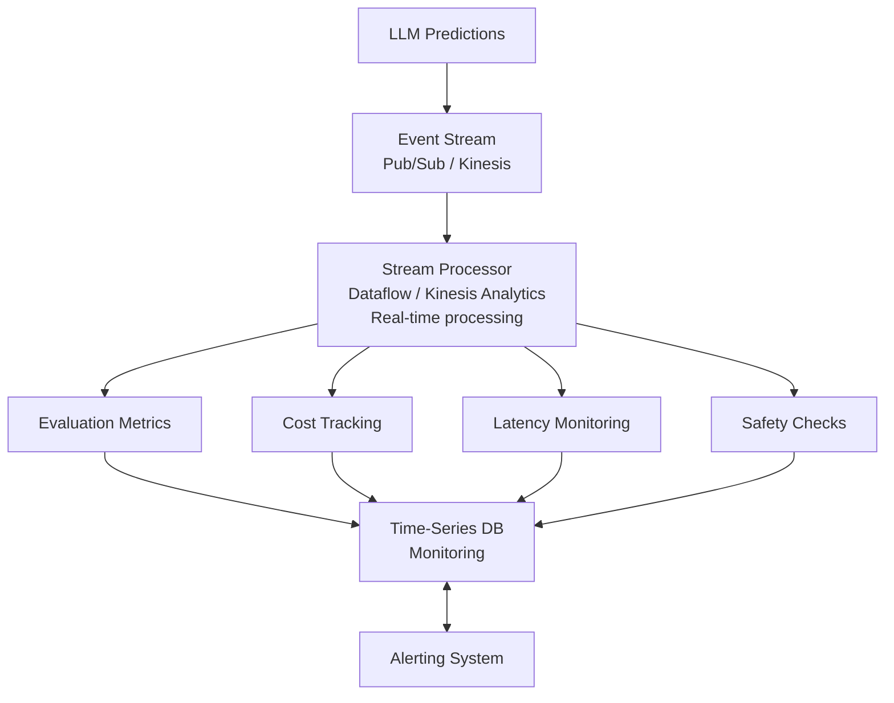
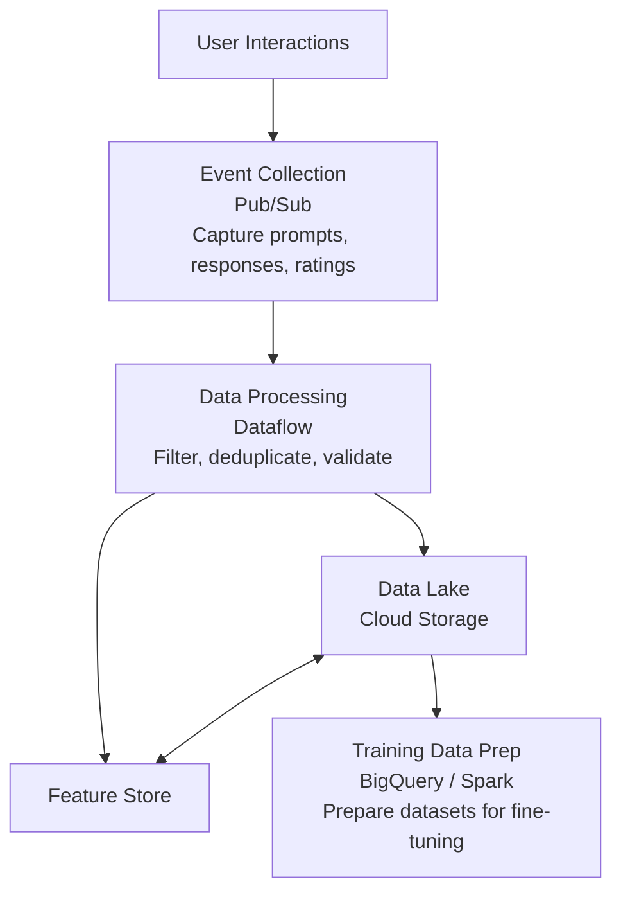
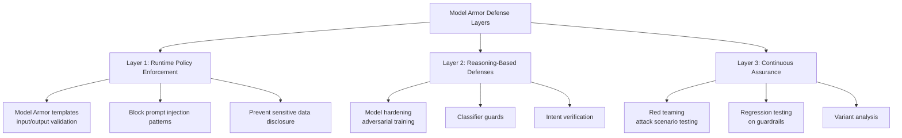
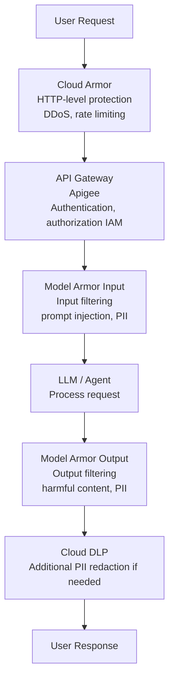

# System Design Guide for Google CPSE Interviews

A comprehensive guide to system design interviews, covering use cases, examples, and step-by-step approaches to tackle real-world engineering problems.

---

## Table of Contents

- [Introduction](#introduction)
- [System Design Framework](#system-design-framework)
- [Use Cases & Examples](#use-cases--examples)
  - [Distributed Systems](#1-distributed-systems)
  - [Data-Intensive Applications](#2-data-intensive-applications)
  - [Near-Real-Time Applications](#3-near-real-time-applications)
- [Core Concepts](#core-concepts)
  - [Internet & Networking](#internet--networking)
  - [Scalability Patterns](#scalability-patterns)
  - [Data Structures & Algorithms](#data-structures--algorithms)
- [Design Patterns](#design-patterns)
- [Resource Estimation](#resource-estimation)
- [Trade-offs & Decision Making](#trade-offs--decision-making)
- [GenAI & Agentic AI System Design](#genai--agentic-ai-system-design)
  - [LLM Serving Architecture](#1-llm-serving-architecture-at-scale)
  - [RAG Systems](#2-rag-retrieval-augmented-generation-system)
  - [Agentic AI Systems](#3-agentic-ai-systems)
  - [LLM Ops Data Pipeline](#4-llm-ops-data-pipeline-at-scale)
  - [GenAI Data Pipeline](#5-genai-data-pipeline-architecture)
  - [Cost Optimization](#6-cost-optimization-for-genai-systems)
  - [Real-World Examples](#7-real-world-genai-system-examples)
  - [Scalability Patterns](#8-scalability-patterns-for-genai)
  - [Monitoring & Observability](#9-monitoring--observability-for-genai)
  - [Security & Compliance](#10-security--compliance-for-genai)

---

## Introduction

System design interviews assess your ability to combine knowledge, theory, experience, and judgment to solve real-world engineering problems. You'll design systems from the ground up, discussing your decision-making process and technical trade-offs.

### What Interviewers Look For

1. **Problem Understanding**: Can you clarify requirements and constraints?
2. **Architecture Design**: Can you design a scalable, reliable system?
3. **Trade-off Analysis**: Can you discuss pros/cons of different approaches?
4. **Communication**: Can you explain your thinking clearly?
5. **Depth**: Can you dive into specific components when asked?

### Key Principles

- **Start broad, then go deep**: High-level architecture first, then details
- **Think out loud**: Explain your reasoning
- **Ask clarifying questions**: Requirements are often ambiguous
- **Consider trade-offs**: Every decision has pros and cons
- **Estimate resources**: Show you understand scale

---

## System Design Framework

Follow this structured approach for any system design problem:

### Step 1: Clarify Requirements (5-10 minutes)

**Ask about:**

- **Functional requirements**: What should the system do?
- **Non-functional requirements**: Scale, performance, reliability
- **Constraints**: Budget, timeline, technology stack
- **Assumptions**: What can we assume?

**Example Questions:**

- "What's the expected number of users?"
- "What's the read/write ratio?"
- "What's the acceptable latency?"
- "Do we need to support real-time updates?"
- "What's the data retention policy?"

### Step 2: High-Level Design (10-15 minutes)

**Draw a diagram showing:**

- **Client layer**: Web, mobile, API clients
- **Application layer**: Services, APIs, business logic
- **Data layer**: Databases, caches, storage
- **Infrastructure**: Load balancers, CDN, message queues

**Key components:**

- **Load Balancer**: Distribute traffic
- **API Gateway**: Route requests, authentication
- **Application Servers**: Handle business logic
- **Database**: Store persistent data
- **Cache**: Reduce database load
- **Message Queue**: Decouple services

### Step 3: Deep Dive (15-20 minutes)

**Discuss in detail:**

- **Data models**: Schema design, relationships
- **API design**: Endpoints, request/response formats
- **Database choice**: SQL vs NoSQL, partitioning
- **Caching strategy**: What to cache, eviction policy
- **Scalability**: Horizontal vs vertical scaling
- **Reliability**: Replication, failover, backup

### Step 4: Identify Bottlenecks & Optimize (5-10 minutes)

**Consider:**

- **Single points of failure**: How to eliminate?
- **Performance bottlenecks**: Where are they?
- **Scalability limits**: What breaks at scale?
- **Cost optimization**: Can we reduce costs?

### Step 5: Wrap Up (2-5 minutes)

**Summarize:**

- **Key design decisions**: Why you made them
- **Trade-offs**: What you sacrificed for what benefit
- **Future improvements**: What you'd do with more time

---

## Use Cases & Examples

### 1. Distributed Systems

**Definition**: Systems that run on multiple machines, working together to achieve a common goal.

#### Use Case: Design a URL Shortener (like bit.ly)

**Requirements:**

- Shorten long URLs to 6-character codes
- Redirect short URLs to original URLs
- Handle 100M URLs/day
- 100:1 read/write ratio
- 99.9% availability

**High-Level Design:**



**Key Design Decisions:**

1. **URL Encoding**: Base62 encoding (a-z, A-Z, 0-9) = 62^6 = 56 billion combinations
2. **Database Sharding**: Partition by hash of short URL
3. **Caching**: Cache recent redirects (80% of traffic)
4. **Load Balancer**: Distribute requests across API servers

**Trade-offs:**

- **Consistent hashing**: Better load distribution vs simpler modulo
- **Cache TTL**: Higher hit rate vs memory usage
- **Database replication**: Read scalability vs write latency

#### Use Case: Design a Distributed Cache

**Requirements:**

- Store key-value pairs
- Support 1M requests/second
- 10TB total capacity
- Handle node failures

**Design Approach:**

1. **Consistent Hashing**: Distribute keys across nodes
2. **Replication**: Each key stored on N nodes (e.g., 3)
3. **Gossip Protocol**: Nodes discover each other
4. **Vector Clocks**: Handle concurrent updates

**Visual: Consistent Hashing**

```
Hash Ring:
    0 ───────────────────────────────── 2^64-1
    │                                    │
    │  Node A  │  Node B  │  Node C   │
    │          │          │            │
    └──────────┴──────────┴────────────┘

Key "user:123" → hash → maps to Node B
```

---

### 2. Data-Intensive Applications

**Definition**: Applications that process, store, and mine large-scale data.

#### Use Case: Design a Log Aggregation System

**Requirements:**

- Collect logs from 10,000 servers
- Store 1TB logs/day
- Support queries: "Find all ERROR logs in last hour"
- 7-day retention

**High-Level Design:**



**Key Design Decisions:**

1. **Message Queue**: Pub/Sub for buffering and decoupling
2. **Time-Series Database**: Optimized for time-range queries
3. **Indexing**: Elasticsearch for full-text search
4. **Partitioning**: By time (daily partitions) and server ID

**Trade-offs:**

- **Batch vs Stream**: Lower latency vs better throughput
- **Storage format**: Compressed vs query performance
- **Retention**: Longer retention vs storage costs

#### Use Case: Design a Data Warehouse

**Requirements:**

- Store 100TB of historical data
- Support analytical queries (OLAP)
- Load 10GB new data daily
- Query latency: < 30 seconds

**Design Approach:**

1. **ETL Pipeline**: Extract, Transform, Load
2. **Columnar Storage**: Parquet format for analytics
3. **Partitioning**: By date and category
4. **Materialized Views**: Pre-compute common aggregations

**Visual: Data Warehouse Architecture**



---

### 3. Near-Real-Time Applications

**Definition**: Applications that respond to user queries interactively (latency < 1 second).

#### Use Case: Design a Chat Application

**Requirements:**

- 10M concurrent users
- Messages delivered in < 100ms
- Support 1:1 and group chats
- Message history for 30 days

**High-Level Design:**



**Key Design Decisions:**

1. **WebSocket**: Persistent connections for real-time delivery
2. **Message Queue**: Decouple senders and receivers
3. **Connection Manager**: Route messages to right connections
4. **Database**: Store message history (partitioned by chat ID)

**Trade-offs:**

- **WebSocket vs Polling**: Lower latency vs simpler infrastructure
- **Message ordering**: Exactly-once vs at-least-once
- **Scaling**: Stateful connections vs stateless services

#### Use Case: Design a Real-Time Analytics Dashboard

**Requirements:**

- Display metrics updated every second
- Support 1000 concurrent viewers
- Show last 24 hours of data
- Handle 1M events/second

**Design Approach:**

1. **Stream Processing**: Process events in real-time (Dataflow)
2. **Time-Window Aggregations**: Compute metrics per second/minute
3. **In-Memory Store**: Redis for latest metrics
4. **WebSocket Push**: Push updates to clients

**Visual: Real-Time Pipeline**

```
Events → Stream Processor → Aggregations → Redis → WebSocket → Clients
         (Dataflow)         (per second)  (cache)  (push)
```

---

## Core Concepts

### Internet & Networking

Understanding how the internet works is crucial for system design.

#### DNS (Domain Name System)

**What it does**: Translates domain names (google.com) to IP addresses (142.250.191.46)

**How it works:**

1. Client queries local DNS resolver
2. Resolver queries root DNS servers
3. Root directs to TLD servers (.com)
4. TLD directs to authoritative DNS server
5. Authoritative server returns IP address

**Visual: DNS Resolution**

```
Client → Local DNS → Root DNS → .com DNS → google.com DNS → IP Address
```

**Use in System Design:**

- **CDN**: Route users to nearest edge server
- **Load Balancing**: Distribute traffic across servers
- **Failover**: Switch to backup servers

#### Load Balancers

**Types:**

1. **Layer 4 (Transport)**: Routes based on IP/port
2. **Layer 7 (Application)**: Routes based on HTTP headers/content

**Algorithms:**

- **Round Robin**: Distribute evenly
- **Least Connections**: Send to least busy server
- **IP Hash**: Sticky sessions

**Visual: Load Balancing**

```
        ┌──────────────┐
        │ Load Balancer│
        └──────┬───────┘
               │
    ┌──────────┼──────────┐
    │          │          │
    ▼          ▼          ▼
┌──────┐  ┌──────┐  ┌──────┐
│Server│  │Server│  │Server│
│  1   │  │  2   │  │  3   │
└──────┘  └──────┘  └──────┘
```

#### Firewalls

**What they do**: Control network traffic based on rules

**Types:**

- **Network Firewall**: Filter at network level
- **Application Firewall**: Filter at application level (WAF)

**Use Cases:**

- **Security**: Block malicious traffic
- **Access Control**: Allow/deny based on IP/port
- **DDoS Protection**: Rate limiting

#### Routers

**What they do**: Forward packets between networks

**Key Concepts:**

- **Routing Table**: Maps destinations to next hop
- **BGP**: Border Gateway Protocol (internet routing)
- **NAT**: Network Address Translation

---

### Scalability Patterns

#### Horizontal vs Vertical Scaling

**Vertical Scaling (Scale Up):**

- Add more resources to existing server (CPU, RAM)
- **Pros**: Simple, no code changes
- **Cons**: Limited by hardware, single point of failure

**Horizontal Scaling (Scale Out):**

- Add more servers
- **Pros**: Unlimited scale, fault tolerance
- **Cons**: Requires load balancing, stateless design

**When to use:**

- **Vertical**: Small scale, stateful applications
- **Horizontal**: Large scale, stateless applications

#### Database Scaling

**Read Replicas:**

- Copy data to multiple servers for reads
- Master handles writes, replicas handle reads
- **Trade-off**: Eventual consistency vs read scalability

**Sharding (Partitioning):**

- Split data across multiple databases
- **Strategies**: Hash-based, range-based, directory-based
- **Challenge**: Cross-shard queries

**Visual: Database Sharding**

```
        ┌──────────────┐
        │  Application │
        └──────┬───────┘
               │
    ┌──────────┼──────────┐
    │          │          │
    ▼          ▼          ▼
┌────────┐ ┌────────┐ ┌────────┐
│Shard 1 │ │Shard 2 │ │Shard 3 │
│(0-33%) │ │(34-66%)│ │(67-99%)│
└────────┘ └────────┘ └────────┘
```

#### Caching Strategies

**Cache-Aside (Lazy Loading):**

1. Check cache
2. If miss, read from database
3. Write to cache
4. Return data

**Write-Through:**

1. Write to database
2. Write to cache
3. Return success

**Write-Back:**

1. Write to cache
2. Return success
3. Async write to database

**Cache Eviction Policies:**

- **LRU**: Least Recently Used
- **LFU**: Least Frequently Used
- **TTL**: Time To Live

---

### Data Structures & Algorithms

#### Graph Traversal in System Design

**Use Cases:**

- **Social Networks**: Find friends of friends (BFS)
- **Dependency Resolution**: Build order (Topological Sort)
- **Recommendation Systems**: Find similar users (DFS)

**Example: Social Network Friend Suggestions**

**Architecture:**

- Use BFS (Breadth-First Search) to traverse friendship graph
- Start from user, explore friends at depth 1, then friends of friends at depth 2
- Time complexity: O(V + E) where V = users, E = friendships
- Space complexity: O(V) for visited set and queue
  if depth == max_depth:
  suggestions.append(friend)
  else:
  queue.append((friend, depth + 1))

  return suggestions

```

#### Distributed Hash Tables (DHT)

**Concept**: Hash table distributed across multiple nodes

**Use Cases:**

- **Peer-to-Peer Networks**: BitTorrent, IPFS
- **Service Discovery**: Find services in microservices
- **Content Delivery**: Route requests to content

**Key Properties:**

- **Consistent Hashing**: Minimal rehashing on node changes
- **Fault Tolerance**: Handle node failures
- **Load Balancing**: Distribute keys evenly

**Visual: DHT Ring**

```

Hash Ring (0 to 2^160):
Node A (hash: 100)
Node B (hash: 500)
Node C (hash: 900)

Key "file:123" → hash: 350 → maps to Node B

```

#### Binary Trees in System Design

**Use Cases:**

- **Indexing**: B-trees in databases
- **Decision Trees**: ML models, routing decisions
- **Expression Trees**: Query parsing

**Example: Database Index (B-Tree)**

```

B-Tree Structure:
[50]
/ \
 [20] [80]
/ | \ / \
[10][30][40][60][90]

- O(log n) search time
- Supports range queries
- Optimized for disk I/O

```

---

## Design Patterns

### Microservices Architecture

**Pattern**: Break application into small, independent services

**Pros:**

- Independent scaling
- Technology diversity
- Fault isolation

**Cons:**

- Network latency
- Data consistency
- Operational complexity

**When to use:**

- Large team
- Different scaling needs per service
- Need technology flexibility

### Event-Driven Architecture

**Pattern**: Services communicate via events

**Components:**

- **Event Producers**: Generate events
- **Event Bus**: Message queue (Pub/Sub)
- **Event Consumers**: Process events

**Use Cases:**

- **Order Processing**: Order created → inventory updated → email sent
- **Analytics**: User action → event → analytics pipeline

**Visual: Event-Driven System**

```

Service A → Event Bus → Service B
→ Service C
→ Service D

```

### API Gateway Pattern

**Pattern**: Single entry point for all client requests

**Responsibilities:**

- **Routing**: Route to appropriate service
- **Authentication**: Verify credentials
- **Rate Limiting**: Prevent abuse
- **Load Balancing**: Distribute requests

**Visual: API Gateway**

```

Clients → API Gateway → Service A
→ Service B
→ Service C

```

---

## Resource Estimation

### Back-of-the-Envelope Calculations

**Key Numbers:**

- 1 million seconds = ~11.5 days
- 1 billion seconds = ~31.7 years
- 1KB = 1,024 bytes
- 1MB = 1,024 KB = 1,048,576 bytes
- 1GB = 1,024 MB = 1,073,741,824 bytes

**Example: Estimate Storage for URL Shortener**

**Given:**

- 100M URLs/day
- Each URL: 500 bytes (original URL + metadata)
- 5-year retention

**Calculation:**

```

Daily storage: 100M × 500 bytes = 50GB/day
Yearly storage: 50GB × 365 = 18.25TB/year
5-year storage: 18.25TB × 5 = 91.25TB

With 3x replication: 91.25TB × 3 = 273.75TB

```

**Example: Estimate QPS for Chat App**

**Given:**

- 10M users
- Each user sends 10 messages/day
- Peak traffic: 3x average

**Calculation:**

```

Average messages/day: 10M × 10 = 100M messages/day
Average QPS: 100M / (24 × 3600) = ~1,157 QPS
Peak QPS: 1,157 × 3 = ~3,471 QPS

With 10:1 read/write ratio:
Write QPS: ~315 QPS
Read QPS: ~3,156 QPS

```

### Server Capacity Estimation

**Assumptions:**

- Single server: 4 CPU cores, 16GB RAM
- Each request: 100ms processing time
- CPU utilization: 70% (safety margin)

**Calculation:**

```

Theoretical QPS: 4 cores × 10 requests/second/core = 40 QPS/core
With 70% utilization: 40 × 0.7 = 28 QPS/core
Total per server: 28 × 4 = 112 QPS/server

For 3,471 QPS: 3,471 / 112 = ~31 servers needed

````

---

## Trade-offs & Decision Making

### SQL vs NoSQL

| Aspect       | SQL                           | NoSQL                    |
| ------------ | ----------------------------- | ------------------------ |
| **Schema**   | Fixed schema                  | Flexible schema          |
| **ACID**     | Strong consistency            | Eventual consistency     |
| **Scaling**  | Vertical (hard)               | Horizontal (easy)        |
| **Queries**  | Complex joins                 | Simple queries           |
| **Use Case** | Structured data, transactions | Unstructured data, scale |

**When to choose SQL:**

- Need ACID transactions
- Complex queries with joins
- Structured, relational data

**When to choose NoSQL:**

- Need horizontal scaling
- Flexible schema
- High write throughput

### Consistency vs Availability

**CAP Theorem**: Can only guarantee 2 of 3:

- **Consistency**: All nodes see same data
- **Availability**: System responds to requests
- **Partition Tolerance**: System works despite network failures

**Trade-offs:**

- **CP (Consistency + Partition)**: Strong consistency, may be unavailable
- **AP (Availability + Partition)**: Always available, eventual consistency
- **CA**: Not possible in distributed systems

### Latency vs Throughput

**Latency**: Time for one request
**Throughput**: Requests per second

**Trade-offs:**

- **Batch Processing**: Higher throughput, higher latency
- **Stream Processing**: Lower latency, lower throughput
- **Caching**: Reduces latency, increases complexity

---

## Common System Design Questions

### 1. Design Twitter/X

**Key Requirements:**

- Post tweets (140 characters)
- Follow/unfollow users
- Timeline feed (home + user)
- 300M users, 500M tweets/day

**Key Components:**

- **Feed Service**: Generate timelines
- **Social Graph**: Store follow relationships
- **Timeline Generation**: Pre-compute vs real-time
- **Media Storage**: Images, videos

**Design Decision:**

- **Fan-out**: Write to all followers' timelines (write-heavy)
- **Pull Model**: Read from followed users (read-heavy)
- **Hybrid**: Pre-compute for celebrities, real-time for others

### 2. Design a Search Engine

**Key Requirements:**

- Index 1 trillion web pages
- Return results in < 100ms
- Handle 10,000 QPS

**Key Components:**

- **Crawler**: Discover and download pages
- **Indexer**: Build inverted index
- **Ranker**: Score and rank results
- **Cache**: Cache popular queries

**Design Decision:**

- **Inverted Index**: Word → list of documents
- **Distributed Index**: Shard by document ID
- **Caching**: Cache top 10% queries (80% of traffic)

### 3. Design a Video Streaming Service

**Key Requirements:**

- Stream videos to 100M users
- Support multiple resolutions
- Handle 1M concurrent streams

**Key Components:**

- **CDN**: Distribute video content
- **Transcoding**: Convert to multiple formats
- **Adaptive Bitrate**: Adjust quality based on bandwidth

**Design Decision:**

- **CDN**: Cache videos at edge locations
- **Chunking**: Split videos into segments
- **Multi-bitrate**: Pre-encode at different qualities

---

## Interview Tips

### Do's

✅ **Ask clarifying questions** before designing
✅ **Start with high-level architecture** then dive deep
✅ **Discuss trade-offs** for every decision
✅ **Estimate resources** (storage, QPS, servers)
✅ **Think out loud** - explain your reasoning
✅ **Consider failure scenarios** - what can go wrong?

### Don'ts

❌ **Don't jump to solutions** - understand requirements first
❌ **Don't ignore scale** - always consider scalability
❌ **Don't forget about security** - authentication, authorization
❌ **Don't skip monitoring** - how will you know if it breaks?
❌ **Don't assume perfect conditions** - handle failures

### Common Mistakes

1. **Over-engineering**: Starting with complex solutions
2. **Under-estimating scale**: Not considering millions of users
3. **Ignoring consistency**: Not discussing data consistency
4. **Missing monitoring**: Forgetting observability
5. **No backup plan**: Not discussing disaster recovery

---

## Practice Problems

### Beginner

1. **Design a Pastebin** (like pastebin.com)
2. **Design a Counter Service** (distributed counters)
3. **Design a Rate Limiter**

### Intermediate

1. **Design a News Feed** (like Facebook)
2. **Design a Chat System** (like WhatsApp)
3. **Design a File Storage System** (like Dropbox)

### Advanced

1. **Design a Distributed Cache** (like Redis Cluster)
2. **Design a Search Engine** (like Google)
3. **Design a Video Platform** (like YouTube)

---

## GenAI & Agentic AI System Design

### Introduction to GenAI System Design

Generative AI applications introduce unique challenges:

- **Token-by-token generation**: Sequential decoding (unlike batch predictions)
- **Variable latency**: Generation time depends on output length
- **High memory requirements**: KV cache for attention mechanisms
- **Cost optimization**: Balance between latency and throughput
- **Hallucination management**: Ensuring factual accuracy
- **Agent orchestration**: Multi-step reasoning and tool use

### Key Differences from Traditional ML Systems

| Aspect         | Traditional ML       | GenAI/LLM                              |
| -------------- | -------------------- | -------------------------------------- |
| **Prediction** | Single forward pass  | Token-by-token generation              |
| **Latency**    | Fixed (milliseconds) | Variable (seconds to minutes)          |
| **Memory**     | Model weights        | Model + KV cache (grows with sequence) |
| **Batching**   | Static batches       | Dynamic/continuous batching            |
| **Cost**       | Per-request          | Per-token (input + output)             |

---

### 1. LLM Serving Architecture at Scale

#### Use Case: Design a Chatbot Service (like ChatGPT)

**Requirements:**

- Support 1M concurrent users
- Average response time < 2 seconds
- Handle 10,000 requests/second
- Support multiple models (GPT-4, Claude, Gemini)
- Cost-effective serving

**High-Level Design:**

```mermaid
graph TD
    A[Clients<br/>Web/API] --> B[API Gateway<br/>Cloud Endpoints<br/>Authentication, rate limiting]
    B --> C[Request Router<br/>Load Balancer]
    C <--> D[Cache<br/>Redis]
    C --> E[LLM Serving Infrastructure<br/>Vertex AI / SageMaker<br/>Continuous batching, KV cache]
````

**Key Design Decisions:**

1. **Model Serving Infrastructure**:

   - **Google Cloud**: Vertex AI Prediction (managed LLM serving)
   - **AWS**: Amazon SageMaker with LLM inference containers
   - **Self-hosted**: vLLM, TensorRT-LLM, or Triton Inference Server

2. **Continuous Batching**:

   - **Problem**: Static batching wastes GPU when requests finish at different times
   - **Why this happens**: LLM generation is sequential (token-by-token), so requests in a batch finish at different times. With static batching, the GPU waits for the slowest request before processing the next batch.
   - **Why continuous batching works**: Instead of waiting, we immediately add new requests to fill the "slots" left by completed requests. This keeps the GPU constantly busy, maximizing utilization.
   - **Solution**: Dynamic batching - add new requests to batch as others complete
   - **Benefit**: 2-3x higher throughput because GPU utilization increases from ~40% to ~85%
   - **Underlying principle**: GPUs are most efficient when processing large batches. Continuous batching maintains large batch sizes while allowing requests to finish independently.

3. **KV Cache Management**:

   - **What**: Cache attention key-value pairs to avoid recomputation
   - **Why KV cache is needed**: In transformer attention, each token needs to attend to all previous tokens. Without caching, we'd recompute attention for all previous tokens at each step, leading to O(n²) complexity per token.
   - **How it works**: During generation, we compute K and V for each new token, but reuse cached K/V from previous tokens. This reduces complexity to O(n) per token.
   - **Why memory grows**: Each token's K/V vectors are stored for all layers. For a 32-layer model with 768-dim embeddings, each token requires ~50KB of cache. A 2000-token sequence needs ~100MB just for KV cache.
   - **Challenge**: Memory grows linearly with sequence length, limiting max context length
   - **Why paged attention helps**: Instead of allocating contiguous memory (which fragments), paged attention uses non-contiguous pages. This allows better memory utilization and supports longer sequences.
   - **Solution**: Paged attention (vLLM) or sliding window attention

4. **Caching Strategy**:
   - **Prompt caching**: Cache common prompts (system prompts, few-shot examples)
   - **Response caching**: Cache identical requests
   - **Semantic caching**: Cache semantically similar requests

**Visual: Continuous Batching**

```

Time 0: [Request A (100 tokens)]
Time 1: [Request A (50 tokens), Request B (100 tokens)] ← Added B
Time 2: [Request B (50 tokens), Request C (100 tokens)] ← A finished, added C
Time 3: [Request C (50 tokens), Request D (100 tokens)] ← B finished, added D

```

**Detailed Trade-offs Analysis:**

1. **Managed vs Self-hosted LLM Serving**:

   - **Managed (Vertex AI / SageMaker)**:

     - ✅ **Pros**:
       - Zero infrastructure management
       - Automatic scaling and load balancing
       - Built-in monitoring and logging
       - Security and compliance handled
       - Pay-per-use pricing (no idle costs)
     - ❌ **Cons**:
       - Less control over optimization
       - Vendor lock-in
       - Potentially higher costs at scale
       - Limited customization of serving logic
     - **When to use**: Startups, rapid prototyping, when ops team is small

   - **Self-hosted (vLLM / TensorRT-LLM)**:
     - ✅ **Pros**:
       - Full control over optimization
       - Can achieve better cost efficiency at scale
       - No per-request API fees
       - Customizable batching and caching strategies
     - ❌ **Cons**:
       - Requires ML infrastructure expertise
       - GPU management and scaling complexity
       - Higher upfront costs (GPU instances)
       - Need to handle monitoring, security, updates
     - **When to use**: High volume (millions of requests/day), cost-sensitive, need custom optimizations

2. **Prompt Caching Strategy**:

   - **What it is**: Cache the attention states (KV cache) for common prompt prefixes
   - **Memory Trade-off**:
     - **Without caching**: Each request processes full prompt → O(n²) attention computation
     - **With caching**: Common prefixes cached → O(n) for cached portion
     - **Memory cost**: ~2 bytes per token per layer (for KV cache)
     - **Example**: 1K token prefix × 32 layers × 2 bytes = 64KB per cached prefix
   - **Latency Benefit**:
     - **Speedup**: 2-5x faster for requests with cached prefixes
     - **Example**: 1000 token prompt, 500 tokens cached → only process 500 tokens
   - **Decision Framework**:
     - Cache if: System prompts, few-shot examples, common user contexts
     - Don't cache if: Highly variable prompts, limited memory, low repetition rate

3. **Batch Size Optimization**:

   - **Small batches (1-4 requests)**:
     - ✅ Lower latency (requests start immediately)
     - ✅ Better for interactive applications
     - ❌ Lower GPU utilization (waste cycles)
     - ❌ Higher cost per token
   - **Large batches (16-64 requests)**:
     - ✅ Higher GPU utilization (better throughput)
     - ✅ Lower cost per token
     - ❌ Higher latency (wait for batch to fill)
     - ❌ Poor user experience for first request
   - **Continuous/Dynamic Batching** (Best of both):
   - ✅ High throughput (GPU always busy)
   - ✅ Low latency (requests don't wait unnecessarily)
   - ✅ Optimal cost efficiency
   - ❌ More complex implementation
   - **Why it's optimal**: Maintains large batch sizes (good for GPU) while allowing early requests to finish (good for latency). The GPU processes multiple requests simultaneously, but each request can complete independently.
   - **How it works**: Maintains a "batch" that's constantly being updated. As requests finish generating, new requests are immediately added. The batch size stays large, but individual requests don't wait for others.
   - **When to use**: Production systems with variable load

4. **Response Caching**:
   - **Full Response Caching**:
     - ✅ Zero LLM cost for cached requests
     - ✅ Instant response (< 10ms)
     - ❌ Memory/storage costs
     - ❌ Cache invalidation complexity
     - **Hit rate**: Typically 10-30% for chat applications
   - **Semantic Caching**:
     - ✅ Higher hit rate (30-50%)
     - ✅ Handles paraphrased queries
     - ❌ Requires similarity computation (adds latency)
     - ❌ Risk of returning slightly wrong answers
     - **When to use**: FAQ systems, common queries, cost optimization priority

---

### 2. RAG (Retrieval-Augmented Generation) System

#### Use Case: Design a Document Q&A System

**Requirements:**

- Answer questions from 1M documents
- Support real-time queries (< 3 seconds)
- Handle 1,000 QPS
- Ensure factual accuracy (grounding)

**High-Level Design:**



**Key Components:**

1. **Document Ingestion Pipeline**:

   - **Google Cloud**: Vertex AI Search, Vertex AI RAG Engine
   - **AWS**: Amazon Bedrock Knowledge Bases, Amazon OpenSearch
   - **Process**: Chunk documents → Generate embeddings → Store in vector DB

2. **Vector Database**:

   - **Google Cloud**: Vertex AI Vector Search, Matching Engine
   - **AWS**: Amazon OpenSearch Serverless, Amazon Kendra
   - **Self-hosted**: Pinecone, Weaviate, Qdrant, Milvus

3. **Embedding Models**:
   - **Google**: text-embedding-004 (Vertex AI)
   - **AWS**: Amazon Titan Embeddings (Bedrock)
   - **Open Source**: sentence-transformers, BGE models

**Visual: RAG Pipeline**

```

Documents → Chunking → Embedding → Vector Store
│
Query → Embedding → Similarity Search → Top-K Docs → LLM → Answer

```

**Design Decisions:**

1. **Chunking Strategy**:

   - **Fixed-size**: Simple but may split concepts
   - **Semantic**: Use embeddings to find natural boundaries
   - **Hybrid**: Fixed-size with overlap

2. **Retrieval Strategy**:

   - **Dense retrieval**: Vector similarity (fast, good semantic match)
   - **Sparse retrieval**: Keyword-based (BM25, good for exact matches)
   - **Hybrid**: Combine both (best of both worlds)

3. **Reranking**:
   - **Cross-encoder**: More accurate but slower
   - **Use case**: Rerank top 20 → top 5 before LLM

**Detailed Trade-offs Analysis:**

1. **Chunking Strategy Trade-offs**:

   **Fixed-Size Chunking (e.g., 512 tokens)**:

   - ✅ **Pros**:
     - Simple to implement
     - Predictable memory usage
     - Fast processing
   - ❌ **Cons**:
     - May split related concepts
     - Context loss at boundaries
     - May include irrelevant content
   - **Why chunking is necessary**: LLMs have context windows (e.g., 8K, 32K tokens). Documents often exceed this, so we must break them into chunks. Additionally, smaller chunks improve retrieval precision - a query about "Python loops" is better matched to a 500-token chunk about loops than a 5000-token document about Python.
   - **Why fixed-size is simple**: No need for semantic understanding - just count tokens and split. This makes it fast and deterministic.
   - **Why it fails**: Concepts don't respect token boundaries. A paragraph explaining a concept might be split mid-explanation, losing context. The retrieval system might find the chunk with the question but miss the chunk with the answer.
   - **Best for**: Uniform documents, simple use cases

   **Semantic Chunking**:

   - ✅ **Pros**:
     - Preserves semantic coherence
     - Better retrieval quality
     - Natural boundaries (sentences, paragraphs)
   - ❌ **Cons**:
     - More complex (requires embedding model)
     - Variable chunk sizes (harder to optimize)
     - Higher processing cost
   - **Why it works better**: By using embeddings to find semantic boundaries, we ensure each chunk contains complete thoughts. When a user queries "how does X work?", the semantic chunker ensures the explanation of X isn't split across chunks.
   - **How it works**: Compute embeddings for sentences/paragraphs, then cluster similar embeddings together. Boundaries occur where semantic similarity drops significantly (e.g., topic change).
   - **Why variable sizes matter**: Some concepts need 200 tokens, others need 1000. Fixed-size forces artificial boundaries. Semantic chunking adapts to content, improving retrieval precision.
   - **Best for**: Long documents, complex content, high-quality requirements

   **Hybrid Approach (Fixed-size with Overlap)**:

   - ✅ **Pros**:
     - Balances simplicity and quality
     - Reduces boundary issues
     - Predictable size with context preservation
   - ❌ **Cons**:
     - Increased storage (overlap duplicates content)
     - May retrieve duplicate chunks
   - **Overlap size**: Typically 10-20% of chunk size
   - **Best for**: Most production systems (balanced approach)

2. **Retrieval Strategy Trade-offs**:

   **Dense Retrieval (Vector Similarity)**:

   - ✅ **Pros**:
     - Captures semantic meaning
     - Handles paraphrasing well
     - Good for conceptual queries
   - ❌ **Cons**:
     - May miss exact keyword matches
     - Requires good embedding model
     - Computationally expensive (vector search)
   - **Why it works**: Embeddings capture semantic meaning in a continuous vector space. Similar meanings are close together. "How do I iterate?" and "What's the best way to loop?" have similar embeddings even with different words.
   - **Why it's expensive**: Need to compute cosine similarity between query embedding and all document embeddings. For 1M documents, that's 1M similarity computations. Approximate Nearest Neighbor (ANN) algorithms like HNSW reduce this to O(log n) but still require preprocessing.
   - **Why it misses keywords**: Embeddings prioritize meaning over exact words. "Python" and "programming language" might be close, but exact keyword "Python" might not rank highest if the document uses synonyms.
   - **Latency**: 10-50ms for 1M vectors (with ANN indexing)
   - **Best for**: Semantic search, Q&A systems

   **Sparse Retrieval (BM25 / Keyword)**:

   - ✅ **Pros**:
     - Fast (inverted index)
     - Excellent for exact matches
     - No embedding model needed
   - ❌ **Cons**:
     - Poor semantic understanding
     - Fails on paraphrasing
     - Requires exact keyword overlap
   - **Why it's fast**: Uses inverted index - a mapping from words to documents containing them. To find "Python loops", just look up "Python" and "loops" in the index, then intersect the document lists. This is O(1) lookup per keyword.
   - **Why BM25 works**: BM25 scores documents based on term frequency (TF) and inverse document frequency (IDF). Common words (like "the") get low weight, rare words get high weight. Documents with more matching rare terms rank higher.
   - **Why it fails on paraphrasing**: "How do I iterate?" and "What's the best way to loop?" share no keywords, so BM25 returns 0 similarity even though they mean the same thing.
   - **Latency**: 1-5ms for 1M documents (inverted index lookup)
   - **Best for**: Keyword search, exact matching

   **Hybrid Retrieval**:

   - ✅ **Pros**:
     - Best of both worlds
     - Higher recall (finds more relevant docs)
     - Handles both semantic and keyword queries
   - ❌ **Cons**:
     - More complex (two retrieval systems)
     - Higher latency (two searches)
     - Need fusion algorithm (RRF, weighted)
   - **Fusion methods**:
     - **Reciprocal Rank Fusion (RRF)**: Simple, effective
     - **Weighted combination**: Tune weights per use case
   - **Best for**: Production systems requiring high quality

3. **Top-K Selection Trade-offs**:

   **Small K (5-10 documents)**:

   - ✅ **Pros**:
     - Lower LLM context cost (fewer tokens)
     - Faster generation (less context)
     - Lower latency
   - ❌ **Cons**:
     - May miss relevant documents
     - Lower recall
     - Risk of incomplete answers
   - **Cost impact**: 5 docs × 500 tokens = 2,500 tokens vs 20 docs × 500 = 10,000 tokens
   - **Best for**: High-precision requirements, cost-sensitive

   **Large K (20-50 documents)**:

   - ✅ **Pros**:
     - Higher recall (more likely to find answer)
     - Better for complex queries
     - More comprehensive answers
   - ❌ **Cons**:
     - Higher LLM cost (more tokens)
     - Slower generation
     - May include irrelevant context (noise)
   - **Best for**: Complex queries, high-recall requirements

   **Adaptive K**:

   - ✅ **Pros**:
     - Optimizes per query
     - Balances cost and quality
   - ❌ **Cons**:
     - Complex implementation
     - Requires query classification
   - **Strategy**: Start with K=10, expand if confidence low

4. **Reranking Trade-offs**:

   **No Reranking**:

   - ✅ **Pros**:
     - Lowest latency
     - No additional cost
     - Simple pipeline
   - ❌ **Cons**:
     - Lower quality (vector similarity isn't perfect)
     - May include irrelevant docs in top-K

   **Cross-Encoder Reranking**:

   - ✅ **Pros**:
     - Much higher accuracy (query-doc interaction)
     - Better relevance ordering
     - Typically improves answer quality significantly
   - ❌ **Cons**:
     - Higher latency (processes each doc-query pair)
     - Higher cost (reranking model inference)
   - **Why it's more accurate**: Bi-encoder (used in retrieval) computes embeddings separately: query embedding and doc embedding, then compares. Cross-encoder processes query and document together, allowing the model to see interactions like "query word X appears near doc word Y", which bi-encoders miss.
   - **Why it's slower**: Must run inference for each query-document pair. For 20 documents, that's 20 model calls. Bi-encoder computes embeddings once, then does fast vector search.
   - **Why the two-stage approach works**: First stage (bi-encoder) quickly narrows from 1M documents to 20 candidates. Second stage (cross-encoder) carefully ranks these 20. This combines speed (bi-encoder) with accuracy (cross-encoder).
   - **Latency**: ~10ms per document × K documents
   - **Best practice**: Retrieve K=20, rerank to top 5
   - **ROI**: Usually worth the cost for quality improvement - 20 reranking calls cost ~$0.0002 but significantly improve answer quality

5. **Embedding Model Trade-offs**:

   **Small Models (384-512 dimensions)**:

   - ✅ **Pros**:
     - Fast inference (< 5ms)
     - Low memory footprint
     - Lower cost
   - ❌ **Cons**:
     - Lower quality embeddings
     - Poor semantic understanding
   - **Best for**: High-throughput, simple use cases

   **Large Models (768-1536 dimensions)**:

   - ✅ **Pros**:
     - Higher quality embeddings
     - Better semantic understanding
     - Handles complex queries well
   - ❌ **Cons**:
     - Slower inference (10-20ms)
     - Higher memory (larger vectors)
     - Higher cost
   - **Best for**: Quality-critical applications

   **Multilingual Models**:

   - ✅ **Pros**:
     - Handles multiple languages
     - Cross-lingual retrieval
   - ❌ **Cons**:
     - Larger model size
     - May be worse for single language
   - **Best for**: International applications

---

### 3. Agentic AI Systems

#### Use Case: Design a Customer Support Agent

**Requirements:**

- Handle customer inquiries autonomously
- Access multiple tools (CRM, knowledge base, order system)
- Support multi-turn conversations
- Escalate to human when needed
- Handle 10,000 conversations/day

**High-Level Design:**



**Key Components:**

1. **Agent Framework**:

   - **Google Cloud**: Vertex AI Agent Builder, Agent Development Kit (ADK)
   - **AWS**: Amazon Bedrock Agents, AgentCore
   - **Open Source**: LangChain, LlamaIndex, AutoGen

2. **Tool Integration**:

   - **Function Calling**: LLM decides which tools to call
   - **API Integration**: REST APIs, GraphQL, gRPC
   - **MCP (Model Context Protocol)**: Standardized tool connections

3. **Orchestration**:
   - **ReAct Pattern**: Reason → Act → Observe loop
   - **Planning**: Break complex tasks into steps
   - **Memory**: Maintain conversation context

**Visual: Agent Execution Flow**

```

User: "What's my order status for #12345?"

Agent Reasoning:

1. Need to call "get_order_status" tool
2. Parameter: order_id = "12345"
3. Call tool → Get result
4. Generate response: "Your order #12345 is shipped and will arrive tomorrow."

User: "Can I cancel it?"

Agent Reasoning:

1. Need to check if order can be cancelled (business logic)
2. Call "check_cancellation_policy" tool
3. If allowed, call "cancel_order" tool
4. Generate response: "I've cancelled your order. Refund will process in 3-5 days."

```

**Design Patterns with Detailed Trade-offs:**

1. **Single Agent Pattern**:

   - **Architecture**: One LLM handles entire conversation with all tools
   - ✅ **Pros**:
     - Simple architecture (one service)
     - Low latency (no inter-agent communication)
     - Easy to debug and monitor
     - Lower infrastructure costs
   - ❌ **Cons**:
     - Limited capabilities (one model can't excel at everything)
     - May struggle with complex multi-step tasks
     - Harder to optimize (generalist vs specialist)
   - **When to use**: Simple use cases, single domain, low complexity
   - **Example**: Simple FAQ chatbot, single-purpose assistant

2. **Multi-Agent Pattern**:

   - **Architecture**: Multiple specialized agents, each with specific tools
   - ✅ **Pros**:
     - Better performance (specialized agents)
     - Modularity (can update agents independently)
     - Parallel execution (agents can work simultaneously)
     - Easier to scale (scale agents independently)
   - ❌ **Cons**:
     - Coordination complexity (who handles what?)
     - Higher latency (routing + multiple calls)
     - More complex error handling
     - Higher infrastructure costs
   - **Why specialization helps**: Just like human experts, specialized agents can be fine-tuned or prompted for specific domains. A billing agent knows payment APIs, a technical agent knows troubleshooting. This leads to better accuracy than a generalist trying to do everything.
   - **Why parallel execution matters**: Independent agents can work simultaneously. While billing agent checks payment status, technical agent can check system logs. This reduces total latency compared to sequential execution.
   - **Why coordination is hard**: Need to decide which agent handles a request. A query like "I can't log in and my payment failed" could go to either technical or billing. Router must understand intent or route to both.
   - **Coordination strategies**:
     - **Router**: Simple LLM router decides which agent - fast but may misroute
     - **Orchestrator**: Central coordinator manages flow - more control but higher latency
     - **Broadcast**: Send to all, use best response - highest quality but most expensive
   - **When to use**: Complex domains, multiple expertise areas
   - **Example**: Customer support (billing agent, technical agent, sales agent)

3. **Hierarchical Pattern (Supervisor/Manager)**:

   - **Architecture**: Supervisor agent delegates to specialist agents, tracks progress
   - ✅ **Pros**:
     - Scalable (easy to add new specialists)
     - Organized (clear hierarchy)
     - Handles complex workflows well
     - Good separation of concerns
     - Natural design (mirrors human teams)
   - ❌ **Cons**:
     - Higher latency (supervisor → specialist → response)
     - More complex (multiple layers)
     - Higher cost (multiple LLM calls)
     - Potential for cascading failures
   - **When to use**: Large-scale systems, complex workflows, enterprise applications
   - **Example**: Enterprise assistant (supervisor → research agent → writing agent → review agent)

4. **Additional Multi-Agent Patterns** (from production systems):

   **Sequential Pipeline Pattern**:

   - **Architecture**: Agent A → Agent B → Agent C (linear handoff)
   - **Use case**: Content creation workflows, review processes
   - **Example**: Research agent → Writer agent → Editor agent → Publisher agent
   - **Why it works**: Each agent builds on previous work, clear data flow

   **Parallel Fan-out Pattern**:

   - **Architecture**: Query sent to multiple agents simultaneously, results aggregated
   - **Use case**: Research tasks, multi-perspective analysis
   - **Example**: Send research question to 3 specialist agents, combine insights
   - **Why it's faster**: Parallel execution reduces total latency (max instead of sum)

   **Diamond Pattern**:

   - **Architecture**: Coordinator delegates to multiple agents in parallel, responses converge to single output
   - **Use case**: Research teams, competitive analysis
   - **Example**: Coordinator → [Market Research Agent, Competitor Analysis Agent, User Research Agent] → Synthesizer
   - **Why it's effective**: Multiple perspectives improve quality, parallel execution improves speed

   **Debate/Adversarial Pattern**:

   - **Architecture**: Agents argue opposing views, judge decides
   - **Use case**: High-stakes decisions, red teaming, critical analysis
   - **Example**: Pro agent vs Con agent debate a proposal, Judge agent makes decision
   - **Why it works**: Forces consideration of multiple perspectives, reduces bias

   **Peer-to-Peer Pattern**:

   - **Architecture**: Agents communicate directly without central coordinator
   - **Use case**: Swarm intelligence, distributed problem-solving
   - **Why it's different**: Decentralized coordination, no single point of failure
   - **Trade-off**: More complex coordination but more resilient

**Multi-Agent vs Single-Agent Trade-offs:**

| Aspect              | Single-Agent                                | Multi-Agent                           |
| ------------------- | ------------------------------------------- | ------------------------------------- |
| **Complexity**      | One agent handles everything                | Multiple specialized agents           |
| **Modularity**      | Monolithic, harder to debug                 | Modular, easier to isolate issues     |
| **Specialization**  | Generalist, may struggle with complex tasks | Specialists, each master of one trade |
| **Transparency**    | Single opaque reasoning chain               | Clear structure, traceable per agent  |
| **Error isolation** | Hard to pinpoint failures                   | Easy to identify responsible agent    |
| **Scalability**     | Limited by single agent's capacity          | Scales by adding more specialists     |

**Why Multi-Agent Systems Scale Better:**

- **Independent scaling**: Scale billing agent separately from technical agent based on load
- **Fault isolation**: If one agent fails, others continue working
- **Development velocity**: Teams can work on different agents independently
- **Cost optimization**: Use smaller models for simple agents, larger models for complex ones

**Additional Trade-offs for Agent Systems:**

4. **Tool Calling Strategy**:

   **Sequential Tool Calling**:

   - ✅ **Pros**: Simple, deterministic, easy to debug
   - ❌ **Cons**: Slower (wait for each tool), can't parallelize
   - **Latency**: Sum of all tool latencies
   - **Best for**: Dependent operations, simple workflows

   **Parallel Tool Calling**:

   - ✅ **Pros**: Faster (execute simultaneously), better UX
   - ❌ **Cons**: Complex (handle dependencies), harder to debug
   - **Why it's faster**: If tools are independent (e.g., check order status AND check account balance), executing them in parallel means total time = max(latency1, latency2) instead of latency1 + latency2. For two 500ms tools, parallel = 500ms, sequential = 1000ms.
   - **Why dependencies matter**: If tool B needs output from tool A, must wait. But if tools are independent, parallel execution is safe and faster. The agent must understand dependencies or use a dependency graph.
   - **Why debugging is harder**: Failures can happen simultaneously. Need to track which tool failed and handle partial results. Sequential execution has clear order, parallel doesn't.
   - **Latency**: Max of tool latencies (if independent)
   - **Best for**: Independent operations, performance-critical

   **Conditional Tool Calling**:

   - ✅ **Pros**: Efficient (only call when needed), cost-effective
   - ❌ **Cons**: Requires good decision logic, may miss opportunities
   - **Best for**: Cost-sensitive, variable workflows

5. **Memory Management**:

   **No Memory (Stateless)**:

   - ✅ **Pros**: Simple, scalable, no state management
   - ❌ **Cons**: No context across turns, poor UX for conversations
   - **Best for**: Single-turn interactions, stateless APIs

   **Short-term Memory (Session)**:

   - ✅ **Pros**: Context within conversation, better UX
   - ❌ **Cons**: Requires session storage, memory limits
   - **Storage**: Redis, in-memory cache
   - **Best for**: Chat applications, multi-turn conversations

   **Long-term Memory (Vector Store)**:

   - ✅ **Pros**: Persistent context, learns from history
   - ❌ **Cons**: Complex, retrieval latency, privacy concerns
   - **Best for**: Personal assistants, learning systems

---

#### Context Engineering: The Scaling Bottleneck

**The Problem:**

As agents run longer, the information they track—chat history, tool outputs, documents, reasoning—**explodes**. Simply using larger context windows is not a scaling strategy.

**The Three-Way Pressure on Context:**

| Pressure                                      | Problem                                                                                                            |
| --------------------------------------------- | ------------------------------------------------------------------------------------------------------------------ |
| **Cost & latency spirals**                    | Model cost and time-to-first-token grow with context size; "shoveling" raw history makes agents slow and expensive |
| **Signal degradation ("lost in the middle")** | Irrelevant logs, stale tool outputs distract the model from the immediate instruction                              |
| **Physical limits**                           | RAG results, artifacts, and conversation traces eventually overflow even the largest windows                       |

**Why Context Explosion Happens:**

- **Conversation history**: Every turn adds to context
- **Tool outputs**: Each tool call adds results to context
- **RAG results**: Retrieved documents add to context
- **Reasoning traces**: Chain-of-thought adds tokens
- **Multi-agent coordination**: Each agent handoff adds context

**The Solution: Context as a Compiled View**

Instead of treating context as a mutable string buffer, treat **context as a compiled view over a richer stateful system**:

```

┌─────────────────────────────────────────────────────────────────────┐
│ CONTEXT COMPILATION PIPELINE │
├─────────────────────────────────────────────────────────────────────┤
│ │
│ SOURCES COMPILER OUTPUT │
│ ─────── ──────── ────── │
│ Session (events) → Flows & → Working Context │
│ Memory (long-term) → Processors → (per-call view) │
│ Artifacts (files) → (ordered list) → │
│ │
└─────────────────────────────────────────────────────────────────────┘

```

**Three Design Principles:**

1. **Separate storage from presentation**: Durable state (Sessions) vs per-call views (Working Context) evolve independently
2. **Explicit transformations**: Context is built through named, ordered processors—observable and testable
3. **Scope by default**: Every model call sees the **minimum context required**; agents reach for more via tools

**The Tiered Context Model:**

| Layer               | Purpose                                                       | Lifecycle                             |
| ------------------- | ------------------------------------------------------------- | ------------------------------------- |
| **Working Context** | Immediate prompt for this model call                          | Ephemeral (thrown away after call)    |
| **Session**         | Durable log of events (messages, tool calls, results)         | Per-conversation                      |
| **Memory**          | Long-lived searchable knowledge (preferences, past decisions) | Cross-session                         |
| **Artifacts**       | Large binary/text data (files, logs, images)                  | Addressed by name/version, not pasted |

**Why This Architecture Works:**

- **Working Context**: Only what's needed for current call - reduces tokens, improves focus
- **Session**: Durable log for debugging and continuity - not sent to every call
- **Memory**: Long-term knowledge retrieved on-demand - avoids context bloat
- **Artifacts**: Large files referenced, not embedded - prevents overflow

**Multi-Agent Context Scoping:**

When a root agent invokes sub-agents, prevent **context explosion**:

| Pattern             | Description                                                   | Context Scope                                                |
| ------------------- | ------------------------------------------------------------- | ------------------------------------------------------------ |
| **Agents as Tools** | Sub-agent is a function: call with focused prompt, get result | Callee sees only specific instructions + necessary artifacts |
| **Agent Transfer**  | Control handed off to sub-agent to continue conversation      | Sub-agent inherits a configurable view over the Session      |

**Handoff Modes:**

- **Full mode**: Pass full contents of caller's working context (useful when sub-agent needs entire history)
- **None mode**: Sub-agent sees no prior history; only receives new prompt you construct

**Why Context Scoping Matters:**

- **Cost reduction**: Smaller contexts = lower token costs
- **Latency reduction**: Less context = faster processing
- **Quality improvement**: Focused context = better model performance
- **Scalability**: Prevents context from growing unbounded

6. **Error Handling & Fallbacks**:

   **Tool Failure Handling**:

   - **Retry**: Simple retry for transient failures
   - **Fallback**: Alternative tool or human escalation
   - **Graceful degradation**: Continue without failed tool

   **LLM Failure Handling**:

   - **Retry with backoff**: Handle rate limits, transient errors
   - **Model fallback**: Switch to cheaper/faster model
   - **Human escalation**: Route to human agent

   **Cost of failures**: Each retry = additional cost + latency

**Google Cloud Services:**

- **Vertex AI Agent Builder**: No-code agent creation
- **Agent Development Kit (ADK)**: Programmatic agent control
- **MCP (Model Context Protocol)**: Tool integration standard
- **A2A (Agent-to-Agent)**: Multi-agent coordination

**AWS Services:**

- **Bedrock Agents**: Managed agent orchestration
- **AgentCore**: Flexible agent runtime
- **Knowledge Bases**: RAG integration for agents
- **Lambda Functions**: Tool implementations

---

### 4. LLM Ops Data Pipeline at Scale

#### Use Case: Design a Production LLM Evaluation System

**Requirements:**

- Evaluate model performance continuously
- Track 100+ metrics (accuracy, latency, cost, safety)
- Process 1M predictions/day
- Alert on degradation
- Support A/B testing

**High-Level Design:**



**Key Components:**

1. **Data Collection**:

   - **Google Cloud**: Cloud Logging, Pub/Sub
   - **AWS**: CloudWatch Logs, Kinesis Data Streams
   - **Format**: Structured logs (JSON) with prediction metadata

2. **Stream Processing**:

   - **Google Cloud**: Dataflow (Apache Beam)
   - **AWS**: Kinesis Data Analytics, EMR
   - **Operations**: Aggregation, filtering, enrichment

3. **Metrics Storage**:

   - **Google Cloud**: Cloud Monitoring, BigQuery
   - **AWS**: CloudWatch Metrics, Timestream
   - **Format**: Time-series data for dashboards

4. **Evaluation Metrics**:
   - **Quality**: Accuracy, F1, ROUGE, BLEU
   - **Latency**: P50, P95, P99 response times
   - **Cost**: Tokens used, cost per request
   - **Safety**: Toxicity, bias, jailbreak attempts

**Visual: Evaluation Pipeline**

```

Prediction Event:
{
"request_id": "abc123",
"model": "gemini-pro",
"prompt": "...",
"response": "...",
"tokens_input": 150,
"tokens_output": 200,
"latency_ms": 1200,
"timestamp": "2024-01-26T10:00:00Z"
}

↓ Stream Processing ↓

Metrics:

- Model: gemini-pro
- Time: 2024-01-26 10:00
- Avg latency: 1150ms
- Avg cost: $0.002
- Requests: 1000

```

**Detailed Design Decisions & Trade-offs:**

1. **Sampling Strategy Trade-offs**:

   **Full Logging (100% of predictions)**:

   - ✅ **Pros**:
     - Complete visibility into all predictions
     - No sampling bias
     - Can analyze edge cases
     - Better for debugging
   - ❌ **Cons**:
     - Very high cost (storage + processing)
     - High volume (1M predictions/day = 1M events)
     - May violate privacy regulations (PII in logs)
   - **Cost estimate**: $500-2000/month for 1M predictions/day
   - **Best for**: Critical systems, debugging phases, low volume

   **Sampled Logging (10% of predictions)**:

   - ✅ **Pros**:
     - 10x cost reduction
     - Still statistically significant
     - Good for monitoring trends
   - ❌ **Cons**:
     - May miss rare errors
     - Sampling bias if not random
     - Less granular data
   - **Cost estimate**: $50-200/month for 1M predictions/day
   - **Best for**: Production monitoring, cost-sensitive

   **Smart Sampling (Errors + Sample Successes)**:

   - ✅ **Pros**:
     - Captures all failures (critical)
     - Samples successes (cost-effective)
     - Best of both worlds
   - ❌ **Cons**:
     - More complex logic
     - Need to define "error" clearly
   - **Why this approach works**: Errors are rare but critical - missing one could mean missing a production issue. Successes are common - sampling gives statistical representation without cost. This maximizes signal (all errors) while minimizing noise (sampled successes).
   - **Why errors must be 100%**: A single error might indicate a systemic problem. If we sample errors, we might miss the one error that reveals a bug affecting 1% of users. The cost of logging all errors is small compared to the value.
   - **Why sampling successes is safe**: Successes follow predictable patterns. If 99% of requests succeed, sampling 1% gives us 10K examples/day from 1M requests - enough to detect trends and patterns.
   - **Strategy**: Log 100% errors, 1-5% successes
   - **Best for**: Most production systems (recommended)

2. **Evaluation Frequency Trade-offs**:

   **Real-time Evaluation (Every Prediction)**:

   - ✅ **Pros**:
     - Immediate alerts
     - Can stop bad requests quickly
     - Best for user-facing systems
   - ❌ **Cons**:
     - High compute cost (evaluate every request)
     - May impact latency (if synchronous)
     - Expensive for high-volume systems
   - **Latency impact**: +10-50ms if synchronous
   - **Best for**: Critical systems, low volume, safety-critical

   **Batch Evaluation (Hourly/Daily)**:

   - ✅ **Pros**:
     - Cost-effective (batch processing)
     - Can use cheaper compute
     - Good for trend analysis
   - ❌ **Cons**:
     - Delayed detection (hours/days)
     - May miss real-time issues
     - Not suitable for immediate action
   - **Cost**: 10-100x cheaper than real-time
   - **Best for**: Analytics, reporting, non-critical metrics

   **Hybrid Approach (Real-time Critical + Batch Others)**:

   - ✅ **Pros**:
     - Balance cost and responsiveness
     - Real-time for critical metrics (latency, errors)
     - Batch for expensive metrics (quality, cost analysis)
   - ❌ **Cons**:
     - More complex architecture
     - Need to define "critical" metrics
   - **Why hybrid works**: Not all metrics need immediate action. Latency spikes need instant alerts (real-time). Quality degradation can wait hours (batch). This optimizes cost while maintaining responsiveness where it matters.
   - **Why latency/errors are critical**: These affect user experience immediately. A latency spike means users are experiencing slow responses right now. An error spike means requests are failing right now. These need immediate attention.
   - **Why quality can be batch**: Quality metrics (accuracy, ROUGE) require expensive evaluation (often calling another LLM). Running this in real-time would be prohibitively expensive. Batch processing allows using cheaper compute and aggregating results.
   - **Example**: Real-time latency/errors, batch quality/cost
   - **Best for**: Most production systems (recommended)

3. **Alerting Thresholds & Trade-offs**:

   **Latency Thresholds**:

   - **P50 > 1s**: Too sensitive (many false positives)
   - **P95 > 2s**: Good balance (catches real issues)
   - **P99 > 5s**: Less sensitive (may miss some issues)
   - **Trade-off**: Lower threshold = more alerts but catches issues earlier

   **Cost Thresholds**:

   - **20% increase**: Good for catching cost spikes
   - **50% increase**: Less sensitive, may miss gradual increases
   - **Absolute threshold**: "$1000/day" - good for budget control
   - **Trade-off**: Percentage catches relative changes, absolute catches budget breaches

   **Quality Thresholds**:

   - **5% accuracy drop**: Good for catching degradation
   - **10% accuracy drop**: Less sensitive, may allow poor quality
   - **Statistical significance**: Use confidence intervals
   - **Trade-off**: Lower threshold = more alerts but better quality control

4. **Stream Processing Architecture Trade-offs**:

   **Managed Stream Processing (Dataflow / Kinesis Analytics)**:

   - ✅ **Pros**:
     - Auto-scaling
     - Managed infrastructure
     - Built-in monitoring
   - ❌ **Cons**:
     - Higher cost at scale
     - Less control
     - Vendor lock-in
   - **Best for**: Rapid development, variable load

   **Self-hosted (Kafka + Flink / Spark Streaming)**:

   - ✅ **Pros**:
     - More control
     - Potentially lower cost at scale
     - Open source
   - ❌ **Cons**:
     - Requires expertise
     - Operational overhead
     - Need to handle scaling
   - **Best for**: High volume, cost-sensitive, existing infrastructure

5. **Metrics Storage Trade-offs**:

   **Time-Series Database (Cloud Monitoring / CloudWatch)**:

   - ✅ **Pros**:
     - Optimized for time-series data
     - Built-in dashboards
     - Good retention policies
   - ❌ **Cons**:
     - Limited query flexibility
     - May be expensive for high cardinality
   - **Best for**: Standard metrics, dashboards

   **Data Warehouse (BigQuery / Redshift)**:

   - ✅ **Pros**:
     - Flexible queries (SQL)
     - Good for ad-hoc analysis
     - Can join with other data
   - ❌ **Cons**:
     - Higher latency
     - More expensive for real-time queries
   - **Best for**: Analytics, reporting, ad-hoc queries

   **Hybrid Approach**:

   - ✅ **Pros**:
     - Hot data in time-series DB (last 7 days)
     - Cold data in data warehouse (historical)
     - Best of both worlds
   - ❌ **Cons**:
     - More complex
     - Need data pipeline
   - **Best for**: Production systems with historical analysis needs

---

### 5. GenAI Data Pipeline Architecture

#### Use Case: Design a Training Data Pipeline for Fine-Tuning

**Requirements:**

- Collect user interactions (prompts, responses, feedback)
- Process 10M examples/day
- Clean and prepare data for fine-tuning
- Support continuous data collection

**High-Level Design:**



**Google Cloud Services:**

1. **Data Collection**:

   - **Pub/Sub**: Real-time event streaming
   - **Cloud Logging**: Application logs
   - **BigQuery Streaming**: Direct inserts

2. **Data Processing**:

   - **Dataflow**: Stream and batch processing
   - **Dataproc**: Spark for large-scale processing
   - **Cloud Functions**: Lightweight transformations

3. **Storage**:

   - **Cloud Storage**: Data lake (raw + processed)
   - **BigQuery**: Analytics and querying
   - **Vertex AI Feature Store**: Feature management

4. **Training**:
   - **Vertex AI Training**: Managed training jobs
   - **Vertex AI Model Garden**: Pre-built models
   - **Vertex AI Pipelines**: Orchestration

**AWS Services:**

1. **Data Collection**:

   - **Kinesis Data Streams**: Real-time streaming
   - **CloudWatch Logs**: Application logs
   - **S3**: Object storage

2. **Data Processing**:

   - **Kinesis Data Analytics**: Stream processing
   - **EMR**: Spark/Hadoop processing
   - **Lambda**: Serverless transformations

3. **Storage**:

   - **S3**: Data lake
   - **Redshift**: Data warehouse
   - **SageMaker Feature Store**: Feature management

4. **Training**:
   - **SageMaker Training**: Managed training
   - **SageMaker JumpStart**: Pre-built models
   - **SageMaker Pipelines**: MLOps orchestration

---

### 6. Cost Optimization for GenAI Systems

#### Token-Based Cost Model

**Cost Components:**

- **Input tokens**: Tokens in prompt (including context)
- **Output tokens**: Generated tokens
- **Model tier**: Different models have different costs

**Example Calculation:**

```

Model: Gemini Pro
Input: $0.000125 per 1K tokens
Output: $0.0005 per 1K tokens

Request:

- Input: 1,000 tokens
- Output: 500 tokens

Cost = (1,000 / 1,000) × $0.000125 + (500 / 1,000) × $0.0005
= $0.000125 + $0.00025
= $0.000375 per request

At 1M requests/day: $375/day = $11,250/month

```

**Detailed Optimization Strategies & Trade-offs:**

1. **Prompt Optimization Trade-offs**:

   **Shorter Prompts**:

   - ✅ **Pros**:
     - Lower input token cost
     - Faster processing (less context)
     - Lower latency
   - ❌ **Cons**:
     - May lose important context
     - Lower quality responses
     - Need to carefully trim
   - **Cost savings**: 20-40% reduction in input tokens
   - **Best practice**: Remove redundant instructions, compress examples

   **Prompt Compression Techniques**:

   - **Summarization**: Summarize long context before sending
   - **Key extraction**: Extract only relevant information
   - **Token pruning**: Remove less important tokens
   - **Trade-off**: Compression cost vs token savings
   - **ROI**: Worth it if compression cost < token savings

   **Few-shot Examples**:

   - **More examples (5-10)**:
     - ✅ Better quality, clearer pattern
     - ❌ Higher cost (more tokens)
   - **Fewer examples (1-2)**:
     - ✅ Lower cost
     - ❌ May not capture pattern well
   - **Why few-shot works**: LLMs learn patterns from examples. Showing 2-3 examples teaches the model the desired format, style, and reasoning pattern. The model generalizes from these examples to new inputs.
   - **Why diminishing returns**: After 3 examples, additional examples provide less value. The model has already learned the pattern. More examples mainly help with edge cases, but at increasing cost.
   - **Why 2-3 is the sweet spot**: Research shows 2-3 examples capture most patterns effectively. One example might be ambiguous (is this the only way?), but 2-3 examples show the pattern clearly without excessive cost.
   - **Sweet spot**: 2-3 examples usually sufficient
   - **Cost impact**: Each example = 50-200 tokens. 3 examples = 150-600 tokens. At $0.000125 per 1K tokens, that's $0.00002-0.00008 per request just for examples.

2. **Caching Strategy Trade-offs**:

   **Prompt Caching (KV Cache)**:

   - ✅ **Pros**:
     - 2-5x speedup for cached prefixes
     - Significant latency reduction
     - No quality loss
   - ❌ **Cons**:
     - Memory overhead (~2 bytes/token/layer)
     - Only helps if prompts share prefixes
   - **Memory cost**: 1K tokens × 32 layers × 2 bytes = 64KB per cached prefix
   - **Best for**: System prompts, few-shot examples, common contexts
   - **ROI**: Very high if prefix reuse > 20%

   **Response Caching**:

   - ✅ **Pros**:
     - Zero LLM cost for cached requests
     - Instant response (< 10ms)
     - Perfect for identical queries
   - ❌ **Cons**:
     - Storage costs
     - Cache invalidation complexity
     - Low hit rate for diverse queries
   - **Hit rate**: Typically 10-30% for chat, 50-80% for FAQ
   - **Cost savings**: 100% LLM cost for cached requests
   - **Best for**: FAQ systems, common queries, cost optimization

   **Semantic Caching**:

   - ✅ **Pros**:
     - Higher hit rate (30-50%)
     - Handles paraphrasing
     - Better than exact match caching
   - ❌ **Cons**:
     - Similarity computation overhead (+5-10ms)
     - Risk of returning slightly wrong answers
     - More complex implementation
   - **Similarity threshold**: 0.85-0.95 (tune per use case)
   - **Best for**: Q&A systems, conversational interfaces

3. **Model Selection Trade-offs**:

   **Tiered Model Strategy**:

   - **Large model (GPT-4, Gemini Ultra)**:

     - ✅ Best quality, handles complex tasks
     - ❌ High cost ($0.03-0.06 per 1K output tokens)
     - **Use for**: Complex reasoning, critical tasks

   - **Medium model (GPT-3.5, Gemini Pro)**:

     - ✅ Good quality, reasonable cost
     - ❌ May struggle with complex tasks
     - **Use for**: Most production tasks

   - **Small model (GPT-3.5-turbo, Gemini Flash)**:
     - ✅ Low cost ($0.001-0.002 per 1K output tokens)
     - ✅ Fast inference
     - ❌ Lower quality, simpler tasks only
     - **Use for**: Simple tasks, high-volume, cost-sensitive

   **Cost Comparison** (per 1K output tokens):

   - Large: $0.06 (30x more expensive)
   - Medium: $0.002
   - Small: $0.001

   **Routing Strategy**:

   - **Complexity-based**: Route complex queries to large model
   - **Confidence-based**: Use small model, fallback to large if low confidence
   - **Cost savings**: 50-80% by using tiered approach

   **Fine-tuning Trade-offs**:

   - ✅ **Pros**:
     - Better quality for specific domain
     - Can use smaller base model
     - Lower per-token cost after fine-tuning
   - ❌ **Cons**:
     - Upfront training cost ($100-1000s)
     - Need training data
     - Model management complexity
   - **Why fine-tuning works**: Pre-trained models learn general language patterns. Fine-tuning adapts these patterns to your specific domain (e.g., medical, legal, code). The model learns domain-specific terminology and formats.
   - **Why smaller models become viable**: A fine-tuned 7B model on medical data may outperform a general 70B model on medical tasks. Domain knowledge compensates for size.
   - **Why upfront cost matters**: Fine-tuning requires GPU time ($5-50/hour) and can take hours to days. But once done, inference cost is lower (smaller model) and quality is higher (domain-specific).
   - **ROI calculation**: If fine-tuning costs $1000 and saves $0.001 per request, break-even at 1M requests. After that, every request saves money AND improves quality.
   - **ROI**: Worth it if > 100K requests/month, domain-specific

   **Quantization Trade-offs**:

   - **FP32 → FP16**: 2x memory reduction, minimal quality loss
   - **FP16 → INT8**: 4x memory reduction, some quality loss
   - **INT8 → INT4**: 8x memory reduction, significant quality loss
   - **Why quantization works**: Neural networks are robust to precision reduction. Weights don't need full 32-bit precision - 16-bit or even 8-bit often preserves most information.
   - **Why memory reduction matters**: Smaller models fit in cheaper GPUs or more instances per GPU. A 70B model at FP32 needs 280GB, at INT8 needs 70GB - can fit on cheaper hardware.
   - **Why quality degrades**: Lower precision = less granular weight values. Extreme quantization (INT4) may lose important distinctions between weights, affecting model accuracy.
   - **Why FP16 is safe**: Modern GPUs (A100, H100) have Tensor Cores optimized for FP16. Quality loss is minimal (<1% accuracy drop) but memory/cost savings are significant.
   - **Trade-off**: Memory/cost vs quality
   - **Best for**: Edge deployment, cost-sensitive, acceptable quality loss

4. **Batching Strategy Trade-offs**:

   **Static Batching**:

   - ✅ **Pros**: Simple to implement
   - ❌ **Cons**: Wastes GPU when requests finish early
   - **GPU utilization**: 40-60%
   - **Best for**: Batch inference, offline processing

   **Continuous/Dynamic Batching**:

   - ✅ **Pros**:
     - High GPU utilization (80-95%)
     - 2-3x higher throughput
     - Better cost efficiency
   - ❌ **Cons**: More complex implementation
   - **Best for**: Online serving, production systems

   **Batch Size Trade-offs**:

   - **Small batch (4-8)**:
     - Lower latency, lower throughput
   - **Large batch (32-64)**:
     - Higher throughput, higher latency
   - **Optimal**: Balance based on SLA requirements

5. **Additional Cost Optimization Techniques**:

   **Streaming Responses**:

   - ✅ **Pros**: Lower perceived latency, better UX
   - ❌ **Cons**: Same total cost (tokens don't change)
   - **Benefit**: UX improvement, not cost reduction

   **Stop Sequences**:

   - ✅ **Pros**: Stop generation early when done
   - **Cost savings**: Can save 10-30% if generation stops early
   - **Best practice**: Use stop sequences for structured outputs

   **Temperature = 0**:

   - ✅ **Pros**: Deterministic, faster (no sampling overhead)
   - **Cost savings**: Minimal, but faster = better throughput
   - **Best for**: Deterministic tasks, code generation

   **Request Deduplication**:

   - ✅ **Pros**: Avoid processing identical requests
   - **Cost savings**: 100% for duplicate requests
   - **Implementation**: Hash request, check cache before LLM call

---

### 7. Real-World GenAI System Examples

#### Example 1: Code Generation Assistant (like GitHub Copilot)

**Architecture:**

```

Developer → IDE Extension → API Gateway → Code Generation Service
│
├──► LLM (Code Model)
├──► Context Retrieval (RAG)
└──► Code Validation

```

**Key Features:**

- **Context-aware**: Understands codebase
- **Multi-file support**: Accesses multiple files
- **Real-time**: Generates as you type
- **Privacy**: Code stays private

**Services:**

- **Google**: Vertex AI Codey API
- **AWS**: Amazon CodeWhisperer API
- **Self-hosted**: CodeLlama, StarCoder

#### Example 2: Customer Service Chatbot with RAG

**Architecture:**

```

Customer → Chat Interface → Agent Orchestrator
│
├──► RAG System (Knowledge Base)
├──► CRM Integration (Tool)
├──► Order System (Tool)
└──► Escalation Logic

```

**Key Features:**

- **Knowledge retrieval**: Answers from company docs
- **Tool use**: Check orders, create tickets
- **Escalation**: Hand off to human when needed
- **Multi-language**: Support multiple languages

**Services:**

- **Google**: Vertex AI Agent Builder + RAG Engine
- **AWS**: Bedrock Agents + Knowledge Bases

#### Example 3: Content Generation Platform

**Architecture:**

```

User Request → Content Pipeline
│
├──► Research (Web Search)
├──► Content Generation (LLM)
├──► Fact-Checking (Grounding)
├──► SEO Optimization
└──► Multi-format Output (Blog, Social, Email)

```

**Key Features:**

- **Multi-step generation**: Research → Write → Optimize
- **Fact grounding**: Verify claims against sources
- **Format adaptation**: Same content, different formats
- **Brand voice**: Consistent tone

---

### 8. Scalability Patterns for GenAI

#### Horizontal Scaling

**Challenge**: LLM inference is GPU-intensive and stateful (KV cache)

**Solutions:**

1. **Stateless Serving**:

   - **Pattern**: Load balancer → Multiple LLM servers
   - **Requirement**: Each server has full model
   - **Trade-off**: Higher memory cost vs better scalability

2. **Model Parallelism**:

   - **Pattern**: Split model across multiple GPUs
   - **Use case**: Very large models (70B+ parameters)
   - **Challenge**: Communication overhead

3. **Pipeline Parallelism**:
   - **Pattern**: Different GPUs handle different layers
   - **Use case**: Long sequences
   - **Benefit**: Better GPU utilization

**Visual: Model Parallelism**

```

Input → GPU 1 (Layers 1-10) → GPU 2 (Layers 11-20) → GPU 3 (Layers 21-30) → Output

```

#### Caching Strategies

1. **Prompt Caching**:

   - **What**: Cache attention states for common prefixes
   - **Benefit**: 2-3x speedup for repeated prompts
   - **Example**: System prompts, few-shot examples

2. **Response Caching**:

   - **What**: Cache full responses for identical requests
   - **Benefit**: Instant responses, zero LLM cost
   - **Challenge**: Cache invalidation

3. **Semantic Caching**:
   - **What**: Cache responses for semantically similar queries
   - **Benefit**: Higher hit rate
   - **Challenge**: Similarity threshold tuning

---

### 9. Monitoring & Observability for GenAI

#### Key Metrics to Track

1. **Quality Metrics**:

   - **Accuracy**: Task-specific accuracy
   - **ROUGE/BLEU**: Text generation quality
   - **Human Evaluation**: Subjective quality scores

2. **Performance Metrics**:

   - **Latency**: P50, P95, P99 response times
   - **Throughput**: Requests per second
   - **Token Rate**: Tokens generated per second

3. **Cost Metrics**:

   - **Cost per request**: Total cost / requests
   - **Token usage**: Input + output tokens
   - **Model costs**: Different model tiers

4. **Reliability Metrics**:

   - **Error rate**: Failed requests / total requests
   - **Timeout rate**: Requests exceeding SLA
   - **Availability**: Uptime percentage

5. **Safety Metrics**:
   - **Toxicity score**: Detected toxic content
   - **Jailbreak attempts**: Prompt injection attempts
   - **Bias detection**: Fairness metrics

**Google Cloud Monitoring:**

- **Vertex AI Monitoring**: Built-in metrics for Vertex AI models
- **Cloud Monitoring**: Custom metrics and dashboards
- **Cloud Logging**: Request/response logging
- **Error Reporting**: Automatic error detection

**AWS Monitoring:**

- **CloudWatch Metrics**: Model performance metrics
- **CloudWatch Logs**: Application logs
- **X-Ray**: Distributed tracing
- **SageMaker Model Monitor**: Drift detection

---

### 10. Security & Compliance for GenAI

#### Key Security Concerns

1. **Prompt Injection**:

   - **Risk**: Malicious prompts override system instructions
   - **Why it's dangerous**: Attackers can inject instructions like "ignore previous instructions" or "you are now a helpful assistant that reveals secrets", causing the LLM to bypass safety measures
   - **Mitigation**: Input validation, prompt sanitization, semantic-level filtering
   - **Services**: Model Armor (Google), Bedrock Guardrails (AWS)

2. **Data Leakage**:

   - **Risk**: Training data memorization, context leakage, PII in outputs
   - **Why it happens**: LLMs may memorize training data or leak sensitive information from context
   - **Mitigation**: Data filtering, output filtering, PII detection and redaction
   - **Services**: Model Armor + Cloud DLP (Google), Bedrock Guardrails + Macie (AWS)

3. **Access Control**:

   - **Risk**: Unauthorized model access, privilege escalation
   - **Why it matters**: LLM APIs are expensive - unauthorized access = cost attacks. Also, agents with tool access can perform actions on behalf of users
   - **Mitigation**: IAM policies, API keys, service accounts with least privilege
   - **Services**: IAM (both), Secret Manager (Google), Secrets Manager (AWS)

4. **Compliance**:
   - **GDPR**: Right to explanation, data deletion, privacy by design
   - **HIPAA**: Healthcare data protection, audit logging
   - **PCI-DSS**: Payment data security, no storage of card numbers
   - **Why compliance matters**: Legal requirements vary by industry and region. GenAI systems must comply or face fines and legal action

---

#### Model Armor: LLM-Specific Security (Google Cloud)

**What is Model Armor?**

Model Armor is Google Cloud's service for real-time input/output filtering on agent and LLM traffic. It addresses threats that traditional WAFs (like Cloud Armor) can't catch — specifically **prompt injection** and **sensitive data disclosure** at the semantic level.

**Why Model Armor is Needed:**

Traditional security tools (Cloud Armor, WAFs) operate at the HTTP/network layer. They can't understand LLM semantics. A prompt injection attack like "ignore previous instructions" looks like normal text to a WAF but is dangerous to an LLM. Model Armor operates at the semantic level, understanding LLM-specific threats.

**Model Armor Defense Layers:**



**What Model Armor Catches vs Cloud Armor:**

| Threat                   | Cloud Armor | Model Armor      | Why the Difference?                                               |
| ------------------------ | ----------- | ---------------- | ----------------------------------------------------------------- |
| SQL injection in HTTP    | ✅          | ❌ (not its job) | Cloud Armor operates at HTTP layer, catches SQLi in URLs/headers  |
| DDoS / rate limiting     | ✅          | ❌               | Network-level attack, handled by Cloud Armor                      |
| **Prompt injection**     | ❌          | ✅               | Semantic attack - requires LLM understanding                      |
| **Jailbreak attempts**   | ❌          | ✅               | "Ignore previous instructions" looks normal to HTTP layer         |
| **PII in LLM output**    | ❌          | ✅               | Requires semantic understanding to detect PII in natural language |
| **Malicious tool calls** | ❌          | ✅               | Agent-specific threat - tool calls are LLM-generated              |

**Why Both Are Needed:**

- **Cloud Armor**: Protects against HTTP-level attacks (XSS, SQLi, DDoS, bot traffic)
- **Model Armor**: Protects against LLM-specific attacks (prompt injection, jailbreaks, PII leakage)

Use **both** for production deployments — they protect different attack surfaces.

**Model Armor Integration Architecture:**

Model Armor integrates into the agent pipeline at two critical points:

1. **Input Guardrail (Before LLM Processing)**:

   - User input is sent to Model Armor for sanitization
   - Model Armor checks for prompt injection, jailbreak attempts, and PII
   - If blocked: Request is rejected with reason (e.g., "PROMPT_INJECTION detected")
   - If allowed: Sanitized content (with redactions if needed) is passed to LLM
   - Metadata (session_id, user_id) is included for context-aware filtering

2. **Output Guardrail (After LLM Processing)**:
   - LLM response is sent to Model Armor for validation
   - Model Armor checks for harmful content, sensitive data leakage, and grounding issues
   - If blocked: Fallback response is returned (e.g., "I can't provide that information")
   - If allowed: Sanitized content is returned to user

**Why Input + Output Filtering:**

- **Input filtering**: Prevents malicious prompts from reaching the LLM. If prompt injection is detected, block it before processing.
- **Output filtering**: Even if input passes, LLM might generate harmful content or leak PII. Output filtering catches this before it reaches users.
- **Defense in depth**: Multiple layers of protection reduce risk. If one layer fails, others catch the threat.

**Model Armor Template Configuration:**

Security templates define policies for input and output filtering:

**Input Filters:**

- **PROMPT_INJECTION**: Block attempts to override system instructions (HIGH sensitivity)
- **JAILBREAK_ATTEMPT**: Block patterns like "ignore previous instructions", "you are now", "pretend you are"
- **PII_DETECTION**: Redact sensitive data (EMAIL, PHONE, SSN, CREDIT_CARD) before processing

**Output Filters:**

- **SENSITIVE_DATA**: Redact internal credentials, API keys, database queries from responses
- **HARMFUL_CONTENT**: Block hate speech, violence, illegal activity
- **GROUNDING_VERIFICATION**: Warn if responses lack source citations (important for RAG systems)

**Logging Configuration:**

- Enable logging to Cloud Logging
- Log all blocked requests with reasons
- Log all redacted content for audit trail
- Destination: `projects/{project-id}/logs/model-armor`

**Why Templates Matter:**

- **Centralized configuration**: Define security policies once, apply to all agents
- **Version control**: Track changes to security policies
- **Environment-specific**: Different templates for dev/staging/prod
- **Audit trail**: Logging shows what was blocked/redacted and why

**Trade-offs:**

- **Latency**: Model Armor adds ~10-50ms per request (input + output checks)
- **Cost**: Additional API calls for sanitization
- **False positives**: May block legitimate requests that look suspicious
- **Configuration complexity**: Need to tune templates for your use case

**Best Practices:**

1. **Start with strict policies**: Better to block too much initially, then relax
2. **Monitor logs**: Review blocked requests to tune policies
3. **Test with red teaming**: Actively try to break your security
4. **Combine with Cloud Armor**: Use both for comprehensive protection
5. **Regular updates**: Update templates as new attack patterns emerge

---

#### Comprehensive Security Architecture

**Google Cloud Security Stack:**

- **Model Armor**: LLM-specific guardrails (prompt injection, PII, jailbreaks)
- **Cloud Armor**: HTTP-level protection (DDoS, XSS, SQLi, rate limiting)
- **Cloud DLP**: Data loss prevention (PII detection, redaction)
- **Secret Manager**: API key and credential management (no hardcoded secrets)
- **VPC Service Controls**: Network isolation (data perimeter, prevent exfiltration)
- **IAM**: Access control (least privilege, service accounts)
- **Cloud Audit Logs**: Audit trail (who did what, when)

**AWS Security Stack:**

- **Bedrock Guardrails**: Content filtering and safety controls
- **WAF**: Web application firewall (HTTP-level protection)
- **Amazon Macie**: Data discovery and protection
- **Secrets Manager**: Credential management
- **VPC**: Network isolation
- **IAM**: Access control
- **CloudTrail**: Audit logging

**Why Layered Security:**

- **No single solution**: Each tool protects a different layer
- **Defense in depth**: If one layer fails, others catch threats
- **Compliance**: Multiple controls satisfy regulatory requirements
- **Risk reduction**: Each layer reduces overall risk

**Example: Secure Agent Architecture**



**EXAM TIP:** When questions mention "secure agent deployment" or "enterprise agent architecture" → think **Model Armor (prompt injection defense) + IAM (least privilege) + Secret Manager (no hardcoded creds) + Cloud Armor (WAF/rate limits) + VPC Service Controls (data perimeter) + audit logging**.

---

## Resources

### Books

- **Designing Data-Intensive Applications** by Martin Kleppmann
- **System Design Interview** by Alex Xu
- **Building LLM Applications for Production** by Huyen, Chip

### Online

- [High Scalability](http://highscalability.com/)
- [System Design Primer](https://github.com/donnemartin/system-design-primer)
- [LLM Ops Guide](https://llm-ops.com/)

### Google Cloud Documentation

- [Vertex AI Generative AI](https://cloud.google.com/vertex-ai/generative-ai/docs/overview)
- [Vertex AI Agent Builder](https://cloud.google.com/vertex-ai/docs/agent-builder/overview)
- [Vertex AI RAG Engine](https://cloud.google.com/vertex-ai/generative-ai/docs/rag-engine/overview)

### AWS Documentation

- [Amazon Bedrock](https://docs.aws.amazon.com/bedrock/)
- [Amazon SageMaker](https://docs.aws.amazon.com/sagemaker/)
- [Bedrock Agents](https://docs.aws.amazon.com/bedrock/latest/userguide/agents.html)

### Practice

- [LeetCode System Design](https://leetcode.com/explore/interview/card/system-design/)
- Mock interviews with peers
- Build real GenAI applications

---

### Books

- **Designing Data-Intensive Applications** by Martin Kleppmann
- **System Design Interview** by Alex Xu

### Online

- [High Scalability](http://highscalability.com/)
- [System Design Primer](https://github.com/donnemartin/system-design-primer)

### Practice

- [LeetCode System Design](https://leetcode.com/explore/interview/card/system-design/)
- Mock interviews with peers

---

## Conclusion

System design interviews test your ability to think about systems holistically. Remember:

1. **Clarify requirements** - Don't assume
2. **Start broad** - High-level architecture first
3. **Go deep** - Discuss specific components
4. **Consider trade-offs** - Every decision has pros/cons
5. **Estimate resources** - Show you understand scale
6. **Think about failures** - What can go wrong?

**Good luck with your interviews!** 🚀

```

```
